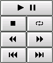
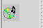
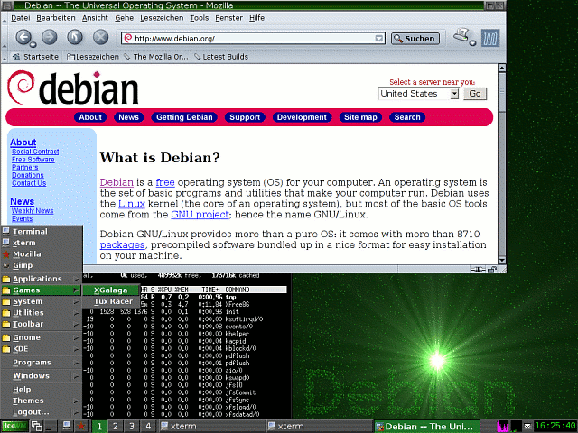

.. selflinux documentation master file, created by
   sphinx-quickstart on Wed Dec 23 13:39:08 2015.
   You can adapt this file completely to your liking, but it should at least
   contain the root `toctree` directive.

Grafische Oberflächen
=====================

K Desktop Environment
---------------------

Die Geschichte von KDE
^^^^^^^^^^^^^^^^^^^^^^

Beschreibung

Obwohl KDE (K Desktop Environment ursprünglich Kool Desktop Environment) nun schon über elf Jahre alt ist, könnte man meinen, erst gestern hätte man sich ob der "Überlegenheit" von GNUstep und CDE noch gefragt, ob das denn was werden würde.... 

Der durchplante Start von KDE
"""""""""""""""""""""""""""""

Das KDE-Logo

Das Projekt wurde am 14. Oktober 1996 von Matthias Ettrich gegründet. Man orientierte sich erst, sowohl vom Funktionsumfang als auch vom Namen her, am damals schon verfügbaren aber proprietären UNIX-Desktop CDE (Common Desktop Environment), setzte aber von Anfang an auf die objektorientierte Programmiersprache C++ und die umfangreiche, bereits vorhandene Oberflächenbibliothek Qt, jene von Trolltech entwickelt wurde.

Die Version 1.0 war am 12. Juli 1998 soweit, dass man sie der Öffentlichkeit präsentieren konnte. Frühere Versionen wurden von der UNIX-Community mit gemischten Gefühlen empfangen: Es hagelte Kritik an der Verwendung eines kommerziellen Programmpaketes (das oben genannte Qt) zur Erstellung eines freien Desktops. Andere Kritiker bemängelten wiederum, dass man statt auf Qt nicht auf Motiv bzw. das freie Pendant LessTif gesetzt hatte, das von den Kritikern als Standard empfunden wurde.

Trotz der ganzen Kritik wurde KDE von den Endbenutzern durchaus positiv aufgenommen und fand den Weg in die ersten Linux-Distributionen. 

Das Projekt "Harmony"
"""""""""""""""""""""

Eine der Konsequenzen der Lizenzdiskussionen war, dass das lange Jahre nur als Idee existierende GNOME Projekt jetzt in Angriff genommen wurde, um einen gänzlich freien Desktop zu erstellen. Ein weiterer Lösungsansatz war, im Rahmen des Projektes Harmony einen freien, aber vollkommen kompatiblen Ersatz für Qt zu entwickeln.

Durch den dadurch entstandenen Druck auf Trolltech, und der Überzeugungsarbeit der KDE-Entwickler, kam es, dass sich Trolltech schliesslich im Juni 1998 dazu entschied, Qt in einer speziellen, freieren Version zur Verfügung zu stellen, die die Ansprüche der Community weitestgehend erfüllte. Die Version wurde damals Qt-Toolkits („Qt Free Edition“) bezeichnet. Als Konsequenz dafür starb das Projekt Harmony, während GNOME als Projekt erfolgreich weitergeführt wurde.

Damit war auch endlich der Weg frei für die Aufnahme von KDE in weiteren Linuxdistributionen, die sich dem bislang, mit Verweis auf die Lizenzproblematik verweigert hatten, und statt dessen GNOME unterstützten. 

Der Durchbruch
""""""""""""""

Der endgültige Durchbruch von KDE kam am 23. Oktober 2000 mit der Version 2.0 (bereits in 20 Sprachen übersetzt). Die Infrastruktur des KDE-Systems wurde komplett überarbeitet. Für Aufsehen sorgte jedoch vor allem Konqueror, der neue Dateimanager und Webbrowser von KDE Um das nachvollziehen zu können, muss man wissen, dass UNIX zu dieser Zeit unter einem Defizit an brauchbaren Webbrowsern litt. Der Netscape Navigator war veraltet und instabil, und Mozilla war noch nicht fertiggestellt. Durch den Konqueror alleine stiegen viele Nutzer, die KDE gegenüber bislang skeptisch eingestellt waren, um.

Als am 3. April 2002 die Version 3.0 in 50 Sprachen erschien, enthielt KDE ein neues Drucker-Framework. Konqueror konnte einfachen JavaScrript-Code verarbeiten und DHTML interpretieren.

Seit der Version 3.1 vom 28. Januar 2003 beherrscht Konqueror Tabbed-browsing (Karteikartenfenster), und KDE erhielt ein sogenanntes Desktop-Sharing-Framework. Damit ist es möglich, einen KDE-Desktop von einem anderen (entfernten) Rechner aus zu bedienen. Dies wird unter anderem auch von Support-Hotlines genutzt (Dies sollte nicht mit der ohnehin vorhandenen Netzwerkfähigkeit des X Window System's verwechselt werden).

Seit dem 3. Februar 2004, als die Version 3.2 auf dem Markt erschien, besitzt KDE die integrierte Groupware mit dem Namen Kontact. Diese Software vereinigt Adressbuch, Wetteranzeige, E-Mail, Kalender, Terminplaner, Newsreader, Geburtstagserinnerung, Notizblock und Aufgabenplaner in einer Applikation.

Mittlerweile stehen hunderte nutzbare KDE-Anwendungen zur Verfügung. Dazu kommen noch etliche mehr, die sich noch in der Entwicklung befinden. 

Autor

    Sandra Fischer maychara@gmx.de
	
Formatierung

    Alexander Fischer tbanus@tbanus.de

KDE-Accessibility
^^^^^^^^^^^^^^^^^

Übersicht über das KDE-Accessibility Paket
""""""""""""""""""""""""""""""""""""""""""

kmag
KMagnifier ist eine Bildschirmlupe. Sie können mit KMagnifier einen Teil des Bildschirms vergrößern, so als würden Sie beim Zeitung lesen eine Lupe für das Kleingedruckte oder das genaue Betrachten eines Fotos benutzen. Diese Anwendung ist für verschiedene Leute interessant: Dazu gehören Künstler, Web-Designer und Menschen mit einer Sehbehinderung. Diese Dokumentation soll ein vollständiges Handbuch für die Benutzung von KMagnifier sein.

kmousetool
KMouseTool emuliert einen Mausklick, sobald der Mauszeiger eine Weile auf der selben Stelle verharrt. Es ist dazu gedacht, Menschen zu helfen, die am Repetitive Strain Injury (RSI) Syndrom leiden und denen jeder Mausklick Schmerzen bereitet.

KMouth
KMouth ist ein Programm, mit dem Sie Ihren Computer für sich sprechen lassen können.

kttsd
KTTS - das KDE Sprachausgabe-System - ist ein auf Plugins beruhender Dienst, der es jeder KDE (oder nicht-KDE) Anwendung ermöglicht, Text über die DCOP-Schnittstelle vorzulesen.
KTTS ist die praktische Anwendung der KDE-Sprachausgabe API.

Für weitere Informationen können Sie den jeweiligen Links der einzelnen Programme folgen. 

Autor

    Frank Börner f.boerner@selflinux.org
	
Formatierung

    Frank Börner f.boerner@selflinux.org

KDE-Addons
^^^^^^^^^^

Übersicht über das KDE-Addons Paket
"""""""""""""""""""""""""""""""""""

kate-plugins
Dies ist das Handbuch für die Plugins von Kate, KDEs Erweitertem Texteditor.

kicker-applets
Dies ist das Handbuch für Miniprogramm-Erweiterungen für Kicker, KDEs Kontrollleiste.

konq-plugins
Dieses Handbuch beschreibt zusätzliche Plugins für Konqueror, den KDE-Dateimanager und Internetbrowser.

Für weitere Informationen können Sie den jeweiligen Links der einzelnen Programme folgen. 

Autor

    Frank Börner f.boerner@selflinux.org
	
Formatierung

    Frank Börner f.boerner@selflinux.org

KDE-Admin
^^^^^^^^^

Übersicht über das KDE-Admin Paket
""""""""""""""""""""""""""""""""""

Das KDE-Admin Paket beinhaltet Programme, die normalerweise nur der Systemadministrator benutzt:

 kcron
KCron ist eine Anwendung, mit der man andere Programme nach einem Zeitplan im Hintergrund laufen lassen kann. Es ist eine graphische Oberfläche für das UNIX-Systemprogramm cron.

kdat
KDat ist ein tar basierendes Backupprogramm.

kfile-plugins
Diese Plugin ermöglicht es, sich Informationen über .deb und .rpm Pakete anzeigen zu lassen.

KPackage
KPackage ist eine graphische Benutzeroberfläche für die RPM-, Debian-, Slackware- und BSD-Paketmanager.

 ksysv
Der KDE System V Init Editor KSysV.

 kuser
Ein Programm zur Verwaltung der Benutzer.

lilo-config
Ein Plugin für das Kontrollzentrum um den Bootmanager Lilo zu konfigurieren.

secpolicy
Ein Programm um PAM Sicherheitsverfahren anzuzeigen.

Für weitere Informationen können Sie den jeweiligen Links der einzelnen Programme folgen. 

Autor

    Frank Börner f.boerner@selflinux.org

	
Formatierung

    Frank Börner f.boerner@selflinux.org

Das Handbuch zu KCron
"""""""""""""""""""""

Beschreibung

KCron ist eine Anwendung, mit der man andere Programme nach Zeitplan starten kann.

Einleitung

.. image:: images/kde_kcron_kcron-gesamt.png

KCron

KCron ist eine Anwendung, mit der man andere Programme nach einem Zeitplan im Hintergrund laufen lassen kann. Es ist eine graphische Oberfläche für das UNIX-Systemprogramm cron. 

Benutzung von KCron

Wichtig

Ihr System muss zuerst den cron-Dämon crond starten, sonst funktioniert KCron nicht.

Starten von KCron

Beim Start von KCron sehen Sie eine Liste bereits eingestellter Aufgaben und dazugehöriger Umgebungsvariablen. Wenn Sie KCron als "root" benutzen, erscheint dies sowohl für alle Benutzer des Systems als auch für systeminterne Aufgaben. Jeder Ordner kann auf- und zugeklappt werden.

.. image:: images/kde_kcron_kcron-start.png

KCron nach dem Start als Benutzer root

Eingeplante Aufgaben

Die eingestellten Aufgaben erscheinen in einem Aufgaben-Ordner. Für jede Aufgabe wird angezeigt:
Name 	Bezeichnung der Aufgabe
Wert 	Programmname und Parameter
Beschreibung 	Ausführliche Beschreibung der eingeplanten Aufgabe

Bei einer deaktivierten Aufgabe werden Programmname und Parameter nicht angezeigt und unter Beschreibung erscheint deaktiviert.

Umgebungsvariablen

Umgebungsvariablen erscheinen in einem Variablen-Ordner. Für jede Variable wird angezeigt:
Name 	Name der Variablen
Wert 	Wert der Variablen
Beschreibung 	Beschreibung der Variablen

Die hier erscheinenden Umgebungsvariablen setzen die sonst bestehenden Umgebungsvariablen für alle aufgeführten Aufgaben außer Kraft. Bei einer deaktivierten Variable erscheint als Beschreibung deaktiviert.

Das Hauptfenster von KCron

Neue Aufgabe hinzufügen

Um eine neue Aufgabe zu erstellen, wählen Sie zuerst den Aufgaben-Ordner an. Gehen Sie dann im Menü zu Bearbeiten->Neu.... Alternativ dazu können Sie auch mit der rechte Maustaste auf den Aufgaben-Ordner klicken und im erscheinenden Kontext-Menü Neu... auswählen, oder einfach Strg+N drücken.

Der Dialog Aufgabe bearbeiten

.. image:: images/kde_kcron_kcron-neue_aufgabe.png

Der Dialog Aufgabe bearbeiten

Kommentar 	Hier können Sie eine Beschreibung der Aufgabe eingeben
Programm 	Geben Sie hier den Namen des zu startenden Programms ein. Sie können entweder einen relativen oder einen absoluten Pfadnamen angeben. Wenn Sie das Programm zuerst suchen möchten, drücken Sie Auswählen...
An 	Ob eine Aufgabe ausgeführt wird, können Sie über das Ankreuzfeld Aktiviert bestimmen
Keine Meldungen 	Schaltet die Ausgabe des Befehls und der Ausgabe des Befehls ab
Monate 	Wählen Sie die Monate aus, in denen die Aufgabe ausgeführt werden soll
Tage im Monat 	Wählen Sie die Tage im Monat aus, an denen die Aufgabe ausgeführt werden soll
Wochentage 	Wählen Sie die Wochentage aus, an denen die Aufgabe ausgeführt werden soll
Täglich 	Wenn die Aufgabe jeden Tag ausgeführt werden soll, wählen Sie Jeden Tag ausführen
Stunden 	Wählen Sie die Stunde(n), zu der die Aufgabe ausgeführt werden soll
Minuten 	Wählen Sie die Minute(n), zu der die Aufgabe ausgeführt werden soll. Mit KCron können Sie die Minuten in Fünferschritten angeben
OK 	Stellt die Aufgabe fertig
Abbrechen 	Bricht die Bearbeitung der Aufgabe ab

Wenn Sie sowohl Monatstag(e) als auch Wochentag(e) angeben, wird die Aufgabe sowohl bei einem passenden Datum als auch an einem passenden Wochentag ausgeführt. Wenn Sie z.B. den 1. und 15. und Sonntag auswählen, wird das Programm am 1. und 15. der gewählten Monate unabhängig vom Wochentag ausgeführt, und außerdem an jedem Sonntag der Monate, egal, auf welches Datum sie fallen.

Die Aufgabe ist erst dann fertig aufgenommen, wenn die crontab gespeichert wurde.

Aufgaben verwalten

Wie bei der Erstellung neuer Aufgaben werden Änderungen erst dann aktiv, wenn die crontab gespeichert wurde.

Aufgaben ausschneiden

Um eine Aufgabe auszuschneiden, wählen sie zuerst die zu entfernende Aufgabe an. Gehen Sie dann zu Bearbeiten->Ausschneiden.

Alternativ dazu können Sie auch mit der rechten Maustaste auf die Aufgabe klicken und Ausschneiden auswählen, oder Sie drücken einfach Strg-X.

Aufgaben kopieren

Um eine Aufgabe zu kopieren, wählen sie zuerst die zu kopierende Aufgabe an. Gehen Sie dann zu Bearbeiten->Kopieren.

Alternativ dazu können Sie auch mit der rechten Maustaste auf die Aufgabe klicken und Kopieren auswählen, oder Sie drücken einfach Strg+C.

Aufgaben einfügen

Um eine Aufgabe einzufügen, muss zuerst eine in die Zwischenablage ausgeschnitten oder kopiert worden sein. Erst dann ist "Einfügen" überhaupt verfügbar. Wählen sie den Aufgaben-Ordner an. Gehen Sie dann zu Bearbeiten->Einfügen.

Alternativ dazu können Sie auch mit der rechten Maustaste auf den Aufgaben -Ordner klicken und Einfügen auswählen, oder Sie drücken einfach Strg+V.

Aufgaben bearbeiten

Um Änderungen an einer Aufgabe vorzunehmen, wählen Sie zuerst eine an. Gehen Sie dann zum Menüpunkt Bearbeiten-> Ändern....

Alternativ dazu können Sie auch mit der rechten Maustaste auf die Aufgabe klicken und Ändern... auswählen, oder Sie drücken einfach Strg+O. Es erscheint dann der Dialog Aufgabe bearbeiten, in dem Sie wie oben beschrieben die gewählte Aufgabe bearbeiten können.

Aufgaben löschen

Um eine Aufgabe zu löschen, wählen Sie die zu löschende Aufgabe an. Gehen Sie dann zum Menüpunkt Bearbeiten-> Löschen.

Alternativ dazu können Sie auch mit der rechten Maustaste auf die Aufgabe klicken und Löschen auswählen.

Aufgaben aktivieren/deaktivieren

Um eine Aufgabe zu aktivieren oder zu deaktiveren, wählen Sie sie an, und bestimmen den Zustand mit dem Menüpunkt Bearbeiten->Aktiviert. Inaktive Aufgaben sind in ihrer Beschreibung mit Inaktiv gekennzeichnet.

Alternativ dazu können Sie auch mit der rechten Maustaste auf die Aufgabe klicken und Aktiviert auswählen. Vergewissern Sie sich nach dem Aktivieren, dass Programmname, Parameter und Beschreibung korrekt angezeigt werden.

Aufgaben starten

Um eine Aufgabe sofort auszuführen, wählen Sie diese aus und gehen Sie dann zu Bearbeiten->Jetzt starten.

Alternativ dazu können Sie auch mit der rechten Maustaste auf die Aufgabe klicken und Jetzt starten auswählen.

Umgebungsvariablen hinzufügen

Um eine neue Umgebungsvariable zu erstellen, wählen Sie zuerst den Variablen-Ordner an. Gehen Sie dann zum Menüpunkt Bearbeiten->Neu....

Alternativ dazu können Sie auch mit der rechten Maustaste auf den Variablen -Ordner klicken und Neu... auswählen, oder Sie drücken einfach Strg+N.

Der Dialog Variablen bearbeiten

Der Dialog Variablen bearbeiten

Variable 	Geben Sie den Namen der Variablen ein. Sie können auch eine aus der Liste der am häufigsten benutzten Umgebungsvariablen wählen; klicken Sie hierzu auf den Pfeil neben dem Feld für den Variablennamen. Dies sind:
HOME
Ordner, der anstelle des normalen Persönlichen Orders des Benutzers verwendet werden soll.
MAILTO
Um E-Mails aus dem aufzurufenden Programm an eine andere als die normale Adresse zu schicken
PATH
Pfadliste, in der nach ausführbaren Programmen gesucht wird.
SHELL
Shell, die anstelle der normalen Shell benutzt wird
Wert 	Geben Sie hier den Wert der Variablen ein. 	
Kommentar 	Geben Sie eine Beschreibung der Variablen ein, also wofür sie verwendet wird. 	
Aktiviert 	Um die Variable zu deaktivieren oder wieder zu aktivieren, klicken Sie auf Aktiviert. 	
OK 	Stellt das Bearbeiten der Variable fertig. 	
Abbrechen 	Bricht die Bearbeitung der Variablen ab 	

Die Umgebungsvariable ist erst dann fertig aufgenommen, wenn die crontab gespeichert wurde.

Umgebungsvariablen verwalten

Wie bei der Erstellung neuer Variablen werden Änderungen erst dann vorgenommen, wenn die crontab gespeichert wurde.

Umgebungsvariablen ausschneiden

Um eine Variable auszuschneiden, wählen sie zuerst die zu entfernende Variable an. Gehen Sie dann zu Bearbeiten->Ausschneiden.

Alternativ dazu können Sie auch mit der rechten Maustaste auf die Aufgabe klicken und Ausschneiden auswählen, oder Sie drücken einfach Strg-X.

Umgebungsvariablen kopieren

Um eine Umgebungsvariable zu kopieren, wählen Sie zuerst die zu kopierende Variable an. Gehen Sie dann zu Bearbeiten->Kopieren.

Alternativ dazu können Sie auch mit der rechten Maustaste auf die Variable klicken und Kopieren auswählen, oder Sie drücken einfach Strg+C.

Umgebungsvariablen einfügen

Um eine Umgebungsvariable einzufügen, muss zuerst eine in die Zwischenablage ausgeschnitten oder kopiert worden sein. Erst dann ist die Option "Einfügen" überhaupt verfügbar. Wählen Sie den Variablen-Ordner an. Gehen Sie dann zu Bearbeiten->Einfügen.

Alternativ dazu können Sie auch mit der rechten Maustaste auf den Aufgaben -Ordner klicken und Einfügen auswählen, oder Sie drücken einfach Strg+V.

Umgebungsvariablen bearbeiten

Um eine Variable zu verändern, wählen sie zuerst die zu bearbeitende Variable an. Gehen Sie dann zu Bearbeiten->Ändern....

Alternativ dazu können Sie auch mit der rechten Maustaste auf die Variable klicken und Ändern auswählen, oder Sie drücken einfach Strg+O.Es erscheint dann der Dialog Variablen bearbeiten in dem Sie wie oben beschrieben die Variable bearbeiten können.

Umgebungsvariablen löschen

Um eine Umgebungsvariable zu löschen, wählen Sie zuerst die Variable an. Gehen Sie dann zu Bearbeiten->Löschen.

Alternativ dazu können Sie auch mit der rechten Maustaste auf die Aufgabe klicken und Löschen auswählen.

Umgebungsvariablen aktivieren/deaktivieren

Um eine Umgebungsvariable zu aktivieren oder zu deaktiveren , wählen Sie sie an, und legen Sie den Zustand mit dem Menüpunkt Bearbeiten->Aktiviert fest. Bei einer deaktivierten Variable erscheint unter "Beschreibung" Deaktiviert.

Alternativ dazu können Sie auch mit der rechten Maustaste auf die Variable klicken und Aktiviert auswählen. Vergewissern Sie sich, dass Name und Wert der Variablen korrekt angezeigt werden.

crontab speichern

Wenn alle Aufgaben und Umgebungsvariablen eingegeben oder verändert wurden, müssen Sie noch die crontab abspeichern. Wählen Sie dazu den Menüpunkt Datei->Speichern.

Alternativ dazu können Sie auch einfach Strg+S drücken. Veränderungen oder Ergänzungen an Aufgaben oder Variablen werden erst dann aktiv.

crontab drucken

Um die gespeicherte Version der crontab auszudrucken, wählen Sie den Menüpunkt Datei->Drucken.

.. image:: images/kde_kcron_kcron-drucken.png

crontab drucken

Es erscheint der Standard-KDE-Druckdialog. Falls man Ausklappen wählt, sieht man, das es zwei zusätzliche KCron-spezifische Optionen im Druckdialog gibt.
Crontab drucken 	Druckt die crontab für den aktuellen Benutzer.
Alle Crontabs drucken 	Druckt die crontab aller Benutzer auf dem System. Diese Option ist nur für Benutzer zugänglich, die erweiterte Berechtigungen besitzen.

Kommando-Referenz

Das Menü Datei
Speichern 	Strg+S 	Speichert Änderungen in der crontab
Drucken 	Strg+P 	Druckt die crontab
Beenden 	Strg+Q 	Beendet KCron

Das Menü Bearbeiten
Ausschneiden 	Strg+X 	Schneidet die ausgewählte Aufgabe oder Variable aus
Kopieren 	Strg+C 	Kopiert die ausgewählte Aufgabe oder Variable in die Zwischenablage
Einfügen 	Strg+V 	Fügt eine Aufgabe oder Variable aus der Zwischenablage ein
Neu... 	Strg+N 	Erstellt eine neue Aufgabe oder Variable
Ändern... 	Strg+O 	Bearbeitet die ausgewählte Aufgabe oder Variable
Löschen 		Löscht die ausgewählte Aufgabe oder Variable
Aktiviert 		Aktiviert die ausgewählte Aufgabe oder Variable
Jetzt starten 		Führt die ausgewählte Aufgabe sofort aus

Das Menü Einstellungen
Werkzeugleiste anzeigen 		Ein-/Ausblenden der Werkzeugleiste
Statusleiste anzeigen 		Ein-/Ausblenden der Statusleiste

Das Hilfe Menü
Inhalt... 	F1 	Startet das Hilfe-System von KDE mit der KCron-Hilfe
Was ist das? 	Umschalt+F1 	Ändert den Mauscursor zu einer Kombination von Zeiger und Fragezeichen. Das Klicken auf ein Element innerhalb von KCron öffnet ein Hilfefenster, das die Funktion des Elementes beschreibt (wenn es denn Hilfe für das bestimmte Element gibt).
Berichten Sie Probleme oder Wünsche... 		Öffnet den Dialog für Problemberichte, in dem man Fehler und Wünsche berichten kann
Über KCron 		Zeigt Versions- und Autoreninformationen an
Über KDE 		Zeigt Versionsinformation und Grundsätzliches zu KDE an

Fragen und Antworten

Warum passiert nichts, wenn ich Aufgaben und/oder Umgebungsvariablen ändere?

Ergänzungen oder Änderungen werden erst dann aktiv, wenn die crontab gespeichert wurde.

Autoren

    Frank Börner f.boerner@selflinux.org
    Robert Schröter robert-schroeter@gmx.de
    Morgan N. Sandquist morgan@pipeline.com
	
Formatierung

    Frank Börner f.boerner@selflinux.org

Das Handbuch zu KSysV
"""""""""""""""""""""

Beschreibung

Dieses Handbuch beschreibt den KDE System V Init Editor KSysV.

Einführung

.. image:: images/kde_ksysv_ksysv-gesamt.png

KDE System V init Editor

Willkommen zum KDE System V init Editor, eher bekannt (und im folgenden auch so benannt) als KSysV. Dieser Abschnitt führt ein paar Konzepte ein und beschreibt, was Sie mit KSysV tun können.

Eine kurze Beschreibung von System V init

Die folgende Erläuterung ist geliehen von tksysv (einer Inspirationsquelle für KSysV)

Die System V init entwickelt sich rasch zum Standard für die Kontrolle von Programmstarts beim Hochfahren des Systems in der Linux Welt. Und zwar deshalb, weil sie leichter zu benutzen, mächtiger und zugleich flexibler ist als die traditionelle BSD-init.

Ich werde hier nicht weiter auf geschichtliche Aspekte eingehen (v.a. weil ich darüber selbst nichts weiß :-).

Die init-Binärdatei liegt unter /sbin und nicht unter /etc. Dies ist deshalb wichtig, weil vielleicht jemand versuchen könnte, eine Maschine auf System V init umzustellen, ohne eine Neuinstallation und Neuformatierung vorzunehmen. Der Linux Kernel sieht zuerst unter /etc nach einer init-Datei. Deshalb müssen Sie sichergehen, dass die alte init von dort entfernt wurde, falls es dort eine gab.

Die SysV init unterscheidet sich auch dadurch von der BSD init, dass sich die Konfigurationsdateien in einem Unterordner von /etc befinden statt direkt in /etc. Dieser Ordner heißt rc.d. Dort finden Sie rc.sysinit und folgende weitere Ordner:

    init.d/
    rc0.d/
    rc1.d/
    rc2.d/
    rc3.d/
    rc4.d/
    rc5.d/
    rc6.d/

init.d enthält eine ganze Menge Skripte. Grundsätzlich benötigen Sie ein Skript für jeden Systemdienst, den Sie beim Hochfahren des Systems bzw. beim Wechsel auf ein anderes Runlevel starten möchten. Systemdienste beinhalten solche Dinge wie Netzwerk, NFS, sendmail, httpd etc. Systemdienste beinhalten dagegen nicht solche Sachen wie setserial, das nur einmal gestartet wird. Solche Aufrufe gehören nach rc.local.

rc.local sollte seinerseits unter /etc/rc.d liegen, wenn Sie es benötigen. Die meisten Systeme besitzen diese Datei, auch wenn es eigentlich nicht viel Verwendung dafür gibt. Sie können ebenfalls ein rc.serial in /etc/rc.d anlegen, wenn Sie beim Hochfahren etwas ausführen lassen wollen, was mit dem seriellen Anschluss zu tun hat.

Der Ablauf ist folgender:

    der Kernel sucht an verschiedenen Stellen nach dem Programm init und startet die erste, die er findet;
    init startet /etc/rc.d/rc.sysinit.
    rc.sysinit tut eine Menge notwendiger Dinge und startet dann rc.serial (wenn es existiert);
    init startet rc.local
    init startet alle Skripte für das voreingestellte Runlevel.

Das standardmäßige Runlevel ist in /etc/inittab eingetragen. Sie sollten im Anfangsbereich eine Zeile wie die folgende sehen:
id:3:initdefault:

An diesem Punkt können Sie einen Blick in die zweite Spalte werfen und wahrscheinlich feststellen, dass das voreingestellte Runlevel 3 ist. Wenn Sie das ändern möchten, dann können Sie /etc/inittab von Hand bearbeiten und die 3 ändern. Seien Sie sehr vorsichtig, wenn Sie an der inittab Änderungen durchführen. Falls Sie doch etwas durcheinandergebracht haben, dann kommen Sie zur Reparatur wieder heran, indem Sie das System neu starten und folgendes ausführen:
LILO boot: linux single

Dies sollte Ihnen ermöglichen, in den Einzelnutzer-Modus zu kommen und die Reparatur vorzunehmen.

Aber wie startet es nun all die richtigen Skripte? Wenn Sie ls -l eingeben in rc3.d, dann sehen Sie wahrscheinlich etwas wie das Folgende:
lrwxrwxrwx 1 root root 13 13:11 S10network -> ../init.d/network
lrwxrwxrwx 1 root root 16 13:11 S30syslog -> ../init.d/syslog
lrwxrwxrwx 1 root root 14 13:32 S40cron -> ../init.d/cron
lrwxrwxrwx 1 root root 14 13:11 S50inet -> ../init.d/inet
lrwxrwxrwx 1 root root 13 13:11 S60nfs -> ../init.d/nfs
lrwxrwxrwx 1 root root 15 13:11 S70nfsfs -> ../init.d/nfsfs
lrwxrwxrwx 1 root root 18 13:11 S75keytable -> ../init.d/keytable
lrwxrwxrwx 1 root root 23 13:11 S80sendmail -> ../init.d/sendmail.init
lrwxrwxrwx 1 root root 18 13:11 S90lpd -> ../init.d/lpd.init
lrwxrwxrwx 1 root root 11 13:11 S99local -> ../rc.local

Sie werden bemerken, das sich in diesem Ordner keine richtigen Dateien befinden. Stattdessen ist jeder Eintrag hier eine Verknüpfung zu einem der Skripte im Verzeichnis init.d.

Die Verknüpfungen haben auch ein S und eine Nummer am Anfang. Das S besagt, dass dieses bestimmte Skript gestartet werden soll, so wie umgekehrt ein K den Stopp bedeuten würde. Die Nummer dient einfach der Anordnung.Tatsächlich startet init alle Systemdienste in der Reihenfolge, in der sie erscheinen. Sie können die Nummern also doppelt vergeben, aber es wird Sie nur selbst durcheinander bringen. Sie benötigen bloß irgendeine zweistellige Zahl, zusammen mit einem großgeschriebenen S oder K um einen Systemdienst zu starten oder anzuhalten.

Wie startet und stoppt init eigentlich Systemdienste? Ganz einfach: Jedes der Skripte ist so geschrieben, dass es ein Argument wie start und stop akzeptiert. Sie können diese Skripte tatsächlich von Hand auf der Kommandozeile folgendermaßen starten:
root@linux /root# /etc/rc.d/init.d/httpd.init stop

Dies würde den httpd-Server anhalten. Init liest einfach den Namen, und wenn der ein K beinhaltet, dann wird das Skript mit dem Argument stop aufgerufen. Wenn er ein S beinhaltet, dann wird das Skript mit dem Argument start aufgerufen.

Warum all diese Runlevel?

Manche Leute wünschen sich eine einfache Art, Maschinen für viele Zwecke einzurichten. Ich könnte z.B. ein "Server"-Runlevel haben, das nur httpd, sendmail, networking etc. laufen lässt. Darüber hinaus könnte ich auch noch ein "Benutzer"-Runlevel haben, das z. B. xdm startet. 

Grundlagen der Bildschirmabläufe

Hier lernen Sie die Benutzung von KSysV. Sie sollte nicht sehr schwierig sein, weil das Programm so benutzerfreundlich wie möglich angelegt wurde.

Maus

Die Verwendung von KSysV mit einer Maus oder einem anderen Zeigegerät ist einfach, um nicht zu sagen trivial: Ziehen Sie einfach einen Eintrag aus dem Bereich der Verfügbaren Systemdienste auf eins der sechs Runlevel, um es auf diesem Level zu starten (bzw. zu stoppen).

Sie können Skripte auch zwischen Runleveln verschieben oder die Position innerhalb eines Levels verändern, indem sie es woanders hin ziehen. Dabei wird der Eintrag von seinem ursprünglichen Runlevel (oder seiner Position) entfernt. Dies geschieht nur dann nicht, wenn sie einen Eintrag aus dem Bereich der Verfügbaren Systemdienste herausziehen.
Anmerkung
Beachten Sie: Einträge werden verschoben, wenn Sie diese in einen neuen Bereich ziehen. Um sie lediglich auf eine neues Runlevel zu kopieren, müssen Sie ausdrücklich Kopieren aus dem Menü Bearbeiten oder aus dem Kontextmenü wählen und in den Zielbereich Einfügen - sogar dann, wenn derselbe Eintrag bereits zuvor im Zielbereich der Aktion existiert hat.

Die "Sortiernummer" eines Eintrags kann manchmal nicht berechnet werden. In so einem Fall müssen Sie die Sortiernummern der umgebenden Einträge bearbeiten, bevor Sie nochmals versuchen können, den Systemdienst einzufügen.
Anmerkung
Beachten Sie: Sortiernummern können von 00 bis 99 reichen, nicht höher.

Sie können Einträge löschen, indem Sie sie in den Papierkorb ziehen.
Warnung
Beachten Sie: Gegenwärtig gibt es keine Möglichkeit, Einträge wiederherzustellen, die in den Papierkorb geworfen wurden. Seien Sie also vorsichtig.

Tastatur

Sie können die Tabulator-Taste benutzen, um die verschiedenen Arbeitsbereiche zu aktivieren (Verfügbare Systemdienste, Runlevel 1 Start, Runlevel 1 Stop etc.) sowie die Cursor-Tasten, um eine Auswahl ober- oder unterhalb der bisherigen zu treffen.

Um einen Eintrag in einen anderen Runlevel zu verschieben schneiden Sie ihn mit Ausschneiden in die Zwischenablage (sie können auch Strg+X benutzen) und fügen Sie ihn in das gewünschte Runlevel mit Einfügen (mit Strg+V).

Um die Sortiernummer oder den Namen eines Eintrags manuell zu ändern, drücken Sie die Eingabe-Taste, um den Eigenschaften-Dialog zu öffnen. Benutzen Sie die Tabulator-Taste, um zwischen verschiedenen Feldern zu wechseln. Schließen Sie den Dialog durch erneutes Drücken der Eingabe-Taste, um die Änderungen zu akzeptieren, oder drücken Sie Esc, um die Änderungen zu verwerfen.

Die Menü-Einträge

Es folgt eine Punkt-für-Punkt-Erläuterung der Menüs von KSysV.

Das Menü Datei

Wegen der Gefahr des Datenverlusts bitten alle Einträge im Menü Datei um Bestätigung, bevor sie ihre Arbeit tun.
Menüpunkt 	Beschreibung 	Tastaturkürzel
Zuletzt gespeicherte Konfiguration 	Alle durchgeführten Änderungen verwerfen und die letzte gespeicherte Konfiguration aufrufen. 	
Öffnen 	Eine gespeicherte Konfiguration laden. 	Ctrl+O
Einstellungen speichern 	Macht Ihre Änderungen dauerhaft wirksam. Es werden keine Sicherungsdateien angelegt. 	Ctrl+S
Speichern unter 	Eine Kopie der neuen Konfiguration speichern. 	
Logdatei speichern 	Speichert den Ablauf der durchgeführten Änderungen. 	Ctrl+L
Logdatei drucken 	Die Logdatei ausdrucken. 	Ctrl+P
Beenden 	Beendet KSysV. 	Ctrl+Q

Das Menü Bearbeiten
Menüpunkt 	Beschreibung 	Tastaturkürzel
Rückgängig 	Macht die letzte nicht gespeicherte Änderung rückgängig. 	Ctrl+Z
Wiederherstellen 	Letzte rückgängig gemachte Aktion wieder herstellen. 	Ctrl+Umschalt+Z
Ausschneiden 	Schneidet den gerade ausgewählten Systemdienst aus und kopiert den Eintrag in die Zwischenablage. 	Ctrl+X
Kopieren 	Kopiert den gerade ausgewählten Systemdienst in die Zwischenablage ohne ihn zu löschen. 	Ctrl+C
Einfügen 	Fügt den Inhalt der Zwischenablage an der aktuellen Cursorposition ein. 	Ctrl+V
Eigenschaften 	Öffnet den Dialog Eigenschaften für den gerade ausgewählten Systemdienst. 	

Das Menü Extras
Menüpunkt 	Beschreibung 	Tastaturkürzel
Systemdienst starten 	Startet den angewählten Systemdienst. 	
Systemdienst anhalten 	Den angewählten Systemdienst anhalten. 	
Systemdienst neu starten 	Den angewählten Systemdienst neu starten. 	
Systemdienst bearbeiten 	Dem angewählten Systemdienst bearbeiten. 	

Das Menü Einstellungen
Menüpunkt 	Beschreibung 	Tastaturkürzel
Werkzeugleiste anzeigen 	Anzeige der Werkzeugleiste ein- und ausschalten. 	
Statusleiste anzeigen 	Anzeige der Statusleiste ein- und ausschalten. 	
Logdatei anzeigen 	Schaltet die Anzeige der Logdatei in einem extra Fenster ein oder aus (alle Vorgänge, Fehlermeldungen, usw. werden in einer Logdatei gespeichert). 	
Einstellungen speichern 	Alle bisher erwähnten Einstellungen gelten nur bis zum nächsten Systemstart, es sei denn, Sie wählen diesen Menüpunkt. Dies gilt einschließlich der Fenstergröße und -aufteilung. 	
Tastenzuordnungen vornehmen 	Die Zuordnungen von Tastendrücken zu Aktionen verändern. 	
Werkzeugleisten einrichten 	Die Werkzeugleisten nach Ihren Wünschen anpassen. 	
SysV-Init Editor einrichten 	Das Verhalten von KSysV anpassen. 	

Das Menü Hilfe
Menüpunkt 	Beschreibung 	Tastaturkürzel
Inhalt 	Startet das Hilfe-System von KDE mit der KSysV-Hilfe (diesem Dokument). 	F1
Was ist das? 	Ändert den Mauscursor zu einer Kombination von Zeiger und Fragezeichen. Das Klicken auf ein Element innerhalb von KSysV öffnet ein Hilfefenster, das die Funktion des Elementes beschreibt (wenn es denn Hilfe für das bestimmte Element gibt). 	Umschalt+F1
Berichten Sie Probleme oder Wünsche 	Öffnet den Dialog für Problemberichte, in dem man Fehler und Wünsche berichten kann. 	
Über KSysV 	Zeigt Versions- und Autoreninformationen an. 	
Über KDE 	Zeigt Versionsinformation und Grundsätzliches zu KDE an. 	

Konfiguration

Alle Einstellungen werden gespeichert in $KDEHOME/share/config/ksysvrc. Voreinstellungen werden der globalen Datei ($KDEDIR/share/config/ksysvrc) entnommen, falls sie verfügbar ist. Andernfalls werden sie von KSysV wiederhergestellt. Änderungen an den Voreinstellungen werden gespeichert in einer lokalen ksysvrc.

Abschnitte und Schlüsselwerte der Konfigurationsdateien, die vom Programm erkannt werden, sowie ihre Voreinstellungen:

[Path Settings]
Schlüsselwort 	Voreinstellung 	Beschreibung
ScriptPath 	/etc/rc.d/init.d 	Pfad zu den Skripten zum Starten und Beenden der Systemdienste.
RunlevelPath 	/etc/rc.d 	Pfad zu den Ordnern für die Runlevel.

[Colors]
Schlüsselwort 	Voreinstellung 	Beschreibung
Changed 	red 	Farbe für geänderte Einträge
New 	blue 	Farbe für neue Einträge

[Geometry]
Schlüsselwort 	Voreinstellung 	Beschreibung
Width 		Breite des Hauptfensters von KSysV
Height 		Höhe des Hauptfensters von KSysV

[andere Einstellungen]
Schlüsselwort 	Voreinstellung 	Beschreibung
ToolBar 	true 	Werkzeugleiste anzeigen?
StatusBar 	true 	Statusleiste anzeigen?
ShowLog 	true 	Logfenster anzeigen?
PanningFactor 	80 	PanningFactor = Prozentualer Fensteranteil, der für das Logfenster reserviert wird. 

Fragen und Antworten

Ich habe mit den Standard-Runleveln herumexperimentiert, und jetzt startet die Maschine beständig neu. Was kann ich tun?
Geben Sie am LILO-Prompt linux single ein und drücken Sie die Eingabe-Taste, um im Einzelnutzer-Modus zu starten. Dann bearbeiten Sie die Datei /etc/inittab und ändern das standardmäßige Runlevel auf einen vernünftigen Wert (3 sollte normalerweise in Ordnung sein).

Meine Maschine "hängt" kurz nach dem Neustart.
Bitte schauen Sie bei Frage 1 nach!

Ich habe einige Systemdienste mit KSysV zur Ausführung unter Runlevel X vorgesehen, aber sie werden nicht ausgeführt.
Wenn Sie SuSE oder Delix (DLD) benutzen, dann müssen Sie zusätzliche Dateien in /etc bearbeiten, die nur in diesen Distributionen vorhanden sind. Bitte lesen Sie die Details im Handbuch der Distribution nach.

Anmerkung
Die Art, wie Systemdienste in diesen Distributionen gestartet werden, vereinfacht die Konfiguration für die proprietären Einrichtungsprogramme dieser Distributionen, entspricht aber leider keinem Standard. Die Autoren von KSysV planen eine Erweiterung des Programms für diesen Ansatz.
Falls Sie eine andere Distribution verwenden: Überprüfen Sie bitte, ob alle Konfigurationsdateien vorhanden sind, die vom jeweiligen Systemdienst benötigt werden (und auch, ob sie sich im richtigen Verzeichnis befinden). Manche Dämonen (wie z. B. Apache bzw. httpd) gehen einfach stumm über Bord, wenn ihre Konfigurationsdateien nicht vorhanden oder falsch eingerichtet sind.

Standardbedeutung der Runlevel

Die Bedeutung der Linux-Runlevel variiert von Distribution zu Distribution, kann sogar von Version zu Version unterschiedlich sein. Falls Sie eine weitere Distribution nutzen, senden Sie mir bitte Informationen über die Runlevel, damit diese diesem Handbuch zugefügt werden können.
Runlevel 	Beschreibung
Runlevel 0 	Halt (fährt die Maschine runter)
Runlevel 1 	Einzelbenutzermodus
Runlevel 2 	Konsolenmodus, ohne NFS
Runlevel 3 	Konsolenmodus mit allen Netzdiensten
Runlevel 4 	Nicht verwendet
Runlevel 5 	Mehrbenutzer-Modus - mit X11 und vollem Netzwerk
Runlevel 6 	Neustart 

Autoren

    Frank Börner f.boerner@selflinux.org
    Volker Dose vpdose@cpmgut.toppoint.de
    Thomas Diehl th.diehl@gmx.net
    Eric Bischoff e.bischoff@noos.fr
    Peter Putzer putzer@kde.org
	
Formatierung

    Florian Frank florian.frank@frankprivat.de
    Frank Börner f.boerner@selflinux.org

Das Handbuch zu KUser
"""""""""""""""""""""

Beschreibung

Diese Dokumentation bezieht sich auf KUser 1.0. Mit diesem Programm können Sie die Benutzer und Gruppen Ihres Systems verwalten. 

Erste Schritte

KUser

Dies ist eine kurze Einführung zu KUser. Umfangreichere Informationen finden Sie unter Benutzung.

Um mit KUser zu beginnen, ist es ausreichend, das Kapitel Anpassung von KUser zu lesen.

Nachdem Sie Änderungen vorgenommen haben, müssen Sie diese speichern. Entweder benutzen Sie dazu das entsprechende Symbol der Werkzeugleiste oder den Eintrag Speichern im Menü Datei.

Benutzung

Hauptfenster

KUser ist eine einfache Anwendung. Das Hauptfenster besteht aus zwei Karteikarten, der Benutzer- und der Benutzergruppenliste. Zum Bearbeiten wählen Sie den gewünschten Benutzer oder die gewünschte Gruppe mit einem Doppelklick auf den Eintrag aus. Es erscheint der Dialog Benutzer- bzw. Gruppeneigenschaften.

Benutzereigenschaften

Der Dialog Benutzereigenschaften kann je nach Systemkonfiguration aus unterschiedlich vielen Karteikarten bestehen.

Einige Karteikarten werden nur dargestellt, wenn Sie erweiterte Systemeinstellungen vorgenommen haben. Erst wenn Sie Platzbeschränkungen (Quota) für Benutzer aktiviert haben, wird eine Karteikarte erzeugt, auf der Sie individuelle Einstellungen vornehmen können. Weitere Karteikarten erscheinen, falls Shadow-Passwörter oder beispielsweise /etc/master.passwd wie in BSD-Unixen installiert sind.

Benutzerinformation

Auf der Karteikarte Benutzerinformation können Sie folgende Einstellungen bearbeiten:

    Benutzer-Id
    Vollständiger Name
    Anmelde-Shell (die Liste der möglichen Einträge stammt aus der Datei /etc/shells)
    Persönlicher Ordner
    Zwei Büroorte
    Adresse
    Passwort

Karteikarte Passwortverwaltung

Die Karteikarte Passwortverwaltung erscheint, falls Shadow-Passwörter oder beispielsweise /etc/master.passwd wie in BSD-Unixen installiert sind.

Hier können Einstellungen zur erweiterten Benutzerverwaltung verändert werden:

    Minimale Anzahl Tage zwischen Passwort-Änderungen
    Anzahl der Tage, nach denen ein Passwort ungültig wird, falls es nicht geändert wird
    Anzahl der Tage der Warnung vor dem Ungültig werden
    Wann und unter welchen Umständen ein Zugang bei ungültigem Passwort deaktiviert wird
    Ein festes Datum, an dem der Zugang ungültig wird
    Klasse (bei BSD-Systemen)

Das Datum der letzten Passwortänderung wird oben im Dialog angezeigt.

Platzbeschränkungen

Diese Karteikarte erscheint nur, falls für mindestens ein eingebundenes Dateisystem Platzbeschränkung (Quota) aktiviert und initialisiert ist (erkennbar an der Datei quota.user/quota.group auf dem Dateisystem). Hier können für jeden Benutzer Parameter verändert werden, wobei die Platzbeschränkungen jeweils Angaben in KB sind:

    Sanfte Platzbeschränkung
    Strenge Platzbeschränkung
    Höchstdauer für Überschreitung der sanften Platzbeschränkung
    Sanfte Beschränkung der Dateianzahl
    Strenge Beschränkung der Dateianzahl
    Höchstdauer für Überschreitung der sanften Beschränkung der Dateianzahl

Diese Parameter können für jedes Dateisystem einzeln eingestellt werden. Das aktuelle Dateisystem wird mit Hilfe des Feldes Dateisystem mit Platzbeschränkung ausgewählt

Gruppen

Die Karteikarte Gruppen informiert über die Gruppenzugehörigkeiten des ausgewählten Benutzers. Die Standardgruppe, zu welcher der Benutzer gehört, findet man im Feld Primäre Gruppe. Weiterhin kann der Benutzer in anderen Gruppen Mitglied werden, indem man diese im großen Feld markiert.

Eigenschaften der Gruppe

Der Dialog Eigenschaften der Gruppe enthält eine Liste aller Benutzer. Um einen Benutzer zur Gruppe hinzuzufügen, markiert man diesen Benutzer in der Liste.

Hinzufügen, Bearbeiten und Löschen von Benutzern oder Gruppen

Um einen Benutzer oder eine Gruppe hinzuzufügen, wählen Sie Hinzufügen aus dem Menü Benutzer oder Gruppe oder klicken Sie auf den passenden Hinzufügen-Knopf der Werkzeugleiste. Das Bearbeiten oder Löschen des ausgewählten Benutzer bzw. der ausgewählten Gruppe funktioniert analog.

Standardeinstellungen für neue Benutzer

Zum Verändern der Standardeinstellungen für neue Benutzer rufen Sie den Dialog Voreinstellungen bearbeiten im Menü Einstellungen->KUser einrichten auf. In diesem Dialog können Sie die Standardeinstellungen ändern, mit denen ein neuer Benutzer erstellt wird: Shell, der Persönliche Ordner (oder das Dateisystem für diePersönlichen Ordner). Außerdem können Sie auswählen, ob ein Persönlicher Ordner bei der Erstellung des Benutzers angelegt wird und ob Vorlagen (Standardkonfigurationsdateien) in den Persönlichen Ordner kopiert werden. Die Einstellung Benutzer der privaten Gruppe erstellt eine eigene Benutzergruppe für jeden neu angelegten Benutzer, die bei der Entfernung des Benutzers wieder gelöscht wird.

Die Standardkonfigurationsdateien für neue Benutzer können auf der Karteikarte Quellen festgelegt werden.

Autoren

    Frank Börner f.boerner@selflinux.org
    Frank Schütte F.Schuette@t-online.de
    Matt Johnston matt@flashmail.com
    Denis Pershin dyp@inetlab.com
	
Formatierung

    Florian Frank florian.frank@pingos.org
    Frank Börner f.boerner@selflinux.org

KDE-Base
^^^^^^^^

Übersicht über das KDE-Base Paket
"""""""""""""""""""""""""""""""""

FAQ
Dieser Text ist eine Zusammenfassung der am meisten gestellten Fragen über das K Desktop Environment.

Kate
Kate ist ein Texteditor für Programmierer für KDE

KControl
Dieses Dokument beschreibt das KDE-Kontrollzentrum.

Kdcop
Kdcop ist ein Programm, mit dem Sie die verfügbaren DCOP-Funktionen erkunden können.

KDebugDialog
Dies ist ein Dialog, um Diagnose-Nachrichten zur Laufzeit einzustellen.

kdeprint
Dieses Handbuch beschreibt die Funktionsweise von KDEPrint. KDEPrint ist kein eigenständiges Programm. Es ist vielmehr das neue Grundgerüst zum Drucken mit KDE. KDEPrint ist eine Art Zwischenschicht zwischen der KDE Anwendung und dem ausgewählten (und installierten) Drucksystem Ihres Betriebssystems.

KDE su
KDE su ist eine graphische Oberfläche für den UNIX-Befehl su.

 kdm
Dieses Dokument beschreibt kdm, den KDE-Anmeldungsmanager.

KFind
KFind dient zur Suche von Dateien in KDE.

KHelpCenter
KDE ist eine umfangreiche graphische Arbeitsumgebung für UNIX-Rechner. Die KDE-Arbeitsoberfläche kombiniert leichte Bedienbarkeit, zeitgemäße Funktionen und hervorragendes graphisches Design mit der technischen Überlegenheit des Betriebssystems UNIX.

Kicker
Die Kontrollleiste ist die Starterleiste für KDE-Anwendungen und enthält außerdem einige nützliche Miniprogramme und Erweiterungen. Sie finden die Kontrollleiste normalerweise am unteren Rand der Arbeitsfläche.

kinfocenter
Dieses Dokument beschreibt das KDE-Infozentrum.

kioslave
Ein/Ausgabe-Module von KDE-Programmen.

Klipper
Klipper ist das Dienstprogramm zum Kopieren und Einfügen in die KDE-Zwischenablage.

Kmenuedit
Kmenuedit ermöglicht das Bearbeiten des Hauptmenüs von KDE (K-Menü).

KNetAttach
KNetAttach ist ein Programm, das die Integration von Netzwerken in den KDE Desktop erleichtert

Konqueror
Konqueror ist der Dateimanager, Internet-Browser und universelle Dokumentenbetrachter von KDE.

Konsole
Konsole ist ein X Window-Terminalemulator für KDE.

KPager
Der KPager zeigt eine Minivorschau aller virtuellen Arbeitsflächen an.

KSplash
KSplash ist eine nette Anwendung, die den Fortschritt des Ladens eines Programmes anzeigt.

KSysguard
KSysguard ist ein netzwerkfähiger Prozess-Verwalter und Systemmonitor mit der zusätzlichen Fähigkeit von  top.

 Kwrite
KWrite ist ein Texteditor für KDE.

Kxkb
Kxkb ist eine Anwendung zum Umschalten der Tastaturbelegung und basiert auf der X11-Erweiterung xkb.

quickstart
Eine Einführung in das K Desktop Environment

userguide
Ein allgemeiner Benutzer Guide für KDE

visualdict
Eine visuelle Einführung zur Benutzeroberfläche von KDE. Dieses Dokument befindet sich in einem frühen Stadium. Es soll letztendlich einmal eine graphische Führung durch KDE werden. 

Autor

    Frank Börner f.boerner@selflinux.org
	
Formatierung

    Frank Börner f.boerner@selflinux.org

Das Handbuch zu kdm
"""""""""""""""""""

Einführung

Der kdm ist eine graphische Schnittstelle, um sich beim System anzumelden. Durch Eingabe von Anmeldekennung und Passwort erfolgt eine Authentifizierung und kdm startet eine "Sitzung". kdm ist ein Ersatz für xdm, den X Display Manager und bietet diesem gegenüber einige Verbesserungen. 

Kurzanleitung

Dies ist eine Kurzanleitung für Benutzer für die folgendes zutrifft:

    X ist eingerichtet und kann mit dem Befehl startx von der Befehlszeile gestartet werden.
    Typischerweise verwendet ein Benutzer nur einen einzigen Fenstermanager bzw eine einzige Desktopumgebung. Geändert wird sie nur selten, und nicht allen Benutzern fällt es leicht, dies über Editieren einer Konfigurationsdatei vorzunehmen.

Diese Einstellungen sind für viele Systeme ausreichend, bei denen ein einzelner Benutzer oder mehre Benutzer üblicherweise zunächst den Computer hochfahren und sich dann anmelden möchten.

Auswählen einer Standardsitzung

    Bearbeiten oder Anlegen der Datei ~/.xinitrc
    Falls Sie bereits über eine funktionierende ~/.xinitrc verfügen, können Sie diesen Schritt überspringen.
    Falls noch nicht vorhanden, fügen Sie ~/.xinitrc eine Zeile hinzu um Ihren Fenstermanager bzw Ihre Desktopumgebung zu starten.
    Für KDE sollten Sie folgendes eingeben:

Autoren

    Steffen Hansen  stefh@dit.ou.dk
    Gregor Zumstein zumstein@ssd.ethz.ch
    Neal Crook nac@forth.org
    Oswald Buddenhagen ossi@kde.org
	
Formatierung

    Frank Börner f.boerner@selflinux.org

Das KWrite-Handbuch
"""""""""""""""""""

Beschreibung

Das KWrite-Handbuch

Thad McGinnis (  ctmcginnis@compuserve.com)

Hauptentwickler und Verantwortlicher: Christoph Cullmann

Korrektur: Lauri Watts

Übersetzer: Matthias Schulz Version 2.00.00

Copyright © 2000, 2001 Thad McGinnis

Es ist erlaubt, dieses Dokument zu kopieren, zu vertreiben und/oder zu ändern gemäß den Bedingungen der GNU Free Documentation License, Version 1.1 oder irgend einer späteren Version, wie sie von der Free Software Foundation veröffentlicht wurde; ohne die invarianten Abschnitte, ohne Texte auf der vorderen Umschlagseite, und ohne Texte auf der hinteren Umschlagseite. Eine Kopie der Lizenz findet sich im Abschnitt "GNU Free Documentation License".

KWrite ist ein Texteditor für die K Deskop Environment (KDE).

Einleitung

KWrite ist mehr als ein Texteditor für die KDE Oberfläche. Es ist als Programmiereditor gedacht und könnte mindestens als teilweise Alternative zu leistungsfähigeren Editoren betrachtet werden. Es kann am besten in Verbindung mit Konqueror für das Darstellen von Quelltext verschiedener Sprachen benutzt werden. KWrite ist auch sehr gut als einfacher Texteditor zu verwenden. Eine der Haupteigenschaften von KWrite ist die farbige Darstellung von Quelltext, angepasst für viele verschiedene Programmiersprachen wie: C/C++, Java, Python, Perl, Bash, Modula 2, HTML, XML und Ada. 

Grundsätzliches

KWrite ist sehr einfach zu nutzen. Jeder, der schon einen Texteditor benutzt hat, sollte keine Probleme haben.

Drag and Drop (Ziehen und Ablegen)

KWrite nutzt das Drag-and-Drop-Protokoll von KDE. Dateien können gezogen und auf KWrite abgelegt werden; von der Arbeitsoberfläche, Konqueror, oder einer FTP-Seite, die in einem Konqueror-Fenster geöffnet ist.

Befehlszeilenargumente

Auch wenn KWrite meistens vom K-Menü oder über ein Arbeitsflächensymbol geöffnet wird, kann es von einer Befehlszeile in einem Terminalfenster gestartet werden. Es gibt hierbei einige nützliche Optionen.

Angabe eines Dateinamens

Der Benutzer kann Pfad und Dateinamen einer Datei angeben, die dann beim Starten von KWrite geöffnet (oder erzeugt) wird. Hierzu ein Beispiel:
user@linux ~$ kwrite /home/myhome/docs/myfile.txt

Angabe eines Dateinamens im Internet

Die oben genannte Methode kann auch benutzt werden, um Dateien im Internet zu öffnen (wenn der Nutzer eine aktive Verbindung hat). Hierzu wieder ein Beispiel:
user@linux ~$ kwrite ftp://ftp.kde.org/pub/kde/Welcome.msg

Andere Befehlszeilenargumente

Die folgenden Hilfe-Möglichkeiten sind über die Befehlszeile verfügbar
user@linux ~$ kwrite --help

Zeigt die grundsätzlichsten Möglichkeiten für die Befehlszeile an.
user@linux ~$ kwrite --help-qt

Zeigt die Möglichkeiten für die Einstellung der Zusammenarbeit von KWrite mit Qt an.
user@linux ~$ kwrite --help-kde

Zeigt die Möglichkeiten für die Einstellung der Zusammenarbeit von KWrite mit KDE an.
user@linux ~$ kwrite --help-all

Zeigt alle Möglichkeiten der Befehlszeile an.
user@linux ~$ kwrite --author

Zeigt die Autoren von KWrite im Terminalfenster an.
user@linux ~$ kwrite --version

Zeigt Versionsinformation für Qt, KDE und KWrite an. Auch verfügbar durch:
user@linux ~$ kwrite -v

Tastenbelegungen

Viele der Tastenfunktionen (Tastenkürzel) sind einstellbar im Einstellungen-Menü. In der Grundeinstellung hat KWrite die folgenden Tastenfunktionen.
Einf 	Umschaltung zwischen Einfüge- und Überschreibmodus. Im Einfügemodus werden alle Zeichen an der Cursorposition eingefügt und alle Zeichen rechts vom Cursor nach rechts verschoben. Im Überschreibmodus werden die Zeichen rechts vom Cursor durch die neu geschriebenen Zeichen ersetzt.
Pfeil links 	Bewegt den Cursor ein Zeichen nach links
Pfeil rechts 	Bewegt den Cursor ein Zeichen nach rechts
Pfeil nach oben 	Bewegt den Cursor um eine Zeile nach oben
Pfeil nach unten 	Bewegt den Cursor um eine Zeile nach unten
Bild aufwärts 	Bewegt den Cursor um eine Seite nach oben
Bild abwärts 	Bewegt den Cursor um eine Seite nach unten
Rücktaste 	Löscht das Zeichen links vom Cursor
Pos1 	Setzt den Cursor an den Zeilenanfang
Ende 	Setzt den Cursor an das Zeilenende
Entf 	Löscht das Zeichen rechts vom Cursor (oder den markierten Text)
Umschalt+Pfeil links 	Markiert Text ein Zeichen nach links
Umschalt+Pfeil rechts 	Markiert Text ein Zeichen nach rechts
F1 	Hilfe
Umschalt+F1 	Was ist das?
Strg+F 	Suchen
F3 	Weitersuchen
Strg+C 	Kopiert den markierten Text in die Zwischenablage.
Strg+M 	Marker hinzufügen
Strg+N 	Neue Datei
Strg+P 	Drucken
Strg+Q 	Beenden - Aktives Editorfenster schließen
Strg+R 	Ersetzen
Strg+S 	Führt den Befehl Sichern aus.
Strg+V 	Inhalt der Zwischenablage einfügen.
Strg+X 	Markierten Text löschen und in die Zwischenablage kopieren.
Strg+Z 	Rückgängig
Strg+Umschalt+Z 	Wiederherstellen

Die Menüpunkte

Das Dateimenü

Datei->Neu ( Strg+N )

Erzeugt eine neue Datei. Wenn eine Datei mit ungesicherten Änderungen geöffnet ist, fragt das Programm, ob diese gespeichert werden soll.

Datei-> Öffnen ( Strg+O )

Öffnen einer Datei. Es wird ein Dialogfenster geöffnet, das zum Navigieren im Dateisystem verwendet werden kann. Das Fenster arbeitet wie ein kleiner Dateimanager. Klicken auf Verzeichnisse im zentralen Fenster öffnet das Verzeichnis und zeigt seinen Inhalt an. Es gibt außerdem ein Eingabefeld, das zur direkten Eingabe von Dateinamen und Pfad benutzt werden kann. Sie können auch auf den Pfeil an der Seite klicken und dann aus den letzten bearbeiteten Dateien auswählen. Darunter ist ein Filter, der benutzt werden kann, um ausschließlich Dateien anzuzeigen, die den Filterregeln entsprechen. Zum Beispiel bewirkt die Filterregel *.txt, dass nur Dateien mit der Endung .txt angezeigt werden. Unterhalb des Filters wird eine Statusleiste mit Information über die Anzahl der Dateien und Unterverzeichnisse im aktuellen Verzeichnis angezeigt.

Die Werkzeugleiste oben im Dialogfeld hat Pfeilknöpfe, die Sie benutzen können, um in schon einmal aufgerufene Verzeichnisse zu wechseln. Der Knopf mit dem Pfeil nach oben bewirkt einen Sprung um eine Ebene nach oben in der Verzeichnishierarchie. Der Knopf mit dem Haus dient zum schnellen Wechsel in das persönliche Verzeichnis des Nutzers und der Knopf mit den kreisförmig angeordneten Pfeilen liest das aktuelle Verzeichnis neu ein. Mit dem Knopf mit der kleinen Fahne können Sie ein Lesezeichen in ein Verzeichnis setzen oder, wenn sie dies schon getan hatten, zu diesem Lesezeichen springen.

Mit dem letzten Knopf können Sie ein neues Verzeichnis erzeugen und einige Grundeinstellungen des Dialogfeldes verändern. Ganz rechts finden Sie ein Auswahlfeld in dem einige häufig genutzte Verzeichnisse zur Auswahl angeboten werden.

Datei->Zuletzt geöffnete Dateien

Ist eine Abkürzung für das Öffnen der letzten bearbeiteten Dateien. Dieser Menüpunkt öffnet eine Liste mit einigen zuletzt bearbeiteten Dateien. Klicken auf eine der Dateien öffnet diese in KWrite - wenn diese Datei noch am selben Ort gespeichert ist.

Datei->Speichern ( Strg+S )

Speichert die aktuelle Datei. Wenn diese noch nicht gesichert war, wird der Speichern unter...-Dialog geöffnet, ansonsten wird ohne Nachfrage überschrieben.

Datei->Speichern unter...

Speichert die Datei unter einem neuen Dateinamen. Die Auswahl des Dateinamens erfolgt durch einen Dialog wie bei  Öffnen beschrieben.

Datei->Drucken... ( Strg+P )

Öffnet ein einfaches Dialogfenster, in dem der Nutzer einstellen kann, was, wo und wie zu drucken ist.

Datei->Neue Ansicht

Dies erzeugt eine neue Ansicht des aktuellen Dokuments von KWrite.

Datei->Beenden ( Strg+Q )

Schließt KWrite. Wenn Sie jedoch mehrere KWrite-Ansichten geöffnet haben, z.B. durch Neue Ansicht oder Neues Fenster werden die anderen KWrite-Ansichten nicht geschlossen.

Das Bearbeitenmenü

Bearbeiten->Rückgängig ( Strg+Z )

Macht die letzte Veränderung im aktuellen Editorfenster rückgängig. Zum besseren Verständnis bitte im Teil  Rückgängig gruppieren dieses Hilfstextes nachlesen.

Bearbeiten->Wiederherstellen ( Strg+Umschalt+Z )

Macht das letzte Rückgängig (wenn vorhanden) rückgängig.

Bearbeiten->Verlauf Rückgängig/Wiederherstellen

Öffnet ein Dialogfenster, das links die letzten Aktionen und rechts rückgängig gemachte Aktionen anzeigt. Auf der rechten Seite gibt es drei Knöpfe: Rückgängig, Wiederherstellen und Schließen. Klicken auf Rückgängig bewirkt, dass die erste Aktion in der Liste rückgängig gemacht und an die Spitze der Wiederherstellen-Liste gesetzt wird. Genauso bewirkt klicken auf Wiederherstellen die Wiederausführung der rückgängig gemachten Aktion an der Spitze der Wiederherstellen-Liste und das Setzen dieser Aktion an die Spitze der Rückgängig-Liste. Wenn Sie auf eine weiter unten in einer der beiden Listen stehenden Aktion klicken, werden alle Aktionen von oben in der Liste bis einschließlich der angeklickten Aktion ausgewählt. Ein anschließendes Klicken auf den zugehörigen Knopf bewirkt das Rückgängigmachen oder die erneute Ausführung der ausgewählten Aktionen. Mit dieser Möglichkeit können Sie direkt zu einem bekannten Punkt in der Bearbeitung zurück- oder vorwärtsgehen, ohne sich mühselig durch einzelne Bearbeitungsschritte durchzuarbeiten.

Bearbeiten->Ausschneiden ( Strg+X )

Schneidet den ausgewählten Text aus und kopiert diesen in die Zwischenablage. Die Zwischenablage ist ein Teil von KDE, das unsichtbar arbeitet und eine Möglichkeit bereitstellt, Daten zwischen Anwendungen zu übertragen.

Bearbeiten->Kopieren ( Strg+C )

Kopiert den ausgewählten Text in die Zwischenablage. Die Zwischenablage ist ein Teil von KDE, das unsichtbar arbeitet und eine Möglichkeit bereitstellt, Daten zwischen Anwendungen zu übertragen.

Bearbeiten->Einfügen ( Strg+V )

Fügt den in der Zwischenablage gespeicherten Text an der Cursorposition ein. Die Zwischenablage ist ein Teil von KDE, das unsichtbar arbeitet und eine Möglichkeit bereitstellt, Daten zwischen Anwendungen zu übertragen.

Bearbeiten->Alles auswählen ( Ctrl+A )

Die gesamte Datei wird ausgewählt. Dies ist besonders zum Kopieren der gesamten Datei in eine andere Anwendung nützlich.

Bearbeiten->Auswahl umkehren

Invertiert die Auswahl von Text: Aller bisher unausgewählter Text wird ausgewählt und aller bisher ausgewählter Text wird freigegeben.

Gehe zu->Gehe zu Zeile... ( Ctrl+G )

Öffnet das Gehe zu-Dialogfenster, das zur Eingabe der Zeilennummer dient, an die der Cursor springen soll. Die Zeilennummer kann direkt eingegeben oder durch die Auf- und Abpfeile erhöht oder verringert werden. Sie können auch den Regler an der Seite verschieben, um zu der gewünschten Seite zu gelangen.

Bearbeiten->Suchen... ( Strg+F )

Öffnet ein Dialogfenster, das zum Steuern der Suche in der Datei verwendet wird. Es gibt ein kleines Textfeld zum Eingeben von Text Gesuchter Text:, das auch als Auswahlfenster verwendet werden kann. Klicken auf den Pfeil macht frühere Suchen verfügbar. Andere Parameter können verwendet werden, um die Suche effizienter zu machen. Die Auswahl von Groß/Kleinschreibung grenzt die Suche ein - nur wenn auch die Groß- und Kleinschreibung mit der Suchphrase übereinstimmt, wird die Textstelle als gefunden gewertet und angezeigt. Rückwärts suchen veranlasst KWrite von unten nach oben zu suchen. Die Option Ausgewählter Text limitiert die Suche auf den ausgewählten Textbereich. Wenn die Option Nur ganze Wörter ausgewählt ist, werden Textstellen, bei denen das gesuchte Wort in einem längeren Wort enthalten ist, nicht angezeigt. Die Option Ab Cursorposition veranlasst KWrite, von der aktuellen Cursorposition an zu suchen und nicht vom Beginn der Datei (oder vom Ende bei gleichzeitig verwendeter Option Rückwärts suchen).

Bearbeiten->Weitersuchen ( F3

Wiederholt die zuletzt ausgeführte Suche, ohne dass erst das Dialogfenster geöffnet wird.

Bearbeiten->Rückwärts suchen ( Shift+F3 )

Wiederholt die zuletzt ausgeführte Suche, ohne dass erst das Dialogfenster geöffnet wird und sucht dabei rückwärts.

Bearbeiten->Ersetzen ( Strg+R )

Öffnet das Ersetzen-Dialogfenster. Die Eingabe der Suchkriterien ist genauso wie bei dem oben erklärten Suche-Dialogfenster. Hinzu kommt das Eingabefeld Ersetzen durch:. Hierin wird der Text eingegeben, der den zu suchenden Text ersetzen soll. Im Ankreuzfeld Vor Ersetzen nachfragen kann eingestellt werden, ob KWrite vor dem Ersetzen an jeder gefundenen Stelle nachfragen oder das Ersetzen für die ganze Datei ohne nochmaliges Nachfragen ausführen soll.

Bearbeiten->Editing Command ( Ctrl+M )

Das Menü Lesezeichen

Gehe zu->Toggle Bookmark ( Ctrl+B )

Gehe zu->Marker löschen

Löscht alle Marker aus der Datei sowie die Markerliste, die am unteren Ende dieses Menüs eingefügt wird.

Am unteren Ende diese Menüs werden die in diesem Fenster vorhandenen Marker angezeigt.

Das Menü Werkzeuge

Werkzeuge->Rechtschreibung...

Ruft die Rechtschreibprüfung - ein Programm zum Finden und Korrigieren von Rechtschreibfehlern - auf. Klicken auf diesen Menüeintrag startet das Rechtschreibprüfungsprogramm und öffnet dessen Dialogfenster, in dem Sie die Ausführung der Rechtschreibprüfung steuern können. Es gibt drei Textfelder in der Mitte des Dialogfensters mit deren zugehörigen Namen links daneben. Diese sind von oben nach unten:

Falsches Wort:

    Hier zeigt das Rechtschreibprüfungsprogramm das aktuell als falsch erkannte Wort an. Dieses Wort hat das Rechtschreibprüfungsprogramm nicht in seinem Wörterbuch gefunden. Das Wörterbuch ist eine Datei, die eine Liste der korrekt geschriebenen Wörter enthält, mit denen das Rechtschreibprüfungsprogramm jedes einzelne Wort des zu prüfenden Textes vergleicht. 

Ersetzung:

    Wenn das Rechtschreibprüfungsprogramm ähnliche Wörter im Wörterbuch findet, wird das erste hier angezeigt. Der Nutzer kann den Vorschlag akzeptieren, eine eigene Korrektur eingeben oder einen anderen Vorschlag aus dem nächsten Feld auswählen. 

Vorschläge:

    Das Rechtschreibprüfungsprogramm listet hier einige mögliche Ersetzungen für das aktuelle Wort auf. Klicken auf eines dieser Worte trägt dieses in das Feld Ersetzung ein. 

Auf der rechten Seite des Dialogfensters sind 6 Knöpfe vorhanden, mit denen der Nutzer den Prüfungsprozess steuern kann. Diese sind im einzelnen:

Ersetzen:

    Ersetzt das falsche Wort durch das Wort im Feld Ersetzung. 

Alle ersetzen:

    Klicken auf diesen Knopf bewirkt, dass alle Vorkommen des im Feld Falsches Wort angezeigten Wortes im gesamten Text mit dem Wort im Feld Ersetzung ersetzt werden. 

Ignorieren:

    Die Rechtschreibprüfung wird ohne Änderungen am aktuellen Wort fortgesetzt. 

Alle ignorieren:

    Klicken auf diesen Knopf setzt die Rechtschreibprüfung ohne Änderungen am aktuellen Wort fort und ignoriert alle weiteren Vorkommen dieses Wortes im gesamten Dokument. 

Anmerkung
Dies gilt nur für den aktuellen Lauf der Rechtschreibprüfung, wenn später noch einmal die Rechtschreibung geprüft wird, wird dasselbe Wort wieder als falsch erkannt.

Hinzufügen

    Klicken auf diesen Knopf fügt das Wort im Feld Falsches Wort zum Wörterbuch hinzu. Dieses Wort wird dann in der Zukunft immer als richtig erkannt. 

Anhalten

    Dieser Knopf stoppt die Rechtschreibprüfung. 

Am unteren Ende des Dialogfeldes liegt ein Balken, der den Fortschritt der Rechtschreibprüfung innerhalb der Datei anzeigt. Dieser Wert wird graphisch und durch Ziffern angezeigt.

Anmerkung
Gleichzeitig wird der Fortschritt der Rechtschreibprüfung in der  Statusleiste des Editors angezeigt. Die Statusleiste ist der liegende Streifen am unteren Rand des Editorfensters unterhalb des Texteingabebereiches.

Zwei weitere Knöpfe befinden sich unter dem Anzeigebalken im Dialogfeld:

Hilfe

    Ruft das KDE-Hilfesystem mit den Informationen zu KWrite auf und zeigt die Seiten, die Sie gerade lesen. 

Cancel

    Dieser Knopf bricht die Rechtschreibprüfung ab. 

Werkzeuge->Einrücken

Erhöht die Einrückung des Abschnittes um einen Schritt. Die Schrittgröße wird in  Persönliche Einstellungen -> Einrücken festgelegt.

Werkzeuge->Einrücken rückgängig

Verringert die Einrückung des Abschnittes um einen Schritt. Die Schrittgröße wird in  Persönliche Einstellungen -> Einrücken festgelegt.

Werzeuge->Einrückungen löschen

Noch nicht verfügbar.

Werkzeuge->Kommentar

Dieser Befehl fügt ein Leerzeichen am Zeilenanfang der aktuellen Zeile oder an den Zeilenanfängen aller markierten Zeilen ein.

Werkzeuge->Kommentar entfernen

Dieser Befehl entfernt (wenn vorhanden) ein Leerzeichen vom Zeilenanfang der aktuellen Zeile oder von den Zeilenanfängen der markierten Zeilen.

Werkzeuge->Einrücken ( Ctrl+I )

Werkzeuge->Einrücken rückgängig ( Ctrl+U )

Werkzeuge->Einrückungen löschen

Werkzeuge->Kommentar ( Ctrl+# )

Werkzeuge->Kommentar entfernen ( Ctrl+Shift+# )

Das Menü Einstellungen

Einstellungen->Werkzeugleiste anzeigen

Schaltet die Anzeige der Werkzeugleiste mit oft benutzten Befehlen ein und aus, die auch verschoben werden kann.

Einstellungen->Statusleiste anzeigen

Schaltet die Anzeige der Statusleiste mit Informationen über den aktuellen Text am unteren Ende des KWrite-Fensters ein und aus.

Einstellungen->Pfad anzeigen

Schaltet die Anzeige des vollständigen Pfades der aktuellen Datei im Kopf des Fensters ein und aus.

Einstellungen->Tastenzuordnungen vornehmen...

Öffnet ein Dialogfenster zum Einstellen der Tastenzuordnungen. Ein Anzeigefenster oben im Dialogfenster zeigt die Liste der verfügbaren Befehle. Darunter befinden sich drei Auswahltasten mit den Funktionen Keine Taste, Standardtaste und Benutzerdef. Tasten. Nur eine der drei Tasten kann gedrückt sein und die Möglichkeit Standardtaste ist nur für Befehle, die ein Standard-Tastenkürzel haben, vorhanden. Wenn die Möglichkeit Benutzerdef. Tasten ausgewählt ist, werden die drei Ankreuzfelder und das Tastensymbol unten in der Dialogbox aktiviert. Hier kann dann der gewünschte Tastenkurzbefehl eingestellt werden.

Beispiel:

Im Anzeigefeld Über KWrite auswählen Strg und Alt ankreuzen, das Tastensymbol anklicken und die Taste K auf der Tastatur drücken - erzeugt die Tastenkombination Strg+Alt+K als Kurzbefehl zum Anzeigen der Über KWrite Information.

Einstellungen->Werkzeugleisten einrichten...

Öffnet eine Dialogbox zum Einstellen der Eigenschaften der Werkzeugleisten. Der Nutzer kann auswählen, welche Aktionen als Symbole in der Werkzeugleiste erscheinen sollen. Das Anzeigefenster links zeigt die Befehle, die in der Werkzeugleiste erscheinen können, das Fenster auf der rechten Seite zeigt die Befehle, die auf der Werkzeugleiste erscheinen werden. Die vier Pfeile zwischen den Anzeigefenstern dienen zum Verschieben des vorher durch einen Klick auf den Eintrag in einem der beiden Fenster auszuwählenden Befehle. Rechts verschiebt den ausgewählten Befehl von der linken in die rechte Liste; dieses wird also zu den anzuzeigenden Befehlen hinzugefügt, Auf und Ab verschieben den ausgewählten Befehl innerhalb der fertigen Werkzeugleiste. Ein in der rechten Liste ausgewählter Befehl wird durch einen Klick auf Links aus der Werkzeugleiste entfernt.

Einstellungen->KWrite einrichten...

Öffnet ein Dialogfenster zur Auswahl von verschiedenen   Einstellungen.

Einstellungen->Symbolrand anzeigen ( F6 )

Schaltet eine Anzeige am linken Rand des Editorfensters ein und aus, die Lesezeichen neben der markierten Zeile anzeigt.

Einstellungen->Vertikale Auswahl ( F4 )

Schaltet die Vertikalauswahl ein und aus. Die Vertikalauswahl erlaubt die Textauswahl nach Spalten, so dass rechteckige Bereiche ausgewählt werden können, die sich nur über bestimmte Spalten und Zeilen ausdehnen.

Einstellungen->Hervorhebungsmodus

Dies erlaubt dem Benutzer den Stil zu wählen, in dem die Farben für den Hervorhebungsmodus benutzt werden. Die Stile werden nach Programmiersprache ausgewählt und werden nicht mit dem Dokument gespeichert.

Einstellungen->Zeilenende

Öffnet ein Untermenü in dem der Typ des "Zeilenendezeichens" das KWrite benutzen soll, ausgewählt werden kann. Zur Auswahl stehen: Unix, Mac® oder MSDOS/Windows®.

Das Menü Hilfe

Hilfe->Inhalt ( F1 )

Ruft das KDE-Hilfesystem mit den Informationen zu KWrite auf und zeigt die Seiten, die Sie gerade lesen.

Hilfe->Was ist das? ( Umschalt+F1 )

Schaltet den Cursor in eine Kombination aus Pfeil und Fragezeichen um. Klicken auf beliebige Bedienungselemente von KWrite öffnet ein Hilfefenster mit Erklärung zu diesem Element - wenn diese existiert.

Hilfe->Berichten Sie Probleme oder Wünsche...

Dies öffnet ein Fenster Problembericht einschicken. Hier können Sie direkt eine E-Mail an die Entwickler von KWrite verfassen. Wählen Sie den Schweregrad und geben Sie (möglichst auf Englisch) einen Problembericht ein. Auch Berichte über (bisher) unerfüllte Wünsche sind hier willkommen.

Hilfe->Über KWrite

Zeigt Versionsinformation, Autor und Lizenzinformationen von KWrite an.

Hilfe->Über KDE

Zeigt Versionsinformation und Grundsätzliches zu KDE an. 

Einrichten von KWrite

Die Auswahl von Einstellungen->Kwrite einrichten - im Menü öffnet das Dialogfenster KWrite einrichten. In diesem Dialogfenster können eine ganze Reihe von Einstellungen vorgenommen werden. Die angezeigten Einstellungsmöglichkeiten hängen von der Auswahl eines links in der Liste angezeigten Symbols ab. Die drei am unteren Rand des Dialogfeldes rufen die Hilfe auf, machen die aktuellen Einstellungen mit OK gültig, oder brechen mit Abbrechen den Einstellungs-Prozess ab. Die zur Auswahl stehenden Kategorien - Farben, Einrücken, Auswählen, Bearbeiten und Rechtschreibung sind nachfolgend erläutert.

Sie können das Hilfesystem aufrufen, die aktuellen Einstellungen mit OK akzeptieren und das Dialogfeld schließen, oder den Knopf Abbrechen benutzen, um das Dialogfeld zu Schliessen, ohne Änderungen zu speichern. Die zur Auswahl stehenden Kategorien - Farben, Schriftart, Einrücken, Auswählen, Bearbeiten und Rechtschreibung sind nachfolgend erläutert.

Farben

In diesem Abschnitt können fünf verschiedene Farbeinstellungen vorgenommen werden. Das Anklicken der speziellen großen Knöpfe öffnet jeweils ein Dialogfeld zum Einstellen der Farbe. Die Knöpfe nehmen die jeweils eingestellte Farbe an.

Im Dialogfeld Farben können Sie einfach und bequem die gewünschte Farbe auswählen. Das rechteckige Feld links oben zeigt ein Spektrum der verfügbaren Farben an. Der Balken gleich rechts daneben zeigt die Helligkeit von der hellsten Einstellung oben bis zur dunkelsten Einstellung unten an. Sie können die gewünschte Farbe durch Klicken auf den Farbton links auswählen und dann die Helligkeit durch Klicken auf den Balken einstellen. Die Werte für die Grundfarben Rot, Grün und Blau sowie Helligkeit und Sättigung werden in numerischer Form in den Feldern links unten angezeigt. Sie können auch die gewünschten Werte direkt hier eingeben. Das kleinen Quadrat unten in der Mitte zeigt die aktuell eingestellte Farbe an. Das Feld unten rechts HTML: zeigt den Farbcode in HTML an, wie er für Webseiten verwendet wird.

Die Pipette rechts dient zum Einfangen einer Farbe irgendwo auf dem Bildschirm. Wenn Sie diesen Knopf anklicken, dann ändert sich das Aussehen des Cursors in ein feines Kreuz. Wenn Sie mit diesem Kreuz dann irgendeinen Punkt auf dem Bildschirm anklicken, dann werden die Einstellungen für die Farbe dieses Punktes übernommen.

Weiterhin gibt es die Möglichkeit, mit dem Knopf Zu eigenen Farben hinzufügen eine eingestellte Farbe zu einer Persönlichen Palette hinzuzufügen. Diese Palette steht zur Verfügung, wenn Sie Eigene Farben im Auswahlfeld rechts oben auswählen. Zusätzlich stehen noch einige vordefinierte Paletten bereit.

Hintergrund

    Stellt die generelle Hintergrundfarbe für KWrite ein. 

Ausgewählt

    Stellt die Hintergrundfarbe ein, die zur Darstellung von ausgewähltem Text verwendet wird. 

Schriftart

Hier können Sie die Schriftart einstellen, die KWrite standardmäßig verwendet. Sie könnenjede im System verfügbare Schriftart auswählen und die Standardgröße und -Codierung einstellen.Das Beispiel am unteren Rand des Dialogfeldes wird in der ausgewählten Schriftart angezeigt, sodass Sie die Auswirkungen von Änderungen sofort sehen.

Einrücken

Automatisch einrücken

    Ankreuzen dieser Option sorgt dafür, dass neue Zeilen genauso eingerückt werden wie die darüberstehende Zeile. Mit Leerzeichen einrücken 

Mit Leerzeichen einrücken

    Anstelle von Tabulatoren werden zum Einrücken Leerzeichen verwendet. Die Anzahl der Leerzeichen wird im Feld Tabulator-Breite in der Sektion   Bearbeiten der Einstellungen... vorgenommen. 

Rücktasten-Ausrückung

    Wenn dieses Feld angekreuzt ist, kann die Rücktaste-Taste zum Ausrücken benutzt werden. 

Tabulator-Einrückung

    Wenn dieses Feld angekreuzt ist, kann die Tab-Taste zum Einrücken benutzt werden. 

Zusätzliche Leerzeichen beibehalten

    Einrückungen von mehr als der voreingestellten Anzahl von Leerzeichen werden nicht gekürzt. 

Auswählen

Durchgehende Auswahl

    Diese Einstellung verhindert, dass durch Eingaben oder Bewegen des Cursors mit den Pfeiltasten die Textauswahl aufgehoben wird. 

Auswahl überschreiben

    Jedes eingegebene Zeichen oder Einfügeoperation ersetzt (überschreibt) den ausgewählten Text. 

Anmerkung
(Beachten Sie: Wenn die Option Auswahl überschreiben aktiv ist, dann ersetzt jedes eingegebene Zeichen oder Einfügeoperation den ausgewählten Text.)

Automatisch mit Maus kopieren

    Text, der mit der Maus ausgewählt wird, wird automatisch in die Zwischenablage kopiert. 

Einfache Auswahl nach dem X11-Standard

    Diese Einstellung wird noch nicht verwendet. 

Vertikale Auswahl

    Wenn diese Option aktiviert ist, erfolgt die   Auswahl in Rechteckform und nicht in ganzen Zeilen, sobald der Cursor vertikal bewegt wird. 

Auswahl umkehren

    Noch nicht verfügbar. 

Bearbeiten

Zeilenumbruch

    Zeilenumbruch ist eine Funktion, die bewirkt, dass der Editor automatisch eine neue Texteile beginnt und den Cursor an den Anfang dieser neuen Zeile verschiebt. Wenn diese Option aktiv ist, beginnt KWrite automatisch eine neue Zeile, sobald die aktuelle Zeile die Länge erreicht, die im Feld  Zeilenumbruch angegeben ist. 

Zeilenumbruch bei:

    Wenn die  Zeilenumbruch Option aktiv ist, bestimmt dieses Feld, beim Erreichen welcher Position KWrite eine neue Zeile beginnt. 

Tabs durch Leerzeichen ersetzen

    Wenn diese Option aktiv ist, ersetzt KWrite eingegebene Tabulatoren durch die im Feld  Tabulator-Breite: eingestellte Anzahl Leerzeichen. 

Tabulator-Breite

    Wenn die Option  Tabs durch Leerzeichen ersetzen aktiv ist, gibt dieses Feld die Anzahl der Leerzeichen an, die an Stelle eines Tabs treten. 

Leerzeichen am Zeilenende entfernen

    Wenn diese Option aktiv ist, entfernt KWrite automatisch alle zusätzlichen Leerzeichen an Zeilenenden. 

Automatische Klammern

    Wenn dies Option aktiv ist, setzt KWrite beim Eingeben einer linken Klammer ([,(, oder {) automatisch eine rechte Klammer des gleichen Typs rechts vom Cursor. Diese braucht dann zum Schließen der Klammer nur noch übersprungen zu werden. 

Rückgängig gruppieren

    Wenn diese Option aktiv ist, werden von KWrite Folgen von gleichartigen Aktionen als ein  Rückgängig:-Schritt angesehen. Wenn Sie Text eingeben, ohne dass die Eingabe durch die Rücktaste oder Cursorbewegungen unterbrochen wurde, entfernt KWrite bei Rückgängig alle seit der letzten Unterbrechung eingegebenen Zeichen auf einmal. 

    Wenn diese Option nicht aktiv ist, betrachtet KWrite jeden Tastendruck als einzelnen Schritt. Zum Entfernen des letzten eingegebenen Wortes wären dann mehrere Rückgängig-Schritte notwendig. Wenn diese Option aktiv ist, werden, wenn Sie Text eingeben, ohne dass die Eingabe durch die Rücktaste oder Cursorbewegungen unterbrochen wurde, bei Rückgängig alle seit der letzten Unterbrechung eingegebenen Zeichen auf einmal entfernt. 

Tabulatoren anzeigen

    Wenn diese Option aktiv ist, zeigt KWrite einen Tabulator im Text durch ein Symbol an. 

Intelligente Pos1-Taste

    Noch nicht verfügbar. 

Bild Auf/Ab bewegt Cursor

    Diese Option ändert das Verhalten der Cursors wenn der Benutzer die Bild auf oder Bild ab Tasten. Wenn nicht aktiviert, bleibt der Text-Cursor an seiner relativen Position innerhalb des sichtbaren Textes in KWrite wenn neuer Text sichtbar wird. Wenn der Cursor also in der Mitte des Textes steht wenn man Bild ab drückt, dann wird der sichtbare Bereich verschoben, aber der Cursor bleibt in der Mitte (außer am Dateianfang oder -ende). Wenn die Option aktiviert ist, wird der Cursor durch den ersten Tastendruck an die erste oder letzte Zeile innerhalb des sichtbaren Bereichs verschoben. 

Cursor folgt Zeilenumbruch

    Wenn diese Option aktiv ist, springt der Cursor an den Anfang der nächsten Zeile, sobald dieser mit der Cursortaste über den rechten Rand der Zeile hinaus bewegt wird. Wenn versucht wird, den Cursor nach links über den Zeilenanfang hinaus zu bewegen, springt dieser an das Ende der vorhergehenden Zeile. Wenn diese Option nicht aktiv ist, springt der Cursor am Zeilenende auf der selben Zeile weiter nach rechts und tut nichts, wenn am Zeilenanfang versucht wird, weiter nach links zu gehen. 

    Wenn diese Einstellung aktiviert ist, dann wird beim Klicken mit dem Mauszeiger nach dem Ende einer Zeile der Cursor an das Ende der Zeile gesetzt. Das verhindert das versehentliche Einfügen von Leerzeichen irgendwo im Text und ist das Standardverhalten der meisten Editoren. 

Anzahl  Rückgängig:

    Dieses Feld gibt die Anzahl der Schritte an, die von KWrite im Speicher für Rückgängig gespeichert werden. Wenn hier 10 steht, heißt das, dass Sie die letzten 10 Schritte mit Rückgängig ungeschehen machen können. Je größer die Anzahl der Schritte ist, desto mehr Speicher wird KWrite für dieses Werkzeug benutzen. 

Kodierung:

    Hier wird der Zeichensatz für Ihre Datei eingestellt. 

Rechtschreibung

Die Rechtschreibprüfung ist ein Programm zum Finden und Berichtigen von Schreibfehlern. In diesem Abschnitt werden die wichtigen Einstellungen hierzu vorgenommen.

Kombinationen aus Wortstamm+Zusätzen erstellen, die nicht im Wörterbuch stehen:

    Bei Auswahl dieser Funktion werden Wortstämme mit Vor- oder Nachsilben als richtig erkannt, auch wenn diese Schreibung nicht im Wörterbuch enthalten ist. 

Zusammengezogene Wörter als Rechtschreibfehler betrachten:

    Bei Auswahl dieser Funktion werden zwei korrekt geschriebene Wörter als Fehler erkannt, wenn sie zusammengeschrieben sind. 

Wörterbuch:

    Abhängig von der spezifischen Installation können mehrere Wörterbücher vorhanden sein. Das Auswahlfeld ermöglicht die Einstellung des von der Rechtschreibprüfung zu benutzenden Wörterbuches. 

Kodierung:

    Hier erfolgt die Auswahl des benutzten Codesystems und des Zeichensatzes, so dass die Rechtschreibprüfung korrekt arbeiten kann. 

Programm:

    Weil KWrite keine eigene Rechtschreibprüfung enthält, muss eine externe Rechtschreibprüfung verwendet werden. Die Einstellungen hierzu erfolgen hier. 

Hervorhebungsmodus

Der Dialog Hervorhebungsmodus einrichten - besteht aus zwei Seiten: Standardstile und Hervorhebungsmodi. Der Nutzer kann die gewünschte Seite durch Klicken auf die entsprechende Karteikarte oben im Dialogfenster aufrufen.

Auf der Seite Standardstile sind folgende Einstellungsmöglichkeiten vorhanden:

Standard-Elementstile
Hier können Sie das Standardaussehen für bestimmte Elemente einstellen. Das erleichtert das Erkennen verschiedener (Typen) von Elementen in Quelltext.
Element

    Dieses Auswahlfeld stellt eine Reihe von Elementen bereit, die der Nutzer eventuell hervorgehoben angezeigt bekommen möchte. Normal für Elemente die nicht in eine der anderen Kategorien passen, Kommentar, Zeichenkette, Stichwort und einige andere sind enthalten. Nicht alle diese Elemente müssen für jede Programmiersprache eingerichtet werden, so dass der Nutzer nur die Elemente, die er braucht, auswählen muss. Die Einstellungen, die in diesem Abschnitt beschrieben werden, werden auf das in diesem Auswahlfeld ausgewählte Element angewendet. 

Normal

    Hier wählt der Nutzer die Farbe für die Normalelemente aus. Dies erfolgt durch ein Farbauswahldialogfenster. Weitere Informationen zu diesem Dialogfenster finden Sie im Abschnitt Farben im Kapitel Einrichten von KWrite. 

Fett

    Aktivieren Sie diese Option, wenn das Element fettgedruckt angezeigt werden soll. 

Kursiv

    Aktivieren Sie diese Option, wenn das Element in Kursivschrift angezeigt werden soll. 

Ausgewählt

    Farbe, die das Element haben soll, wenn es ausgewählt (markiert) ist. Dies erfolgt durch ein Farbauswahldialogfenster. Weitere Informationen zu diesem Dialogfenster finden Sie im Abschnitt Farben im Kapitel Einrichten von KWrite. 

Die Einstellungselemente auf der Hervorhebungsmodiseite erlauben weitreichende Einstellungen, abhängig von der ausgewählten Programmiersprache.

Der Nutzer muss nicht alle vorhandenen Optionen einstellen, Elemente die nicht eingestellt sind, behalten die Standardeinstellung, wie in der Standardseite.

Auswahl einrichten
In diesem Feld wählen Sie den Elementetyp und die Programmiersprache aus, deren Einstellungen Sie verändern wollen. Alle anderen Einstellungen werden auf die hier ausgewählte Sprache angewendet.
Hervorhebung

    Hier wird die einzurichtende Programmiersprache ausgewählt. 

Element

    Hier wird das einzurichtende Element ausgewählt. Beachten Sie, dass sich die Einstellung nur auf dieses Element in dieser Programmiersprache bezieht. 

Wenn Sie das Erscheinungsbild von z.B. "Kommentaren" in C++ einrichten wollen, wählen Sie C++ in der Hervorheben Auswahlbox und dann Kommentar in der Element Auswahlbox. Wenn das Aussehen von Kommentaren in allen Sprachen verändert werden soll, dann muss das Erscheinungsbild in der Standard Seite eingerichtet werden und in den spezielleren Seiten unverändert belassen werden.

Element-Stil
Hier stellt der Nutzer das Aussehen des ausgewählten Elementes ein. Er kann entweder das Ankreuzfeld Standard aktivieren, das die Einstellungen aus der Seite Standards übernimmt, oder das Aussehen direkt hier einstellen. Die Einstellungsmöglichkeiten sind dieselben, wie für die Standardsseite beschrieben: Normal, Ausgewählt, Fett und Kursiv stehen zur Verfügung.

Automatische Hervorhebungen
KWrite kann automatisch einstellen, für welche Hervorhebungen für das geöffnete Dokument angewendet werden sollen. Dies geschieht anhand der Dateinamenserweiterung oder anhand des MIME-Typs der Datei. Wenn häufig mit nicht standardgemäß bezeichneten Dateien gearbeitet wird, kann hier der MIME-Typ oder die Dateinamenserweiterung hinzugefügt werden. Jokerzeichen sind im Feld Dateierweiterungen erlaubt. Z.B. der Standardeintrag für C++ ist *.cpp;*.cc;*.C;*.h. Wenn eine Datei foo.h geöffnet wird, wendet KWrite automatisch die Hervorhebungen für die Programmiersprache C++ an.

Element-Schrift
Hier stellt der Nutzer das Aussehen des ausgewählten Elementes ein.
Es kann entweder das Ankreuzfeld Standard aktiviert werden, das die Einstellungen aus der Seite Standards übernimmt, oder es kann das Aussehen direkt hier eingestellt werden. Die Einstellungsmöglichkeiten sind dieselben, wie für die Standardsseite beschrieben. 

Mitwirkende und Lizenz

KWrite Copyright 2001 by the Kate team.

Basiert auf dem Original-KWrite, das Copyright 2000 by Jochen Wilhelmy (  digisnap@cs.tu-berlin.de) war.

Mitarbeit:

Christoph Cullmann (  cullmann@kde.org)

Michael Bartl (  michael.bartl1@chello.at)

Phlip (  phlip_cpp@my-deja.com)

Anders Lund (  anders@alweb.dk)

Matt Newell (  newellm@proaxis.com)

Joseph Wenninger (  jowenn@bigfoot.com)

Jochen Wilhely (  digisnap@cs.tu-berlin.de)

Michael Koch (  koch@kde.org)

Christian Gebauer (  gebauer@bigfoot.com)

Simon Hausmann (  hausmann@kde.org)

Glen Parker (  glenebob@nwlink.com)

Scott Manson (  sdmanson@altel.net)

John Firebaugh (  jfire@uclink.berkeley.edu)

Diese Dokumentation wurde von Thad McGinnis (  ctmcginnis@compuserve.com) erstellt.

Dieser Version des KWrite-Handbuchs liegt das Original von Cristian Tibirna (  tibirna@kde.org) zugrunde.

In das Docbook-Format überführt und Korrektur gelesen wurde dieses Handbuch von Lauri Watts (  lauri@kde.org)

Übersetzungen von:

Thomas Diehl (  thd@kde.org), GUI-Übersetzung

Matthias Schulz (  matthschulz@linuxfreemail.com), Übersetzung der Dokumentation

Diese Dokumentation ist unter den Bedingungen der GNU Free Documentation License veröffentlicht.

Dieses Programm ist unter den Bedingungen der GNU General Public License veröffentlicht. 

Anhang A. Installieren

KWrite ist Teil des kdebase Paketes. Für mehr Information über das Installieren und Kompilieren von KDE sehen Sie unter en www.kde.org nach. 

Autor

    Christoph Cullmann cullmann@kde.org
	
Formatierung

    Matthias Hagedorn matthias.hagedorn@selflinux.org

KDE-Edu
^^^^^^^

Übersicht über das KDE-Edu Paket
""""""""""""""""""""""""""""""""

FlashKard
Dieses Handbuch beschreibt FlashKard. Karteikarten sind eine einfache Lernmethode für Kinder und Erwachsene und FlashKard nimmt diese Idee vom Papier und verschiebt sie in den Computer. Unendliche Flexibilität wird durch diese Bewegung erreicht.

Kalzium
Kalzium ist ein Programm, das Ihnen das Periodensystem der Elemente (PSE) zeigt. Sie können Kalzium benutzen, nach Informationen über Elemente zu suchen oder um Fakten über das PSE zu lernen.

KBruch
KBruch ist ein kleines Programm, um das Rechnen mit Brüchen zu üben. Für diesen Zweck werden verschiedene Übungen angeboten. Das Programm überprüft die Eingaben des Nutzers und gibt entsprechende Rückmeldungen.

KEduca
KEduca ist eine Karteikartenanwendung, die Ihnen erlaubt, interaktive formularbasierte Tests zu erstellen.

KHangMan
KHangMan ist ein klassisches Galgenmännchenspiel für KDE.

Kig
Kig ist die KDE Anwendung für interaktive Geometrie.

Kiten
Kiten ist ein japanisches Referenz- und Studierwerkzeug für KDE.

klatin
KLatin ist ein KDE-Programm zum Lernen und Lehren von Latein.

KLettres
KLettres ist eine Anwendung, die dafür erstellt wurde, dem Benutzer das Lernen des Alphabets in einer neuen Sprache zu erleichtern und dann anschließend das Lesen von einfachen Silben. Der Benutzer kann ein junges Kind von zweieinhalb sein oder ein Erwachsener, der die Basis einer fremden Sprache lernen möchte.
Fünf Sprachen sind zur Zeit verfügbar: Tschechisch, Dänisch, Holländisch und Französisch und Slowakisch.
KLettres ist einfach zu benutzen. Die Sprache kann über das Menü "Sprache" verändert werden. Der Benutzer kann auch die Stufe von 1 bis 4 in einer Auswahlbox in der Werkzeugleiste auswählen. Letztendlich kann das Aussehen für Kinder oder Erwachsene mittels eines Knopfes in der Werkzeugleise angepasst werden.

KMathTool
KMathTool ist Teil des Paketes kdeedu.

KMessedWords
KMessedWords ist ein einfaches Gedächtnistrainingspiel

KmPlot
KmPlot ist ein mathematischer Funktionsplotter für KDE.

KPercentage
KPercentage ist eine kleine mathematische Anwendung, die Schülern hilft, ihre Fähigkeiten in der Prozentrechnung zu verbessern.

KStars
KStars ist ein graphisches Desktop-Planetarium für KDE. Es stellt eine genaue Simulation des Nachthimmels mit allen Sternen, Sternbildern, Sternhaufen, Nebeln, Galaxien, allen Planeten, der Sonne, dem Mond, Kometen und Asteroiden. Sie können den Himmel sehen, wie er von jedem Standpunkt auf der Erde zu jedem Zeitpunkt aussieht. Die Benutzeroberfläche ist hochgradig intuitiv und flexibel. Die Ansicht kann mit der Maus vergrößert und verschoben werden und Sie können Objekte einfach identifizieren und auf ihrem Weg über den Himmel verfolgen. KStars enthält viele mächtige Funktionen, jedoch ist die Oberfläche einfach und sauber und mit Freude zu benutzen.

KTouch
KTouch ist ein Programm, um das Tippen zu lernen. KTouch bietet Ihnen Text, um ihre Schnelligkeit zu trainieren und verschiedene Schwierigkeitsstufen. Es kann anzeigen, welche Taste Sie als nächste drücken müssen und welchen Finger Sie dazu benutzen sollen.

kturtle
KTurtle ist eine Programmierumgebung zum Lernen mit Logo als Programmiersprache. Das einzigartige Merkmal von LOGO ist die Übersetzung der Befehle in die Muttersprache des 'Programmierers', so das Sie in Ihrer eigenen Sprache programmieren können.

kverbos
Kverbos ist eine Anwendung zum Lernen von spanischen Verbformen.

KVocTrain
KVocTrain ist ein kleines Hilfsmittel, um Ihnen beim Lernen von Vokabeln zu helfen.

kwordquiz
KWordQuiz ist ein Karteikarten- und Vokabellernprogramm für KDE.

Für weitere Informationen können Sie den jeweiligen Links der einzelnen Programme folgen.
  	
Autor

    Frank Börner f.boerner@selflinux.org
	
Formatierung

    Frank Börner f.boerner@selflinux.org

KDE-Games
^^^^^^^^^

Übersicht über das KDE-Games Paket
""""""""""""""""""""""""""""""""""

Atlantik
Atlantik ist ein KDE-Programm für Monopoly®-ähnliche Brettspiele im monopd-Netzwerk.

KAsteroids
KAsteroids ist die KDE-Version des bekannten Spiels um Asteroiden.

KAtomic
KAtomic ist ein kleines, an Sokoban erinnerndes Spiel. Ziel des Spiels ist die Zusammenstellung chemischer Moleküle auf einem Sokoban-ähnlichen Spielfeld.

kbackgammon
KBackgammon ist ein graphisches Backgammon-Programm für KDE. Es unterstützt Backgammon-Spiele mit anderen Spielern, Spiele gegen Computerspieler(wie GNU bg und auch Online-Spiele auf dem ersten de Internet Backgammon Server.

kbattleship
KBattleship ist eine Version des bekannten "Schiffe versenken"-Spiels, die für KDE und für das Spielen im Netzwerk geschrieben wurde.

KBlackbox
KBlackbox ist ein großartiges Logik-Spiel. Angeregt durch das emacs-Blackbox.

KBounce
KBounce ist ein Ballspiel für KDE.

kenolaba
Kenolaba ist ein einfaches Strategiespiel, das man zu zweit spielt.

KFoulEggs
KFoulEggs ist ein Klon des japanischen Spiels PuyoPuyo für KDE.

kgoldrunner
KGoldrunner ist ein Action- und Puzzlespiel. Laufen Sie durch ein Labyrinth, tricksen Sie ihre Feinde aus, sammeln Sie alle Goldklumpen und klettern Sie zur nächsten Spielstufe.

KJumpingCube
KJumpingCube ist ein einfaches Taktikspiel, das Sie gegen einen Freund oder den Rechner spielen können.

klickety
Klickety ist ein Strategie-Spiel für KDE

klines
Kolor Lines ist ein kleines nettes Spiel, das einen für 3 Minuten amüsieren oder 6 Tagen durchgehend fesseln kann.

KMahjongg
KMahjongg ist KDE.-Spiel mit gleichen Paaren von Spielsteinen.

KMines
KMines ist die KDE-Version des klassischen Minesweeper-Spiels.

Kolf
Kolf ist ein Minigolf-Spiel für KDE.

Konquest
Konquest ist ein komplexes Strategie-Spiel um die Weltherrschaft.

kpat
KPatience ist ein hochgradig süchtig machendes Spiel für KDE

KPoker
Das ist die Dokumentation von KPoker, einem kleinen Pokerspiel.

KReversi
KReversi ist ein einfaches Strategiespiel für einen Spieler.

KSame
KSame ist ein kleines nettes Programm, das einen für 3 Minuten amüsieren kann oder 6 Tagen durchgehend fesseln kann.

KShisen
KShisen ist ein Brettspiel für einen Spieler, das dieselben Spielsteine wie Mahjongg benutzt, und auch im Spielablauf daran erinnert.

KSirtet
KSirtet ist eine Implementierung des sehr bekannten Spiels Tetris. Sie müssen die fallenenden Teile zu ganzen Zeilen formen.

KSnake
KSnake ist ein Spiel der Schnelligkeit und Geschicklichkeit. Sie sind eine hungrige Schlange und versuchen alle Äpfel im Raum zu essen, bevor Sie diesen verlassen.

KSokoban
KSokoban ist die KDE-Implementation des Japanischen-Warenhaus-Arbeiter-Spiels "sokoban".

KSpaceDuel
KSpaceDuel ist ein Arkade-Weltraumspiel.
Zwei Raumschiffe kreisen um die Sonne und müssen sich gegenseitig abschießen.

KTron
KTron ist ein einfacher "Tron"-Clone für KDE. Dieses Spiel können Sie allein oder gegen einen Freund spielen.

KTuberling
KTuberling ist ein Spiel für kleine Kinder.

kwin4
Vier gewinnt ist ein Spiel für zwei Spieler

Lieutenant Skat
Offiziersskat ist ein Zwei-Spieler-Kartenspiel. Es wird nach vereinfachten Skatregeln mit zwei Spielern gespielt.

Für weitere Informationen können Sie den jeweiligen Links der einzelnen Programme folgen.
  	
Autor

    Frank Börner f.boerner@selflinux.org
	
Formatierung

    Frank Börner f.boerner@selflinux.org

KDE-Graphics
^^^^^^^^^^^^

Übersicht über das KDE-Graphics Paket
"""""""""""""""""""""""""""""""""""""

Kamera
Kamera ermöglicht das Ansehen und Herunterladen von Bildern einer digitalen Kamera.

KColorEdit
KColorEdit ist ein Editor für Paletten-Dateien. Die Anwendung kann zum Bearbeiten von Farbpaletten und zum Auswählen und Benennen von Farben verwendet werden.

KDVI
KDVI ist ein Plugin für die Anwendung KViewshell.

kgamma
KGamma ist ein einfaches Werkzeug zur Kalibrierung des Monitors.

KGhostView
KGhostView kann Dateien in den Formaten PostScript (.ps, .eps) und Portable Document Format (.pdf) darstellen und drucken.

KIconEdit
KIconEdit wurde entwickelt, um bei der Erstellung von Symbolen für KDE, unter Benutzung der Standard-Symbolpalette, behilflich zu sein.

Kooka
Kooka ist eine sehr nützliche Anwendung zum Scannen unter KDE

KPaint
KPaint ist ein einfaches Bitmap-Malprogramm, das auch benutzt werden kann, um existierende Bilddateien zu verändern und zwischen Bildformaten zu konvertieren.

kpdf
KPDF ist ein KDE PDF Betrachtungsprogramm welches auf xpdf basiert.

KPovModeler
KPovModeler ist ein grafisches 3D Programm, das Scenen für POV-Ray erstellen kann.

KDE Screen Ruler
KDE Screen Ruler kann verwendet werden, um Objekte auf dem Bildschirm zu vermessen.

KSnapshot
KSnapshot ist ein einfaches Programm zum Erstellen von Bildschirmphotos. Es kann entweder den ganzen Bildschirm oder nur Teile davon aufnehmen. Die daraus entstandenen Bilder lassen sich in einer Vielzahl von Formaten abspeichern.

KuickShow
KuickShow ist ein komfortabler Bildbetrachter und -browser.

KView
KView ist ein Programm zur Bildbetrachtung. Es ist klein und schnell und kennt einige einfache Befehle zur Bildbearbeitung. Sie können mit vielen verschiedenen Bildformaten arbeiten und Ihre Bilder in diese Formate umwandeln. KView ist kein komplettes Programm zur Bildbearbeitung, sondern eher für die vielen kleinen Aufgaben (wie die Erstellung eines hübschen Hintergrundes für die Arbeitsfläche) gedacht.

  	
Autor

    Frank Börner f.boerner@selflinux.org
	
Formatierung

    Frank Börner f.boerner@selflinux.org

KDE-Libs
^^^^^^^^

Übersicht über das KDE-Libs Paket
"""""""""""""""""""""""""""""""""

KSpell
KSpell ist das Rechtschreibprogramm, das von den KDE-Programmen wie Kate, KMail und KWord verwendet wird. Es handelt sich um eine Benutzeroberfläche zu International ISpell und ASpell.

  	
Autor

    Frank Börner f.boerner@selflinux.org
	
Formatierung

    Frank Börner f.boerner@selflinux.org

KDE-Multimedia
^^^^^^^^^^^^^^

Übersicht über das KDE-Multimedia Paket
"""""""""""""""""""""""""""""""""""""""

artsbuilder
Dieser Text beschreibt aRts.

JuK
JuK ist eine Jukebox, Meta-Infoeditor" und Manager der Musiksammlung zugleich.

Kaboodle
Kaboodle ist ein einfacher Medienabspieler für KDE.

KMid
KMid ist ein MIDI-/Karaoke-Multimediaspieler

KMix
KMix ist eine Anwendung, die es Ihnen erlaubt, die Lautstärkeeinstellungen Ihrer Soundkarte zu verändern.

KRec
KRec ist eine Aufnahme-Programm für aRts. Es kann jegliche Art von Sound auf dem Computer aufnehmen.

 KsCD
KsCD ist ein kleiner, schneller Audio-CD-Spieler für UNIX-Systeme. Er unterstützt CDDB.

Noatun
Noatun ist ein vielseitiger und erweiterbarer Medienspieler für KDE.

  	
Autor

    Frank Börner f.boerner@selflinux.org
	
Formatierung

    Frank Börner f.boerner@selflinux.org

Das Kscd-Handbuch
"""""""""""""""""

Beschreibung

Jonathan Singer (  jsinger@leeta.net)

David Whitea (  a9403784@unet.univie.ac.at)

Entwickler: Bernd Johannes Wuebben

Entwickler: Dirk Foersterling

Gegengelesen von: Lauri Watts

Übersetzung: Gregor Zumstein

Überarbeitung der Übersetzung: Frank Schütte Version 1.03.02

Copyright © 2000-2001 J Singer

Es ist erlaubt, dieses Dokument zu kopieren, zu vertreiben und/oder zu ändern gemäß den Bedingungen der GNU Free Documentation Licence, Version 1.1 oder irgend einer späteren Version, wie sie von der Free Software Foundation veröffentlicht wurde; ohne die invarianten Abschnitte, ohne Texte auf der vorderen Umschlagseite, und ohne Texte auf der hinteren Umschlagseite. Eine Kopie der Lizenz findet sich im Abschnitt "GNU Free Documentation License".

Kscd ist ein kleiner, schneller Audio-CD-Spieler für Unix-Systeme. Er unterstützt CDDB. 

Einführung

Kscd ist ein schneller CD-Spieler mit CDDB-Unterstützung für Unix. Kscd steht für The KDE Project's small/simple CD player (auf Deutsch also: kleiner/einfacher CD-Spieler des KDE Projekts).

Neu: Das workman2cddb.pl-Perlskript erlaubt es Benutzern von Workman, bequem auf Kscd umzusteigen, ohne Daten neu eingeben zu müssen.
Ich hoffe dass Ihnen das CD-Wiedergabeprogramm gefällt,

Bernd Johannes Wuebben (  wuebben@kde.org)

1.1 Unterstützte Plattformen

Kscd unterstützt die folgenden Systeme:

    Linux
    FreeBSD
    NetBSD
    BSD386
    Sun
    Solaris (mit cdda-Unterstützung)
    HP-UX
    SGI Irix (mit cdda-Unterstützung)
    Sony NEWS
    OSF/1
    Ultrix

und sollte sich auch auf anderen Systemen mit wenigen Änderungen kompilieren lassen. 

Hauptfenster

Grundfunktionen

.. image:: images/kscd_kscd.png

Wenn Sie Kscd starten, sollten Sie so etwas sehen. Die Kontrollelemente dieses Fensters werden unten beschrieben.

Hauptkontrollleiste

Die Funktion dieser Knöpfe sollte jedem bekannt sein, der je einen CD-Spieler bedient hat. Der oberste Knopf in der obenstehenden Abbildung startet das Abspielen bzw. hält es an. Der linke Knopf in der zweiten Reihe stoppt das Abspielen der CD, während der rechts davon die Dauerwiederholung einstellt, so dass nach dem letzten Stück wieder mit dem ersten begonnen wird. Die Knöpfe in der in der dritten Reihe springen 30 Sekunden zurück (links) bzw. vor (rechts); mit den zwei Knöpfen unter der Statusanzeige springt man an den Anfang des vorherigen (links) bzw. nächsten (rechts) Stückes.

Der Knopf CD auswerfen

.. image:: images/kscd_kscd2a.png

Dieser Knopf wirft die CD aus dem CD-Spieler aus. Beachten Sie, dass eventuell der Auswurfknopf Ihres CD-ROM-Laufwerks nicht funktioniert, während sich eine Audio-CD im Laufwerk befindet und Kscd gestartet ist. Einige alte CD-ROM-Laufwerke unterstützen auch keinen softwaregesteuerten Auswurf. Es kann auch sein, dass Sie das CD-Laufwerk manuell schließen müssen, nachdem Sie eine CD eingelegt haben.

Statusanzeige

.. image:: images/kscd_kscd3.png

Von links nach rechts betrachtet finden sich folgende Angaben: Die Hauptzeitanzeige (siehe auch die  Beschreibung der verschiedenen Zeitanzeigemodi), der Status des CD-ROM-Laufwerks, die Gesamtspielzeit der Audio-CD, die aktuelle Lautstärkeeinstellung und die Nummer des gegenwärtigen Stücks bzw. die Gesamtzahl der Stücke (Nr./Ges.). Die untersten beiden Zeilen geben den Künstler und den CD-Titel an, darunter den Titel des Stücks, vorausgesetzt, ein passender Eintrag existiert in der lokalen CD-Datenbank oder in der des Netzwerks (CDDB).

Umschalten des Zeitanzeigemodus

Dieser Knopf schaltet zwischen den möglichen Zeitanzeigemodi um. Standardmäßig zeigt Kscd die verstrichene Zeit des aktuellen Stücks an, falls gerade die Wiedergabe einer CD eingeschaltet ist und entweder -- --:-- -- oder 00:00, falls keine CD abgespielt wird. Wiederholtes Drücken des Knopfes schaltet zwischen den möglichen Anzeigemodi verbleibende Zeit, gesamte bisher verstrichene Zeit und gesamte verbleibende Zeit um.

Der Knopf Einrichtung

.. image:: images/kscd_kscd5.png

Dieser Knopf öffnet die Hauptkontrollleiste von Kscd. In dieser können Sie Kscd für Ihr System konfigurieren. Genauere Informationen zur Konfiguration von Kscd finden Sie unter  Kscd konfigurieren.

Der Knopf CDDB

.. image:: images/kscd_kscd6.png

Dieser Knopf öffnet die Eingabeeditorleiste von CDDB (Compact Disc Data Base). Die CDDB kann ihre CD identifizieren und gegebenenfalls die Stückliste dieser CD herunterladen oder aus dem lokalen Dateisystem einlesen. Genaueres zur Benutzung dieses Werkzeuges erfahren Sie im Abschnitt  CD-Datenbankeditor.

Der Knopf Information

.. image:: images/kscd_kscd7.png

Mit diesem Knopf können Sie Informationen über den Künstler im Internet finden. Sie können Aufführungstermine, Verkaufsinformationen oder andere Informationen abrufen, indem Sie den Knopf betätigen und den entsprechenden Eintrag im erscheinenden Menü auswählen.

Der Programmende-Knopf

.. image:: images/kscd_kscd8.png

Dieser Knopf beendet Kscd.

Der Lautstärkeregler

Dieser Regler steuert die Wiedergabelautstärke der CD. Rechts bedeutet lauter und links leiser. Wenn Sie Ihre CD mit Hilfe ihrer Soundkarte wiedergeben, beeinflusst die Einstellung des Soundkarten-Mixers die Lautstärke ebenfalls.

Der Knopf In zufälliger Reihenfolge abspielen

Dieser Knopf gibt die Stücke der CD in zufälliger Reihenfolge wieder.

Die Stückauswahl

In diesem Listenfeld kann man ein Stück direkt zur Wiedergabe auswählen. 

Einrichtung von Kscd

Das Einrichtungshauptfenster

Das Einrichtungshauptfenster von Kscd ist ein Karteikartendialog mit vier Abschnitten.

Die Karteikarte freedb

.. image:: images/kscd_kscd14.png

Die Karteikarte freedb ermöglicht die Einstellung der CDDB-Funktionen von Kscd.

Das Ankreuzfeld freedb-Zugriff übers Internet schaltet die CDDB-Suche im Internet ein und aus. Sie können die Timeout-Zeit für eine solche Suche einstellen. für die Benutzung eines HTTP-Proxys markieren Sie das Ankreuzfeld HTTP-Proxy für freedb-Zugriff und tragen die URL im Feld unterhalb ein.

Im Feld freedb-Basisverzeichnis können Sie das lokale Verzeichnis angeben, in dem die CDDB-Einträge gespeichert werden sollen.

Das Listenfeld freedb-Server zeigt eine Liste bekannter freedb-Server an. Der ausgewählte Eintrag erscheint in dem Eingabefeld darüber. Klicken Sie auf Aktualisieren, um die Serverliste zu aktualisieren. Klicken Sie auf Standard, um den Standardwert, freedb.freedb.org cddbp 888 -, auszuwählen. Dieser Server erlaubt die Aktualisierung der freedb-Serverliste, die auf der freedb-Hauptseite freedb.freedb.org registriert sind. Klicken Sie auf -, um den ausgewählten Eintrag aus der Liste zu löschen.

Das Feld freedb-Einträge senden an: enthält die E-Mail-Adresse, an die CDDB-Einträge geschickt werden. Fürs Einsenden die Standardadresse (  freedb-submit@freedb.org) verwenden. Seit Version 0.8 werden CDDB-Einträge von Kscd in dieser Datenbank akzeptiert. Klicken Sie auf -, um den ausgewählten Eintrag aus der Liste zu entfernen. Der Knopf Standard restauriert die Standardeinstellungen. Der Knopf Hilfe öffnet die Hilfe zu Kscd (dieses Dokument).

OK speichert die aktuellen Einstellungen und beendet den Einrichtungsdialog; Abbrechen beendet den Dialog ohne speichern.

Die Karteikarte SMTP-Einrichtung

Die Karteikarte SMTP-Einrichtung ermöglicht die Einstellung einer Verbindung zu einem Mail-Server für die Versendung neuer CDDB-Einträge. Diese Einstellungen sind nützlich, wenn Ihr eigenes System nicht als Mail-Server konfiguriert ist. Markieren Sie zur Aktivierung dieser Fähigkeit Übertragung via SMTP ermöglichen. Tragen Sie die Adresse des SMTP-Servers in das obere linke und die Portnummer (typischerweise 25) in das obere rechte Feld ein. Tragen Sie außerdem Ihre E-Mail-Adresse in das untere Eingabefeld ein.

Die Karteikarte KSCD-Einstellungen

.. image:: images/kscd_kscd12.png

Die Felder LED-Farbe und Hintergrundfarbe zeigen die aktuellen Farben der Statusanzeige an. Klicken Sie auf Ändern neben der Farbe, die Sie ändern möchten.

Das Feld CDROM-Gerät enthält den Namen des CD-ROM-Laufwerkes, das für die Wiedergabe von CDs verwendet wird. Die Standardeinstellung ist /dev/cdrom. Die Rechte dieses Gerätes müssen so eingestellt sein, das Sie es zum Lesen öffnen können. Eine Änderung dieser Rechte erfordert in den meisten Fällen Superuser-Rechte. Die Änderung kann von der Kommandozeile oder in Konqueror im Superuser-Modus vorgenommen werden.

Das Feld Unix Mail-Befehl zeigt das Kommando für den Versand neuer CDDB-Einträge an die Datenbank an. Der Standardwert ist mail -s %s. Sie müssen sicherstellen, das dieses Kommando wirklich in der Lage ist, Mail an entfernte Systeme zu schicken, besonders wenn Sie eine Wählverbindung zum Internet haben. Informationen finden Sie in Ihrer Linux-Dokumentation. Einige Distributionen sind so eingerichtet, dass Sie lediglich den Namen des Mail-Server in das Feld "Smart" relay host in der Datei /etc/sendmail.cf eintragen müssen. Die CDDB-Internetseite kontrolliert auch, ob Sie unter angegebenen Absenderadresse erreichbar sind. Sie müssen diese also vermutlich ebenfalls in der Datei /etc/sendmail.cf eintragen. Falls alle Versuche fehlschlagen, verwenden Sie SMTP stattdessen.

Im Abschnitt Web-Browser können Sie festlegen, welchen Web-Browser Sie zum Zugriff auf Internetseiten über den Knopf  Information verwenden wollen. Sie können entweder Konqueror oder einen anderen Browser verwenden. Standardmäßig enthält das Feld Anderen Browser verwenden kfmclient openURL %s.

Das Ankreuzfeld Kurztipps anzeigen schaltet die Kurztipps (kleine Informationsfenster, die erscheinen, wenn die Maus kurz über einem Kontrollelement "pausiert") an und aus.

An Kontrollleiste andocken veranlasst Kscd in der Kicker-Leiste zu erscheinen.

Abspielen beim Schließen der Schublade veranlasst den automatischen Start der Wiedergabe beim Einlegen einer CD, ohne das der Knopf Wiedergabe gedrückt wird.

Abspielen beim Verlassen beenden veranlasst Kscd die Wiedergabe einer CD beim Programmende automatisch anzuhalten.

CD beim Beenden auswerfen veranlasst den automatischen Auswurf der CD am Ende der Wiedergabe.

Zufällige Reihenfolge: Alle Stücke je einmal bedeutet, das der Knopf  Zufällige Stückreihenfolge so wirkt, dass jedes Stück nur genau einmal gespielt wird.

Der Knopf Hilfe öffnet das Inhaltsverzeichnis der Kscd-Hilfeseiten.

OK speichert die aktuellen Einstellungen und beendet den Einrichtungsdialog; Abbrechen beendet den Dialog ohne speichern.

Die Karteikarte Über

Die Karteikarte Über zeigt einige Informationen zur Version von Kscd und zum Copyright an. 

Der CD-Datenbank Editor

Der CD-Datenbank Editor erlaubt die Veränderung, das Herunterladen, die Kommentierung und das Heraufladen von  CDDB (Compact Disc Data Base)-Einträgen.

Falls die die CD in Ihrem CD-ROM-Laufwerk entweder in Ihrem lokalen CDDB-Verzeichnisbaum (siehe auch   CDDB im Abschnitt Einrichtung) oder in der freedb-Datenbank gefunden wurde, werden der Künstlername und der CD-Titel in den Feldern Künstler / Titel und eine Stückliste im Feld Stück / Zeit / Titel angezeigt. Andernfalls sehen Sie eine Liste der Stücknummern und Stücklängen ohne Titel.

Sie können einen Kommentar für die gesamte CD mit Zusatz rechts von Künster / Titel oder für ein bestimmtes Stück rechts von Stücktitel bearbeiten ebenfalls unter Zusatz hinzufügen. Um einen Stücktitel zu ändern, klicken Sie auf den Titel. Er erscheint im Feld Stücktitel bearbeiten. Sie können ihn ändern und durch betätigen von Enter auf der Tastatur wird der geänderte Text an die richtige Stelle in der Stückliste übernommen.

Nachdem Sie alle Stücke mit den richtigen Stücktiteln versehen und das Feld Künstler / Titel ausgefüllt haben, können sie durch Klicken auf Übertragen Ihre Einträge per E-Mail an freedb abschicken.

Sie werden nach einer Kategorie für den Eintrag gefragt. Das Feld CD-Kennung zeigt die 32-Bit-ID an, der von der freedb zur Identifikation der CD verwendet wird. Oberhalb der ID befindet sich der Eintrag für die CDDB-Kategorien. Die Kategorien entsprechen den Unterverzeichnissen des Verzeichnisses, das Sie als freedb-Basisverzeichnis auf der Karteikarte  CDDB des Kscd-Einrichtungsfensters eingetragen haben.

Das Feld Gesamtzeit: zeigt die gesamte Spielzeit der CD an.

Im Stücklisteneditor können Sie die Abspielreihenfolge der CD verändern. Tragen Sie eine durch Kommata getrennte Liste von Stücknummern ein, um eine neue Abspielreihenfolge festzulegen.

Der Knopf Speichern speichert den Eintrag auf der Festplatte. Sie müssen eine Kategorie angeben, unter der dieser Eintrag gespeichert werden soll und abschließend auf OK klicken.

Durch Klicken auf Laden können Sie einen Eintrag von einer anderen Quelle als der lokalen CDDB oder der freedb im Internet laden. Der Knopf Schließen schließt den CD-Datenbank Editor ohne zu speichern. 

Verwendung von Kscd in der KDE-Kontrollleiste

Wenn das Ankreuzfeld An Kontrollleiste andocken markiert ist, wird eine Kscd Miniprogramm in der Kontrollleiste angezeigt. Dieses Miniprogramm ist auf jeder Arbeitsfläche verfügbar. Durch Klicken auf die rechte Maustaste erscheint ein Menü mit Funktionen zur Kontrolle der CD-Wiedergabe durch Kscd. Ein Klick mit der linken Maustaste auf das Miniprogramm versteckt das Hauptfenster von Kscd. Wenn das Hauptfenster versteckt ist, stellt ein zweiter Klick mit der linken Maustaste das Fenster wieder her.

Anmerkung
Um genau zu sein, wird das Miniprogramm in der Programm-Andockleiste angezeigt. Wenn kein Miniprogramm erscheint, wenn Kscd minimiert ist, dann haben Sie die Leiste entfernt. Um sie hinzuzufügen, klicken Sie mit der rechten Maustaste auf einen freien Bereich der Kontrollleiste und wählen Sie Hinzufügen->Erweiterung->Programm-Andockleiste

CDDB-Unterstützung

Die freedb-Datenbank ist eine verteilte Netzwerkdatenbank, die über das Internet erreichbar ist. Sie enthält Informationen über die meisten Audio-CDs, die verfügbar sind. Wenn Sie einen Internetzugang haben, werden Sie vermutlich niemals selbst Stückinformationen für Ihre CDs eintragen müssen. Genaueres zur Konfiguration von CDDB finden Sie im Abschnitt über die Karteikarte  freedb im Kapitel zur Einrichtung von Kscd. Informationen zum ändern von CDDB-Einträgen finden Sie unter  Der CD-Datenbank Editor.

Die Verwendung der CDDB ist kostenlos. Beiträge sind willkommen.

Wenn Sie Beiträge für die CDDB vorbereiten, bedenken Sie bitte folgende Punkte:

    Verwenden Sie einen Standard-Latinzeichensatz in den Einträgen. Einige Sonderzeichen werden unterstützt, aber das kyrillische oder griechische Alphabet für kann für Beiträge nicht akzeptiert werden. Verwenden Sie nur ein /-Zeichen im Feld Künstler / Titel im CD-Datenbank Editor.
    Bei klassischen CDs ist es üblich, den Namen des Komponisten vor dem Schrägstrich und den Namen des Ausführenden hinter dem Schrägstrich einzutragen.
    Wenn Sie einen Eintrag einsenden, der bereits existiert, werden alle zusätzlichen Informationen dem existierenden Eintrag hinzugefügt.

Standardmäßig installiert Kscd die üblichen CDDB Kategorien in $KDEDIR/share/apps/kscd/cddb. Sie können so viele Kategorien erstellen, wie Sie möchten. Wenn Sie allerdings einen Eintrag einsenden möchten, werden nur die Standardeinträge der CDDB angezeigt. Die Standardadresse ist freedb-submit@freedb.org (  freedb-submit@freedb.org). Weitere Informationen über freedb finden Sie auf der freedb-Internetseite.

Der lokale CDDB-Eintrag für eine bestimmte CD wird gespeichert unter Kategorie/CD-Kennung unter dem CDDB-Basisverzeichnis. Diese Dateien können Sie im Bedarfsfall auch mit einem Texteditor bearbeiten.

Fragen und Antworten

Ich sehe ein Dialogfenster beim Start von Kscd. Was mache ich falsch?

Diese Meldung bedeutet, Kscd konnte nicht auf Ihr CD-ROM-Laufwerk zugreifen. Der Gerätename im Feld CDROM-Gerät unter Einrichtung von Kscd muss wirklich das Gerät enthalten, das mit Ihrem CD-ROM-Laufwerk verbunden ist. Es wird sich bei diesem Gerät häufig um eine Verknüpfung zu einem IDE- (/dev/hdx) oder SCSI-Gerät (/dev/sdx) handeln.

Die Gerätedatei gehört normalerweise dem Benutzer root und der Gruppe root. Normale Benutzer dürfen dieses Gerät meistens nicht zum lesen, schreiben oder ausführen direkt öffnen. Das hat nichts mit dem SUID-Programm (Programme, die die Funktion setuid() der Unix-Bibliothek verwenden, um die Identität eines anderen Benutzers anzunehmen) mount zu tun, das keine Probleme mit Berechtigungen hat; Kscd muss in der Lage sein, einen Nur-Lese-Deskriptor für das CD-Gerät zu erhalten, um das CD-ROM-Laufwerk zu kontrollieren und Rohdaten vom Laufwerk einzulesen.

Wenn Sie das root-Kennwort kennen, können Sie die Einstellung leicht korrigieren. Wechseln Sie zu root und tippen Sie chmod a+r /dev/cdrom um jedem Benutzer Leserecht auf /dev/cdrom zu erteilen. Wenn Ihr CD-ROM-Laufwerk einen anderen Namen hat, ändern Sie die Berechtigungen für diese Gerätedatei. Wenn Sie nicht über das root-Kennwort verfügen, bitten Sie Ihren Administrator höflich, Ihnen Leserechte für Ihr CD-ROM-Laufwerk einzurichten.

Genaueres finden Sie im Kapitel  KSCD einrichten

Die CDDB funktioniert nicht. Woher bekomme ich detaillierte Informationen zum genauen Problem?

Wenn Sie Probleme mit CDDB haben, starten Sie Kscd von der Kommandozeile mit der Option -d und werten Sie die Ausgaben aus. 

Mitwirkende und Lizenz

Kscd Copyright 1997,1998 Bernd Johannes Wuebben (  wuebben@kde.org)

Kscd enthält Code von:

workman 1.4 beta 3 Copyright (c) Steven Grimm (  koreth@hyperion.com)

Besonderer Dank gilt Ti Kan und Steve Scherf, den Erfindern des CDDB-Datenbankkonzeptes. Besuchen Sie en  http://www.cddb.com für weitere Informationen über CDDB.

Mein besonderer Dank gilt auch David White, der die ursprüngliche Dokumentation zu Kscd geschrieben hat. Vielen Dank David!

Die Dokumentation wurde für KDE 2.0 überarbeitet un steht unter dem Copyright von Jonathan Singer (  jsinger@leeta.net).

Deutsche Übersetzung der Dokumentation Gregor Zumstein (  zumstein@ssd.ethz.ch)

Aktualisierung der Übersetzung für KDE 2.0 Frank Schütte (  F.Schuette@t-online.de)

Diese Dokumentation ist unter den Bedingungen der GNU Free Documentation License veröffentlicht.

Dieses Programm ist unter den Bedingungen der GNU General Public License veröffentlicht. 

Anhang A. Installation

Woher man Kscd bekommt

Kscd ist Teil des KDE-Projekts en http://www.kde.org.

Kscd können Sie im kdemultimedia-Paket finden auf ftp://ftp.kde.org/pub/kde/, der Haupt-FTP-Site des KDE-Projekts.

Autor

    Jonathan Singer jsinger@leeta.net
	
Formatierung

    Matthias Hagedorn matthias.hagedorn@selflinux.org

KDE-Network
^^^^^^^^^^^

Übersicht über das KDE-Network Paket
""""""""""""""""""""""""""""""""""""

KDict
KDict ist ein grafischer Client für das DICT-Protokoll. Es ermöglicht die Suche eines Wortes oder einer Phrase in einer Wörterbuch-Datenbank und die Anzeige der gefundenen Definitionen.

 KGet
KGet erlaubt die Gruppierung von Dateitransfers. In einigen Fällen kann KGet sogar begonnene Transfers wieder aufnehmen, selbst wenn der Rechner zwischendurch neu gestartet wird.

KgpgCertManager
KgpgCertManager ist ein Werkzeug um X509 Zertifikate zu handhaben.

KNewsTicker
KNewsTicker ist ein Nachrichten-Miniprogramm für die KDE-Kontrollleiste (auch als Kicker bekannt).

Kopete
Kopete ist das Multiprotokoll-Instant-Messengerprogramm von KDE.

kpf
Mit Hilfe von kpf kann man Dateien über ein Netzwerk hinweg gemeinsam benutzen.

KPPP
KPPP ist ein Wähler und Frontend für pppd. Es bietet interaktive Skripterstellung und Netzwerkerstellung.

Remote Desktop Connection
Remote Desktop Connection ist eine Anwendung zur Betrachtung und sogar zur Fernsteuerung der Arbeitsfläche eines anderen Rechners, auf dem ein kompatibler (VNC) Server läuft.

Desktop Sharing
Desktop Sharing ist eine Serveranwendung, welche die gemeinsame Benutzung der aktuellen Sitzung mit einem Benutzer auf einem anderen Rechner ermöglicht, der mit Hilfe eines VNC-Programms den Bildschirminhalt sehen oder sogar die Arbeitsfläche bedienen kann.

KSirc
Diese Dokumentation beschreibt das KDE IRC-Programm KSirc

KTalkd
KTalkd ist ein erweiterter talk-Dämon - ein Programm, mit dem eingehende talk-Anfragen gemeldet werden und von Ihnen mit einem Talk-Programm beantwortet werden können.

kwifimanager
Die Programme von KWiFiManager können zur Einrichtung und Überwachung von Wireless LAN-Karten verwendet werden.

Lisa
LISa stellt eine Art von "Netzwerkumgebung" auf der Grundlage von TCP/IP bereit. Es wird weder SMB noch sonst etwas benötigt.
Dieses Handbuch behandelt sowohl den LAN Informationsserver (LISa) als auch den eingeschränkten (restricted) LAN Informationsserver (resLISa)

  	
Autor

    Frank Börner f.boerner@selflinux.org
	
Formatierung

    Frank Börner f.boerner@selflinux.org

Das Handbuch zu KGet
""""""""""""""""""""

Einleitung

KGet erlaubt die Gruppierung von Dateitransfers. In einigen Fällen kann KGet sogar begonnene Transfers wieder aufnehmen, selbst wenn der Rechner zwischendurch neu gestartet wird.

KGet

Um den Transfer eines Dokuments oder Pakets zu starten, muss man lediglich die URL auf KGet ziehen.

Verwendung von KGet

Einführung zu KGet

In dieser kurzen Einführung werden einige der Funktionen von KGet demonstriert. Die unten aufgeführten drei Programmpakete sollen herunter geladen werden. Das mittlere Paket soll zuerst herunter geladen werden, gefolgt vom oberen und zum Schluß das untere Paket.

Um KGet in den Offline-Modus zu versetzen, klickt man auf worauf das Symbol sich zu ändert.
Klicken Sie zunächst mit der linken Maustaste auf den oberen Eintrag. Halten Sie jetzt die Strg-Taste gedrückt und klicken Sie auf den unteren Eintrag. Es ergibt sich folgendes Bild:

KGet

Durch Klicken auf den Verzögerungsknopf werden diese Einträge nicht herunter geladen.
Klicken Sie jetzt auf den mittleren Eintrag, um ihn hervorzuheben. Dadurch wird gleichzeitig die Hervorhebung des oberen und unteren Eintrags entfernt.

.. image:: images/kget_kget-beispiel-2.png

KGet

Klicken Sie auf, um in den Online-Modus zu wechseln. Daraufhin beginnt KGet mit dem Transfer des mittleren Eintrags.
Klicken Sie auf den oberen Eintrag, halten Sie die Umschalt-Taste gedrückt und klicken Sie auf den unteren Eintrag. Es bietet sich folgendes Bild:

.. image:: images/kget_kget-beispiel-3.png

KGet

Klicken Sie jetzt auf, um die zwei hervorgehobenen Einträge herunter zu laden.

Autoren

    Frank Börner f.boerner@selflinux.org
    Jonathan Drews j.e.drews@att.net
    Frank Schütte F.Schuette@t-online.de
	
Formatierung

    Frank Börner f.boerner@selflinux.org

KDE-Pim
^^^^^^^

Übersicht über das KDE-PIM Paket
""""""""""""""""""""""""""""""""

KDE PIM ist eine Programmmsammlung, welche Ihnen hilft, ihre Mail, Adressen, Aufgaben, Verabredungen usw. zu organisieren. Darüber hinaus stellt es Programme zur Verfügung, um Ihren PDA und ihr Mobiltelefon zu synchronisieren.

KAddressbook
KAddressBook ist das Adressbuch von KDE.

Kandy
Kandy ist ein Programm zur Synchronisierung von Daten zwischen Arbeitsfläche und einem Mobiltelefon.

 KMail
KMail ist das leistungsstarke und benutzerfreundliche E-Mail-Programm von KDE.

KMailcvt
Ein Programm, um Mails von anderen Programmen zu importieren

 KNode
KNode ist ein Newsreader für KDE.

KOrganizer
KOrganizer, der KDE-Terminplaner, ist ein einfach zu bedienender persönlicher Informationsmanager (PIM). Sie können Verabredungen, Termine und Aufgaben eingeben. KOrganizer wird Sie an ausstehende Aufgaben erinnern und Ihnen dabei helfen, Ihren Zeitplan einzuhalten.

KPilot
KPilot ist die KDE-Version des Programms HotSync für den 3Com PalmPilot und ähnliche Produkte.

Kalarm
Kalarm ist ein Programm das Alarmmeldungen auf den Desktop ausgibt.

Kalarmd
Kalarmd ist der Alarmdämon. Dieses Programm ist im Hintergrund aktiv, überwacht festgelegte Alarmzeiten und veranlasst KAlarm, zum entsprechenden Zeitpunkt Nachrichten anzuzeigen.

Kontact
Kontact vereinigt alle notwendigen Programme für Ihre persönlichen Informationen. Es kombiniert bekannte KDE Anwendungen wie KMail, KOrganizer und KAddressBook in eine einzige Oberfläche.

KArm
KArm misst die Zeit, die für verschiedene laufende Aufgaben benötigt wird.

Kitchensync
Synchronisierungswekzeuge, die sich noch in der Entwicklung befinden.

KFile-plugins
vCard KFileItem plugin.

KNotes
KNotes sind die Post-It's(R) für die Arbeitsfläche.

KonsoleCalendar
KonsoleCalendar ist ein Konsolenprogramm für die KDE-Kalender.

KOrn
KOrn ist ein Mail-Benachrichtigungsprogramm, das sich selbst in Kicker eindockt und etliche Typen von Postfächern überwachen kann.

Akregator
Akregator ist ein Programm, um RSS und andere Newsfeeds zu lesen.

Für weitere Informationen können Sie den jeweiligen Links der einzelnen Programme folgen.
  	
Autor

    Frank Börner f.boerner@selflinux.org
	
Formatierung

    Frank Börner f.boerner@selflinux.org

Dokumentation zu Kmail
""""""""""""""""""""""

Schnelleinstieg

Dieser Abschnitt ist eine kurze Einführung in KMail und seine Benutzung, so dass Sie gleich damit arbeiten können! Für weitergehende Informationen sehen Sie bitte im Abschnitt KMail benutzen nach.

Der erste Aufruf von KMail erstellt in Ihrem Persönlichen Verzeichnis ein Verzeichnis namens Mail, das die notwendigen Mailordner (inbox, outbox, sent-mail und trash) enthält. Benutzen Sie das Menü "Einstellungen" -> "KMail einrichten", um einige Informationen einzugeben, die KMail benötigt, um Ihre Nachrichten korrekt empfangen und versenden zu können.

Der Einstellungen-Dialog besteht aus sechs Karteikarten: Identitäten, Netzwerk, Erscheinungsbild, Nachrichten erstellen, Sicherheit und Ordner.

Um Nachrichten senden und empfangen zu können, müssen Sie nur einige Einstellungen auf den Seiten Identitäten und Netzwerk ändern.

Einstellen Ihrer Identität

Die Einstellungen unter Identitäten sind ziemlich klar. Wählen Sie die Standardidentität aus und klicken Sie auf "Ändern". Füllen Sie nun das Feld Name mit Ihrem vollen Namen (z.B. Martin Mustermann) aus. Das Feld Organisation ist optional. Als nächstes tragen Sie bitte Ihre E-Mail-Adresse (also z.B. Jemand@Irgendwo.de) in das Feld E-Mail-Adresse ein. Falls Sie PGP oder GnuPG benutzen füllen Sie bitte das Feld OpenPGP-Nutzeridentität auf der Karteikarte "Erweitert" entsprechend aus. Optional kann man auf der Karte "Signatur" noch eine Signatur eintragen. Dabei handelt es sich um einen kurzen Text, der an alle eigenen Nachrichten angehängt wird.

Einrichtung der Postfächer

Die Seite "Netzwerk" enthält die Festlegungen, wie KMail Ihre Nachrichten verschicken oder empfangen soll. Viele dieser Einstellungen hängen stark von Ihren System-Einstellungen ab, sowie von der Art des Netzwerks, über das Sie Ihren Mail-Server erreichen. Falls Sie nicht wissen, welche Einstellungen Sie wählen sollen oder was Sie in ein Feld eintragen müssen, fragen Sie Ihren Internet Service Provider (ISP) oder Ihren Systemverwalter.

Versenden von Nachrichten

Die Karteikarte "Versand" stellt eine Anzahl Möglichkeiten zum Versand von Nachrichten bereit. Der erste Listeneintrag ist die Standardmethode des Nachrichtenversandes. Mit dem Knopf "Hinzufügen..." kann man zwischen zwei verschiedenen Methoden des Versands wählen, nämlich SMTP und Sendmail. Dabei bezieht sich sendmail® auf eine lokale Installation - dieses Programm hat den Ruf, schwierig zu konfigurieren zu sein. Falls man also nicht bereits eine funktionierende Konfiguration für sendmail® hat, sollte man hier SMTP wählen und das Feld "Name" mit einem beschreibenden Namen ausfüllen (z.B. Mein E-Mail-Konto). Das Feld "Server" muss mit dem Namen und der Domäne des Mail-Servers (z.B. smtp.provider.com) ausgefüllt werden. Die Einstellung des Feldes Port muss selten geändert werden (Standardwert: 25).

Falls Sie sendmail benutzen wollen und eine Wählverbindung verwenden, folgen Sie den Anweisungen zum Einrichten von sendmail für eine Wählverbindung im Abschnitt FAQ.

Die hier eingestellte Versandart wird für die Standard-Identität und alle die Identitäten verwendet, für die keine eigene Versandart angegeben wurde. Man kann für verschiedene Identitäten unterschiedliche Arten für den Nachrichtenversand durch Markieren von Spezielle Versandart - im Abschnitt "Erweitert" auf der Karteikarte Identitäten bestimmen.

Eine Beschreibung der weiteren Einstellmöglichkeiten befindet sich im Kapitel Einrichtung.

Empfang von Nachrichten

Um einen Zugang für den Empfang von E-Mail einzurichten, klickt man "Hinzufügen..." auf der Karteikarte Empfang. Man hat die Wahl, welche Zugangsart man einstellen möchte. In den meisten Fällen ist das entweder POP3 oder IMAP. Falls man ein lokales Postfach verwenden möchte findet man wichtige Informationen unter FAQ über das Sperren von Dateien.

Es erscheint der Dialog "Postfach hinzufügen". Geben Sie zuerst einen Namen für das Postfach im Feld Name an. In die Felder Benutzer, Passwort und Rechner muss man die entsprechenden Informationen eingeben, die man vom eigenen Internet-Anbieter (ISP) oder vom Systemverwalter erhalten haben sollte. Wieder sollte es nicht nötig sein, die Einstellung von Port zu ändern (der Standard für POP3 ist 110, der Standard für IMAP ist 143).

Optionen, die nur IMAP betreffen

Falls man IMAP auswählt, kann man optional einen Pfad im Feld Präfix für Ordner angeben. Damit legt man fest, wo KMail die Verzeichnisse des Benutzers auf dem Server findet. Falls man einen Shell-Zugang auf diesem Rechner besitzt und die Nachrichten im Persönlichen Verzeichnis gespeichert sind, ist es sinnvoll, sie in einem Unterverzeichnis Mail zu speichern. Damit KMail Nachrichten-Verzeichnisse und andere Dateien nicht mischt, sollte man diesen Pfad bei Präfix für Ordner verwenden. Falls man daran nicht interessiert ist, lässt man das Feld einfach leer.

Wenn man Ordner automatisch komprimieren markiert, entfernt KMail die entsprechenden Nachrichten vom Server, sobald der Benutzer das Verzeichnis verlässt. Ansonsten bleiben die Nachrichten nur zur endgültigen Löschung markiert und man muss sie manuell durch Auswahl von "Datei" -> "Alle Ordner komprimieren" entfernen.

Falls man "Versteckte Verzeichnisse anzeigen" aktiviert, werden auch die Verzeichnisse angezeigt, deren Name mit einem Punkt beginnt.

Optionen, die nur POP3 betreffen

Wählen Sie Nachrichten nach dem Abholen vom Server löschen, falls Sie Ihre Nachrichten nach dem Herunterladen nicht auf dem Server lassen wollen.

Um einen Zugang von der automatischen Überprüfung auszunehmen, die durch "Datei" -> "Nach E-Mail sehen..." ausgelöst wird, aktiviert man Von "Nach E-Mail sehen" ausnehmen. Man kann dennoch manuell nach neuen Nachrichten für diesen Zugang suchen lassen durch "Datei" -> "Nach Mail sehen in".

Wählen Sie Posteingang regelmäßig überprüfen falls Sie möchten, dass KMail automatisch auf neue Nachrichten prüft. Der Zeitraum kann unter "Prüfintervall" eingestellt werden.

Posteingang ist der Standardordner für eingehende Nachrichten. Falls Sie dies aus irgendeinem Grund ändern wollen, können Sie dies über Zielordner tun. Aber normalerweise sollten Sie Filter benutzen, was nichts mit dieser Option zu tun hat.

Unter "Vorverarbeitungs-Befehl" kann man ein beliebiges Programm angeben, das von KMail vor dem Abrufen von E-Mail ausgeführt werden soll. Man muss hier den ganzen Pfad angeben (hier darf keine ?~" verwendet werden). KMail fährt mit der Programmausführung erst fort, wenn das externe Programm beendet ist.

Auf der Karteikarte "Extras" kann man "Pipelining" für schnelleres Herunterladen aktivieren, falls diese Einstellung vom Server unterstützt wird. Man sollte die zuverlässige Arbeitsweise dieser Funktion ausreichend testen.

Einstellungen für IMAP und POP3

Wenn man POP-Passwort in Konfigurationsdatei speichern bzw. IMAP-Passwort in Konfigurationsdatei speichern auswählt, speichert KMail das Passwort. Man muss es also nicht jedes Mal eintippen, wenn man mit KMail neue E-Mails abrufen will.

Achtung: KMail kann Ihr Passwort nicht wirklich verschlüsseln. Leute, die Ihre Konfigurationsdatei lesen können (z.B. der Systemverwalter) können also sehr leicht an Ihr Passwort gelangen.

KMail unterstützt Verschlüsselung per SSL und TLS (TLSsollte verwendet werden, falls es vorhanden ist).

Für POP3 unterstützt KMail Folgendes:

Einfacher Text, PLAIN, LOGIN, CRAM-MD5 (empfohlen, falls DIGEST-MD5 nicht verfügbar ist), DIGEST-MD5 (empfohlen) und APOP-Authentifizierung.

DIGEST-MD5, CRAM-MD5 und APOP sind von sich aus sicher, alle anderen Optionen sind nur sicher, wenn SSL oder TLS verwendet wird. Sie sollten Einfacher Text nur benutzen wenn Ihr Server keine andere Möglichkeit bietet. Für IMAP wird zusätzlich Anonym unterstützt, aber APOP nicht. Man kann den Knopf Fähigkeiten des Servers testen auf der Karteikarte "Extras" bzw. "Sicherheit" verwenden, um die sicherste Methode zu finden, die der eigene Server unterstützt.

Sie sind nun bereit Nachrichten zu senden und zu empfangen. Für IMAP öffnet man einfach die Ordner in der Ordnerliste in KMail's Hauptfenster. KMail wird sich dann mit Ihrem Server verbinden und die Nachrichten anzeigen, die es findet. Für POP3 benutzen Sie "Datei" -> "Nach E-Mail" sehen.

Testen der Einstellungen

Zunächst sollten Sie sich selbst eine Nachricht senden, um die Einrichtung zu testen. Um eine Nachricht zu senden, drücken Sie Strg+N, wählen Sie das Symbol "Neue Nachricht" (das leere Blatt Papier) oder wählen Sie "Nachricht" -> "Neue Nachricht". Das Fenster Nachricht erstellen wird erscheinen. Füllen Sie das Feld "An:" mit Ihrer Adresse und schreiben Sie etwas in das Feld "Betreff". Senden Sie die Nachricht, indem Sie "Nachricht" -> "Senden" wählen.

Um nachzuschauen, ob neue E-Mail vorhanden ist, wählen Sie "Datei" -> "Nach E-Mail sehen". In der rechten unteren Ecke wird angezeigt, wieviele E-Mails von Ihrem Postfach geholt werden. Wenn Sie die Nachricht erhalten, die Sie gerade gesendet haben, dann Herzlichen Glückwunsch! Falls Sie während dieses Test irgendeine Fehlermeldung erhalten, prüfen Sie die Verbindung zum Netzwerk und schauen Sie nochmal genau Ihre Einstellungen durch, indem Sie "Einstellungen" -> "KMail einrichten..." wählen. 

KMail verwenden

Das Hauptfenster

Das Hauptfenster erscheint nach dem Start von KMail. Es ist in drei Bereiche unterteilt:

Ordnerbereich (links)

Dieser Bereich enthält die Liste Ihrer Nachrichtenordner (andere Programme nennen das eventuell auch Postfächer). Ein Ordner wird durch Klicken mit der Maus ausgewählt. Die Nachrichten, die er enthält, werden dann im Vorspannbereich angezeigt. Der Ordnerbereich kann als eine kurze Ansicht, die nur einen kleinen Bereich des Fensters benutzt, oder eine lange Ansicht, die die gesamte linke Seite des Fensters benutzt und daher mehr Ordner gleichzeitig aufnehmen kann, angezeigt werden. In "Erscheinungsbild/Layout" in dem Dialog "Einstellungen" -> "KMail einrichten..." kann zwischen beiden Ansichten umgeschaltet werden. Nähere Informationen über Benutzung der Ordner bekommen Sie im Kapitel Nachrichtenordner.

Vorspannbereich (oben rechts)

In diesem Bereich werden Informationen (Status der Nachricht, Absender, Betreff und Absendedatum, optional Größe und Bewertung) über die Nachrichten im ausgewählten Ordner angezeigt. Wenn Sie auf einen Vorspann ("Header") klicken, wird die dazugehörige Nachricht ausgewählt und im Nachrichtenbereich angezeigt. Man kann mehrere Nachrichten auswählen, indem man beim Klicken die Strg-Taste gedrückt hält. Um Nachrichten zu sortieren, klickt man einfach auf das Feld in der Kopfzeile der Spalte, nach der man sortieren will. Klickt man mehrmals hintereinander auf dieselbe Spalte, wird die Sortierrichtung zwischen Aufwärts und Abwärts umgeschaltet.

Nachrichtenbereich (unten rechts)

Dieser Bereich zeigt die ausgewählte Nachricht an. Anhänge erscheinen als Symbole oder eingebettet in der Nachricht. Die Darstellung ist abhängig von der Auswahl unter "Ansicht" -> "Anhänge". Sie können den Text seitenweise mit den Tasten Bild hoch und Bild runter, oder zeilenweise mit den Pfeiltasten Aufwärts und Abwärts durchlaufen. Um zu einer anderen Nachricht zu gelangen, ohne die Maus benutzen zu müssen, kann man Tastenkürzel verwenden.

Tastenzuordnung

Folgende Tastenkürzel können im Hauptfenster verwendet werden:
Tastenzuordnungen 	Aktion
Leertaste 	Scrollt in der gewählten Nachricht nach unten oder geht zur nächsten ungelesenen Nachricht, falls Sie schon am unteren Rand sind.
Pfeil Rechts Taste oder N 	Wechselt zur nächsten Nachricht im aktuellen Ordner.
Pfeil Links Taste oder P 	Wechselt zur vorigen Nachricht im aktuellen Ordner.
+ 	Wechselt zur nächsten ungelesenen Nachricht in diesem Ordner.
- 	Wechselt zur vorigen ungelesenen Nachricht in diesem Ordner.
Strg++ 	Wechselt zum nächsten Ordner mit ungelesenen Nachrichten.
Strg+- 	Wechselt zum vorigen Ordner mit ungelesenen Nachrichten.
Strg+Pfeil links 	Bewegung aufwärts in der Ordnerliste. Um in einen Ordner zu wechseln, muss man Strg+Leertaste betätigen.
Strg+Pfeil rechts 	Bewegung abwärts in der Ordnerliste. Um in einen Ordner zu wechseln, muss man Strg+Leertaste betätigen.
Strg+Leertaste 	Wechselt in den aktuellen Ordner, also den Ordner, den man mit Hilfe der Tasten Strg+Pfeil links und Strg+Pfeil rechts ausgewählt hat.
Shift+Pfeil links und Shift+Pfeil rechts 	Wählt beginnend mit der aktuellen Nachricht Nachrichten in der Nachrichtenliste aus.

Nachrichten erstellen

Im Fenster zum Nachricht erstellen kann man neue Nachrichten schreiben. Es kann über "Nachricht" -> "Neue Nachricht..." oder über das Symbol "Neue Nachricht" des Hauptfensters aufgerufen werden.

Eine Nachricht schreiben

Um eine Nachricht zu erstellen, muss man die entsprechenden Felder im Fenster zum Nachricht erstellen ausfüllen. Im Ansicht-Menü kann man die anzuzeigenden Vorspannfelder auswählen. Neben dem Feld "Identität " befindet sich das Ankreuzfeld Beibehalten. Markiert man dieses Feld, so wird die aktuelle Identität die Standardidentität für alle zukünftig erstellten neuen Nachrichten.

Für die Erstellung der Nachricht gibt es eine Reihe von Abkürzungen. Die Knöpfe neben den Feldern "An:", "Kopie:" und "Blindkopie:" ermöglichen die Auswahl von Adressen direkt aus dem Adressbuch.

Wenn Sie anfangen eine Adresse in das Feld "An:", "Kopie:", "Blindkopie:" einzugeben, wird ein Ausklappmenü erscheinen, welches entsprechende Adressen anbietet, welche Sie vor Kurzem benutzt haben, oder die in Ihrem Adressbuch vorhanden sind. Man kann dieses automatische Ausklappmenü deaktivieren, indem man mit der rechten Maustaste auf das Feld klickt und einen andere Vervollständigungsmodus auswählt.

Wann immer Sie mehr als einen Empfänger in einem der Felder eingeben wollen, trennen Sie diese bitte mit einem Komma. Sie müssen abhängig von der Systemkonfiguration u.U. vollständige Adressen (also benutzer@domain.de) auch für lokale Benutzer angeben.

Wenn die Nachricht fertig geschrieben ist, klickt man auf das Symbol Senden, um die Nachricht sofort zu versenden, oder In Postausgang, um die Nachricht in den Ordner Postausgang zu stellen. Falls die Nachricht noch nicht fertig ist, kann man im Menü "Nachricht" -> "In Entwürfe-Ordner speichern" auswählen. Falls man eine Nachricht verschlüsselt oder digital signiert versenden möchte, muss man das Symbol "Nachricht verschlüsseln" bzw. "Nachricht signierten" in der Werkzeugleiste auswählen.

Falls man mindestens eines der Verschlüsselungsmodule installiert hat, kann man für Signierungen/Verschlüsselungen zwischen der eingebauten OpenPGP-Unterstützung und dem Modul wählen. Falls man Klartextnachrichten oder eingebettete verschlüsselte Nachrichten senden möchte, kann man die eingebaute Unterstützung verwenden. Für signierte oder verschlüsselte Nachrichten mit Anhängen sollte man eines der Krypto-Module verwenden. Die eingebaute OpenPGP-Unterstützung kann Anhänge nicht signieren oder verschlüsseln.

Dateien anhängen (Attachments)

Folgende Möglichkeiten gibt es, Dateien an eine Nachricht anzuhängen:

    Klicken Sie auf "Datei anhängen" (Büroklammer) und wählen Sie die Datei, die Sie anhängen wollen. Ziehen Sie eine Datei mit der Maus von der Arbeitsfläche oder einem Verzeichnis in das Fenster zum Erstellen der Nachrichten und lassen Sie sie dort fallen.
    Wählen Sie einen Punkt aus dem Menü Anhängen.

Wenn eine Datei angehängt wurde, erscheint diese im Anhang-Bereich am unteren Ende des 'Nachricht erstellen'-Fensters. Sie können eine angehängte Datei wieder entfernen, speichern oder die Eigenschaften ändern, indem auf die Nachricht mit der rechten Maustaste klicken und im angezeigten Menü "Entfernen", "Speichern" oder "Ansicht" wählen.

Der Eintrag "Eigenschaften..." öffnet den Dialog "Nachrichtenteil-Eigenschaften". Das erste Feld enthält den MIME-Typ des Anhangs. Es wurde wie das Feld "Name" automatisch mit einem geeigneten Wert gefüllt. Der MIME-Typ kann manchmal falsch sein. Sie können ihn dann selbst eintippen, oder aus einer Liste den korrekten Typ wählen. Sie können auch noch eine Kodierungsmethode auswählen (normalerweise ist der Standardwert in Ordnung). Man kann Automatische Anzeige vorschlagen auswählen, um den Empfänger die automatische Anzeige dieses Nachrichtenteils in der Nachrichtenvorschau anstelle des Standardsymbols vorzuschlagen.

Sie können auch PGP/GnuPG Schlüssel anhängen, indem Sie die entsprechende Option aus dem Anhängen-Menü auswählen. Angehängte PGP-Schlüssel werden wie angehängte Dateien behandelt.

Warnung: Bei Verwendung der eingebauten OpenPGP-Unterstützung können Anhänge nicht verschlüsselt werden. Sollen Anhänge verschlüsselt werden, muss man zunächst ein Verschlüsselungsmodul installieren und einrichten.

Die Nachricht auf Rechtschreibfehler überprüfen

Um die Rechtschreibung Ihrer Nachricht zu überprüfen benutzen Sie "Extras" -> "Rechtschreibung...". KMail benutzt KSpell um die Rechtschreibung zu überprüfen. Das ist die KDE Oberfläche für ispell oder aspell. Bitte beachten Sie, dass das Rechtschreibprogramm über "Einstellungen" -> "Rechtschreibprüfung..." zuerst eingerichtet werden muss.

Nachrichtenordner

Nachrichtenordner sind nützlich, um Ihre Nachrichten zu organisieren. Standardmäßig werden alle Nachrichtenordner im Verzeichnis Mail, das in Ihrem Persönlichen Verzeichnis erstellt wird, gespeichert. Beim ersten Start von KMail werden die Ordner Posteingang, Postausgang, Gesendete Nachrichten, Mülleimer und Entwürfe automatisch angelegt. Diese Ordner haben spezielle Funktionen:

Posteingang: Hier legt KMail Ihre neu abgeholten Nachrichten ab.
Postausgang: Hier werden Nachrichten zwischengespeichert, die für den Versand bestimmt sind. Man sollte hierhin keine Nachrichten verschieben, sondern statt dessen das Symbol Senden im Fenster Nachricht erstellen verwenden.
Gesendete Nachrichten: Enthält Kopien von allen versandten Nachrichten.
Mülleimer: Enthält alle Nachrichten, die Sie in den Mülleimer verschoben haben.
Entwürfe: Enthält Nachrichten, die Sie angefangen dann in diesem Ordner gespeichert anstatt abgesandt haben.

Möglicherweise genügen Ihnen die Ordner, die standardmäßig erstellt werden. Eventuell werden Sie aber mehr Ordner brauchen, um Ihre Nachrichten zu organisieren. Um einen neuen Ordner zu erstellen, wählen Sie "Ordner" -> "Neuer Ordner...". Der Dialog Ordner-Eigenschaften fragt daraufhin die notwendigen Informationen ab. Wenn Sie die Einstellungen eines Ordners ändern wollen, müssen Sie ihn im Ordnerbereich auswählen und dann "Ordner" -> "Eigenschaften..." wählen.

Um Nachrichten von einem Ordner in einen anderen zu verschieben, wählen Sie diese aus und drücken dann die Taste M oder wählen Sie "Nachricht" -> "Verschieben" danach geben Sie den gewünschten Zielordner an. Alternativ können Sie die Nachrichten auch mit der Maus aus dem Vorspannbereich auf den gewünschten Ordner in der Liste ziehen.

Wenn Sie alle Nachrichten eines Ordners entfernen wollen, wählen Sie diesen aus und wählen Sie "Ordner" -> "Alle Nachrichten in den Mülleimer verschieben". Um einen Ordner und alle Nachrichten zu entfernen, kann man "Ordner" -> "Ordner entfernen" auswählen.

Ordner-Eigenschaften

Der Dialog Eigenschaften des Ordners erlaubt neben Umbenennen und Verschieben die Angabe aller anderen Eigenschaften des Ordners. Die meisten Eigenschaften sind nur für eigene Ordner und nicht für Standardordner wie inbox usw. verfügbar. Standardordner können auch nicht verschoben oder umbenannt werden.

Man kann einen Ordner zu einem Unterordner manchen, indem man den übergeordneten Ordner im Feld Gehört zu auswählt.

Der Abschnitt Ordner-Symbole erlaubt die Auswahl von eigenen Symbolen zur Darstellung in der Ordnerliste.

Weitergehende Informationen zum Mailbox-Format findet man im Abschnitt Ordnerformat.

Wenn dieser Ordner einer Mailingliste zugeordnet werden soll, kann man diese unter Dazugehörige Mailingliste auswählen. Dadurch wird es möglich, den Menüeintrag "Nachricht" -> "An Mailingliste antworten..." zu verwenden. Es erstellt eine Antwortnachricht, bei der im Feld "An:" bereits die Mailingliste eingetragen wird (damit wird also das Feld "Antwort-An" der beantworteten Nachricht ignoriert). Eine zweite Möglichkeit ist, in der Ordnerliste mit der mittleren Maustaste zu klicken, um eine Nachricht an die zugehörige Mailingliste zu erstellen.

Im Abschnitt Verfallsdatum für alte Nachrichten (abhängig von den Einstellungen im Abschnitt Ordner im Einrichtungsdialog von KMail) oder über "Datei" -> "Verfallsdatum" für alle Ordner aktivieren kann man die automatische Löschung alter Nachrichten beim Verlassen von KMail veranlassen.

Warnung: Verfallene Nachrichten werden gelöscht. Sie werden nicht in den Mülleimer verschoben. Daher sollte man diese Einstellung mit Bedacht einsetzen.

Im Abschnitt Identität kann man die Standardidentität für neue Nachrichten festlegen. Für Antworten auf Nachrichten wird standardmäßig dennoch die im Feld "An:" angegebene Adresse verwandt, falls eine entsprechende Identität existiert.

Mit Absender/Empfänger anzeigen kann man die sichtbaren Spalten des Vorspannbereiches ändern. Das ist nützlich, falls man einen Ordner zur Speicherung von eigenen versandten Nachrichten nutzen will.

Ordnerformat

Ein Nachrichtenordner kann entweder im mbox- oder im maildir-Format gespeichert werden. Das mbox-Format speichert alle Nachrichten eines Ordners in einer einzigen Datei, während das maildir-Format für jede Nachricht eine eigene Datei verwendet. Aus diesem Grund wird das standardmäßig verwendete maildir-Format als robuster allerdings auf manchen Systemen langsamer erachtet. Im Zweifelsfall sollte man das maildir-Format auswählen.

Hinweis: Momentan gibt es keine Funktion in KMail zur automatischen Konvertierung zwischen beiden Formaten - man kann aber einfach alle Nachrichten aus einem alten mbox-Ordner in einen neuen maildir-Ordner verschieben.

Nachrichtenfilter

Wenn Sie KMail eine Weile benutzt haben, haben Sie vielleicht Probleme neue Nachrichten in Ihrem Posteingang auszusortieren. Filter erlauben es Ihnen, automatisch bestimmte Aktionen auf eingehende Nachrichten anzuwenden oder manuell auf ausgewählte Nachrichten in einem Ordner.

Hinweis: Die in diesem Abschnitt beschriebenen Filter werden angewandt, nachdem die Nachrichten vom Server heruntergeladen wurden. Falls man Nachrichten auf dem Server filtern möchte, findet man Informationen unter Pop-Filter.

Filter bestehen aus Suchmustern, deren Regeln bestimmen, ob der Filter auf eine Nachricht angewendet werden soll und welche Aktionen ausgeführt werden sollen. Lesen Sie mehr zu Suchmustern und Filteraktionen in den folgenden Unterabschnitten.

Anmerkung: Filter werden der Reihe nach abgearbeitet beginnend mit dem ersten Filter in der Liste. Der erste Filter, dessen Muster passt wird ausgeführt. Sie können wählen, ob nachstehende Filter ebenfalls angewendet werden sollen, oder ob das Anwenden von Filtern für diese Nachricht angehalten werden soll.

Normalerweise werden Filter auf eingehende Nachrichten angewandt, aber sie können ebenso auf gesendete Nachrichten, einzelne oder mehrere Nachrichten angewandt werden. Dazu wählen Sie die Nachrichten in der Nachrichtenliste aus, die Sie filtern wollen, und drücken Sie Strg+J , oder wählen Sie "Nachrichten" -> "Filter anwenden". Beachten Sie, dass alle Filter, die im Filter-Dialog für manuelle Filterung vorgesehen sind, auf diese Nachrichten angewandt werden.

Schnelle Filtererstellung

Es gibt zwei Möglichkeiten Filter anzuwenden. Die schnelle Methode benutzt "Extras" -> "Filter anlegen". Dies wird den Filter Dialog mit einem neuen Filter aufrufen, dessen erste Regel und Aktion (Verschieben in Ordner) gesetzt sind. In vielen Fällen müssen Sie nur noch einen Ordner auswählen, in den die Nachricht verschoben werden soll, aber Sie können den Filter natürlich einstellen wie Sie möchten.

Das Interessante an dieser Methode ist, dass das Anlegen eines Filters für eine Mailing-Liste alles versuchen wird, um ein Kriterium zu finden, das eine Nachricht, die zu dieser Liste gehört, eindeutig identifiziert. Falls dies gelingt, wird der wahrscheinliche Name der Liste in "Extras" -> "Filter anlegen" -> "Nach Mailing-Liste filtern..." eingefügt.

Die zweite Methode ist, einen Filter manuell durch Aufruf von "Einstellungen" -> "Filter einrichten..." zu erzeugen. Der Filter-Dialog wird im folgenden Abschnitt detailliert beschrieben.

Der Filter-Dialog

Dieser Dialog erlaubt es Ihnen Ihre Liste mit Filtern zu verwalten und zu ändern.

Man kann ihn durch "Extras" -> "Filter anlegen..." oder durch "Einstellungen" -> "Filter einrichten" aufrufen. Dieser Dialog ist in vier Hauptteile getrennt.

Vorhandene Filter:

Diese Gruppe enthält eine Liste mit Filtern und Aktionsknöpfen um Filter zu ändern. Filter können hinzugefügt werden, in der Liste nach oben oder unter verschoben werden, oder gelöscht oder umbenannt werden. Wenn Sie einen Filter in der Liste auswählen, werden seine Eigenschaften in der rechten Hälfte des Dialogs angezeigt.

Filterkriterien:

In dieser Gruppe können Sie die Muster ändern, denen eine Nachricht entsprechen muss, damit der Filter auf sie anspricht. Sie können hier auch auswählen, ob alle Muster zutreffen müssen, oder ob es reicht, wenn eines der Muster passt. Sehen Sie dazu auch Suchmuster weiter unten für eine detaillierte Beschreibung der einzelnen Regeltypen.

Sie können "Mehr" klicken um eine zusätzliche (leere) Filterregel zu erhalten, falls Sie komplexere Muster festlegen wollen. Oder wählen Sie "Weniger" um die letzte Regel zu entfernen. "Löschen" löscht das Muster, also es werden alle bis auf zwei Regeln vom Bildschirm entfernt und diese werden zurückgesetzt. Ungültige oder leere Regeln werden nicht ausgewertet.

Filter Aktionen:

In dieser Gruppe können Sie die Liste der Aktionen, die auf Nachrichten angewendet werden, die dem Suchmuster entsprechen ändern. SieheFilteraktionen weiter unten für eine genauer Beschreibung jedes Aktionstyps.

Man kann auf "Mehr" klicken, um eine neue leere Filteraktion zu bekommen, falls man mehr als eine Filteraktion benötigt, und auf "Weniger", um die letzte Aktion zu entfernen. Zurücksetzen löscht die Liste, entfernt also alle bis auf die letzte Aktion und setzt diese zurück. Ungültige oder leere Aktionen werden nicht ausgeführt.

Erweiterte Filter-Einstellungen

In diesem Abschnitt können einige Einstellungen zur Verfeinerung des Filters geändert werden.

Mit Hilfe der ersten Zeile von Ankreuzfeldern können Sie auswählen, auf welche Nachrichten der entsprechende Filter angewandt wird. Eine Markierung bei Eingehende Nachrichten zeigt, dass der Filter auf gerade ankommende Nachrichten angewandt werden soll (also bei Aufruf von Nach E-Mail sehen). Eine Markierung bei Versendete Nachrichten gilt entsprechend für gesendete Nachrichten (genauer gesagt: nach dem Senden), und eine Markierung bei manuelle Filterung zeigt, ob dieser Filter bei manueller Filterung (also über "Nachricht" -> "Filter anwenden") angewandt werden soll.

Anmerkung: Filter werden automatisch benannt, wenn man sie nicht explizit durch Klicken auf den Knopf Umbenennen benennt. Der Dialog nimmt an, das die automatische Benennung verwendet werden soll, solange der Filtername mit "<" beginnt.

Anmerkung: Klickt man auf "OK" oder "Anwenden", werden nur gültige Filter in den internen Filter-Manager übernommen.

Ein Filter ist ungültig, wenn die Filterbedingungen nur leere Regeln enthalten oder die Liste der Aktionen leer ist. Genauso werden leere Regeln und Aktionen von der Liste der Filterbedingungen und Aktionen entfernt, bevor der Filter gespeichert wird.

Filterbedingungen

Die häufigste Verwendung von Filtern stellen Filter nach dem Absender der Nachricht dar. Das kann durch Auswahl von From erreicht werden. Für eine Mailingliste könnte man "Empfänger" verwenden. Es gibt aber auch andere Kriterien für Filter. Hinweis: Alle Suchkriterien machen keinen Unterschied zwischen Groß- und Kleinschreibung:
Nachricht 	Durchsucht die gesamte Nachricht (also Vorspann, Nachricht und Anhänge, falls vorhanden).
Nachrichtentext 	Durchsucht den Nachrichtentext.
Feld im Vorspann 	Durchsucht den Vorspann der Nachricht.
Empfänger 	Durchsucht die Vorspannfelder "An" und "Kopie".
Größe 	Setzt eine Unter- und Obergröße für die Nachricht fest.
Alter in Tagen 	Setzt obere und untere Grenze für das Alter einer Nachricht.
Irgendein anderer Name 	Durchsucht des Vorspann-Feld, das durch diesen Namen angegeben ist.

Filter Aktion

Die häufigste Anwendung für Filter ist die Einsortierung von eingehenden Nachrichten in verschiedene Eingangsverzeichnisse. Das kann durch verschieben in Ordner erreicht werden. Folgende Aktionen sind möglich:

Verschieben nach

Verschiebt Nachrichten in einen anderen Ordner. Sie können derzeit keine IMAP Ordner als Ziel benutzen.

Identität setzen

Diese Aktion setzt Ihre Identität für die Antwort auf diese Nachricht fest.

markieren als

Dies erlaubt es, eine Nachricht als gelesen oder wichtig (markiert) aber auch als weitergeleitet, beantwortet usw. zu kennzeichnen.

Versandart setzen

Diese Aktion setzt die Versandart (z.B. SMTP) für die Antwort auf diese Nachricht fest.

Antwortadresse festlegen

Diese Aktion ändert das Feld Antwortadresse dieser Nachricht. Das kann für eine Mailingliste sinnvoll sein, da diese automatisch eine Antwortadresse einsetzen.

weiterleiten an

Leitet die Nachricht an einen anderen Empfänger weiter.

zurückschicken

Versucht die Nachricht als unzustellbar an den Absender zurückzusenden.

Warnung: Dies wird nur funktionieren, wenn die Absenderadresse korrekt gesetzt ist. Für die meiste Werbepost ist diesnicht der Fall.

Zustellung bestätigen

Versucht eine Nachricht zum Absender zurückzusenden, um ihn zu benachrichtigen, dass die Mail angekommen ist, falls dieser eine solche angefordert hat.

Mit dieser Aktion kann ausgewählt werden, wer von Ihnen eine Zustellungsbestätigung erhält. Obwohl man den Versand einer Zustellungsbestätigung im Dialog KMail einrichten... (Karteikarte Sicherheit) global aktivieren kann, ist es empfehlenswert, nicht jedem eine solche Bestätigung zu senden, da ansonsten Versender von Werbepost eine leichte Kontrolle haben.

Befehl ausführen

Führt ein Programm aus, verändert aber nicht die Nachricht. Der gesamte Pfad zum Programm muss angegeben werden. KMail wird bis zur Beendigung dieses Programms blockiert. Man kann dem Programm Nachrichtenteile übergeben: %0, %1 usw. stehen für Dateien, die die Nachrichtenteile repräsentieren. Für übliche Nachrichten steht %0 für den Nachrichtentext, %1 für den ersten Anhang und so weiter. Zusätzlich wird die gesamte Nachricht über den Standardeingabe stdin dem Programm übergeben.

Warnung: Das funktioniert bisher nur für Nachrichten, die mindestens einen Anhang haben. Nicht einmal %0 funktioniert ansonsten!

Tipp: Man kann hier beliebig komplexe Shell-Befehle verwenden, da KMail diese in einer Subshell ausführt. Daher funktioniert sogar (mit Einschränkungen) dieser Befehl:
user@linux ~$ uudecode -o $(mktemp kmail-uudecoded.XXXXXX) && echo $'\a'

durch Programm leiten

Das leitet die Nachricht durch ein Programm. Wenn das Programm eine Ausgabe liefert, wird die gesamte Nachricht durch die erzeugte Ausgabe (einschließlich des Vorspanns) ersetzt. Wenn das Programm keine Ausgabe liefert, wird die Nachricht nicht verändert. Der volle Programmpfad muss angegeben werden.

Warnung: Diese Aktion muss mit Vorsicht eingesetzt werden, da man leicht seine Nachrichten zerstören kann, wenn das Filterprogramm nur Müll oder zusätzliche Zeilen zurückgibt.

Vorspann entfernen

Entfernt alle Vorspannfelder mit dem angegebenen Namen aus der Nachricht. Das ist nützlich, um ungewünschte "Antwortadressen" zu entfernen.

Vorspann hinzufügen

Wenn noch kein Vorspannfeld dieses Namens existiert, wird eines hinzugefügt. Existiert bereits eines, wird dessen Inhalt überschrieben. Gibt es bereits mehrere Vorspannfelder dieses Namens (z.B. "Received:"-Vorspann) wird ein zufällig ausgewähltes überschrieben und die Anderen nicht verändert. Das ist eine bekannte Einschränkung. Man kann diesen Filter mit dem Filter Vorspann entfernen kombinieren, um sicher zu stellen, dass nur eine Vorspannzeile vorhanden ist.

Vorspann neu schreiben

Liest das bisherige Vorspannfeld, verändert seinen Inhalt und schreibt diesen veränderten Inhalt. Der Suchtext ist immer ein regulärer Ausdruck mit Unterscheidung der Klein-/Großschreibung. Der Ersetzungstext wird wörtlich eingefügt, außer den Sonderzeichen \n, $n und ${nn}, wobei n für eine positive (mit Ausnahme der dritten Form einziffrige) Zahl oder 0 steht. Diese Sonderzeichen verweisen zurück auf Teiltexte in Anführungszeichen, die im Suchtext vorkamen. Analog zur add header Aktion bestehen auch hier Einschränkungen.

Beispiele für Filter

Wenn man in der Mailingliste für KDE-Benutzer eingetragen ist, könnte man einen extra Ordner für Nachrichten aus dieser Liste erstellen (er könnte z.B. KDE-Benutzer heißen) und einen Filter benutzen, um automatisch von dieser Liste eingehende Nachrichten in diesen Ordner zu verschieben. Hier ist eine Beschreibung, wie man einen solchen Filter erstellt:

Prozedur 1: Eine Mailingliste herausfiltern

Wenn "Extras" -> "Filter anlegen" -> "Nach Mailingliste filtern..." die Mailingliste identifizieren kann, erscheint der Name der Liste im Menüeintrag. Im Beispiel funktioniert es und ein Filter mit dem Eintrag "X-Mailing-List gleich kde@lists.netcentral.net" wird erzeugt. Man kann den gewünschten Zielordner aus dem Auswahlfeld der Gruppe Filteraktionen auswählen und der Filter ist fertig.

Falls das nicht funktioniert, überlegen Sie sich einen eindeutigen Weg zum Identifizieren der Nachrichten, die Sie filtern wollen. Das (beinahe) eindeutige Kennzeichen der Nachrichten aus der Liste für KDE Benutzer ist, dass die Felder "An:" oder "Kopie:" immer 'kde@lists.netcentral.net' enthalten. Diese Identifikation versagt bei "cross-posted" Nachrichten.

Man wählt "Einstellungen" -> "Filter einrichten...".

Wählen Sie Neu, um einen leeren Filter zu erzeugen. Er erscheint als Unbenannt.

Im Bereich Filterkriterien wählen Sie Empfänger aus der ersten Auswahlliste und enthält aus der zweiten Liste. In das Textfeld geben Sie kde@lists.netcentral.net ein.

Wechseln Sie in den Bereich Filteraktionen und wählen Sie Verschieben in Ordner aus der ersten Auswahlliste. Es erscheint daraufhin eine neue Auswahlliste, die die möglichen Ordner enthält. Wählen Sie den Ordner, in den Sie die Nachrichten übertragen möchten, falls sie den Filterkriterien entsprechen. In diesem Beispiel würden Sie den Ordner KDE-Generalwählen.

Vielleicht brauchen Sie kompliziertere Kriterien, um Ihre Nachrichten zu filtern. So könnten Sie z.B. nur Nachrichten aus der KDE Benutzerliste speichern wollen, die von Ihrem Freund Martin Mustermann mm@irgendwo.de geschrieben wurden. Hier kommen die restlichen Filterkriterien ins Spiel:

Prozedur 2: Den Filter erweitern

Öffnen Sie das Fenster Filterregeln und wählen Sie den gerade erstellten Filter aus.

Da Sie alle Nachrichten filtern wollen, die kde@lists.netcentral.net im Feld "An:" oder "Kopie:" haben und die von Martin Mustermann sind, wählen Sie den Auswahlknopf Trifft auf alle Folgenden zu.

Gehen Sie jetzt zum zweiten Filterkriterium und wählen Sie folgendes aus den Auswahllisten aus: "From und enthält". Im Eingabefeld geben Sie dann mm@irgendwo.com ein.

Sie haben nun einen Filter, der alle Nachrichten von Martin.Mustermann@Irgendwo.de aus der KDE-Benutzerliste überträgt.

Filter zum Herunterladen

Filter zum Herunterladen können verwendet werden, um Nachrichten eine POP-Server vor dem vollständigen Herunterladen anzuwenden. Man kann auf diese Weise das Herunterladen von großen Nachrichten verhindern und somit Zeit sparen.

Im Einrichtungsdialog des POP-Kontos kann man Filter zum Herunterladen durch Markierung des Ankreuzfeldes Nachrichten filtern, falls sie die angegebene Größe überschreiten aktivieren. Danach kann man eine maximale Nachrichtengröße festlegen. Alle Nachrichten, die diesen Grenzwert überschreiten, werden durch die Filterregeln gefiltert. Falls keine der Regeln zutrifft, wird für die Nachrichten ein Bestätigungsdialog angezeigt und somit das weitere Vorgehen erfragt. Die Standardgröße beträgt 50000 Bytes. Damit wird der Zusatzaufwand für das zweifache Herunterladen des Nachrichtenvorspanns gering gehalten. Die Standardaktion ist Nachrichten herunterladen, um den irrtümlichen Verlust von Nachrichten zu verhindern.

Warnung: Setzen Sie die Option Nachrichten vom Server löschen mit Bedacht ein, da vom Server entfernte Nachrichten nicht wiederhergestellt werden können.

Durch gute Filterregeln ist es möglich, alle zu großen Nachrichten automatisch (also ohne weitere Bestätigung) für eine Aktion zu markieren (Herunterladen, Löschen oder auf dem Server belassen). Man sollte allerdings sorgfältig vorgehen, da man nicht mit Sicherheit die Möglichkeit hat, die Aktion zu ändern, bevor sie ausgeführt wird. Nur wenn eine Nachricht von keiner der Filterregeln erfasst wird, erscheint ein Bestätigungsdialog.

Der Dialog Pop-Filter einrichten

Das Hinzufügen von neuen Filterregeln funktioniert analog zu anderen Filtern. Im linken Bereich werden die vorhandenen Filter aufgelistet. Durch Klicken auf "Neu" kann man einen Filter hinzufügen. Auf der rechten Seite kann man die Regeln für den aktuellen Filter bearbeiten. Unter "Filter-Aktion" kann man festlegen, wie der Filter auf passende Nachrichten reagiert. Es stehen folgende Aktionen zur Auswahl:

Nachricht herunterladen

Lädt die Nachricht wie jede andere Nachricht herunter, die nicht die Maximalgröße überschreitet.

Nachricht später herunterladen

Markiert die Nachricht für späteres Herunterladen. Das bedeutet, die Nachricht verbleibt auf dem POP-Server bis man später manuell die Aktion ändert.

Nachricht vom Server löschen

Löscht die Nachricht vom Server und lädt sie nicht herunter. Nachdem eine Nachricht vom Server gelöscht wurde, gibt es keine Möglichkeit, diese Aktion rückgängig zu machen. Man muss sicherstellen, dass der Filter auf keine Nachrichten zutrifft, die man doch lesen wollte.

Die Option Für das 'spätere Herunterladen' markierte Nachrichten im Bestätigungsdialog immer anzeigen zeigt einen Bestätigungsdialog, wenn mindestens eine Nachricht beim Überprüfen des Posteingangs für die Aktion Später Herunterladen markiert wurde - auch dann, wenn für alle zu großen Nachrichten ein passender Filter gefunden wurde. Diese Option ist nützlich, wenn Nachrichten durch einen Filter für Später Herunterladen markiert wurden, aber für lange Zeit keine zu große Nachricht empfangen wird. Ohne diese Option würde der Bestätigungsdialog nie angezeigt und man hätte keine Möglichkeit, die Aktion für diese Nachrichten jemals zu ändern.

Der Bestätigungsdialog

Dieser Dialog erscheint immer dann, wenn man Pop-Filter aktiviert hat und es Nachrichten auf dem Server gibt, die die maximale Nachrichtengröße überschreiten. Im Dialog hat man die Möglichkeit, über den weiteren Verbleib der Nachricht zu entscheiden. Die Wahlmöglichkeiten sind Herunterladen (grün), Später Herunterladen (gelb mit Eieruhr) und Vom Server entfernen (rotes 'x'). Vorsicht mit der letzten Möglichkeit: Nach dem Löschen gibt es keine Möglichkeit, die Nachricht wiederherzustellen.

Wenn man das Ankreuzfeld "Zeige Nachrichten", die von einer Filterregel betroffen sind markiert, erscheint ein Dialog, wenn es Nachrichten gibt, die von einer Filterregel für eine bestimmte Aktion (Herunterladen, später Herunterladen, Löschen) markiert worden sind. Dieses Ankreuzfeld ist nur dann aktiviert, wenn es solche Nachrichten gibt. Falls das Ankreuzfeld markiert ist, erscheint ein dem Bestätigungsdialog ähnlicher Dialog, der die Möglichkeit bietet, für jede Nachricht einzeln die gewünschte Aktion zu verändern.

Zu beachten ist, dass nur dann dieser Dialog erscheint, wenn mindestens eine der zu großen Nachrichten nicht von einer Filterregel verarbeitet worden ist. Eine Ausnahme davon gibt es: Wenn man das Ankreuzfeld Für das 'spätere Herunterladen' markierte Nachrichten im Bestätigungsdialog immer anzeigen im Abschnitt Globale Einstellungen des Einrichtungsdialogs für Pop-Filter markiert. In diesem Falls wird der Dialog auch angezeigt, wenn man nur verarbeitete Nachrichten erhalten hat, falls mindestens eine der Nachrichten zum später Herunterladen markiert worden ist.

Mehrere Postfächer verwenden

Wenn Sie E-Mail von mehreren E-Mail-Adressen und/oder Mailservern bekommen, müssen Sie weitere Postfächer anlegen. Wählen Sie "Einstellungen" -> "KMail einrichten..." und benutzen Sie die Seite Netzwerk, um Postfächer hinzuzufügen oder zu ändern. Für Details zu den Einstellungen auf der Seite Netzwerk schauen Sie bitte im Kapitel Nutzung von KMail nach.

Um neue Nachrichten für ein bestimmtes Postfach abzurufen, wählt man das Untermenü "Datei" -> "Nach E-Mail sehen in" und wählt dort das gewünschte Postfach aus. Man kann auch die linke Maustaste auf dem Symbol Nachrichten abrufen für einige Zeit gedrückt halten, um eine Liste der Postfächer zu erhalten.

Signierung und Verschlüsselung von Nachrichten mit Hilfe von PGP oder GnuPG

Dies ist eine kurze Einleitung zur Konfiguration von KMail's PGP-Unterstützung (Pretty Good Privacy). Es sind außerdem einige Hinweise zur Verwendung von PGP enthalten. Der Abschnitt ist für Anfänger geschrieben. Wenn Sie mit der Bedienung von PGP vertraut sind, können Sie die meisten Schritte überspringen. Diese Dokumentation (und die KMail Benutzeroberfläche) gehen hauptsächlich auf PGP ein, treffen aber für PGP und GnuPG (GNU Privacy Guard) zu, wenn auch einige Befehlszeilenparameter von GnuPG unterschiedlich sein können.

Informationen zu PGP findet man außerdem unter FAQ zu PGP.

Warnung: Falls man die eingebaute OpenPGP-Unterstützung verwendet, können Anhänge nicht verschlüsselt werden. Um Anhänge zu verschlüsseln, muss man zunächst eines der Verschlüsselungsmodule installieren und einrichten. Danach kann man für jeden Anhang einzeln festlegen, ob er verschlüsselt werden soll.

Warnung: KMail ist auf die Ausgabe von PGP angewiesen. Das Ausgabeformat hat sich bei PGP mehrfach zwischen den Versionen geändert. Daher ist es unbedingt notwendig, die Verschlüsselung zu testen, bevor man sie ernsthaft verwendet. KMail warnt nicht in jedem Fall, wenn etwas schiefgeht. Man sollte sicherheitshalber "Nach Erstellung signierten/verschlüsselten Text" anzeigen aktivieren.

Um die PGP-Unterstützung in KMail verwenden zu können, muss man zunächst PGP installieren und einrichten. Hier kann keine vollständige Einführung zu PGP gegeben werden. Die wichtigsten Schritte zur Einrichtung von PGP werden aber erläutert. Detaillierte Informationen findet man in der hervorragenden PGP-Dokumentation oder in The GNU Privacy Handbook.

Es ist sicherlich hilfreich, diese Dokumentation und eine generelle Einführung in Verschlüsselung mit öffentlichen Schlüsseln (z.B. aus dem Paket zu PGP 6.5.x) zu lesen. Dort werden die grundlegenden Konzepte erläutert, die ein Verständnis des Ablaufes erleichtern. Außerdem werden dort viele sicherheitsrelevante Themen erläutert.

Voraussetzungen

KMail erwartet, dass Ihr PGP Programm den Namen pgp hat. Falls Sie GnuPG verwenden wird nach gpg gesucht. Sollten Ihre Programme andere Namen haben, machen Sie einfach einen symbolischen Link.

Falls noch nicht erfolgt, muss zunächst ein Schlüsselpaar (aus öffentlichem und privatem Schlüssel) für die eigene Identität erzeugt werden. Das wird in einem Konsolenfenster gemacht:
user@linux ~$ pgp -kg bzw. gpg --gen-key.

Es gibt in KMail noch keine Unterstützung für diese Prozedur der Schlüsselerzeugung. Die Identität (überlicherweise der Name gefolgt von der E-Mail-Adresse in spitzen Klammern, wie z.B. Hans Mustermann Hans.Mustermann@beispiel.de) und das Passwort sind wichtig für das Zusammenspiel zwischen KMail und PGP.

Einstellungen zu PGP innerhalb von KMail

Man wählt die Karteikarte OpenPGP im Abschnitt Sicherheit des Einrichtungsdialogs. Dort findet man die folgenden Einstellmöglichkeiten:

Verschlüsselungsprogramm

Hier können Sie auswählen, ob Sie PGP , GnuPG.oder gar kein Verschlüsselungsprogramm verwenden wollen. Das Programm, welches Sie verwenden wollen muss natürlich auf Ihrem System installiert sein. Es ist außerdem wichtig, die richtige Version auszuwählen.

Passwort im Speicher halten

Wenn dieses Ankreuzfeld nicht aktiviert ist, fragt KMail bei jeder Signierung oder der Auswahl einer verschlüsselten Nachricht nach dem Passwort. Sobald man dieses Feld aktiviert, speichert KMail das Passwort nach der ersten erfolgreichen Abfrage bis zum Programmende von KMail. Das Passwort wird im Arbeitsspeicher gehalten und nicht auf die Festplatte geschrieben. Falls man eines der Krypto-Module oder den gpg-agent von GnuPG verwendet, fragt ein externes Programm nach der Passphrase und speichert diese optional für eine gewisse Zeit.

Zusätzlich eigenen Schlüssel verwenden

Wenn dieses Ankreuzfeld nicht aktiviert ist, kann man nach dem Versenden einer verschlüsselten Nachricht diese nach der Verschlüsselung selbst auch nicht mehr lesen. Will man selbst die Nachricht noch lesen können, sollte man diese Option aktivieren.

Nach Erstellung signierten/verschlüsselten Text anzeigen

Ist dieses Feld angekreuzt, wird das Resultat der Verschlüsselung oder Signierung noch einmal angezeigt, bevor die Nachricht versandt wird. Auf diese Weise kann man den Versand stoppen, falls ein Fehler passiert ist. Diese Option sollte man möglichst aktivieren.

Wahl des Schlüssel für die Verschlüsselung immer bestätigen lassen

Es wird vor dem Versand einer verschlüsselten Nachricht immer ein Dialog geöffnet, der die Wahl der Schlüssel für jeden Empfänger ermöglicht. Wenn dieses Ankreuzfeld nicht markiert ist, zeigt KMail diesen Dialog nur dann an, wenn für einen der Empfänger kein passender Schlüssel gefunden werden kann oder wenn die Verschlüsselungseinstellungen widersprüchlich oder unvollständig sind.

Nachrichten automatisch mit OpenPGP signieren

Hier kann man einstellen, ob Nachrichten automatisch signiert werden sollen. Natürlich kann man dennoch eine unsignierte Nachricht senden, indem man das entsprechende Symbol im Fenster 'Nachricht erstellen' deselektiert.

Nachrichten möglichst automatisch verschlüsseln

Mit dieser Einstellung verschlüsselt KMail Nachrichten automatisch mit Hilfe der eingebauten OpenPGP-Unterstützung oder dem PGP/MIME-Modul, vorausgesetzt, es existiert für jeden Empfänger der Nachricht im Schlüsselring ein vertrauenswürdiger PGP-Schlüssel, und weiterhin vorausgesetzt, dass man nicht in KMail die Verschlüsselung für einige Empfänger abgeschaltet hat. Im Zweifelsfall fragt KMail, ob die Nachricht verschlüsselt werden soll.

Nach Einrichtung des Verschlüsselungsprogramms muss man KMail mitteilen, welcher OpenPGP-Schlüssel zum Signieren und Verschlüsseln von Nachrichten verwendet werden soll. Dazu legt man bei der Identitäten-Einrichtung auf der Karteikarte Erweitert den gewünschten Schlüssel fest.

Nun ist man in der Lage, eigene Nachrichten vor dem Versand zu signieren. Damit andere Benutzer Nachrichten an Sie schicken und Ihre Signatur überprüfen können, muss man seinen öffentlichen Schlüssel an diese Personen senden oder an einen öffentlichen Key-Server schicken, von dem sie dann herunter geladen werden können. Um verschlüsselte Nachrichten an andere Personen versenden zu können oder um signierte Nachrichten anderer Personen zu überprüfen, benötigt man die öffentlichen Schlüssel dieser Personen. Man kann seine öffentlichen Schlüssel auf einem öffentlichen PGP-Key-Server wie z.B. en www.cam.ac.uk.pgp.net/pgpnet/ speichern.

Signieren von Nachrichten

Man erstellt seine Nachricht wie gewöhnlich im 'Nachricht erstellen'-Fenster von KMail. Vor dem Versand der Nachricht sollte man das Symbol Nachricht signieren in der Werkzeugleiste überprüfen. Nun kann man die Nachricht versenden. Für die Signierung muss die verwendete Identität unter Identität im Dialog "KMail einrichten..." mit einem OpenPGP-Schlüssel verbunden worden sein. Für die Signierung ist das PGP-Passwort erforderlich. Wenn man nicht Passwort im Speicher halten auf der Seite Sicherheit bei den Einstellungen von KMail gewählt hat, fragt KMail nach dem Passwort. Andernfalls wird die Nachricht ohne Nachfrage von KMail signiert, falls man das Passwort bereits einmal eingegeben hatte.

Verschlüsseln von Nachrichten

Um jemandem, dessen öffentlichen Schlüssel man besitzt, eine verschlüsselte Nachricht zu senden, schreibt man die Nachricht zunächst im Dialog 'Nachricht erstellen'. Vor dem Versand der Nachricht klickt man auf das Symbol "Nachricht verschlüsseln" in der Werkzeugleiste. Falls man im Einrichtungsdialog bereits Nachrichten möglichst automatisch verschlüsseln markiert haben, ist dieser Schritt überflüssig (siehe auch weiter oben). Dann kann die Nachricht versandt werden.

Falls man den Knopf "Nachricht verschlüsseln" gedrückt hat und KMail für einen Empfänger keinen passenden vertrauenswürdigen Schlüssel findet, wird eine Liste der verfügbaren vertrauenswürdigen Schlüssel im Dialog Wahl des Verschlüsselungs-Schlüssels angezeigt. Falls KMail mehr als einen vertrauenswürdigen Schlüssel für einen Empfänger findet, wird eine Liste der Schlüssel für diesen Empfänger angezeigt. In beiden Fällen kann man den Schlüssel auswählen, der zur Verschlüsselung der Nachricht verwendet werden soll. Falls man die Auswahl für zukünftige Nachrichten beibehalten möchte, markiert man das Ankreuzfeld Auswahl speichern.

Falls man einen Schlüssel das erste Mal verwendet, widersprüchliche Verschlüsselungseinstellungen vorhanden sind oder man Wahl des Schlüssels für die Verschlüsselung immer bestätigen lassen im Einrichtungsdialog von KMail im Abschnitt Sicherheit auf der Karteikarte "OpenPGP" markiert hat, wird der Dialog Wahl des Verschlüsselungs-Schlüssels bestätigen angezeigt. Hier kann für die Empfänger ein anderer Schlüssel ausgewählt und außerdem für jeden Empfänger ein Primärer Schlüssel festgelegt werden. Die Standardeinstellung Möglichst immer verschlüsseln verschlüsselt jede Nachricht, bei der für alle Empfänger ein vertrauenswürdiger Schlüssel vorhanden ist.

Weiter oben wurde bereits erwähnt, dass man nicht in der Lage ist, die verschlüsselte Nachricht wieder zu entschlüsseln, wenn man nicht bei den Einstellungen unter Sicherheit das Ankreuzfeld Zusätzlich eigenen Schlüssel verwenden markiert hat.

Den öffentlichen Schlüssel versenden

Man schreibt zunächst eine Nachricht an die Person, die den öffentlichen Schlüssel erhalten soll. Dann wählt man "Anhängen" -> "Öffentlichen Schlüssel anhängen..." im 'Nachricht erstellen'-Fenster. Damit wird der für diese Identität festgelegte öffentliche Schlüssel an die Nachricht angefügt. Nun kann man die Nachricht abschicken.

Man sollte daran denken, das die Signierung der Nachricht kein verlässlicher Weg ist, den Schlüsselversand abzusichern. Die Nachricht kann auf dem Weg abgefangen werden ("man-in-the-middle"-Attacke) und von einer Person mit einem falschen Schlüssel versehen und mit diesem falschen Schlüssel auch signiert werden. Daher sollte der Schlüsselempfänger die Signatur mit einer Signatur vergleichen, die er auf einem sicheren Weg erhalten hat. Genauere Hinweise dazu findet man in der Dokumentation zu PGP.

Empfang einer verschlüsselten Nachricht

Man muss lediglich die Nachricht in KMail auswählen. Dann wird man nach dem Passwort gefragt. KMail versucht nun, die Nachricht zu entschlüsseln und zeigt danach den unverschlüsselten Text, wenn die Nachricht mit dem öffentlichen Schlüssel verschlüsselt worden ist (falls nicht, ist das Ergebnis unleserlich). KMail speichert diese Nachricht verschlüsselt ab, sodass niemand ohne Passwort die Nachricht lesen kann.

Einen öffentlichen Schlüssel erhalten

Sie können einen öffentlichen Schlüssel als Anhang oder per http, ftp oder Diskette erhalten. Bevor Sie diesen Schlüssel benutzen, um eine Nachricht an den Besitzer zu verschlüsseln, sollten Sie den Schlüssel überprüfen (Überprüfen Sie den Fingerabdruck oder schauen Sie nach vertrauenswürdigen Signaturen). Danach können Sie den Schlüssel Ihrem Schlüsselbund hinzufügen, indem Sie folgendes eingeben an der Kommandozeile eingeben:

Für PGP:
user@linux ~$ pgpka Dateiname

oder für GnuPG
user@linux ~$ gpg--import Dateiname.

Falls der Schlüssel keine vertrauenswürdige Signatur enthält, können Sie KMail nicht benutzen, um Nachrichten damit zu verschlüsseln, es sei denn Sie signieren den Schlüssel mit dem eigenen Schlüssel. 

KMail einstellen

KMail's Einrichtungsdialog ermöglicht eine flexible Einrichtung von KMail. Man erreicht ihn über "Einstellungen" -> "KMail einrichten...". Der Dialog ist in sechs Karteikarten aufgeteilt, von denen jede durch eines der Symbole auf der linken Seite repräsentiert wird. Dieses Kapitel beschreibt detailliert jede der Karteikarten.

Die Karteikarte Identitäten

Eine kurze Einführung zur Karteikarte Identitäten findet man im Abschnitt Erste Schritte.

Diese Karteikarte erlaubt die Einrichtung einer oder mehrerer Identitäten; damit ist eine Kombination von Name, E-Mail-Adresse und anderen Einstellungen gemeint. Typischerweise wird man eine Identität für geschäftliche Korrespondenz (also am Arbeitsplatz) und eine für private Korrespondenz einrichten. Verfügt man über mehr als eine E-Mail-Adresse, kann man eine Identität pro Adresse einrichten. Dadurch ist man in der Lage, eine Identität für jede Nachricht auszuwählen.

Die Seite besteht aus einer Liste von Identitäten und Knöpfen zu deren Verwaltung. Die Identitätenliste zeigt immer mindestens eine Identität, die Standard-Identität.

Um eine neue Identität zu der Liste hinzuzufügen, klickt man auf "Neu...". Der Dialog "Neue Identität" erscheint.

Der Dialog Neue Identität

Den Namen der neuen Identität trägt man in das Feld Neue Identität ein. Dieser Name erscheint in der Identitätenliste.

Die Grundeinstellungen der neuen Identität kann man über die Auswahlknöpfe in der Mitte des Dialoges bestimmen:

Mit leeren Feldern

Alle Felder der neuen Identität werden geleert oder mit Standardwerten vorbelegt.

Einstellungen des Kontrollzentrums verwenden

Verwendet die Einstellungen des Standard-E-Mail-Profils von KControl (es kann unter Internet und Netzwerk - E-Mail in KControl verändert werden).

Existierende Identität kopieren

Kopiert alle Feldinhalte von einer existierenden Identität. Man kann die gewünschte Identität im erscheinenden Dialog Existierende Identitäten aus einer Liste auswählen.

Allgemeine Einstellungen

Die Karteikarte Allgemein erlaubt die Festlegung einiger Grundeinstellungen für die ausgewählte Identität.

Ihr Name

Hier kann der volle Name eingetragen werden. Es ist zwar keine Eingabe erforderlich, dennoch wird empfohlen, hier eine korrekte Eintragung vorzunehmen.

Organisation

Hier kann man die Organisation eingeben. Dieses Feld ist optional. Viele Programme zeigen diese Informationen in einem eigenen Vorspannfeld Organisation an. KMail setzt die Organisation in Klammern und zeigt sie zusammen mit der E-Mail-Adresse des Von-Vorspannfeldes an.

E-Mail-Adresse

Bitte geben Sie hier Ihre E-Mail-Adresse ein. Wenn die eigene Adresse Karl Mustermann karl@mustermann.de lautet, sollte man Karl Mustermann im Feld Ihr Name und karl@mustermann.de im Feld E-Mail-Adresse eintragen.

Erweiterte Einstellungen

Auf der Karteikarte Erweitert kann man einige selten benötigte Spezialeinstellungen für die ausgewählte Identität ändern.

Antwort-Adresse

Hier kann man die Adresse angeben, an die Antworten auf E-Mails geschickt werden sollen. Dieses Feld muss nur ausgefüllt werden, wenn sich der Eintrag von der normalen Adresse (die für die Felder Name und E-Mail-Adresse auf der Karteikarte Allgemein verwendet wurde) unterscheidet, da Antworten standardmäßig immer an die Absenderadresse geschickt werden.

Anmerkung: Das Feld ist sinnvoll, falls die Antworten an eine andere als die normale E-Mail-Adresse gehen sollen, wenn man z.B. die Nachricht von einer Adresse versendet, an der man keine Antworten annehmen kann. Es gibt kein wirklich schlagkräftiges Argument für dieses Feld, daher ist zu erwarten, dass es in einer zukünftigen Version des E-Mail-Standards fallen gelassen wird. Außerdem überschreiben einige schlecht konfigurierte Mailinglisten dieses Feld mit der Listenadresse, um sicher zu stellen, dass Antworten an die Liste gehen. Damit ist der Nutzen dieses Feldes recht eingeschränkt.

Blindkopie-Adresse

hier kann man optional eine Adresse angeben, an die von jeder versandten Nachricht eine Blindkopie geschickt wird.

OpenPGP-Schlüssel

Hier kann man die ID des eigenen OpenPGP-Schlüssels angeben, der für die (digitale) Signatur dieser Identität verwendet werden soll. Der Schlüssel kann geändert werden, wenn man auf Ändern... klickt. Es erscheint ein Dialog, der die Auswahl eines Schlüssels aus der Liste gefundener geheimer Schlüssel erlaubt. Falls man keinen OpenPGP-Schlüssel hat oder nicht einmal weiß, worum es sich dabei handelt, muss man hier keine Einstellungen vornehmen.

Anmerkung: Der ausgewählte Schlüssel wird auch als Empfängerschlüssel verwendet, wenn man Absender beim Verschlüsseln immer in die Liste der Empfänger aufnehmen auf der Karteikarte OpenPGP der Seite Sicherheit.

Anmerkung: Eventuell muss die OpenPGP-Umgebung eingerichtet werden, bevor die Schlüsselauswahl funktioniert. Das kann man auf der Seite Sicherheit tun.

Gesendete Nachrichten

Hier kann der Ordner gewählt werden, in dem gesendete Nachrichten für diese Identität aufbewahrt werden sollen.

Tipp: Genauer kann der Ablageort für gesendete Nachrichten mit Hilfe eines Filters für zu versendende Nachrichten festgelegt werden.

Ordner Entwürfe

Hier kann der Ordner gewählt werden, in dem Entwürfe für diese Identität aufbewahrt werden sollen.

Spezielle Versandart

Hier kann man einen eigenen SMTP-Server auswählen oder eintragen, der für diese Identität verwendet werden soll.

Anmerkung:
Mail-Server für den Versand müssen erst eingerichtet werden, bevor man sie aus der Liste auswählen kann. Diese Einrichtung kann man auf der Karteikarte Versand der Netzwerk-Seite erledigen.

Signatur

Auf dieser Karteikarte kann eine Signatur (manchmal auch als 'Fußnote') festgelegt werden, die an jede unter dieser Identität versandte Nachricht angehängt wird.

Anmerkung

Dieser Typ von Signatur hat nichts mit einer (digitalen) Signatur zu tun, die auf der vorigen Karteikarte gewählt werden konnte. Das Wort Signatur hat sich aber so eingebürgert, dass wir es sinnvollerweise beibehalten. Diese Signatur und digitale Signaturen sind zwei völlig unterschiedliche Dinge. Falls man eventuelle eine Signatur für diese Identität verwenden möchte, markiert man Signatur aktivieren. Um an jede Nachricht automatisch eine Signatur anhängen zu lassen, markiert man Signatur automatisch anhängen im Einrichtungsdialog im Abschnitt Nachrichten erstellen.

Der Signaturtext von KMail kann aus verschiedenen Quellen stammen. Unter UNIX® ist es üblich, diesen Text aus einer Datei namens .signature im Persönlichen Verzeichnis zu nehmen. Diese Datei kann von verschiedenen Programmen verwendet werden. Damit ist die Signatur unabhängig vom verwendeten Programm.

Um die Signatur aus einer Textdatei zu lesen, muss man Signatur verwenden aus "Datei" auswählen. Den Dateinamen kann man unter "Dateiname festlegen:" eintragen oder durch Klicken auf den Knopf rechts aus dem Dateisystem auswählen.

Um die Datei zu editieren, klickt man auf den Knopf "Datei bearbeiten".

KMail kann den Signaturtext auch von der Befehlsausgabe eines Programms lesen. Auf diese Weise kann man ein Programm wie fortune verwenden, um für jede Nachricht einen neuen Signaturtext zu erzeugen. Alles was das Programm auf die Befehlsausgabe stdout ausgibt, wird als Signaturtext verwendet.

Um den Text eines Befehls zu verwenden, wählt man Signatur verwenden aus "der Befehlausgabe". Der Befehl (möglichst mit vollständiger Pfadangabe) wird unter "Befehl:" eingetragen. Stattdessen kann man auf den Knopf rechts klicken und das Programm aus dem Dateisystem auswählen.

Die dritte Auswahlmöglichkeit erlaubt die Eingabe der Signatur direkt in den Einrichtungsdialog von KMail. Dazu wählt man Signatur verwenden aus "dem Eingabefeld unten" und trägt den gewünschten Signaturtext in das Textfeld unterhalb des Auswahlfeldes ein.

Anmerkung

Im Internet ist es üblich, den Signaturtext durch ein drei Zeichen, nämlich "-- " (2 Bindestriche und ein Leerzeichen) von der Nachricht abzusetzen. KMail stellt diese Zeichen dem Signaturtext automatisch voran, wenn sie nicht bereits im Signaturtext vorhanden sind.

Falls man KMail daran hindern möchte, diese Trennzeichen automatisch einzufügen, stellt man diese einfach selbst dem Signaturtext voran.

Karteikarte Netzwerk

Eine kurze Beschreibung zur Karteikarte Netzwerk kann man im Abschnitt Einstellen der Postfächer finden.Auf dieser Karteikarte kann man eines oder mehrere (für Posteingang und Postausgang) Postfächer einrichten, also Kombinationen von Mail-Servern, Anmeldeinformationen und anderen Einstellungen. Üblicherweise richtet man ein Postfach für den Postausgang (zum Versenden von Nachrichten) und eines für den Posteingang (zum Abholen von Nachrichten) ein. Man kann aber auch mehrere Postfächer einrichten und jedes einer anderen Identität zuordnen oder sogar für jede Nachricht einzeln entscheiden.

Nachrichten-Versand

Auf der Karteikarte Versenden kann man Mail-Server für den Versand von Nachrichten einrichten und einige allgemeine Einstellungen vornehmen.

Grundlegende Informationen findet man unter "Einrichtung eines Postfaches:" "Versand."

Wenn man auf "Hinzufügen..." oder "Bearbeiten..." klickt, wird der Dialog "Postfach hinzufügen" bzw. "Postfach ändern" geöffnet. Zum Versand per sendmail gibt man den Namen und den Pfad des sendmail-Programms an. Bei SMTP kann man Name, Server und Port angeben. Die Auswahl von Server verlangt Autorisierung aktiviert einerseits die Felder Benutzer und Passwort und außerdem die Knöpfe unter Autorisierungs-Methode auf der Karteikarte "Sicherheit". Bei Unsicherheit über die Sicherheitseinstellungen kann man KMail durch Klicken auf den Knopf "Fähigkeiten des Servers testen" zur automatischen Einstellung der sichersten Methode veranlassen.

Die Option "Vor Versenden nachfragen" zeigt vor jedem Nachrichtenversand einen Bestätigungsdialog.

"Nachrichten im Postausgang bei Überprüfung senden" versendet alle Nachrichten des Postausgangs, wenn man neue Nachrichten abruft.

Die Option Standard-Sendemethode lässt Sie bestimmen was passiert, wenn eine Nachricht gesendet wird. Wenn Sofort senden ausgewählt ist, wird die Nachricht sofort an den Mailserver geschickt. Ist Später senden aktiviert, so wird die Nachricht zuerst in den Postausgang (Postausgang-Ordner) übertragen, um später automatisch oder mit "Datei" -> "Postausgang versenden" gesendet zu werden, abhängig von den Einstellungen des Ankreuzfeldes "Nachrichten im Postausgang bei Überprüfung senden".

Mit der Option "Nachrichtenteil-Eigenschaften" können Sie einstellen, wie Ihre Nachricht codiert werden soll, wenn Sie verschickt wird. 8-Bit erlauben bedeutet, dass KMail Ihre Nachricht im Format 8 Bit ASCII schickt, was bedeutet, dass alle Sonderzeichen, wie z.B. Umlaute, so gesendet werden, wie sie sind. Falls MIME-verträglich aktiviert ist, dann werden Sonderzeichen mit dem standard MIME-Verfahren kodiert. Dies ermöglicht eventuell einen besseren Austausch mit anderen Mailsystemen als 8-Bit ASCII. Der Standardwert braucht normalerweise nicht geändert zu werden.

Im Feld "Standard-Domain kann man einen Domain-Namen angeben, der zur Vervollständigung verwendet werden soll, falls man bei einer E-Mailadresse lediglich den Benutzernamen des Empfängers angegeben hat. Falls die Standard-Domain auf kde.org gesetzt ist, wird eine Nachricht bei der Eingabe M.Mustermann an M.Musermann@kde.org gesendet.

Empfang

Grundlegende Informationen findet man unter "Einrichtung eines Postfaches:" "Empfang."

Mit Benachrichtigung bei neuen Nachrichten kann man einstellen, auf welche Art KMail sich bemerkbar macht, wenn neue Nachrichten eingetroffen sind. Diese Einstellung ist nur sinnvoll, wenn man Posteingang automatisch überprüfen für mindestens ein Posteingangsfach aktiviert hat: Die Einstellung Signalton lässt einen kurzen Signalton ertönen, während umfangreichere Benachrichtigungsmöglichkeiten über den Knopf "Andere Aktionen" eingerichtet werden können.

Erscheinungsbild

Schriftarten

Dieser Abschnitt erlaubt die Änderung von Art, Größe und Zeichensatz der verwendeten Schriften. Nachricht stellt den Zeichensatz für die Nachrichtenanzeige, Nachricht erstellen für das Fenster 'Nachricht erstellen' ein. Für den Bereich Nachrichtenliste - Datumsfeld gibt es einen eigenen Eintrag, damit man einen nicht-proportionalen Zeichensatz zur Erhöhung der Lesbarkeit verwenden kann.

Farben

Diese Karteikarte erlaubt die Änderung der Textfarbe. Farben bei tief verschachtelten Zitaten wiederholen bedeutet, dass selbst Text, der mehr als dreimal zitiert wurde, farbig erscheint. Zu beachten ist, das sich die Farben für Zitierten Text nur auf das Hauptfenster beziehen, aber nicht auf das Fenster 'Nachricht erstellen'.

Gestaltung

"HTML-Statusleiste anzeigen" aktiviert eine Leiste an der linken Seite des Nachrichtenbereichs, die anzeigt, ob es sich um eine HTML-Nachricht handelt. Das kann wichtig sein, da eine HTML-Nachricht das Aussehen einer signierten oder verschlüsselten Nachricht imitieren kann. Die HTML-Statusleiste kann dagegen von einer HTML-Nachricht nicht beeinflusst werden.

Fenster-Layout

Im Bereich Fenster-Layout kann man zwischen verschiedenen Ansichten des Hauptfensters auswählen. Sie unterscheiden sich in der Größe der Nachrichtenliste und der Position des MIME-Baumes. Wenn der Mauszeiger über einem Symbol anhält, wird in einem Kurztipp auf die Unterschiede der Ansichten eingegangen.

Die Anzeige des MIME-Baumes wird über die Option "MIME-Baum anzeigen" ein- und ausgeschaltet: Der MIME-Baum ist ein Teil des Hauptfensters, der den Zugriff auf alle Anhänge einer Nachricht ermöglicht. Niemals deaktiviert den MIME-Baum (man kann dennoch über Symbole auf die Anhänge zugreifen), Immer zeigt einen MIME-Baum auch dann, wenn die Nachricht nicht über Anhänge verfügt. Intelligent zeigt den MIME-Baum nur dann an, wenn es sinnvoll erscheint, d.h. wenn die Nachricht mindestens einen Anhang hat.

Vorspann

Mit Nachrichtengrößen anzeigen wird eine zusätzliche Spalte im Vorspannbereich eingeblendet, die die Nachrichtengrößen anzeigt.

Verschlüsselungssymbole anzeigen fügt zur Betreff-Spalte des Vorspannbereichs weitere Statusinformationen hinzu: Jede signierte Nachricht erhält vor dem Betreff ein kleines Signiert-Symbol und jede verschlüsselte Nachricht erhält ein Verschlüsselt-Symbol. Hinweis: Diese Symbole erscheinen erst, wenn die Nachricht das erste Mal ausgewählt worden ist. Zunächst erscheinen Fragezeichen an dieser Stelle.

Nachrichten nach Betreff gruppieren ordnet den Vorspannbereich in einer Art Baumstruktur. Die Antworten auf eine Nachricht werden direkt unter dieser Nachricht angezeigt.

Im Abschnitt Einstellungen zur Gruppierung der Nachrichten kann man die Bedingungen festlegen, unter denen eine Nachrichtengruppe als geöffnet oder geschlossen angezeigt wird. Man kann manuelle jede Nachrichtengruppe öffnen/schließen mit den Knöpfen +/-.

Mit Datumsanzeige kann man zwischen verschiedenen Datumsformaten auswählen. Das Lokalisierte Format ist dasjenige, welches unter Land und Sprache in KControl festgelegt worden ist. Für das Benutzerdefinierte Format ist eine Beschreibung der möglichen Werte über Umschalt+F1 und klicken auf Benutzerdefiniert verfügbar.

Profile

Dieser Abschnitt bietet mehrere Standardeinstellungen für das Layout von KMail an. Man kann diese als Ausgangspunkt für eine eigene Konfiguration verwenden.

Warnung: Hinweis: Die Auswahl eines Profils überschreibt die aktuellen Layout-Einstellungen.

Seite Nachrichten erstellen

Erstellen Allgemein

Aktviert man "Signatur automatisch anhängen", so wird an jede E-Mail automatisch der auf der Seite Identität unter Signatur angehängt.

Bei Aktivierung von Intelligent zitieren wird versucht, umgebrochene lange Zeilen dennoch korrekt zu zitieren (nämlich das Zeichen '>' am Zeilenanfang einzufügen).

Die Einstellung Zeilenumbruch bei Spalte steuert den automatischen Umbruch von zu langen Zeilen im 'Nachricht erstellen'-Fenster. Ist das Ankreuzfeld markiert, so wird nach der eingestellten Spalte umgebrochen (der Standardwert von 78 Zeichen sollte möglichst nicht geändert werden).

Man kann anstatt dem 'Nachricht erstellen'-Fenster einen anderen Editor zur Erstellung von Nachrichten festlegen. Trotz dieser Einstellung wird zunächst immer das 'Nachricht erstellen'-Fenster geöffnet. Sobald man jedoch das erste Zeichen der Nachricht eintippt, wird der externe Editor gestartet. Nach der Erstellung der Nachricht speichert man den Text und schließt den Editor. Sofort erscheint der Text im 'Nachricht erstellen'-Fenster und kann nun von dort abgeschickt werden. Es kann sein, dass der externe Editor nicht automatisch wieder beendet wird. Für gvim muss man beispielsweise den Befehl gvim -f %f verwenden.

Redewendungen

Auf der Karteikarte Redewendungen können Sie Textzeilen definieren, die automatisch in Antworten, weitergeleitete Nachrichten und zitierten Text eingefügt werden. Es sind verschiedene %-Platzhalter vorhanden, die durch bestimmte Texte ersetzt werden. Diese werden oberhalb des Redewendungen-Bereichs angezeigt.Man kann für verschiedene Sprachen unterschiedliche Redewendungen verwenden, indem man den Knopf Sprache verwendet. Es können nur die Sprachen verwendet werden, deren i18n-Paket installiert wurde.

Betreff

Dieser Abschnitt enthält eine Liste von Präfixen für 'Antworten' und ?weitergeleitete Nachrichten'. Falls man Nachrichten erhält, die andere Präfixe für diesen Zweck verwenden, kann man sie der Liste in KMail hinzufügen, damit KMail sie von nun an erkennt. Auf diese Weise kann KMail diese Präfixe bei der Sortierung von Nachrichten oder der Erstellung der Betreffzeile einer Antwort ignorieren und optional durch 'Re:' ersetzen.

Zeichensatz

Hier kann man die Standardzeichensätze für eigene Nachrichten festlegen. Für jede geschriebene Nachricht wird überprüft, ob sie in einem der aufgelisteten Zeichensätze geschrieben wurde. Begonnen wird dabei oben in der Liste.

Falls keiner der gelisteten Zeichensätze für die Nachricht ausreicht, erscheint eine Meldung, die zur manuellen Auswahl eines geeigneten Zeichensatzes im Menü "Optionen" -> "Kodierung festlegen" auffordert.

Falls man Originalen Zeichensatz bei Beantwortung und Weiterleitung möglichst beibehalten markiert, wird der ursprüngliche Zeichensatz beibehalten, wenn es nicht mittlerweile Zeichen gibt, die nicht mehr in diesem Zeichensatz dargestellt werden können.

Vorspann erstellen

Mit der Option Benutzerdefinierte Endung für Nachrichten-Id erzeugen kann man KMail veranlassen, Nachrichten-Ids mit einem eigenen Suffix zu erzeugen. Das gewünschte Suffix kann im Feld Benutzerdefiniert Endung für Nachrichten-Id benutzen eingetragen werden. Das Suffix muss weltweit eindeutig sein. Man sollte möglichst den Namen einer eigenen Domain verwenden. Falls man Benutzerdefinierte Endung für Nachrichten-Id erzeugen nicht markiert, generiert KMail automatisch die komplette Nachrichten-Id. Im Zweifelsfalls sollte man dieses Ankreuzfeld nicht markieren.

Die Liste Definieren Sie hier eigene MIME-Zuweisungen legt die Vorspannfelder fest, die KMail für den Versand von Nachrichten verwendet. Man kann entweder neue Felder erfinden oder existierende überschreiben. Diese Einstellmöglichkeit ist für Anfänger nicht sinnvoll.

Allgemein

Die Einstellung HTML-Ansicht vor Klartext bevorzugen zeigt HTML-Nachrichten in ihrem HTML-Format und -Layout. Diese Option sollte möglichst nicht ausgewählt werden, da die Darstellung von HTML in Nachrichten ernste Sicherheitsprobleme aufwirft. Auch wenn dieses Feld nicht markiert ist, ist man dennoch in der Lage HTML-Nachrichten zu lesen, allerdings lediglich als unformatierte Texte.

Mit Nachrichten dürfen externe Referenzen aus dem Internet laden kann KMail externe Bilder, Stilvorlagen usw. aus dem Internet laden, wenn man eine HTML-Nachricht liest. Diese Option sollte möglichst nicht gewählt werden (sie hat allerdings keine Auswirkungen, wenn man lediglich einfache Text-Nachrichten liest). Durch externe Referenzen können Leute, die Spam-Mail versenden, leicht überprüfen, ob und wann man die Nachricht gelesen hat. Zu beachten ist, dass diese Einstellung keinen Effekt auf Java, JavaScript und Plugins hat - diese sind für E-Mails generell deaktiviert und können auch nicht aktiviert werden.

"Automatische Empfangs- und Lesebestätigungen senden" sendet automatisch eine Bestätigung (in Form einer neuen E-Mail) an den Absender einer Nachricht, wenn dieser eine solche angefordert hat. Falls man dieses Ankreuzfeld nicht markiert, wird keinesfalls eine Bestätigung versendet. Falls man im Einzelfall dennoch eine Bestätigung versenden möchte, kann man das mit Hilfe der Filteraktion Zustellung bestätigen bewerkstelligen.

OpenPGP

Zur Erläuterung der Karteikarte OpenPGP kann man im Abschnitt OpenPGP nachlesen.

Ordner-Seite

Vor dem Leeren der Ordner nachfragen

Einen Ordner leeren bedeutet, die enthaltenen Nachrichten in den Ordner Mülleimer zu verschieben (und sie nur dann wirklich zu löschen, wenn sie sich bereits im Ordner Mülleimer befinden). Obwohl man also normalerweise keine Nachricht verliert, kann man dennoch einen Bestätigungsdialog aktivieren, der vor dem Leeren eines Ordners nachfragt.

Vor Verfallsdatum von Nachrichten warnen

Es erscheint ein Bestätigungsdialog, bevor das Verfallsdatum von Nachrichten überprüft wird (also beim Beenden von KMail).

Den aktuellen Ordner zyklisch nach ungelesenen Nachrichten durchsuchen

Betätigt man eines der Tastekürzel, um neue Nachrichten zu finden (also z.B. Leertaste) sucht KMail am Anfang des aktuellen Ordners nach neuen Nachrichten, anstatt zum nächsten Ordner zu wechseln, wenn dieses Ankreuzfeld markiert ist.

Springt beim Öffnen eines Ordners zur ersten ungelesenen Nachricht.

Wenn man einen Ordner öffnet, springt KMail zur nächsten ungelesenen Nachricht. Falls diese Option deaktiviert ist, springt KMail zur zuletzt in diesem Ordner gewählten Nachricht.

Markiert die ausgewählte Nachricht als gelesen nach einer Zeitspanne von ...

Wenn man eine neue Nachricht auswählt, ändert KMail den Nachrichtenstatus nach der angegebenen Zeitspanne in Sekunden auf gelesen. Falls diese Option deaktiviert wird, behält die Nachricht den Status neu.

Beim Verschieben von Nachrichten in einen anderen Ordner nach der gewünschten Aktion fragen

Falls man eine Nachricht auf einen anderen Ordner zieht, erscheint ein kleiner Dialog, der fragt, ob die Nachricht kopiert oder verschoben werden soll. Falls diese Option deaktiviert ist, wird die Nachricht ohne Nachfrage verschoben.

Standardmäßig sind Nachrichtenordner auf der Festplatte...

Hier kann das standardmäßig Ordner-Format bei der Erstellung neuer Ordner festgelegt werden.

Die folgenden Aufgaben sollen beim Programmende durchgeführt werden:

Alle Ordner komprimieren

Komprimiert alle Ordner am Programmende von KMail. Komprimieren heißt, dass alle gelöschten Nachrichten endgültig entfernt werden.

Mülleimer leeren

Wenn diese Option aktiviert ist, dann werden beim Verlassen von KMail alle Nachrichten im Mülleimer gelöscht.

Abgelaufene Nachrichten zum Löschen markieren

Alle alten Nachrichten in Ordnern gemäß den Regeln des Dialogs Eigenschaften des Ordners löschen.

Mailordner anderer Programme in KMail benutzen

KMail hat ein Importprogramm für die Nachrichten und Adressbücher einiger Mail-Programme. Man kann dieses Programm über "Datei" -> "Importieren..." aufrufen. Man sollte im anderen Mail-Programm in jedem Fall die Ordner vorher komprimieren, egal ob man das Import-Programm verwendet oder die Ordner von Hand kopiert. Dieses Kapitel ist nur interessant, falls das Programm in Ihrem Fall nicht funktioniert.

Dieses Kapitel ist für alle Benutzer, die ihre alten E-Mail-Nachrichten von ihrem vorherigen E-Mail-Programm zu KMail übernehmen wollen. KMail kann die Nachrichten im mbox-Format speichern, einem der am weitesten verbreiteten Formate auf UNIX®-Systemen. Im mbox-Format werden die Nachrichten in einer Datei gespeichert, wobei der Anfang und das Ende der Nachrichten durch den From:-Vorspann identifiziert wird. Für viele UNIX®-E-Mail-Programme müssen Sie nur Ihre Mailordner nach ~/Mail verschieben (oder ~/Mail als symbolische Verknüpfung zu Ihrem bisherigen Mailordner erstellen) und dann KMail aufrufen. Die Mailordner sollten dann korrekt angezeigt werden.

Zuerst sollte man im Hilfsprogramme-Bereich von KMail's Internetseite nachschauen, ob es dort Hilfsprogramme zur Konvertierung der Postfächer und vielleicht sogar der Adressbücher gibt.

Warnung: Man kann kein zweites Mail-Programm verwenden, das gleichzeitig mit KMail auf ~/Mail zugreift, ansonsten könnte Datenverlust auftreten. In diesem Abschnitt wird erklärt, wie man Postfächer in KMail importiert. Es ist nicht dazu gedacht, KMail und ein anderes Programm längere Zeit parallel für die gleichen Postfächer zu verwenden.

Eudora Lite/Eudora Pro

Eudora benutzt das mbox-Format für seine Mailordner. Um diese mit KMail zu benutzen, vergewissern Sie sich, dass die Eudora-Mailordner komprimiert sind, und kopieren Sie dann die .mbx-Dateien (Windows® Eudora) oder die Eudora Mailbox-Dateien (Mac® Eudora) in Ihr ~/Mail-Verzeichnis. Die Index-Dateien müssen nicht kopiert werden. Nachdem Sie KMail neu gestartet haben, sollten die Ordner im Ordnerbereich erscheinen und Sie sollten in der Nachrichtenliste auf die Nachrichten zugreifen können.

Falls Ihre Nachrichten nicht in der Nachrichtenliste erscheinen, kann es sein, dass die Dateien Windows®- oder Mac®-Zeilenumbrüche enthalten. Benutzen Sie einen Texteditor, den Befehl recode oder ein Skript, um die Windows®- oder Mac®-Zeilenumbrüche durch UNIX®-Zeilenumbrüche zu ersetzen.

Mailsmith

Das Programm Mailsmith läuft auf Mac®-Rechnern und verwendet ein eigenes Datenbankformat. Man kann allerdings Nachrichten auch in das mbox-Format über "Datei" -> "Mail exportieren" für einen Mailordner oder ausgewählte Nachrichten konvertieren. Danach kann man mit einem geeigneten Texteditor oder dem folgenden Befehl unter Linux® die Mac®-Zeilenumbrüche in UNIX®-Zeilenumbrüche umwandeln:
user@linux ~$ cat mail-mac.txt | perl -e 'while (<STDIN>) { s/\r/\n/gi; print $_ ;}' > mail-unix.txt

KMail verwendet nur mbox-Ordner, die sich direkt im Verzeichnis ~/Mail/ befinden. Daher kann eine Ordnerhierarchie nicht durch Verschieben der Hierarchie unter ~/Mail/ einfach übernommen werden, sondern muss innerhalb von KMail manuell rekonstruiert werden.

MMDF

Dieses Format ist eng mit dem mbox-Format verwandt, so dass es KMail möglich sein sollte, diese Ordner zu benutzen, wenn Sie diese einfach in Ihr ~/Mail Verzeichnis kopieren. Wie auch immer, MMDF Mailordner wurden noch nicht mit KMail getestet, so dass die Ergebnisse unterschiedlich sein können. Wenn Sie es hinbekommen haben, dieses Format mit KMail zu benutzen, lassen Sie es uns wissen, so dass wir in der nächsten Version dieser Dokumentation spezifischere Angaben machen können.

MH Mailordner

MH Mailordner sind Verzeichnisse, die Dateien enthalten, die jeweils zu einer Nachricht in diesem Mailordner gehören. In den Quellcode-Paketen von KMail ist ein Skript mh2kmail enthalten, um MH Mailordner in mbox-Mailordner umzuwandeln. Dieses ist aber nicht in den Binärpaketen enthalten, was sich aber in Zukunft ändern kann. Wenn Sie dieses Skript auf einen MH Ordner anwenden, erhalten Sie daraus eine mbox-Datei. Wir empfehlen dringend, zuerst Sicherheitskopien Ihrer MH Mailordner anzulegen, bevor Sie dieses Skript benutzen.

Forte Agent

Im Agent

Wählen Sie die Nachrichten zum Export Wählen Sie "FILE" -> "SAVE MESSAGES AS" Markieren Sie die Ankreuzfelder "UNIX FORMAT" und "SAVE RAW". Verwenden Sie die Erweiterung .txt und speichern Sie.

In KDE

Verschieben Sie vorher gesicherte Dateien in den richtigen Ordner ~/Mail Benennen Sie die Datei um ohne .txt-Erweiterung

Wenn man nun KMail öffnet, erscheint der neue Ordner mit den entsprechenden Nachrichten.

Netscape® Mail

Bei Netscape® 4.x befindet sich die Nachrichtendateien üblicherweise in ~/nsmail. Falls man Netscape® 6.x verwendet, sind sie einige Verzeichnisebenen tiefer im Verzeichnis ~/.mozilla vergraben, etwa unter: /home/user_name/.mozilla/user_name/2ts1ixha.slt/Mail/Mail/server_name. (Der Dateiname 2ts1ixha.slt variiert wahrscheinlich von System zu System). Das Verzeichnis [...]/Mail/Mail enthält ein Unterverzeichnis für jedes Postfach, von dem man Nachrichten durch Netscape® erhält (also etwa [...]/Mail/Mail/math.university.edu); man muss die Dateien aus jedem dieser Verzeichnisse kopieren, falls alles unter KMail verfügbar sein soll.

Falls man keine Unterverzeichnisse hat, kann man einfach alle Netscape®-Dateien in das Verzeichnis ~/Mail kopieren und dafür sorgen, dass der Benutzer Schreibrechte darauf hat. Bei nächsten Start von KMail erscheinen alle Nachrichten in den Ordnern von KMail. (Falls man den Befehl cp * ~/Mail verwendet, sollte man danach noch rm -f ~/Mail/*.msf ausführen; jeder Ordner von Netscape® 6 hat eine zugehörige .msf-Datei. Auf diese Weise hat man eine große Anzahl leerer Ordner, wenn man diese Dateien nicht entfernt.)

Falls man Unterordner in Netscape® verwendet (also etwa einen Hauptordner namens Arbeit mit Unterordnern namens Karl und Anna), sind einige zusätzliche Schritte erforderlich. Zuerst muss man den Hauptordner (Arbeit) in KMail erstellen und einen Unterordner erzeugen (durch Klicken mit der rechten Maustaste auf den Ordner und Auswahl von Unterordner anlegen); der Ordnername ist beliebig -- es kann z.B. dummy oder der Standardname unbenannt sein. Mit dem Erstellen eines Unterordners legt KMail ein verstecktes Verzeichnis in ~/Mail mit dem Namen (in diesem Beispiel) .Arbeit.directory an. In dieses Verzeichnis kann man nun seine Netscape®-Unterordner-Dateien (Karl und Anna) kopieren und dann KMail neu starten. Die Unterordner erscheinen unterhalb des Hauptordners Arbeit.

Dieses Verfahren muss so auch auf Unterordner von Unterordnern in beliebiger Schachtelungstiefe angewandt werden. (Den temporären Unterordner dummy kann man nun wieder aus Arbeit entfernen.)

Pegasus Mail

Das Programm Pegasus für Win32 verwendet einzelne Dateien als Ordner ähnlich zu KMail. Pegasus mail-Ordner haben die Erweiterung .pmm, haben jedoch das gleiche Format wie mbox-Dateien mit dem einzigen Unterschied, das Nachrichten nicht mit dem Von-Vorspann sondern mit einem Steuerzeichen beginnen. Um diesen Unterschied zu beheben, ersetzt man jedes dieser Steuerzeichen durch From aaa@aaa Mon Jan 01 00:00:00 1997. Diese From-Zeile sollte die erste Zeile jeder Nachricht sein, bevor der Received:-Vorspann und andere Vorspannfelder folgen. Man muss einen Texteditor verwenden, der Dateien im UNIX®-Format speichern kann, oder man erstellen in Pegasus neue Ordner, die im UNIX®-Format sind und kopiert die Nachrichten hinein.

Maildir / Outlook Express / xfmail

Hilfsprogramme zur Konvertierung dieser Formate findet man im Hilfsprogramme-Bereich von KMail's Internetseite.

Lotus Notes, BeOS Mail-Dateien, cc: Mail, usw. ...

Zuerst sollte man im Hilfsprogramme-Bereich von KMail's Internetseite nachschauen, ob es dort Hilfsprogramme zur Konvertierung der Nachrichten gibt

Hier oder auf der Internetseite nicht aufgeführte Programme arbeiten vermutlich nicht mit KMail zusammen, da sie proprietäre Mail-Formate verwenden, die KMail nicht versteht. Dennoch kann ein Versuch nicht schaden! Wenn die Postfach-Dateien ähnlich zum mbox-Format aussehen, kann man versuchen, die Postfach-Dateien (denken Sie daran, das die Index-Dateien nicht benötigt werden) in das Verzeichnis ~/Mail zu kopieren und zu schauen, was KMail beim nächsten Start tut. Falls Sie Postfach-Dateien von Ihrem liebsten Mailprogramm nach KMail konvertieren können, lassen Sie uns das bitte wissen, damit wir entsprechende Instruktionen in zukünftige Versionen dieser Dokumentation aufnehmen können. 

Installation

Wie man KMail erhält

KMail ist Teil des KDE-Projekts en www.kde.org/.

KMail können Sie im kdenetwork-Paket finden auf ftp.kde.org/pub/kde/, der Haupt-FTP-Site des KDE-Projekts.

Kompilation und Installation

Um KMail auf Ihrem System zu kompilieren und zu installieren, schreiben Sie das Folgende in das Hauptverzeichnis in der KMail-Distribution:
root@linux ~# ./configure
root@linux ~# make
root@linux ~# make install

Da KMail autoconf und automake benutzt, sollte es dabei keine Schwierigkeiten geben. Sollten dennoch Probleme auftauchen, wenden Sie sich bitte an die KDE-Mailinglisten. 

Autoren

    KDE-Dokumentations-Team info@kde.org
    Alexander Fischer tbanus@tbanus.de
	
Formatierung

    Axel Gross axelgross@web.de

KNode
"""""

Beschreibung

Dieser Text möchte die Verwendung des Newsreaders KNode näher bringen. Als Grundlage dient uns das Handbuch von KNode, das wir für unsere Bedürfnisse angepasst haben. Wer das offizielle Handbuch in voller Länge betrachten möchte, findet es unter en  http://knode.sourceforge.net/docu.php 

Installation

Was ist KNode und was kann es?

KNode ist ein Newsreader, der keine Offline-Fähigkeit hat. Dies bedeutet, das man fürs Lesen der News ständig online sein muss. Bei Standleitungen ist dies ja kein Problem, anders sieht es aber bei Einwahlverbindungen aus. Für solche Benutzer empfiehlt sich die Verwendung eines eigenen Newsservers.

Im Rahmen von SelfLinux wird der einfach zu bedienende Newsserver leafnode vorgestellt. Dessen Konfiguration lässt sich einfach machen und sollte daher für die Zusammenarbeit mit KNode in Betracht gezogen werden.

Woher bekomme ich KNode?

KNode ist Teil des en KDE-Projektes. Sie finden die aktuellste Version von KNode im Paket kdenetwork auf ftp://ftp.kde.org/pub/kde/, dem ftp-Server des KDE-Projektes oder auf der en Homepage von knode.

Voraussetzungen

Wenn Sie KNode erfolgreich einsetzen wollen, benötigen Sie KDE 2.x oder das aktuelle KDE 3.x. Wollen Sie KNode als Offline-Newsreader betreiben, benötigen Sie darüber hinaus noch einen lokalen Newsserver, z.B.  leafnode.

Wollen Sie KNode selbst kompilieren und installieren, müssen Sie zunächst sicherstellen, dass folgende Programme vorhanden sind:

    g++ / egcs (oder kompatible)
    GNU make
    autoconf
    automake
    QT
    KDE

Kompilieren und Installieren

KNode ist wie bereits erwähnt Bestandteil des Paketes kdenetwork von KDE 3.x und wird mit diesem installiert. Im Allgemeinen besteht also für Sie als Anwender kein Anlass, die Quelltexte von KNode selbst zu kompilieren. Sollten Sie dies doch beabsichtigen oder stehen Ihnen nur die Quelltexte zur Verfügung, erfolgt das Kompilieren und Installieren wie unter Linux üblich durch Eingabe von:
user@linux ~$ ./configure
user@linux ~$ make
user@linux ~$ su
root@linux ~# make install

KNode verwendet autoconf und automake, darum sollten beim Kompilieren keine Probleme auftreten. Falls doch, wenden Sie sich bitte an eine passende KDE-Newsgroup oder en Mailingliste.

Konfiguration des Newsservers

Verwenden Sie KNode zusammen mit einem lokalen Newsserver, müssen Sie sicherstellen, dass dieser korrekt eingerichtet und gestartet ist. Nähere Hinweise dazu gibt es unter   "Installation und Konfiguration" von leafnode.

Desweiteren müssen Sie natürlich über eine (Einwahl-)Verbindung zu einem Newsserver im Internet verfügen. Von dort erhält KNode bzw. der lokale Newsserver die Artikel. Ihr Internet-Anbieter sollte Ihnen darüber Auskunft gegen können, welchen Newsserver Sie verwenden können. Diese Informationen benötigen Sie in jedem Fall. 

Einrichten von KNode

Bevor KNode genutzt werden kann, müssen einige Einstellungen gemacht werden. Vorher aber eine kurze Erklärung des Fensteraufbaus.

Der erste Start

.. image:: images/knode_knode-start.png

So präsentiert sich KNode bei der ersten Verwendung

Wie bei KDE-Programmen üblich, befindet sich oben die Menüleiste, gefolgt von der Werkzeugleiste. Am unteren Ende des Fensters liegt die Statusleiste, über die einem KNode über seine aktuelle Arbeit informiert.

Zwischen der Status- und der Werkzeugleiste gibt es ein dreigeteiltes Fenster. Links sind die Ordner, oben rechts werden die Nachrichten-Informationen wie Betreff und Autor angezeigt. Das rechte untere Fenster wird für die Darstellung der News verwendet werden.

In die Menüleiste gelangen wir zu den Einstellungen über 'Einstellungen / KNode einrichten'.

Eingabe der eigenen Informationen

Damit KNode weiss, wer Sie sind, müssen Sie ihm ihre Daten mitteilen. Dazu gibt es unter Identität eine entsprechende Eingabemaske.

Sollten sie im Kontrollzentrum von KDE ihre Angaben bereits gemacht haben, werden diese von KNode übernommen.

Hier müssen Sie ihre Daten eingeben

Bis auf die Antwortadresse und die Signatur sollten keine Fragen auftauchen. Die Antwortadresse muss nur angegeben werden, wenn auf eine andere als ihre E-Mail-Adresse geantwortet werden soll.

Die Signatur wird bei jeder Nachricht automatisch eingefügt. Dort können Sie auf maximal 4 Zeilen den Text angeben, der ihnen sinnvoll erscheint. Gerade Anfänger sollten diesen Teil vorerst leer lassen. Sobald sie ihre ersten Schritte im Usenet getan haben, können sie diesen Text immer noch anpassen. Falls Sie die gleiche Signatur in mehreren Programmen nutzen, können sie diese in eine einzelne Datei auslagern und über "Signaturdatei verwenden" einbinden.

Einrichten des Newsservers

Unter Zugang / News findet man eine noch leere Liste. Über "Neu" kann man einen neuen Zugang hinzufügen. Im Reiter "Server" trägt man alle Zugangsdaten ein. Die Eingabe unter "Name" dient später als Ordnername für die Newsgruppendarstellung.

Sollte der Newsserver eine Zugangsberechtigung wollen, kann man nach aktivieren der Auswahlbox seinen Benutzernamen und sein Passwort eintragen.

Wenn man auf dem Newsserver eine andere "Identität" will, trägt man diese im dafür vorgesehenen Reiter ein. Dies ist praktisch, wenn man für den Server eine andere E-Mail-Adresse angeben möchte.

Einstellungen für den Mailversand

Unter Zugang / Mail kann man wählen, ob man die über E-Mail zu versendenden Nachrichten in KNode verfasst werden sollen oder ob man dazu sein auch sonst verwendeten Mailclient nutzen will.

Fürs externe Programm aktiviert man die Kontrollbox bei "Externes E-Mail-Programm verwenden". Soll KNode die E-Mail schreiben, muss man die Daten für den Mailserver eintragen.

KNode farblich anpassen

Will man seine eigene Farbwahl treffen, kann man diese unter Erscheinungsbild anpassen. Man sollte darauf achten, das man die Schriftfarbe nicht gleich wählt wie die Hintergrundfarbe.

Darstellung der News beeinflussen

Unter "News lesen" kann man auch die Darstellung der News beeinflussen. Die Vorauswahl ist auch hier sehr gelungen und braucht nicht extra angepasst zu werden.

Einzig erwähnenswertes ist unter "Betrachter" die Möglichkeit, für das Öffnen der Links einen eigenen Browser anzugeben. Sollte ihr Browser nicht in der Liste auftauchen, können sie "other" auswählen und dann im Feld unterhalb den Namen samt gewünschten Startoptionen angeben.

News-Erstellung anpassen

Bei "News veröffentlichen" können Anpassungen am Editor gemacht werden. Sie können nicht nur einen externen Editor angeben, sondern auch Einfluss auf die Antwort nehmen.

Bei 'Allgemein' sollten Sie überprüfen, ob der Zeilenumbruch bei 72 Zeichen steht. Falls nicht, sollten Sie diesen Wert eintragen.

Bei 'Antworten' können Sie den einleitenden Antworttext anpassen. Falls Sie gerne nicht nur den Namen, sondern auch das Datum angezeigt haben möchten, lautet die Einstellung so:

%NAME schrieb am %DATE:

Damit Sie nicht mühsam von Hand die Zeilen neu umbrechen müssen, sollten Sie die Kontrollbox vor "Zitierten Text automatisch umbrechen" aktiviert haben.

GPG und PGP

KNode bietet die Möglichkeit, Nachrichten zu Signieren und zu überprüfen. Dazu müssen Sie unter "Signieren / Prüfen" ihr Verschlüsselungsprogramm angeben.

Bei den Optionen können sie mit "Passwort im Speicher behalten" eine dauernde Nachfrage nach dem Passwort verhindern, öffnen so aber eine (mögliche) Sicherheitslücke.

Wenn sie eine automatische Kontrolle der Signaturen wünschen, können sie KNode dies über die entsprechende Kontrollbox mitteilen. 

Umgang mit Newsgroups

Neben dem Einrichten von KNode gehört auch das Abholen und Abonnieren von Newsgroups zu den wichtigen Vorarbeiten. Dies muss wie die Einrichtung meistens nur ein mal gemacht werden.

Gruppenliste holen

Der unter Einstellungen angegebene Newsserver erscheint nun oberhalb der lokalen Ordner auf dem Startbildschirm. Um die Gruppenliste zu holen, genügt ein Rechtsklick auf den Servernamen und danach ein Klick auf "Newsgroups abonnieren" im sich öffnenden Menü.

Beim erstmaligen Öffnen dieses Dialoges fragt KNode automatisch nach dem Abholen der Liste. Will man später die Gruppenliste aktualisieren, genügt ein Klick auf "Neue Gruppen". Genügt einem die Liste mit neuen Gruppen, reicht die Betätigung des gleichnamigen Knopfes.

Gruppen abonnieren

Neue Gruppen können problemlos abonniert werden

Newsgroups können über das entsprechende Feld gesucht werden. Sobald man die Gruppen genügend eingeschränkt hat, erscheinen diese im Auswahlfenster.
Will man die Gruppen abonnieren, kann man entweder die Kontrollbox vor dem Gruppennamen aktivieren oder die Gruppe zuerst durch Klick auf deren Namen auswählen und über einen weiteren Klick auf den Pfeil (nach Rechts) in seine Liste aufnehmen. 

Mit KNode arbeiten

Die Arbeit mit KNode läuft sehr einfach. Wer KMail kennt, wird mit KNode keine Probleme haben. Über einen Klick auf den Gruppennamen kommt man in die entsprechende Gruppe, durch einen Klick auf die Betreffzeile der Nachricht öffnet sich diese und wird angezeigt.

Die Nachrichten werden nach Threads sortiert. Dies bedeutet, das zusammengehörende Nachrichten untereinander aufgelistet werden. Sollten Antworten auf einen Beitrag eingetroffen sein, wird dies durch ein kleines Kreuzsymbol markiert. Ein Klick darauf klappt den Thread aus - genauso wie dies mit Ordnern im Konqueror gemacht wird.

News schreiben

So sieht KNode beim lesen von at.linux aus

Eigene News können durch einen Klick auf das Symbol "In Newsgroup veröffentlichen" (3. Symbol mit dem Stern auf dem Blatt) erstellt werden. Wichtig ist die Betreffzeile. Viele Leute entscheiden anhand dieser einen Zeile, ob sie sich die Zeit zum lesen nehmen.

Vor dem Abschicken unbedingt überprüfen, ob unter "Gruppen" auch die richtige Gruppe steht. Dies kann einem viel Ärger ersparen.

Antworten auf Beiträge

Auf Beiträge kann gleich einfach geantwortet werden wie man auch eigene News schreibt. Dazu klickt man aber auf das Symbol rechts neben dem für neue News. Bleibt man länger mit dem Mauszeiger über den Symbol, erscheint der Text "Folgenachricht an Newsgruppe".

Beim Antworten sollte man die Betreffzeile solange ungeändert lassen, wie seine Antwort noch dazu passt. Häufig kommt es vor, das man nach mehreren Antworten bei einem anderen Thema angelangt ist. In dem Fall sollte man der Übersichtlichkeit halber die Betreffzeile anpassen. 

KNode für Fortgeschrittene

Wie die meisten Programme lässt sich auch bei KNode der Komfort durch weitere Einstellungen erhöhen. In diesem Text wurden die drei wohl meist verwendeten Funktionen herausgesucht. Es gibt aber noch etliche andere anpassbare Punkte. Für Informationen darüber verweisen wir aber auf das offizielle Handbuch.

Filter anlegen

.. image:: images/knode_knode-filter.png

eigene Filter lassen sich mit wenig Aufwand anlegen

Um einen Filter anzulegen muss man wieder zurück ins Menü der Einstellungen. Durch Klick auf "Neu" öffnet sich der Filter-Dialog.

Will man einen dauernden Störer ano245 nicht mehr angezeigt bekommen, geht man folgendermassen vor:

    Sinnvoller Namen vergeben (Bsp: Störer ano245)
    "Im Menü anzeigen" markieren
    Anwenden auf entsprechend setzen (bei "einzelnen Artikeln" werden nur die Artikel von ano245 nicht mehr gezeigt, bei "Vollständige Diskussion" wird der ganze Thread ausgeblendet.)
    Unter 'Absender' "enthält nicht" wählen und ano245 eintragen.
    Die Erfassung des Filters mit OK beenden

Artikelsuche

Über Bearbeiten / nach Artikeln suchen oder mit der Taste F4 kommt man zur Artikelsuche. Die Eingabemaske ist bis auf den Knopf "Suche beginnen" gleich aufgebaut wie die Filtermaske.

Gelegentlich hat man aber nur eine Message-ID. Die entsprechende Nachricht kann man über Bearbeiten / Artikel mit dieser ID abholen finden. Die Message-ID gibt man einfach in das sich öffnende Feld ein und bestätigt mit OK. Die Nachricht wird durch KNode vom Server geholt und in einem separaten Fenster dargestellt.

Bewerten und Ignorieren

Über den Regel-Editor kann der Newsfluss gebändigt werden

KNode vergibt jedem Artikel als erstes den Wert 50. Dieser Punktwert kann durch die Bewertungen auf 0 sinken oder bis 1000 steigen. Im Zusammenspiel mit den Filter-Regeln wird daraus ein sehr mächtiges Werkzeug (häufig als Scoring bezeichnet), um im Fluss von mehreren tausend Nachrichten pro Tag nicht unter zugehen.

Um zum Regel-Editor zu gelangen, geht es über Bewertung / Bewertungsregeln bearbeiten oder mit der Tastenkombination STRG+E. Wie bei den Filtern kann man hier wieder die Felder füllen. Bei "Bewertung anpassen" kann man eine positive oder negative Punktzahl setzen. Dieser Wert wird der sonstigen Bewertung der Nachricht hinzugerechnet, bei negativen Werten entsprechen abgezogen.

Die so vergebenen Bewertungen erscheinen in der Anzeige der Nachrichten in der gleichnamigen Spalte. Lässt man die Beiträge danach sortieren, sind die höchst bewerteten zu oberst in der Liste. 

Autor

    Johnny Graber linux@jgraber.ch
	
Formatierung

    Torsten Hemm T.Hemm@gmx.de

KDE-Sdk
^^^^^^^

Übersicht über das KDE-SDK Paket
""""""""""""""""""""""""""""""""

Cervisia
Cervisia ist ein graphisches Frontend für CVS.

KBabel
KBabel ist ein einfach zu benutzender Editor für PO Dateien. Er enthält ein Wörterbuch (KBabelDict) für Übersetzer.

kbugbuster
kbugbuster ist Teil des Paketes kdesdk.

kcachegrind
KCachegrind ist eine KDE Oberfläche für Cachegrind, ein Teil vonValgrind.

Kompare
Kompare ist ein Programm zum Darstellen und Anschauen der Unterschiede zwischen Dateien.

umbrello
Umbrello UML Modeller unterstützt den Software Entwicklungsprozess durch die Anwendung des Industriestandards Unified Modelling Language (UML). Dadurch kann man mithilfe von Diagrammen das System entwickeln und dokumentieren.

  	
Autor

    Frank Börner f.boerner@selflinux.org

Formatierung

    Frank Börner f.boerner@selflinux.org

KDE-Toys
^^^^^^^^

Übersicht über das KDE-Toys Paket
"""""""""""""""""""""""""""""""""

AMOR
AMOR ist eine kleine Animation, die auf Ihrem aktuellen Fenster sitzt.

KMoon
KMoon ist ein Miniprogramm, das die aktuelle Mondphase anzeigt.

kodo
KOdometer ist ein kleines Spaßprogramm, das die zurückgelegte Strecke des Mauszeigers auf Ihrer Arbeitsfläche anzeigt.

KTeaTime
Dieses Handbuch beschreibt KTeaTime, den KDE-Teekocher.

kweather
KWetter bietet ein Miniprogramm für die Kontrollleiste, das es Ihnen erlaubt die Wetterdaten für Ihre lokale und entfernte Wetterstationen abzufragen. KWetter bietet auch die Möglichkeit die Wetterdaten für andere Anwendungen wie zum Beispiel Navigationsbereich von Konqueror oder die Übersichtseite von Kontact bereitzustellen.

KWorldClock
Weltzeituhr ist eine Anwendung, die zeigt, in welchen Teilen der Welt zur Zeit Tag und in welchen zur Zeit Nacht ist. Sie zeigt ausserdem die aktuelle Uhrzeit in ausgewählten Städten der Welt an.

Für weitere Informationen können Sie den jeweiligen Links der einzelnen Programme folgen.

  	
Autor

    Frank Börner f.boerner@selflinux.org
	
Formatierung

    Frank Börner f.boerner@selflinux.org

KDE-Utils
^^^^^^^^^

Übersicht über das KDE-Utils Paket
""""""""""""""""""""""""""""""""""

KRegExpEditor
Dieses Handbuch beschreibt die Benutzung des Editors für reguläre Ausdrücke

Ark
Ark ist eine Archiv-Verwaltung für KDE.

KCalc
KCalc ist ein wissenschaftlicher Taschenrechner für KDE.

KCharSelect
KCharSelect ist Teil des kdeutils-Pakets.

kdf
KDiskFree zeigt Informationen über die verfügbaren Plattenbereiche (Partitionen).

KEdit
Dieses Handbuch beschreibt KEdit einen einfachen Texteditor für KDE.

Kfloppy
Kfloppy, der KDE-Diskettenformatierer ist ein einfaches Programm, um 3.5" und 5.25" Disketten zu formatieren.

kgpg
Kgpg ist eine einfache graphische Benutzeroberfläche für GnuPG

KHexEdit
KHexEdit ist ein Hexadezimal-Editor für KDE.

KJots
Dieses Handbuch beschreibt die Benutzung von KJots, einem kleinen Programm zum Schreiben und Verwalten von verschiedenen Notizen.

KSim
KSim ist Teil des kdeutils-Pakets.

KTimer
KTimer ist Teil des kdeutils-Pakets.

KWallet
KWallet ist eine Anwendung zur einfachen und sicheren Passwortverwaltung

  	
Autor

    Frank Börner f.boerner@selflinux.org
	
Formatierung

    Frank Börner f.boerner@selflinux.org

Gnome Desktop Environment
-------------------------

Die Geschichte von GNOME
^^^^^^^^^^^^^^^^^^^^^^^^

Beschreibung

GNOME (GNU Network Objects Model Environment) ist eine Desktop-Umgebung für Unix-Systeme, die unter der freien GNU GPL (General Puplic License) veröffentlicht wurde. 

Der Start vom heutigen GNOME-Projekt
""""""""""""""""""""""""""""""""""""

.. image:: images/gnome_geschichte_gnome_logo.png

Das GNOME-Logo

Bevor das GNOME Projekt, wie wir es heute kennen, im August 1997 in einer Newsgroup (comp.os.linux.announce) von Miguel de Icaza und Federico Mena gestartet wurde, gab es bereits zwei andere Projekte, das libapp-projekt und das Old-GNOME Projekt. Das Ziel von libapp war es, Programmierern eine standardisierte Methode zum Speichern, Benutzen und Abfragen verschiedener Informationen über das System und die Vorlieben des Benutzers zur Verfügung zu stellen; jeder konnte diese Bibliothek verwenden. Old-GNOME dagegen versuchte, ein Standardmodell für Softwarekomponenten unter UNIX zu schaffen, mit dem Programme als Komponenten in anderen Programmen verwendet werden konnten.

Als das KDE-Projekt (siehe  "Die Geschichte von KDE") sich als ein ernsthafter und erfolgreicher Versuch herausstellte, waren einige Leute mit der Lizenz unzufrieden und Kritiker meinten das es besser wäre ein eigenes Projekt zu starten. Dies führete zu dem Versuch, mit dem GNOME Projekt eine weitere freie Desktop-Umgebung zu schaffen, die auf den alten Ideen aus Old-GNOME und libapp basierte.

Eines der weitern Ziele des GNOME-Projekts war es, sicherzustellen, dass die Basisbibliothek von jeder, unter UNIX verfügbaren, Programmiersprache verwendet werden konnte. Jeder Programmierer sollte, unabhängig von der von ihm verwendeten Programmiersprache, Zugriff auf diese Technologien haben.

Die Mitglieder des alten GNOME-Teams verfügten über Kenntnisse aus verschiedenen Bereichen der freien Software, der Grafik und dem Design von Programmiersprachen. Das ursprüngliche Team bestand aus den Programmierern, die an GIMP (GNU Image Manipulator Program) arbeiteten, Spencer Kimball und Peter Mattis. Der Gründer des GNU Projekts, Richard Stallmann, gehörte ebenfalls dazu, genauso wie Mark Ewing und Eric Troan von Red Hat Software. Außerdem kamen wichtige Beiträge von Teilnehmern der Mailing-Listen zu freier Software und GUILE. Es ist ein Akronym und steht für GNU Unique Intelligent Language for Extensions. Mit Hilfe dieser Programmiersprache kann man andere Programme mit Skript-Fähigkeit erweitern. GUILE war eine der ersten Skriptsprachen, die mit GNOME verwendet werden konnte.) 

Der Meilenstein: GNOME 1.0
""""""""""""""""""""""""""

Seit das Projekt gestartet wurde, wurden regelmäßig Versionen des GNOME-Quellcodes veröffentlicht. GNOME 1.0 wurde offiziell im März 1999 freigegeben. Fehlerbereinigungen und Aktualisierungen werden weiterhin vorgenommen.

Da GNOME 1.0 einen Vertrag zwischen GNOME-Entwicklern, unabhängigen Softwareentwicklern, und Anwendern darstellt, war dies ein bedeutender Meilenstein in der Geschichte. Die Version 1.0 stellt eine stabile Programmierschnittstelle (API) bereit, auf deren Basis neue Applikationen entwickelt werden können. Unabhängige Entwickler können all die neuen Funktionen aus den Bibliotheken verwenden und dabei immer sicher sein, daß ihre Applikationen auch in Zukunft funktionieren werden.

Die Version 1.2 (Bongo GNOME) erschien im Mai 2000, enthielt hauptsächlich Verbesserungen in der Bedienbarkeit und war voll Binärkompatibel zur Version 1.0.

Im August 2000 wurde die GNOME Foundation gegründet, der sich Firmen wie IBM, Sun Microsystems und Hewlett Packard anschlossen, um ihre Unterstützung für GNOME zu verstärken.

Mit der GNOME-Version 1.4 im April 2001 erschien der Dateimanager Nautilus, sowie das neue Komponenten-Framework Bonobo als offizielle Version. 

GNOME 2.0 erscheint
"""""""""""""""""""

Das zugrundeliegende GTK+ wurde nun stark erweitert, und einige Libraries von GNOME herausgelöst und in einer neuen GTK+ Version integriert. Hierauf aufbauend erschien im Juni 2002 die GNOME-Version 2.0.

Die GNOME-Version 2.2 erschien im Februar 2003 und beinhaltet wieder sehr viele Verbesserungen besonders bei der Ergonomie und Benutzerführung.

Im September 2003 ist die GNOME-Version 2.4 erschienen. Verbessert wurden vor allem die Nutzungsmöglichkeiten für Behinderte sowie der Dateimanager Nautilus, das Panel und das GNOME-Kontrollzentrum. Ferner wurde Epiphany (ein Fork von Galeon) als Webbrowser integriert.

Im März 2004 erschien die GNOME-Version 2.6. Verbessert wurde vor allem der Dateimanager Nautilus, der neu mit einem Spatial-Interface aufwartet; das heißt, jeder Ordner wird durch ein eigenes Fenster repräsentiert. Auch erfolgte mit diesem Release der Umstieg auf GTK+ 2.4, welches einen neuen Datei-dialog mitbrachte. Der Hilfebrowser Yelp erfuhr auch einige Verbesserungen, vor allem in Sachen Geschwindigkeit. 

Fakten und Zahlen
"""""""""""""""""

Zur Zeit arbeiten 400 Hauptentwickler an dem Projekt aus mehr als zwei Dutzend Ländern. Es werden 29 Sprachen unterstützt und es finden etwa 900 CVS Commits die Woche statt. Die Koordination des Projektes findet über Mailinglisten statt. CVS-Repositories werden benutzt und Bugtracking Systeme zur Sicherung der Qualität des Projektes. Die Teams organisieren sich um Module.

GNOME ist besonders in Amerika verbreitet, da es der Standard-Desktop von Red Hat Linux und Fedora Linux ist. In Deutschland dagegen ist KDE dominierend, da es bei SuSE Linux als Standard verwendet wird. 

Autor

    Sandra Fischer maychara@gmx.de
	
Formatierung

    Alexander Fischer tbanus@tbanus.de

Fluxbox
-------

Einleitung
^^^^^^^^^^

fluxbox entstand durch einen der großen Vorteile von freien (Open-Source) Programmen. Einem überzeugten Nutzer des Fenster-Managers en Blackbox in der Version 0.61.1 fehlten ein paar Funktionen und Optionen. Also nahm er sich den Quellcode vor und erweiterte den Fenster-Manager seiner Wahl um diverse Wunschfunktionen. Henrik Kinnunen nannte seinen erweiterten Fenster-Manager en Fluxbox.

Für viele Distributionen gibt es übersetzte Pakete. Alternativ kann man sich den en Sourcecode herunterladen und selbst übersetzen.

Der Funktionsumfang und die Standarderscheinung eines frisch installierten fluxbox richtet sich nach der installierten Version und kann auch von Distribution zu Distribution variieren. Die Autoren haben mehrere fluxbox-Versionen installiert: 0.1.7-3 und 0.1.14-4, wodurch sich der Text auf diese beiden Versionen beziehen wird. Diese Versionen werden mit de Debian 3.0 (woody) und 3.1 (Sarge) ausgeliefert. Der Inhalt dieses Textes sollte aber auch auf andere Versionen anwendbar sein.

fluxbox ist ein schneller und ressourcenschonender Fenster-Manager, bei dem man aber nicht auf den Komfort einer hochgradigen Konfigurierbarkeit verzichten muss. 

Aussehen und Bedienung
^^^^^^^^^^^^^^^^^^^^^^

Desktop

Beim ersten Start präsentiert sich fluxbox aufgeräumt und meist sehr leer. Das läßt sich durch die vielseitigen Konfigurationsmöglichkeiten aber einfach verändern. Ein Klick mit der rechten Maustaste auf einen freien Platz der Arbeitsfläche bringt das Fluxbox-Menü hervor. Sein Aussehen variiert stark, je nach den getroffenen Einstellungen. Untermenüpunkte sind durch ein kleines Symbol gekennzeichnet. Programmstarter haben kein Symbol neben der Beschriftung. Ein Klick auf einen Programmstarter führt das ausgewählte Programm aus. Mit dem Menüpunkt Exit verläßt man fluxbox, Restart startet fluxbox neu, wobei die geöffneten Programme nicht geschlossen werden. Der Menüpunkt Reconfigure liest die Konfigurationsdateien erneut ein. Dies ist vor allem nützlich, wenn man für fluxbox ein eigenes Aussehen (Stil) kreiert, da man ansonsten den Fenster-Manager bei jedem Test erneut starten müsste.

Normalerweise befindet sich am unteren Bildschirmrand die Werkzeugleiste. In der Mitte wird der Text der Titelleiste des aktiven Fensters angezeigt. Mit den beiden Symbolen rechts davon kann man zwischen den geöffneten Programmen hin und her wechseln. Standardmäßig kann dieselbe Funktion mit der Tastenkombination Alt+Tab und Alt+Shift+Tab genutzt werden. Diese Standardfunktion lässt sich allerdings auch auf andere  Tastenkombinationen legen. Dazu aber später mehr. Ganz rechts in der Werkzeugleiste befindet sich eine Uhr. Auf der linken Seite befindet sich die Arbeitsflächenanzeige. Mit den Pfeilen rechts vom Arbeitsplatznamen, den man auch verändern kann, kann zwischen den Arbeitsflächen gewechselt werden. Mit der Grundeinstellung gelangt man über die Tastenkombination Alt+FX auf die Arbeitsfläche X, sofern diese existiert. Im Fluxbox-Menü kann man unter den Menüpunkten FluxBox und Workspaces den Menüpunkt New Workspace aktivieren, um eine neue Arbeitsfläche zu erhalten. Möchte man immer die gleiche Einstellung hierfür verwenden, so hat man die Möglichkeit dies in der Datei ~/.fluxbox/init unter dem Punkt session.screen0.workspaces: Anzahl einzutragen. Außerdem hat man die Auswahl zwischen den vorhandenen Arbeitsflächen und kann direkt ein dort geöffnetes Programm verwenden. Des Weiteren kann man die letzte Arbeitsfläche entfernen. Dieses Menü kann sich auch an einer anderen Stelle befinden (je nach Konfiguration). Bei der neueren, eingangs erwähnten Version befinden sich die Workspaces-Einstellungen als Hauptpunkt im Fluxbox-Menü. Mit einem Klick der rechten Maustaste auf die Werkzeugleiste kann man in dem danach erscheinendem Kontextmenü den Ort der Werkzeugleiste verändern und die aktuelle Arbeitsfläche umbenennen. Es kann auch bestimmt werden, ob die Werkzeugleiste Fenster immer überdeckt, oder ob sie automatisch verschwinden soll, wenn der Mauszeiger von ihr entfernt wird.

.. image:: images/fluxbox_fluxbox-menu-ausschnitt.png

Fluxbox-Menüs

Im Menü Styles lässt sich das Aussehen (Stil) von Fluxbox einstellen. Es werden alle installierten Stile angezeigt, die in dem systemweiten Verzeichnis /usr/share/fluxbox/styles und im benutzereigenen Verzeichnis ~/.fluxbox/styles gefunden werden. Im Letzteren kann jeder Benutzer seine eigenen Stile installieren, während im Ersteren nur der Systemadministrator  root dieses Recht besitzt.

Besonderheiten
^^^^^^^^^^^^^^

Vereinigung von Fenstern (Tabbing)
""""""""""""""""""""""""""""""""""

Jedes Fenster hat neben der Fensterleiste standardmäßig auch einen Reiter, in dem die Titelleistenbeschreibung in Kurzform angezeigt wird. Mit einem Klick der mittleren Maustaste (gedrückt halten) kann man den Reiter in ein anderes geöffnetes Fenster ziehen (und dann loslassen). Dadurch werden beide Fenster vereinigt. Es müssen noch nicht einmal die gleichen Programme in den Fenstern ablaufen. Als Ergebnis hat man ein Fenster mit zwei Reitern (das selbe Prinzip verwendet das Konsolen-Programm screen). Durch das Herüberfahren mit der Maus über einen der Reiter kann man im nachlässigen Fokustyp (Sloppy Focus) zwischen den vereinigten Fenstern wechseln. Bei der Verwendung anderer Fokustypen ist ein Klick mit der linken Maustaste notwendig. Um vereinigte Fenster wieder zu trennen, muss nur die oben beschriebene Prozedur umgekehrt werden: Klick mit der mittleren Maustaste auf den Reiter des Fensters, welches man verselbstständigen möchte, und anschließend den Reiter auf einen freien Platz der Arbeitsfläche ziehen. Benutzer von Zweitastenmäusen können (falls diese Option im XServer eingeschaltet ist) durch das gleichzeitige Drücken der linken und rechten Maustaste einen Klick mit der mittleren Maustaste simulieren.

Fenster verändern
"""""""""""""""""

Aktiviert man das Rechteck unter dem Reiter eines Fensters, so ist das Fenster auf allen Arbeitsflächen zu sehen und verwendbar. Ein Doppelklick auf die Titelleiste rollt das Fenster ein. Ein erneuter Doppelklick rollt es wieder aus. Die drei Symbole am rechten Rand sind wie gewohnt zum Minimieren, Maximieren und Schließen von Fenstern zuständig. Ein Klick mit der rechten Maustaste öffnet ein Kontextmenü. Darin kann man das aktuelle Fenster (Send to ...) oder die aktuelle Fenstergruppe (Send Group to ...) auf eine andere Arbeitsfläche schicken und die bisher erwähnten Aktionen ebenfalls durchführen. Des Weiteren kann man das Fenster auf eine niedrigere (Lower) oder höhere (Raise) Ebene schicken. Fenster auf einer höheren Ebene überdecken dabei immer Fenster auf einer niedrigeren Ebene.

Man kann ein Fenster ebenfalls mit gedrückter Alt-Taste und einem Klick der linken Maustaste irgendwo auf das Fenster verschieben. Es dürfte bekannt sein, dass man Fenster auch mit einem Klick der linken Maustaste innerhalb der Titelzeile verschieben kann. Während des Verschiebens des Fensters zeigt fluxbox zur Information die Koordinaten der neuen Fensterposition relativ zur alten an. Eine weitere sehr nützliche Funktion besteht darin, die Fenstergröße verändern zu können. Am einfachsten bewerkstelligt man dies, indem man die Alt-Taste gedrückt hält und bei gedrückter rechter Maustaste das Fenster vergrößert bzw. verkleinert. 

Konfiguration
^^^^^^^^^^^^^

Fluxbox kann mit dem grafischen Werkzeug fluxbare oder direkt durch Editieren der Konfigurationsdateien angepasst werden. Hier wird Letzteres besprochen. Einige der Einstellungen lassen sich auch im Fluxbox-Menü im Unterpunkt Configuration einstellen.

Es gibt systemweite Konfigurationsdateien, die bei den meisten Distributionen als Vorlage für die benutzerdefinierten Konfigurationsdateien verwendet werden. Sie liegen im Verzeichnis /etc/fluxbox oder /etc/X11/fluxbox, je nach Distribution.

In der Datei menu werden die Inhalte des Fluxbox-Menüs festgelegt. Diese Datei braucht man normalerweise nicht zu editieren, da neue Programme nach einer Installation automatisch in die systemweite Menüvorlage (/etc/fluxbox/fluxbox-menu, bzw. /etc/X11/fluxbox/fluxbox-menu) mit aufgenommen werden.

Die Datei init legt die verschiedenen Verhaltensweisen des Fenster-Managers fest. Unter anderem kann man die Namen und Orte der Konfigurationsdateien festlegen.

Am Anfang war init
""""""""""""""""""

Die wenigen Optionen, die hier von der Datei init besprochen werden beziehen sich auf die Lage und die Namen der anderen Konfigurationsdateien, welche sich nicht im Fluxbox-Menü einstellen lassen. Es sind:

session.menuFile:  /home/user/.fluxbox/menu
session.keyFile:   /home/user/.fluxbox/keys
session.styleFile: /home/user/.fluxbox/styles/GreenDebian
     

Diese drei Zeilen legen den Ort und den Namen der Dateien fest, die das Fluxbox-Menü, die Tastaturkürzel und den Stil festlegen. Verweisen diese Einträge auf andere Dateien, so haben die erstellten Dateien im home-Verzeichnis keinen Einfluss.

Konfiguration des Fluxbox-Menüs
"""""""""""""""""""""""""""""""

Leerzeilen haben keinen Einfluss auf das Fluxbox-Menü. Kommentare werden durch # eingeleitet. Alle Zeichen bis zum Zeilenende werden in einer so gekennzeichneten Zeile ignoriert. Die Konfiguration beginnt mit den Zeilen:

<Name> MENU
[begin] (<Name>>)

[end]
<Name> END
     

Die Überschrift des Fluxbox-Menüs wird durch <Name> festgelegt. Der Rest der Konfiguration erfolgt zwischen den Zeilen mit [begin] und [end]. Ein neues Untermenü wird mit den folgenden Zeilen angelegt:

[submenu] (<Menü-Name>) {}

[end]
     

<Menü-Name> bestimmt den Namen des Untermenüs. Alle Menüeinträge für dieses Untermenü sind zwischen den Zeilen mit [submenu] und [end] einzutragen. Ein Untermenü kann auch weitere Untermenüs enthalten. Bei einer solchen Untermenüstruktur ist es ratsam, aber nicht zwingend notwendig, eine entsprechende Einrückung der Zeilen vorzunehmen. Einen Programmstarter legt man innerhalb eines Untermenüs mit der folgenden Zeile fest:

[exec] (<Programmname>) {<ausführbare Datei>}
     

<Programmname> ist die Bezeichnung, die im Menü zu sehen sein soll. Mit <ausführbare Datei> ist die Datei, die ausgeführt werden soll gemeint. Die Angabe kann mit oder ohne vollständigem Pfad erfolgen.

Das folgende Beispiel dient der Verdeutlichung:

Fluxbox MENU
[begin] (Fluxbox)
   [submenu] (Browser) {}
      [exec] (dillo) {/usr/bin/dillo}
      [exec] (gFTP) {gftp}
   [end]
   [submenu] (X-Terminal-Emulatoren) {}
      [exec] (Konsole) {/usr/bin/konsole}
      [exec] (XTerm) {xterm}
   [end]
[end]
Fluxbox END
     

Anlegen von Tastaturkürzeln
"""""""""""""""""""""""""""

Tastaturkürzel werden im Allgemeinen, wenn nicht anders in der init-Datei angegeben in der Datei keys in ~/.fluxbox festgelegt. Genauso wie bei der Menü-Definition, leiten #-Zeichen auch bei den Tastaturkürzel-Definitionen einen Kommentar ein. Als Modifikationstasten stehen die Alt-Taste (Mod1 in der Definition), die Umschalttaste (Shift in der Definition), die Strg-Tasten (Control in der Definition) und die Windows-Taste (Mod4 in der Definition) zur Verfügung. Die Tasten können selbstverständlich auch zusammen benutzt werden. Ein Tastaturkürzel besteht aus mindestens einer Modifikationstaste und einer Buchstaben-, Zahlen- oder Funktions- (F1 - F12) Taste. Die Definition eines Tastaturkürzels sieht folgendermaßen aus:

<Modifikationstaste(n)> <weitere Taste> :ExecCommand <Programm>
     

Dabei ist <Modifikationstaste(n)> entweder eine Modifikationstaste oder Mehrere. Wenn mehrere Modifikationstasten bestimmt werden, so müssen diese durch Leerzeichen getrennt werden.

Als Beispiel dienen die -- nach der Ansicht der Autoren -- besonders nützlichen Tastaturkürzel:

Control Shift s :ExecCommand import -window root -quality 75 `date +shot-%Y-%m-%d-%H%M%S.jpg`
Control Shift Tab :PrevTab
Control Tab :NextTab
Mod1 Shift plus :ExecCommand aumix -v+10
Mod1 Shift numbersign :ExecCommand aumix -v-10
Mod1 plus :MaximizeWindow
     

Mit Strg+Shift+s kann man nach erstens ein Bildschirmfoto mit dem Namen shot-<Jahr>-<Monat>-<Tag>-<Stunde><Minute><Sekunde>.jpg im aktuellen Verzeichnis ablegen. Nach der Definition von zweitens schaltet das Tastaturkürzel Strg+Shift+Tab zwischen den vereinigten Fenstern rückwärts um und nach drittens erlaubt Strg+Tab das Umschalten vorwärts. Viertens und fünftens sind nützlich, um mittels Alt+Shift++ oder Alt+Shift+- mit dem Programm aumix die Lautstärke zu steuern. Mit sechstens lässt sich ein Fenster maximieren.

Für die Steuerung der Fenster sind noch weitere Kurztasten sehr nützlich:

Mod1 KP_Add :VerticalIncrement
Mod1 KP_Subtract :VerticalDecrement
Mod1 KP_Multiply :HorizontalIncrement
Mod1 KP_Divide :HorizontalDecrement
Mod1 KP_4 :BigNudgeLeft
Mod1 KP_6 :BigNudgeRight
Mod1 KP_2 :BigNudgeDown
Mod1 KP_8 :BigNudgeUp
     

KP steht in diesen Beispielen für die Ziffernblocktasten. So lassen sich mit 1-4 die Größe der Fenster per Alt+Ziffernblocktaste[%,x,-,+] steuern. Mit 5-8 ist es möglich mittels Alt+Ziffernblocktaste[4,8,6,2] die Fenster nach links, oben, rechts und unten zu bewegen.

Das Umschalten zwischen den geöffneten Fenstern mit Alt+Tab vorwärts, Alt+Shift+Tab, wie weiter oben beschrieben, ist standardmäßig definiert mit:

Mod1 Tab :NextWindow
Mod1 Shift Tab :PrevWindow
     

Der Fantasie sind hierbei jedoch keine Grenzen gesetzt.

Fluxbox mit Stil
""""""""""""""""

Im Fluxbox-Menü kann man im laufenden Fluxbox-Betrieb zwischen den installierten Stilen wechseln. Es gibt systemweit installierte und benutzerdefinierte Stile. Sie liegen in den Verzeichnissen /usr/share/fluxbox/styles und ~/.fluxbox/styles.

Man kann sich neue Stile erstellen, vorhandene Stile abändern oder Stile aus dem Internet herunterladen. Eine relativ große Auswahl an Stilen ist beispielsweise unter den folgenden Adressen zu finden:

    en http://fluxbox.sourceforge.net/themes.php
    en http://themes.freshmeat.net/browse/962/

Das Schreiben eigener Stile und Abwandeln vorhandener Stile wird hier nicht erklärt, weil diese Themen einen eigenen Text füllen würden.

Einen neuen Fluxbox-Stil zu installieren, ist ganz einfach: Man kopiert die Datei, die den Stil definiert in eines der beiden Stil-Verzeichnisse. Um einen systemweiten Stil zu installieren, benötigt man natürlich  root-Rechte. Auf einen benutzerdefinierten Stil kann selbstverständlich nur der jeweilige Benutzer zugreifen. Der Name der Stil-Datei ist gleichzeitig die Bezeichnung des Stils im Fluxbox-Menü.

Einige Stile verwenden Hintergrundbilder. Sie müssen standardmäßig in einem der folgenden Verzeichnisse hinterlegt werden /usr/share/fluxbox/backgrounds und ~/.fluxbox/backgrounds.

Dieses Verzeichnis wird allerdings durch das Kommando

rootCommand: bsetbg <Verzeichnis>/<Bilddatei>
     

in der Stil-Definition festgelegt, so dass dieser Ort, je nach Stil, auch vom Standard abweichen kann. Man kann unter Fluxbox auch Blackbox Stile verwenden, deshalb kann es manchmal vorkommen, dass man geringe Änderungen an einem Stil vornehmen muss. So könnte es z.B. sein, dass in einer Stil-Datei ein Eintrag folgender Form existiert:

rootCommand:    Esetroot -center ~/.blackbox/backgrounds/deepness.jpg
     

Hier wäre es nötig den Pfadnamen zu berichtigen, damit der Stil auch das gewollte Hintergrundbild findet.

Fluxbox Desktop
"""""""""""""""

Mit Fluxbox selbst ist es nicht möglich den Hintergrund zu verändern, da dies nicht die Aufgabe eines Fenster-Managers ist. Hierfür kann man das Programm Esetroot verwenden, das ein Bestandteil des Programms Eterm ist. Normalerweise verwendet man unter Fluxbox das Programm bsetbg, um den Hintergrund zu verändern, es ist allerdings auch möglich, z.B. mit display -window root datei.jpg (display ist Bestandteil von ImageMagick) den Hintergrund zu verändern.

Ähnliches gilt für die Darstellung von Symbolen, mit denen Programme auf dem Desktop gestartet werden. Dies ist mit Fluxbox allein nicht möglich, allerdings gibt es die Möglichkeit einen Desktop mit Fluxbox zu verwenden, indem man das Programm fbdesk oder idesk benutzt. Dies alles ermöglicht Fluxbox: ein kleiner, aber durchaus funktionaler Fenster-Manager. 

Autoren

    Robin Haunschild H@unschild.de
    Nico Golde nico@ngolde.de
	
Formatierung

    Florian Frank florian.frank@pingos.org

IceWM
-----

Einleitung
^^^^^^^^^^

IceWM ist ein Fenster-Manager für die grafische Oberfläche. Er gehört nicht zu den großen Desktopumgebungen wie KDE und GNOME. Trotzdem ist er ein Fenster-Manager, der auch ein gewisses Maß an Komfort für Nutzer älterer Computer bietet.

Eine weitere Zielgruppe als Nutzer des IceWM sind Linux-Nutzer, die Windows-ähnliche Oberflächen gewohnt sind. Ein großer Vorteil des IceWM ist sein hohes Maß an Konfigurationsoptionen. Des weiteren benötigt nicht jeder Linux-Anwender eine umfassende Desktop-Umgebung. Für viele Zwecke reicht ein Fenster-Manager vollkommen aus.

Dieser Text erhebt selbstverständig nicht den Anspruch auf Vollständigkeit bezüglich der Konfiguration des IceWM. Er soll dem Leser nur einen leichten Einstieg in die Nutzung des IceWM ermöglichen und einige besonders nützliche Konfigurationsoptionen vorstellen. 

Aussehen und Bedienung des Fenster-Managers IceWM
^^^^^^^^^^^^^^^^^^^^^^^^^^^^^^^^^^^^^^^^^^^^^^^^^

Die Werkzeugleiste
""""""""""""""""""

Der IceWM zeigt sich in den meisten Standard-Installationen mit einer Werkzeugleiste und schwarzem Hintergrund. Unten rechts in der Werkzeugleiste ist eine Uhr zu sehen. Links neben der Uhr werden in kleinen Grafiken die Prozessor- und Netzwerkkartenauslastung angezeigt. Bewegt man den Mauszeiger über die Grafiken, so bekommt man in einem kleinen Fenster nähere Informationen.

Weiter links in der Werkzeugleiste ist Platz für offene oder noch zu öffnende Anwendungen. Dannach folgt der Arbeitsflächenumschalter. Standardmäßig bringt der IceWM vier Arbeitsflächen mit. Diese Anzahl läßt sich auch erhöhen, aber darauf wird im Abschnitt  Konfiguration der Arbeitsflächen eingegangen. Die verwendete Arbeitsfläche kann außer mit einem Klick auf das entsprechende Arbeitsflächensymbol auch mit der Tastenkombination Meta+Pfeiltaste nach links oder Meta+Pfeiltaste nach rechts gewechselt werden. Zwischen den geöffneten Anwendungen auf der aktiven Arbeitsfläche kann man mit der Tastenkombination Alt+Tab vorwärts und mit Alt+Umschalttaste+Tab rückwärts wechseln.

Neben den Arbeitsflächenumschaltern haben Schnellstarter ihren Platz. Nach einer Standard-Installation verbergen sich dort Programme, wie ein Terminal-Emulator und ein Web-Browser. Welche Programme exakt bei einem Mausklick darauf gestartet werden, ist genauso von der Konfiguration, wie auch davon welche Termial-Emulatoren / Web-Browser installiert sind, abhängig.

Links von den Schnellstartern befindet sich die Fensterliste. Sie zeigt nach einem Mausklick die gestarteten Programme an. Die Anzeige ist nach Arbeitsflächen sortiert. Die Fensterleiste wird ebenfalls angezeigt, wenn man mit der Maus auf einen freien Bereich der Arbeitsfläche klickt. Ganz links befindet sich ein Knopf, der nach einem Mausklick ein Menü häufig verwendeter Anwendungen zeigt. Im folgenden wird er Menüknopf genannt. Ein Rechtsklick auf die Arbeitsfläche öffnet an der Mauszeigerposition dasselbe Menü. Standardmäßig enthält dieses Menü Programme und Untermenüs. Welche Menüs und Programme standardmäßig auftauchen, ist von der Gesamtinstallation des Systems abhängig. Im Folgenden wird erklärt, wie man die bisher genannten Elemente des IceWM verändern kann.

Die Fensterleisten
""""""""""""""""""

Die Titelzeilen von Fenstern werden beim IceWM sowohl bezüglich ihrer Funktion als auch ihres Aussehens maßgeblich von dem verwendeten Motiv bestimmt. Auf die Verwendung von Motiven wird später genauer eingegangen. Die meisten Motive bieten aber einen Knopf für das Fenstermenü, eine Minimieren-, Maximieren- und Schließen- Funktion. Manche Motive bieten auch eine Einrollen- (Fensterheber-) Funktion. Verwendet man ein Motiv, das einen dieser Knöpfe einspart, so macht das gar nichts, denn über das Fenstermenü sind die genannten und viele weiteren Funtkionen erreichbar. Das Fenstermenü erscheint ebenfalls, wenn man mit der rechten Maustaste auf die Titelzeile des Fensters klickt.

Zwei besonders nützliche Funktionen in dem Fenstermenü sollen nicht unerwähnt bleiben. Mit der Ebenen-Funktion kann man bestimmen, welche Fenster andere Fenster überdecken dürfen, obwohl sie nicht aktiviert sind. Die Prioritätenverteilung geht von Menü (überdeckt alle anderen Fenster) über normal bis Desktop (wird von allen Anderen überdeckt). Mit verschieben nach kann man das aktuelle Fenster auf eine andere Arbeitsfläche verschieben. 

Konfiguration des Fenster-Managers IceWM
^^^^^^^^^^^^^^^^^^^^^^^^^^^^^^^^^^^^^^^^

Das Aussehen und die Funktionalität des IceWM wird in verschiedenen Konfigurationsdateien festgelegt. Ein grafisches Konfigurationswerkzeug fehlt ihm noch. Das mag zu Anfang abschreckend wirken, aber nach einer kurzen Beschäftigung mit den Konfigurationsdateien und ihrem Aufbau kann man seinen IceWM schneller und einfacher konfigurieren als mit einem Kontrollzentrum für den IceWM.

Ort der Konfigurationsdateien
"""""""""""""""""""""""""""""

Nach einer Standard-Installation des IceWM liegen die systemweiten Konfigurationsdateien bei den meisten Distributionen unter:

/etc/X11/icewm

Jedem Nutzer steht es frei, sich seine eigenen Konfigurationsdateien für seine IceWM-Konfiguration anzulegen. Das geeignete Verzeichnis (.icewm) dazu ist meist vom Benutzer in seinem persönlichen Verzeichnis zu erstellen. Benutzerspezifische Konfigurationsdateien liegen also im folgenden Verzeichnis:

$HOME/.icewm

Existieren sowohl systemweite, als auch beutzerspezifische Konfigurationsdateien, so werden die benutzerspezifischen Dateien für diesen Benutzer verwendet.

Konfiguration der Werkzeugleiste
""""""""""""""""""""""""""""""""

Die Konfigurationsdatei, die das Aussehen und die Funktion der Werkzeugleiste bestimmt, heißt toolbar. Der Inhalt sollte folgendermaßen aussehen:

prog <Name> <Icon> <Programmdatei>
     

prog bedeutet, dass der Schnellstarter ein Programm starten soll. Dabei sind <Name> der Name des Programms, <Icon> eine Bilddatei (ggf. mit vollständigem Pfad) und <Programmdatei> die ausführbare Datei, um das Programm zu starten. Der Autor hat beispielweise den folgenden Eintrag hinzugefügt:

prog Dillo -- dillo
     

Dillo ist der beschreibende Name des Programmes. Er erscheint, wenn man den Mauszeiger über den Schnellstarter bewegt. Anstatt einer Bild-Datei folgen zwei Bindestriche. Daher wird kein Bild angezeigt. Stattdessen erscheint auf dem Knopf <Name>, hier also Dillo. dillo ist der Name der ausführbaren Datei. Sie liegt beim Autor im Suchpfad. Programmnamen mit Leerzeichen müssen in Anführungsstriche gesetzt werden. Werden ausführbaren Dateien mit Optionen (von Leerzeichen getrennt) angegeben, so müssen diese nicht in Anführungsstriche gesetzt werden, Beispiel:

prog "Elvis X11" -- /usr/bin/elvis -G x11
     

Konfiguration des Menüs
"""""""""""""""""""""""

Das Aussehen und die Funktion des Menüknopfes werden durch die Datei menu bestimmt. Die Datei kann die folgenden Elemente enthalten:

prog <Name> <Icon> <Programmdatei>
separator
menu <Name> folder {
   prog <Name> <Icon> <Programmdatei>
}
     

Die erste Zeile ist im Abschnitt  Konfiguration der Werkzeugleiste erläutert worden. Sie hat hier dieselbe Bedeutung. Der Befehl separator bewirkt die Abtrennung durch einen horizontalen Strich in dem Menü.

menu bedeutet, dass hier ein Untermenü definiert wird. <Name> ist die Bezeichnung des Untermenüs, die im Menü zu sehen sein soll. Anschließend muß ein folder { folgen. Dieses Untermenü kann sowohl Programmstarter also auch weitere Untermenüs enthalten. Das Ende des Menüs wird durch } gekennzeichnet. Die Einrückung im obigen Beispiel ist freiwillig und sorgt nur für Übersichtlichkeit.

Die Datei programs bestimmt das Aussehen des Untermenüs Programme. Der Aufbau von programs folgt dem obigen Schema. Daher kann die Datei programs wie oben beschrieben verändert werden.

Weitere Konfigurationsdateien
"""""""""""""""""""""""""""""

In der Datei preferences können viele Eigenschaften des IceWM festgelegt werden. Die einzelnen Optionen und Schalter sind gut kommentiert. Ein Kommentar beginnt in den IceWM-Konfigurationsdateien mit einem #. Das gilt nicht nur für die Datei preferences, sondern für die anderen IceWM-Konfigurationsdateien.

Die Datei keys definiert Tastaturkürzel. Eine Zeile wie z. B.:

key "Alt+Ctrl+d"     dillo
     

bewirkt, dass bei dem gleichzeitigen Drücken der Tasten Strg+Alt+d dillo gestartet wird.

Konfiguration der Arbeitsflächen
""""""""""""""""""""""""""""""""

In der Datei preferences wird unter Anderem die Anzahl und die Bezeichnung der Arbeitsflächen festgelegt. Die Zeile

WorkspaceNames=" 1 ", " 2 ", " 3 ", " 4 "
     

ist die Standardeinstellung. Sie legt fest, dass es vier verschiedene Arbeitsflächen gibt, die mit 1, 2, 3 und 4 bezeichnet sind. Die Bezeichner können auch Buchstaben sein. Daher kann man sich Arbeitsflächen für E-Mail, Büroprogramme, u.s.w reservieren und sie auch dementsprechend bezeichnen, Beispiel:

WorkspaceNames=" E-Mail ", " News ", " Office ", " Multimedia "
     

Motive
""""""

Mit IceWM-Motiven kann man das Aussehen des IceWM noch mehr verändern. Je nach Installation sind mehr oder weniger Motive installiert. Man kann sich von mehreren Seiten im Internet die verschiedensten Motive herunterladen. Durch einen Klick auf den Menüknopf und Motive bekommt man eine Auswahl der installierten Motive angezeigt. Das Standard- Motiv des IceWM ist Infadel2.

Es gibt systemweit installierte Motive, und Motive die nur der Benutzer verwenden kann, der sie installiert hat. Erstere liegen unter dem Verzeichnis:

/usr/share/icewm/themes

Motive eines Benutzers liegen unter:

$HOME/.icewm/themes

Andere Distributionen, andere Pfade: RedHat beispielsweise verwendet die folgenden Pfade:

/usr/share/apps/kwin/icewm-themes (systemweit) und /home/user/.kde/share/apps/kwin/icewm-themes (Benutzer-Motive)

Ein Motiv besteht aus einem Verzeichnis, das den Motivnamen trägt, sowie Bild- und Konfigurations-Dateien.

Damit man nicht nach jedem IceWM-Start sein Lieblingsmotiv einstellen muss, kann man einen eigenen Standard setzen. Je nach Version fügt man eine Zeile wie:

Theme="<Motiv>/default.theme"
     

in die Datei preferences hinzu oder erstellt eine Datei mit dem Namen theme mit dieser Zeile als Inhalt. Anstatt <Motiv> setzt man den Namen des Motivs ein, Beispiel: Um das Motiv 18k als Standard zu setzen, wäre die folgende Zeile nötig:

Theme="18k/default.theme"
     

Icons
"""""

Von Haus aus bringt der IceWM keine Icons auf der Arbeitsfläche mit. Es gibt jedoch Wege und Möglichkeiten, Icons mit ihm zu verwenden. Zwei Möglichkeiten, den IceWM mit Icons auszustatten werden nun beschrieben:

Der Desktop-File-Manager (DFM) erzeugt Icons auf der IceWM- Arbeitsfläche. Außerdem erzeugt ein Rechtsklick mit der Maus auf einen freien Teil der Arbeitsfläche bei aktiviertem DFM ein anderes Kontextmenü. Man ruft den DFM mit dfm" auf. Die Datei sollte im Suchpfad liegen. Bei einer Debian-Installation lautet der komplette Pfad beispielsweise: /usr/bin/dfm

Das andere Programm, das dem IceWM Icons verschafft ist der GNOME- Midnight-Commander. Er wird mit gmc aufgerufen, wenn er installiert ist. Bei einer Standard-Debian-Installation liegt der gmc in demselben Verzeichnis wie dfm. Der gmc verwendet GNOME-Icons zur Anzeige. Die Icons und der Datei-Manager des DFM wirken gegen die GNOME-Icons und den gmc etwas spartanisch. 

Autor

    Robin Haunschild H@unschild.de
	
Formatierung

    Florian Frank florian.frank@pingos.org

Motif Window Manager (mwm)
--------------------------

Einleitung
^^^^^^^^^^

Der Motif Window Manager (mwm) ist der Standard-Fenster-Manager unter UNIX-Systemen. Man kann ihn unter dem Namen openmotif von de www.rpmseek.com oder von en rpm.pbone.net herunterladen. Er zeichnet sich dadurch aus, dass er keinerlei Hintergrundprozesse startet. Der mwm ist somit auch für langsame Rechner bestens geeignet. Er stellt eine Iconbox bereit; der Bildschirm sieht somit immer aufgeräumt aus.

Aussehen und Bedienung
^^^^^^^^^^^^^^^^^^^^^^

Desktop

Beim ersten Start präsentiert sich mwm aufgeräumt und meist sehr leer. Ein Klick mit einer der 3 Maustasten auf einen freien Platz der Arbeitsfläche bringt jeweils ein anderes Menü hervor.

Menü

Bei gedrückter Maustaste wählt man die gewünschte Funktion aus. Beim Loslassen der Maustaste verschwindet das Menü wieder und kurz darauf erscheint das Fenster der ausgewählten Funktion. Nach der Neuinstallation von Openmotif ist lediglich das Menü der rechten Maustaste belegt. Man kann das Drücken der 3 Maustasten noch mit einem Doppelklick und dem gleichzeitigen Betatigen der Tasten SHIFT, CTRL oder ALT kombinieren. Somit erhält man 15 verschiedene Menüs und kann darauf eine große Anzahl Funktionen unterbringen. Normalerweise befindet sich am unteren Bildschirmrand die Iconbox. Man kann sie jedoch auch an beliebiger anderer Stelle auf dem Bildschirm unterbringen. Die Icons lassen sich mit kleinen 50x50 Pixel großen xpm-Grafiken ausfüllen. Hierzu später mehr. Mit der Befehl display lässt sich ein Hintergrundbild einrichten. Dieses Programm ist Bestandteil des Pakets ImageMagick. Mit Shuffle Up bzw. Shuffle Down können Fenster in den Vordergrund bzw. Hintergrund geschaltet werden. Mit Pack Icons lassen sich die Icons der Iconbox zusammenschieben. Mit Restart kann der Fenster-Manager nach einer Änderung der Konfigurationsdateien neu gestartet werden. 

Besonderheiten
^^^^^^^^^^^^^^

Fenster verändern
"""""""""""""""""

Wenn man mit der linken Maustaste auf das kleine Qudrat links oben im Fenster klickt, so erhält man das folgende Fenstermenü:

.. image:: images/mwm_mwm_mwm-fenstermenu.png

Fenstermenü

mit den Funktionen:

    Restore: Fenster von Bildschirmgröße auf Normalgröße verkleinern (vorherige Fenstergröße Wiederherstellen)
    Move: Fenster verschieben
    Size: Fenstergröße ändern
    Minimize: Fenster in der Iconbox verschwinden lassen
    Maximize: Fenster auf Bildschirmgröße vergrößern
    Raise: Fenster in den Vordergrund klicken
    Lower: Fenster in den Hintergrund klicken
    Close: Fenster schließen

Die obigen Funktionen lassen sich auch folgendermaßen ausführen:

    Wiederherstellen: mit linker Taste auf rechtes Quadrat klicken
    Fenster verschieben: mit linker Taste auf die Titelleiste klicken
    Größe ändern: mit linker Taste auf den Rand klicken
    Minimieren: mit linker Taste auf 2. Quadrat von rechts klicken
    Maximieren: mit linker Taste auf rechtes Quadrat klicken
    Fenster in den Vordergrund: Titelleiste anklicken
    Fenster aus Iconbox auf den Bildschirm: Doppelklick auf Icon
    Fenster schließen: Doppelklick auf linkes Quadrat

Konfigurationsdateien
"""""""""""""""""""""

Es existieren drei verschiedene System-Konfigurationsdateien. Man kann sich eine Kopie im benutzereigenen Verzeichnis erstellen und diese nach Belieben verändern.

Systemdatei                        Kopie im benutzereigenen Verzeichnis
/usr/X11R6/lib/X11/system.mwmrc    .mwmrc         
/etc/X11/xinit/xinitrc             .xinitrc       
/usr/X11R6/lib/X11/Xresources      .Xdefaults     
     

Im Verzeichnis /usr/X11R6/lib/X11/app-defaults befinden sich Dateien mit Standardwerten zu vielen installierten grafischen Programmen. Die entsprechenden Werte für mwm lassen sich in der Manpage nachsehen.

    .mwmrc: In dieser Datei befinden sich sämtliche Einstellungen zu den Menüs. Manualseite: mwmrc
    .xinitrc: In dieser Datei befinden sich sämtliche Kommandos, die beim Start des Fenster-Managers ausgeführt werden.
    .Xdefaults: In dieser Datei befinden sich sämtliche Einstellungen, die das Aussehen des Fenster-Managers betreffen, insbesondere die Farben.

Konfiguration
^^^^^^^^^^^^^

Sollte in der Datei .mwmrc etwas verändert worden sein, muss mwm neu gestartet werden. Nach Änderungen in der Datei .Xdefaults ist vor einem Neustart das Kommando xrdb .Xdefaults einzugeben.

.mwmrc
""""""

In dieser Datei befinden sich die Konfigurationen sämtlicher Menüs.

    Root Menu Description: Hier werden sämtliche Anwendermenüs beschrieben
    f.title: Titelzeile
    f.exec: Ausführen von Funktionen
    f.separator: Trennstrich im Menü
    Default Window Menu: Hier wird das Fenstermenü beschrieben. (Klick auf das linke kleine Quadrat)
    Default Key Bindings: Der Fenster-Manager kann auch über die Tastatur bedient werden, z.B. ALT+SHIFT+ESC bzw. ALT+ESC schalten das Fenster in den Vorder- bzw. Hintergrund.
    Button Binding Description(s): Hier werden die Kombinationen von Maustasten, CTRL-, ALT- und SHIFT-Taste sowie der Doppelklick eingerichtet.

 !!                                                         
!! Root Menu Description                                   
!!                                                         
Menu RootMenu1                                             
{                                                          
 "Root Menu1"            f.title                           
 "New Window"            f.exec "xterm -geometry -10-10 -sl
500 -sb -ls &"                                             
 "Firefox"               f.exec "firefox"                  
  no-label               f.separator                       
  no-label               f.separator                       
  no-label               f.separator                       
 "Shuffle Up"            f.circle_up                       
 "Shuffle Down"          f.circle_down                     
 "Refresh"               f.refresh                         
 "Pack Icons"            f.pack_icons                      
 "Toggle Behavior..."    f.set_behavior                    
  no-label               f.separator                       
 "Restart..."            f.restart                         
 !"Quit..."              f.quit_mwm                        
}                                                          
[...]
Menu RootMenu3d                                            
{                                                          
 "Root Menu3d"                   f.title                   
}                                                          
!!                                                         
!! Default Window Menu                                     
!!                                                         
Menu DefaultWindowMenu                                     
{                                                          
        Restore         _R      Alt<Key>F5      f.restore  
        Move            _M      Alt<Key>F7      f.move     
        Size            _S      Alt<Key>F8      f.resize   
        Minimize        _n      Alt<Key>F9      f.minimize 
        Maximize        _x      Alt<Key>F10     f.maximize 
        Raise           _L      Alt<Key>F2      f.raise    
        Lower           _L      Alt<Key>F3      f.lower    
        no-label                                f.separator
        Close           _C      Alt<Key>F4      f.kill     
}                                                          
!!                                                         
!! Default Key Bindings                                    
!!                                                         
Keys DefaultKeyBindings                                    
{                                                          
        Shift<Key>Escape        window|icon                
f.post_wmenu                                               
        Alt<Key>space           window|icon                
f.post_wmenu                                               
        Alt<Key>Tab             root|icon|window           
f.next_key                                                 
        Alt Shift<Key>Tab       root|icon|window           
f.prev_key                                                 
        Alt<Key>Escape          root|icon|window           
f.circle_down                                              
        Alt Shift<Key>Escape    root|icon|window           
f.circle_up                                                
        Alt Shift Ctrl<Key>exclam root|icon|window         
f.set_behavior                                             
        Alt<Key>F6              window                     
f.next_key transient                                       
        Alt Shift<Key>F6        window                     
f.prev_key transient                                       
        Shift<Key>F10           icon                       
f.post_wmenu                                               
        Alt Shift<Key>Delete    root|icon|window           
f.restart ""                                               
}                                                          
!!                                                         
!! Button Binding Description(s)                           
!!                                                         
!! These can be used anywhere                              
!!                                                         
Buttons DefaultButtonBindings                              
{                                                          
        <Btn1Down>       icon|frame  f.raise               
        <Btn1Click2>     root        f.menu RootMenu1d     
        <Btn1Down>       root        f.menu RootMenu1      
        Shift<Btn1Down>  root        f.menu RootMenu1s     
        Ctrl<Btn1Down>   root        f.menu RootMenu1c     
        Alt<Btn1Down>    root        f.menu RootMenu1a     
        <Btn2Click2>     root        f.menu RootMenu2d     
        <Btn2Down>       root        f.menu RootMenu2      
        Shift<Btn2Down>  root        f.menu RootMenu2s     
        Ctrl<Btn2Down>   root        f.menu RootMenu2c     
        Alt<Btn2Down>    root        f.menu RootMenu2a     
        <Btn3Down>       icon|frame  f.post_wmenu          
        <Btn3Click2>     root        f.menu RootMenu3d     
        <Btn3Down>       root        f.menu RootMenu3      
        Shift<Btn3Down>  root        f.menu RootMenu3s     
        Ctrl<Btn3Down>   root        f.menu RootMenu3c     
        Alt<Btn3Down>    root        f.menu RootMenu3a     
}                                                          
      

.xinitrc
""""""""

In dieser Datei befinden sich sämtliche Kommandos, die beim Start des Fenster-Managers ausgeführt werden.

Zunächst werden xclock und xosview gestartet. Danach werden zwei minimierte xterm-Fenster eröffnet und das Hintergrundbild eingerichtet. Die wichtigen Zeichen | / \ { [ ] } und @ sind nur sehr umständlich über ALTGR bzw. SHIFT zu erreichen. Daher wurden diese Zeichen auf die Funktionstasten F1 bis F9 gelegt. Falls die Funktionstasten in irgendeinem Programm benötigt werden, müssen diese Zeilen in .xinitrc deaktiviert werden. Danach werden auch noch die eigentlich überflüssigen Windows-Tasten einer sinnvollen Verwendung zugeführt. Zu guter letzt wird noch der numerische Tastaturblock belegt, welcher standardmäßig unter Linux nicht belegt ist.

 [...]
#                                                           
# Add your own lines here...                                
#                                                           
xclock -geometry 150x150-20+1 -update 1 -fg white -bg blue \
-hd magenta -title `date +"%a__%d.%m.%y"` &                 
xosview +net +disk -name AUSWERT -title XOSVIEW -geometry - 
40+420 &                                                    
/usr/X11R6/bin/xload -geometry 100x100-20-1 -update 1 -fg   
yellow -bg magenta &                                        
xterm -sb -sl 300 -bg white -name oben -iconic -ls -geometry
+50+30 &                                                    
xterm -sb -sl 300 -bg white -name unten -iconic -ls -       
geometry +400+400 &                                         
display -window root 1024-stream12.jpg                      
# Belegung der Funktionstasten                              
# F1:|, F2:/, F3:\, F5:{, F6:[, F7:], F8:}, F9:@            
xmodmap -e "keycode 67 = bar"                               
xmodmap -e "keycode 68 = slash"                             
xmodmap -e "keycode 69 = backslash"                         
xmodmap -e "keycode 71 = braceleft"                         
xmodmap -e "keycode 72 = bracketleft"                       
xmodmap -e "keycode 73 = bracketright"                      
xmodmap -e "keycode 74 = braceright"                        
xmodmap -e "keycode 75 = at"                                
# Belegung der Microsoft-Windowstasten                      
# linke Taste:> , mittlere Taste:_ , rechte Taste:$         
xmodmap -e "keycode 115 = greater"                          
xmodmap -e "keycode 116 = underscore"                       
xmodmap -e "keycode 117 = dollar"                           
# Belegung des numerischen Tastenblocks                     
xmodmap -e "keycode 87 = 1"                                 
xmodmap -e "keycode 88 = 2"                                 
xmodmap -e "keycode 89 = 3"                                 
xmodmap -e "keycode 83 = 4"                                 
xmodmap -e "keycode 84 = 5"                                 
xmodmap -e "keycode 85 = 6"                                 
xmodmap -e "keycode 79 = 7"                                 
xmodmap -e "keycode 80 = 8"                                 
xmodmap -e "keycode 81 = 9"                                 
xmodmap -e "keycode 90 = 0"                                 
xmodmap -e "keycode 91 = period"                            
[...]
      

.Xdefaults
""""""""""

In dieser Datei befinden sich sämtliche Voreinstellungen z. B. Fensterfarben, Fenstergrößen, Menüfarben. Der Eintrag:

Mwm*AUSWERT*iconImage: auswert.xpm

stellt für die Funktion:

xosview +net +disk -name AUSWERT -title XOSVIEW -geometry - 40+420 &

mit dem Namen AUSWERT das Iconbild auswert.xpm zur Verfügung.

Xosview-Auswertung

Hier ein Beispiel für die Datei .Xdefaults, das ein Aussehen von mwm wie in den Abbildungen bewirkt.

 [...]

Mwm*UseIconBox:                 true           
Mwm*iconBoxGeometry:            10x1+1-1       
Mwm*interactivePlacement: false                
Mwm*iconPlacement:  bottom left                
! Mwm*passSelectButton:  false                 
Mwm*keyboardFocusPolicy: pointer               
Mwm*resizeBorderWidth: 10                      
                                               
Mwm*menu*fontList:  10x20                      
Mwm*menu*foreground:  yellow                   
Mwm*menu*background:  navyblue                 
                                               
Mwm*menu*RootMenu1*foreground:  yellow         
Mwm*menu*RootMenu1*background:  mediumblue     
Mwm*menu*RootMenu1d*foreground:  mediumblue    
Mwm*menu*RootMenu1d*background:  yellow        
Mwm*menu*RootMenu1s*foreground:  red           
Mwm*menu*RootMenu1s*background:  green         
Mwm*menu*RootMenu1c*foreground:  magenta       
Mwm*menu*RootMenu1c*background:  yellow        
Mwm*menu*RootMenu1a*foreground:  mediumblue    
Mwm*menu*RootMenu1a*background:  pinkyellow    
Mwm*menu*RootMenu2*foreground:  yellow         
Mwm*menu*RootMenu2*background:  mediumblue     
Mwm*menu*RootMenu2d*foreground:  mediumblue    
Mwm*menu*RootMenu2d*background:  yellow        
Mwm*menu*RootMenu2s*foreground:  orange        
Mwm*menu*RootMenu2s*background:  brown         
Mwm*menu*RootMenu2c*foreground:  black         
Mwm*menu*RootMenu2c*background:  white         
Mwm*menu*RootMenu2a*foreground:  green         
Mwm*menu*RootMenu2a*background:  orange        
Mwm*menu*RootMenu3*fontList: lucidasans-bold-24
Mwm*menu*RootMenu3*foreground:  yellow         
Mwm*menu*RootMenu3*background:  mediumblue     
Mwm*menu*RootMenu3d*foreground:  mediumblue    
Mwm*menu*RootMenu3d*background:  yellow        
Mwm*menu*RootMenu3s*foreground:  magenta       
Mwm*menu*RootMenu3s*background:  blue          
Mwm*menu*RootMenu3c*foreground:  green         
Mwm*menu*RootMenu3c*background:  brown         
Mwm*menu*RootMenu3a*foreground:  orange        
Mwm*menu*RootMenu3a*background:  blue          
                                               
Mwm*AUSWERT*iconImage:           auswert.xpm   
Mwm*xterm*iconImageBackground:   brown         
Mwm*xterm*iconImageForeground:   green         
Mwm*xclock*iconImageBackground:  blue          
Mwm*xclock*iconImageForeground:  red           
Mwm*xload*iconImageBackground:   magenta       
Mwm*xload*iconImageForeground:   yellow        
Mwm*iconDecoration:              label image   
Mwm*background:  forestgreen                   
Mwm*foreground:  maroon                        
Mwm*activeBackground:  turquoise               
Mwm*activeForeground:  orangered               
Mwm*wMenuButtonClick2:         True            
Mwm*doubleClickTime: 1000                      
[...]
      

Sonstiges
"""""""""

Es lassen sich anstelle von Texten auch kleine Bitmap-Grafiken in die Menüs einfügen.

Menü mit Bitmapgrafik

Hierzu ist die folgende Änderung in .mwmrc vorzunehmen:

 Menu RootMenu3                        
{                                     
 "Root Menu3"           f.title       
 @xskat.xbm             f.exec "xskat"
}                                     
      

Weiterhin lassen sich auch Untermenüs erzeugen.

.. image:: images/mwm_mwm_mwm-submenu.png

Untermenüs

In .mwmrc ist hierzu folgende Eintragung notwendig:

 Menu RootMenu1s                            
{                                          
 "Root Menu 1s"          f.title           
 "Root Menu 1s1"         f.menu RootMenu1s1
}                                          
Menu RootMenu1s1                           
{                                          
 "Root Menu 1s1"         f.title           
 @xskat.xbm              f.exec "xskat"    
}                                          
      
Autor

    Jörg Kositza jkositza@yahoo.de
	
Formatierung

    Robin Haunschild H@unschild.de

