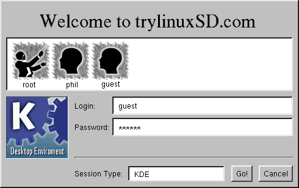
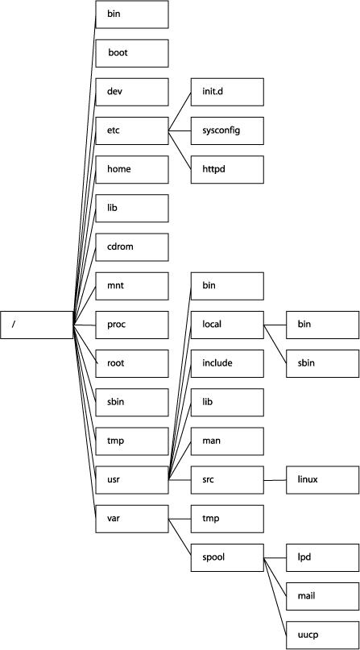
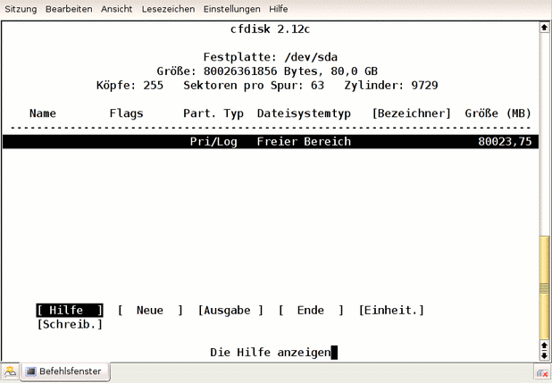
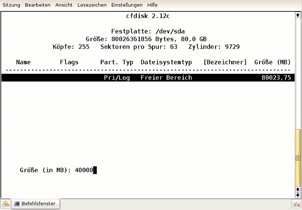
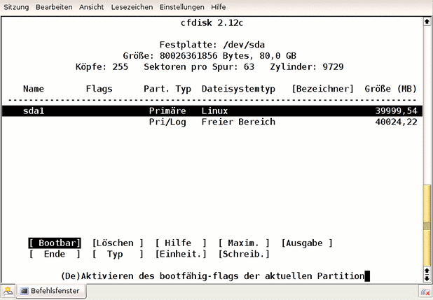
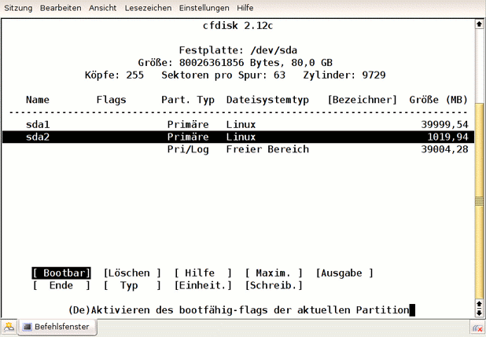
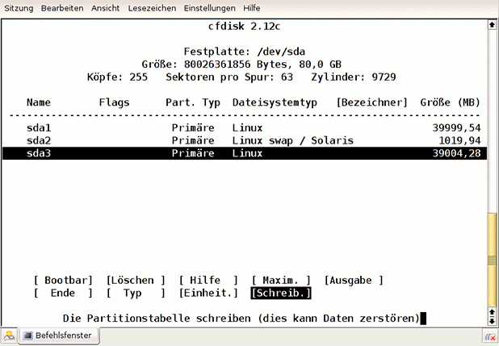
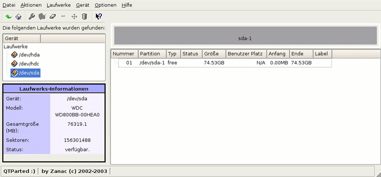
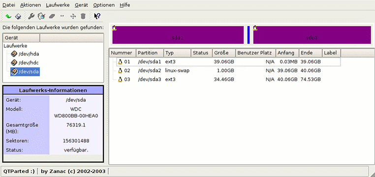
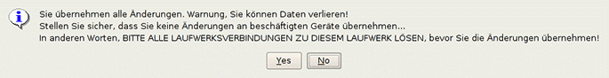

.. selflinux documentation master file, created by
   sphinx-quickstart on Wed Dec 23 13:39:08 2015.
   You can adapt this file completely to your liking, but it should at least
   contain the root `toctree` directive.

Grundlagen
==========

Starten und Herunterfahren
--------------------------

Einführung
^^^^^^^^^^

Das Starten und das Herunterfahren eines Rechners sind ausgesprochen sensible Vorgänge. Die zahlreichen Meldungen, die vom Kernel und verschiedenen Diensten stammen, liefern dem Systemverwalter wertvolle Daten über die Funktionsfähigkeit des Systems. An dieser Stelle wäre es freilich noch verfrüht, auf all diese Meldungen näher einzugehen. Da viele Benutzer heute jedoch bereits an Linux-Rechnern arbeiten, die sie eigenständig booten und herunterfahren dürfen, sind einige Bemerkungen angebracht.

Lange Zeit war es den Benutzern einer Unix-Maschine gar nicht möglich, das System zu starten oder herunterzufahren. Starten deshalb, weil die Rechner im Regelfall hinter verschlossenen Türen liefen und nur dem Systemverwalter physisch zugänglich waren. Und herunterfahren, weil es Unix (und auch Linux) seinen Benutzern verbietet, den Lauf des Systems ohne weiteres zu beenden. Auch dies bleibt dem Systemverwalter root vorbehalten.

Für ein Multiuser-Betriebssystem versteht sich diese Eigenschaft von selbst, schließlich arbeiten im Regelfall mehrere Benutzer auf einem Rechner. Hinzu kommt, dass der Rechner auch innerhalb eines Netzes für die Bereitstellung von Diensten zuständig sein kann, die natürlich ebenfalls beendet würden. Ein Benutzer kann oft gar nicht abschätzen, wieviele andere Benutzer von der Maschine abhängen, auf der er gerade arbeitet. In Zeiten der bootfreudigen Windows-Rechner mag auch die Tatsache, dass Unix-Rechner im Regelfall viele Wochen und Monate ohne einen Reboot ihren Dienst tun, etwas in Vergessenheit geraten sein.

Nachdem Linux nun auch auf gewöhnlichen PC's und damit in den Büros und Arbeitszimmern der Benutzer Einzug gehalten hat, ist es auch den Benutzern möglich geworden, über Start und Beendigung des Systems zu entscheiden. Der Rechner ist nun frei zugänglich und kann jederzeit eingeschaltet werden. Etwas anders verhält es sich noch mit dem geordneten Herunterfahren. Dies ist eigentlich nach wie vor (z.B. mittels der Kommandos shutdown, init oder halt) dem Administrator root vorbehalten. Viele Distributionen bieten mittlerweile jedoch im Rahmen eines grafischen Login-Managers die Möglichkeit, das System nach dem Abmelden über einen Knopf herunterzufahren. Des weiteren funktioniert meist auch die Tastenkombination Strg+Alt+Entf, wenn man einen Reboot auszulösen möchte.

Den Rechner starten
^^^^^^^^^^^^^^^^^^^

Nach dem Betätigen des Power-Knopfes muss man nichts weiter tun, um das Linux-System vollständig booten zu lassen. Zu Beginn des Bootens wird man kurz mit einem sogenannten Bootloader konfrontiert. Im Regelfall wird dies der LInux-LOader LILO sein, der einen kurzen Moment lang auf eine Eingabe wartet. Tut man an dieser Stelle nichts, lädt LILO dasjenige Betriebssystem, das ihm vom Systemverwalter als Standard bekanntgemacht wurde. Wir gehen hier davon aus, dass dies unser aktuelles Linux-System ist. Es ist jedoch auch möglich, dass hier weitere Betriebssysteme oder andere Linux-Versionen ausgewählt werden können. Eine Liste aller Möglichkeiten erhält man mittels der Tab-Taste, während LILO auf eine Eingabe wartet. Neuere Distributionen bieten anstelle des ehemals spartanischen LILO-Promptes gelegentlich ein grafisches Menü, das die verschiedenen Bootmöglichkeiten anzeigt. Auch der Bootloader Grub kommt meist in einem grafischen Gewand daher und bietet Ihnen ein Auswahlmenü an. Im Regelfall muss man nichts anderes tun als mittels der Pfeiltasten das Betriebssystem auszuwählen, das man starten möchte, und dann durch Betätigung der Enter-Taste den Bootvorgang zu starten. Nachdem der Bootloader schließlich den Bootvorgang in die Wege geleitet hat, können wir die Bootmeldungen verfolgen. Ist der Bootvorgang abgeschlossen, so erscheint eine lapidare login:-Aufforderung. Wurde ein grafischer Login-Manager konfiguriert, so öffnet sich ein Anmeldefenster und wartet auf die Eingabe von Benutzername und Passwort. Weitere Datails zum An- und Abmelden von einem Linux-System werden im nächsten Kapitel behandelt.

Den Rechner herunterfahren
^^^^^^^^^^^^^^^^^^^^^^^^^^

Ein DOS-Betriebssystem kennt kein Herunterfahren und darf jederzeit schlichtweg ausgeschaltet werden. Wie andere Unix-Systeme auch, reagiert Linux jedoch ausgesprochen empfindlich, wenn es nicht ordnungsgemäß beendet wird. Welche Hintergründe dies hat, erfordert einige Einblicke in die Funktionsweise des Kernels und soll daher an dieser Stelle nicht näher behandelt werden. Vorläufig soll der Rat genügen, ein Linux-System niemals durch den Power- oder Reset-Knopf abrupt zu beenden, wenn dies vermeidbar ist.

Wenn Sie das Passwort von root nicht kennen, den Rechner aber dennoch herunterfahren wollen, bleibt Ihnen normalerweise nur die Tastenkombination Strg+Alt+Entf. Warten sie danach ab, bis alle Dienste beendet sind und der Rechner mit dem Neustart beginnen will. In diesem Moment können sie den Rechner beruhigt ausschalten. Natürlich können Sie auch die entsprechende Funktion eines grafischen Login-Managers verwenden, wenn diese angeboten wird. Verfügen Sie andererseits über root-Rechte, ist es meist praktischer, das passende Kommando abzusetzen.

Grundsätzlich stehen zu diesem Zweck mehrere unterschiedliche Kommandos zur Verfügung. An dieser Stelle soll vorerst nur das gebräuchliste genannt werden, das in praktisch allen Situationen einsetzbar ist - das Kommando shutdown. Das richtige Kommando zum sofortigen Herunterfahren lautet
root@linux # shutdown -h now

Unmittelbar nach dem Absetzen des Kommandos (als root) erscheint die Meldung
"The System in going down for system halt NOW!!"

Den laufenden Prozessen werden Signale versendet, die sie zur Beendigung veranlassen. Das System fährt hoffentlich vollständig herunter und verabschiedet sich mit der Meldung
Master Ressource Control: runlevel 0 has been      reached

Die Parameter von shutdown deuten an dieser Stelle bereits an, dass das Kommando weitere Möglichkeiten bietet. Beispielsweise kann durch den Paramenter -r, also durch
root@linux # shutdown -r now

anstelle des einfachen Herunterfahrens ein Reboot veranlasst werden. Darüber hinaus können anstelle von now auch absolute oder relative Zeitangaben verwendet werden, um den Shutdown erst später durchzuführen und damit beispielsweise weiteren Benutzern die Möglichkeit zu geben, ihre Arbeit zu sichern und alle laufenden Aktivitäten ordnungsgemäß zu beenden.

  	
Autoren

    Florian Frank florian.frank@pingos.org
    Matthias Kleine kleine_matthias@gmx.de

	
Formatierung

    Johnny Graber selflinux@jgraber.ch

An- und Abmelden
----------------

Nach dem Bootvorgang
^^^^^^^^^^^^^^^^^^^^

Linux hat gebootet und wartet auf die Anmeldung eines Benutzers. Der schlichte Login-Prompt soll jedoch nicht darüber hinwegtäuschen, dass ein Linux-System bereits zu diesem Zeitpunkt voll einsatzfähig ist. Befindet sich der Rechner beispielsweise in einem Netzwerk, ist er jetzt schon in der Lage, Netzwerkanfragen anderer Rechner pflichtgemäß zu beantworten. Diese Dienste im Hintergrund sind von der Anmeldung eines Benutzers, auch der des Benutzers  root, völlig unabhängig.

Wenn Linux Sie mit einer  grafischen Oberfläche zum Anmelden empfängt, wurde bereits Vorarbeit von anderer Seite geleistet. Die neueren Distributionen bieten dies meist an, damit Benutzer gar nicht erst mit der gefürchteten Kommandozeile ( Shell) in Kontakt treten. Da wir Linux jedoch auf den Grund gehen wollen, betrachten wir den Anmeldevorgang am Prompt etwas genauer. Das Thema  Display Manager wird weiter unten behandelt.

Das erste Einloggen
^^^^^^^^^^^^^^^^^^^

Ein Benutzerkonto in der EDV besteht immer mindestens aus einem Benutzernamen und einem  Passwort. Diese beiden Daten sind auch unter Linux erforderlich, um sich erfolgreich anmelden zu können. Hier  unterscheidet sich Linux von einigen der Betriebssysteme Microsofts, bei denen man ohne Anmeldung sofort den Rechner benutzen kann. Die  Mehrbenutzerfähigkeiten von Linux machen Benutzerkonten notwendig. Wenn Sie Ihren Linux-Rechner selbst installiert haben, mussten Sie während des Installationsvorgangs zu irgendeinem Zeitpunkt ein Passwort für den Benutzer root angeben. root ist auf jedem Linux-System zu finden und mit besonders weitreichenden Rechten zur Systemadministration ausgestattet. Vorläufig können Sie sich ausschließlich als der Benutzer root beim System anmelden. Geben Sie daher ein:
login: root
password: ***

wobei *** für das Passwort steht, das Sie während des Installationsvorganges angegeben haben. Die Eingabe des Passwortes wird dabei in der Konsole aus Sicherheitsgründen in aller Regel nicht angezeigt. Einige Distributionen geben Ihnen während der Installation auch die Möglichkeit, einen Beispielnutzer anzulegen. Wenn Sie dies getan haben, sollten Sie sich zunächst nur unter diesem Konto anmelden. Ein  Grundsatz für die Arbeit mit Linux, den ein Linux-Neuling gar nicht ernst genug nehmen kann, lautet: Arbeite niemals als root, wenn es nicht unbedingt notwendig ist! Dieser Grundsatz gilt wohlgemerkt auch für erfahrene Linux-Benutzer. Der Neuling sollte sich dies jedoch ganz besonders zu Herzen nehmen, um das frisch installierte Linux-System vor allzu großem Erkundungstrieb zu schützen. Sollte Ihr System von einem Administrator eingerichtet worden sein, hat dieser sicherlich ein Konto für Sie vorbereitet und Ihnen die Anmeldedaten mitgeteilt. Auch dann können Sie dem folgenden Beispiel folgen:
login: <beispielname>
password: ***

Verfügen Sie jedoch lediglich über einen root-Zugang, so wird Ihre erste (und vorläufig hoffentlich letzte) Handlung als root das Anlegen eines neuen Benutzers sein.

Wird die Anmeldung vom System akzeptiert, startet eine sogenannte Benutzersitzung. Darin startet zunächst ein Kommandozeileninterpreter, auch  Shell genannt. Die Shell signalisiert ihre Bereitschaft für eine Eingabe mit dem sogenannten  Prompt und erwartet die Eingabe von Kommandos oder das Starten von Programmen per Tastatur durch den Benutzer.

Einen Standardbenutzer anlegen
^^^^^^^^^^^^^^^^^^^^^^^^^^^^^^

Die meisten Distributionen bieten das Anlegen neuer Benutzer über die komfortable Oberfläche ihrer eigenen, spezifischen Konfigurationswerkzeuge an. Hier soll das Anlegen eines neuen Benutzers per Kommando beschrieben werden:

Das Kommando zum Anlegen eines Benutzers ist useradd. Die notwendigen Benutzerinformationen werden useradd als  Parameter übergeben:
root@linux ~# useradd -g users -d /home/<benutzername> -m <benutzername>

Die Option -g (group) ordnet den neuen Benutzer einer Gruppe mit bestimmten Rechten zu. -d (directory) gibt ein Heimatverzeichnis für den Benutzer an, und -m sorgt dafür, dass dieses  Heimatverzeichnis inklusive einer Reihe wichtiger Initialisierungsdateien sofort angelegt wird. Nach dem Aufruf von useradd ist der neu angelegte Benutzer jedoch noch deaktiviert. Um ihn zu aktivieren, müssen Sie ihm noch ein Passwort zuweisen. Dies geschieht mittels des Kommandos
root@linux ~# passwd <benutzername>
root@linux ~# Kennwort eingeben
root@linux ~# Kennwort bestätigen

Nach dem Absetzen des Kommandos fordert Linux Sie auf, ein Passwort einzugeben. Wie üblich muss die Eingabe danach noch einmal bestätigt werden. Stimmen die Passwörter überein, ist der neue Benutzer vollständig eingerichtet und aktiviert. Sie können sich nun mittels exit als root  abmelden und mit diesen neuen Benutzerdaten wieder anmelden. Als gewöhnlicher Nutzer ohne die  Administrationsrechte von root können Sie sich sicher sein, keine wichtigen Systemdateien zu beschädigen.

Textkonsolen
^^^^^^^^^^^^

Linux bietet Ihnen standardmäßig die Möglichkeit, bis zu 6 Textkonsolen zu benutzen. Auf jeder Konsole ist eine separate Anmeldung erforderlich. Der Wechsel zwischen den Konsolen erfolgt mittels der Tastenkombinationen Alt+F1 bis Alt+F6. Die Anzahl von 6 Konsolen (auch virtuelle Terminals) wird in der Datei /etc/inittab festgelegt. Der Vorteil dieser Möglichkeit ist, die Arbeit durch die Nutzung mehrerer Konsolen besser zu strukturieren. Möglich ist dabei die Verteilung der Arbeit eines Benutzers auf mehrere Arbeitsflächen ebenso wie die Anmeldung mehrerer unterschiedlicher realer Benutzer. Ihrer Fantasie beim Einsatz der Konsolen sind dabei keine Grenzen gesetzt.

Technische Hintergründe
^^^^^^^^^^^^^^^^^^^^^^^

Linux bietet Ihnen sogenannte virtuelle Terminals zur Benutzung an. Der Begriff Terminal stammt aus der Großrechnerwelt und bezeichnet dort den Anschluss eines Bildschirms mit Tastatur an einen Rechner. Aufgrund der hohen Kosten für diese Rechenanlagen waren meist viele Benutzer über solche Terminals mit einem Rechner verbunden. Terminals unterscheiden sich jedoch auf elektronischer Ebene stark von der heute üblichen Monitor/Tastatur-Konstruktion.

Linux emuliert diese gleichsam historische Situation durch seine virtuellen Terminals. Die gemeinsame Beschränkung virtueller Terminals und klassischer Terminals liegt in der geringen Fähigkeit zur Darstellung grafischer Information.

Nach dem Booten startet der  Kernel das Programm /sbin/init, das eine Vielzahl von Aufgaben zu erledigen hat. Eine dieser Aufgaben ist der Aufruf des Programmes mingetty. mingetty ist eine minimale Version des Programms getty, Es ist für die Öffnung der einzelnen virtuellen Terminals zuständig und legt deren Modus fest. Die Terminals sind jeweils als tty1, tty2 (tty für "Teletype") usw. bezeichnet und intern speziellen Gerätedateien zugeordnet. mingetty erzeugt auch die Ausgabe einer Zeile wie:
Welcome to SuSE Linux 7.3 (i386) - Kernel 2.4.14 (tty1)

die es aus der Datei /etc/issue liest. Schließlich ruft es das Programm /bin/login auf, das die eigentliche Anmeldung des Benutzers übernimmt. login gibt einen  Prompt auf dem Bildschirm aus und wartet auf die Eingabe des Benutzernamens. War die Anmeldung erfolgreich, so zeichnet sich login für eine Ausgabe wie
1 failure since last login. Last was 14:07:35 on tty1.
You have new mail in /var/spool/mail/<benutername>
Last login Wed Dez 22 11:15:24 on tty1
Have a lot of fun...

verantwortlich. Wie Sie sehen, erhalten Sie eine Reihe nützlicher Auskünfte über fehlgeschlagene Anmeldeversuche, neue E-Mail und die letzte Anmeldung, und natürlich ist auch diese Ausgabe konfigurierbar. Schließlich startet login das Programm, das dem Benutzer in der Datei /etc/passwd zugeordnet ist. Im allgemeinen wird dies eine Shell sein, unter Linux praktisch immer die  Bourne again shell (bash). Von all dem müssen Sie als Benutzer eigentlich nichts wissen. Es soll jedoch verdeutlicht werden, dass schon die einfachsten Vorgänge häufig komplizierte technische Hintergründe haben. Während andere Betriebssysteme es häufig gar nicht ermöglichen, auf solche Vorgänge Einfluss zu nehmen, erweist sich Linux in dieser Hinsicht als hochgradig konfigurierbar. Von einem gewissen technischen Verständnis werden auch Sie als Benutzer profitieren.

Display Manager
^^^^^^^^^^^^^^^

Auch wenn Linux Sie bereits in grafischem Gewand empfängt, kommen Sie um eine ordnungsgemäße Anmeldung nicht herum. Die Anmeldung wird in diesem Fall lediglich von anderen Programmen bereitgestellt. Bevor diese Programme jedoch in Aktion treten können, müssen Grafikkarte und Monitor der Arbeitsstation korrekt angesteuert werden, um überhaupt eine grafische Oberfläche erzeugen zu können. Unter Linux wird dies immer über das sogenannte  X Window System erledigt. X ist ein Programm wie jedes andere und vom eigentlichen Betriebssystem unabhängig.

Parallel zu X ist auch weiterhin eine Anmeldung auf den Textkonsolen über den Mechanismus init-mingetty-login möglich. Sie gelangen zu den Konsolen, indem Sie eine der Tastenkombinationen Strg-Alt-F1 bis Strg-Alt-F6 ausführen. Dort empfängt Sie wieder der oben beschriebene Login. Zwischen den einzelnen tty's können Sie nun wieder mit Alt+F1 bis Alt+F6 wechseln. Aus dem Textmodus zurück in die Fensterwelt gelangen Sie über die Tastenkombination Alt+F7.

X ist keineswegs in der Lage eine Benutzeranmeldung durchzuführen, es ist allein für die Darstellung grafischer Elemente zuständig. Hierzu ist ein sogenannter Display Manager notwendig, welcher allerdings die Dienste von X in Anspruch nimmt. Ein übliches Programm für diese Zwecke ist der X Display Manager xdm. Nahe Verwandte des xdm, die immer mehr Verbreitung finden, sind der kdm und der gdm. Folgende Abbildung zeigt den K Display Manager kdm:

KDM

Der Anmeldung mittels eines Display Managers liegt ein grundlegend anderer Mechanismus zugrunde. Als Benutzer geben Sie jedoch in beiden Fällen Ihren Benutzernamen und ein Passwort ein und öffnen damit eine Benutzersitzung. Da es sich bei diesem Prozedere im einen wie im anderen Fall lediglich um ablaufende Programme handelt, ist klar, dass der Lauf des Betriebssystems von einer Anmeldung oder Abmeldung völlig unabhängig ist. Schauen wir uns zum Abschluss dieses Themas nun also an, wie Sie eine Sitzung beenden können.

Wieder abmelden
^^^^^^^^^^^^^^^

Zur Abmeldung existiert ein eigenes Kommando, das Kommando logout. Dabei handelt es sich um ein sogenanntes eingebautes Kommando der bash. Wenn Sie logout eingeben, wird Ihre Login-Shell beendet, und das login Programm übernimmt wieder die Kontrolle über das jeweilige tty. Das logout Kommando wirkt nur bei einem Aufruf von der eigentlichen Login-Shell aus. Haben Sie innerhalb Ihrer Login-Shell weitere Shells geöffnet, was problemlos möglich ist, funktioniert das Kommando logout nicht. In diesem Fall müssen Sie stattdessen exit eingeben.

Was bedeutet es, dass login wieder die Kontrolle über das tty übernimmt? Woher weiß login überhaupt von seinem Glück? Vereinfacht gesagt meldet jedes Programm unter Linux (und auch anderen Betriebssystemen) an seinen Aufrufer zurück, dass es beendet wurde. Zu diesem Zweck schickt es einen sogenannten Rückgabewert an das aufrufende Programm. In unserem Fall wurde die bash von login gestartet. login erhält also einen Rückgabewert, der ihm anzeigt, dass die Benutzersession ordnungsgemäß beendet wurde. Es reagiert auf diese Rückmeldung, indem es sofort wieder eine Aufforderung zur Anmeldung auf dem Bildschirm ausgibt.

Wenn die Anmeldung über einen  Display Manager erfolgt ist, können Sie sie in praktisch allen Umgebungen über die rechte Maustaste und dann das Listenelement Abmelden, Exit, Logout oder ähnliche Einträge beenden. Der technische Ablauf unterscheidet sich wieder von einer gewöhnlichen Abmeldung, da ein Display Manager die Verwaltung einer Benutzersitzung, wie schon angedeutet, auf ganz andere Weise durchführt. In jedem Fall versetzt er sich wieder in einen Zustand, der eine neue Anmeldung ermöglicht. Wir haben damit alle Vorbereitungen getroffen, um einige weitere Linux-Eigenschaften zu erkunden. Im  nächsten Abschnitt beginnen wir mit einigen Bemerkungen zu der Verwendung von Kommandos.

  	
Autor

    Matthias Kleine kleine_matthias@gmx.de
	
Formatierung

    Johnny Graber selflinux@jgraber.ch

Allgemeine Kommandosyntax
-------------------------

Vorbemerkung
^^^^^^^^^^^^

Möglicherweise würden Sie dieses Kapitel gerne überspringen und lieber gleich zur Mausbenutzung übergehen. Das Absetzen eines Kommandos hat in der heutigen Fensterwelt etwas Archaisches an sich und wirkt komplizierter als die Verwendung von Popup-Menüs, Registerkarten und Dialogboxen. Tatsächlich können Sie auch unter Linux heute praktisch alle wichtigen Benutzeraufgaben erledigen, ohne je ein Kommando absetzen zu müssen. Es sei jedoch hinzugefügt, dass mit dem höheren Komfort ein verminderter Fahrspaß verbunden ist.

 Unix-Systeme sind wie Baukästen. Es steht Ihnen eine Unzahl kleiner Programme zur Verfügung, die Sie für die verschiedensten Aufgaben miteinander kombinieren können. Natürlich können Sie, wenn Sie wollen, immer nur die größten Klötze verwenden und die kleinen im Kasten liegen lassen. Manchmal können jedoch die feineren Handgriffe darüber entscheiden, ob Sie Ihre Aufgabe mit einigen wenigen oder mit einer langen Reihe von Arbeitsschritten bewältigen müssen. Und Sie können sich darauf verlassen, dass Linux Sie bei der Verwendung feinerer Handgriffe in jeder Hinsicht so gut wie möglich unterstützt.

Üblicherweise werden Kommandos in einer  Shell abgesetzt. Die Shell - z.B. die Bourne again Shell oder kurz  bash - nimmt Ihre Kommandozeile entgegen, bearbeitet den entgegengenommenen Text und leitet schließlich die Ausführung des gerufenen Programmes ein. Kommandos sind übrigens nichts anderes als Programme. Sie sind nur meist in einer Shell anzutreffen und werden daher begrifflich gelegentlich voneinander unterschieden.

Die Eingabe eines Kommandos
^^^^^^^^^^^^^^^^^^^^^^^^^^^

Wenn Sie sich über ein  tty anmelden, startet sofort eine Shell und ermöglicht die Eingabe von Kommandos am Prompt. Sie können auch unter X Windows eine Shell öffnen und darin Kommandos aufrufen. Dazu benutzen Sie sogenannte Terminalemulationen wie xterm oder kvt. Diese emulieren eine Terminalsituation inklusive der Standarddatenströme von der Tastatur und zum Monitor - allerdings ohne dafür jeweils ein tty zu benutzen. Es handelt sich einfach um Programme, die in ihrem Fenster eine  Shell beherbergen.

Die Eingabe eines Kommandos erfolgt über den Kommandonamen. Dieser wird mit Enter bestätigt und damit der  Shell zur Bearbeitung übergeben. Im einfachsten Fall hat die Shell nichts weiter zu tun als das jeweilige Programm aufzurufen und diesem die Kontrolle zu übergeben. Das Programm tut seinen Dienst, wird irgendwann beendet und liefert seinen Rückgabewert zurück an die Shell. Diese ist somit informiert, dass das gestartete Programm beendet ist, und gibt wieder ihren Prompt aus, um auf das nächste Kommando zu warten. Dies ist die einfachste Form einer Kommandoeingabe. Wir wollen uns aber noch einige weitere anschauen.

Verschiedene Formen von Kommandos
^^^^^^^^^^^^^^^^^^^^^^^^^^^^^^^^^

In vielen Fällen müssen einem Kommando weitere Informationen übergeben werden, damit es seine Arbeit verrichten kann. Es gibt grundsätzlich zwei Arten von Zusatzinformationen, die man Kommandos mitteilen kann: Optionen und Argumente. Dabei werden die Optionen immer vor den Argumenten angegeben, so dass die grundlegende Syntax aller Linux-Kommandos folgendermaßen notiert werden kann:
user@linux $ kommandoname [-Optionen] [Argumente]

Die eckigen Klammern zeigen an, dass Optionen und Argumente optional, also nicht notwendig sind. Ihre Angabe hängt von den Absichten des Aufrufers und der Liste möglicher Parameter eines Kommandos ab.

Optionen
""""""""

Durch Optionen können Sie das Verhalten eines Kommandos beeinflussen. Optionen werden gewöhnlich durch einzelne Buchstaben bezeichnet und beginnen mit einem vorangestellten Minus -. Das Kommando ls beispielsweise gibt gewöhnlich den Inhalt eines Verzeichnisses aus: Es listet einfach die Namen der enthaltenen Unterverzeichnisse und Dateien auf. Will man jedoch nicht einfach nur die Namen wissen, sondern auch Zusatzinformationen über Dateigröße, Erstellungsdatum und vieles andere, so muss man dies dem ls-Kommando mitteilen. Die übliche Eingabe in einem solchen Fall würde lauten:
user@linux $ ls -l

-l (l für »long«) ist eine Option und veranlasst eine ausführlichere Ausgabe. Das Verhalten des Kommandos hat sich durch die Verwendung der Option verändert. Optionen können miteinander kombiniert werden, indem man weitere Zeichen einfach hinzufügt. Das Minuszeichen muss also nur ein einziges Mal verwendet werden, um damit anzuzeigen, dass nun eine Reihe von Optionen folgt. In unserem Kapitel über die Shell werden wir noch genauer auf die Verwendung von Optionen eingehen. Eine Übersicht möglicher Optionen eines Befehls gibt die  Manpage des Kommandos. Diese Hilfetexte zu Shell-Kommandos erreicht man über die Eingabe von:
user@linux $ man Kommandoname

am Prompt der Shell.

Argumente
"""""""""

Argumente dienen nicht zur Steuerung eines Kommandos, sondern liefern diesem Informationen, die es zu bearbeiten hat. Viele Kommandos zur Manipulation von Dateien benötigen zum Beispiel die Namen der Dateien, die sie manipulieren sollen. Hier wird also nicht das Verhalten des Programmes geändert, sondern die Information variiert, die dem Programm für seine Arbeit zur Verfügung steht. Im Gegensatz zu Optionen kann es häufig eine sehr große Zahl verschiedener Argumente geben. Optionen hingegen sind immer nur in relativ beschränkter Zahl verfügbar - immer gerade so viele, wie der Programmierer in sein Programm implementiert hat. Nebenbei bemerkt ist jedoch auch die Anzahl der Argumente einer Kommandozeile nicht unbeschränkt, denn die Argumentzeile eines Kommandos darf eine Größe von 128 Kilobyte nicht überschreiten.

Optionen, die Argumente erwarten
""""""""""""""""""""""""""""""""

Manche Optionen erwarten ihrerseits Argumente. Schauen wir uns beispielsweise folgenden Aufruf eines C-Compilers an:
user@linux $ gcc -Wall prog.c

gcc ist der Name des Kommandos. Die einzige Option in dieser Zeile ist -W. Sie kann mit Argumenten versorgt werden, hier ist das angegebene Argument all. Ein Leerzeichen ist nicht notwendig, aber möglich. Das letzte Argument prog.c gehört nicht mehr zur Option -W, sondern bezeichnet den Dateinamen des Quelltextes, der kompiliert werden soll.

Lange Optionen
"""""""""""""""

In der Linux-Welt hat sich eine weitere Art von Optionen verbreitet, die sich durch eine besondere Schreibweise auszeichnet: die langen oder GNU-Optionen. Sie beginnen mit einem doppelten Minuszeichen --, gefolgt von der eigentlichen Option, die meist ein ausgeschriebenes Wort ist. Lange Optionen sind somit "sprechender" als kurze. Allerdings wird die Verwendung mehrerer Optionen auch unübersichtlicher. Ein Beispiel für eine weit verbreitete lange Option ist --version. Viele GNU-Kommandos geben bei einem Aufruf mit dieser Option ihre Versionsnummer aus.

Die Rolle der Shell
^^^^^^^^^^^^^^^^^^^^^^^

Sie wissen jetzt, dass Sie Kommandos über eine Shell aufrufen und ihnen Optionen und Argumente übergeben können. Zum Abschluss möchten wir Ihr Bewusstsein dafür schärfen, dass damit jedoch lediglich die Rahmenbedingungen für eine Kommandoeingabe dargestellt sind, wie sie die Kommandos selbst bieten. Die Gemeinschaft der Programmierer hat sich gewissermaßen darauf geeinigt, dass Kommandos so und nicht anders zu arbeiten haben. Die grundlegende Syntax eines Kommandos ist von der Shell unabhängig.

Umgekehrt ist es aber auch so, dass die Syntax der Shell selbst von dem jeweils verwendeten Kommando unabhängig ist. Tatsächlich ist die Form einer Kommandozeile nicht nur durch die Syntax des aufgerufenen Kommandos, sondern auch durch die Syntax der Shell bestimmt. Bevor die Shell nämlich ein Kommando zur Ausführung bringt, nimmt sie unter Umständen im Rahmen des Parsens eine Reihe von Veränderungen an der Eingabe vor. Diese Veränderungen haben nichts mit dem aufgerufenen Kommando zu tun, sondern werden von der Shell nach den immer gleichen syntaktischen Regeln vorgenommen. Die Shell prüft auf diese Weise nicht nur, ob der Kommandoaufruf ihren syntaktischen Regeln entspricht, sondern sie ermöglicht Ihnen damit auch zahlreiche Vereinfachungen bei der Kommandoeingabe.

  	
Autor

    Matthias Kleine kleine_matthias@gmx.de
	
Formatierung

    Johnny Graber selflinux@jgraber.ch

Benutzer- und Berechtigungskonzepte unter Linux
-----------------------------------------------

Beschreibung

Dieser Text ist den grundlegenden Konzepten des Benutzer- und Berechtigungssystems von Linux gewidmet. Das Thema Benutzerverwaltung baut auf diesen Konzepten auf, wird hier aber nicht explizit behandelt. Vielmehr soll eine Kenntnis der wichtigsten Begriffe und ein Verständnis für das große Ganze vermittelt werden, welches in der Benutzerverwaltung seine Anwendung findet. Den praktischen Aspekten der Benutzerverwaltung ist ein  separates Kapitel gewidmet.

Einleitung
^^^^^^^^^^

Die Nutzung von Informationssystemen ist üblicherweise mit einem Zugangssystem verbunden, welches die Verwendung des Systems auf eine bekannte Benutzergruppe beschränkt, Daten über die registrierten Benutzer speichert und die Verteilung der Ressourcen auf die Benutzer steuert. Häufig ist die Konzeption des Zugangssystems für den einzelnen Benutzer transparent - außer seinem Benutzernamen und einem Passwort benötigt der Benutzer kaum weitere Kenntnisse, um das System in Anspruch zu nehmen. Für die Arbeit mit einem Linux-System sollten Sie sich dennoch einige elementare Kenntnisse über dessen Benutzer- und Berechtigungskonzept aneignen.

Die Notwendigkeit für diese Konzepte ergibt sich für Linux aus seiner Mehrbenutzerfähigkeit. Ein erster wichtiger Aspekt ist der Schutz des Systems vor den Handlungen seiner Benutzer. Weiterhin müssen auch die einen Benutzer vor den Handlungen der anderen geschützt werden. Und schließlich darf bei allem Schutz des Systems und der Benutzer voreinander das Miteinander-Arbeiten nicht allzusehr erschwert werden. Um all dies zu gewährleisten, bedarf es eines feinkörnigen Systems der Einschränkungen und Erlaubnisse. Dieses System ideal an die jeweiligen Gegebenheiten anzupassen, ist die Aufgabe des Systemverwalters. Es bleibt zu hoffen, dass er diese Aufgabe in Absprache mit den Benutzern vornimmt.

Dieser Text ist derzeit in fünf Hauptabschnitte gegliedert. Im ersten Abschnitt  Was ist ein Benutzer? wird erläutert, was einen Benutzer unter Linux ausmacht. Der zweite Abschnitt  Benutzertypen behandelt die Unterschiede zwischen Standardbenutzern, Systembenutzern und dem Superuser root. Abschnitt drei  Benutzerklassen: user, group und others widmet sich den für das Berechtigungskonzept zentralen Benutzerklassen unter Linux. In Abschnitt vier  Berechtigungstypen: Lesen, Schreiben und Ausführen werden die Berechtigungstypen für diese Benutzerklassen im Detail ausgeführt. Abschnitt fünf schließlich beschreibt überblicksweise die für die  Benutzerverwaltung zentralen Konfigurationsdateien.

Die Autoren sind sich der Tatsache bewusst, dass damit wesentliche Themen, die in dieses Kapitel gehören, noch nicht abgehandelt wurden.

Was ist ein Benutzer?
^^^^^^^^^^^^^^^^^^^^^

Benutzername und Passwort
"""""""""""""""""""""""""

Ein Benutzerkonto besteht in der Informationstechnik aus einer Benutzername/Passwort-Kombination. Von einer weiteren Verkomplizierung des Zugangssystems, etwa durch Einsatz von Verschlüsselungstechnologien aus Gründen erhöhter Sicherheitsanforderungen, soll in diesem Kapitel nicht die Rede sein.

Erwartungsgemäß melden Sie sich auch bei Linux durch die Angabe Ihres Benutzernamens und des zugehörigen Passwortes an. Mehr muss der Anwender im allgemeinen nicht wissen. Aus Systemsicht sind jedoch noch einige weitere Attribute Ihres Benutzerkontos interessant.

Benutzer-ID (UID) und Gruppen-ID (GID)
""""""""""""""""""""""""""""""""""""""

Während Sie üblicherweise einfach einen Benutzernamen angeben, um sich auf einen bestimmten Benutzer zu beziehen, verwendet Linux intern lediglich eine Identifikationsnummer, die sogenannte Benutzer-ID (UID für User-ID, engl. user: der Benutzer). Betrachten Sie die (verkürzte) Ausgabe des folgenden Kommandos:
user@linux ~$ id
uid=500(matthias)

In Klammern sehen Sie den vertrauten Benutzernamen, hier matthias. Die UID ist 500. Für interne Zwecke findet nahezu ausschließlich die UID Verwendung. Selbst wenn Sie Kommandos absetzen, welche den Benutzernamen als Parameter erwarten, findet zunächst eine Zuordnung des Namens auf die UID statt, bevor die gewünschte Aktion ausgeführt wird. Umgekehrt sollten Sie sich nicht täuschen lassen, wenn Ihnen ein Kommando den Benutzernamen anstelle der UID liefert. Betrachten Sie z.B. die folgende (wiederum etwas komprimierte) Ausgabe:
user@linux ~$ ps -aux
USER       PID %CPU %MEM   VSZ  RSS TTY      STAT START   TIME COMMAND
root         1  0.0  0.0   448   64 ?        S    Jun21   0:07 init [3]
root         2  0.0  0.0     0    0 ?        SW   Jun21   0:00 [keventd]
nobody     650  0.0  0.1  5680  716 ?        S    Jun21   0:00 /usr/sbin/in.identd -e
nobody     653  0.0  0.1  5680  716 ?        S    Jun21   0:01 /usr/sbin/in.identd -e
lp         746  0.0  0.1  1944  712 ?        S    Jun21   0:00 lpd Waiting
matthias 15971  0.0  0.2  2528 1188 tty1     S    01:09   0:00 /bin/sh/usr/X11R6/bin/startx
matthias 16097  0.0  0.3  2816 1576 pts/1    S    01:09   0:00 /bin/bash

In der ersten Spalte listet ps bereitwillig die vertrauten oder weniger vertrauten Namen diverser Benutzer (root, nobody, lp, matthias) auf. Das System verwaltet allerdings die Prozesse nicht unter den Benutzernamen, sondern ausschließlich unter deren UIDs. ps hat hier eigenständig eine Zuordnung von den UIDs auf die Benutzernamen vorgenommen.

Neben der UID ist jedem Benutzer eine weitere Nummer zugeordnet, die sogenannte Gruppen-ID (GID). Auch diese Nummer liefert das id Kommando (hier die etwas längere, aber immer noch verkürzte Ausgabe):
user@linux ~$ id
uid=500(matthias) gid=100(users)

Jeder Prozess trägt UID und GID seines Erzeugers. Wie diese beiden Kennzahlen bei der Ermittlung von Berechtigungen verwendet werden, wird  später im Detail erläutert.

Nach der Anmeldung - die Shell
""""""""""""""""""""""""""""""

Nach der Anmeldung möchte sich der Benutzer in einer Umgebung wiederfinden, welche ihm das Arbeiten ermöglicht. Erfolgt die Anmeldung nicht über einen Display-Manager, so wird für gewöhnliche Benutzer eine Shell gestartet. Um welche Shell es sich handelt, wird dabei für jeden Benutzer einzeln festgelegt. In der Tat kann man für einzelne Benutzer auch festlegen, dass sie keine Shell erhalten - z.B. wenn man sie temporär vom System aussperren möchte oder wenn für einzelne Benutzer generell keine Shell-Umgebung ermöglicht werden soll. Wie  später noch gezeigt wird, kann dies sehr sinnvoll sein und kommt durchaus häufig vor.

Das Heimatverzeichnis
"""""""""""""""""""""

Die Login-Shell startet im sogenannten Heimatverzeichnis des Benutzers. Dieses und alle seine Unterverzeichnisse gehören dem Benutzer. Was genau damit gemeint ist, wird in einigen Augenblicken erläutert. Im Wesentlichen bietet das Heimatverzeichnis seinem Besitzer Platz für die Ablage von Dateien, welche meist oder auschließlich von ihm verwendet werden. Neben den Arbeitsdateien und -verzeichnissen selbst liegen im Heimatverzeichnis noch eine Reihe (meist unsichtbarer) Dateien, welche applikationsspezifische Einstellungen des Benutzers enthalten. Es ist somit der Dreh- und Angelpunkt der Aktivitäten des Benutzers - eine gewohnte, vor anderen Benutzern geschützte Umgebung.

Was ist nun also ein Benutzer?
""""""""""""""""""""""""""""""

Benutzername und Passwort, UID, Login-Programm (üblicherweise eine Shell) und Heimatverzeichnis sind es also, die zusammengenommen einen Benutzer auf einem Linux-System ausmachen. All diese Daten werden in einer zentralen Benutzerdatei verwaltet. Bevor diese näher beschrieben wird, folgt eine Einteilung der auf einem Linux-System möglichen Benutzer in Benutzertypen. 

Benutzertypen
^^^^^^^^^^^^^

Hier nochmals die verkürzte Ausgabe eines ps Kommandos als Beispiel:
user@linux ~$ ps -aux
USER       PID %CPU %MEM   VSZ  RSS TTY      STAT START   TIME COMMAND
root         1  0.0  0.0   448   64 ?        S    Jun21   0:07 init [3]
root         2  0.0  0.0     0    0 ?        SW   Jun21   0:00 [keventd]
nobody     650  0.0  0.1  5680  716 ?        S    Jun21   0:00 /usr/sbin/in.identd -e
nobody     653  0.0  0.1  5680  716 ?        S    Jun21   0:01 /usr/sbin/in.identd -e
lp         746  0.0  0.1  1944  712 ?        S    Jun21   0:00 lpd Waiting
matthias 15971  0.0  0.2  2528 1188 tty1     S    01:09   0:00 /bin/sh/usr/X11R6/bin/startx
matthias 16097  0.0  0.3  2816 1576 pts/1    S    01:09   0:00 /bin/bash

Die Benutzer root, nobody, lp und matthias sind als Inhaber der jeweiligen Prozesse gelistet. Die Autoren versichern Ihnen jedoch, dass zum Zeitpunkt dieses Kommandos lediglich ein einziger Benutzer auf dem System angemeldet war, nämlich der Benutzer matthias. Die Tatsache, dass dennoch einige Prozesse auf dem System unter der Kennung anderer Benutzer laufen, zeigt bereits an, dass es verschiedene Typen von Benutzern geben muss. Gewöhnlichen Benutzern wäre es nämlich unmöglich, ohne vorherige Anmeldung einen Prozess zu starten. Wir unterscheiden daher drei Benutzertypen: Erstens den Systemverwalter oder Superuser root, zweitens alle Standardbenutzer und drittens die Systembenutzer.

root
""""

Der Benutzer root ist mit allen Rechten ausgestattet, die ihm die Administration (bei Unachtsamkeit natürlich auch die Beschädigung!) des Systems erlauben. Diesem auch als Superuser bezeichneten Benutzer ist immer die UID 0 zugeordnet:
root@linux ~# id
uid=0(root) gid=0(root) Gruppen=0(root) [...]

Dieses Benutzerkonto dient ausschließlich Eingriffen in die Konfiguration des Systems und sollte nur dann verwendet werden, wenn kein anderer Benutzer die für eine Aufgabe notwendigen Rechte innehat. Der unter Einsteigern beliebteste Fehler ist es, sich zunächst ausschließlich als root anzumelden. Da nach der Systeminstallation ohnehin noch häufig administrative Aufgaben erledigt werden müssen, wird es als lästig empfunden, permanent zwischen einem Benutzer- und dem Superuser-Konto hin- und herzuwechseln. Die Bequemlichkeit wird oft mit einer Beschädigung des Systems bezahlt.

Es gibt Prozesse, die immer unter der Kennung des Superusers laufen und auch laufen müssen. Das einfachste Beispiel ist der Prozess init, der auch in der obigen Ausgabe erscheint. init ist der erste Prozess, der nach dem Booten des Kernels die Kontrolle übernimmt und wird daher auch als "Vater aller Prozesse" bezeichnet. Dies drückt sich in der Prozess-ID 1 aus. Da zum Zeitpunkt des Startens von init freilich noch kein Benutzer auf dem System angemeldet sein kann, andererseits aber jedem Prozess eine gültige Benutzerkennung zugeordnet sein muss, und da init des weiteren zur Erledigung seiner Aufgaben mit weitreichenden Rechten ausgestattet sein muss, läuft init unter der Kennung des Superusers root. Dass dies nicht nur für init gilt, zeigt das folgende Kommando:
root@linux ~# ps aux | grep root
root         1  0.0  0.0   448   76 ?        S    Oct25   0:07 init
[...]
root         4  0.0  0.0     0    0 ?        SW   Oct25   0:01 [keventd]
[...]
root       602  0.0  0.1  1356  552 ?        S    Oct25   0:01 /sbin/syslogd
[...]
root      1651  0.0  0.6  4856 3232 ?        S    Oct25   0:08 /usr/sbin/cupsd
[...]
root      2063  0.0  0.0  1260    4 tty1     S    Oct25   0:00 /sbin/mingetty --noclear tty1
[...]

Diese nach Prozessnummern geordnete, verkürzte Liste zeigt im oberen Bereich zunächst den Vater aller Prozesse init. Danach folgen kernelnahe Prozesse, welche bereits früh während des Bootvorganges gestartet werden. Später kommen einige Dienst- und Serverprozesse hinzu, darunter der Log-Daemon syslogd, der Druckdienst cupsd sowie einige Terminalprozesse (mingetty's), welche das Einloggen auf den verschiedenen Konsolen ermöglichen. All diese Prozesse wurden nicht etwa von einem eingeloggten Benutzer root gestartet, sondern automatisch beim Hochfahren des Systems - allerdings unter der Kennung von root, d.h. mit UID 0.

Systembenutzer
""""""""""""""

Je nach System kann eine Vielzahl von Prozessen und Diensten erwünscht sein, die bereits beim Hochfahren des Systems verfügbar sein sollen. Nicht jeder dieser Prozesse benötigt jedoch die volle Rechteausstattung des Superusers. Man möchte natürlich so wenige Prozesse wie nur möglich unter einer root Kennung starten, da die weitreichenden Rechte solcher Prozesse unnötige Möglichkeiten für Missbrauch und Beschädigung des Systems liefern.

Ein Systembenutzerkonto ist in diesem Sinne ein Benutzerkonto, das jedoch (nahezu) ausschließlich zur Ausführung von Programmen unter einer speziellen Benutzerkennung verwendet wird. Kein menschlicher Benutzer meldet sich normalerweise unter einem solchen Konto an. Die oben bereits gezeigte Ausgabe eines ps Kommandos zeigt zwei häufige Beispiele: Der Drucker-Daemon lpd wurde unter der Benutzerkennung lp gestartet. Zwei Prozesse werden unter der Kennung des Benutzers nobody gelistet. nobody wird generell dann von Prozessen als Benutzerkennung verwendet, wenn nur ein Minimum an Rechten vergeben werden soll. Da nobody (laut Konvention, aber keineswegs notwendigerweise) keiner Gruppe angehört, wird er gewöhnlich der Benutzerklasse others angehören und somit die geringstmöglichen Rechte besitzen. Mehr zu Benutzerklassen folgt  unten.

Ein Blick in die zentrale Benutzerdatei (Details zu dieser Datei folgen  später) zeigt, dass vielen Systembenutzern explizit keine Shell zugeordnet wird:
root@linux ~# cat /etc/passwd | grep false
firewall:x:41:31:Firewall account:/var/lib/firewall:/bin/false
postfix:x:51:51:Postfix daemon:/var/spool/postfix:/bin/false
mysql:x:60:2:MySQL database admin:/var/lib/mysql:/bin/false
dpbox:x:61:56:DpBox account:/var/spool/dpbox:/bin/false
zope:x:64:2:Zope daemon:/var/lib/zope:/bin/false
vscan:x:65:65534:Vscan account:/var/spool/vscan:/bin/false
wnn:x:66:100:Wnn system account:/var/lib/wnn:/bin/false
pop:x:67:100:POP admin:/var/lib/pop:/bin/false
perforce:x:68:60:Perfoce admin:/var/lib/perforce:/bin/false

Das Programm /bin/false beendet sich ohne weitere Arbeit selbst, sodass ein gewöhnlicher Login als einer der aufgeführten Benutzer nicht zu einer Shellsession führen kann. Prozesse unter dieser Kennung werden somit nicht von einer Benutzershell gestartet, sondern über andere, systemeigene Mechanismen (beispielsweise über Startskripte während des Bootens).

Es soll jedoch nochmals ausdrücklich erwähnt werden, dass die Unterscheidung zwischen Systembenutzern und Standardbenutzern willkürlich ist und nicht durch das Linux-Rechtesystem selbst festgelegt wird. Es hilft jedoch beim Verständnis diverser Rechtekonzepte, wenn man sich der Tatsache bewusst ist, dass es zahlreiche Benutzerkonten gibt, welche ausschließlich im Zusammenhang mit bestimmten Diensten verwendet werden.

Standardbenutzer
""""""""""""""""

Dies ist das normale Benutzerkonto, unter welchem jeder üblicherweise arbeiten sollte. 

Benutzerklassen: user, group und others
^^^^^^^^^^^^^^^^^^^^^^^^^^^^^^^^^^^^^^^

Aus der Sicht des Systems existieren drei Benutzerklassen, wenn entschieden werden soll, ob die Berechtigung für einen Dateizugriff existiert oder nicht. Soll beispielsweise eine Datei gelöscht werden, so muss das System ermitteln, ob der Benutzer, welcher die Datei löschen möchte, das erforderliche Recht besitzt:
user@linux ~$ rm testdatei
rm: Entfernen (unlink) von "testdatei" nicht möglich: Keine Berechtigung

In diesem Fall wurde dem rm Kommando der beabsichtigte löschende Zugriff auf die Datei verwehrt - der ausführende Benutzer hatte nicht das Recht, die Datei zu löschen. Um diese Entscheidung zu treffen, verwendet das System das Konzept der Benutzerklassen. Drei Benutzerklassen werden unterschieden: user, group und others. Jede dieser Benutzerklassen ist wiederum in ein Lese-, Schreib- und Ausführrecht unterteilt. Diese werden im Folgenden als Berechtigungsklassen bezeichnet. Somit ergibt sich folgende Körnung für die einfachen Zugriffsrechte einer Datei:
user-read 	Leserecht für Dateieigentümer
user-write 	Schreibrecht für Dateieigentümer
user-execute 	Ausführrecht für Dateieigentümer
group-read 	Leserecht für Gruppe des Dateieigentümers
group-write 	Schreibrecht für Gruppe des Dateieigentümers
group-execute 	Ausführrecht für Gruppe des Dateieigentümers
other-read 	Leserecht für alle anderen Benutzer
other-write 	Schreibrecht für alle anderen Benutzer
other-execute 	Ausführrecht für alle anderen Benutzer
Tabelle 1: Einfache Zugriffsrechte für Dateien.

Benutzerklassen sind also eng mit der Eigentümerschaft von Dateien verbunden. Jede Datei und jedes Verzeichnis ist sowohl einem Benutzer (einer UID) als auch einer Gruppe (einer GID) zugeordnet. UID und GID gehören zur elementaren Verwaltungsinformation von Dateien und Verzeichnissen und werden in der sogenannten Inode gespeichert.

Beim Zugriff auf eine Datei werden nun UID und GID des zugreifenden Prozesses mit UID und GID der Datei verglichen. Ist other-read gesetzt, darf jeder Benutzer lesend zugreifen und ein weiterer Vergleich erübrigt sich. Ist lediglich group-read gesetzt, muss der Zugreifende mindestens der Gruppe des Dateieigentümers angehören, d.h. eine identische GID aufweisen. Ist ausschließlich user-read gesetzt, so darf nur der Eigentümer selbst die Datei lesen. root ist von dieser Einschränkung freilich ausgenommen. ("Ich bin root, ich darf das!"). Von sehr speziellen Ausnahmen abgesehen, die sich außerhalb der hier besprochenen Rechteklassen bewegen, ist root in seinen Aktionen in keinerlei Weise eingeschränkt. 

Berechtigungsklassen: Lesen, Schreiben und Ausführen
^^^^^^^^^^^^^^^^^^^^^^^^^^^^^^^^^^^^^^^^^^^^^^^^^^^^

Da unter Unix letztlich alle Ein- und Ausgabeoperationen mit denselben Systemrufen vorgenommen werden, hat sich der Ausspruch Alles ist eine Datei! etabliert. Beispielsweise sind auch Verzeichnisse letztlich - wie alle anderen Einträge im Dateisystem - eine besonderer Typ Datei. Weitere Typen sind etwa Character- und Blockdevices, benamte Pipes, reguläre Dateien, symbolische Links und Sockets. Für jeden dieser Dateitypen haben die unterschiedlichen Rechte (Lesen, Schreiben und Ausführen) eine unterschiedliche Bedeutung.

Im Sinne einer minimalistischen Philosophie wurde dennoch die Abstraktion vorgenommen, alle diese unterschiedlichen Operationen unter dem Begriff der Datei zusammenzufassen und einheitliche Zugriffsmethoden bereitzustellen. Sowohl für den Entwickler wie auch für den Administrator bedeutet diese Abstraktion eine Vereinfachung seiner Aufgaben. Beispielsweise erfolgt die Vergabe des Leserechtes für reguläre Dateien auf exakt dieselbe Weise wie die Vergabe des Leserechtes für ein Sounddevice.

Da die Bedeutung der Lese-, Schreib- und Ausführrechte für die einzelnen Dateitypen im einzelnen besser bei den verschiedenen Spezialthemen besprochen werden kann, sollen im Folgenden lediglich die unterschiedlichen Bedeutungen dieser Rechte für reguläre Dateien und Verzeichnisse erläutert werden. Reguläre Dateien sind Dateien mit definierten Dateiformaten, darunter etwa gewöhnliche Textdateien, Bildformate, Sounddateien, aber auch Programmdateien (Executables). Die Anzahl an Dateiformaten füllt ganze Enzyklopädien. Verzeichnisse sind Dateien, die einen Katalog von Dateien und Unterverzeichnissen enthalten können.

Lesen
"""""

Leserecht für Dateien

Für Datendateien aller Art, wie z.B. Textdateien, Bilder usw., leuchtet das Leserecht unmittelbar ein: Die Datei kann zur Ansicht geöffnet und ihr Inhalt angezeigt oder abgespielt werden. Für Programmdateien ist das Leserecht weniger intuitiv verständlich. Manchen mag es überraschen, dass für die Ausführung eines Programms nicht das Leserecht gesetzt sein muss:
user@linux ~$ su
Password: (Eingabe)
root@linux ~# chmod a-r /bin/echo
root@linux ~# ls -l /bin/echo
--wx--x--x    1 root     root         7064 2002-09-09 20:05 /bin/echo
root@linux ~# exit
user@linux ~$ echo hallo
hallo

Mittels des chmod Kommandos wurde der Programmdatei des echo Kommandos temporär das Leserecht entzogen. Dennoch ist echo weiterhin verwendbar. Für manchen erscheint dies widersprüchlich, da zur Ausführung eines Programmes schließlich die Programmdatei eingelesen werden muss. Dies ist jedoch nicht notwendig. Das Laden eines Programmes ist sowohl technisch als auch konzeptionell ein völlig anderer Vorgang als das Lesen einer Datei. Dass root eine Sonderstellung einnimmt, zeigen übrigens die folgenden Kommandos:
user@linux ~$ wc /bin/echo
wc: /bin/echo: Keine Berechtigung
user@linux ~$ su
Password: (Eingabe)
root@linux ~# wc /bin/echo
36     234    7064 /bin/echo
root@linux ~# chmod a+r /bin/echo
root@linux ~# exit
user@linux ~$ wc /bin/echo
36     234    7064 /bin/echo

Trotz fehlendem Leserecht durfte root mittels des wc Kommandos die Datei lesen, nämlich die Anzahl der Zeilen, Worte und Zeichen in der Datei zählen (eine nicht unbedingt sinnvolle Aktion, die hier nur zur Demonstration der Sonderstellung von root durchgeführt wurde). Der angemeldete Standardbenutzer durfte wc nicht auf die Datei anwenden und erhielt einen Berechtigungsfehler.

Leserecht für Verzeichnisse

Da Verzeichnisse keine Daten im eigentlichen Sinne enthalten, sondern lediglich Information über Dateien und Unterverzeichnisse, hat das Leserecht hier freilich eine andere Bedeutung. Das klassische Kommando zum Auslesen von Verzeichnisinformation ist ls. Betrachten wir ein Verzeichnis testdir, das eine Textdatei textfile und das Programm tipptrainer enthält.
user@linux ~$ ls -l | grep testdir
drwxr-xr-x    2 matthias users         104 2002-11-05 23:43 testdir
user@linux ~$ ls -l testdir
insgesamt 408
-rw-r--r--    1 matthias users           0 2002-11-05 23:43 testfile
-rwxr-xr-x    1 matthias users      417072 2002-11-05 23:43 tipptrainer

Das erste Kommando zeigt die aktuellen Berechtigungen für das Testverzeichnis. Die Leserechte sind für alle drei Benutzerklassen gesetzt. Folglich ist das zweite Kommando beim Auslesen des Verzeichnisses erfolgreich und gibt den Verzeichnisinhalt aus. Das Entfernen des Leserechtes hat ebenfalls den erwarteten Effekt:
user@linux ~$ chmod a-r testdir
user@linux ~$ ls -l testdir
ls: testdir: Keine Berechtigung

Es ist jedoch wichtig festzuhalten, dass damit keineswegs das Leserecht für die enthaltenen Dateien entfernt wurde:
user@linux ~$ ls -l testdir/testfile
-rw-r--r--    1 matthias users           0 2002-11-05 23:43 testdir/testfile
user@linux ~$ cat testdir/testfile
Dies ist eine Testdatei.
user@linux ~$ testdir/tipptrainer &
[1] 7761

Es dürfen sowohl die Berechtigungen der Testdatei wie auch ihr Inhalt ausgelesen werden. Das Programm tipptrainer lässt sich ebenfalls problemlos starten. Das Entfernen des Leserechtes für ein Verzeichnis wirkt sich also keineswegs auf die Dateien und Unterverzeichnisse aus, welche in dem Verzeichnis abgelegt sind. Es ist wichtig, dies zu verstehen, da ansonsten die Illusion entstehen könnte, mit dem Entfernen des Leserechtes für ein Verzeichnis schütze man auch dessen Inhalt vor dem Zugriff.

Es ist hilfreich, sich ein Verzeichnis als einen Katalog vorzustellen: Sein Inhalt ist eine Liste der Knoten, die sich innerhalb des Dateibaumes unterhalb des Verzeichnisses befinden. Das Leserecht ermöglicht das Auslesen der Kataloginformation, beispielsweise mittels des ls Kommandos. Ein Entfernen des Leserechtes verbietet zwar das Auslesen des Kataloges, nicht aber den Zugriff auf die katalogisierten Inhalte.

Das Leserecht eines Verzeichnisses hat auch keinerlei Auswirkung darauf, ob Verzeichnisinhalte gelöscht oder angelegt werden dürfen. Da bei diesen Operationen kein lesender, sondern ein schreibender Zugriff auf den "Kataloginhalt" erfolgt, spielt das Leserecht hier keine Rolle:
user@linux ~$ rm testdir/testfile
user@linux ~$ touch testdir/testfile2

Eine interessante Ausnahme bildet die Verwendung von Wildcards:
user@linux ~$ rm testdir/*
rm: Entfernen von "testdir/*" nicht möglich: Datei oder Verzeichnis nicht gefunden
user@linux ~$ chmod a+r testdir
user@linux ~$ rm testdir/*
user@linux ~$ ls -l testdir
insgesamt 0

Um den * durch Dateinamen zu ersetzen, welche schließlich dem rm Kommando übergeben werden, muss die Shell lesend auf das Verzeichnis zugreifen können. Da kein Leserecht gesetzt war, liefert dieser Zugriff kein Ergebnis, und das rm Kommando schlägt mangels übergebener Argumente (d.h. Dateinamen) fehl. Nach Vergabe des Leserechtes wird der * durch die Dateinamen im Testverzeichnis ersetzt und diese an das rm Kommando zum Löschen übergeben. Die Verwendung von Wildcards zur Dateinamensubstituation erfordert folglich ein Leserecht für das betroffene Verzeichnis.

Schreiben
"""""""""

Schreibrecht für Dateien

Das Schreibrecht für reguläre Dateien ist ebenso intuitiv verständlich wie das Leserecht. Ist dieses Recht gesetzt, darf die Datei überschrieben oder weiterer Inhalt an sie angehängt werden. Das Schreiben auf Spezialdateien wie z.B. Sockets, Framebuffer oder Gerätedateien erfordert ebenfalls ein hundsgemeines Schreibrecht. Insbesondere wenn man solche Dateien selbst erzeugt hat (z.B. um ein ungewöhnliches Gerät in das System zu integrieren) sollte man nicht vergessen, das Schreibrecht zu setzen - ein trivialer Umstand, der schon so manche Arbeitsstunde gekostet hat.

Schreibrecht für Verzeichnisse

Erwartungsgemäß bezieht sich das Schreibrecht für Verzeichnisse auf das Anlegen und Löschen von Dateien in Verzeichnissen. Ohne Schreibrecht ist weder das eine noch das andere möglich.
user@linux ~$ ls -l | grep testdir
drwxr-xr-x    2 matthias users          48 2002-11-06 00:08 testdir
user@linux ~$ touch testdir/testfile
user@linux ~$ chmod a-w testdir
user@linux ~$ rm testdir/testfile
rm: Entfernen von "testdir/testfile" nicht möglich: Keine Berechtigung
user@linux ~$ touch testdir/testfile2
touch: Erzeugen von "testdir/testfile2": Keine Berechtigung

Eine andere Bedeutung kommt dem Schreibrecht für Verzeichnisse nicht zu. Insbesondere benötigt man kein Schreibrecht in einem Verzeichnis, um eine darin enthaltene Datei oder auch nur deren Rechte zu ändern. Da diese Information direkt in die Datei bzw. deren Inode geschrieben wird, ist das Schreibrecht des Verzeichnisses ohne Belang:
user@linux ~$ echo hallo > testdir/testfile
user@linux ~$ chmod +r testdir/testfile

Ausführen
"""""""""

Ausführrecht für Dateien

Programme und Skripte sind es, die ausgeführt werden können. Programme liegen in Binärformaten vor - unter Linux hat sich das Executable and Linking Format (ELF) durchgesetzt, aber auch andere Formate werden unterstützt. Skripte werden von Interpretern ausgeführt und liegen in Textformat vor.

Bei Programmen, d.h. Dateien in einem ausführbaren Binärformat, liegt die Sache einfach. Ist das Ausführrecht gesetzt, darf das Programm aufgerufen und ausgeführt werden. Zunächst wird die Berechtigung geprüft und danach versucht, das Programm zu laden. Diese Reihenfolge zeigt der Versuch, eine Datei eines nicht ausführbaren Binärformates auszuführen, hier ein Gif-Bild:
user@linux ~$ ls -l ./test.gif
-rw-r--r--    1 matthias users       15568 2002-11-07 15:03 ./test.gif
user@linux ~$ test.gif
bash: ./test.gif: Keine Berechtigung
user@linux ~$ chmod +x test.gif
user@linux ~$ ./test.gif
bash: ./test.gif: cannot execute binary file

Bei Skripten muss feiner differenziert werden. Welcher Interpreter für ein Skript gestartet wird, ist durch die erste Zeile eines Skriptes hinter dem sogenannten Shebang (amerikanisch "the whole shebang": der ganze Plunder) definiert. Die Bezeichnung "Shebang" ist vermutlich von "shell bang" abgeleitet. Es handelt sich um die Zeichenfolge #!, z.B.
Beispiel

           
#! /bin/sh
#
kommando1
kommando2
...
           
          

In der ersten Zeile findet sich der Shebang nebst Angabe des zu verwendenden Interpreters. Im obigen Fall ist /bin/sh definiert. Es könnten dort auch andere Shells oder Interpreter verschiedener Skriptsprachen wie Perl oder Tcl verwendet werden.

Weshalb wird dies hier überhaupt erläutert? Der Grund ist, dass Skripte auf verschiedene Weisen aufgerufen werden können und es von dieser Aufrufart abhängt, in welcher Weise sich das Ausführrecht auswirkt. Als Beispiel soll das folgende Skript dienen:
user@linux ~$ pwd
/home/matthias
user@linux ~$ cat testscript.sh
#! /bin/sh
echo "Hallo!"
user@linux ~$ ls -l testscript.sh
-rw-r--r--    1 matthias users          24 2002-11-07 23:04 testscript.sh

Wie zu sehen, referenziert das Skript auf /bin/sh als Interpreter, gibt im Falle einer Ausführung die Zeichenfolge "Hallo!" aus und besitzt derzeit keinerlei Ausführrechte. Trotzdem kann es auf verschiedene Weisen ausgeführt werden:
user@linux ~$ sh testscript.sh
Hallo!
user@linux ~$ source testscript.sh
Hallo!
user@linux ~$ . testscript.sh
Hallo!

Versucht man jedoch, das Skript namentlich aufzurufen, scheitert dies an der mangelnden Berechtigung. Hier die drei verschiedenen Möglichkeiten, das zu tun:
user@linux ~$ testscript.sh
bash: ./testscript.sh: Keine Berechtigung
user@linux ~$ ./testscript.sh
bash: ./testscript.sh: Keine Berechtigung
user@linux ~$ /home/matthias/testscript.sh
bash: /home/matthias/testscript.sh: Keine Berechtigung

Zuerst durch simple Angabe des Namens (das . Verzeichnis muss hierfür in PATH aufgeführt sein), dann relativ, dann absolut. In allen drei Fällen fehlt das Ausführrecht.

Der Unterschied kann so erklärt werden: Geben Sie ein Kommando ein, so prüft die Shell, ob für dieses Kommando die Berechtigung zur Ausführung besteht. Dabei stellt jeweils das erste Wort Ihrer Eingabezeile das Kommando dar, die restlichen Worte bilden die Parameter. In den drei Beispielen unter Verwendung von sh, source und . wird also die Berechtigung dieser drei Kommandos geprüft und nicht diejenige des Skriptes selbst. Der Skriptname wird dann nur noch als Parameter an das Kommando übergeben und von diesem entsprechend behandelt. In diesem Fall muss nur noch das Leserecht gesetzt sein, denn das Kommando muss die Datei natürlich zumindest einlesen können:
user@linux ~$ chmod -r testscript.sh
user@linux ~$ sh testscript.sh
testscript.sh: testscript.sh: Keine Berechtigung

Referenzieren Sie hingegen das Skript in einer der drei genannten Arten direkt unter der Ausnutzung des Shebang-Mechanismus, prüft die Shell das Ausführrecht und verweigert u.U. die Ausführung. Das Leserecht muss freilich auch hier bestehen - Ausführen impliziert für Skripte (im Gegensatz zu Programmdateien) vorheriges Einlesen!

Ausführrecht für Verzeichnisse

Das Ausführrecht für Verzeichnisse bezeichnet das elementare Recht, dieses Verzeichnis zu betreten. Hier das grundlegende Beipiel:
user@linux ~$ chmod -x testdir
user@linux ~$ ls -l | grep testdir
drw-r--r--    2 matthias users          48 2002-11-07 23:50 testdir
user@linux ~$ cd testdir
bash: cd: testdir: Keine Berechtigung
user@linux ~$ chmod +x testdir
user@linux ~$ cd testdir
user@linux ~/testdir$ pwd
/home/matthias/testdir

Das "Betreten" eines Verzeichnisses ist jedoch allgemeiner zu verstehen als das bloße Wechseln des current working directory. Es ist vielmehr die grundlegende Voraussetzung für alle weiteren Operationen auf dem Verzeichnis und seinen Inhalten. Lesen von Dateien, Anlegen und Löschen von Dateien und auch Ausführen von Dateien in einem Verzeichnis erfordern ein Ausführrecht auf diesem Verzeichnis. Dies gilt übrigens rekursiv auch für alle Unterverzeichnisse und deren Inhalte.

Auslesen des Verzeichnisses:
user@linux ~$ ls testdir
testscript.sh
user@linux ~$ chmod -x testdir
user@linux ~$ ls testdir
ls: testdir/testscript.sh: Keine Berechtigung

Hierbei ist interessant, dass sich die Fehlermeldung nicht auf das Lesen des Verzeichnisses selbst bezieht. Die im Verzeichnis enthaltene Datei testscript.sh wird sogar in der Fehlermeldung genannt und konnte also aus dem Verzeichniskatalog ausgelesen werden. Das ist auch nicht verwunderlich, denn das Leserecht für das Verzeichnis ist ja weiterhin gesetzt. Die Fehlermeldung bezieht sich vielmehr auf den Versuch, Information über die Datei testscript.sh auszulesen. Hierzu müsste auf diese Datei zugegriffen werden. Um auf die Datei eines Verzeichnisses zugreifen zu können, muss jedoch das Aussführrecht für das Verzeichnis gesetzt sein. Da dies nicht der Fall war, wurde ls der Zugriff verweigert.

Lesen einer Datei:
user@linux ~$ chmod +x testdir
user@linux ~$ echo "Neue Testdatei." > testdir/lesetest.txt
user@linux ~$ cat testdir/lesetest.txt
Neue Testdatei.
user@linux ~$ chmod -x testdir
user@linux ~$ cat testdir/lesetest.txt
cat: testdir/lesetest.txt: Keine Berechtigung

Anlegen und Löschen einer Datei:
user@linux ~$ touch testdir/testfile
touch: Erzeugen von "testdir/testfile": Keine Berechtigung
user@linux ~$ rm testdir/lesetest.txt
rm: Aufruf von lstat für "testdir/lesetest.txt" nicht möglich: Keine Berechtigung
user@linux ~$ chmod +x testdir
user@linux ~$ touch testdir/testfile
user@linux ~$ rm testdir/lesetest.txt

Ausführen einer Datei:
user@linux ~$ ls -l testdir/testscript.sh
-rwxr-xr-x    1 matthias users          25 2002-11-07 23:56 testdir/testscript.sh
user@linux ~$ ./testdir/testscript.sh
Hallo!
user@linux ~$ chmod -x testdir
user@linux ~$ ./testdir/testscript.sh
bash: ./testdir/testscript.sh: Keine Berechtigung

Auch für Unterverzeichnisse sind die Einschränkungen wirksam:
user@linux ~$ mkdir testdir/subdir
user@linux ~$ touch testdir/subdir/testfile
user@linux ~$ ls testdir/subdir
testfile
user@linux ~$ chmod -x testdir
user@linux ~$ ls testdir/subdir
ls: testdir/subdir: Keine Berechtigung

Damit soll die ausführliche Behandlung der Dateirechte hier abgeschlossen werden. Wie zu erkennen ist, ergeben sich aus dem an sich einfachen Konzept aus drei Benutzerklassen (user, group, others) und drei Berechtigungsklassen (read, write, execute) durchaus komplexe Zusammenhänge und Möglichkeiten zur Abstufung von Berechtigungen. Die Kombination der verschiedenen Rechte und ihre Anwendung auf unterschiedliche Dateitypen (wobei hier bereits eine Einschränkung auf reguläre Dateien und Verzeichnisse vorgenommen wurde) bietet ein breites Experimentierfeld und ist immer wieder für Überraschungen gut.

Am besten spielen Sie selbst einmal mit den vielfältigen Möglichkeiten, um eine gewisse Intuition im Umgang mit den Rechten zu gewinnen. Für die Zusendung besonders interessanter Beispiele sind die Autoren dankbar und werden sie gerne in dieses Kapitel aufnehmen.

Richten Sie nun - nach einer angemessenen Pause - Ihre Aufmerksamkeit auf die zentralen Benutzerdateien im Rahmen der Benutzerkonzeption. 

Die zentralen Benutzerdateien
^^^^^^^^^^^^^^^^^^^^^^^^^^^^^

Um das Kapitel abzurunden und Ihnen einen Einblick in die Registratur von Benutzern unter Linux zu geben, werden im Folgenden die zentralen Benutzerdateien beschrieben, welche notwendige Information über Benutzernamen, Passwörter, Gruppenzugehörigkeiten und andere Benutzerattribute enthalten. Den Abschluss bildet der Verweis auf ein System zur zentralen Benutzerverwaltung in Netzwerken, das NIS (Network Information System).

Die Dateien zur Benutzerverwaltung finden Sie unter Linux im Verzeichnis /etc. Es handelt sich dabei um die Dateien /etc/passwd, /etc/shadow und /etc/group.

An dieser Stelle sei nochmals darauf hingewiesen, dass die meisten Linux-Distributionen komfortable Werkzeuge zur Benutzerverwaltung mitliefern und es auch eine Reihe von Befehlen gibt, die für die Benutzerverwaltung verwendet werden können. Diese werden jedoch nicht hier, sondern in dem Kapitel  Benutzerverwaltung erläutert. Im Folgenden soll Ihnen lediglich grundlegendes Wissen über den Aufbau, Inhalt und die Funktionen der Dateien erläutert werden, die für die Benutzerverwaltung unter Linux von Bedeutung sind.

Die Datei /etc/passwd
"""""""""""""""""""""

Die Datei /etc/passwd ist die zentrale Benutzerdatenbank.

Mit cat /etc/passwd können Sie einen Blick in diese zentrale Benutzerdatei werfen. Hier werden alle Benutzer des Systems aufgelistet. Zu beachten ist, dass alle Benutzertypen eingetragen sind, also sowohl der Superuser root als auch die Standard- und Systembenutzer.

Ein Benutzerkonto in der Datei /etc/passwd hat generell folgende Syntax:
Benutzername : Passwort : UID : GID : Info : Heimatverzeichnis : Shell
Benutzername 	Dies ist der Benutzername in druckbare Zeichen, meistens in Kleinbuchstaben.
Passwort 	Hier steht verschlüsselt das Passwort des Benutzers (bei alten Systemen). Meist finden Sie dort ein x. Dies bedeutet, dass das Passwort verschlüsselt in der Datei /etc/shadow steht. Es ist auch möglich, den Eintrag leer zu lassen. Dann erfolgt die Anmeldung ohne Passwortabfrage (in der Datei /etc/shadow muss dann an Stelle des verschlüsselten Passwortes ein * stehen).
UID 	Die Benutzer-ID des Benutzers. Die Zahl hier sollte größer als 100 sein, weil die Zahlen unter 100 für Systembenutzer vorgesehen sind. Weiterhin muss die Zahl aus technischen Gründen kleiner als 64000 sein.
GID 	Die Gruppen-ID des Benutzers. Auch hier muss die Zahl wie bei der UID kleiner als 64000 sein.
Info 	Hier kann weitere Information vermerkt werden, wie z.B. der vollständige Name des Benutzers und persönliche Angaben (Telefonnummer, Abteilung, Gruppenzugehörigkeit u.ä.).
Heimatverzeichnis 	Das Heimatverzeichnis des Benutzers bzw. das Startverzeichnis nach dem Login.
Shell 	Die Shell, die nach der Anmeldung gestartet werden soll. Bleibt dieses Feld frei, dann wird die Standardshell /bin/sh gestartet.
Tabelle 2: Die Felder der Datei /etc/passwd

Hier ein Beispiel für einen Systembenutzer:
uucp:x:10:14:Unix-to-Unix CoPy system:/etc/uucp:/bin/bash

Der Benutzer heißt uucp, das Passwort ist in der Datei /etc/shadow gespeichert (x), die UID ist 10, die GID 14, als erläuternde Bezeichnung trägt der Benutzer den Namen "Unix-to-Unix CoPy system", das Startverzeichnis nach der Anmeldung ist /etc/uucp, und die vorgeschlagene Shell ist die bash.

Die Datei /etc/shadow
"""""""""""""""""""""

Bei früheren Versionen von Linux speicherte man die die Passwörter direkt in die passwd-Datei. Allerdings war dies durch einen sogenannten Wörterbuchangriff und der beispielsweise mit Hilfe des Programmes crypt möglich, diese Passwörter in vielen Fällen zu entschlüsseln und auszulesen.
Deshalb hat man die Datei /etc/shadow eingeführt, in der die Angaben über die Passwörter durch ein spezielles System besser geschützt werden.

Der Eintrag in diese Datei erfolgt nach einem ähnlichen Schema, wie in der Datei /etc/passwd:
Benutzername : Passwort : DOC : MinD : MaxD : Warn : Exp : Dis : Res
Benutzername 	Dies ist der Benutzername in druckbaren Zeichen, meistens in Kleinbuchstaben.
Passwort 	Hier steht verschlüsselt das Passwort des Benutzers. Wenn hier ein * oder ! steht, dann bedeutet dies, dass kein Passwort vorhanden bzw. eingetragen ist.
DOC 	Day of last change: der Tag, an dem das Passwort zuletzt geändert wurde. Besonderheit hier: Der Tag wird als Integer-Zahl in Tagen seit dem 1.1.1970 angegeben.
MinD 	Minimale Anzahl der Tage, die das Passwort gültig ist.
MaxD 	Maximale Anzahl der Tage, die das Passwort gültig ist.
Warn 	Die Anzahl der Tage vor Ablauf der Lebensdauer, ab der vor dem Verfall des Passwortes zu warnen ist.
Exp 	Hier wird festgelegt, wieviele Tage das Passwort trotz Ablauf der MaxD noch gültig ist.
Dis 	Bis zu diesem Tag (auch hier wird ab dem 1.1.1970 gezählt) ist das Benutzerkonto gesperrt
Res 	Reserve, dieses Feld hat momentan keine Bedeutung.
Tabelle 3: Die Felder der Datei /etc/shadow

Es folgt wieder ein Beispiel:
selflinux:/heSIGnYDr6MI:11995:1:99999:14:::

Der Benutzer heißt selflinux, das Passwort lautet verschlüsselt "/heSIGnYDr6MI". Es wurde zuletzt geändert, als 11995 Tage seit dem 1.1.1970 vergangen waren. Das Passwort ist minimal einen Tag gültig, maximal 99999 Tage (was man als immer deuten kann - 99999 Tage sind ca. 274 Jahre). Es soll ab 14 Tage vor Ablauf des Passwortes gewarnt werden. Die anderen Werte sind vom Administrator nicht definiert und bleiben daher leer.

Die Datei /etc/group
""""""""""""""""""""

In dieser Datei finden Sie die Benutzergruppen und ihre Mitglieder. In der Datei /etc/passwd wird mit der GID eigentlich schon eine Standardgruppe für den Benutzer festgelegt. In der /etc/group können Sie weitere Gruppenzugehörigkeiten definieren. Das hat in der Praxis vor allem in Netzwerken eine große Bedeutung, weil Sie so in der Lage sind, z.B. Gruppen für Projekte oder Verwaltungseinheiten zu bilden. Für diese Gruppen kann man dann entsprechend die Zugriffsrechte einstellen. Dies hat dann wiederum den Vorteil, dass man die Daten gegen eine unbefugte Benutzung absichern kann.

Der Eintrag einer Gruppe in die Datei sieht so aus:
Gruppenname : Passwort : GID : Benutzernamen (Mitgliederliste)
Gruppenname 	Der Name der Gruppe in druckbare Zeichen, auch hier meistens Kleinbuchstaben.
Passwort 	Die Besonderheit hier ist folgende: Wenn das Passwort eingerichtet ist, können auch Nichtmitglieder der Gruppe Zugang zu den Daten der Gruppe erhalten, wenn ihnen das Passwort bekannt ist. Ein x sagt hier aus, das das Passwort in /etc/shadow abgelegt ist. Der Eintrag kann auch entfallen, dann ist die Gruppe nicht durch ein Passwort geschützt. In diesem Fall kann jedoch auch kein Benutzer in die Gruppe wechseln, der nicht in diese Gruppe eingetragen ist.
GID 	Gruppen-ID der Gruppe
Benutzernamen 	hier werden die Mitglieder der Gruppe eingetragen. Diese sind durch ein einfaches Komma getrennt.
Tabelle 4: Die Felder der Datei /etc/group

Für einen korrekten Eintrag in die /etc/group reicht eigentlich der Gruppenname und die GID aus. Damit ist die Gruppe dem System bekannt gemacht. Die Felder für das Passwort und die Benutzernamen können frei bleiben.

Wenn allerdings ein Benutzer in mehr als einer Gruppe (außer in seiner Standardgruppe, welche in der /etc/passwd fesgelegt wurde) Mitglied sein soll, so muss er in die entsprechenden Gruppen eingetragen werden. Wollen Sie, dass mehrere Mitglieder in einer Gruppe zusammenarbeiten und diese Gruppe ist nicht die Standardgruppe dieser Mitglieder, dann müssen Sie ebenfalls jedes dieser Mitglieder in die gewünschte Gruppe eintragen.
Nochmal zur besseren Veranschaulichung mit anderen Worten. Soll der Benutzer nur in seiner Standardgruppe bleiben, ist kein Eintrag in die /etc/group notwendig. Hier reicht der Eintrag in die /etc/passwd völlig aus, weil dort die Standardgruppe schon mit angegeben wird. Nur wenn der Benutzer in weiteren bzw. mehreren Gruppen Mitglied sein soll, muss dies in die /etc/group-Datei eingetragen werden.
Für Passwörter gilt das oben in der Tabelle Gesagte.

Hier sehen Sie ein Beispiel für einen Eintrag:
dialout:x:16:root,tatiana,steuer,selflinux

Sie sehen eine Gruppe mit der GID "16" und den Namen dialout. (Zur Information: dialout erlaubt es normalen Benutzern einen ppp-Verbindungsaufbau zu starten, normalerweise hat nur root dieses Recht). Das x bedeutet hier, dass das Passwort in /etc/shadow abgelegt ist. Da in /etc/shadow hier bei Passwort ein * steht, ist also kein Passwort für die Gruppe vorhanden (Das bedeutet wiederum, das nur die eingetragenen Mitglieder Zugang zu dieser Gruppe haben). Mitglieder der Gruppe sind: root, tatiana, steuer, selflinux.

Das Verzeichnis /etc/skel
"""""""""""""""""""""""""

Dieses Verzeichnis hat mit der Benutzerverwaltung im engeren Sinn nichts zu tun. Es soll hier aber trotzdem erwähnt werden, denn in diesem Verzeichnis haben Sie die Möglichkeit, die "Erstausstattung" an Konfigurationsdateien, die ein neuer Benutzer erhalten soll, festzulegen. Jedes Mal, wenn Sie einen neuen Benutzer einrichten, können Sie durch einfaches Kopieren des Verzeichnisses /etc/skel dem neuen Nutzer eine vorgefertigte, einheitliche Umgebung bereit stellen.

In der Praxis wird von dem /etc/skel-Verzeichnis sehr oft Gebrauch gemacht, denn sie müssen dieses Verzeichnis nur einmal anlegen und können dann eine große Anzahl von Benutzern auf einfache Weise einrichten. Bei den meisten Linux-Distributionen wird dieses Verzeichnis schon standardmäßig angelegt und kann dann nach den eigenen Wünschen verändert werden.

Network Information Service (NIS)
"""""""""""""""""""""""""""""""""

Wenn mehrere Linux- und Unix-Systeme in einem Netzwerk auf gemeinsame Ressourcen zurückgreifen wollen, dann muss sichergestellt sein, dass die Benutzer- und Gruppenkennungen aller Rechner in diesem Netzwerk miteinander harmonieren und es zu keinen Konflikten kommt. Das ist die Aufgabe des Network Information Service (NIS).

Sie können NIS als Datenbanksystem verstehen, das Zugriff auf die Dateien /etc/passwd, /etc/shadow und /etc/group in dem gesamten angeschlossenen Netzwerk ermöglicht. 

Autoren

    H. Degenhardt hede@pingos.org
    J. Meinhold j.meinhold@imail.de
    M. Kleine kleine_matthias@gmx.de
	
Formatierung

    Matthias Hagedorn matthias.hagedorn@selflinux.org

Verzeichnisse unter Linux
-------------------------

Die Linux-Verzeichnisstruktur und das Arbeiten mit Verzeichnissen 

Linux-Verzeichnisstruktur
^^^^^^^^^^^^^^^^^^^^^^^^^

Linux speichert Dateien im Gegensatz zu MS-DOS und Windows in einem großen Verzeichnisbaum, der mit dem Wurzelverzeichnis / beginnt und sich schnell weit verzweigt.

Die nachfolgende Grafik stellt nur einen Ausschnitt eines Systems dar und muss nicht in allen Einzelheiten auf jedes System zutreffen.

Ausschnitt eines Systems

Die wichtigsten Verzeichnisse sind:
/ 	Das Wurzelverzeichnis steht ganz oben in der Hierarchie.
/bin 	Hier befinden sich wichtige Programme für Anwender, die immer verfügbar sein müssen, z. B. die Shells.
/boot 	Hier befinden sich die zum Hochfahren des Systems unbedingt erforderlichen Dateien. In der Hauptsache ist das der Kernel, im Normalfall eine Datei mit dem Namen vmlinuz. Aber auch andere Namen sind möglich.
/dev 	Dieses Verzeichnis enthält nur Spezialdateien, sogenannte Gerätedateien. Diese stellen eine einfach zu nutzende Schnittstelle zur Hardware dar. Hier finden sich auch Einträge für alle Festplatten und ihre Partitionen: /dev/hda ist die erste EIDE-, /dev/sda die erste SCSI-Festplatte im System. Höhere Buchstaben (hdb, hdc) stellen weitere Festplatten dar, Zahlen am Ende (sda1, sda2) sind die Partitionen der Festplatten.

Da auf einer Festplatte nur vier primäre Partitionen möglich sind, wird häufig eine erweiterte Partition angelegt, die den größten Teil der Festplatte umfasst. In der erweiterten Partition können dann "logische Laufwerke" angelegt werden. Diese erhalten grundsätzlich die Partitionsnummern ab 5. Enthält eine Festplatte also eine primäre und eine erweiterte Partition, in der sich wiederum zwei logische Laufwerke befinden, gibt es auf dieser Platte die Partitionen 1, 2, 5 und 6. Die primäre Partition ist 1, die erweiterte ist 2, und die beiden logischen Laufwerke sind 5 und 6.
/etc 	Hier sind viele der Konfigurationsdateien untergebracht, welche die Einstellungen verschiedener Programme oder auch grundlegende Systeminformationen enthalten. Viele dieser Dateien haben ihre eigene Manpage in Kapitel 5.
/home 	In diesem Verzeichnis liegen traditionell die Heimatverzeichnisse der Benutzer des Systems.
/lib 	Hier befinden sich die wichtigsten Funktionsbibliotheken des Systems. Eigentlich gibt es nur eine Grundregel im Umgang mit diesem Verzeichnis: Finger weg!
/proc 	/proc ist eigentlich kein normales Verzeichnis, sondern stellt eine Schnittstelle zum Kernel dar. Jedes laufende Programm wird hier in einem Unterverzeichnis geführt, dessen Dateien viele Informationen z.B. über den aktuellen Programmstatus enthalten. Zudem gibt es eine umfangreiche Verzeichnisstruktur mit Daten über den Kernel und die Hardware des Systems.
/root 	Dies ist das Heimatverzeichnis des Systemverwalters root. Es liegt traditionell im Wurzelverzeichnis, damit root auch dann auf seine Dateien (beispielsweise Diagnoseprogramme) zugreifen kann, wenn durch einen Fehler der Zugriff auf andere Partitionen nicht mehr möglich ist.
/sbin 	Ähnlich wie /bin enthält auch /sbin wichtige Programme. Diese sind jedoch hauptsächlich für den Systemverwalter gedacht, da sie Funktionen erfüllen, auf die ein normaler Benutzer keinen Zugriff hat.
/tmp 	Dieses Verzeichnis kann von jedem Benutzer und jedem Programm als temporäre Ablage für Dateien verwendet werden. Damit sich Benutzer nicht gegenseitig ihre Dateien löschen, ist das sogenannte Sticky-Bit dieses Verzeichnisses gesetzt.
/usr 	Die umfangreichste Verzeichnisstruktur des Systems. Hier liegt der größte Teil der installierten Software. Auf vielen Systemen befinden sich in und unterhalb von /usr mehr Daten als in allen anderen Dateien zusammen. Die Programmdateien sind meist in /usr/bin, die Spiele in /usr/games. In Netzwerken, an die viele gleichartige Systeme angeschlossen sind, wird dieses Verzeichnis häufig auf einem zentralen Server gespeichert, und alle anderen Computer greifen über das Netzwerk darauf zu.
/var 	Unter diesem Verzeichnis werden hauptsächlich Dateien gespeichert, die sich ständig verändern. Der Name /var steht für variabel, also veränderlich. Hier befinden sich beispielsweise die Verzeichnisse für ausgehende E-Mail und noch ungelesene eingehende, wenn der jeweilige Benutzer nicht dafür gesorgt hat, dass neue E-Mails automatisch in sein Heimatverzeichnis übertragen werden.
/opt 	(optionale Software) Kommerzielle Software oder sehr große Programme, die nicht unmittelbar zum System gehören, wie etwa KDE, Netscape, Mozilla usw. finden hier ihren Platz.

Wenn Sie ein ext2- oder ext3-Dateisystem verwenden, kann es vorkommen, dass ein Verzeichnis /lost+found in Ihrem Wurzelverzeichnis existiert. In dieses Verzeichnis werden Dateien abgelegt, die keinem anderen Verzeichnis mehr zugeordnet werden können. Solche Dateien, die in sehr seltenen Fällen z.B. bei Programmabstürzen oder Hardwarefehlern entstehen können, werden von einem Prüfwerkzeug des Dateisystems gefunden und dann in /lost+found abgelegt. Es handelt sich hier um eine besondere Eigenschaft der ext-Dateisysteme.

(Die Originalbeschreibung der Verzeichnisinhalte nach dem Filesystem Hierarchy Standard - FHS ist nachzulesen unter en http://www.pathname.com/fhs/

Arbeiten mit Verzeichnissen
^^^^^^^^^^^^^^^^^^^^^^^^^^^

das Kommando pwd
""""""""""""""""

Das Kommando gibt den vollständigen Pfadnamen des im Moment aktuellen Arbeitsverzeichnisses an.
user@linux ~/cvs/tutorial/userbasics/konzepte_basic$ pwd
/home/user/cvs/tutorial/userbasics/konzepte_basic

das Kommando cd
"""""""""""""""

Ohne Aufruf von Argumenten wechselt das Kommando von jedem beliebigen Punkt des Dateisystems in das Homeverzeichnis des Benutzers.
user@linux ~/cvs/tutorial/userbasics/konzepte_basic$ cd
user@linux ~$

Wenn man ein Verzeichnis wechseln möchte, unterscheidet man zwischen relativer und absoluter Pfadangabe.

Beispiel relativer Pfad:
user@linux ~$ cd cvs/tutorial
user@linux ~/cvs/tutorial$

Hier wechselt der Benutzer ausgehend von seinem Heimatverzeichnis in das Verzeichnis cvs/tutorial.

Beispiel absoluter Pfad:
user@linux ~$ cd /home/linux/cvs/tutorial
user@linux ~/cvs/tutorial$

Bei absoluter Pfadangabe wird vom Wurzelverzeichnis an jedes einzelne Verzeichnis angegeben.

Mit dem Kommando cd .. wechseln Sie immer in das Elternverzeichnis Ihres aktuellen Verzeichnisses. Befinden Sie sich bereits im Wurzelverzeichnis, bleibt dieses Kommando wirkungslos.
user@linux ~/cvs/tutorial$ cd ..
user@linux ~/cvs$

das Kommando ls
"""""""""""""""

Das Kommando ls ist das wahrscheinlich wichtigste und am häufigsten aufgerufene Kommando unter Linux überhaupt: Es zeigt den Inhalt eines Verzeichnisses an und ist damit die Entsprechung von DIR unter DOS.

Ruft man ls ohne Optionen auf, so gibt es den Inhalt in der kürzesten möglichen Form aus:
user@linux ~$ ls
Desktop    OpenOffice.org641  playlists public_html         wrg
Documents  cvs                nsmail    plugin131.trace     selflinux
Mail       evolution          office52  plugin131_02.trace  selflinux-texte
user@linux ~$

Die verschiedenen Optionen zu ls erlauben die Anzeige einer Vielzahl von Information in verschiedenen Formaten. Wir möchten hier nur auf die wichtigsten Optionen eingehen. Für weitere Möglichkeiten geben Sie einfach ls --help ein.

ls -a

    Diese Option listet auch die sogenannten versteckten Dateien auf, die mit einem Punkt beginnen. 

user@linux ~$ ls -a
.                     .fullcircle          .nautilus               .xsession
..                    .gconf               .nautilus-metafile.xml  .xsession-errors
.DCOPserver_linux_:0  .gconfd              .netscape               .xtalkrc
.DCOPserver_linux__0  .gimp-1.2            .netscape6              .y2log
.G-Force              .gnome               .ntrc                   .yast2
.ICEauthority         .gnome-desktop       .opera                  Desktop
.SuSENautilusPage     .gnome-help-browser  .pinerc                 Documents
.Xauthority           .gnome_private       .profile                Mail

ls -l

    Diese Option liefert eine ausführlichere Ausgabe. Sie bedeutet von links nach rechts: Dateityp, Zugriffsrechte, Linkzähler, Besitzer, Gruppe, Größe, Datum der letzten Änderung, Dateiname 

user@linux ~$ ls -l
insgesamt 18
drwxr-xr-x    3 user    users         520 Mai 28 20:10 Desktop
drwxr-xr-x    3 user    users        1072 Mai 28 21:41 Documents
drwx------   29 user    users        4800 Mai 28 21:59 Mail
drwxr-xr-x    3 user    users         320 Apr 13 00:58 OpenOffice.org641
drwxr-xr-x    7 user    users         168 Mai 26 21:47 cvs
drwx------    4 user    users         232 Apr 14 08:04 evolution
drwxr-xr-x    2 root    root          208 Feb 24  2000 kuer_chm
drwx------    2 user    users          48 Apr 13 01:09 nsmail
drwxr-xr-x    3 user    users         232 Apr 14 08:07 office52
drwxr-xr-x    2 user    users          80 Mai  4 07:39 playlists
drwxr-xr-x    2 user    users          80 Apr 11 20:04 public_html
drwxr-xr-x    5 user    users         208 Mai  8 20:42 selflinux
drwxr-xr-x    2 user    users         352 Mär 16 13:48 selflinux-texte
drwxr-xr-x    2 user    users         448 Mär 16 13:47 wrg

ls -R

    Diese Option gibt auch den Inhalt der Unterverzeichnisse mit aus. 

user@linux ~/selflinux$ ls -R
.:
Basisrelease  README  output  saxon  slcompile  styles

./output:
html  images

./output/html:
Basisrelease.html  Basisrelease01.html

./output/images:
10baset-netz.gif  img_transparent.gif  openfolder.gif
shell_funktionsweise01.gif
fddi.gif          kdm.gif              repeater_bridge.gif  thickethernet.gif
img_document.gif  koaxialnetz.gif      selflinux.gif        tokenring.gif

./saxon:
README  doc  saxon.jar

./saxon/doc:
api-guide.html   conformance.html    extensions.html  patterns.html
xsl-elements.html
changes.html     dtdgen.html         history.html     samples.html
changes5.html    expressions.html    index.html       suggestions.html
conditions.html  extensibility.html  instant.html     using-xsl.html

./styles:
html

./styles/html:
files.xsl  format.xsl  lib.xsl  main.xsl  section.xsl  selflinux.xsd  toc.xsl

    Sie können auch mehrere Optionen miteinander verbinden, zum Beispiel ls -lR oder ls -la. 

das Kommando mkdir
""""""""""""""""""

Mit dem Kommando mkdir kann man Verzeichnisse anlegen.
user@linux ~/test$ ls
user@linux ~/test$ mkdir a
user@linux ~/test$ ls
a

Durch Verwendung der Option -p kann gleichzeitig auch noch Unterverzeichnisse anlegen.
user@linux ~/test$ ls
user@linux ~/test$ mkdir -p a/b/c
user@linux ~/test$ ls
a
user@linux ~/test$ cd a
user@linux ~/test/a$ ls
b
user@linux ~/test/a$ cd b
user@linux ~/test/a/b$ ls
c
user@linux ~/test/a/b$

das Kommando rmdir
""""""""""""""""""

Mit dem Kommando rmdir kann man (leere) Verzeichnisse löschen.
user@linux ~/test$ ls
a
user@linux ~/test$ rmdir a
user@linux ~/test$ ls
user@linux ~/test$

Wenn Sie hier die Option -p verwenden, werden gleichzeitig auch die untergeordneten Verzeichnisse gelöscht (vorrausgesetzt, dass alle leer sind).
user@linux ~/test$ ls
a
user@linux ~/test$ rmdir -p a/b/c
user@linux ~/test$ ls
user@linux ~/test$ 

Autor

    Frank Boerner frank@frank-boerner.de
	
Formatierung

    Matthias Hagedorn matthias.hagedorn@selflinux.org

Dateien unter Linux
-------------------

Beschreibung

Im Unterschied zu Windows wird bei Linux zwischen Groß- und Kleinschreibung unterschieden. Daher ist die Datei test nicht identisch mit der Datei Test. Was am Anfang bei Umsteigern womöglich zur Verwirrung beiträgt, erweist sich nach einer Einarbeitungszeit häufig als eine praktische Eigenschaft.

Ein Dateiname darf 255 Zeichen lang sein. Damit sollte es jedem gelingen, seine Dokumente aussagekräftig zu benennen. Wie die Erfahrung zeigt, sind Dateinamen in der Praxis selten auch nur annähernd so lang.

Eine Datei hat unter Linux keine bestimmte Endung, wie dies bei Windows der Fall ist (beispiel.exe oder beispiel.txt). Auch dies verwirrt am Anfang den Umsteiger, doch gewöhnt man sich auch daran.

Es folgen nun eine Reihe von Kommandos, die man im Umgang mit Dateien benötigt.

touch
^^^^^

Das Kommando touch legt eine neue Datei mit der Größe 0 an, sofern noch keine Datei gleichen Namens existiert. Existiert die Datei schon, so ändert touch das Datum der letzten Änderung.
user@linux ~/testdir$ ls
user@linux ~/testdir$ touch test1
user@linux ~/testdir$ ls -l
insgesamt 0
-rw-r--r--    1 user     users           0 Mai 29 17:34 test1
user@linux ~/testdir$ ls -l
insgesamt 4
-r--r--r--    1 user     users         335 Feb 10  2001 profile
-rw-r--r--    1 user     users           0 Mai 29 17:34 test1
user@linux ~/testdir$ touch profile
user@linux ~/testdir$ ls -l
insgesamt 4
-r--r--r--    1 user     users         335 Mai 29 17:36 profile
-rw-r--r--    1 user     users           0 Mai 29 17:34 test1

cat
^^^

Das Kommando cat liest eine oder mehrere Dateien und gibt diese auf der Standardausgabe aus. Die Standardausgabe ist normalerweise das (evtl. virtuelle) Terminal, in welchem sich auch die aktuelle Shell befindet.
user@linux ~/testdir$ ls
test1
user@linux ~/testdir$ cat test1
Dies ist Testdatei 1.

cat kann aber auch Daten von der Standardeingabe (normalerweise ist dies die Tastatur) lesen und diese in eine Datei schreiben. Das Zeichen > bewirkt eine Umlenkung des Standardausgabekanals und schreibt alles, was man über die Tastatur eingibt, in die Datei test2.
user@linux ~/testdir$ cat > test2
Dies ist Testdatei 2.

(Die Eingabe wird mit ^D beendet)
user@linux ~/testdir$ cat test2
Dies ist Testdatei 2.

Man kann den Operator > aber auch dazu verwenden, mehrere Dateien in eine einzige umzuleiten. Die beiden Zeilen, die von cat ausgegeben werden, erscheinen so nicht auf dem Bildschirm, sondern werden in die Datei test3 geschrieben.
user@linux ~/testdir$ cat test1 test2 > test3
user@linux ~/testdir$ cat test3
Dies ist Testdatei 1.
Dies ist Testdatei 2.

cp
^^

Das Kommando cp (copy) kopiert Dateien und Verzeichnisse. Wenn nur zwei Dateinamen als Parameter angegeben werden, wird die erstgenannte Datei in die zweite kopiert. Werden mehrere angegeben, nimmt cp an, dass die letzte Angabe der Name eines Verzeichnisses ist und kopiert alle angegebenen Dateien in dieses Verzeichnis, falls es existiert.

cp hat eine Menge Optionen, die in der Manpage zu finden sind. Hier sind die wichtigsten:
cp -i: 	Vor dem Überschreiben von Zieldateien nachfragen.
cp -d: 	Symbolische Links als solche kopieren, nicht die Dateien, auf die verwiesen wird.
cp -R: 	Rekursiv kopieren, d. h. auch Unterverzeichnisse.

Das folgende Beispiel kopiert die Datei test1 nach Datei test5:
user@linux ~/testdir$ ls
test1
user@linux ~/testdir$ cp test1 test5
user@linux ~/testdir$ ls
test1 test5

Das folgende Beispiel kopiert die Dateien test1 test2 test3 in das Verzeichnis test4:
user@linux ~/testdir$ ls -lR
.:
insgesamt 12
-rw-r--r--    1 user     users          22 Mai 29 17:56 test1
-rw-r--r--    1 user     users          22 Mai 29 17:59 test2
-rw-r--r--    1 user     users          44 Mai 29 18:00 test3
drwxr-xr-x    2 user     users          48 Mai 29 18:11 test4

./test4:
insgesamt 0
user@linux ~/testdir$ cp test1 test2 test3 test4
user@linux ~/testdir$ ls -lR
.:
insgesamt 12
-rw-r--r--    1 user     users          22 Mai 29 17:56 test1
-rw-r--r--    1 user     users          22 Mai 29 17:59 test2
-rw-r--r--    1 user     users          44 Mai 29 18:00 test3
drwxr-xr-x    2 user     users         120 Mai 29 18:11 test4

./test4:
insgesamt 12
-rw-r--r--    1 user     users          22 Mai 29 18:11 test1
-rw-r--r--    1 user     users          22 Mai 29 18:11 test2
-rw-r--r--    1 user     users          44 Mai 29 18:11 test3

mv
^^

Das Kommando mv (move) verschiebt Dateien und Verzeichnisse. Für die Behandlung der angegebenen Dateien und Verzeichnisse gilt das bei cp gesagte. mv wird auch zum Umbenennen von Dateien und Verzeichnissen verwendet.
mv -i: 	Vor dem Überschreiben von Zieldateien nachfragen.

Hierzu ein Beispiel:
user@linux ~/testdir$ ls
test1
user@linux ~/testdir$ mv test1 datei1
user@linux ~/testdir$ ls
datei1

Die Datei test1 wurde in datei1 umbenannt.

rm
^^

Das Kommando rm (remove) löscht eine oder mehrere Dateien. Um Dateien löschen zu können, benötigt man Schreibrechte in dem jeweiligen Verzeichnis. Wenn diese für das aktuelle Verzeichnis fehlen, muss der Löschvorgang für jede Datei mit y oder n bestätigt oder abgelehnt werden.
user@linux ~/testdir$ ls
datei1
user@linux ~/testdir$ rm datei1
user@linux ~/testdir$ ls
user@linux ~/testdir$

Mit der Option -r löscht rm auch Verzeichnisse, selbst wenn sie nicht leer sind.
user@linux ~/testdir$ ls -lR
.:
insgesamt 0
-rw-r--r--    1 user     users           0 Mai 29 19:34 datei1
-rw-r--r--    1 user     users           0 Mai 29 19:34 datei2
-rw-r--r--    1 user     users           0 Mai 29 19:34 datei3
-rw-r--r--    1 user     users           0 Mai 29 19:34 datei4
drwxr-xr-x    2 user     users         144 Mai 29 19:34 dir1

./dir1:
insgesamt 0
-rw-r--r--    1 user     users           0 Mai 29 19:34 datei1
-rw-r--r--    1 user     users           0 Mai 29 19:34 datei2
-rw-r--r--    1 user     users           0 Mai 29 19:34 datei3
-rw-r--r--    1 user     users           0 Mai 29 19:34 datei4
user@linux ~/testdir$ rm -r *
user@linux ~/testdir$

weitere nützliche Option sind:
-i: 	interaktives Löschen. Jedes Löschen muss mit y oder n bestätigt oder abgelehnt werden.
-f: 	löscht auch schreibgeschützte Dateien ohne Bestätigung

Achtung: Wenn man im Wurzelverzeichnis / ist und als root den Befehl rm -r * ausführt, löscht man ALLE Dateien des Systems! Daher ist rekursives Löschen nur mit äußerster Vorsicht anzuwenden!

Eine "gefährliche" Option soll hier nicht unerwähnt bleiben:
-d: 	Löscht Verzeichnisse mittels eines unlink Systemaufrufes. Da hierbei die enthaltenen Dateien nicht mitgelöscht werden, ist das Dateisystem hinterher meist inkonsistent. Es wird dann wahrscheinlich eine Dateisystemreparatur notwendig sein.

Jokerzeichen
^^^^^^^^^^^^

Um Gruppen von Dateien bearbeiten zu können, benötigt man die sogenannten Jokerzeichen. Diese können z.B. verwendet werden, um eine Dateiauswahl zu treffen.

Man unterscheidet folgende Jokerzeichen:
? 	genau ein beliebiges Zeichen
* 	beliebig viele Zeichen
[abc] 	genau eines der angegebenen Zeichen
[a-d] 	ein Zeichen aus dem angegebenen Bereich
[!abc] 	keines des angegebenen Zeichen
*.html 	würde alle html Dateien auswählen
*buch* 	würde alle Dateien auswählen, in deren Namen "buch" vorkommt

Durch die Angabe mit eckigen Klammern kann die Auswahl weiter eingeschränkt werden.

more und less
^^^^^^^^^^^^^

more und less sind sogenannte Pager (engl. to page: weiterblättern). Sie geben den Inhalt einer Datei auf dem Bildschirm aus und halten jeweils nach einer Bildschirmseite an. less ist das leistungsfähigere Programm und kann alles, was more auch kann (engl. "less is more": "Weniger ist mehr.").

Beide Programme können mit der Taste q beendet werden. Die Leertaste blättert seitenweise und die Returntaste zeilenweise vorwärts.

Weitere Informationen zu diesen Programmen findet man in der jeweiligen Manpage.

file
^^^^

Das Kommando file stellt fest, um was für einen Dateityp es sich handelt, da unter Linux im Gegensatz zu Windows der Dateityp ja nicht an der Endung zu erkennen ist.

Dazu ein paar Beispiele:
user@linux ~/testdir$ file test
test: empty
user@linux ~/testdir$ ls -l
insgesamt 0
-rw-r--r--    1 user     users           0 Mai 29 20:10 test
user@linux ~$ file testdir
testdir: directory
user@linux ~$ file "übersicht texte"
übersicht texte: ISO-8859 text
user@linux ~/selflinux$ file slcompile
slcompile: Bourne-Again shell script text
user@linux ~/daten1/c++$ file BSP4
BSP4: ELF 32-bit LSB executable, Intel 80386, version 1 (SYSV),
dynamically linked (uses shared libs), not stripped
user@linux ~/daten1/c++$ file BSP4.cpp
BSP4.cpp: ASCII C program text
user@linux ~/daten1/c++$ file BSP4.o
BSP4.o: ELF 32-bit LSB relocatable, Intel 80386, version 1 (SYSV), not stripped

Diese Daten bezieht das Kommando dabei aus der Datei /etc/magic. Ausführliche Information dazu findet sich in man file und man 4 magic. 

Autor

    Frank Boerner frank@frank-boerner.de
	
Formatierung

    Matthias Hagedorn matthias.hagedorn@selflinux.org

Zugriffe auf Laufwerke
----------------------

Beschreibung

Das vorliegende Kapitel behandelt den Zugriff auf Laufwerke mit wechselbaren Medien. Dabei wird es sich im Regelfall um Laufwerke für CD-ROMs, DVDs oder Disketten handeln, aber das hier Gesagte trifft auch für seltenere Laufwerks-Typen wie beispielsweise  ZIP-Laufwerke oder Bandlaufwerke zu. Die Behandlung von Festplatten schließen wir in diesem Kapitel aus. Obwohl die grundlegende Behandlung nahezu identisch ist, sind für den Umgang mit Festplatten-Partitionen weitere Kenntnisse erforderlich, die den Rahmen dieses Kapitels sprengen würden. 

Einleitung
^^^^^^^^^^

Grundsätzliches
"""""""""""""""

Die Verzeichnis- und Dateistruktur von Linux stellt einen Baum dar, der mit dem Wurzelverzeichnis / beginnt. Der Baum selbst ist nicht mit dem verwendeten Dateisystem zu verwechseln. Tatsächlich kann der Baum gleichzeitig zahlreiche verschiedene Dateisysteme enthalten. Darüber hinaus gibt es Spezialdateien, die keine Daten im herkömmlichen Sinne enthalten und die auch nicht als Teil eines Dateisystems betrachtet werden können. Hierzu gehören auch die Gerätedateien.

Jedes Gerät, das unter Linux verwendet werden soll, wird durch eine solche Gerätedatei innerhalb des Verzeichnis- und Dateibaumes repräsentiert werden. Um sich eine ungefähre Vorstellung vom Sinn dieser Dateien zu machen, kann man sie sich als die Adresse innerhalb des Verzeichnisbaumes vorstellen, von welcher der Kernel liest oder auf die er schreibt, wenn er auf das Gerät zugreift.

In diesem Kapitel interessiert uns jedoch ein besonderer Typ von Geräten, den wir in der Überschrift als Laufwerke bezeichnet haben. Alle Laufwerke haben zweierlei gemeinsam: Zum einen enthalten sie fixierte oder wechselbare Datenträger. Diese Datenträger enthalten die Daten, die gewissermaßen den eigentlichen Sinn des Laufwerks ausmachen. Zweitens müssen die Datenträger dieser Laufwerke mit einem bestimmten Dateisystem formatiert sein. Hier kommt also der Begriff des Dateisystems ins Spiel.

Wie hängt das Dateisystem eines Datenträgers mit dem oben beschriebenen Baum zusammen? Auch wenn ein Laufwerk bereits durch eine Gerätedatei repräsentiert wird, ist das Dateisystem seines Datenträgers noch nicht benutzbar. Der Kernel weiß von dem betreffenden Laufwerk nämlich bislang nur, dass es sich um ein blockorientiertes Gerät handelt (dass die Daten des Gerätes also blockweise zu lesen und zu schreiben sind) und hoffentlich auch, welchen Treiber er für Zugriffe auf das Gerät zu verwenden hat. Das verwendete Dateisystem ist dem Kernel noch unbekannt, und ohne diese Kenntnis machen blockweise Zugriffe auf das Gerät keinen großen Sinn. Den Typ des Dateisystems teilt man dem Kernel nun mit, indem man das Gerät (repräsentiert durch seine Gerätedatei) in den Verzeichnisbaum einhängt. In diesem Zusammenhang verwendet man auch häufig den englischen Begriff mounten. Man sagt, dass ein Laufwerk gemountet werden muss.

Beim Mounten geschieht also zweierlei: Zum einen wird dem Kernel mitgeteilt, welchen Dateisystem-Typ das neu eingehängte Gerät verwendet. Zweitens muss der Kernel wissen, an welcher Stelle im Dateibaum er das neue Gerät einhängen soll. Ihm wird also ein Verzeichnispfad mitgeteilt, unter dem das Gerät fortan anzusprechen ist.

Nach so viel allgemeiner Erklärung fassen wir die zentralen Begriffe im Folgenden nochmals zusammen. Wenn Ihnen die ein oder andere Frage zunächst unbeantwortet geblieben ist, lesen Sie zunächst weiter - vieles wird sich bei der konkreten Betrachtung der Handhabung von Laufwerken später von selbst klären.

Kurze Zusammenfassung der wichtigsten Begriffe
""""""""""""""""""""""""""""""""""""""""""""""

Mounten:

Das Englische to mount bedeutet so viel wie anbringen oder montieren. Man spricht anschaulich vom Einhängen in das Dateisystem. Als Mountpoint oder Mountpunkt wird auch die Stelle bezeichnet, an der ein Gerät in das Dateisystem eingehängt wird.

Gerät:

Linux verwendet eine einheitliche, abstrakte Schnittstelle für Geräte. Dabei handelt es sich um das Gerätedateisystem /dev. Wenn Sie ein Laufwerk verwenden möchten, so nutzen Sie jedoch nicht direkt das Gerätedateisystem, sondern hängen das entsprechende Gerät, das sich unter /dev befindet, an einer anderen Stelle in den Dateibaum ein. Dabei müssen Sie den Dateisystemtyp des verwendeten Datenträgers und den Mountpunkt angeben.

Verzeichnisbaum:

Der Linux-Verzeichnisbaum beginnt mit dem Wurzelverzeichnis /. Er bildet eine Abstraktion von den eigentlichen Verzeichnissen und Dateien sowie auch von allen tatsächlichen und virtuellen Geräten.

Dateisystem:

Ein Dateisystem legt die Strukturierung von Daten auf blockorientierten Datenträgern fest. Einen Datenträger mit einem Dateisystem zu formatieren heißt, den Datenträger mit dieser Strukturierung zu versehen.

Theorie okay. Aber wie geht man mit mount um?
^^^^^^^^^^^^^^^^^^^^^^^^^^^^^^^^^^^^^^^^^^^^^

Um das CD-ROM-Laufwerk ansprechen zu können, muss es also in das Dateisystem eingehängt werden. Normalerweise muss man sich nicht viele Gedanken machen, wie das geht. Eine kurze Zeile in der Bash erledigt das für Sie. Da das CD-ROM-Laufwerk unter /mnt eingehängt wird (wir nehmen wieder Red Hat als Beispiel), sieht dies wie folgt aus.
user@linux ~$ mount /mnt/cdrom

Nach dem oben Gesagten muss uns dieses Kommando irritieren, denn weder wird die erforderliche Gerätedatei angegeben noch der Typ des Dateisystems. Wenn das Kommando dennoch funktioniert, liegt das an einem Eintrag in der Datei /etc/fstab. mount schaut in dieser Datei nach, ob es einen Eintrag für den Mountpunkt /mnt/cdrom findet. Ist dies der Fall, liest es die zugehörige Gerätedatei sowie den Dateisystemtyp aus /etc/fstab und hängt das Gerät unter /mnt/cdrom ein.

Um das CD-ROM-Laufwerk auch ohne Eintrag in der /etc/fstab benutzen zu können, geben Sie die folgende Zeile ein:
user@linux ~$ mount -r -t iso9660 /dev/cdrom /mnt/cdrom

Lassen Sie sich nicht durch die -r Option irritieren. Sie gibt lediglich an, dass wir hier ein ausschließlich lesbares Dateisystem einhängen wollen. Sie wäre nicht unbedingt notwendig gewesen, andernfalls hätte mount uns jedoch mitgeteilt, dass das eingehängte Dateisystem schreibgeschützt ist.

Der Befehl df müsste Ihnen jetzt in etwa folgende Zeilen ausgeben:
user@linux ~$ df
Dateisystem  1k-Blöcke   Benutzt Verfügbar Ben% montiert auf
/dev/hda3      4032124   2582084   1245212  68% /
/dev/hda1        23302     10063     12036  46% /boot
none             63244         0     63244   0% /dev/shm
/dev/cdrom      506144    506144         0 100% /mnt/cdrom

Interessant ist die letzte Zeile der Ausgabe:
/dev/cdrom     506144   506144          0  100%  /mnt/cdrom

1k-Blöcke zeigt das Fassungsvermögen der CD. Benutzt zeigt an, wieviel Speicherplatz bereits belegt ist. Verfügbar zeigt die Menge des freien Speicherplatzes. Bei CD-ROMs ist alles belegt und nichts mehr frei, da wir nicht darauf schreiben können.

Die Ausgabe zeigt uns, dass das CD-ROM-Laufwerk, welches über die Gerätedatei /dev/cdrom angesprochen wird, in das Dateisystem eingebunden ist, nämlich unter dem angegebenen Verzeichnis /mnt/cdrom. Mittels ls /mnt/cdrom können uns den Inhalt der CD ansehen. Hätte das Laufwerk keine CD enthalten, wäre es übrigens zu einer Fehlermeldung der folgenden Art gekommen:
user@linux ~$ mount -r -t iso9660 /dev/cdrecorder /media/dvd
mount: Kein Medium gefunden 

Verbreitete Dateisystem-Typen bei Wechselmedien
^^^^^^^^^^^^^^^^^^^^^^^^^^^^^^^^^^^^^^^^^^^^^^^

Wenn Sie oder der Systemverwalter für ein Gerät keinen Eintrag in der /etc/fstab vorgenommen haben, so müssen Sie den Typ - wie oben gesehen - mittels der -t Option beim Einhängen angeben. Eine Liste der insgesamt verfügbaren Typen liefert die Manpage von mount. Derzeit werden folgende Typen unterstützt: adfs, affs, autofs, coda, coherent, cramfs, devpts, efs, ext, ext2, ext3, hfs, hpfs, iso9660, jfs, minix, msdos, ncpfs, nfs, ntfs, proc, qnx4, reiserfs, romfs, smbfs, sysv, tmpfs, udf, ufs, umsdos, vfat, xenix, xfs, xiafs. Von diesen Typen kommt für Wechelmedien nur eine kleine Auswahl in Betracht. Wir wollen hier nur auf die meistverwendeten Typen für CDs und DVDs sowie Disketten für Floppy- und ZIP-Laufwerke eingehen.

Das übliche Format für CDs und DVDs wird durch die ISO Norm 9660 standardisiert. Diese Norm definiert drei Konformitätsebenen. Ebene 1 ist am restriktivsten, Ebene 3 am wenigsten restriktiv. Des weiteren gibt es verschiedene Erweiterungen (sogenannte Extensions), von denen Rock Ridge und Joliet die bekanntesten sind. Diese Erweiterungen heben einige der Restriktionen von ISO 9660 auf und werden daher nicht selten verwendet. Linux unterstützt sowohl die Ebenen 1 bis 3 als auch die Erweiterungen Rock Ridge und Joliet. Beim Einhängen geben Sie unabhängig von der verwendeten Ebene oder Erweiterung einfach die Option -t iso9660 an.

Disketten sind normalerweise mit einem MS-DOS-Dateisystem formatiert. Der Parameter lautet hier also -t msdos. Unix-Disketten können gelegentlich auch mit einem Minix-Dateisystem formatiert sein. Verwenden Sie dann -t minix. Die Disketten für ZIP-Laufwerke sind meist mit einem FAT32-Dateisystem formatiert, für das die Option -t vfat verwendet wird.

Die Datei /etc/fstab
^^^^^^^^^^^^^^^^^^^^

Damit man schnell Geräte an festgelegten Stellen einhängen kann, kann man sich die Arbeit erleichtern. Wie schon oben gesehen funktioniert die Zeile mount /mnt/cdrom nicht immer. Damit immer wiederkehrende Geräte und Mountpunkte nicht immer komplett angegeben werden müssen, kann man sich die Datei /etc/fstab zu Hilfe nehmen.

fstab
user@linux ~$ cat /etc/fstab
LABEL=/      /           ext3    defaults           1 1
LABEL=/boot  /boot       ext3    defaults           1 2
none         /dev/pts    devpts  gid=5,mode=620     0 0
none         /proc       proc    defaults           0 0
none         /dev/shm    tmpfs   defaults           0 0
/dev/hda2    swap        swap    defaults           0 0
/dev/fd0     /mnt/floppy auto    noauto,owner       0 0

Um das CD-ROM-Laufwerk jetzt immer mittels
user@linux ~$ mount /mnt/cdrom

oder
user@linux ~$ mount /dev/cdrom

(auch die direkte Angabe der Gerätedatei ist also möglich, wenn ein Eintrag in /etc/fstab existiert) mounten zu können, tragen Sie einfach folgende Zeile in /etc/fstab ein:
/dev/cdrom   /mnt/cdrom   iso9660 noauto,user,ro 0 0

Hierfür benötigen Sie natürlich Systemverwalter-Rechte an dem betreffenden Rechner. Auf weitere Berechtigungsfragen gehen wir noch kurz im nächsten Abschnitt ein.

Rechte - Wer darf mounten?
^^^^^^^^^^^^^^^^^^^^^^^^^^

Auf Produktiv-Systemen ist das Mounten der Laufwerke meist nur root gestattet. Auf Systemen, die weniger sicherheitsrelevant sind, können häufig auch  Standardbenutzer mounten. Dies ist dann aufgrund eines Eintrages in der /etc/fstab möglich. Wir möchten uns nun einen ersten Überblick in die Art der Vergabe von Berechtigungen beim Einhängen von Geräten verschaffen.

Grundsätzlich gilt: Ist für ein Gerät kein Eintrag in der /etc/fstab enthalten, so darf nur root dieses Gerät einhängen. Gibt es für das Gerät einen Eintrag in der /etc/fstab, so muss dort explizit die Berechtigung vergeben werden. Dies geschieht in der Liste der Optionen, welche in der vierten Spalte der /etc/fstab eingetragen wird. Diese Liste (als Separator zwischen den einzelnen Optionen dient ein Komma) muss dann einen der Einträge user oder users enthalten. Wir wiederholen die oben schon gezeigt Zeile als Beispiel:
/dev/cdrom   /mnt/cdrom   iso9660 noauto,user,ro 0 0

Die anderen Optionen interessieren uns nicht, aber der Eintrag user zwischen noauto und ro ermöglicht es auch  Standardbenutzern, das CD-ROM-Laufwerk einzuhängen. Das Aushängen des Gerätes ist dann übrigens nur dem Benutzer erlaubt, der das Gerät zuvor eingehängt hat. Wenn Sie diese Einschränkung nicht wünschen, tragen sie als Option users an Stelle von user ein. Das Gerät kann dann auch von Benutzern wieder ausgehängt werden, die das Einhängen nicht selbst vorgenommen haben. Mit diesen beiden Optionen sind übrigens die Optionen nouser und owner verwandt. Ersteres schließt  Standardbenutzern explizit vom Einhängen aus. Die Option owner ermöglicht es dem Besitzer der Gerätedatei, das Gerät einzuhängen. Die Eigentümerschaft an der Datei wird in diesem Fall explizit an den betreffenden Benutzer vergeben.

Mount wieder lösen und Medium freigeben
^^^^^^^^^^^^^^^^^^^^^^^^^^^^^^^^^^^^^^^

Wir haben oben bereits vom Wieder-Aushängen eines Gerätes gesprochen. Hierzu wird der Befehl umount benutzt. Bei CD-ROM-Laufwerken macht es sich besonders bemerkbar, wenn man das Aushängen vergisst. Wenn ein CD-ROM-Laufwerk gemountet ist, wird der eine oder andere schon mal vergeblich den Eject-Knopf gedrückt haben. Das Laufwerk ließ sich nicht öffnen, und die CD wurde nicht ausgegeben. Um die CD-Ausgabe zu ermöglichen, muss das Laufwerk zunächst wieder aus dem Dateibaum ausgehängt werden.

Auch Disketten sollten Sie vor dem Entfernen aus dem Laufwerk zunächst mittels umount wieder aushängen. Es ist ansonsten nicht sichergestellt, dass alle Schreib- und Lesezugriffe, die auf dem Laufwerk ausgeführt werden sollten, tatsächlich auch erfolgt sind. Dies hängt damit zusammen, dass Linux solche Zugriffe aus Effizienzgründen puffert. Wenn Sie beispielsweise eine Datei auf einer Diskette abspeichern, so erfolgt der Schreibzugriff auf die Diskette nicht notwendigerweise sofort. Das System könnte beispielsweise gerade mit wichtigeren Aufgaben beschäftigt sein und daher den Schreibzugriff verzögern. Wenn Sie in diesem Augenblick einfach die Diskette aus dem Laufwerk entfernen, kann die betreffende Datei unvollständig oder inkonsistent beschrieben worden sein. Um dies zu vermeiden, hängen Sie also vor dem Entfernen die Diskette zunächst mittels umount aus dem Dateibaum aus. Linux wird dann alle ausstehenden Zugriffe tätigen und das Laufwerk aushängen. Die Diskette kann dann immer in konsistentem Zustand entnommen werden.

Ein Laufwerk kann übrigens nur dann ausgehängt werden, wenn es nicht verwendet wird. Zur Verwendung eines Laufwerkes gehört es auch, wenn man sich in einer Shell in einem Verzeichnis befindet, die zum Dateisystem des Laufwerkes gehört. Versucht man in einem solchen Fall, das Laufwerk auszuhängen, so wird man eine Fehlermeldung der folgenden Art erhalten:
user@linux ~$ umount /mnt/cdrom
umount: /mnt/cdrom: Das Gerät wird momentan noch benutzt

Der betreffende Benutzer muss dann zunächst sein aktuelles Arbeitsverzeichnis wechseln, bevor das Aushängen unternommen werden kann. Diese Situation kann auch versteckter sein, indem beispielsweise ein Programm auf eine Datei des eingehängten Laufwerkes zugreift. Die Datei muss dann innerhalb dieses Programmes geschlossen werden, bevor das Laufwerk ausgehängt werden kann.

Automatisches Einhängen
^^^^^^^^^^^^^^^^^^^^^^^

Bei den neueren Distributionen geschieht das Einhängen von CD-ROM-Laufwerken häufig automatisch. Das Einlegen eines Datenträgers wird vom System erkannt und anhand der Angaben in /etc/fstab eingehängt. Der Benutzer sieht hier nicht mehr, was genau im Hintergrund läuft. Dies ändert jedoch nichts an den prinzipiellen Mechanismen, die wir oben beschrieben haben.

Weitere Information
^^^^^^^^^^^^^^^^^^^

Spezielle Information zur Verwendung von ZIP-Laufwerken finden Sie im Kapitel  ZIP-Laufwerke. 

Autor

    Rüdiger Pretzlaff rpretzlaff@users.sourceforge.net

	
Formatierung

    Matthias Hagedorn matthias.hagedorn@selflinux.org

Zipdrives
---------

Beschreibung

In diesem HOWTO wird beschrieben, wie man ein ZIP-Laufwerk unter Linux installiert und benutzt.

Das ZIP-Laufwerk
^^^^^^^^^^^^^^^^

Grundlagen
""""""""""

Das ZIP-Laufwerk der Firma IOMEGA ist ein kleines und recht populäres Wechselplatten-Laufwerk. Es existieren zwei verschiedene Typen von Medien und dazu passende Laufwerke, die 100 MB bzw. 250 MB pro Medium speichern können.

Vor allem die Laufwerke für die 100 MB-Medien sind sehr weit verbreitet und eignen sich deshalb sehr gut für den Austausch von Daten zwischen verschiedenen Rechnern. Sie ersetzen zunehmend die 1,44 MB-Diskettenlaufwerke, die für die heutigen Datenmengen zu klein sind.

Zur Archivierung von Daten sind die ZIP-Laufwerke allerdings weniger geeignet:

    Die Laufwerke selbst sind zwar sehr günstig, aber bei den Medien ist der Preis pro MByte relativ hoch. So sind die Medien sechs Mal teurer als Medien für MODs (Magneto Optical Disks) und dreißig Mal so teuer wie beschreibare CD-ROMs.
    Ebenso wie Disketten speichern ZIP-Laufwerke die Daten rein magnetisch. Bei dieser Methode ist es durchaus möglich, dass die Medien nach einigen Jahren teilweise nicht mehr lesbar sind. Auch werden die Medien nicht berührungslos gelesen, so dass hier mit Abnutzungserscheinungen zu rechnen ist. MODs und CD-ROMs lesen die Medien hingegen optisch aus (bei MODs wird lediglich die Magnetisierung eines Lichtstrahls ausgewertet) und verwenden auch beim Speichern der Daten ein anderes physikalisches Prinzip, so dass hier mit einer deutlich längeren Haltbarkeit zu rechnen ist.

Beide Laufwerkstypen gibt es in verschiedenen Bauformen und mit unterschiedlichen Schnittstellen. So gibt es nicht nur interne, sondern auch externe Laufwerke, die besonders dann interessant sind, wenn nicht alle Rechner, mit denen man Daten austauschen möchte, über ein solches Laufwerk verfügen. In einem solchen Fall kann man dann einfach das Laufwerk mitnehmen.

Bei ZIP-Laufwerken kann man zwischen verschiedenen Schnittstellen wählen: parallele Schnittstelle, IDE, SCSI und USB. Das Laufwerk ZIP100 gibt es außerdem in der sogenannten Plus-Variante. Dieses externe Laufwerk hat sowohl eine parallele als auch eine SCSI-Schnittstelle. Allerdings berichten viele Anwender von Problemen mit der SCSI-Schnittstelle der Plus-Variante.

Neben der heute für die IDE-Schnittstelle verfügbaren Version gab es früher noch eine IDE-Version des ZIP100, die sich für den PC nicht wie eine Wechselplatte, sondern wie eine Festplatte verhielt. Diese frühe Version hatte je nach Betriebssystem allerdings diverse Nachteile und ist heute nicht mehr erhältlich.

Das externe ZIP-Laufwerk für die parallele Schnittstelle enthält ein ZIP-Laufwerk mit einer SCSI-Schnittstelle und einem integrierten Konverter, der die SCSI-Schnittstelle in eine parallele Schnittstelle umwandelt. Für diese Version ist daher ein SCSI-Treiber für Linux erforderlich; dazu weiter unten mehr.

Welches ZIP-Laufwerk sollte man nehmen?
"""""""""""""""""""""""""""""""""""""""

Falls man noch kein ZIP-Laufwerk besitzt, sollte man sich genau überlegen, für welches man sich entscheidet. Eine ausführliche Beschreibung der Laufwerke ist auf der Homepage von IOMEGA zu finden:

de http://www.iomega.de

Möchte man das Laufwerk nur mit dem eigenen Rechner benutzen, so ist in der Regel ein internes IDE- oder SCSI-Laufwerk zu empfehlen, da diese deutlich schneller sind als z. B. die externen Laufwerke für die parallele Schnittstelle. Außerdem benötigt man dafür weder zusätzliche Kabel noch ein separates Netzteil.

Das externe Laufwerk mit einer parallelen Schnittstelle ist vor allem dann sinnvoll, wenn man das Laufwerk an viele andere PCs anschließen möchte. Schließlich verfügt eigentlich jeder PC über eine externe parallele Schnittstelle.

Seit Kernel-Version 2.2.18 unterstützt Linux auch USB. Für aktuelle Informationen sei auf http://www.linux-usb.org verwiesen.

Schließlich muss man sich noch zwischen der 100 MB- und der 250 MB-Variante des ZIP-Laufwerkes entscheiden. Hier fällt die Wahl eigentlich immer auf das ZIP100. Es gibt einfach zu wenige PCs, die über ein ZIP250 verfügen, so dass man die 250 MB-Medien kaum jemals für den Datenaustausch verwenden kann. Für eine Archivierung größerer Datenmengen sind ZIP-Medien viel zu teuer. Hier ist es günstiger, zusätzlich zu einem ZIP100 noch ein MOD- Laufwerk oder einen CD-Brenner zu kaufen. 

Kernel-Konfiguration
^^^^^^^^^^^^^^^^^^^^

Möchte man ein ZIP-Laufwerk unter Linux nutzen, so besteht der erste Schritt darin, in den Linux-Kernel die passenden Treiber einzukompilieren oder als Modul zu laden. Falls Sie noch keine Erfahrung mit dem Linux-Kernel gesammelt haben sollten, empfiehlt es sich, das Kernel HOWTO zu lesen. Um einen neuen Kernel mit dem passenden Treiber übersetzen zu können, muss man zuerst die Übersetzung des Kernels konfigurieren. Hierzu wechselt man in das Verzeichnis mit dem Quellcode - in der Regel /usr/src/linux - und gibt dort ein:
root@linux /usr/src/linux# make menuconfig

In dem Programm, das nun gestartet wird, müssen die passenden Treiber ausgewählt werden. Wie dies geschieht, werden wir im Folgenden besprechen. Über diese Auswahl hinaus können an dieser Stelle keine weiteren Details zur Kernel-Konfiguration- und Installation behandelt werden. Wie bereits erwähnt, finden Sie solche Details im Kernel HOWTO.

IDE-Version
"""""""""""

Um die Treiber für die IDE-Versionen zu übersetzen, muss man im Hauptmenü der Kernel-Konfiguration den Menüpunkt Block devices wählen. In dem darauf folgenden Menü müssen mindestens die beiden folgenden Punkte aktiviert sein:
Block devices

     
<*> Enhanced IDE/MFM/RLL disk/cdrom/tape/floppy support
--- Please see Documentation/ide.txt for help/info on IDE drives
[ ]    Use old disk-only driver on primary interface
< >    Include IDE/ATA-2 DISK support
< >    Include IDE/ATAPI CDROM support
< >    Include IDE/ATAPI TAPE support
<*>    Include IDE/ATAPI FLOPPY support
     
    

Falls man noch weitere IDE-Geräte besitzt, muss man natürlich auch die für diese Geräte notwendigen Treiber aktivieren. Auch für manche IDE-Chipsätze auf den Motherboards gibt es spezielle IDE-Treiber und -Patches.

SCSI-Version
""""""""""""

Wenn man ein ZIP-Laufwerk mit SCSI-Schnittstelle in einen Rechner einbaut, der bereits vorher eine SCSI-Festplatte oder SCSI- Wechselplatte enthielt, so ist keine weitere Konfiguration am Linux-Kernel notwendig, da alle SCSI-Festplatten und SCSI-Wechselplatten von demselben Treiber gesteuert werden.

Die für das ZIP-Laufwerk benötigten Treiber findet man unter dem Menüpunkt SCSI support. Die folgenden beiden Optionen müssen aktiviert werden:
SCSI support

     
<*> SCSI support
--- SCSI support type (disk, tape, CD-ROM)
<*> SCSI disk support
     
    

Neben diesen Treibern muss der Treiber für den verwendeten SCSI- Host-Adapter aktiviert werden. IOMEGA legt der SCSI-Version des Laufwerkes in der Regel einen einfachen Host-Adapater mit Adaptecs Chipsatz AHA 152x bei. Falls man noch keinen eigenen SCSI-Host-Adapter besitzt und den beiliegenden benutzen möchte, so muss man unter SCSI low- level drivers diesen Treiber auswählen:
SCSI low- level drivers

     
<*> Adaptec AHA152X/2825 support
     
    

Da Linux diesen Host-Adapter nicht automatisch erkennt, muss man ihn mit dem Boot-Parameter aha152x= mitteilen. Eine Beschreibung dieses Parameters ist im BootPrompt HOWTO zu finden.

Version für die parallele Schnittstelle
"""""""""""""""""""""""""""""""""""""""

Da die ZIP-Laufwerke für die parallele Schnittstelle - wie oben beschrieben - ein SCSI-Laufwerk mit einem SCSI-Host-Adapter für die parallele Schnittstelle enthalten, erfolgt die Konfiguration des Kernels praktisch genauso wie bei der SCSI-Version.

Unter Character devices muss die Unterstützung der parallelen Schnittstelle aktiviert werden:
Character devices

     
<*> Parallel printer support
     
    

Als nächstes muss wieder unter SCSI support die SCSI-Unterstützung aktiviert werden:
SCSI support

     
<*> SCSI support
--- SCSI support type (disk, tape, CD-ROM)
<*> SCSI disk support
     
    

Jetzt fehlt nur noch der Treiber für den in das externe Laufwerk eingebauten SCSI-Host-Adapter. Dabei stehen zwei Treiber zur Auswahl: PPA und IMM. Der PPA-Treiber ist für ältere ZIP-Laufwerke gedacht. Seit dem ZIP100 Plus muss der IMM-Treiber benutzt werden.

     
<*> IOMEGA parallel port (ppa - older drives)
< > IOMEGA parallel port (imm - newer drives)
     
    

Welchen der beiden Treiber man aktiviert, hängt also von dem verwendeten Laufwerk ab. Im Zweifelsfall muss man beide ausprobieren.

Rechner neu starten
"""""""""""""""""""

Nachdem man den Kernel konfiguriert, kompiliert und installiert hat, sollte man den Rechner neu starten. Beim Starten sollte jetzt, wenn bei der Konfiguration alles richtig funktioniert hat, das ZIP-Laufwerk gefunden werden.

HINWEIS: Bei einem Kernel mit Modul-Unterstützung kann der Neustart entfallen, falls der Treiber als Modul konfiguriert wurde!

Bei einem SCSI-Laufwerk an einem NCR 810 SCSI-Host-Adapter sieht das z. B. so aus:
SCSI-Laufwerk

     
ncr53c8xx: at PCI bus 0, device 9, function 0
ncr53c8xx: 53c810 detected
ncr53c810-0: rev=0x02, base=0xe7000000, io_port=0xe400, irq=11
ncr53c810-0: ID 7, Fast-10, Parity Checking
ncr53c810-0: restart (scsi reset).
scsi0 : ncr53c8xx - version 3.2
scsi : 1 host.
[...]
Vendor: IOMEGA    Model: ZIP 100           Rev: J.03
Type:   Direct-Access                      ANSI SCSI revision: 02
Detected scsi removable disk sdc at scsi0, channel 0, id 5, lun 0
     
    

Die letzte Zeile zeigt, dass Linux dem ZIP-Laufwerk in diesem Beispiel das Device /dev/sdc zugewiesen hat. Bei einem ZIP-Laufwerk für die parallele Schnittstelle sieht die Meldung ähnlich aus, allerdings wird am Anfang natürlich ein anderer Hostadapter erkannt.

Bei einem IDE-Laufwerk sieht die Meldung ungefähr folgendermaßen aus:
IDE-Laufwerk

     
hdc: IOMEGA ZIP 100 ATAPI, ATAPI FLOPPY drive
Partition check:
hdc: 98304kB, 196608 blocks, 512 sector size
hdc: 98304kB, 96/64/32 CHS, 4096 kBps, 512 sector size, 2941 rpm
hdc: hdc4
     
    

Hier erhält das Laufwerk das Device /dev/hdc.

Falls beim Starten Probleme auftreten, die angezeigten Meldungen mitzulesen, kann man sich nach dem Starten mit dem Befehl dmesg alle Meldungen ansehen. 

Nutzung des Laufwerkes
^^^^^^^^^^^^^^^^^^^^^^

Ein von Linux erkanntes ZIP-Laufwerk kann wie jedes andere Laufwerk als Device angesprochen werden. Es ist möglich, mit jeder Linux- Anwendung direkt auf das Laufwerk und seine Daten zuzugreifen.

ZIP-Medien aufsetzen
""""""""""""""""""""

Standardmäßig enthalten ZIP-Medien von IOMEGA eine Partition mit der Nummer 4, wobei diese Partition mit einem MS-DOS-Dateisystem formatiert ist. Um ein solches Medium aufzusetzen, gibt man Folgendes ein:
root@linux ~# mount -t vfat /dev/sdc4 /zip

Dabei muss man die letzten beiden Parameter an die eigene Konfiguration anpassen. Dieses Beispiel geht von einem SCSI-Laufwerk aus, dem Linux das Device /dev/sdc zugewiesen hat. Linux ordnet jeder Partition auf einem Device ein weiteres Device zu. Deshalb wird die vierte Partition des Laufwerkes mit dem Device /dev/sdc4 angesprochen. Der Mountpunkt ist in diesem Beispiel /zip.

Natürlich muss der Mountpunkt existieren, damit das Medium erfolgreich aufgesetzt werden kann. Existiert das Verzeichnis noch nicht, muss es angelegt werden:
root@linux ~# mkdir /zip

Mit
root@linux ~# umount /zip

kann ein Medium wieder freigegeben werden. Bevor dies nicht geschehen ist, sperrt Linux den Auswurfknopf des ZIP-Laufwerkes.

ZIP-Medien partitionieren
"""""""""""""""""""""""""

Je nach Verwendungszweck kann es sinnvoll sein, die ZIP-Medien neu zu partitionieren und zu formatieren.

Folgende Formen der Partitionierung sind bei ZIP-Medien üblich:

    Superfloppy
    Hier verzichtet man vollständig auf eine Partitionierung. Man spricht also z. B. direkt das Device /dev/sdc an. Das ZIP-Medium verhält sich dann also wie eine normale Diskette.
    1. Partition
    Das Medium enthält eine Partition, und zwar die erste in der Partitionstabelle. Es wird dann z. B. das Device /dev/sdc1 benutzt.
    4. Partition
    Das Medium enthält eine Partition, und zwar die vierte in der Partitionstabelle. Es wird dann z. B. das Device /dev/sdc4 benutzt. So liefert IOMEGA die Medien aus.

Jeder entscheidet selbst, welche Partitionierung er wählt. Nach Meinung des Autors ergibt das Superfloppy-Konzept am meisten Sinn, da man Partitionen sowieso nicht benötigt und es sich nicht um eine Festplatte handelt. Für den Datenaustausch mit anderen Betriebssystemen kann es aber sinnvoll sein, die vierte Partition zu benutzen, da manche Systeme eventuell davon ausgehen, dass der Anwender das Medium nicht neu partitioniert hat.

Um ein ZIP-Medium neu zu partitionieren, kann das Programm fdisk benutzt werden. Das Programm wird folgendermaßen aufgerufen:
root@linux ~# fdisk /dev/sdc

Hierbei ist /dev/sdc wieder das Device des ZIP-Laufwerkes. Mit p kann man dann die auf dem Medium vorhandene Partitionstabelle ansehen:
root@linux ~# fdisk /dev/sdc
Command (m for help): p
Disk /dev/sdc: 64 heads, 32 sectors, 96 cylinders
Units = cylinders of 2048 * 512 bytes

Device      Boot    Start       End    Blocks   Id  System
/dev/sdc4      *        1        96     98288    6  FAT16

Um eine bestehende Partition zu löschen, kann der Menüpunkt d benutzt werden. Mit n wird eine neue Partition angelegt. Nach der Erzeugung einer neuen Partition sollte man auch den Typ der Partition mit dem Menüpunkt t richtig setzen. Wurden alle Änderungen an der Partitionstabelle durchgeführt, so wird sie mit w abgespeichert. Dabei gehen in der Regel alle Daten auf dem Medium verloren!

ZIP-Medien formatieren
""""""""""""""""""""""

Das Medium kann mit fast allen von Linux unterstützten Dateisystemen formatiert werden. Gebräuchlich sind vor allem die Dateisysteme VFAT (Windows 95) und ext2 (Linux). Wenn man keine Dateirechte benötigt, empfiehlt es sich meist, das Dateisystem VFAT zu benutzen, da man es nicht nur unter Linux, sondern auch mit den meisten anderen Betriebssystemen lesen kann.

Um z. B. das Medium in Laufwerk /dev/sdc, das als Superfloppy genutzt werden soll, mit einem ext2-Dateisystem zu versehen, benutzt man folgenden Befehl:
root@linux ~# mke2fs /dev/sdc

Ein VFAT-Dateisystem kann mit dem Befehl mkdosfs erzeugt werden. Beide Programme kennen eine große Anzahl von Optionen, die in den beiden Manpages zu den Programmen beschrieben werden.

ZIP-Medien einfacher aufsetzen
""""""""""""""""""""""""""""""

Es ist relativ lästig, immer den kompletten Befehl zum Aufsetzen der ZIP-Medien per Hand einzugeben. Besser ist es, das Laufwerk in die Datei /etc/fstab einzutragen. Ein solcher Eintrag für die standardmäßig partitionierten und formatierten ZIP-Medien sieht dann z. B. so aus:
/etc/fstab

     
/dev/sdc4    /zip    vfat   defaults,noauto   0 0
     
    

Häufig möchte man zusätzlich die Optionen user, gid und umask benutzen, um normalen Benutzern das Aufsetzen und Beschreiben der ZIP- Medien zu ermöglichen. Eine Beschreibung dieser Optionen ist in der Manpage zu mount zu finden.

Nachdem man ein Laufwerk auf diese Art eingetragen hat, kann man ein ZIP-Medium einfach folgendermaßen aufsetzen:
root@linux ~# mount /zip

Aber selbst dieser kurze Befehl kann zuviel werden, wenn man die Medien häufig während des Betriebes wechselt. Eine sehr schöne Alternative bietet hier der Treiber autofs des Linux-Kernels, der Laufwerke bei einem Zugriff automatisch aufsetzt und nach einer bestimmten Zeit ohne Zugriff automatisch wieder freigibt.

Werkzeuge für ZIP-Laufwerke
"""""""""""""""""""""""""""

Im Gegensatz zu normalen Disketten und z. B. MODs verfügen ZIP-Medien über keinen Schalter zur Aktivierung des Schreibschutzes. Allerdings kann man ein ZIP-Medium mittels eines speziellen Programmes mit einem Schreibschutz versehen. Damit Viren und ähnliche Programme den Schreibschutz nicht einfach per Software wieder deaktivieren können, kann der Schreibschutz mit einem Passwort geschützt werden.

Folgende Programme können den Schreibschutz und das Passwort verändern:

    mtools en http://mtools.ltnb.lu
    GtkZip en http://www.smallpig.net/gtkzip/

Autor

    Marco Budde Budde@tu-harburg.de
	
Formatierung

    Matthias Hagedorn matthias.hagedorn@selflinux.org

Diskettenzugriff unter Linux
----------------------------

Ausgangslage
^^^^^^^^^^^^

Als PC-Benutzer möchte man hin und wieder Daten mit anderen PCs austauschen. Falls diese Rechner nicht vernetzt sind, ist das Standardmedium in vielen Fällen immer noch die gute alte 3,5-Zoll-Diskette - auch unter Linux. Dieses Kapitel erklärt, wie Disketten, die unter DOS oder Windows formatiert wurden, unter Linux gelesen und beschrieben werden können. Es ergänzt damit das umfassendere Kapitel  Zugriff auf Laufwerke. Wenn Sie die grundlegenden Vorgehensweisen zum Einbinden von Laufwerken unter Linux noch nicht kennen, sollten Sie zuerst das Kapitel  Zugriff auf Laufwerke lesen, bevor Sie wieder hierher zurückkehren. Dort werden die wichtigsten Mechanismen, die beim Einbinden von Laufwerken generell zu beachten sind, detaillierter beschrieben.

Disketten in den Dateibaum einhängen
^^^^^^^^^^^^^^^^^^^^^^^^^^^^^^^^^^^^

Moderne Linux-Systeme unterstützen das FAT-Dateisystem, das auf DOS- und Windows-Disketten zum Einsatz kommt. Es ist also einfach möglich, eine Diskette in den Linux-Dateibaum  einzuhängen, indem man z. B.
user@linux ~$ mount /floppy

eingibt. Bemerkung: /floppy ist ein möglicher Mountpunkt, er kann aber auch anders heißen. Die Gerätedatei, die dem Diskettenlaufwerk entspricht, ist /dev/fd0. Im Zweifelsfall können Sie die Dateisystemtabelle mit dem Befehl
user@linux ~$ grep /dev/fd0 /etc/fstab
/dev/fd0             /floppy        auto       noauto,user,sync 0 0

absuchen. Wie in der obigen Ausgabe zu sehen, erhalten Sie dann in der zweiten Spalte den auf Ihrem System verwendeten Mountpunkt.

Nach dem Einhängen kann man mit den gängigen Kommandos auf die Diskette zugreifen, wie die folgende Beispiel-Sitzung zeigt:
user@linux ~$ ls /floppy
mein.doc  readme.txt
user@linux ~$ mv /floppy/* ~/eingang/
user@linux ~$ cp ~/ausgang/* /floppy/
user@linux ~$ cd /floppy
user@linux ~$ ls
wichtig.doc

Wichtiger Hinweis: Auf keinen Fall sollten Sie vor dem Auswerfen der Diskette das Aushängen aus dem Dateibaum vergessen! Dies erledigt das Kommando umount:
user@linux ~$ umount /floppy

umount führt automatisch einen Synchronisationsbefehl zur Sicherung von im Speichercache gehaltenen Daten aus. Deshalb sollten Sie vor dem Entnehmen der Diskette unbedingt das Erlöschen der Laufwerks-LED abwarten.

Die m-Tools
^^^^^^^^^^^

Neben dieser ersten Möglichkeit zum Umgang mit Disketten, stellen die sogenannten m-Tools noch eine weitere bereit. Die m-Tools wurden zu einer Zeit entwickelt, als die  Unix-Systeme das FAT-Dateisystem noch nicht unterstützten, die PCs aber schon so weit verbreitet waren, dass es sinnvoll erschien, PC-Disketten lesen und schreiben zu können.

Wie gesagt, kann Linux heutzutage PC-Disketten wie normale Dateisysteme behandeln. Für den Fall, dass

    man es irgendwo mit einem alten Unix zu tun hat, das FAT als Dateisystem nicht beherrscht
    oder man sich oft darüber geärgert hat, die Diskette entnommen zu haben, ohne vorher das Dateisystem per umount-Befehl ausgehängt zu haben

stehen die m-Tools auch heute noch bereit.

Die wichtigsten Befehle lauten

    mdir <DOS-Pfad> ...
    mcopy <DOS-Pfad> ... <Unix-Pfad>
    mdel <DOS-Pfad> ...

Wie man an den Namen erkennen kann, ahmen diese Befehle ihre Vorbilder aus der DOS-Shell nach.

So kann man z. B. mit
user@linux ~$ mdir a:/

das Verzeichnis der Diskette anzeigen.

Der Befehl
user@linux ~$ mcopy "a:/*.doc" "a:/*.dok" ~/eingang/

kopiert alle Dateien aus dem Wurzelverzeichnis der Diskette mit Endungen .doc und .dok in das Verzeichnis eingang unterhalb des Heimatverzeichnisses des aktuellen Benutzers. (Das Tilde-Zeichen ~ ist unter Unix die Kurzform für den absoluten Pfad zum Heimatverzeichnis eines Benuters.)

Man beachte, dass alle  Muster welche die Zeichen * oder ? enthalten, in der Shell in Anführungszeichen zu setzen sind, da sonst die Shell versucht, eine  Namensexpansion vorzunehmen. Diese kann nur fehlschlagen, da die Shell keine DOS-Pfade kennt. Das gilt auch für die anderen Sonderzeichen der Shell wie $, ; oder {, deren Verwendung in Dateinamen, gleich auf welchem Betriebssystem, ohnehin nicht empfehlenswert ist. Wem das zu kryptisch ist, der setze die Pfade grundsätzlich immer in Anführungszeichen. Nähere Hintergründe gibt es im Kapitel über die  Shell.

Im Unterschied zum DOS-Betriebssystem, wo der Befehl
user@linux ~$ dir *.*

alle Dateien anzeigt, steht in einer Unix-Shell das Muster * für alle Dateien (außer den versteckten Dateien, deren Dateiname mit einem Punkt beginnt). Der Ausdruck *.* dagegen steht unter Unix nur für Dateien, die tatsächlich einen Punkt im Dateinamen enthalten. Der Befehl:
user@linux ~$ mdel "a:/alt/*.*"

löscht nur Dateien im Verzeichnis alt, die einen Punkt im Namen haben. Dateien ohne Punkt im Namen wie ehemals_wichtig bleiben erhalten.

Um mit den m-Tools auf eine Diskette zugreifen zu können, kann und darf sie nicht gemountet sein!

Die Manpage zu den m-Tools gibt weitere Informationen. Sie können sie mit dem folgenden Kommando aufrufen:
user@linux ~$ man mtools 

Autor

    Florian Fredegar Haftmann florian.haftmann@stud.tum.de
	
Formatierung

    Matthias Hagedorn matthias.hagedorn@selflinux.org

Einführung in die Bourne Again Shell (bash)
-------------------------------------------

Beschreibung

Dieses Kapitel führt in die Grundlagen der Verwendung einer Shell ein. Es wird Wert darauf gelegt, dass der Benutzer die elementaren Mechanismen versteht und zu seinem Vorteil anwenden kann. Als Demonstrationsobjekt dient die Bourne Again Shell, da sie die meistverbreitete Shell unter Linux und insbesondere da sie kompatibel zu der Mutter aller Unix-Shells, der Bourne Shell ist. 

Funktionsweise
^^^^^^^^^^^^^^

Sie möchten ein Kommando ausführen. Das Kommando liegt im Binärformat auf einem Ihrer Datenträger. Da Sie das Kommando nicht mit Ihrem Finger anschnippen können, muß es einen Weg geben, das Kommando aufzurufen. Vielleicht halten Sie das für einen einfachen Vorgang, aber das ist es nicht.

Aus der Sicht des Betriebssystems ist ein Kommando ein Prozeß wie jeder andere auch. Auf einem Multitasking-Betriebssystem wie Linux laufen zu jeder Zeit eine große Zahl von Prozessen gleichzeitig. Bei der Besprechung des Linux-Kernels werden wir später noch darauf eingehen, was dieses gleichzeitig bedeutet und welche Arbeit dabei für den Kernel anfällt. Im Augenblick genügt es uns zu wissen, dass die Prozeßverwaltung - und damit auch der Start von Prozessen - zu den wesentlichen Aufgaben des Betriebssystems selbst gehört.

In Wahrheit ist es so, dass Sie selbst gar nicht befugt sind, ein Kommando zu starten. Vielmehr müssen Sie das Betriebssystem damit beauftragen, dies für Sie zu tun. Damit tut sich aber gleich das nächste Problem auf: Der Kernel selbst ist lediglich eine Sammlung von C-Funktionen, und es dürfte wohl kaum in Ihrem Interesse liegen, mit diesen Funktionen selbst zu kommunizieren. Keine Angst - das müssen Sie auch nicht.

Die Shell bildet eine Schale um den Systemkern. Daher trägt sie auch ihren Namen - im Englischen bedeutet shell soviel wie Schale oder Muschel. Damit ist ausgedrückt, dass ein Zugriff auf Betriebssystem - Routinen üblicherweise über eine Shell erfolgt - die Shell vermittelt zwischen dem Benutzer und dem Betriebssystem. Um dem Betriebssystem also beispielsweise den Auftrag zu geben, ein bestimmtes Kommando für Sie zu starten, kommunizieren Sie zunächst mit der Shell, und diese reicht Ihren Auftrag in geeigneter Form weiter.

In der Unix - Welt gibt es viele Shells, von denen einige sicher zweckmäßiger als andere sind. Die meisten dieser Shells sind in einer freien Version auch unter Linux verwendbar. Die meist verbreitete Shell unter Linux, die von praktisch allen Distributoren als die Standardshell verwendet wird, ist die Bourne Again Shell, eine verbesserte Version der alten Bourne Shell. Alle weiteren Ausführungen in diesem Abschnitt werden sich daher auf die Bash beziehen.

Bei der Eingabe von Kommandos werden Sie von der Shell auf vielfältige Art und Weise unterstützt. Einen Teil dieser Unterstützung stellen Editierhilfen dar, die Ihnen einfach etwas Tipparbeit abnehmen sollen. Diesen Hilfen werden wir uns in nächsten Absatz widmen. Alle weiteren Absätze widmen sich den Shell - Mechanismen, die einen flexiblen und effizienten Gebrauch von Kommandos ermöglichen. Diese Mechanismen stellen gleichzeitig auch die  Grundlage der Shellprogrammierung dar, die wir jedoch erst in einem späteren Kapitel behandeln möchten.

Hinweise zur Benutzung
^^^^^^^^^^^^^^^^^^^^^^

Die History
"""""""""""

Wie viele andere Shells verfügt die Bash über eine Liste der zuletzt abgesetzten Kommandos, eine sogenannte History. Selbst wenn Sie nur gelegentlich die Kommandozeile verwenden, erweist sich die History als ein ausgesprochen nützlicher Helfer. Das gilt umso mehr, wenn Sie ausgiebigen Gebrauch von der Shell machen. Die Möglichkeiten zur Nutzung der History entsprechen der Benutzung eines effizienten Editors und werden in ihrem vollen Umfang nur von den Wenigsten benutzt. Sie gehen weit über die Möglichkeiten beispielsweise von doskey hinaus, das Sie vielleicht noch aus DOS-Zeiten kennen. Wir möchten an dieser Stelle wieder nur die beiden Möglichkeiten herausgreifen, die für den alltäglichen Gebrauch die wichtigste Rolle spielen, und verweisen für weitere Details auf das fortgeschrittene Shellkapitel.

Eine Übersicht über die aktuelle History erhalten Sie mit dem Kommando
user@linux ~$ history

ohne die Angabe eines Parameters. Das Kommando gibt eine nummerierte Liste aus, die alle abgesetzten Kommandos inklusive ihrer Parameter enthält. Standardmäßig werden bis zu 500 Kommandos verwaltet, dies übrigens unabhängig davon, ob ein Kommando syntaktisch richtig war oder nicht. Die Kommandos werden als Strings in exakt der eingegebenen Form gespeichert, genau so, wie sie bei der Eingabe am Bildschirm erscheinen. Einzige Voraussetzung für die Aufnahme in die Liste ist die Bestätigung des Kommandos durch die Enter-Taste. Die Zahl der verwalteten Kommandos kann verändert werden - mehr zu Konfigurationsfragen später. Die für uns interessante Frage lautet nun, in welcher Weise wir von der History möglichst effizient Gebrauch machen können.

Der häufigste Gebrauch der History besteht in der Verwendung der Pfeiltasten HOCH und RUNTER. Die HOCH- Taste läßt Sie das zuletzt abgesetzte Kommando in die aktuelle Kommandozeile zurückholen. Sie brauchen danach nur noch Enter zu drücken, um das Kommando nochmals abzusetzen. Sie können die Kommandozeile aber auch wie gewöhnlich editieren und erst dann bestätigen. Wiederholtes Drücken der HOCH - Taste läßt Sie jeweils um einen Schritt weiter in der Liste zurückgehen. Mit der RUNTER - Taste gehen Sie wieder den umgekehrten Weg nach vorne. Auf diese Weise können Sie sehr schnell in den zuletzt abgesetzten Kommandos blättern.

Je komplexer Ihre Kommandos werden, desto sinnvoller kann es werden, auch weiter zurückliegende Kommandos wiederzuholen. Nun ist einfaches Herumblättern nicht gerade ein effizienter Suchalgorithmus. Neben einer Reihe weiterer Methoden leistet hier insbesondere die inkrementelle Rückwärtssuche gute Dienste. Sie wird durch die Tastenkombination STRG+R eingeleitet, die zu dem folgenden Prompt führt:
(reverse-i-search)`':

Sie können nun damit beginnen, einen beliebigen String einzugeben, der in dem Kommando enthalten ist, das Sie aus der History zurückholen wollen. Zu dem von Ihnen angegebenen String wird das letzte Kommando herausgesucht, in dem der von Ihnen eingegebene String vorkommt, und hinter dem Doppelpunkt angezeigt. Sie müssen die Eingabe nun lediglich so lange verfeinern, bis das gewünschte Kommando erscheint. Danach können Sie es entweder mit Enter sofort absetzen oder eingeleitet durch ESC das Kommando zuvor noch editieren.

Tastenkürzel
""""""""""""

In den obigen Absätzen war gelegentlich vom Editieren der Kommandozeile die Rede. Nun scheiden sich bei persönlichen Vorlieben für bestimmte Editoren gewöhnlich die Geister. Unter Linux fällt die Entscheidung meist für einen der Editoren  vi oder  Emacs in einer ihrer Implementationen. Wenn Sie einen dieser Editoren als Ihren Leib- und Mageneditor bezeichnen, können Sie die folgende Tabelle ruhig überspringen. Alle anderen können dieser Tabelle die elementarsten Tastenkürzel entnehmen, welche die Bash im Emacs-Modus zur Verfügung stellt. Der Emacs-Modus ist gleichzeitig die Standardeinstellung der Bash.
Pfeiltasten 	VOR und ZURÜCK dienen wie üblich dem Verändern der Cursorposition
Pos1, Ende 	an den Beginn / an das Ende der Zeile bewegen
ALT+b, ALT+f 	je ein Wort rückwärts (»backward«) oder vorwärts (»forward«)bewegen
Backspace, Entf 	Zeichen rückwärts / vorwärts löschen
STRG+k 	bis zum Ende der Zeile löschen
STRG+t 	die beiden vorangehenden Zeichen vertauschen (Dreher beseitigen)
ALT+t 	die beiden vorangehenden Wörter vertauschen
STRG+l 	löscht den Bildschirm

Die Nutzung der Tabulator-Taste
"""""""""""""""""""""""""""""""

Die Tabulator-Taste stellt Ihnen einen Mechanismus zur Verfügung, den Sie gar nicht hoch genug einschätzen können: die Vervollständigung von Namen. Es handelt sich hier lediglich um einen Hilfsmechanismus für die Eingabe von Kommandozeilen und nicht etwa um einen mit der sogenannten Dateinamensexpansion verwandten Mechanismus. Sollte der Teufel es wollen, dass Sie von Berufs wegen mit der Kommandozeile arbeiten werden, können wir hier getrost festhalten, dass diese eine Taste ihnen viele Kilometer an Tastatureingaben ersparen wird.

Wozu die bash den begonnenen Namen zu vervollständigen sucht, hängt von Ihrer Eingabe ab. Beginnt die Eingabe mit einem $, versucht sie, einen Variablennamen daraus zu machen. Beginnt die Eingabe mit ~, versucht sie einen Benutzernamen zu bilden. Beginnt sie mit @, versucht sie die Eingabe zu einem Hostnamen zu vervollständigen. Wenn keine dieser Bedingungen zutrifft, sucht die bash nach einem Alias- oder Funktionsnamen. Und last but not least (dies ist tatsächlich der häufigste Fall), bildet die bash einen Pfadnamen aus.

Selbstverständlich muß der Name, zu dem die bash vervollständigt, sei es nun eine Variable, ein Benutzername, ein Hostname, ein Alias, eine Funktion oder ein Pfad, auch wirklich existieren. Wenn Sie mit einigen der genannten Begriffe im Augenblick noch nichts anfangen können, machen Sie sich nichts draus. Alle diese Themen werden wir später noch ausführlich behandeln.

Schlagen alle Versuche, eine passende Vervollständigung zu erreichen, fehl, ertönt ein kurzer Piepston. Wenn Sie die Tabulator-Taste nun nocheinmal betätigen, zeigt die bash Ihnen alle möglichen Vervollständigungen an. Sie können dann die Eingabe so weit ergänzen, bis sie eindeutig ist, um den Namen schließlich wieder mit der Tabulator-Taste vervollständigen zu lassen. Wenn es überhaupt keine mögliche Vervollständigung Ihrer Eingabe gibt, quittiert die bash das wiederholte Drücken der Tabulator-Taste mit einem weiteren Piepston.

Die häufigste Anwendung dieses Mechanismus ist sicher das Navigieren im Dateibaum. Erstens kann man auf diese Weise auch lange Pfade in beachtlich kurzer Zeit eingeben (wenn Sie den Mechanismus erst einmal beherrschen, vergleichen Sie dies einmal mit der Klickerei in einem der grafischen Dateimanager). Und zweitens hilft es auch Ihrem Gedächtnis auf die Sprünge, wenn Sie einen Datei- oder Verzeichnisnamen nur noch ungefähr im Kopf haben. Tippen Sie dann einfach die ersten 2 oder 3 Buchstaben, die Sie noch im Kopf haben, und lassen Sie sich dann die möglichen Vervollständigungen anzeigen. Eine hübsche Sache.

Dateinamenexpansion
"""""""""""""""""""

Obwohl der Begriff ebenfalls gut auf den gerade beschriebenen Mechanismus passen könnte, bezeichnet er doch etwas völlig anderes. Bei dieser Form der Expansion betätigen Sie keine Taste, sondern Sie geben ein Muster (engl. pattern) ein, nach dem die bash suchen soll. Ist die Suche erfolgreich, ersetzt die Shell das Muster durch jeden einzelnen gefundenen Dateinamen.

Sie können Muster bilden, indem Sie neben den üblichen Zeichen, welche einen Dateinamen bilden können, eines der Zeichen *, ?, oder [ bzw. ] verwenden. Findet die Shell ein Wort, das eines dieser Zeichen enthält, betrachtet sie es automatisch als Muster und sucht nach passenden Dateinamen. Die Bedeutung der einzelnen Zeichen wird in folgender Tabelle ersichtlich:
* 	eine beliebige Zeichenfolge, auch die leere
? 	ein beliebiges einzelnes Zeichen
[...] 	eines der in [...] aufgeführten Zeichen
[!...] 	keines der in [!...] aufgeführten Zeichen
(das Ausrufezeichen wirkt als Negation)

Die genannten Zeichen werden auch als Wildcards oder Jokerzeichen bezeichnet. Den Mechanismus, Wildcards auf alle Dateinamen aus einem Verzeichnis anzuwenden und aus den passenden Dateinamen eine Liste zu bilden, nennt man Globbing. Häufig will man eine Aktion für viele Dateien eines Verzeichnisses durchführen. Z.B. könnten Sie alle Dateien, die auf .gif enden, in ein anderes Verzeichnis verschieben wollen. In einem solchen Fall matchen Sie diese Dateien durch das Muster *.gif und benutzen das entsprechende Kommando, um die sich ergebende Dateiliste zu verschieben. Ähnliches gilt für das Fragezeichen.

Wenn Sie die Verwendung der eckigen Klammern noch nicht kennen, verdienen diese noch einige Erklärung. Durch eckige Klammern können Sie eine sogenannte Zeichenklasse definieren. Alle in den eckigen Klammern stehenden Zeichen stehen im Gesamtmuster für ein einzelnes Zeichen, ebenso wie das Fragezeichen. Während das Fragezeichen aber ein beliebiges Zeichen matcht, können Sie durch die eckigen Klammern ganz bestimmte Zeichen auswählen. Das Muster [aeiou] matcht einen beliebigen Vokal. Das Gesamtmuster s[aeiou]x paßt also auf sax, sex, six, sox und sux. Merken Sie sich, dass eine Zeichenklasse immer für ein einzelnes Zeichen steht. Die Datei saeioux würde beispielsweise nicht gematcht, da zwischen s und x mehr als ein Zeichen vorkommt.

Häufig ist es sinnvoller, die Zeichen anzugeben, die nicht gematcht werden sollen. Dann verwendet man die eckigen Klammern mit einem führenden Ausrufezeichen. Es handelt sich hier ebenso um eine Zeichenklasse wie ohne Ausrufezeichen, d.h., es wird genau ein Zeichen gematcht. Die Verwendung erfolgt also analog.

Die bash kennt weitere Mechanismen zur Expandierung, die gelegentlich nützlich sein können. Wir möchten es jedoch an dieser Stelle bei unseren Betrachtungen zum Thema belassen, um nicht zu tief in die Details einzusteigen und den Überblick zu wahren. Wenn Sie zum Expandierungsspezialisten aufsteigen wollen, lege ich Ihnen das fortgeschrittene Shellkapitel ans Herz, das auch die letzten chirurgischen Kunstgriffe der bash aufdecken wird.

Pipes und Verwandtes
^^^^^^^^^^^^^^^^^^^^

Eingabe und Ausgabe von Daten
"""""""""""""""""""""""""""""

Programme verhalten sich meist so, dass sie bestimmte Daten aufnehmen, diese Daten auf irgendeine Weise verwenden, um schließlich wieder Daten auszugeben. Dieses Schema verdeutlicht sich noch bei interaktiven Programmen, die immer wieder Informationen vom Benutzer annehmen und ihm andere Informationen zurückliefern. Eine Shell ist ein typisches interaktives Programm. Zu diesem Zweck muß sie über einen Eingabekanal verfügen, über den sie Information aufnehmen kann. Dieser Eingabekanal existiert tatsächlich und erhält unter Linux die Bezeichnung Standardeingabe. Sie dürfen getrost bei der Vorstellung von einem Kanal oder Rohr bleiben, über das die Shell Daten entgegennimmt.

Womit aber ist die Standardeingabe verbunden? Ganz klar, üblicherweise wird dies Ihre Tastatur sein. Die Shell nimmt Zeichen für Zeichen von Ihrer Tastatur entgegen und gibt diese Zeichen auch sofort auf dem Bildschirm aus. Damit haben wir in technischer Hinsicht jedoch bereits einen großen Sprung getan, denn die Ausgabe von Zeichen auf dem Bildschirm kann selbstverständlich nicht von der Standardeingabe erledigt werden. Die Shell verfügt also über einen weiteren Kanal, der folgerichtig mit Standardausgabe bezeichnet wird. Die Standardausgabe der Shell ist üblicherweise mit Ihrem Monitor verbunden, so dass Sie die eingetippten Zeichen sehen können.

Es gibt noch einen dritten Kanal, der eine besondere Aufgabe zu erfüllen hat, der sogenannte Standardfehlerkanal. Wie der Name schon sagt, dient der Kanal zur Ausgabe von Fehlermeldungen, wenn der Programmlauf, in unserem Fall die Arbeit der Shell, aus irgendeinem Grund nicht ordnungsgemäß fortgesetzt werden konnte. Üblicherweise ist Standardfehler ebenfalls mit dem Bildschirm verbunden und schreibt daher seine Meldungen zwischen die gewöhnliche Ausgabe. Es macht jedoch Sinn, Stardardausgabe und Standardfehler voneinander zu trennen, um die Möglichkeit zu haben, gewöhnliche Ausgaben und Fehlerausgaben getrennt zu verarbeiten. Beispielsweise könnte man die Fehlerausgabe in eine Datei umlenken, um sie später zu analysieren, während, die gewöhnliche Ausgabe weiterhin über den Bildschirm läuft.

An dieser Stelle gilt es etwas Wichtiges zu verstehen: Standardeingabe, Standardausgabe und Standardfehler sind lediglich Kanäle, die mit irgendeiner Quelle und irgendeinem Ziel verbunden sein können. Standardeingabe ist nicht gleich Tastatur. Und Standardausgabe ist nicht gleich Monitor. Es gibt viele andere Quellen und Ziele, mit denen diese Kanäle verbunden werden können, wie beispielsweise Dateien oder andere Programme. Bei einer Shell macht es jedoch Sinn, Tastatur und Monitor als Eingabe und Ausgabe zu verwenden, daher ist dies die Voreinstellung.

Die drei Standardkanäle werden von Linux wie Dateien behandelt. Für geöffnete Dateien verwaltet das System eine Liste von Dateideskriptoren, die mit fortlaufenden ganzen Zahlen bezeichnet werden. Die Zahlen von 0 bis 2 sind für die drei Standardkanäle vorbelegt:
Standardeingabe 	(stdin) : 0
Standardausgabe 	(stdout): 1
Standardfehlerausgabe 	(stderr): 2

Bei der Umlenkung der Kanäle werden wir diese Bezeichnungen noch benötigen.

Datenströme für Kommandos
"""""""""""""""""""""""""

Standardeingabe und -ausgabe der Shell sind wenig aufregend, denn es handelt sich um die bloße Eingabe von Zeichen durch die Tastatur und deren Ausgabe auf dem Monitor.

Ebenso wie die Shell verfügen jedoch auch viele andere Programme und Kommandos über eine Standardeingabe und eine Standardausgabe. Ein hübsches Beispiel liefert uns das kleine Programm wc ("word count"), das zum Zählen von Worten, Zeilen und anderem dient. Lassen Sie uns hier durch Angabe der Option -w lediglich nach Worten zählen:
user@linux ~$ wc -w

Der übliche Prompt der Shell verschwindet. Scheinbar geschieht nichts, aber das ist auch verständlich. wc dient schließlich dem Zählen - doch was soll es hier zählen? Es wartet schlichtweg auf eine Eingabe des Benutzers. Geben wir wc etwas zu tun:
user@linux ~$ wc -w
wort1 wort2

Nanu? Noch immer kein Ergebnis? Nun, wir müssen wc mitteilen, dass die Eingabe beendet ist. In diesem Fall genügt nicht das einfache Enter, da wc auch nach dem Drücken der Entertaste weitere Worte erwartet. Das Endezeichen ist hier die Kombination STRG+d:
user@linux ~$ wc -w
wort1 wort2
2

Aha. Sie können hier die Betätigung von CTRL+d nicht erkennen, aber Sie sehen das Ergebnis: wc hat die eingegebenen Worte gezählt und gibt die Anzahl auf dem Bildschirm aus. wc verfügt also über eine Standardeingabe, die hier mit der Tastatur verbunden war, und über eine Standardausgabe, wieder verbunden mit dem Bildschirm.

Erinnern wir uns nun daran, dass die Datenströme keineswegs fest mit Tastatur und Monitor verdrahtet sind. Tatsächlich ist es sehr einfach, diese Datenströme umzuleiten. Hierfür kommt eine Reihe spezieller Symbole zum Einsatz, die wir im folgenden kennenlernen werden.

Umleitung von Datenströmen
""""""""""""""""""""""""""

Aus einer Datei lesen

Wir wollen, dass die Standardeingabe nicht mit der Tastatur verbunden wird, sondern mit einer Datei. Zum Beispiel möchten wir mittels wc die Anzahl der Worte in einer Datei lesen:
user@linux ~$ wc -w < datei.txt
157 datei.txt

wc hat diesmal nicht auf eine Eingabe gewartet, sondern direkt aus der Datei datei.txt gelesen. Dies wurde durch das Umlenkungszeichen < erreicht. Das folgende Bild veranschaulicht dies:

In eine Datei schreiben

Dasselbe können wir mit der Standardausgabe unternehmen. Verbinden wir sie mit der Datei anzahl.txt und geben einige Worte ein:
user@linux ~$ wc -w > anzahl.txt
wort1 wort2 wort3

Der Prompt der Shell erscheint wieder, ohne dass wir die Ausgabe von wc lesen konnten. Statt auf dem Bildschirm landete die Ausgabe in der Datei anzahl.txt, was wir mittels cat (ein Kommando, das den Inhalt von Textdateien ausgibt) leicht ersehen können:
user@linux ~$ cat anzahl.txt
3

Der Mechanismus wird durch das folgende Schaubild veranschaulicht:

An eine Datei anhängen

Durch die vorhergehende Umleitung wird der Inhalt der Datei überschrieben, falls die Datei bereits vorhanden war. Wollen wir die neuen Daten lediglich an das Ende der Datei anhängen, benutzen wir die folgende Schreibweise:
user@linux ~$ wc -w >> anzahl.txt
wort1 wort2 wort3 wort4
user@linux ~$ cat anzahl.txt
3
4

Der alte Inhalt ist erhalten geblieben.

Fehler umleiten

Der Fehlerkanal ist dem Dateideskriptor 2 zugeordnet. Bei der Umleitung des Fehlerkanals verwenden wir nun diese interne Bezeichnung:
user@linux ~$ programm 2> error.txt

Dies ist irgendein Programm, dessen Fehlerausgabe wir in der Datei error.txt speichern wollen. Stehen in error.txt bereits andere Fehlermeldungen, die erhalten bleiben sollen, kann die folgende Schreibweise verwendet werden:
user@linux ~$ programm 2>> error.txt

Manchmal sollen alle Ausgaben, Standardausgabe und Standardfehler, in eine Datei umgeleitet werden. Hierzu können wir folgende Schreibweise verwenden:
user@linux ~$ programm > ausgabedatei 2>&1

Zunächst wird die Standardausgabe mit einer Datei verbunden. Dann wird der Standardfehlerkanal mit der Standardausgabe verbunden, so dass er ebenfalls in die Datei schreibt.

Kommandos verbinden
"""""""""""""""""""

Alles bisherige war Babykram gegen das, was jetzt kommt. Der folgende Mechanismus bringt wie kaum ein anderer die Philosophie von Unix-Betriebssystemen zum Ausdruck. Wie bereits an anderer Stelle erwähnt, ähnelt Unix (also auch Linux) einem Baukasten: Es besteht aus einer Vielzahl kleiner Elemente, die sich wundersam zusammenfügen lassen.

Der zentrale Mechanismus hierbei ist die Umlenkung der Standardausgabe eines Kommandos in die Standardeingabe eines anderen Kommandos. Dieses erreichen Sie durch die Verwendung des "Pipe"-Symbols |. Füttern wir wc einmal mit der Ausgabe eines ls:
user@linux ~$ ls | wc -w
15
user@linux ~$ ls
_webseiten      deepcalc        gimp            mp3             themes
bewerbung       dokumente       karteikarten    rcs             tutorials
bilder          downloads       linuxartikel    software_liste  verzeichnisse

Wie wir sehen, findet ls im aktuellen Verzeichnis genau 15 Verzeichnisse. Leiten wir seine Standardausgabe zu wc um, benutzt dieses den Input als Standardeingabe und zählt die Worte. Die Namen erscheinen dann nicht auf dem Bildschirm, wie sie es beim darauffolgenden Aufruf ohne Umleitung tun.

Auf diese Weise lassen sich beliebig viele Kommandos zusammenfügen, so dass sich häufig auch sehr komplizierte Aufgabenstellungen durch eine einzige Kommandozeile bewältigen lassen. Sie möchten beispielsweise alle Dateien in einem bestimmten Verzeichnis finden, die auf .html enden, aus diesen diejenigen herausfiltern, welche die Zeichenkette projekt enthalten, und sie in ein anderes Verzeichnis, diesmal aber mit der Endung .htm verschieben. Für diese Aufgabe können sie mehrere Kommandos verwenden, die Sie mittels mehrerer Pipes verbinden. Das gesamte Gebilde bezeichnen wir als Pipeline.

Der Alias-Mechanismus
^^^^^^^^^^^^^^^^^^^^^

Der Alias-Mechanismus dient der Ersparnis von Tipparbeit, macht Kommandos leichter erinnerbar, verschönert Kommandoausgaben und kann auch zur Absicherung gegen Tippfehler verwendet werden. Ein Alias ist eine definierte Zeichenfolge, die für eine andere Zeichenfolge steht. Welche Aliase in Ihrer aktuellen Shell definiert sind, können Sie folgendermaßen feststellen:
user@linux ~$ alias
alias +='pushd .'
alias -='popd'
alias ..='cd ..'
alias ...='cd ../..'
alias ckde1='source /opt/kde2/bin/kde1'
alias ckde2='source /opt/kde2/bin/kde2'
alias dir='ls -l'
alias dos2unix='recode ibmpc:lat1'
alias l='ls -alF'
alias la='ls -la'
alias ll='ls -l'
alias ls='ls $LS_OPTIONS'
alias ls-l='ls -l'
alias md='mkdir -p'
alias o='less'
alias rd='rmdir'
alias rehash='hash -r'
alias rm='rm -i'
alias unix2dos='recode lat1:ibmpc'
alias unzip='unzip -L'
alias which='type -p'

Die Ausgabe zeigt die auf meinem System definierten Aliase. Die Syntax ist einfach alias name=wert. Da wir bislang eigentlich noch gar keine Kommandos kennengelernt haben (von den wenigen Beispielen abgesehen, die nur zur Demonstration von Shell-Mechanismen dienten), wollen wir nicht im Detail auf die Ausgabe eingehen. Wir möchten lediglich feststellen, dass es Sinn macht, das häufig verwendete ls -l durch die simple Eingabe von ll aufzurufen. Auch dos2unix für die Konvertierung von DOS-Texten in das UNIX-Textformat ist eingängiger als recode ibmpc:lat1. Und dass der Alias rm auf rm -i davor schützt, durch eine Unkonzentriertheit den kompletten Inhalt eines Verzeichnisses (oder mehr) zu löschen, ist ebenfalls keine schlechte Idee. Alles in allem also ein nützlicher Mechanismus, den Sie sinnvoll für eine höhere Effizienz bei der täglichen Arbeit einsetzen können. Wenn Sie einen Alias wieder löschen wollen, können Sie dies einfach mit unalias name tun. 

Kommandosubstitution
^^^^^^^^^^^^^^^^^^^^

Wie wir bereits an anderer Stelle gesehen haben, bearbeitet die Shell eine gegebene Kommandozeile in vielfacher Weise. Zu den Bearbeitungsschritten zählen diverse Substitutionen, wie beispielsweise die Ersetzung von Wildcards durch entsprechende Datei- oder Verzeichnisnamen, die Ersetzung von Aliasen durch ihren Wert oder auch die Ersetzung von Variablen, die wir später noch betrachten werden. Mit Kommandosubstitution bezeichnet man einen Mechanismus, der zur Ersetzung eines Kommandos durch dessen Standardausgabe führt. Das zu ersetzende Kommando wird also aus der Kommandozeile entfernt. Danach wird an seiner Stelle die Standardausgabe des entfernten Kommandos eingefügt. Hier ein Beispiel:
user@linux ~$ echo Im Verzeichnis existieren `ls | wc -w` Einträge
Im Verzeichnis existieren 22 Einträge

Das Kommando echo gibt einfach auf die Standardausgabe aus, was es als Argumente erhält. Wie zu sehen, ist die Pipeline ls | wc -w in den Text eingefügt, umgeben von sogenannten Backticks oder (umständlicher) linksgeneigten Hochkommata. Die Backticks bewirken, dass vor dem Aufruf von echo das eingeschlossene Kommando ausgeführt und seine Ausgabe an Stelle des Kommandos eingefügt wird. Hier der Beweis:
user@linux ~$ ls | wc -w
22

In der bash können Sie noch eine zweite Schreibweise verwenden:
user@linux ~$ echo Im Verzeichnis existieren $(ls | wc -w) Einträge
Im Verzeichnis existieren 22 Einträge

Das Kommando ist in runde Klammern eingefaßt, denen ein Dollarzeichen voransteht. Das Ergebnis ist dasselbe. 

Vordergrund und Hintergrund: Einführung in die Jobkontrolle
^^^^^^^^^^^^^^^^^^^^^^^^^^^^^^^^^^^^^^^^^^^^^^^^^^^^^^^^^^^

Wenn Sie ein Kommando abgesetzt haben, wartet die Shell normalerweise, bis das Kommando ordnungsgemäß beendet wurde, und gibt dann wieder einen Prompt aus, um auf das nächste Kommando zu warten. Manche Kommandos können jedoch viel Zeit benötigen oder gar während der kompletten Arbeitssitzung laufen. Wenn Sie in einer grafischen Umgebung wie dem X Window-System arbeiten, können Sie von der Shell aus beliebige Programme starten, was häufig viel komfortabler ist, als sich per Maus zum gewünschten Programm zu klicken. Damit Sie nicht für jedes Programm, das Sie starten wollen, eine eigene Shell aufmachen müssen, können Sie Programme, wie man sagt, im Hintergrund starten. Das bedeutet nichts anderes als dass die Shell nicht erst auf die Beendigung des abgesetzten Programmes wartet, sondern sofort wieder einen Prompt ausgibt, um ggf. ein weiteres Kommando zu bearbeiten. Die Ausführung eines Kommandos im Hintergrund erreichen Sie, indem Sie dem Kommando ein "Kaufmannsund" hintenanstellen:
user@linux ~$ kommando &

oder auch
user@linux ~$ kommando&

Der Sinn der Bezeichnungen Vordergrund und Hintergrund ist unmittelbar eingängig. In technischer Hinsicht sind Vordergrund und Hintergrund zwei Begriffe, die sich im Zusammenhang mit der Shell nur auf ein bestimmtes Terminal beziehen können. Ist die sogenannte Prozeß-Gruppen-ID eines Prozesses identisch mit der eines Terminals, so kann der Prozeß von diesem Terminal Signale empfangen. Solche Prozesse laufen im Vordergrund. Was eine Prozeß-Gruppen-Id ist, werden wir später noch ausführlich behandeln. Hintergrund-Prozesse sind solche, deren Prozeß-Gruppen-Id von der des Terminals verschieden sind. Sie sind daher auch immun gegen irgendwelche Signale, die vom Keyboard herrühren.

Der Begriff des Jobs ist eine Abstraktion, welche von der Shell zur Verwaltung eingesetzt wird. Als Job wird jede Pipeline bezeichnet, aus wievielen Kommandos oder Prozessen auch immer sie bestehen mag. Dem Job wird von der bash eine Jobnummer zugewiesen, unter welcher er angesprochen werden kann. Die komplette Liste der in einer Shell laufenden Jobs können Sie sich mit dem Kommando jobs anzeigen lassen:
user@linux ~$ kommando1 &
[1] 5520
user@linux ~$ kommando2 &
[2] 5521
user@linux ~$ kommando3 &
[3] 5522
user@linux ~$ jobs
[1] Running  kommando1
[2]-  Running kommando2 &
[3]+  Running kommando3 &

In den eckigen Klammern erkennen Sie die zugeteilte Jobnummer. Sie unterscheidet sich von der sogenannten Prozeßnummer, die Sie hinter der Jobnummer angegeben sehen. Das +-Zeichen bei der Ausgabe des jobs-Kommandos markiert den zuletzt gestarteten Job, das --Zeichen den als vorletztes gestarteten Job.

Es gibt eine Reihe von Möglichkeiten, sich auf einen bestimmten Job zu beziehen. Das Zeichen % leitet einen Jobnamen ein. Jobnummer n kann als %n angesprochen werden. Man kann sich auch auf einen Job beziehen, indem man dem % die ersten Buchstaben des Kommandos voranstellt, mit dem man den Job gestartet hat. Hat man z.B. Kommando gestartet, kann man sich darauf mittels %ko beziehen, falls kein weiterer laufender Job so beginnt. Auch eine Art von Wildcard ist erlaubt: %?ommando oder auch %?mmando bezieht sich ebenfalls auf den Job, der mittels kommando gestartet wurde. Wenn das angegebene Präfix oder Muster auf mehr als einen Job paßt, erfolgt eine Fehlermeldung. %% oder %+ bezieht sich immer auf den letzten Job. In den Begriffen der Shell ist das der zuletzt gestoppte Vordergrundprozeß oder der zuletzt gestartete Hintergrundprozeß. %- bezieht sich entsprechend auf den zuvorletzt gestarteten Job.

fg, bg und Strg-Z
^^^^^^^^^^^^^^^^^

Selbstverständlich möchten Sie jederzeit bestimmen können, ob ein Kommando im Vordergrund oder im Hintergrund läuft. Sie möchten es aus dem Hintergrund wieder hervorholen oder aus dem Vordergrund in den Hintergrund schicken können, auch während es bereits läuft. Hierfür können Sie die beiden Kommandos fg ("foreground") und bg ("background") verwenden. Sie können sich dabei in der oben beschriebenen Weise auf einen beliebigen Job beziehen, z.B.:
user@linux ~$ kommando1 &
[1] 5520
user@linux ~$ kommando2 &
[2] 5521
user@linux ~$ fg %2
kommando2

kommando2 läuft jetzt wieder im Vordergrund. Wenn Sie es wieder in den Hintergrund schicken wollen, können Sie dies nicht unmittelbar mit bg tun, denn derzeit steht Ihnen ja gar kein Prompt zur Kommandoeingabe zur Verfügung. Sie müssen den Job daher erst mit der Tastenkombination CTRL+Z anhalten:
user@linux ~$ CTRL Z
[2]+  Stopped kommando2
user@linux ~$ bg
[2]+ kommando2 &

Aha. Wir haben das Kommando zunächst erfolgreich gestoppt und es dann mittels bg in den Hintergrund geschickt. Von dort können wir es freilich jederzeit wieder mittels fg %2 hervorholen.

Autor

    Matthias Kleine kleine_matthias@gmx.de
	
Formatierung

    Torsten Hemm T.Hemm@gmx.de

Bunte Shells - Benutzung der Shellfarben
----------------------------------------

Allgemeines
^^^^^^^^^^^

Mit der  Einführung in die Bourne Again Shell (bash) kommt praktisch jeder Linux-Benutzer irgendwann in Berührung. Auf den ersten Blick sieht diese sehr langweilig aus, doch man hat viele Möglichkeiten, seine Shell individuell zu gestalten. Farbliche Hervorhebungen der Eingabeaufforderung (des Shell-Promptes) machen die Shell zum Einen individuell und zum Anderen gut lesbar.

Dieses Dokument bezieht sich auf die bash-Shell. Die Escape-Sequenzen ( siehe unten) können sich von Terminal zu Terminal unterscheiden, der Autor bezieht sich in diesem Text auf ein ANSI Terminal. Ein ANSI Terminal ist ein Terminal, das zu dem Zeichensatzstandard ANSI kompatibel ist. Es gibt noch andere Zeichensätze, der bekannteste ist ASCII.

Dieses Dokument kann nur einen kleinen Überblick über die Funktionalität der Shell in Bezug auf ihre Eigenschaften geben. Viele Themen werden nur angerissen oder überhaupt nicht erwähnt. Grundlegende Informationen zur bash sind in einem eigenen Kapitel  Einführung in die Bourne Again Shell (bash) zu finden.

Der Autor Nico Golde (  nico@ngolde.de) freut sich natürlich über Kommentare und Anregungen zu diesem Text.

Konfiguration der Shell
"""""""""""""""""""""""

Bei der bash ist die zentrale Konfigurationsdatei, die auch bei der Konfiguration der Shellfarbe zum Einsatz kommt, die Datei ~/.bashrc oder die globale bash-Konfigurationsdatei /etc/bashrc. Mittels der PS1 Variable in der bashrc werden die Einstellungen für das Aussehen der Shell verändert.

Normalerweise hat dieser Eintrag die folgende Form:

PS1="\s-\v\$ "
     

Dabei steht \s für den Namen und \v für die Version der Shell. Am Ende des Promptes wird dann ein $ gesetzt. Das Ganze sieht in der Shell so aus (ohne Anführungszeichen):

"bash-2.05b$ "

Da dies ein wenig langweilig ist, kann man stattdessen folgenden Eintrag verwenden, den die meisten Linux-Distributionen als Standardeinstellung haben:

PS1="\u@\h \w \$ "
     

Hier steht \u für den Benutzernamen, \h für den Hostnamen und \w für das aktuelle Verzeichnis. Als Prompt bekommt man jetzt (wieder ohne Anführungszeichen):

"user@myhost /home $ "

Dies ist der normale Shell-Prompt, den die meisten Linux-Benutzer gewöhnt sein werden.

Escape-Sequenzen
""""""""""""""""

Um diesem Prompt mittels verschiedener Farben eine persönliche Note zu verleihen, verwendet man Escape-Sequenzen (engl: flüchten). Eine Escape-Sequenz ist ein Steuerzeichen, das die Shell veranlasst, etwas Bestimmtes auszuführen, sozusagen aus ihrem normalen Modus zu flüchten. Escape-Sequenzen werden auch Steuerzeichen genannt und sind keine normalen druckbaren Zeichen. Vielmehr dienen sie dazu, Bildschirmausgaben eines Programms zu manipulieren (steuern). Eine Escape-Sequenz wird normalerweise mittels ^[ eingeleitet. Diese Schreibweise ist etwas gewöhnungsbedürftig. \033 hat denselben Effekt.

In der Shell kann man, statt die Sequenz zu tippen, allerdings auch Strg+V ESC drücken.

Farben der Shell benutzen
"""""""""""""""""""""""""

Die Farben der Shell werden zunächst an einem Beispiel-Prompt erklärt.

PS1="\[\033[0;32;40m\u@\h:\w\$ \]"
     

Dies stellt den kompletten Prompt in grün dar. \033 leitet die Escape Sequenz ein, [ eröffnet die Farbangabe. Die anschließende 0 gibt an, dass eine Normaldarstellung benutzt wird. Welche anderen Möglichkeiten man an dieser Stelle hat, wird später erwähnt. Die gesamte Sequenz ist in \[ und \] eingeschlossen, damit sie nicht in die Ausgabe mit hinein kommen und Platz auf der Shell wegnehmen.

Als nächstes wird die Vordergrundfarbe gewählt (in diesem Fall 32, das entspricht Grün). Die Hintergrundfarbe 40 steht für die Farbe Schwarz. Möchte man in unserem Beispiel nicht, dass die Schrift nach dem Prompt auch grün ist, so fügt man an den Schluss die Escape Sequenz \033[0m an. Dies ist die Voreinstellung für die Shellfarbe. Sowohl für den Vordergrund als auch für den Hintergrund stehen 8 Farben zur Verfügung.

Auswahl: schwarz, rot, grün, gelb, blau, magenta, cyan und weiß. Die Zahlen dafür sind: 30, 31, 32, 33, 34, 35, 36, 37.

Das Setzen der Hintergrundfarbe verläuft genauso, allerdings statt 3 mit 4. Also 40, 41, 42, 43, 44, 45, 46, 47.

Beispiel:

PS1="\[\033[0;37;44m\u@\033[0;32;43m\h:\033[0;33;41m\w$\033[0m\]"
     

Am besten testet man diese Einstellungen per export PS1="string" in der Kommandozeile und kann die Einstellungen später in die bashrc eintragen. Der aktuelle Prompt des Autors sieht z.B. so aus:

PS1="\[\033[1;34;40m[\033[1;31;40m\u@\h:\w\033[1;34;40m]\033[1;37;40m $\033[0;37;0m\] "
     

Eigenschaften der Schrift
"""""""""""""""""""""""""

Wie oben erwähnt ist die 0 direkt nach der ersten Escape Sequenz die Voreinstellung für die Schrift des Shell-Promptes. Für die Schrifteigenschaft sind die folgenden Werte sinnvoll: 0, 1, 22, 4, 24, 5, 25, 7, 27. Sie bedeuten: Standard, dick, nicht dick, unterstrichen, nicht unterstrichen, blinkend, nicht blinkend, invers, nicht invers.

Mit dem folgenden kleinen Shell-Script kann man sich die Farbkombinationen ansehen:

#!/bin/sh
############################################################
# Nico Golde <nico@ngolde.de> Homepage: http://www.ngolde.de
# Letzte Änderung: Mon Feb 16 16:24:41 CET 2004
############################################################
    
for attr in 0 1 4 5 7 ; do
echo "----------------------------------------------------------------"
printf "ESC[%s;Vordergrund;Hintergrundm - \n" $attr
for fore in 30 31 32 33 34 35 36 37; do
for back in 40 41 42 43 44 45 46 47; do
printf '\033[%s;%s;%sm %02s;%02s  ' $attr $fore $back $fore $back
done
printf '\n'
done
printf '\033[0m'
done
     
Eine andere Form der Anwendung
^^^^^^^^^^^^^^^^^^^^^^^^^^^^^^

Die Fähigkeit der Farbsetzung in der Shell macht nicht nur Sinn, wenn man einen schöneren Shell-Prompt haben möchte, sondern kann auch in der Programmierung eines Programmes für die Konsole sinnvoll sein.

So müsste man bei jeder Benutzung von Farben auf Bibliotheken wie slang oder ncurses zurückgreifen, was die Größe der Binärdatei beachtlich steigen ließe. Ncurses hat allerdings den Vorteil, dass es mehr oder weniger unabhängig vom Terminal-Typ ist.

Beispiele in C
""""""""""""""

Ein Hello World mit grüner Schrift:
Hello World

#include <stdio.h>
int main(void){
const char *const green = "\033[0;40;32m";
const char *const normal = "\033[0m";
printf("%sHello World%s\n", green, normal);
return 0;
}
     

Eine weitere nützliche Escape Sequenz ist printf("\033[2J"); Sie hat denselben Effekt wie system(clear); allerdings kann man damit auf die Headerdatei unistd.h verzichten.

Mit printf("\033[1K"); lässt sich eine Zeile löschen.

Beispiel für die init-Scripte
"""""""""""""""""""""""""""""

Möchte man nicht, dass beim Starten der init-Scripte in /etc/init.d nur ein '.' beim erfolgreichen Starten des Prozesses angezeigt wird, sondern statt dessen eine farbliche, besser lesbare Ausgabe, so ist dies auch mittels einer Escape-Sequenz lösbar.

Hier ein Auszug aus einem Cron init-Script:
Cron init-Script

#!/bin/sh
# Start/stop the cron daemon.
test -f /usr/sbin/cron || exit 0

case "$1" in
 start)  echo -n "Starting periodic command scheduler: cron"
      start-stop-daemon --start --quiet --exec /usr/sbin/cron
      echo "."
;;
     

Beim erfolgreichen Starten von Cron wird dann ein Punkt ausgegeben. Farblich könnte man das auch durch [Ok] gestalten, indem man den echo String ändert. Z.B. so:
Cron init-Script 2

#!/bin/sh
# Start/stop the cron daemon.
test -f /usr/sbin/cron || exit 0
case "$1" in
start)  echo -n "Starting periodic command scheduler: cron"
start-stop-daemon --start --quiet --exec /usr/sbin/cron
echo "\[ \033[1;34;40m[ \033[1;32;40mOk \033[1;34;40m]\033[0m\]"
;;
     

Möchte man diese Einstellungen allerdings für alle init-Scripte vornehmen, ist das sehr zeitaufwändig, es sei denn, man benutzt als Escape Sequenz \033, da Strg+v ESC nicht als Zeichen interpretiert wird.

Es kann sich allerdings ein weiteres Problem ergeben: Bei einer System-Aktualisierung, wie z.B. der Einspielung von Sicherheitsaktualisierungen können veränderte init-Scripte und andere Konfigurationsdateien durch Distributionsstandards überschrieben werden. Dadurch könnte das farbige [ OK ] schneller verschwinden, als es eingerichtet wurde.

Autor

    Nico Golde nico@ngolde.de
	
Formatierung

    Matthias Hagedorn matthias.hagedorn@selflinux.org

Linux Hilfe
-----------

Einleitung und Überblick
^^^^^^^^^^^^^^^^^^^^^^^^

Linux und die auf ihm laufenden Programmen sind zumeist extrem flexibel und mächtig, aber auch dem entsprechend umfangreich. Man vergisst deshalb schnell einmal, welche Bedeutung die eine oder andere Option hatte. Manchmal sucht man auch nur die passende Anwendung für seine Zwecke oder einem ist lediglich der genaue Name eines Programms entfallen.

Wenn man sich zu helfen weiß, ist alles halb so schlimm. Die gängigsten Wege, in solchen Fällen weiter zu kommen, sollen im Folgenden vorgestellt werden. 

Die Option "--help"
^^^^^^^^^^^^^^^^^^^

Der Befehl "Programmname" --help liefert eine kurze,überblickartige Beschreibung des Programms. Dabei wird in der Regel auf den Zweck des Programms, Aufruf und die wichtigsten Optionen bzw. Tastenkombinationen eingegangen.

Tip: Die Ausgabe umfasst in der Regel eine Bildschirmseite. Falls der Text länger sein sollte, übergibt man die Ausgabe einfach dem Programm less. Der Befehl lautet dann "Programmname" --help | less. Nun sollte es möglich sein mit den Cursortasten zu scrollen. Man beendet less durch Druck auf die Taste q.

man
^^^

Nachdem --help eine eher spärliche Ausbeute brachte, ist es nun an der Zeit man (engl.: manual Handbuch) kennen zu lernen. Dieses Handbuch bietet detaillierte Informationen über die auf dem System installierten Programme.

Dabei bringt jedes (Programm-)Paket seine eigenen Handbuchseiten mit. Bei der Installation wird es zum bereits bestehenden Teil hinzugefügt.

Aufruf
""""""

Die Handbuch-Seite (manpage) über ein bestimmtes Programm kann man sich mittels
user@linux ~$ man N "Programmname"

anzeigen lassen.

N ist dabei eine Nummer, die angibt, in welchem Kapitel des Handbuches nachgeschlagen werden soll. In den meisten Fällen kann sie weg gelassen werden.

Von Bedeutung ist sie jedoch dann, wenn ein Programm in mehreren Teilen des Handbuchs beschrieben ist. Die Einteilung erfolgt standardmäßig in acht Kategorien, die der folgenden Liste oder
user@linux $ man man

entnommen werden können.
1 	Benutzerbefehle
2 	Systemaufrufe
3 	Funktionen aus Systembibliotheken
4 	Spezielle Dateien (z.B. Geräte)
5 	Dateiformate
6 	Spiele
7 	Makropakete und Konventionen (z.B. man)
8 	Befehle für Systemadministration (i.d.R. nur für root)

Wird keine Zahl angegeben, wird die Manpage angezeigt, die zuerst gefunden wird.

Da wir es bei der Anzeige wieder mit less zu tun haben, kann man sich in den Seiten per Cursortasten bewegen und durch Druck auf die Taste q zur Shell zurückkehren.

Eine Suche lässt sich über /"Suchtext" starten. Um sich für den gleichen Begriff weitere Treffer anzeigen zu lassen, reicht ein Druck auf die Taste n. Die Fundstellen im Text sind jeweils hervorgehoben.

Wer mit diesen elementaren Funktionen nicht zufrieden ist, dem kann ein Hilfetext zu less, der über h zu erreichen ist, auf die Sprünge helfen.
Tip: Nicht jeder mag längere Texte am Monitor lesen. Besitzt man ein funktionierendes Drucksystem, so kann man die Manpage mit Hilfe des Kommandos
user@linux ~$ man -t "Programmname" | lpr

zu Papier bringen.

Aufbau
""""""

Die Gliederung einer typischen Manpage orientiert sich an gewissen Vorgaben.

Folgende Punkte findet man in den meisten Manpages (in Klammern sind die englischen Bezeichnungen angegeben):

Name

Wie der Name schon sagt, beinhaltet dieser Abschnitt den Namen des Programms. Außerdem wird noch eine einzeilige Kurzbeschreibung des Programms angegeben.

Für das Programm apropos, das wir in diesem Kapitel auch noch behandeln werden, würde das beispielsweise so aussehen:

"apropos - sucht die Manualkurzbeschreibung in der Indexdatenbank"

Syntax (Synopsis)

Sie beschreibt wie man das Programm aufruft, welche Angaben in jedem Fall gemacht werden müssen und welche zusätzlich gemacht werden können.

Für apropos sieht das wie folgt aus:
user@linux $ apropos [-dhV] [-e|-r|-w] [-m System[,...]] [-M Pfad] Schlüsselwort

Alles, was nicht in eckigen Klammern steht, muss angegeben werden. In unserem Beispiel ist dies zum einen der Programmname (logisch) und zum anderen ein Schlüsselwort (also Suchbegriff).

Die eckigen Klammern umschließen alle freiwilligen Optionen. Man kann also (muss aber nicht) -d oder -h oder -V bzw. beliebige Kombinationen dieser Buchstaben als Optionen verwenden (z.B. -Vd; das Minus muss nur einmal angegeben werden).

Alternative Optionen werden durch vertikale Striche getrennt. [-e|-r|-w] heißt also, man kann -eine- der drei Optionen angeben.

Die darauf folgenden Optionen verlangen beide die Angabe eines Arguments. Beispielsweise muss auf -M (wenn man es verwendet) eine Pfadangabe folgen.

Beschreibung (Description)

Hier wird der Sinn und Zweck des Programms erläutert und grundlegende Bedienprinzipien dargelegt.

Optionen (Options)

Bisher weiß man noch nicht unbedingt, was z.B. die Option -e bewirkt. Genau darüber wird man in diesem Abschnitt aufgeklärt.

Dateien (Files)

Hier sind die wichtigsten Dateien aufgelistet, die das Programm für seine Arbeit benutzt. Dazu findet man oft ein kurze Beschreibung, wofür die jeweilige Datei gut ist.

Es handelt sich zumeist um Konfigurationsdateien, aber auch mal um solche, in denen Datenbanken gespeichert sind oder ähnliches.

Siehe auch (See also)

In diesem Abschnitt wird auf Manpages zu anderen Programmen hingewiesen, die entweder mit dem jeweiligen Programm zusammen arbeiten oder aber ähnliche Funktionen erfüllen (und daher von Interesse sein könnten).

Fehler (Bugs)

Es werden bekannte Fehler des Programms, sowie Inkompatibilitäten und häufige Bedienungsfehler aufgelistet.

Manchmal findet sich auch ein Hinweis, an wen man sich wenden kann, wenn man glaubt einen noch unentdeckten Fehler gefunden zu haben.

Autoren (Authors)

Hier werden Lorbeeren an alle diejenigen verteilt, die wesentlich zur Entwicklung des Programms beigetragen haben.

Übrigens: Bisher war immer von Programmen die Rede. Darüber hinaus existieren aber auch noch Manpages für bestimmte Konfigurationsdateien. Z.B. liefert:
user@linux ~$ man fstab

Hinweise zum Aufbau von /etc/fstab. 

info
^^^^

Über das info-Hilfesystem findet man manchmal nur die selben Informationen wie mittels man. Nicht selten jedoch gehen die gebotenen Informationen weit über die der Manpages hinaus.

Vor allem bietet info ein anderes Bedienkonzept. Es wird die Möglichkeit der Verknüpfung von Texten (also des Setzens von Links) genutzt. Der Benutzer kann dabei durch eine Dokumenten-Hierarchie navigieren und sich Stück für Stück von generellen Aussagen ausgehend immer tiefer in das Thema einlesen.

Der Aufruf erfolgt über die einfache Befehlszeile
user@linux ~$ info "Programmname"

bzw.
user@linux ~$ info

Letztere Variante stellt einen Index der vorhandenen Themen zur Verfügung.

In jedem Falle werden in der oberen Zeile Informationen über die Hierarchie angezeigt. Von links nach rechts sind das: die zugehörige info-Datei, der Name des aktuellen Dokuments, der des nächsten (Link), der des vorhergehenden (Link) sowie ein Link eine Ebene aufwärts.

Eine Einführung in info liefert ein Druck auf die Taste h. Für die Navigation in den Dokumenten sind folgende Tasten von Bedeutung:
n 	next 	Springt zum der Hierarchie nach nächsten Dokument
p 	previous 	Tut das Selbe für das vorher gehende Dokument
u 	up 	Geht in der Hierarchie eine Ebene nach oben
Space und Backspace 		Scrollen im aktuellen Dokument seitenweise herunter bzw. herauf
Cursortasten 		Bewegung des Cursors bzw. normales Scrollen
Return/Enter 		Wenn sich der Cursor über einer Verknüpfung (also einem Link) befindet, so wird zum zugehörigen Dokument gesprungen. In Texten werden Links meistens zwischen einen "*" und "::" eingeschlossen (also * Link_auf_irgendwas:: ).
s 	search 	Sucht nach dem Begriff, den man anschließend eingibt (mit abschließendem Return/Enter). Weitersuchen über erneute Suche ohne Angabe eines Suchbegriffs
q 	quit 	Beendet info

Interessant ist auch noch die Option --apropos. Mittels
user@linux ~$ info --apropos Suchbegriff

kann man die Info-Seiten nach einem bestimmten Thema durchsuchen - ähnlich dem zu man gehörenden Befehl apropos der im nächsten Abschnitt beschrieben wird. 

Womit kann ich ... ?
^^^^^^^^^^^^^^^^^^^^

apropos & Co
""""""""""""

Manpages sind eine schöne Sache, aber was macht man, wenn man nur weiß, was man machen will, aber nicht, wie das entsprechende Programm heißt?

Hier schafft apropos Abhilfe. Es durchsucht die Manpages jeweils im Abschnitt Name, in dem (wie oben erwähnt) auch eine Kurzbeschreibung enthalten ist.

Wenn man mehrere Suchbegriffe übergibt so nimmt apropos eine ODER-Suche vor. Für
user@linux ~$ apropos linux help

würde apropos nach allen Programmnamen und -beschreibungen suchen die linux oder help oder beides beinhalten (also gar nicht so wenige).

Man kann natürlich auch nach dem dem Vorkommen beider Begriffe suchen (UND-Suche). Dazu sucht man mit apropos den ersten Begriff und filtert seine Ausgabe mit grep (nach dem zweiten Begriff).

Für alles das sowohl linux als auch help enthält, würden wir also
user@linux ~$ apropos linux | grep help

eingeben.

grep hat einige sehr interessante Optionen (-v sucht z.B. alles was den gegebenen Begriff nicht enthält) Für eine Befehlsübersicht sei auf man grep verwiesen.

Zum Schluss seien noch mal drei Optionen von apropos erläutert:
-e 	sucht nach einer exakten Übereinstimmung mit dem Suchbegriff so findet man mit "string" nur noch "string" und nicht mehr "strings"
-r 	der Suchbegriff wird als regulärer Ausdruck interpretiert
-w 	Hier kann man mit so genannten Wildcards/Jokern rumspielen. Das wären zum Beispiel das * das für eine beliebige Zeichenkette oder das ?, das für genau ein beliebiges Zeichen steht.
Aber Achtung: gefunden wird nur das, was mit allen Wildcards auf einen ganzen Programmnamen oder eine ganze Beschreibung passt. (jeweils ein * am Anfang und am Ende des Suchbegriffs macht sich also ganz gut)

HOWTOs
""""""

Man & Co sind immer dann gut, wenn man Informationen zu einem bestimmten Programm sucht. Manche Aufgaben sind allerdings etwas komplexer und bedürfen somit einer intensiveren Erläuterung. Dafür sind die als Kurzreferenz gedachten Dokumentationen nicht ausgelegt.

Im Unix/Linux-Bereich haben sich daher umfangreichere Anleitungen unter dem Namen HOWTO etabliert.

Zu finden sind diese in der Regel im Verzeichnis /usr/share/doc/HOWTO oder auch /usr/doc/HOWTO (abhängig von der verwendeten Distribution).

Dort findet man die installierten HOWTOs in Verzeichnissen nach Sprache und Format sortiert. Für die Sortierung werden die Länderkürzel und die typische Dateierweiterung des Formats verwendet. So finden sich in de-html beispielsweise deutschsprachige Hypertextdokumente oder in en-txt englische Textdateien.

Die Dateien selber sind nach dem Thema benannt (manchmal findet sich auch die Sprache noch mal wieder). Beispielsweise DE-Drucker-HOWTO.html oder CD-Writing-HOWTO.

Sucht man neue und aktuelle HOWTOs, so lohnt sich ein Blick auf die Homepages des des "Linux Documentation Project" (englisch) en http://www.tldp.org bzw. des "deutschen Linux HOWTO Projekts"de http://www.linuxhaven.de/dlhp.
Tip: Vor allem die englischen Text-HOWTOs sind häufig nur als komprimierte Dateien installiert. Um sie zu lesen kann man folgendes Kommando verwenden:
user@linux ~$ zless dateiname.gz 

Paketdokumentation
^^^^^^^^^^^^^^^^^^

Als letzte Möglichkeit der Informationsbeschaffung bleibt noch der Blick in die Dokumentation der installierten Pakete.

Diese liegt meist unter /usr/share/doc. Je nach Distribution sind aber auch Pfade wie /usr/doc oder /usr/doc/packages möglich.

Was sich in den Verzeichnissen befindet, die nach den Paketen benannt sind, ist unterschiedlich. Allerdings tragen fast alle wichtigen Dateien aussagekräftige Namen und es findet sich auch fast immer eine Datei README. Sie gibt darüber Auskunft, welche Dateien oder Webseiten Informationen zum Programm/Paket bereitstellen oder tut dies selbst. 

Autor

    Dennis Roch ysae@users.sourceforge.net
	
Formatierung

    Frank Börner frank@frank-boerner.de

Das Partitionieren
------------------

Das Partitionieren
^^^^^^^^^^^^^^^^^^

Um Ordner und Dateien auf Festplatten abzuspeichern oder zu lesen ist es notwendig, die Festplatte in einen Zustand zu versetzen, der dies ermöglicht. Der erste Schritt ist das Partitionieren, der zweite das Formatieren. Dieser Text soll Ihnen helfen mit dieser Hürde umzugehen. Das Partitionieren ist das Aufteilen einer Festplatte in mehrere Teile, sogenannte Partitionen. Diese sind voneinander unabhbängig und können verschiedene Dateisysteme enthalten. Partitionen entsprechen Schubladen in einem Schrank. Zieht man eine heraus und nimmt etwas heraus, leert sie oder ändert den Inhalt, werden die anderen Schubladen davon nicht betroffen. Bei PCs gibt das PC-BIOS (Basic Input Output System) vor, wieviele Partitionen verwendet werden dürfen. Für PC-Festplatten sind die eigentlichen Partitionen Primäre Partitionen, davon können Sie aber nur vier anlegen. Um diese Einschränkung zu umgehen, wurden erweiterte (extended) Partitionen eingeführt. Eine primäre Partition kann als erweiterte Partition in mehrere logische Partitionen unterteilt werden. Vom de BIOS gibt es keine Beschränkungen für die Anzahl logischer Partitionen. Es darf aber nur eine erweiterte Partition pro Festplatte existieren. Linux limitiert die Anzahl der Partitionen pro IDE-Festplatte auf 63 Partitionen, drei benutzbar als primäre und 60 als logische Partitionen. Bei SCSI-Festplatten 15, drei benutzbar als primäre und zwölf als logische Partitionen.

Bei älteren PCs oder BIOS-Versionen sei darauf hingewiesen, dass die Boot-Partition, jene die den Kernel enthält, innerhalb der ersten 1024 Zylinder liegen muss. Da, in der Regel, die Boot und die Root Partition identisch sind, müssen Sie darauf achten das die Root-Partition innerhalb der ersten 1024 Zylinder der Festplatte untergebracht ist.

Bei neueren BIOS-Versionen die Enhanced Disk Drive Support verwenden gibt es diese Einschränkungen nicht mehr. lilo, grub und andere de Bootmanager greifen über das BIOS auf int 0x13 (Unterstützung für grosse Festplatten) um den  Kernel in den Speicher zu laden. Sobald Linux gestartet ist, wird nicht mehr auf das BIOS zurückgegriffen, da Linux eigene Routinen für den Festplattenzugriff verwendet. GNU/Linux Systeme sollten den  Filesystem Hierarchy Standard (FHS) unterstützen, dies ermöglicht es dem Nutzer Dateien an bestimmten Orten im Dateisystem zu finden. Das Root Verzeichnis wird durch einen einfachen Schrägstrich - slash (/) - dargestellt.
/ 	Wurzel-Verzeichnis
/bin 	wesentliche Programme
/boot 	statische Dateien des Bootmanagers
/dev 	Schnittstellen zu Geräten
/etc 	Rechnerabhängige Konfigurationsdateien
/home 	Heimatverzeichnisse der Benutzer
/lib 	Wesentliche Systembibliotheken
/mnt 	Einhänge Punkte für temporäre Dateisysteme
/proc 	Virtuelles Verzeichnis für Systeminformationen
/sys 	Virtuelles Verzeichnis für Systeminformationen
/root 	Heimatverzeichnis des Systemadministrators (root)
/sbin 	wesentliche Systemprogramme
/tmp 	temporäre Dateien
/usr 	sekundäre Dateisystemhirarchie
/var 	Veränderliche Dateien
/opt 	zusätzliche Software Pakete

Eine weitere Partition, die in vielen GNU/Linux Systemen zu finden ist, nennt man swap. Diese Partition dient dazu Speicherbereiche des Hauptspeichers auszulagern, um weitere Programme auszuführen oder ausgeführten Programmen mehr als den im System vorhandenen Speicher zugänglich zu machen. Diese Funktion ist bei Rechnern mit wenig Hauptspeicher sehr von Vorteil, da es ermöglicht de OpenOffice oder de KDE zu starten ohne eigentlich den notwendigen Speicher dafür zur Verfügung zu haben. Es ist aber nur eingeschränkt sinnvoll, da durch das Auslagern sehr viel Zeit vergeht und ein zügiges Arbeiten nicht möglich ist.

Auf meinen privaten Rechnern mit 512 MB Ram und jeweils 1024 MB swap-Partition wird sehr selten der swap-Bereich der Festplatte angefordert.

Bei Rechnern mit anderen Aufgaben kann dies aber ganz anders aussehen. Sie sollten aber immer eine swap Partition anlegen, da dies nur von Vorteil sein kann.

Ein GNU/Linux System braucht nur eine Partition um lauffähig zu sein.

Auf meinem Laptop sieht die Partitionierung so aus:
Platte /dev/hda: 30.0 GByte, 30005821440 Byte
255 Köpfe, 63 Sektoren/Spuren, 3648 Zylinder
Einheiten = Zylinder von 16065 × 512 = 8225280 Bytes

    Gerät boot.     Anfang        Ende     Blöcke   Id  System
/dev/hda1               1        1721    13823901   83  Linux
/dev/hda2            1722        1848     1020127+  82  Linux swap
/dev/hda3            1849        3647    14450467+  83  Linux
/dev/hda1 ist die boot und root Partition
/dev/hda2 ist die swap Partition
/dev/hda3 ist die home Partition

Da es zu jeder Aufgabe für einen Computer verschiedene Partitionierungs-Philosophien gibt, masse ich mir hier keine Empfehlung an. 

Programme zum Partitionieren
^^^^^^^^^^^^^^^^^^^^^^^^^^^^

Es gibt unter GNU/Linux verschiedene Werkzeuge, um Festplatten zu partitionieren. fdisk, parted und die hier vorgestellten Programme cfdisk und qtparted.

Partitionieren mit cfdisk
"""""""""""""""""""""""""

Auf diesem Screenshot sehen Sie cfdisk mit einer leeren Festplatte, bereit zum Partitionieren.

cfdisk mit leerer Festplatte

Der obere Teil des Bildschirms zeigt die Daten der Festplatte, der mittlere Teil die noch nicht vorhandenen Partitionen und der untere Teil die Auswahlmöglichkeiten von cfdisk an.

Im nächsten Schritt gehen wir auf Neue und erstellen eine primäre Partition mit 40 Gigabyte.

Erstellen einer primären Partition mit 40 Gigabyte

Nach dem Bestätigen mit der Entertaste sehen Sie Ihre Partition nun im mittleren Bildschirmabschnitt.

Eingetragene 40 Gigabyte

Mit der Pfeil nach unten Taste kommen Sie wieder auf den unpartitionierten Bereich der Festplatte. Im nächsten Schritt erstellen wir eine 1 GB grosse Partition, die als swap Speicher genutzt werden soll.

swap-Speicher

Nun gehen wir auf Typ und wählen Typ 82 Linux swap aus. Den Rest der Festplatte wird wieder wie weiter oben beschriebenn als primäre Partition verfügbar gemacht. Die Bildschirmausgabe sollte nun wie folgt aussehen, bevor Sie mit dem Schreiben der Partitionierungstabelle die Partitionierung übernehmen.

Geamtliste

In diesem Beispiel haben wir nun eine /(Root/Boot) eine swap und eine /home Partition angelegt, so wie sie von den meisten GNU/LINUX Installatinen unterstützt werden. Um genau zu sein:

/dev/sda1 = Root/Boot Partition 40GB
/dev/sda2 = swap Partition 1GB
/dev/sda3 = Home Partition 39GB

Partitionieren mit qtparted
"""""""""""""""""""""""""""

Qtparted hat den Vorteil, dass es zusätzlich noch bestehende FAT, FAT32 und NTFS Partitionen bearbeiten kann, dies machen Sie natürlich auf eigene Gefahr. Bevor Sie mit qtparted Windows Partitionen bearbeiten können, sollten Sie defrag ausführen. Ein  Backup ist bei solchen Dateibewegungen immer anzuraten. Der Autor dieses Textes hat keine der oben genannten Dateisysteme und kann deshalb nicht auf die genannten Fähigkeiten von qtparted eingehen. Nun wird hier auch wieder nach dem obigen in Kapitel  Partitionieren mit cfdisk genannten Schema das Partitionieren mit qtparted vorgenommen.

qtparted mit leerer Festplatte

Wie Sie sehen ist qtparted eine in en qt geschriebene grafische Anwendung. Die Aufteilung der Oberfläche ist ein wenig anders als in cfdisk aber deshalb nicht weniger übersichtlich. Im linken oberen Fenster unter der Menüleiste sehen Sie die im Rechner installierten Festplatten, darunter Informationen über die ausgewählte Festplatte. Im rechten Bereich des Fensters den Arbeitsbereich. Durch Anklicken der Festplatte im rechten Fenster können sie nun Partitionen anlegen.

Dies ist die gleiche Partitionsweise wie bei dem cfdisk Beispiel.

Über Datei-Durchführen übernehmen Sie die gemachten Einstellungen. qtparted formatiert in diesem Schritt auch das eingetragene Dateisystem. Die möglichen Dateisysteme werden im nächsten  Kapitel vorgestellt.

Sicherheitswarnung

Beachten Sie hier auch wieder die Warnung bei der Übernahme der Änderungen! 

Formatieren der Festplatte
^^^^^^^^^^^^^^^^^^^^^^^^^^

Um mit den erstellten Partitionen arbeiten zu können, müssen Sie die Festplatte noch mit einem Dateisystem versehen. Bei einem GNU/Linux System können Sie folgende Dateisysteme anlegen:

     ext2
    ist das erprobte und wahre Linux Dateisystem. Es unterstützt aber kein Journaling, was bedeutet, dass routinemäßige Überprüfungen des Dateisystems beim Starten sehr zeitaufwändig sein können. Es gibt mittlerweile eine Auswahl an Dateisystemen mit Journaling neuerer Generation, die die Konsistenzchecks sehr schnell erledigen und dadurch im Vergleich den Dateisystemen ohne Journal vorzuziehen sind. Dateisysteme mit Journaling verhindern lange Verzögerungen beim Starten, wenn sich das Dateisystem in einem inkonsistenten Zustand befindet.
     ext3
    ist die um Journaling erweiterte Version des ext2 Dateisystems, das Metadata Journaling für schnelle Wiederherstellung sowie andere verbesserte Journaling Modi wie full data und ordered data Jornaling unterstützt. ext3 ist ein sehr gutes und verlässliches Dateisystem. Kurz gesagt: ext3 ist ein universelles Dateisystem für den alltäglichen Einsatz.
     ReiserFS
    ist ein B*-tree basierendes Dateisystem mit einer guten Performance und überholt sowohl ext2 und ext3 im Umgang mit kleinen Dateien (Dateien kleiner als 4k) oftmals mit einem Faktor von 10-15. ReiserFS skaliert extrem gut und hat Metadata Journaling. Seit Kernel 2.4.18 ist ReiserFS im stabilen Kernel enthalten und sowohl als Dateisystem für generelle Anwendungen, als auch für extreme Fälle wie große Dateisysteme, den Gebrauch mit vielen kleinen Dateien und den Gebrauch mit sehr großen Dateien und Verzeichnissen mit tausenden von Dateien brauchbar.
    Reiser4
    ist die neuste Variante des ReiserFS, es arbeitet besser mit großen Dateien zusammen als ReiserFS und hat automatische Dateisystem Modifikation. Es arbeitet auch mit log Dateien zusammen, die sich an verschiedenen Orten im Dateisystem befinden oder deren Ort sich ändert.
XFS ist ein Dateisytem mit metadata journaling, das mit einem robusten Funktionsumfang kommt und auf Skalierbarkeit ausgelegt ist.
     JFS ist IBMs Hochleistungs Journaling Dateisystem. Es ist vor kurzem einsatzbereit geworden. Es gibt allerdings noch keine ausreichende Erfahrungen, so dass seine allgemeine Stabilität an diesem Punkt weder positiv noch negativ kommentiert werden kann.

Erstellen eines ext2 Dateisystems
"""""""""""""""""""""""""""""""""

Der Aufruf zum Formatieren lautet für /dev/hda1
root@linux # mkfs.ext2 /dev/hda1

Erstellen eines ext3 Dateisystems
"""""""""""""""""""""""""""""""""

Der Aufruf zum Formatieren lautet für /dev/hda1
root@linux # mkfs.ext3 /dev/hda1

oder
root@linux # mkfs.ext2 -j /dev/hda1

Der Parameter -j schaltet das Journaling ein.

Erstellen eines ReiserFS Dateisystems
"""""""""""""""""""""""""""""""""""""

Der Aufruf zum Formatieren lautet für /dev/hda1
root@linux # mkfs.reiserfs /dev/hda1

Erstellen eines Reiser4 Dateisystems
""""""""""""""""""""""""""""""""""""

Der Aufruf zum Formatieren lautet für /dev/hda1
root@linux # mkfs.reiser4 /dev/hda1

Erstellen eines XFS Dateisystems
""""""""""""""""""""""""""""""""

Der Aufruf zum Formatieren lautet für /dev/hda1
root@linux # mkfs.xfs /dev/hda1

Erstellen eines JFS Dateisystems
""""""""""""""""""""""""""""""""

Der Aufruf zum Formatieren lautet für /dev/hda1
root@linux # mkfs.jfs /dev/hda1

Erstellen eines swap Bereichs
"""""""""""""""""""""""""""""

Der Aufruf zum Formatieren lautet für /dev/hda2
root@linux # mkswap /dev/hda2

Der Aufruf zum Einbinden der swap Partition lautet für /dev/hda2
root@linux # swapon /dev/hda2 

Autor

    Arnulf Pelzer webmaster@arnulfpelzer.de
	
Formatierung

    Matthias Hagedorn matthias.hagedorn@selflinux.org

Journaling Dateisysteme
-----------------------

Vorbemerkung
^^^^^^^^^^^^

Ein Dateisystem ermöglicht das Ablegen und Bearbeiten von Dateien und Verzeichnissen auf einem Datenträger. Damit ist hier nicht die Hierarchie des UNIX-Verzeichnisbaumes mit /var, /usr, etc. gemeint, sondern die unterliegende Struktur, um die Daten physikalisch auf dem Datenträger abzulegen.

Für Linux gibt es inzwischen eine größere Auswahl an Dateisystemen mit jeweils verschiedenen Vor- und Nachteilen. Da wären einerseits das traditionelle  Ext2, andererseits die Journaling Dateisysteme  Ext3,  ReiserFS,  JFS und  XFS. Es gilt nun, für die jeweilige Nutzung das am besten geeignete auszuwählen.

In diesem Artikel wird die Bezeichnung Journaling-Dateisystem verwendet. Deutsche Übersetzungen wie etwa protokollierendes Dateisystem haben sich bislang nicht durchsetzen können und würden daher möglicherweise ein zügiges Auffinden des Kapitels verhindern. 

Wichtige Eigenschaften eines Dateisystems
^^^^^^^^^^^^^^^^^^^^^^^^^^^^^^^^^^^^^^^^^

Journaling
""""""""""

Dies ist die wohl wichtigste Eigenschaft der neueren Dateisysteme. Ein Journal ermöglicht es, ein Dateisystem nach einem plötzlichen Systemausfall in einem konsistenten Zustand zu erhalten. Damit sind langwierige Dateisystem-Tests nach einem solchen Ausfall nicht mehr notwendig.

Woher kommen inkonsistente Zustände nach einem Systemausfall?

Daten werden nicht sofort auf den Datenträger geschrieben, sondern aus Performance-Gründen zunächst im Arbeitsspeicher gehalten. Für die Anwendungen gelten die Daten aber schon in diesem Zustand als gespeichert, damit diese zügig weiterarbeiten können. Im Arbeitsspeicher wird zusätzlich die Reihenfolge der Schreibzugriffe so umgestellt, dass möglichst viele Schreibzugriffe auf einmal durchgeführt werden können. Durch die Firmware der Festplatten wird die nochmals optimiert, so dasse Kopfbewegungen der Festplatte erheblich reduziert werden.

Die Daten werden anschließend, mit einer gewissen zeitlichen Verzögerung, in einem Rutsch auf die Festplatte geschrieben. Dieses als Caching bezeichnete Verfahren ermöglicht ein wesentlich schnelleres Arbeiten.

Fällt nun aber plötzlich der Strom aus, ist nicht klar, in welchem Zustand die Daten gerade waren. Sind sie auf die Platte geschrieben oder waren sie noch im Arbeitsspeicher?

Deshalb ist in solch einem Fall ohne Journaling eine Prüfung aller Dateien notwendig, was bei größeren Festplatten sehr lange, bis zu mehrere Stunden, dauern kann. Dies ist für Produktiv-Systeme in der Regel nicht akzeptabel.

Darüber hinaus kann bei Inkonsistenzen ein manueller Eingriff notwendig werden, schlimmstenfalls lässt sich das Dateisystem nicht mehr reparieren, was allerdings sehr selten vorkommt.

Das Journaling-Dateisystem vermeidet derartig lange Dateisystem-Prüfungen. Darüber hinaus werden die genannten Inkonsistenzen, die in seltenen Fällen das Dateisystem zerstören können, meist vermieden.

Wie funktioniert ein Journaling-Dateisystem?

Metadaten

Ein Dateisystem benötigt interne Verwaltungs-Strukturen, welche die eigentlichen Daten der Festplatte organisieren und griffbereit halten. Solche internen Strukturen werden Metadaten genannt und sind sozusagen die Daten über die Daten. Die Metadaten definieren z. B., wo die Datenblöcke einer Datei zu finden sind, wer Besitzer ist, die Rechte, die letzten Zugriffszeitpunkte und anderes mehr.

Diese Verwaltungsdaten müssen unbedingt konsistent gehalten werden. So lässt sich auf eine Datei nicht zugreifen, wenn die Datenblöcke nicht dort sind, wo sie laut Metadaten zu sein haben. Oder es könnte passieren, dass bestimmte Datenblöcke als nicht belegt definiert sind, obwohl dort Daten abgelegt sind, die somit überschrieben werden könnten.

Wird eine Datei neu angelegt, so werden in mindestens fünf verschiedenen Strukturen der Metadaten Änderungen vorgenommen. Gibt es während dieser Änderungen einen Systemausfall, ist das Dateisystem inkonsistent - es sei denn, es gibt ein Journal.

Journal

Bevor eine Änderung an den Metadaten vorgenommen wird, wie durch das Anlegen einer neuen Datei, werden die dafür nötigen Metadaten-Änderungen zunächst ausschließlich in das Journal geschrieben, welches eine Art Log-Datei darstellt. Diese Einträge im Journal gelten solange nicht für das Dateisystem, bis die Journal-Einträge mit einem commit abgeschlossen werden. Erst dann werden die neuen Metadaten auf die Festplatte geschrieben.

Wie soll dies nun vor Inkonsistenzen nach einem Systemabsturz schützen? Nach einem Neustart zieht das Dateisystem als erstes das Journal zu Rate. Sind die Einträge im Journal schon mit einem commit abgeschlossen, sind die Metadaten gültig und die Einträge werden auf die Festplatte übertragen. Fehlt das commit als abschließender Eintrag, werden die Metadaten nicht von dem Journal auf die Festplatte geschrieben, sondern verworfen.

Bei Dateisystemen ohne Journal, wie Ext2, müssen dagegen alle Metadaten überprüft werden, ob sie konsistent sind, was die erwähnten langen Wartezeiten bewirkt.

Was ist nun mit den eigentlichen Daten, wann werden diese auf die Festplatte gespeichert? Das ist bei den verschiedenen Dateisystemen verschieden implementiert. Bei Ext3 werden zunächst die eigentlichen Daten auf die Festplatte geschrieben, erst anschließend wird das abschließende commit im Journal gesetzt. Bei den anderen Journaling Dateisystemen können dagegen die Metadaten schon auf die Festplatte geschrieben werden, bevor die Daten komplett auf der Festplatte sind, was zu Problemen führen kann, aber schneller ist. Hier hat Ext3 in Sachen Sicherheit die Nase vorn.

Die Integrität der eigentlichen Daten stellt das Journal leider nicht sicher. Es kann also durchaus sein, das nach einem Absturz eine Datei einen Mix aus einer alten und neuen Version enthält. Auch hier hat Ext3 die Nase vorn, denn nur Ext3 kann über die Metadaten hinaus auch die Datenänderungen selbst mitprotokollieren, mehr dazu siehe  Ext2 und Ext3.

Binärbäume
""""""""""

Ein Binärbaum ermöglicht einen beschleunigten Zugriff auf die Informationen der Verzeichniseinträge, insbesondere bei Verzeichnissen mit vielen Dateien und Unterverzeichnissen. Bei einem traditionellen Dateisystem wie Ext2/Ext3 müssen der Reihe nach alle Verzeichniseinträge durchgegangen werden, bis der gesuchte Eintrag gefunden ist (doppelt verzeigerte Liste). Somit ermöglicht ein Binärbaum ein beschleunigtes Suchen im Dateisystem.

Beispiel:
Wird ein Verzeichnis mit 1000 Einträgen nach einem Dateinamen durchsucht, sind ohne Binärbaum-Struktur durchschnittlich 500 Suchaktionen notwendig, mit Hilfe eines Binärbaum dagegen nur 10.

Allerdings benötigt ein Binärbaum mehr Rechenzeit, da das System komplexer ist und nach Bearbeitung der Verzeichniseinträge erneut ausbalanciert werden muss.

Flexibleres setzen der Rechte durch ACLs (Access Control Lists)
"""""""""""""""""""""""""""""""""""""""""""""""""""""""""""""""

Außer ReiserFS können alle hier genannten Dateisysteme um de ACLs erweitert werden.

Der Vorteil liegt im Wegfall der Unix-typischen Beschränkung, das Rechte auf eine Datei oder ein Verzeichnis nur für je einen Besitzer, eine Gruppe und alle anderen gesetzt werden kann. Im Gegensatz dazu können mit Hilfe von ACLs verschiedene Rechte für nahezu beliebig viele Nutzer und Gruppen vergeben werden, was insbesondere für Netzwerkanwendungen sehr nützlich ist. So kann einer Gruppe Lese-, einer anderen Gruppe Schreibrecht gegeben werden, alle anderen können ausgeschlossen werden.

Es können allerdings bislang nur wenige Linux-Programme diese erweiterten Rechte nutzen, wie etwa de Samba.

Geschwindigkeit
"""""""""""""""

Es sind nicht wenige Geschwindigkeitstests veröffentlicht worden. Je nach Testumgebung und Zeitpunkt unterscheiden sich die Ergebnisse erheblich, widersprechen sich zum Teil, deshalb müssen sie mit großer Vorsicht genossen werden.

Außerdem entwickeln sich die neueren Dateisysteme rasant, so dass die Tests oft schon veraltet sind. Und es ist die Frage, wie relevant die Geschwindigkeit für die Praxis ist. Deshalb sind hier nur allgemeine Tendenzen der Dateisysteme angegeben.

Regelmäßige Dateisystem-Check
"""""""""""""""""""""""""""""

Journaling verhindert leider nicht die regelmäßigen Dateisystem-Überprüfungen, wie oft behauptet wird. Ist der maximum mount count (oft nach dem 24. mounten) oder aber der check intervall (oft nach einem halben Jahr ohne Dateisystem-Check) überschritten, löst ein Neustart eine Dateisystemprüfung aus, was natürlich oft sehr störend ist. Es sollen damit einerseits Fehler im Dateisystem-Code begegnet, andererseits frühzeitig Hardware-Fehler erkannt werden, wie etwa defekte Sektoren. 

Verschiedene Dateisysteme für verschiedene Zwecke
^^^^^^^^^^^^^^^^^^^^^^^^^^^^^^^^^^^^^^^^^^^^^^^^^

Alle beschriebenen Dateisysteme sind im Kernel 2.6 und ab Kernel 2.4.25 integriert.

Ext2 und Ext3
"""""""""""""

Bis vor kurzem war Ext2 das einzig ernsthaft nutzbare Linux-Dateisystem. Es ist sehr stabil, da es seit 1993 für Linux entwickelt und korrigiert wird. Ext2 enthält keine Journal-Funktion und muss ohne Binärbaum auskommen, Ext3 ist ein Ext2, das um das Journaling erweitert wurde. Ext2 kann in Ext3 umgewandelt werden und umgekehrt. Diese Konvertierung ist zwischen anderen Dateisysteme nicht möglich.

Die Geschwindigkeit scheint akzeptabel zu sein für die klassische, unmoderne Architektur des Dateisystems. Nur bei sehr große Dateien im GB-Bereich sowie bei Verzeichnissen mit tausenden von Dateien scheint Ext2/3 von der Konkurrenz deutlich abgehängt zu werden.

Wie bereits weiter oben erwähnt, hat Ext3 zwei Funktionen, welche die anderen modernen Dateisysteme nicht haben.

Einmal ist das Zusammenspiel von Metadaten und Journal exakter synchronisiert, denn das commit wird erst in das Journal geschrieben, wenn die eigentlichen Daten wirklich auf der Festplatte sind. (Dies ist zur Beschleunigung übrigens deaktivierbar mit der Mount-Option data=writeback.)

Zum anderen kann Ext3 als einziger Kandidat auch die Daten selbst in sein Journal eintragen, was aber meistens einen starken Geschwindigkeitseinbruch bewirkt. Um diese Funktion zu aktivieren, muss die Mount-Optionenn data=journal in die /etc/fstab eingetragen werden. Wird dies so eingerichtet, empfiehlt sich zur Beschleunigung das Auslagern des Journals auf eine weitere Festplatte.

Des Weiteren hat Ext2/3 die meisten ergänzenden Zusatz-Programme.

Wenn es also darum geht, ein sehr zuverlässiges Linux aufzusetzen und die Geschwindigkeit des Dateisystems nicht das Allerwichtigste ist, scheint Ext3 eine gute Wahl zu sein.

ReiserFS
""""""""

ReiserFS wurde als einziges der hier erwähnten Journaling Dateisysteme komplett neu für Linux geschrieben. Es ist das neueste Dateisystem, gleichzeitig ist es jedoch auch das am längsten für Linux verfügbare Journaling-Dateisystem. Auch wenn es in den Anfangszeiten kein Journaling bereitstellte.

Es nutzt das Binärbaum-Konzept nicht nur für die Verzeichniseinträge, sondern teilweise auch für die Daten selbst, was kein anderes der hier aufgeführten Dateisysteme umsetzt.

Durch den konsequenten Einsatz neuer Techniken sollte man annehmen, ReiserFS sei das schnellste aller Dateisysteme. Den Tests nach zu urteilen ist dies aber nicht unbedingt so. Es zeigt sich jedoch, dass ReiserFS viele kleine Dateien schneller löschen kann als jedes andere Linux-Dateisystem.

ReiserFS unterstützt im Kernel 2.6 als einziges Dateisystem keine  ACLs, was dieses Dateisystem für den Fileserver Samba weniger attraktiv macht, zumindest wenn dort diese erweiterten Rechte genutzt werden sollen.

Es gibt auch nur sehr wenige Hilfs-Programme für ReiserFS.

ReiserFS gilt in den neueren Tests als akzeptabel stabil. Es gab in der Vergangenheit mehrere Probleme mit einigen Anwendungen, wie mit NFS, die aber anscheinend inzwischen behoben sind.

Mit einigen Einschränkungen muss ReiserFS leben:

    Die Blockgröße ist auf 4K festgelegt.
    Es ist auf x86-Plattformen beschränkt.
    Quota, also Beschränkung auf eine maximalen Größe, die z. B. ein Home-Verzeichnis haben darf, wird nicht unterstützt.
    Es unterstützt keine ACLs.

IBM-JFS
"""""""

Unter OS2 und AIX schon länger bewährt, hat IBM JFS auf Linux portiert und unter GPL freigegeben. JFS ist Bestandteil des Standard-Kernels ab der Version 2.4.20.

Die anfänglichen Stabilitätsprobleme scheinen überwunden zu sein. Die Entwicklung ist aber noch nicht sehr weit vorangeschritten, so gibt es keine Quotas und die Hilfswerkzeuge, welche unter AIX zur Verfügung stehen, sind unter Linux nur zu einem geringem Umfang verfügbar. Auch die Dokumentation ist bisher eher knapp gehalten.

Unter Performance-Aspekten spielt JFS an vorderster Reihe mit.

SGI-XFS
"""""""

Auch XFS läuft inzwischen sehr stabil. In einigen Tests holt es sich Performance-Siege ein, v.a. beim Kopieren vieler kleiner Dateien als auch im Umgang mit sehr großen Dateien im GB Bereich.

Der Bootmanager LILO muss so konfiguriert werden, das er in den MBR (Master Boot Record), nicht in die Root-Partition installiert wird, damit das System bootfähig ist. GRUB, ein anderer Bootmanager, kann seit der Version 0.91 mit XFS umgehen.

Von den hier vorgestellten Dateisystemen ist XFS als letztes in den Kernel 2.4 integriert worden, seit der Version 2.4.25. Im Kernel 2.6 ist es seit dem ersten Release dabei.

XFS hat viele Werkzeuge zur Verwaltung des Dateisystems zu bieten, wie etwa zur Daten-Sicherung inklusive der ACL-Rechte (xfsdump), Partitionen vergrößern (xfs_growfs) oder Rettungs-Tools. Von der Anzahl und Vielseitigkeit dieser Werkzeuge her kann dem nur Ext2/3 das Wasser reichen. Außerdem ist die Dokumentation umfangreich. 

Fazit
^^^^^

Für eine normale Workstation oder einen Laptop ist es nicht sonderlich relevant, welches der genannten Dateisysteme genutzt wird, solange es über Journaling-Funktionalitäten verfügt. Der Anwender wird die Unterschiede selten zu spüren bekommen. Anders sieht es hier im Server-Bereich aus. Hier kann die Wahl des falschen Dateisystems sehr neagtive Auswirkungen auf die Gesamtgeschwindigkeit des Systems haben. Hier sollte man vor allem bei grösseren Installationen unbedingt eigene Tests unter den zu erwartenden Bedingungen durchführen.

Soll Samba mit ACLs genutzt werden, sollte ein Dateisystem um diese Funktionalität ergänzt werden. Nur ReiserFS ist dazu derzeit nicht in der Lage und schließt sich somit für diesen Anwendungsfall aus.

Ext2, vor allem aber Ext3 scheinen noch lange nicht überlebt zu sein. Ext3 hat einige Funktionen, die kein anderes der hier genannten Dateisystem bieten kann, siehe  Ext2 und Ext3 . Vor allem ist Ext2/3 das bewährteste Dateisystem, das weitgehend fehlerbereinigt ist. Soll also ein möglichst stabiles System eingerichtet werden, könnte Ext3 die erste Wahl sein.

ReiserFS scheint inzwischen ebenfalls einen einigermassen stabilen Zustand erreicht zu haben und hat sich seit einigen Jahren bewährt. Dennoch liest man immer wieder von extremen Probleme in Bezug auf ReiserFS, wenn es zu einem Ausfall gekommen ist. Diese können bis hin zum totalen Datenverlust gehen.

Aufgrund der noch geringen Verbreitung gibt es nicht so viel Hilfe und Erfahrungen mit JFS und XFS unter Linux.

Die Beurteilungen von XFS und JFS fallen in den Tests sehr unterschiedlich aus. Dies liegt vermutlich auch an der kurzen Bewährungszeit und deren noch relativ seltenem Einsatz unter Linux. Da der Linux-Kernel nun alle erwähnten Dateisysteme von Haus aus dabei hat, wird die Nutzung von JFS und XFS unter Linux sicherlich zunehmen, da sie somit in jeder kommenden Linux-Distribution enthalten sind. 

Autoren

    Florian Frank florian.frank@pingos.org
    Jörn Bruns joern_bruns@gmx.de
	
Formatierung

    Matthias Hagedorn matthias.hagedorn@selflinux.org

