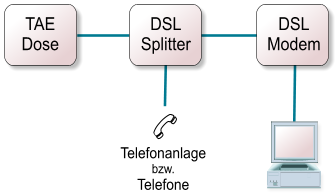

.. selflinux documentation master file, created by
   sphinx-quickstart on Wed Dec 23 13:39:08 2015.
   You can adapt this file completely to your liking, but it should at least
   contain the root `toctree` directive.

Internet
========

Zugang
------

PPP-Verbindung
^^^^^^^^^^^^^^

Beschreibung

Die Pfadbeispiele sind in diesem Dokument wie folgt geregelt:

pppd, chat und diald befinden sich in /usr/sbin.
Die Konfigurationsdateien befinden sich in /etc/ppp, /etc/diald und /etc/chatscripts.

Bei anderen Linux-Distributionen können es andere Verzeichnisse sein.

PPP-Verbindung von Hand herstellen: pppd und chat
"""""""""""""""""""""""""""""""""""""""""""""""""

Um eine PPP-Verbindung herzustellen, ruft man auf: /usr/sbin/pppd. pppd ruft seinerseits auf: /usr/sbin/chat. chat stellt das Modem ein, wählt den Provider an, identifiziert sich und verlangt vom Provider, den PPP-Server zu starten. Dann gibt es zurück an pppd.

pppd verhandelt dann mit dem PPP-Server über den Aufbau einer PPP-Verbindung und bekommt schließlich zwei temporäre IP-Nummern: eine für den lokalen Rechner und eine zweite für den Rechner auf der Provider-Seite. Über diese IP-Nummern wird dann der Verkehr mit dem Internet abgewickelt. Anfragen ans Internet gehen an die IP-Nummer des Providers, Antworten aus dem Internet gehen an die lokale IP-Nummer.

PPP-Verbindung von Hand beenden:
""""""""""""""""""""""""""""""""

Die Verbindung kann beendet werden mit dem Shell-Skript /usr/sbin/poff.

Parameter / Optionen für pppd und chat
""""""""""""""""""""""""""""""""""""""

pppd benötigt einige Parameter (Optionen). Es sucht diese Parameter in der Datei /etc/ppp/options und in der Kommandozeile. Die Kommandozeilenparameter haben Vorrang.

Die Bedeutung jedes Parameters sieht man sich mit man pppd an. Bei mir lautet der Aufruf von pppd folgendermaßen:
root@linux # /usr/sbin/pppd /dev/modem 115200 asyncmap 0 noauth crtscts debug lock modem defaultroute proxyarp noipdefault lcp-echo-interval 30 lcp-echo-failure 4 ipcp-accept-local ipcp-accept-remote noipx connect "/usr/sbin/chat -v -f /etc/chatscripts/cis" user <meine user-id> disconnect "/usr/sbin/chat -v -f /etc/chatscripts/hangug"

Das Ganze ist eine einzige Kommandozeile. Die Schrägstriche am Ende jeder Zeile bedeuten: Diese Zeile wird in der nächsten Zeile fortgesetzt.

Der komplizierteste ist der Parameter connect. Der Inhalt dieses Parameters ist selbst wiederum eine komplette Kommandozeile mit Parametern / Optionen. Nämlich der Aufruf des Programms chat. 

Der Parameter connect bzw. der chat-Aufruf
""""""""""""""""""""""""""""""""""""""""""

Das Programm chat wickelt ein Frage-Antwort-Spiel ab nach dem Muster:

Warte auf <Ausgabe vom Provider>, antworte <lokale Eingabe>,
Warte auf <Ausgabe vom Provider>, antworte <lokale Eingabe>,
Warte auf <Ausgabe vom Provider>, antworte <lokale Eingabe>, usw.

Die Liste von Fragen und Antworten kann in einer Datei z.B. /etc/chatscripts/cis oder in der Kommandozeile übergeben werden.

Chatskript /etc/chatscripts/cis2 für Compuserve (neues Netz):

/etc/chatscripts/cis2 für Compuserve (neues Netz)

"" ATZ
OK ATDT25449324
CONNECT ""
"Login:" cisv1
"Password:" classic
"User ID:" "<meine user-id>/noint/go:pppconnect"
"Password: " "<mein passwort>"
	 

Diese Zeilen bedeuten:
warte auf nichts - antworte mit Modembefehl: Reset,
warte auf Meldung vom Modem: OK -antworte mit Modembefehl: Tonwahl Compuserve,
warte auf Meldung vom Modem: CONNECT - antworte mit nichts (d.h. nur Zeilenvorschub),
Die restlichen 3 Zeilen sind die Verhandlung mit dem Provider.

Chatskript /etc/chatscripts/cis für Compuserve (altes Netz):

/etc/chatscripts/cis für Compuserve (altes Netz)

'' 'ATZ'
'OK' 'ATDT0406913666'
'CONNECT' ''
'Host Name:' 'CIS'
'User ID:' '<meine user id>/GO:PPPCONNECT'
'Password:' '<mein passwort>'
	 

Chatskript /etc/chatscripts/ton für T-Online:

/etc/chatscripts/ton für T-Online

"" ATZ
OK ATDT0191011
CONNECT
	 

Hinter CONNECT habe ich noch ein Leerzeichen stehen, ich bin allerdings nicht sicher, ob das wirklich nötig ist.

Aus verschiedenen Newsgroup-Beiträgen weiß ich, dass es bei T-Online sehr darauf ankommt, was man nach der Meldung Connect (vom Modem) noch an T-Online sendet, damit dort auch tatsächlich der PPP-Server gestartet wird.

Die obige Version meines Chat-Skripts läuft zur Zeit mit Debian-Linux 2.1 (slink). Vor einem dreiviertel Jahr lief mit Debian-Linux 2.0 (hamm)folgende Version:
Debian-Linux 2.1 /etc/chatscripts/ton für T-Online

"" ATZ
OK ATDT0191011
CONNECT \d\c
	 

Chatskript /etc/chatscripts/hangup für den pppd-Parameter disconnect:

/etc/chatscripts/hangup für den pppd-Parameter disconnect

'' '\K\d'
'' '+++\d'
'' 'ATH\d'
'' 'ATZ'
	 

Diese Zeilen bedeuten:
warte auf nichts - lass das Modem einen BREAK senden, warte 1 Sekunde,
warte auf nichts - Modembefehl Kommandomodus, warte 1 Sekunde,
warte auf nichts - Modembefehl Aufhängen,warte 1 Sekunde,
warte auf nichts - Modembefehl Reset

Chatskript für andere Provider: minicom

Ein Terminalprogramm wie z.B. minicom kann man benutzen, um das Chatskript für andere Provider bzw. andere Einwahlprozeduren zu ermitteln. Für Compuserve muß man die Modemparameter auf 7E1 einstellen (7 Bit Data, Even Parity, 1 Stop Bit), sonst auf 8N1. 

Der Parameter /dev/modem für pppd:
""""""""""""""""""""""""""""""""""

/dev/modem bedeutet das Gerät bzw. die Schnittstelle für die PPP-Verbindung. Wenn das Gerät /dev/modem noch nicht vorhanden ist, kann man es z.B. erzeugen mit cp /dev/ttyS0 /dev/modem , dabei steht ttyS0 für COM1, ttyS1 für COM2, usw.

Der Parameter user für pppd:
""""""""""""""""""""""""""""

Während der PPP-Verhandlung (das ist nach Beendigung des chat-Programms) benötigt pppd noch einmal die User-ID und das Passwort. Bei Compuserve gehen also User-ID und Passwort zweimal durch die Leitung: Einmal mit chat und einmal mit pppd.

Wenn User-ID und Passwort gesendet werden müssen, nimmt pppd den Inhalt des Parameters user und schlägt dann das Passwort in der Datei /etc/ppp/pap-secrets nach. Dort sucht es nach einer Zeile der Form

    <user-id> * <passwort> 

Die User-ID in Compuserve besteht üblicherweise aus einer sechsstelligen Zahl, gefolgt von einem Komma, gefolgt von einer dreistelligen Zahl, Beispiel: 123456,789

Die User-ID in T-Online besteht aus der Anschlusskennung (z.B. 000011112222), gefolgt von der T-Online-Nummer (z.B. 320044445555), gefolgt von einer Raute, gefolgt von der Mitbenutzernummer, (z.B. 0001). Beispiel: 000011112222320044445555#0001

Die T-Online-Nummer ist im allgemeinen von der Telefonnummer abgeleitet. Die Anschlusskennung ist die erste und längere der beiden Zahlen, die Sie geheimhalten sollten, und die Ihnen im Brief auf dunklem Untergrund mitgeteilt wurde. (Die zweite Zahl, die Sie geheimhalten sollten, ist das Passwort).

Wenn - wie z.B. bei T-Online - die User-ID eine Raute (#) enthält, oder wenn sie Leerzeichen enthält, sollte die User-ID in Anführungszeichen eingeschlossen werden. Die Raute könnte sonst als Kommentarzeichen (alles was jetzt kommt, ist nur Kommentar ohne Bedeutung) bzw. das Leerzeichen als Parameter-Trennzeichen interpretiert werden.

PPP-Verbindung automatisch herstellen: diald
""""""""""""""""""""""""""""""""""""""""""""

Der Ablauf ist hier so: diald erzeugt beim Start einen Proxy-Server, über den alle Netzanfragen gehen. Wenn der Proxy merkt, dass eine gewünschte IP-Nummer im lokalen Netz nicht vorhanden ist, läßt er diald eine PPP-Verbindung aufbauen. Wenn die Verbindung eine gewisse Zeit nicht benutzt wird, baut diald die Verbindung wieder ab und läßt das Modem auflegen.

Zum Herstellen der Verbindung ruft diald erst chat und anschließend pppd auf. Die Kommandozeile zum Aufruf von chat und sämtliche Parameter für pppd werden beim Aufruf von diald nur an diald übergeben. diald gibt sie dann bei Bedarf weiter an chat bzw. an pppd. Der Parameter connect fehlt also diesmal bei den Parametern für pppd, statt dessen bekommt ihn diald.

Parameter-Datei /etc/diald/diald.options
""""""""""""""""""""""""""""""""""""""""

/etc/diald/diald.options

mode ppp
device /dev/modem
connect "/usr/sbin/chat -v -f /etc/chatscripts/ton"
speed 115200
modem
lock
crtscts
local 127.0.0.2
remote 127.0.0.3
dynamic
defaultroute
include /etc/diald/standard.filter
pppd-options \
debug \
noauth \
user <meine user-id> \
ipcp-accept-local \
ipcp-accept-remote
debug 0x007D
	

Die Datei /etc/ppp/options muß für diald leer sein:
"""""""""""""""""""""""""""""""""""""""""""""""""""

Falls eine Datei /etc/ppp/options vorhanden ist, wird ihr Inhalt diald stören. Irgendwo habe ich gelesen, dass diese Datei aber auch nicht ganz fehlen darf, sie muß vorhanden, aber leer sein.

Erfolgskontrolle: früher in /var/log/ppp.log - jetzt in /var/log/debug:
"""""""""""""""""""""""""""""""""""""""""""""""""""""""""""""""""""""""

Wenn diald richtig läuft, sollte die Logdatei etwa so aussehen:
/var/log/debug

Jul 26 15:04:54 server diald[136]: Running connect (pid = 392).
Jul 26 15:04:54 server chat[392]: abort on (BUSY)
Jul 26 15:04:54 server chat[392]: abort on (NO CARRIER)
Jul 26 15:04:54 server chat[392]: abort on (VOICE)
Jul 26 15:04:54 server chat[392]: abort on (NO DIALTONE)
Jul 26 15:04:54 server chat[392]: abort on (NO ANSWER)
Jul 26 15:04:54 server chat[392]: send (ATZ^M)
Jul 26 15:04:54 server chat[392]: expect (OK)
Jul 26 15:04:54 server chat[392]: ^M
Jul 26 15:04:54 server chat[392]: OK
Jul 26 15:04:54 server chat[392]: -- got it
Jul 26 15:04:54 server chat[392]: send (ATDT0191011^M)
Jul 26 15:04:54 server chat[392]: expect (CONNECT)
Jul 26 15:04:54 server chat[392]: ^M
Jul 26 15:05:21 server chat[392]: ^M
Jul 26 15:05:21 server chat[392]: CONNECT
Jul 26 15:05:21 server chat[392]: -- got it
Jul 26 15:05:21 server chat[392]: send (\d)
Jul 26 15:05:22 server diald[136]: Running pppd (pid = 425).
Jul 26 15:05:22 server diald[425]: Running pppd: /usr/sbin/pppd
-detach modem crtscts mtu 1500 mru 1500 debug noauth user <my user id>
ipcp-accept-local ipcp-accept-remote
Jul 26 15:05:22 server pppd[425]: pppd 2.3.5 started by root, uid 0
Jul 26 15:05:22 server pppd[425]: Using interface ppp0
Jul 26 15:05:22 server pppd[425]: Connect: ppp0 <--> /dev/ttyS1
Jul 26 15:05:22 server pppd[425]: sent [LCP ConfReq id=0x1 <magic
0x9b58> <pcomp> <accomp>]
Jul 26 15:05:23 server pppd[425]: rcvd [LCP ConfReq id=0x1 <mru 1524>
<asyncmap 0xa0000> <auth pap> <pcomp> <accomp> < 13 09 03 00 c0 7b 7d
a5 75>]
Jul 26 15:05:23 server pppd[425]: sent [LCP ConfRej id=0x1 < 13 09 03
00 c0 7b 7d a5 75>]
Jul 26 15:05:23 server pppd[425]: rcvd [LCP ConfAck id=0x1 <magic
0x9b58> <pcomp> <accomp>]
Jul 26 15:05:23 server pppd[425]: rcvd [LCP ConfReq id=0x2 <mru 1524>
<asyncmap 0xa0000> <auth pap> <pcomp> <accomp>]
Jul 26 15:05:23 server pppd[425]: sent [LCP ConfAck id=0x2 <mru 1524>
<asyncmap 0xa0000> <auth pap> <pcomp> <accomp>]
Jul 26 15:05:23 server pppd[425]: sent [PAP AuthReq id=0x1 user="<my
user id>" password="<my password>"]
Jul 26 15:05:23 server pppd[425]: rcvd [PAP AuthAck id=0x1 ""]
Jul 26 15:05:23 server pppd[425]: Remote message:
Jul 26 15:05:23 server pppd[425]: sent [IPCP ConfReq id=0x1 <addr
192.168.13.17> <compress VJ 0f 01>]
Jul 26 15:05:23 server pppd[425]: rcvd [IPCP ConfReq id=0x1 <compress
VJ 0f 01> <addr 193.158.143.45>]
Jul 26 15:05:23 server pppd[425]: sent [IPCP ConfAck id=0x1 <compress
VJ 0f 01> <addr 193.158.143.45>]
Jul 26 15:05:23 server pppd[425]: rcvd [IPCP ConfNak id=0x1 <addr
62.156.32.53>]
Jul 26 15:05:23 server pppd[425]: sent [IPCP ConfReq id=0x2 <addr
62.156.32.53> <compress VJ 0f 01>]
Jul 26 15:05:23 server pppd[425]: rcvd [IPCP ConfAck id=0x2 <addr
62.156.32.53> <compress VJ 0f 01>]
Jul 26 15:05:23 server pppd[425]: local IP address 62.156.32.53
Jul 26 15:05:23 server pppd[425]: remote IP address 193.158.143.45
Jul 26 15:05:23 server diald[136]: New addresses: local 62.156.32.53,
remote 193.158.143.45.
Jul 26 15:08:35 server diald[136]: Closing down idle link.
Jul 26 15:08:35 server pppd[425]: Terminating on signal 2.
Jul 26 15:08:35 server pppd[425]: sent [LCP TermReq id=0x2 "User
request"]
Jul 26 15:08:35 server pppd[425]: rcvd [LCP TermAck id=0x2]
Jul 26 15:08:35 server pppd[425]: Connection terminated.
Jul 26 15:08:36 server pppd[425]: Exit.
Jul 26 15:08:38 server diald[136]: Delaying 30 seconds before clear to
dial.

Zum Surfen werden Nameserver-Eintragungen in /etc/resolv.conf gebraucht:
""""""""""""""""""""""""""""""""""""""""""""""""""""""""""""""""""""""""

/etc/resolv.conf

#Nameserver für Compuserve:
search compuserve.com
nameserver 195.232.32.6
nameserver 195.232.32.7

#Nameserver für T-Online:
search btx.dtag.de
nameserver 194.25.2.129
	

Weitere Informationsquellen:
""""""""""""""""""""""""""""

    Alberts Homepage - die umfassendste Seite zu T-Online und PPP, die ich bisher gesehen habe - (en http://www.albert-rommel.de/ppp.htm)
    Besonderheiten des Netzzugangs bei T-Online (de http://home.t-online.de/home/Diedrich.Ehlerding/besonderheiten.html)
    ZDNet-Special zum Thema Linux (de http://www.zdnet.de/produkte/artikel/sw/linuxspecial/linuxspecial01-wf.html)
    PPP Help (en http://howto.linuxberg.com/)
    T-Online PPP (de http://www.et.FH-Osnabrueck.de/~std7765)
    The diald Homepage (en http://diald.sourceforge.net/)

Autoren

    Jörn Absatz mail@absatz.de
    Alexander Fischer selflinux@tbanus.de
	
Formatierung

    Matthias Hagedorn matthias.hagedorn@selflinux.org

ISDN unter Linux
^^^^^^^^^^^^^^^^

ISDN, wofür brauch' ich das?
""""""""""""""""""""""""""""

Schnelle Datenverbindung

ISDN bietet die Möglichkeit, die Daten schnell und digital zu übertragen. Es entfällt also der Modulator/Demodulator (Modem). ISDN-Modems sind Geräte, die der Computer wie Modems über die serielle Schnittstelle anspricht. Prinzipiell ist es auch möglich, die beiden Übertragungskanäle zusammenzuschalten und damit die Übertragungsgeschwindigkeit zu verdoppeln.

ISDN hat eine sogenannte Dienstekennung, mit der man Daten-, Fax- und Sprachübertragung unterscheiden kann.

Schnelle Verbindung ins Internet

Nicht nur die Datenübertragung ist recht schnell. Auch der Aufbau der Verbindung erfolgt deutlich schneller als bei Modems.

Transparente Netzwerkverbindung

Unter Linux ist es mit ISDN möglich, die Verbindung als Netzwerk einzurichten, so dass alle Zugriffe, die den eigenen Bereich verlassen über das ISDN-Gerät z.B. ins Internet weitergeleitet werden.
Es lassen sich auch private Netze mittels ISDN erstellen und koppeln. Diese Kopplung muss nicht über das Internet erfolgen. So lässt sich beispielsweise ein Freundes- oder Vereinsnetz aufbauen.

Anrufbeantworter

ISDN unter Linux ermöglicht es, einen Anrufbeantworter für jede Mehrfachrufnummer (MSN) einzurichten und Ansagen abhängig von der anrufenden oder angerufenen Telefonnummer abzuspielen.

Die Einrichtung des Anrufbeantworters vbox wird in einem anderen Dokument beschrieben.

Installation
""""""""""""

Die Installation von ISDN unter Linux wird von immer mehr Distributionen unterstützt. Bei SuSE wird ISDN in YAST(1) unter "Administration des Systems | Hardware ins System integrieren | ISDN Hardware konfigurieren" vorgenommen. Danach sind zwei Masken auszufüllen, die eine für die Hardware, die zweite für die Software. Auch YAST(2) bietet die Möglichkeit ISDN einzurichten, allerdings in der Gruppe "Netzwerk/Basis -> Konfiguration von ISDN"

Welche Parameter werden benötigt?

Wenn PCI-ISDN-Karten verwendet werden, kann das BIOS den Typ, die Adresse und den benötigten Interrupt an das System melden. Bei älteren Karten, muss man selbst etwas Hand anlegen. Ist die Karte eine ältere ISA-Plug-and-Play-Karte, so muss zuerst das Plug-and-Play-System konfiguriert werden, damit auf die Karte zugegriffen werden kann.

Kartentyp

Es sollte bekannt sein, welche Karte eingebaut ist bzw. eingebaut wird, denn die verschiedenen Typen benötigen unterschiedliche Parameter. Bei ISA-(oder Plug-and-Play-)Karten muss man die IO-Adresse und den Interrupt in Erfahrung bringen. Dies geschieht am besten durch Studium der Dokumentation und evtl. Jumper-Einstellungen auf der Karte.
Einige Karten benötigen noch weitere Werte, die ebenfalls durch Studium der Dokumentation in Erfahrung zu bringen sind.

Wenn Sie eine aktive ISDN-Karte einbinden wollen/müssen, so sollten Sie die spezielle Dokumentation der Distribution für diese Karten zuerst lesen. Bei den aktiven Karten von AVM muss beispielsweise noch zusätzlich Software auf die ISDN-Karte geladen werden, bevor sie angesprochen werden kann. Diese Software muss ebenfalls vorhanden sein, sei es über die Installationsroutinen der Distribution oder über einen Download bzw. von Diskette/CD des Herstellers.

IP-Adressen

Da ISDN als Netzwerkgerät (Device) eingerichtet wird, muss man der Karte eine IP-Adresse zuweisen. Diese wird zwar beim Verbindungsaufbau geändert, muss aber zu Anfang angegeben werden, damit das Gerät als Netzwerkgerät angesehen wird.

Wenn man eine IP-Adresse aus einem anderen freien Netzwerk verwendet wird automatisch eine Route darauf gesetzt. Dann kann man angeben, dass alle Datenpakete über diese IP-Adresse ins Internet geschickt werden sollen (default-Route).

Es wird noch eine zweite IP-Adresse benötigt, die dem anderen Ende der ISDN-Verbindung zugewiesen wird. Am besten unterscheiden sich die beiden Adressen nur im letzten Byte um 1 (Bsp.: lokale IP-Adresse der ISDN-Karte: 192.168.100.100 und 2. IP-Adresse 192.168.100.101). Die zweite Adresse wird auch als Point-to-Point-Adresse bezeichnet.

MSN

Man muss in aller Regel dem ISDN-Gerät eine Multi-Subscriber-Number (MSN) zuweisen. Diese wird sowohl als Kennung an die Gegenstation gesendet als auch für die Annahme eines Anrufes benötigt. Standardmäßig enthält jeder ISDN-Anschluss 3 Nummern (bei der Telekom können noch 7 weitere kostenlos geordert werden). Eine davon muss man dem ISDN-Gerät zuweisen.

Protokoll

Wenn ISDN über eine ISDN-Nebenstellenanlage angeschlossen ist oder ein älterer ISDN-Anschluss (vor 1995) vorliegt, kann es sein, dass noch die nationale ISDN-Variante (1TR6) verwendet wird. Im Regelfall wird das Protokoll jedoch Euro-ISDN (EDSS1) sein.

Zugangsdaten für Provider

Um einen Internetzugang zu bekommen muss man eine Telefonnummer, ein Konto (Account) und ein Passwort bei einem Service-Provider haben. Es gibt aber auch sogenannte Call-by-Call-Zugänge, wobei das Konto und das zugehörige Passwort allgemein bekannt und zugänglich sind. So kann man z.B. eine Verbindung über Arcor mit dem Kontonamen arcor, dem Passwort internet und der Telefonnummer 010700192070 aufbauen. Dies ist für Testzwecke sehr nützlich.

Allerdings kann man dann noch nicht richtig surfen, da der Rechner nicht weiß, unter welcher IP-Adresse er die gewünschten Webseiten finden kann. Dazu muss noch die Adresse eines Nameservers eingetragen werden. Prinzipiell kann man die Adresse eines beliebigen Nameservers eintragen, jedoch kennt man üblicherweise nicht soviele, sondern bekommt vom Serviceprovider eine Adresse genannt.

Installation für Internetanschluss

Installationsroutinen der Distribution

Mit den angegebenen Parametern können Sie sich an die Installation machen. Jede Distribution hat entsprechende Programme und erfragt die Parameter. Wenn die Hardware nicht exotisch ist und Sie alle gewünschten Parameter richtig eingegeben haben funktioniert ISDN üblicherweise. Ein Reboot ist zwar nicht unbedingt notwendig aber trotzdem empfehlenswert um sicherzustellen, dass das ISDN-Subsystem richtig gestartet wird. Achten Sie auf entsprechende Meldungen beim Systemstart.

Eintragen eines Nameservers

Auch dafür haben Distributionen ein Hilfsprogramm. Die Hardcore-Linuxer schreiben mit ihrem Lieblingseditor den benötigten Eintrag in die Datei /etc/resolv.conf. Darin muss (mindestens) folgender Eintrag stehen: "nameserver IP-ADRESSE_DES_SERVERS", wobei die Anführungszeichen nicht geschrieben werden und die IP-Adresse eingetragen werden muss, die der Serviceprovider mitgeteilt hat.

Besonderheiten beim Zugang über T-Online

Das Einrichten eines ISDN-Zugangs für T-Online ist auch kein Hexenwerk. Die Zugangsdaten sind ein großer Zahlenwust, der fehlerfrei eingegeben werden muss.

Der Loginname setzt sich zusammen aus der Zugangsnummer (wird auch häufig als Anschlusskennung bezeichnet), die in der Regel 12-stellig ist, der Abrechnungsnummer (oder früher auch der Telefonnummer, ebenfalls 12-stellig, beginnt jetzt häufig mit 32) und der Mitbenutzernummer, die einem Hash-Zeichen ("#") folgt und 4-stellig sein muss.

Beispiel:
Zugangsnummer: 123456789098
Rechnungsnummer: 320012345678
Mitbenutzernummer: 0001

Daraus ergibt sich der Loginname als: "123456789098320012345678#0001"

Das Passwort muss entsprechend angegeben werden. Man sollte es auf der Hompage der Telekom de https://webmbv.t-online.de/ abändern.

Sicherheitsaspekte

Die Zugangsdaten werden in der Datei /etc/ppp/pap-secrets abgelegt, und zwar im Klartext! Deshalb darf diese Datei nur von root gelesen und geschrieben werden dürfen!

Der Befehl
user@linux $ ls -l /etc/ppp/pap-secrets

muss folgende Rechte anzeigen:
-rw-------    1 root     root          397 Apr  6  2001 pap-secrets

Wenn das nicht so ist, so geben Sie als Administrator (root-user) folgenden Befehl ein:
root@linux # chmod 600 /etc/ppp/pap-secrets

Denken Sie daran, dass jeder, der unberechtigterweise an diese Datei kommen kann, auf Ihre Kosten surfen kann. Deshalb wird spätestens jetzt ein gutes root-Passwort benötigt.

Hilfe bei Problemen
"""""""""""""""""""

Wenn die Einrichtung von ISDN nicht geklappt hat, sollten Sie zuerst die Logdatei /var/log/messages auf Fehlermeldungen des ISDN-Systems untersuchen. Hilfreich ist es, sich bei den weiteren Versuchen die Datei in einem eigenen Terminalfenster mit dem Befehl
root@linux # tail -f /var/log/messages

ständig anzeigen zu lassen. Eine Ansicht der kompletten messages-Datei kann mittels des Befehles
root@linux # less /var/log/messages

erfolgen. Achtung: Die Datei kann mehrere tausend Seiten beinhalten!

Was kann schief gehen?

Laut Murphys Gesetzen geht - wenn was schief geht - alles schief, was möglich ist. Aber mit etwas Systematik kann man die Probleme analysieren und beheben.

Als Erstes muss der Zugriff auf das ISDN-Gerät funktionieren

Dies geschieht üblicherweise mittels Kernel-Modulen (mehrere Module sind dafür nötig). Man kann ISDN auch direkt in den Kernel einkompilieren lassen, ist aber bei den Standardinstallationen praktisch nicht der Fall!

Dazu muss der Kernel Modulsupport unterstützen und die ISDN-Module müssen vorhanden sein.
Wenn der Befehl lsmod eine Tabelle ausgibt, sind Module geladen, also Modulsupport vorhanden.

Nun sollte man sich auf die Suche nach den benötigten Modulen machen. Diese liegen üblicherweise in /lib/modules/KERNELVERSION/drivers/isdn/. Wenn dieses Verzeichnis nicht vorhanden oder leer ist, müssen die Module erst im Rahmen einer Kernelkompilierung erstellt werden. Die Verzeichnisnamen im ISDN-Modulverzeichnis geben ja schon Hinweise auf die unterstützten Karten. Ausgenommen das Modul Hisax - eine Karte mit diesem Namen ist mir nicht bekannt. Die Aussage ist so korrekt, allerdings ist das HiSax-Modul für sehr viele passive ISDN-Karten zuständig, die den ISDN-Chip von Siemens verwenden. Dazu zählen folgende passive Karten:
TypNr 	Name der Karte
1 	Teles 16.0
2 	Teles 8.0
3 	Teles 16.3 (non PnP)
4 	Creatix/Teles PnP
5 	AVM A1 (Fritz)
6 	ELSA PCC/PCF cards
7 	ELSA Quickstep 1000
8 	Teles 16.3 PCMCIA
9 	ITK ix1-micro Rev. 2
10 	ELSA PCMCIA
11 	Eicon.Diehl Diva ISA PnP
11 	Eicon.Diehl Diva PCI
12 	ASUS COM ISDNLink
13 	HFC-2BS0 based cards
14 	Teles 16.3c
15 	Sedlbauer Speed Card (=Teledat 100)
15 	Sedlbauer PC/104
16 	USR Sportster internal
17 	MIC card
18 	ELSA Quickstep 1000PCI
19 	Compaq ISDN S0 ISA card
20 	NETjet PCI card
21 	Teles PCI
22 	Sedlbauer Speed Star (PCMCIA)
24 	Dr. Neuhaus Niccy PnP
24 	Dr. Neuhaus Niccy PCI
25 	AVM A1 PCMCIA (Fritz!)
26 	Teles S0Box
27 	Fritz PCI
27 	AVM PnP
28 	Sedlbauer Speedfax

Versuchen Sie als Erstes die Treiber (= Kernelmodul) für Ihre ISDN-Karte zu laden. Verwenden Sie dazu den modprobe-Befehl, da dieser evtl. zusätzlich benötigte Module automatisch mit lädt.
Sie müssen dem Modul Parameter mitgeben, z.B. TypNummer (vgl. obige Tabelle), die IO-Adresse oder die Nummer des Interrupts, den Namen (id), unter dem die Karte angesprochen und das ISDN-Protokoll (1 = 1TR6, 2 =EDSS1 ) das verwendet werden soll. Ein entsprechender Aufruf könnte wie folgt lauten:
root@linux # modprobe hisax typ=5 io=0x200 irq=7 id=ippp0 protocol=2

...um den Treiber für eine Fritz-Karte zu laden. Wenn es keine Fehlermeldung gibt, sollte das hisax-, isdn- und ein shlc-Modul zusätzlich in der Ausgabe von lsmod zu sehen sein. Ist dies nicht der Fall müssen Sie entweder die Parameter ändern, einen anderen Treiber ausprobieren oder den Support der Distribution anrufen. Weitergehende Informationen z.B. über Kartentypen, benötigte Parameter und Modulnamen finden Sie auch in der Dokumentation des Kernels.

Wenn das Laden des Treibers erfolgreich war, sollte sich der Schnittstelle eine IP-Adresse zuweisen lassen. Den Namen der Schnittstelle haben Sie ja beim Laden des Moduls dem Treiber zugewiesen.
root@linux # ifconfig ippp0 192.168.99.99

sollte nun funktionieren, was Sie durch die erneute Eingabe von
root@linux # ifconfig

(ohne Parameter) kontrollieren können.

Wenn auch der Befehl
root@linux # isdnctrl list ippp0

(bzw. mit dem von Ihnen vergebenen Namen) keine Fehlermeldung (wie z.B. no such device o.ä) bringt, läuft die Schnittstelle.

Am besten konfigurieren Sie die ISDN-Schnittstelle nun nochmals mit den neuen Erkenntnissen und dem Werkzeug der Distribution.

Kein Login beim Provider

Wenn die Karte erfolgreich konfiguriert wurde sollte auch ein Zugang zum Provider möglich sein. Wenn das nicht der Fall ist kommen folgende Ursachen in Frage:

    Das ISDN-Gerät ist nicht mit der ISDN-Leitung verbunden (NTBA), oder das Verbindungskabel ist defekt.
    Die angewählte Nummer ist falsch.
    Der Loginname ist falsch.
    Besonders der lange nummerische Zugangsname von T-Online beherbergt viele Möglichkeiten für Zahlendreher. Wichtig ist auch, dass die Mitbenutzernummer (nach dem Hash-Zeichen - #) vierstellig und größer 0 ist.
    Das Passwort ist falsch.

Die Datei /var/log/messages gibt viele Hinweise zu den Fehlerquellen. Das ISDN-Protokoll gibt sogenannte Cause-Codes zurück, die den Fehler angeben. Die folgenden Tabelle listet einige der Fehlercodes auf und gibt Hinweise für die Behebung:
Fehler-Code 	Problem/Lösung
E0066: Recovery on timer expiry 	Your peer doesn't handle a part of the DSS1 protocol correctly - its reactions upon sending -complete-requests are faulty; solution: Recompile your kernel with the option "Disable sending complete"
Partner kann mit Teilen des DSS1-Protokolls nichts anfangen - Reaktion auf sending- complete-requests sind fehlerhaft; Lösung: Kernel neu kompilieren mit "Disable sending complete"
E0058: Incompatible destination 	It is true that you chose the right telephone number, but your peer has not loaded his ISDN- subsystem correctly or even not at all; this can happen even if the peer has misconfigured the incoming telephone numbers. Mind: addphone out 123456 or addphone out 089123456 BUT: addphone in 89123456 - this is the ONLY possibility: Include area code even for local calls, but without leading zero.
Sicher haben Sie die richtige Telefonnummer gewählt, aber das ISDN-Subsystem beim Partner ist falsch oder nicht konfiguriert; dies passiert auch wenn die anrufende Telefonnummer beim Partner eingerichtet wurde. ACHTUNG: "addphone out 123456" oder "addphone out 089123456" RICHTIG: "addphone in 89123456" - ist nur SO möglich: Immer mit Vorwahl aber ohne führende Null.
E0201: Unassigned number 	Your dial out telephone number is wrong; if an areacode is necessary you must include a leading zero. Check out the telephone number syntax described under E0058.
Die gewählte Nummer ist falsch: Wenn eine Vor- wahl nötig ist, muss die führende Null dabei sein. Die Schreibweise der Telefonnummer prüfen vgl. auch E0058)
E0222: No circuit or channel available (public network) 	This is what you usually call "BUSY".
Im Volksmund: "Besetzt"
E0022: No circuit or channel available (user) 	This may occur, when the physical connection to the peer is broken; it happened to me that the peer's telephone lines got broken, so I didnt get an answer from the telephone company but instead my own ISDN card refused to put my call through to the peer.
Dies kann passieren, wenn die physikalische Verbindung zum Partner zusammenbricht. Es passierte, dass die Leitung des Gegenübers zusammenbrach, ohne das es eine Rückmeldung von der Telefongesellschaft gab. Die lokale ISDN-Karte weigerte sich den Anruf abzusetzen.
E023f: Service or option not available 	The server you want to connect to is down. This one I got only one time when I tried to connect to SUSE's ISDN server.
Der anzurufende Server ist nicht eingeschaltet oder nicht erreichbar.
E0211: User Busy 	The peer is busy; this is the 'normal' message everybody expects if the peer is actually busy. But unfortunately a different cause code is possible for exactly the same situation: For example E0222.
Der Telefonanschluss ist besetzt; dies ist die 'normale' Meldung. Leider ist auch eine andere Meldung für diese Situation möglich: Siehe auch E0222.

Diese Tabelle wurde, mit freundlicher Genehmigung des Autors Jürgen Leising (  juergen.leising@hamburg.de) dessen Webseite de http://homepage.hamburg.de/c98d93/isdn.html entnommen.

Kein Zugriff auf Webseiten

Wenn die Einwahl klappt sieht man dies in der Datei /var/log/messages, wenn sinngemäß folgende Einträge auftauchen: remote IP xx.xx.xx.xx und local IP yy.yy.yy.yy. Wenn trotzdem keine Webseiten mit Name aufgerufen werden können, so kann das 2 Ursachen haben:

    keine defaultroute auf das ISDN-Device gesetzt
    kein Nameserver bekannt.

Es kommt vor, dass das Script /etc/ppp/ip-up, welches vom ippp-Daemon aufgerufen wird, die Einträge nicht richtig setzt. Das Script ruft ifconfig mit der zugewiesenen IP-Adresse auf und setzt das default-Gateway auf das ISDN-Gerät. Prüfen Sie als erstes mit dem Befehl
root@linux # route -n

ob ein default-Gateway gesetzt wurde (möglicher Eintrag 0.0.0.0 yy.yy.yy.yy ippp0, wobei yy.yy.yy.yy der IP-Adresse am anderen Ende der Verbindung, also beim Provider entspricht. Sollten die Adressen in Ordnung sein, sollte ein Ping auf eine bekannte Adresse funktionieren. Unter der IP 193.99.144.71 kann man z.B. den Server des Heise-Verlages erreichen. Wenn der Ping durchkommt, liegt das Problem am Nameservereintrag.

Grundsätzlich hilft einem jeder Nameserver weiter, man sollte aber dem seines Providers den Vorzug geben. Deshalb kann man (evtl. zu Testzwecken den von T-Online verwenden. Tragen Sie in die Datei /etc/resolv.conf "nameserver 212.185.252.71" ein (sicherheitshalber mit einer Leerzeile am Ende). Nun sollte man auch die Adressen mit Namen aufrufen können und der ping www.heise.de funktionieren. 

Technik
"""""""

ISDN

ISDN steht für Integrated Services Digital Network.

Fangen wir von hinten an: Es handelt sich um ein Netzwerk. Über die beiden Kupferdrähte wird also z.B. nicht nur eine Point-To-Point-Verbindung aufgebaut, sondern es können mehrere Verbindungen gleichzeitig bestehen.

Die Daten werden alle digital ausgetauscht. Analogdienste wie z.B: Fax sind hierüber daher potentiell schwieriger zu handhaben. Normalerweise werden Analogdienste über Spezialgeräte wie  a/b-Wandler oder TK-Anlagen gefahren.
a/b-Wandler 	Wandelt analoge in digitale Signale um.
TK-Anlage 	Sind Telefonanlagen

Integrated Services deutet an, dass verschiedene Dienste über dieses Netzwerk genutzt werden können. Typische Services sind Analog-Sprache (SI=0) oder ISDN-Daten (SI=7), was uns hier interessiert.

Der Endpunkt der Telekom-Leitung in einem Haushalt oder einem Büro ist der NTBA (kurz auch NT), der Network Terminator Basis-Anschluss. Das ist der kleine Kasten, bis zu dem sich der Netzanbieter zuständig fühlt.

An einem NTBA können (normalerweise) 2 Kabel herausgeführt werden, diese bilden gemeinsam ein Bus-System, den sogenannten S0-Bus.

An den S0-Bus können 8 Endgeräte angeschlossen werden. Typische Endgeräte sind ISDN-Telefone, TK-Anlagen, G4-Fax-Geräte, ISDN-Terminaladapter und ISDN-Karten.

Der S0-Bus bietet 3 Kanäle: einen Steuerkanal, genannt D-Kanal. Weiterhin stehen zwei Datenkanäle, genannt Nutzkanal oder B-Kanal, mit je 64 kbit/s zur Verfügung, die jeweils zu unterschiedlichen Partnern führen und mit unterschiedlichen Diensten genutzt werden können.

Die Bezeichnung der Kanäle (laut Technik der Netze von Gerd Siegmund, 3. Aufl. S. 316):

    Die Bezeichnungen für die Kanaltypen (B- und D-Kanal) sind ursprünglich keine Abkürzungen mit tieferen Bedeutungen. In der Anfangszeit der ISDN-Standardisierung wurden Kanaltypen mit verschiedenen Aufgaben und Eigenschaften betrachtet, die fortlaufend als A-, B-, C-, D- und E-Kanal bezeichnet wurden (A- Analog, B- 64 kbits digital, C- Komprimiert, D- Signalisierungskanal). 

Auf dem D-Kanal können verschiedene Protokolle gefahren werden. Üblich sind 1TR6 (altes nationales ISDN), DSS1 (Euro-ISDN, der Quasi-Standard in 24 Ländern) und N1 in den USA. Der D-Kanal dient u.a. zur Übermittlung des Wunsches eines Verbindungsauf- und abbaus, der Übermittlung der Telefonnummern und der Gebühren. Bei einem falsch eingestellten Protokoll klappt also sehr wenig...

Die Art und Weise, wie die Telefonnummer gemeldet und genannt wird, hängt vom D-Kanal-Protokoll ab:
1TR1 	EAZ (Endgeräte-Auswahl-Ziffer). Es handelt sich also nur um eine Ziffer. Die Rufnummer des Basisanschlusses wird nicht betrachtet.
DSS1 	MSN (Multiple-Subscribe-Number). Hier ist eine komplette Rufnummer gemeint, also alles hinter der Vorwahl.

Die Bezeichnungen EAZ und MSN sind bei I4L (ISDN for Linux) ansonsten synonym zu benutzen (wenn das richtige Protokoll angegeben wurde). Bei einem einkommenden Call wird (hoffentlich) die Zielrufnummer übertragen, genannt CPN (called party number). Ist sie nicht bekannt, setzt sie I4L auf 0.

Bekanntlich können für einen Anschluss mehrere Telefonnummern vergeben werden. Diese signalisiert die Vermittlungsstelle (kurz VSt) auf dem D-Kanal (CPN) zusammen mit dem Service-Indikator (SI).
Mehr passiert bei einem ankommenden Call (Anruf) erst mal nicht! Es ist danach Aufgabe der Endgeräte, sich entsprechend zu verhalten: ignorieren, abweisen, oder den Anruf annehmen.

Da der SI zusammen mit der Nummer auf dem D-Kanal übermittelt wird, kann dieselbe Telefonnummer mehrfach genutzt werden. Beispiel: das Telefon reagiert nur auf SI=0, der PC reagiert nur auf SI=7.

Bei einem ausgehenden Anruf muss das Endgerät die MSN angeben; diese wird dann auch dem Partner übermittelt. Wird keine MSN gesetzt (was I4L nicht zulässt), setzt die VSt die Nummer ein. Wird eine falsche MSN gesetzt, bekommt man keine Verbindung (Erfahrungswerte).

TK-Anlagen

Worum geht es: Wer die Wahl hat zwischen einem direkten Anschluss am NTBA und einem internen S0-Bus an einer TK-Anlage, sollte sich für den direkten Anschluss entscheiden! Der Betrieb über TK-Anlagen birgt immer gewisse Überraschungen.

Worum geht es nicht: Wenn man eine TK-Anlage am selben NTBA (S0 Bus) wie die ISDN-Karte angeschlossen hat, gibt es keine Probleme. Die TK-Anlage ist hier nur ein normales ISDN-Endgerät, was dieses hinten macht (Anschluss von Analog-Geräten) spielt hier keine Rolle.

Das Verhalten der TK-Anlage hängt unter anderem vom Typ, von der installierten Software und vor allem von deren Konfiguration (und damit vom entsprechenden Service-Techniker) ab.

Bei älteren Anlagen wird oft entgegen allen Aussagen 1TR6 anstatt DSS1 gefahren. Die Verbindungstypen können abhängig vom Service-Indikator konfiguriert werden, wobei oft nur Voice-Calls konfiguriert sind. Weiterhin besteht die Schwierigkeit herauszufinden, welche MSN/EAZ man zu benutzen hat.

Ein wesentlicher Unterschied ist der, dass man nicht mit allen anderen lokalen Teilnehmern an einem Bus angeschlossen ist, sondern die TK-Anlage für jeden einzelnen Anschluss einen eigenen S0-Bus nach außen führt, an den meist nur ein Endgerät angeschlossen wird. Dieser Anschluss bekommt eine eigene Durchwahl zugewiesen, oft 2-stellig.

Die beste Veranschaulichung ist, sich eine TK-Anlage als eigene Vermittlungsstelle vorzustellen.

Beispiel: In Ortsnetz 321 ist eine TK-Anlage mit der Rufnummer 654 an einem Primärmultiplex-Anlagenanschluss installiert (es gibt also mehr als 2 Amtsleitungen, alternativ könnte dies auch ein Bündelanschluss sein - spielt aus dieser Sicht keine Rolle). Es sind 20 interne Leitungen vorhanden, wobei die ersten 10 für Telefone und die zweiten 10 für ISDN-Karten vorgesehen sind. Die Durchwahlnummern seien 10-19 für die Telefon und 20-29 für die ISDN-Karten. Die S0-Busse für die ISDN-Karten seien auf DSS1 konfiguriert.

Dann ist als MSN jeweils 20 bis 29 zu benutzen, denn das sind die MSNs im Ortsnetz Firma (=321654). Weiterhin ist zu beachten, dass man zusätzlich eine 0 wählen muss, um aus dem Ortsnetz Firma erst mal herauszukommen.

Um z.B. die Nummer 987 im Ortsnetz 321 anzurufen, muss man 0987 wählen, wobei der Gegenstelle als Rufnummer 65420 angezeigt wird. Will man in Berlin anrufen, wählt man selbst die 0030.... an und dort wird 32165420 übermittelt.

Will man selber User-Authentication beim Dial-In über die Telefonnummer machen, gibt es nur eine sinnvolle Vorgehensweise: anrufen lassen. Die in /var/log/messages angezeigte Nummer dann in die entsprechende Konfigurationsdatei übernehmen.

Autoren

    Rolf Schmidt rolf.frogs@t-online.de
    Alexander Fischer selflinux@tbanus.org
    Klaus Franken i4l@klaus.franken.de
	
Formatierung

    Alexander Fischer Selflinux@tbanus.org

Dokumentation zu ADSL
^^^^^^^^^^^^^^^^^^^^^

Warum rp-pppoe?
"""""""""""""""

Der Roaring-Penguin Treiber ist eine sogenannte Userspace-Lösung, ist also ein eigenständiges Programm und nicht Teil des Kernels. Das hat den Nachteil, dass der rp-pppoe mehr CPU-Zeit benötigt als die Kernel Lösungen, dafür aber größtenteils Kernel unabhängig ist und schon längere Zeit als stabil eingestuft wird.

Die Voraussetzungen für den rp-pppoe
""""""""""""""""""""""""""""""""""""

    Ein Linuxsystem mit einem Kernel >=2.0
    Kernelunterstützung für "packet sockets". (Das ist bei den meisten Standard Kerneln der Fall)
    ppp daemon, Version 2.3.7 oder besser. Wenn dial-on-demand (Einwählen wenn gebraucht) benutzt wird, Version 2.3.10 oder besser. Für Kernel der 2.4 Serie muss der pppd 2.4 installiert werden.
    Eine funktionierende Ethernet-Netzwerkkarte
    Ein ADSL Modem
    ADSL Provider

Installation der Netzwerkkarte
""""""""""""""""""""""""""""""

Um die in Deutschland üblichen DSL Anschlüsse nutzen zu können, braucht man eine funktionierende Netzwerkkarte (von internen Modems abgesehen). Das kann auch eine alte 10BaseT (RJ45-Anschluss) Karte sein, solange Linux Treiber für sie verfügbar sind. Um die Karte zu installieren, müssen die entsprechenden Module geladen werden. Mithilfe von modconf kann der Treiber über eine Oberfläche bequem installiert werden. Sollte dieses Programm nicht zur Verfügung stehen, kann man insmod benutzen:
root@linux ~# insmod <modulname>

Man sollte noch einen Blick in die Datei /etc/modules werfen. Dort sollte nun ein Eintrag mit dem Kernel-Modul vorhanden sein, damit es bei jedem Start des Systems automatisch geladen wird.

Um die Einrichtung abzuschließen, muss noch eine eventuell vorhandene default Route gelöscht werden:
root@linux ~# route del default

Die Verkabelung
"""""""""""""""

Als erstes muss vor dem NTBA (bei ISDN) der Splitter installiert werden, der das ISDN/Analog Signal vom DSL-Signal trennt. An den Splitter wird dann mit einem RJ-45 Netzwerkkabel das DSL-Modem angeschlossen. Eventuell muss noch beim Splitter eingestellt werden ob das Telefonsignal Analog oder ISDN ist. Um die Verkabelung abzuschließen, verlegt man noch ein Netzwerkkabel von der Netzwerkkarte zum DSL-Modem.

Verkabelung mit einem externen Modem

Mithilfe des folgenden Kommandos kann man überprüfen, ob die Verkabelung richtig vorgenommen wurde:
root@linux ~# pppoe -I eth1 -A

Wenn alles funktioniert sollte die Ausgabe wie folgt aussehen:
Access-Concentrator: OSNC13-nrp3
Got a cookie: 50 64 87 59 6d bf 73 00 1d 67 98 7d c2 d3 a5 32
AC-Ethernet-Address: 00:01:96:99:50:b7

Die Konfiguration
"""""""""""""""""

pap-secrets
"""""""""""

Um den Anschluss zu konfigurieren, wird die Datei /etc/ppp/pap-secrets mit einem beliebigen Editor geöffnet:
root@linux ~# vi /etc/ppp/pap-secrets

In dieser Datei müssen nun die Einwahldaten eingetragen werden.

Achtung: Das hier aufgeführte Beispiel gilt für T-Online Anschlüsse. Bei anderen Providern können die Einwahldaten anders aussehen.
Anschlusskennung: 11111111111
T-Onlinenummer: 222222222222
Mitbenutzer: 0001
Passwort: passwort

Bei der Mitbenutzernummer muss darauf geachtet werden, nur die 0001 zu verwenden, da eine Einwahl mit z.B. 0002 zusätzliche Kosten verursachen kann. Am Anfang steht die Anschlusskennung gefolgt von der T-Onlinenummer, die durch ein # von der Anschlusskennung getrennt wird. Dann wird wieder durch ein # getrennt die Mitbenutzernummer und "@t-online.de" angehängt, so dass sich folgende Zeichenkette ergibt:

11111111111#222222222222#0001@t-online.de

Diese muss zusammen mit dem Passwort in die Datei geschrieben werden:
Auszug der Datei pap-secrets

# Secrets for authentication using PAP
# client      server      secret      IP adresses

"111111111111#222222222222#0001@t-online.de"  *  "passwort"
    

dsl-provider
""""""""""""

In der Datei /etc/ppp/peers/dsl-provider müssen nun die für den ppp nötigen Optionen eingestellt werden.

Die Option user muss mit den Einwahldaten, wie sie auch in der pap-secrets stehen, gefüttert werden (ohne das Passwort natürlich). Ausserdem muss das Device (z.B. eth0) entsprechend angepasst werden. Mit dem Befehl man pppd kann eine nähere Beschreibung der einzelnen Optionen aufgerufen werden.
Auszug der Datei dsl-provider

# Configuration file for PPP, using PPP over Ethernet
# to connect to a DSL provider.
#
# See the manual page pppd(8) for information on all the options.

##
# Section 1
#
# Stuff to configure...

# MUST CHANGE: Uncomment the following line, replacing the user@provider.net
# by the DSL user name given to your by your DSL provider.
# (There should be a matching entry in /etc/ppp/pap-secrets with the password.)
#user myusername@myprovider.net

# Use the pppoe program to send the ppp packets over the Ethernet link
# This line should work fine if this computer is the only one accessing
# the Internet through this DSL connection. This is the right line to use
# for most people.
pty "/usr/sbin/pppoe -I eth0 -T 80 -m 1452"

# If the computer connected to the Internet using pppoe is not being used
# by other computers as a gateway to the Internet, you can try the following
# line instead, for a small gain in speed:
#pty "/usr/sbin/pppoe -I eth0 -T 80"

# An even more conservative version of the previous line, if things
# don't work using -m 1452...
#pty "/usr/sbin/pppoe -I eth0 -T 80 -m 1412"

# The following two options should work fine for most DSL users.

# Assumes that your IP address is allocated dynamically
# by your DSL provider...
noipdefault
# Comment out if you already have the correct default route installed
defaultroute

##
# Section 2
#
# Uncomment if your DSL provider charges by minute connected
# and you want to use demand-dialing.
#
# Disconnect after 300 seconds (5 minutes) of idle time.

#demand
#idle 300

##
# Section 3
#
# You shouldn't need to change these options...

hide-password
lcp-echo-interval 20
lcp-echo-failure 3
# Override any connect script that may have been set in /etc/ppp/options.
connect /bin/true
noauth
persist
mtu 1492
    

Dial-on-demand
""""""""""""""

Für all diejenigen die einen zeitabhängigen Tarif haben, ist die Section 2 in der Datei dsl-provider interresant. Hier kann durch Auskommentieren von demand die automatische Einwahl und idle xxx das automatische Trennen der Verbindung aktiviert werden. Die xxx muss durch die Idle Zeit in Sekunden ersetzt werden.

Der erste Start
"""""""""""""""

Bevor wir zum ersten Mal die Verbindung testen, sollte noch in der dsl-provider die Option nodetach angefügt werden, so dass der pppd beim Start nicht in den Hintergrund rutscht und wir die Ausgaben verfolgen können. Um alle Ausgaben verfolgen zu können, geben wir in einer extra Konsole, als root, noch folgenden Befehl ein:
root@linux ~# tail -f /var/log/messages

Nun können wir die Verbindung zum erstenmal testen:
root@linux ~# pppd call dsl-provider

Die Ausgabe des pppd sollte in etwa so aussehen:
pppd[1578]: pppd 2.4.1 started by root, uid 0
pppd[1578]: Serial connection established.
pppd[1578]: Using interface ppp0
pppd[1578]: Connect: ppp0 <--> /dev/pts/2
pppoe[1579]: PADS: Service-Name: ''
pppoe[1579]: PPP session is 31959
pppd[1578]: local  IP address 62.226.75.9
pppd[1578]: remote IP address 62.225.254.169

Um zu testen, ob die Verbindung funktioniert, muss ein ping auf eine ip abgesetzt werden:
user@linux ~$ ping 134.100.212.78

War der Ping erfolgreich, so steht auch unsere Verbindung. Nun können wir noch testen, ob der Nameserver richtig übernommen wurde:
user@linux ~$ ping www.selflinux.de

Sollte die Namensauflösung fehlschlagen, kann man alternativ auch einen DNS-Server per Hand eintragen. Dies muss in der Datei /etc/resolv.conf geschehen:
Auszug der Datei resolv.conf

search
nameserver 212.185.253.9
nameserver 194.25.2.129
    

Normalerweise sollte dies aber nicht nötig sein, da die Adresse des Nameservers automatisch bezogen wird.

Manuelle Einwahl
""""""""""""""""

Die manuelle Einwahl ist für all diejenigen interresant, die einen zeitabhängigen Tarif haben und die Kosten gerne unter Kontrolle haben (was bei Dial-on-Demand nicht der Fall ist).

Um eine manuelle Einwahl durchführen zu können, muss ein Script in /usr/local/bin/ angelegt werden. Das Script kann man nennen wie man will, sinnvoll ist z.B. connectadsl o.ä.
Connectadsl

#! /bin/sh
#
# Connectadsl: Skript zur Erstellung einer Verbindung zum Provider
# via ADSL/T-DSL fuer Debian GNU/Linux
#
# Verbindung starten: connectadsl start
# Verbindung stoppen: connectadsl stop
#
# written by: Michael Schlenstedt
# Michael@adsl4linux.de
# http://www.adsl4linux.de
#
# Version: 0.2a
#
#
# Einstellungen:
#
#
#
# Pfad zu pppd
#
PPPD="/usr/sbin/pppd"
#
# Pfad zu sudo
#
SUDO="/usr/bin/sudo"
#
#
#
# Ende der Einstellungen
#
#
#
# Wenn UID ungleich "0" (root), dann führe Skript mit sudo aus
#
#
if test -x $SUDO; then
   if test $UID -ne 0; then
            exec $SUDO $0 $*
   fi
fi
#
# Mit welchem Parameter wurde das Skript gestartet: Start oder Stop
#
case "$1" in
#
# Bei Stop wird aufgelegt
#
stop)
     echo Verbindung beenden
     killall pppd
     ;;
#
# Beim Parameter (Start) wird die Verbindung aufgebaut
#
start)
     echo Verbindung starten
     $PPPD call dsl-provider
     ;;
*)
     echo Falscher oder garkein Parameter angegeben!
     echo Bitte starten sie $0 mit dem Parameter start oder stop
     ;;
esac
    

Der große Vorteil bei der Verwendung dieses Scriptes ist, dass auch ein non-root user eine Internetverbindung herstellen kann. Diese Funktion wird über das Programm sudo realisiert.

Soll nur root die Möglichkeit des Einwählens haben, so reichen die folgenden Befehle aus, und das Script wird nicht benötigt:
root@linux ~# pon dsl-provider

Verbindungs Abbau:
root@linux ~# poff

Um nun als normaler user die frisch eingerichtete Internetverbindung nutzen zu können, muss noch das Programm sudo installiert werden. Normalerweise sollte jede Distribution ein entsprechendes Paket bereitstellen. Sollte dies nicht der Fall sein, kann man es hier en http://www.sudo.ws/sudo/ herunterladen.

Ist die Installation abgeschlossen, muss sudo nur noch konfiguriert werden. Hierzu ruft man visudo auf:
root@linux ~# visudo

Visudo lässt sich wie der Editor  vi benutzen.

Nun trägt man wie im unteren Beispiel die User ein, die das Internet nutzen können sollen.
sudoers file

# sudoers file.
#
# This file MUST be edited with the 'visudo' command as root.
#
# See the man page for the details on how to write a sudoers file.
#

# Host alias specification

# User alias specification

# Cmnd alias specification

# User privilege specification
root    ALL=(ALL) ALL
Peter   ALL=NOPASSWD:/usr/local/bin/connectadsl
    

Loggt man sich nun mit dem Benutzer Peter ein, kann er mit den folgenden zwei Befehlen die eingerichtete Verbindung nutzen:
user@linux ~$ connectadsl start
user@linux ~$ connectadsl stop

Damit ist die Einrichtung des A-DSL Anschlusses abgeschlossen.

Viel Spaß im WWW (Welt Weites Warten *g*)

Danksagung
""""""""""

Viele Informationen und Texte für diesen Artikel stammen von de http://www.adsl4linux.de

Autor

    Simon Schwarz s.sch-@gmx.de
	
Formatierung

    Axel Gross axelgross@web.de

World Wide Web
--------------

File Transfer Protocol
----------------------

E-Mail
------

News
----

IRC
---

Point to Point
--------------

GnuPG-Handbuch
--------------

Domain Name System
------------------

Beschreibung

Dieses Dokument soll den Einstieg in DNS erleichtern. Es wendet sich an zukünftige DNS-Administratoren von kleinen Netzwerken.

Kommentare, Korrekturen und Hinweise sind willkommen! Dazu bitte eine kurze eMail an: Steffen Dettmer <steffen@dett.de> schicken.

Einführung
^^^^^^^^^^

Da sich ein Mensch IP-Nummern schlecht merken kann, benutzt man lieber Namen. Nun braucht man einen Dienst, der diese irgendwie in IP-Adressen übersetzen kann.

Zunächst führte man (auf jedem Host) die Datei /etc/hosts ein, in der, durch Whitespace getrennt, eine IP-Adresse, ein Name und beliebig viele Aliasnamen stehen. Der Name ist der "erste, wirkliche, echte Systemname", die Aliasnamen sind zusätzliche. In der Praxis kann das natürlich auch umgekehrt sein, denn manche Administratoren verwechseln die Namen und geben dem System mit dem Kommando hostname einen Namen, der eigentlich "nur" ein Alias ist. Dies kann unter Umständen zu Problemen führen.

Eine /etc/hosts kann zum Beispiel so aussehen:
/etc/hosts

127.0.0.1    localhost
192.168.1.1  ns1.selflinux.de
192.168.1.2  ns2.selflinux.de
192.168.1.3  rebecca.selflinux.de www.selflinux.de
  

Neben dem localhost Eintrag, der stets eingetragen sein sollte, sind hier noch zwei Namesserver und ein Webserver eingetragen. Der Webserver heißt eigentlich rebecca, www ist ein Zweit- oder Aliasname.

Damit Namen auf allen Maschinen bekannt sind, müssen die Einträge in allen /etc/hosts auf allen Maschinen stehen. In den Anfängen des ARPA-Net wurde diese Datei als hosts.txt dann auf alle Maschinen verteilt. Diese wurde schnell groß und unübersichtlich. Um Konflikte zu vermeiden, kam man auf die Idee, jeder Organisation einen Namen zu geben, der durch einen Punkt dahinter geschrieben wurde. Damit blieben die Namen eindeutig, auch wenn zwei Organisationen einen Host Namens FTP haben wollten, denn hinter dem Punkt waren sie unterschiedlich.
Später kam noch eine weitere Unterteilung hinzu, nämlich die nach Ländern. So gibt es jetzt einen Server www in der Organisation selflinux in Deutschland, kurz www.selflinux.de. Die Organisation bezeichnet man allgemeiner als Domain, was im mathematischen Sinne das "Gemeinsame" bedeutet.

Da das für tausende von Maschinen nicht mehr wartbar ist, erfand man eine verteilte Datenbank, die das verwaltet, und nannte es das Domain Name System, kurz DNS. Verteilte Datenbank bedeutet, dass jeder nur einen Teil verwaltet. Eine einfache und hier günstige Struktur ist die Baumstruktur, die angewendet wird.
An der Wurzel stehen die sogenannten Top Level Domains, TLDs, z.B. de, com, org. Diese werden von Wurzelservern bedient, also dem Teil der Datenbank, der darüber Informationen hat. Englisch heißen diese ROOT-SERVERS.
Darunter kommen dann die Server, welche die TLD-Datenbanken haben, es sind mehere, um ausfallsicher zu sein und die Last zu verteilen. Diese haben dann Informationen über die Organisations-Domains, die man zusammen mit der TLD kurz mit Domain bezeichnet, eine Domain wäre z.B. selflinux.de.
Eine Domain hat in der Regel einen Namensserver, der nun endlich die Namen wie www kennt. Das nennt man Delegation.

Da DNS-Server aus Performancegründen Namen cachen (also zwischenspeichern), kann es auch sein, dass ein anderer Namensserver www.selflinux.de kennt, aber er hat die Information "aus zweiter Hand". Die Server, die die Daten wirklich haben, meist eine Datei auf einer Platte, und deren Antwort verbindlich ist, nennt man autoritativ. Bekommt man von einem DNS-Server eine Antwort aus dem Cache, so ist sie als non-autorativ gekennzeichnet, d.h, sie ist vielleicht nicht mehr gültig.
Ein TLD Server ist für eine TLD (z.B. de) autoritativ.

Die "Rootdomain", die Vater/Mutterdomain, nennt man ".".
Ein ROOT-SERVER ist also für "." autoritativ.

Die ROOT-SERVER delegieren nun die Autorität zu den TLD-Servern. Der ROOT-SERVER "weiß" (und bestimmt), welcher DNS-Server für z.B. de autoritativ ist. Ein de-Server enthält nun auch nicht die Daten über www der Domain selflinux, sondern er delegiert die Autorität zu einem anderen DNS-Server, der nun unter selflinux.de; eintragen kann, was er will, z.B. www. 

Resolver
^^^^^^^^

Ein Programm, z.B. ein WWW-Browser, muß nun natürlich so einen DNS-Server fragen können. Damit das nicht jedes Programm von sich aus implementieren muß, ist das Bestandteil der libc. Dies nennt man Resolver, zu deutsch: "Auflöser". Die Funktionen verwenden Konfigurationsdateien (bzw. bei Win entsprechende Registryeinträge), um z.B. die IP Adresse des zu verwenden Namensservers zu ermitteln. Der Resolver sendet eine Anfrage an einen DNS-Server, und erwartet die (endgültige) Antwort. Der DNS-Server muß nun hinten beginnend den Namen auflösen. Soll er z.B. www.selflinux.de für den Klienten auflösen, muß er sich dabei rekursiv durch die DNS-Struktur hangeln.

Er fragt zuerst einen ROOT-SERVER nach den DNS-Servern (falls noch nicht im Cache), die für de. autoritativ sind. Dann fragt er einen dieser nach den für selflinux.de. autoritativen, und einen von diesen nach www.selflinux.de.. Hat er die Antwort im Cache, oder hatte ein anderer DNS-Server (der von "unserem" als Forwarder benutzt wird, der also die Anfragen weitergereicht bekommt) die Antwort im Cache, so wird sie dem Client als non-authoritative gekennzeichnet übermittelt. Diese Information bekommt das Programm normalerweise allerdings nicht zu sehen.
Es gibt auch DNS-Server, die diese rekursiven Resolveranfragen nicht auflösen. Diese können von einem Client nicht als DNS-Server benutzt werden. Das reduziert die Belastung dieser DNS-Server, was z.B. bei den ROOT-Servern wichtig ist.

Häufig wird unter UN*X der BSD-Resolver verwendet. Dieser wird mit der Datei /etc/resolv.conf konfiguriert. Hier können einige Optionen gesetzt werden. Eine ist natürlich die zu verwendenden Namensserver. Diese werden einfach untereinander (jeder in einer Zeile) aufgezählt (z.B.: "nameserver 127.0.0.1" usw.). Zusätzlich wird hier die DNS-Domain eingetragen (z.B.: "domain self-linux.de"), und eine Suchliste (z.B.: "search selflinux.de de com" - ein benutzerfreundliches Beispiel).
Es wird immer der erste Namenserver gefragt, außer wenn dieser ausfällt. Nach einem großzügigen Timeout wird dann der zweite verwendet.

Es gibt eine Erweiterung, der Splitted Resolver. Hier kann man zusätzlich angeben, für welche Domains der Namesserver verwendet wird (die Option "nameserver" erhält dies als weiteren Parameter). Diese Erweiterung ist allerdings relativ selten anzutreffen. Die Suchliste funktioniert wie folgt:
Wird ein Name nicht gefunden, so wird der erste Teil der Suchliste angehängt (also selflinux.de). Wird auch der so erweitere Name nicht gefunden, so wird dem ursprünglichen der zweite Teil angehängt, und eine dritte Anfrage gestartet usw. Der Client (also das Programm) bemerkt davon nichts. So kann man sich etwas Schreibarbeit sparen. Eine Beispieldatei wäre also:
/etc/resolv.conf

domain selflinux.de
search selflinux.de de com
nameserver 127.0.0.1
nameserver 192.168.1.53
  

Sicherheitshalber sollte man stets mehrere Nameserver angeben.

Verwendet man Windows-Clients, so sind diese Paramter im entsprechenden Fenster einzustellen. Dabei ist zu beachten, dass Windows Namen grundsätzlich zuerst über das Windows-Namensprotokoll aufzulösen versucht, was zu unerwarteten Effekten führen kann.

In einer weiteren Datei (/etc/nsswitch.conf) legt man unter moderneren UN*X-Varianten fest, in welcher Reihenfolge welche Methoden zur Namensauflösung verwendet werden (lokale Dateien, DNS oder NIS). Die entsprechende Option heißt "hosts". In einer typischen DNS-Konfiguration (ohne NIS) ist sie meist auf
/etc/nsswitch.conf

hosts:  files dns
  

gesetzt (erst lokale Datei: /etc/hosts, dann DNS verwenden).

Bind
^^^^

Im folgenden wird bind in einer 8er-Version vorrausgesetzt. bind ist der Nameserver-Deamon, der vom Internet Software Consortium gepflegt und entwickelt wird. Es sind zwar noch hier und da Versionen 4.x im Einsatz, diese sterben jedoch aus. Neue Server sollten immer eine aktuelle Version erhalten, und auch bestehende sollten hin und wieder geupdatet werden, insbesondere, wenn Sicherheitslücken bekannt geworden sind!

Zonen
^^^^^

Nun gibt es einen weiteren wichtigen Begriff: Zone. Ein Zone wird gerne mit einer Domain verwechselt, da muß man aufpassen, die Unterschiede sind wichtig.
In Kurzform: Eine Zone ist das, für das ein DNS-Server authoritativ ist, also etwas Delegiertes.

Ein DNS-Server ist immer für eine oder mehrere Zones maßgebend (nämlich die, die zu ihm delegiert wurden). Umgekehrt gibt es zu jeder Zone einen DNS-Server, der für diese autoritativ ist. Nun gibt es aber sehr große Zones, z.B. die der Universität Berkeley berkeley.edu. Die DNS-Admins von Berkeley delegieren also weiter.
Zum Beispiel könnte man die großen Zweige cs und math delegieren. Die bekommen einen eigenen Server und der Admin von cs muß nicht immer die Admins von Berkeley auffordern, einen Namen einzutragen, das kann er selbst machen. Damit sind cs und math Zonen der Domain Berkeley. Diese bezeichnet man auch als Subdomains, da sie unter Berkeley liegen.

Wir haben nun eine Domain, die aus mehreren Zonen besteht, und jede Zone gehört zu genau einer Domain (nämlich Berkeley). Berkeley selbst ist auch eine Zone, aber diese enthält nur wenige Informationen, nämlich die Adressen der DNS-Server, die für cs und math maßgebend sind, und vielleicht noch ein paar Namen aus kleinen Subdomains wie z.B. art. Diese Subdomain liegt nun - im Gegensatz zu cs - in der Zone Berkeley! Das heißt also, cs hat einen eigenen Namensserver, ist also eine Zone, art jedoch nicht. Hier liegt also der Unterschied, denn beides sind Subdomains, aber nur cs ist eine Subzone. 

DNS-Datenbank und deren Einträge
^^^^^^^^^^^^^^^^^^^^^^^^^^^^^^^^

Eine DNS-Datenbank besteht aus zwei wichtigen Typen von Einträgen: Zuordnung von Namen zu Adressen (Addressrecords "A"), und Einträgen, die einer Adresse einen Namen zuordnen, also Zeigern auf einen Namen (Reverserecords "PTR"). Daneben gibt es aber noch weitere. Diese Einträge liegen in einer Zone, die von einem Namensserver authoritativ verwaltet werden. Diese Einträge selbst nennt man Resource Record, kurz RR.

Neben Namen und IP-Adressen gibt es einen RR (also "Typ") für die Eigenschaften einer Zone. Es gibt RRs, die Textinformationen beinhalten, die geographische Position festlegen und weitere.
Die DNS-Datenbank ist also eine verteilte Datenbank, die in Zonen unterteilt ist. Diese Zonen werden von DNS-Servern bedient. Eine Zone besteht aus Einträgen, die man Resource Records nennt.

Meister und Sklaven
^^^^^^^^^^^^^^^^^^^

Da man für große Zones mehere DNS-Server benötigt, können diese Datenbanken übertragen werden. Auf einer Maschine werden die Dateien gepflegt, und dann auf die anderen kopiert. Diese eine Maschine nennt man "Master" oder Primary, die anderen "Slave" oder Secondary. Die letzteren sind die moderneren Formen. "Slave" ist irreführend, denn ein Slave kann für einen anderen "Slave" auch "Master" sein, und außerdem ist ein Slave auch authoritativ für diese Zone.
Die DNS-Server von großen Zonen kann man in der Regel gar nicht fragen, da sie stark abgesichert sind, dazu sind die Secondaries da.

Von "außen" kann man nicht erkennen, ob man einen Master oder einen Slave fragt, beide sind genauso authoritativ für die Zone. Ein Slave legt die Zonendaten auch auf seiner Platte ab, damit er auch nach einem Neustart Antworten liefern kann, wenn der Master nicht erreichbar ist. Hier liegt der große Unterschied zum Caching. Daten aus dem Cache werden beim Neustart verworfen.
Daten aus dem Cache können niemals authoritativ sein.

Der DNS-Server bestimmt auch einige Eigenschaften der Zone selbst, z.B. wie lange die Zone gecached werden darf, und in welchen Zeitabständen die Secondaries prüfen sollen, ob sich die Zone geändert hat. Diese Daten liegen in einem ganz speziellen Record, dem Start of Authority, kurz SOA. Dieser legt den Beginn und die Eigenschaften einer Zone fest.

Resource Records
^^^^^^^^^^^^^^^^

Ein Record besteht aus mehreren Teilen: dem Objekt (Datenbankleute nennen es auch das Schlüsselfeld), der TTL (Time to live, die maximale Zeit, die es gecacht werden darf), der Klasse, zu der der Record gehört, der Typ des Records (z.B. "A" für eine Namen-Address-Zuordnung) und dem Inhalt.

Die TTL gibt an, wie lange ein Objekt gecached werden darf, also wie lange es in einem Cache lebt. Üblich sind Werte von drei oder besser acht Stunden.

Die Klasse gibt an, zu welcher Netzwerkart der Name gehört. Das Internet heißt IN, das ist in 99,99% der Fälle die verwendete Klasse, die wenigen Ausnahmen (Chaosnet und Hesiod - damit man es mal gehört hat, früher gab es auch mal CSNET) werden hier nicht behandelt, bis auf eine kleine Ausnahme.

Der Typ wurde schon erwähnt: Es gibt Namen, Adressen, Texte (die wichtige Zusatzinformationen enthalten können), Aliasnamen, Hostinformationen, Mailserver und andere. Einige davon gibt es praktisch fast nur "auf dem Papier".

Start of Authority - Ein Beispiel
^^^^^^^^^^^^^^^^^^^^^^^^^^^^^^^^^

Die Zone selflinux.de. (ab jetzt schreiben wir immer, wenn wir sicher sind, den vollen Namen zu meinen, einen "." hinten dran, den Namen der Root-Zone) könnte so aussehen (nur der SOA RR):

    selflinux.de. IN SOA [Inhalt] 

Das Objekt ist die Zone. Es gehört zur Klasse Internet, und es handelt sich um eine Zone, genauer gesagt, um den Start einer Autorität.

Nun müssen hier etliche Informationen drinstehen:

    Der Name des primären Nameservers (Ursprungsserver)
    Eine EMailadresse, falls jemand mal eine Frage oder einen Hinweis hat. Hier wird anstatt des "@" Zeichens ein "." verwendet (ja, hier darf eine EMailadresse im ersten Teil keinen Punkt enthalten!)

Dann in Klammern:

    Eine Seriennummer der Zonenversion, an der die Secondaries erkennen, ob sich was geändert hat
    Informationen, wann die Secondaries diese Zonendaten aktualisieren sollen (refresh)
    Wie lange sie warten sollen, wenn das nicht klappt (retry)
    Nach welcher Zeit die Daten definitiv ungültig sind (expire)
    Wie lange ein RR mindestens gültig ist (min. TTL).

Die Zeiten werden alle in Sekunden angegeben. Da sich die Seriennummer stets erhöhen muß, hat es sich bewährt, das aktuelle Datum im Format JJJJMMTT und eine zweistellige tägliche laufende Nummer zu verwenden. So erkennt man auch gleich, wann die Zone zum letzten Mal verändert wurde.

Damit sieht ein SOA so aus (";" trennt Kommentare):
named.hosts

selflinux.de. IN SOA pri-ns.selflinux.de. admin.selflinux.de. (
        2000012501 ; Serial (Seriennummer)
        10800      ; Refresh (Aktualisierung) 3 Stunden
        3600       ; Retry (neuer Versuch)
        864000     ; Expire (ungültig nach 10 Tagen)
        86400 )    ; min. TTL (Mindestgültigkeit) 1 Tag
   

DNS ist nicht case-sensitv, .de., .De.;, .DE. ist also das gleiche. Deshalb schreibe ich RR-Typen und Klassen groß, Namen klein, um besser unterscheiden zu können. 

Die benötigten Resource Records für unsere Zone
^^^^^^^^^^^^^^^^^^^^^^^^^^^^^^^^^^^^^^^^^^^^^^^

In dieser Zone gibt es selbstverständlich DNS-Server, die diese Angaben weitergeben können. Diese RR's heißen NS - Name Server, das sieht dann so aus:
selflinux.zone

selflinux.de. IN NS ns1.selflinux.de.
selflinux.de. IN NS ns2.selflinux.de.
  

Wir könnten auch noch pri-ns dazuschreiben, aber wir möchten nicht, dass dieser viel gefragt wird, also lassen wir ihn weg.

Nun finden sich in der /etc/hosts (beispielsweise) folgende Einträge:
/etc/hosts

192.168.1.1  ns1.selflinux.de
192.168.1.2  ns2.selflinux.de
192.168.1.3  rebecca.selflinux.de www.selflinux.de
  

Der "localhost" Eintrag paßt nicht in die Zone "selflinux.de", da "localhost" ja nicht mit "selflinux.de" endet.

rebecca hat einen Zweitnamen "www". Zweitnamen sind vom RR Type CNAME (canonical name). Dabei gilt es zu beachten, dass CNAMEs nie "auf der rechten Seite stehen dürfen". Das bedeutet, es gibt keine CNAMEs von CNAMEs, MX- oder NS-Records "zeigen" nicht auf CNAMEs, sondern immer auf A-Address-Records.

Diese nun übersetzt in RRs:
selflinux.zone

ns1.selflinux.de.     IN A 192.168.1.1
ns2.selflinux.de.     IN A 192.168.1.2
rebecca.selflinux.de. IN A 192.168.1.3
www.selflinux.de.     IN CNAME rebecca.selflinux.de.
  

Hier sind keine TTLs (Cache-Zeiten) angegeben, es wird die min TTL aus dem SOA Record verwendet. Wir könnten das aber machen, z.B.:
selflinux.zone

www.selflinux.de.     3600 IN CNAME rebecca.selflinux.de.
  

Der WWW-Name darf nur eine Stunde gecached werden (vielleicht steht die Umstellung auf eine andere Maschine bevor?). Das senkt die Performance, führt zu höherem Traffic, darf also nicht versehentlich drin stehen bleiben.

Für die gesamte Zone sei ein Mailserver verantwortlich, z.B. rebecca. Mit dem MX-RR definiert man einen Mail Exchanger und dessen Priorität. Niedrigere Prioritäten werden dabei vorgezogen. Ein Eintrag könnte demnach lauten:
selflinux.zone

selflinux.de.          IN MX 10 rebecca.selflinux.de.
  

Damit bekommt rebecca Mail für <user>@selflinux.de. Natürlich muß das dortige Mailprogramm eMail dieses Aussehens annehmen, und nicht weitersenden (z.B. Klasse "Cw" bei sendmail muß diese Namen "selflinux.de" [als Hostnamen] beinhalten). Zusätzlich kann für jeden Host mittels Wildcard "*" dieser Mailexchanger erzwungen werden:
selflinux.zone

*.selflinux.de.        IN MX 10 rebecca.selflinux.de.
  

Dabei ist zu beachten, dass das auch für garnicht existierende Hosts matched, man kann also EMail an sowas wie <user>@halleluja.ax123.selflinux.de senden. 

Die andere Seite - Reverse Lookups
^^^^^^^^^^^^^^^^^^^^^^^^^^^^^^^^^^

Nun kann hosts aber mehr, und zwar auch rückwärts: IP in Namen "auflösen". Das nennt man reverse-lookups. Um nicht ein neues Schema (neben Domains und Zones) zu benötigen, hat man einfach die Zones benutzt, das Konzept ist ja flexibel - schließlich kann man nicht alle Domains durchfragen, bis man die Adresse gefunden hat!

Diese Art der Auflösung wird vor allem bei sicherheitsempfindlichen Diensten verwendet. Das Tool nslookup (siehe auch Abschnitt "Testen der Konfigurationen") beispielsweise prüft, ob die IP-Adresse zu einem DNS-Server existiert (macht also ein Reverse Lookup), und auch NFS-Server lösen Client-IP-Adressen rückwärts auf. Der Sinn darin ist, DNS Spoof-Angriffe zu erschweren.
Bei diesen Angriffen werden DNS-Namen gefälscht, beispielsweise durch einen Eindringling auf einem DNS-Server. Da häufig für Vorwärts- und Rückwärtsauflösung verschiedene Server und vor allem verschiedene Delegationen verwendet werden, muß ein Angreifer häufig die Kontrolle über zwei DNS-Server erlangen, hat also etwas schlechtere Chancen.

Dafür gibt es einen neuen Domain-Namensraum, der nicht Namen als Domains benutzt, sondern IP-Adressen. Dieser ist ziemlich unabhängig vom "normalen" Namensraum! Diese Domain hat man "arpa" genannt (eben aus historischen Gründen). Da es für alle Klassen (z.B. Internet) eigene Adressen gibt, ist auch diese Teil des Namens. Internet-Adressen sind in-addr, also heißt die Domain "in-addr.arpa.". Dieser Baum enthält dann letztlich alle IP-Adressen. Diese muß man natürlich delegieren können!
Dabei gibt es eine Besonderheit: die allgemeineren, die Netzwerknamen (Domainnamen) stehen ja hinten, z.B. ist "www" ein Host im Netzwerk "selflinux.de.". Bei IP-Adressen steht das Netzwerk aber vorn, der Hostanteil hinten! Bei der Delegation wird ein bestimmter Teil (etwas "Allgemeineres", z.B. eine Domain) delegiert. Wenn man das jetzt mit IP-Adressen macht, kann man nicht den ersten Teil einer IP-Adresse delegieren, denn dann hätte man ein "Loch" - den Hostanteil - das erst in einer tieferen Instanz gefüllt werden könnte! Also muß man die IP-Adresse byteweise umdrehen, so wird aus "192.168.1.2" "2.1.168.192". Nun steht der Netzwerkanteil hinten, und man kann einen Teil delegieren, wie auch bei Domainnamen.
Das kann man wie bei Namen an jedem "." machen. Die Zone "in-addr.arpa." enthält also 255 Zonen, eine davon ist "192.in-addr.arpa.", diese enthält wiederum 255 Zonen usw. Rebecca liegt also in Zone "1.168.192.in-addr.arpa.". Diese benötigt erst einmal einen SOA Record. Namensserver und EMail seien wie oben. 

Eine Reverse Lookup Zone
^^^^^^^^^^^^^^^^^^^^^^^^

1.168.192.zone

1.168.192.in-addr.arpa. IN SOA pri-ns.selflinux.de. admin.selflinux.de. (
        2000012501 ; Serial (Seriennummer)
        10800      ; Refresh (Aktualisierung) 3 Stunden
        3600       ; Retry (neuer Versuch)
        864000     ; Expire (ungültig nach 10 Tagen)
        86400 )    ; min. TTL (Mindestgültigkeit) 1 Tag
  

Die Nameserver schreibt man auch einfach dazu:
1.168.192.zone

1.168.192.in-addr.arpa. IN NS ns1.selflinux.de.
1.168.192.in-addr.arpa. IN NS ns2.selflinux.de.
  

Nun die drei eigentlichen Einträge. Man hat jetzt PTR-Records, weil wir ja rückwärts auflösen:
1.168.192.zone

1.1.168.192.in-addr.arpa.       IN PTR  ns1.selflinux.de.
2.1.168.192.in-addr.arpa.       IN PTR  ns2.selflinux.de.
3.1.168.192.in-addr.arpa.       IN PTR  rebecca.selflinux.de.

(wieder ohne TTLs) 

Zonefiles
^^^^^^^^^

Da das später Zonefiles für bind werden sollen, müssen diese in Dateien geschrieben werden. Standardmäßig liegen diese in /var/named/ - auch die von Primären Servern. Über die Namen der Dateien gehen die Meinungen auseinander, insbesondere, wenn es um Reverse-Lookup-Dateien geht. Viele sind gewoht, bei Dateien einen Postfix anzuhängen (".txt", ".c"), deshalb kann man hier ".zone" verwenden.
Hier wird der Domainname + ".zone" verwendet, also "selflinux.zone" und "1.168.192.zone" (wenn man nur in-addr für Reverse braucht, also vermutlich alle bis auf ein paar Jungs vom MIT).

Bei Secondary Servern (Slaves) werden diese Dateien nicht per Hand angelegt. Sie werden vom Primary geholt, wenn es nötig ist, also wenn die Refresh-Zeit um ist, oder der Primary eine entsprechende Nachricht schickt. Die Daten werden dann in die Dateien geschrieben, damit sie notfalls auch einen Neustart "überleben".

Für jede Zone gibt es eine Datei, und in jeder Datei darf nur ein SOA vorkommen. Wir brauchen also bereits zwei, und da wir auch vermutlich "localhost" auflösen können möchten, wie im Prinzip fast jeder DNS-Server, sind wir schon bei vier. 

Abkürzungen
^^^^^^^^^^^

Unsere Zonefiles sind nun ziemlich unübersichtlich, aber bei bind sind einige Abkürzungen möglich. bind weiß ja (wir werden es ihm später sagen), welche Domain in welcher Datei liegt.

bei dem Eintrag:
selflinux.zone

ns1.selflinux.de.     IN A 192.168.1.1
  

Beispielsweise ist ja klar, dass er zu ".selflinux.de." gehört (sonst wäre es die falsche Datei!). Das kann man weglassen. Auch die Klasse kann man weglassen, dann wird "IN" angenommen, man erhält:
selflinux.zone

ns1     A       192.168.1.1
  

Die Domain wird an alle Namen angehängt, nicht jedoch an IP-Adressen, die hinter einem "A" stehen. Aber an Namen, die z.B. hinter einem "CNAME" stehen, es sei denn, diese sind explizit als vollständig angegeben und enden mit einem ".".
Beim SOA Record ist das ähnlich:
selflinux.zone

selflinux.de. IN SOA pri-ns.selflinux.de. admin.selflinux.de.  (...)
  

Für die Domain "selflinux.de", in deren Datei wir uns ja befinden, kann man auch "@" schreiben, also:
selflinux.zone

@ IN SOA pri-ns.selflinux.de. admin.selflinux.de.  (...)
  

Die Domain wird auch hier angehängt, deshalb geht auch:
selflinux.zone

@       SOA     pri-ns admin (...)
  

aber es sieht nicht mehr sehr gut aus... Der Autor mag z.B. gar keine Abkürzungen in SOA Records, aber das ist Geschmackssache.

Es gibt noch eine weitere Abkürzung: Gibt es mehrere RRs für dasselbe Objekt, so muß dieses nur einmal (beim ersten RR) genannt werden. Die weiteren werden dann so angenommen, also ist auch erlaubt:
selflinux.zone

selflinux.de. IN NS ns1.selflinux.de.
              IN NS ns2.selflinux.de.
  

Da hier diese Einträge direkt nach dem SOA Record kommen (der ja ein RR für "selflinux.de." ist), kann man bei 1. NS RR (also beim 2. RR der Zone) dieses auch noch weglassen, was in der Praxis meistens gemacht wird.

Auch muß man (für bind, andere DNS-Server machen das vielleicht anders!) die Zeiten im SOA und TTLs nicht unbedingt in Sekunden angeben, man schreibt statt "3600" einfach "3H". Es gibt für Tage (days) "D", für Wochen (weeks) "W" und für Minuten (minutes) "M".

Verwendet man keine TTL-Angaben bei den Records, wird ein Defaultwert verwendet. Ältere bind-Versionen verwenden hierzu stets min. TTL aus dem SOA Record, neuere kennen dazu die Direktive $TTL, die im Zonefile eingestellt wird. In den Beispielen wird hier immer eine Default-TTL von einem Tag verwendet: $TTL 1d.

Die fertigen Dateien
^^^^^^^^^^^^^^^^^^^^

Nun seien die folgenden beiden Dateien in /var/named:
/var/named/selflinux.zone

$TTL 1d

selflinux.de.   IN  SOA pri-ns.selflinux.de. admin.selflinux.de. (
        2000012501 ; Serial (Seriennummer)
        3H         ; Refresh (Aktualisierung)
        1H         ; Retry (neuer Versuch)
        1M         ; Expire (ungültig nach)
        1D )       ; min. TTL (mindeste Gültigkeit)

                IN  NS    ns1.selflinux.de.
                IN  NS    ns2.selflinux.de.

ns1             IN  A     192.168.1.1
ns2             IN  A     192.168.1.2
rebecca         IN  A     192.168.1.3
www             IN  CNAME rebecca.selflinux.de.
 

/var/named/1.168.192.zone

$TTL 1d

1.168.192.in-addr.arpa. IN SOA pri-ns.selflinux.de. admin.selflinux.de. (
        2000012501 ; Serial (Seriennummer)
        3H         ; Refresh (Aktualisierung)
        1H         ; Retry (neuer Versuch)
        1M         ; Expire (ungültig nach)
        1D )       ; min. TTL (mindeste Gültigkeit)

                IN  NS    ns1.selflinux.de.
                IN  NS    ns2.selflinux.de.

1               IN  PTR   ns1.selflinux.de.
2               IN  PTR   ns2.selflinux.de.
3               IN  PTR   rebecca.selflinux.de.
  

(ein hohes Expire ist in der Praxis durchaus sinnvoll)

Diese sollen nun von bind als Primäre Zonen verwaltet werden, er soll autorativ sein, dafür sind die Dateien entwickelt worden. 

Konfiguration des Bind
^^^^^^^^^^^^^^^^^^^^^^

Nun müssen wir bind entsprechend konfigurieren. Wie schon im ersten Teil wird dabei auf bind-Version 8 und höher eingegangen.
Bei Neuinstallationen sollte keinesfalls mehr bind 4 verwendet werden!

Beginnen wir mit einer typischen Konfiguration für ein kleines Netzwerk. Wir stellen nur einen DNS-Server auf, also soll dieser alle DNS-Funktionen erfüllen: Er soll unsere Zones halten, von Clients/Resolvern als DNS-Server verwendet werden können, und einen Cache aufbauen können, um Datenverkehr zu sparen.

Die Syntax der Konfigurationsdatei ist ähnlich zu C++. Die Datei besteht aus Anweisungen, die jeweils mit einem Semikolon abgeschlossen werden. Anweisungen können auch Blöcke sein. Es gibt Blöcke, die einen Namen haben. Der Block selbst wird in {} geklammert.
Eine wichtige Anweisung bzw. ein wichtiger Block ist options {};. Hier stehen die globalen Optionen. Der andere wichtige Blockname ist zone. Zwischen Zone und den {} Klammern steht der Name der Zone, also 'zone "selflinux.de" {};'.
Kommentare können wie in C++ in "/*" und "*/" gefaßt werden, oder nach "//" bis zum Zeilenende reichen.
Wichtige Anweisungen im Optionsblock sind:
/etc/named.conf

    directory "/var/named" ;    // Verzeichnis mit den Zonefiles
    forwarders {1.2.3.4;        // Welche DNS Server als
                1.2.3.5;};      // Forwarder verwenden?
    // forward only;            // nicht selbst auflösen,
                                // sondern den Forwarder das
                                // machen lassen
    forward first;              // den Forwarder fragen, wenn
                                // der es nicht weiß, selbst
                                // rekursiv nachfragen
  

Den Rest lassen wir erstmal weg, verwenden also die Defaults. Diese wurden beim Compilieren festgelegt. Wenn man ein Paket seiner Distribution verwendet, sollten diese gut zu den anderen passen.
Es sei an dieser Stelle ausdrücklich darauf hingewiesen, dass man keine Forwarders verwenden muß.

ROOT-SERVERS konfigurieren
^^^^^^^^^^^^^^^^^^^^^^^^^^

Wenn der DNS-Server selbst rekursiv fragen können soll (also in allen Fällen, außer "forward only;"), muß er natürlich die ROOT-SERVER kennen. Das sind die Server für die Zone ".". Diese Zone konfiguriert man in der Regel wie folgt:
/etc/named.conf

zone "." {
        type hint;                 // ist keine "richtig" Zone
        file "root.hint";          // Datei mit den  ROOT-SERVERS
        };
  

In "root.hint" stehen die "A" (Address) Records (RRs) der ROOT-SERVER, das sieht z.B. so aus:
/var/named/root.hint

.                        3600000  IN  NS    A.ROOT-SERVERS.NET.
A.ROOT-SERVERS.NET.      3600000      A     198.41.0.4

.                        3600000      NS    B.ROOT-SERVERS.NET.
B.ROOT-SERVERS.NET.      3600000      A     128.9.0.107
  

Das sollte jetzt verständlich sein: Für "." gibt es in der Klasse IN einen Nameserver mit sehr langer TTL, der A.ROOT-SERVERS.NET. heißt, und dessen IP-Adresse.

Da sich die IP-Adressen auch ändern können, muß diese Datei gepflegt werden. Dazu eignet sich das Dienstprogramm dig aus der BIND-Distribution.
Hat man bereits ein System, das funktionierend Namen auflösen kann (z.B. wenn es einfach einen DNS-Server vom Provider in der /etc/resolv.conf konfiguriert hat, die "dns" in /etc/nsswitch.conf hinter "hosts" steht), braucht man nur ein:
user@linux $ dig . ns

zu machen, und erhält eine aktuelle Liste. Man kann auch explizit einen DNS-Server angeben, mit:
user@linux $ dig @ns.isp.com . ns

Betreibt man einen nur cachenden Server (mindestens ein solcher gehört eigentlich in jedes Netzwerk, um die Performance zu erhöhen), ist damit die Konfiguration im Prinzip fertig. Hat man gute Verbindung zu DNS-Servern mit gutem Cache (also DNS-Server, die häufig gefragt werden), so kann man diese als Forwarder konfigurieren. Hat man die besondere Situation eines sich über Wählleitungen einwählenden Netzes oder auch Hosts, macht es Sinn, die DNS-Server des Providers als Forwarders zu verwenden (wie man es auch als Client tun würde - außer natürlich, diese sind überlastet). Forwarders sind auch nützlich, wenn der DNS-Server öfter herruntergefahren wird. Verwendet man mehrere verschiedene Provider, so verwendet man am besten keine Forwarder, um Probleme mit Zugriffsbeschränkungen zu vermeiden.

Eigene Zones konfigurieren
^^^^^^^^^^^^^^^^^^^^^^^^^^

Die Zones, für die der Server authoritative ist (also wenn er Primary oder Secondary ist, das hieß früher irreführend Master bzw. Slave), müssen jetzt in der Konfigurationsdatei aufgeführt werden:
/etc/named.conf

zone "selflinux.de" {
        type master;            // wir sind Primary
        file "selflinux.zone";  // in der Datei stehen die Zone-RRs
};

zone "1.168.192.in-addr.arpa" {
        type master;
        file "1.168.192.zone";
        };
  

Bei Secondaries konfiguriert man "type slave;" und ebenfalls ein File (z.B. file "slave/myzone.zone";). Zusätzlich muß man dann aber noch den (die) Masterserver angeben: "masters {1.2.3.4;};".

Eine Zone für "localhost"
^^^^^^^^^^^^^^^^^^^^^^^^^

Der Name "localhost" sollte immer mit der IP 127.0.0.1 verknüpft sein. Um dies per DNS zu erreichen, gibt es zwei grundlegende Herangehensweisen, die in der Praxis auftauchen. Einmal denkt man sich "localhost" zu einer Zone zugehörig, zum Beispiel als "localhost.selflinux.de.". In diesem Fall wird der Name einfach als Address-Record in das entsprechende Zonefile eingetragen.

Eine andere Möglichkeit ist, den Namen als "localhost." zu interpretieren. Aus Sicht des DNS handelt es sich dabei um eine Toplevelzone (mit einer IP-Adresse, aber keinen weiteren darunterliegenden Records). Das verletzt allerdings etwas das Konzept von den Toplevel-Domains, funktioniert in der Praxis jedoch sehr gut. Um dies zu erreichen, erzeugt man ein entsprechendes Zonefile:
/var/named/localhost.zone

$TTL 1d

localhost. IN SOA pri-ns.selflinux.de. admin.selflinux.de. (
        2000012501 ; Serial (Seriennummer)
        3H         ; Refresh (Aktualisierung)
        1H         ; Retry (neuer Versuch)
        1M         ; Expire (ungültig nach)
        1D )       ; min. TTL (mindeste Gültigkeit)

                IN  NS    ns1.selflinux.de.
                IN  NS    ns2.selflinux.de.

                IN  A     127.0.0.1
  

Eine zugehörige Reverse-Zone:
/var/named/0.0.127.zone

$TTL 1d

0.0.127.in-addr.arpa. IN SOA pri-ns.selflinux.de. admin.selflinux.de. (
        2000012501 ; Serial (Seriennummer)
        3H         ; Refresh (Aktualisierung)
        1H         ; Retry (neuer Versuch)
        1M         ; Expire (ungültig nach)
        1D )       ; min. TTL (Mindestgültigkeit)

                IN  NS    ns1.selflinux.de.
                IN  NS    ns2.selflinux.de.

1               IN  PTR   localhost.
  

In der named.conf werden beide Zonen eingetragen:
/etc/named.conf

zone "localhost" {
        type master;
        file "localhost.zone";
};

zone "0.0.127.in-addr.arpa" {
        type master;
        file "0.0.127.zone";
};
  

Wird die erste Methode verwendet, also localhost als Host einer Domain interpretiert, so wird nur die Reverse-Zone benötigt (da es ja keine Toplevel-Zone "localhost." gibt). In dieser muß der PTR-Record dann konsistenterweise auf die Domain zeigen, beispielsweise "localhost.selflinux.de.". Man kann auch eine Mischung aus beiden Methoden konfigurieren. Dazu wird eine Zone "localhost." erzeugt, und ein Hosteintrag in der Domain. Dieser Eintrag im Zonefile der Domain ist sinnvollerweise ein CNAME auf "localhost.":
/var/named/localhost.zone

localhost       IN CNAME localhost.
  

Die Reverse-Zone sieht damit wie im Beispiel aus.
Vergleicht man beide Methoden, stellt man fest, dass deren Funktion von der Konfiguration der Clients abhängt. Normalerweise muß eine Maschine in der Lage sein, "localhost" aufzulösen. Verwendet man die erste Methode, muß also eine Suchliste definiert sein, bei der unter mindestens einer Domain der Host "localhost" existiert. Hier liegt also ein Vorteil der zweiten Methode.
Der Hauptnachteil der zweiten Methode ist, dass man eine "localhost."-Topleveldomain definiert, was das Toplevel-Konzept etwas verletzt, und dadurch von einigen Administratoren als unsauber bezeichnet wird. In der Praxis hat sich jedoch die zweite Methode bewährt, die zudem etwas performanter ist, und findet breiten Einsatz.

Weitere wichtige Konfigurationsoptionen
^^^^^^^^^^^^^^^^^^^^^^^^^^^^^^^^^^^^^^^

Hier ganz kurz noch ein paar wichtige Optionen:
named.conf

listen-on port 53 { 1.2.3.4; }; //Port 53 des angebenen
                                //Interfaces verwenden. Sinnvoll,
                                //wenn man z.B. Dialup-Interfaces
                                //hat, die nicht von Clients
                                //verwendet werden sollen
query-source address * port 53; //Port 53 beim _Senden_ verwenden
                                //sinnvoll hinter Firewalls.
                                //Zusätzlich kann auch eine
                                //Interfaceaddresse angeben
                                //werden, sinnvoll bei Multihomed-Hosts
notify yes;                     //bei Änderungen an den
                                //Datenbanken dies den
                                //Secondaries mitteilen
recursion no;                   //Verwendet man am besten
                                //bei
                                //Servern, die nur Primary sind
                                //Clienten können
                                //diesen Namen nicht verwenden!
check-names master warn;        //sind Zone-RRs falsch, nur warnen,
                                //nicht abbrechen
check-names master fail;        //Abbruch, wenn Zone fehlerhaft ist
allow-query { any; };           //Jeder darf fragen
allow-update { none; };         //keiner darf updaten (ändern)
allow-update { 1.2.3.4; };      //1.2.3.4 darf updaten
allow-transfer { 1.2.3/24; };   //nur Netz 1.2.3.0/24 darf
                                //Zonetransfers machen
  

Die ersten vier Optionen dürfen nur im "options {};"-Block auftreten, die anderen hier genannten Optionen können auch in "zone {};"-Blöcken auftauchen, so dass sich beispielsweise Zugriffsrechte pro Zone einstellen lassen. "notify" sollte bei Slaves auf "no" stehen, da diese sonst dem Primary Zonenänderungen überflüssigerweise mitteilen.

Starten
^^^^^^^

bind wird normalerweise über ein kleines rc-script gestartet. Man kann bind starten, indem man "/pfad/named" aufruft, z.B. /usr/sbin/named. Beenden geht unter Linux einfach mit killall named. Aber dabei ist zu beachten, dass andere Systeme wie z.B. Solaris ein anderes killall haben - dieses killt wirklich alles, hier müßte man mit ps -ef|grep named die PID des Prozesses ermitteln, und diesen mit kill <pid> beenden.
Eleganter geht das mit dem Dienstprogramm ndc: zum Starten verwendet man ndc start, zum Beenden ndc stop.

Man muß nun sorgfältig die Logfiles des syslogd prüfen, um Fehler zu erkennen. Die Fehlermeldungen sind in der Regel sehr aussagekräftig, und führen schnell zur Ursache. Schwierig zu erkennen ist aber z.B. eine vergessene geschweifte Klammer in der named.conf, besonders für ungeübte und nicht-C++-Kenner. Wird eine Zone angemeckert, so muß das Zonefile untersucht werden.

Sehr ungünstige Werte innerhalb des SOA-Records führen z.B. zu einer Warnung. In diesem Fall sagt bind aber sogar, was ihn stört, so dass man den Fehler schnell korrigieren kann. Problematischer sind Fehler in der Art von "Cannot find NS on...". Das deutet darauf hin, dass der NS für eine Zone nicht erreichbar ist, oder nicht existiert. Es muß hier der Name eines DNS-Servers stehen, der authoritativ für die Zone ist! Dieser Fehler wird häufig nicht sofort erkannt.

Wird ein Server von einem anderen als authoritativ für diese Zone genannt, und ist dieser genannte Server aber selbst nicht der Meinung, authoritativ für diese Zone zu sein, nennt man ihn lame server. Wären alle "lame", verfällt die Zone mit Ablauf der Cache- bzw. Expirezeiten, man merkt es also nicht unbedingt sofort, aber es ist ein schweres Problem.

Hat man die Zonefiles geändert, und die Seriennummer erhöht, müssen die Datenbanken neu geladen werden, dazu macht man ein:
user@linux $ ndc reload

und prüft natürlich wieder die Logfiles.

Zoneänderungen und Secondaries
^^^^^^^^^^^^^^^^^^^^^^^^^^^^^^

Ist "notify yes;" konfiguriert, so sendet BIND bei jedem Reload eine Nachricht an die Secondaries, dass die Zone modifiziert wurde. Die Secondaries holen daraufhin den SOA-Record, und schauen, ob sich die Seriennummer erhöht hat. Wenn ja, so wird die Zone vom Primary transferiert, ansonsten passiert nichts. Deshalb darf man nie vergessen, die Seriennummer zu erhöhen!
Der Vorgang, der von den Secondaries beim Empfang einer Notify Message stattfindet, ist der selbe wie der, der beim Erreichen der Refresh-Time einer Zone stattfindet.

Testen der Konfigurationen
^^^^^^^^^^^^^^^^^^^^^^^^^^

Es gibt ein Tool, mit dem man fast beliebige DNS-Anfragen machen kann, um z.B. Konfigurationen zu testen. Dieses ist Teil der bind-Distribution und heißt nslookup. Dieses versteht viele Optionen als Parameter, kann aber auch interaktiv verwendet werden.
Um die Wirkung der Searchlist zu unterdrücken, sollten wiederum vollqualifizierte Hostnamen mit einem anschließenden Punkt verwendet werden. Mit diesem Tool fragt man nach Daten der Zone, z.B. "www.selflinux.de." Folgende Optionen stehen im interaktiven Modus zur Verfügung (hier teilweise abgekürzt):

    "server <server>", z.B. server ns.selflinux.de
    Die Anfragen werden an <server> gesendet.
    "set querytype=<RR Typ>", z.B. set q=any
    Anfragen nach RR-Typ machen
    "set debug" / "set nodebug"
    Es werden viele zusätzliche Informationen angezeigt, sehr hilfreich bei der Fehlersuche
    "set recurse" / "set norecurse"
    Rekursive oder nicht rekursive Anfragen machen
    "ls <zone>", z.B. ls selflinux.de
    Zonentransfer machen, und diese auflisten
    ls kennt mehrere Optionen, z.B. "-t <RR Type>"

Beim Testen muß natürlich auch nach IP-Adressen gefragt werden, um zu testen, ob diese richtig zurück in Hostnamen übersetzt werden.

Ein sehr gutes automatisches Tool für derartige Tests ist dnswalk, insbesondere bei großen Zones ist es sehr nützlich. Dieses erfordert Perl5, und das Modul Net::DNS. Dieses kann, falls erforderlich, mit der CPAN-Shell einfach und meist unproblematisch installiert werden (perl -MCPAN -e shell, nach der Konfiguration genügt in der Regel ein install Net::DNS).
dnswalk findet man unter: en  http://www.cis.ohio-state.edu/~barr/dnswalk/ Beim Aufruf übergibt man mindestens die zu testende Zone (mit abschließendem Punkt). DNSwalk kann auch rekursiv delegierte Zones durchlaufen.

Das Tool nslookup hat aber auch einige Nachteile, die das Debugging erschweren können. Beispielsweise versucht nslookup stets, zumindest in neueren Versionen, den Namen des DNS-Servers rückwärts aufzulösen. Dies ist oft sinnvoll, um DNS-Spoof-Angriffe zu erschweren. Bei Aufsetzen eines DNS-Systems funktioniert damit das Tool jedoch erst, wenn die Reverse-Zonen konfiguriert sind, und die DNS-IPs richtig auflösen. Um "nur" einfache Tests der Namen zu machen, kann man jedoch andere Tools verwenden, zum Beispiel die, die den normalen Resolver verwenden (beispielsweise zeigt auch ping die IP-Adresse an).

bind kann auch sämtliche Anfragen via syslog(3) loggen. Dazu verwendet man das Dienstprogramm ndc (das Kontroll-Interface), um es einzuschalten:
user@linux $ ndc querylog

Nun kann man verfolgen, welche Namen aufgelöst werden sollen, welche Server dazu verwendet werden, usw. Das ist auch bei Dial-On-Demand-Verbindungen hilfreich. Ein Blick in die Manpage von ndc verrät außerdem weitere Kommandos. Eines davon ist dumpdb:
user@linux $ ndc dumpdb

Das sorgt dafür, dass die gesamte Datenbank in eine Datei geschrieben wird. Deren Name kann mit der "dump-file"-Direktive im "options {};"- Block gesetzt werden, ansonsten wird /var/tmp/named_dump.db verwendet. Diese Datei enthält alle autoritativen Zonendaten und den gesamten Cache, d.h. sie ist ziemlich groß (ein normaler Server produziert dabei einige tausend Zeilen!). Dort kann man z.B. die Zonen überprüfen, oder nach evtl. falsch gecachten Einträge suchen (wenn z.B. zu klären ist, welcher Server eine bestimmte Anfrage falsch beantwortet), in der Praxis wird das aber vermutlich die Ausnahme sein.

Spielzonen
^^^^^^^^^^

Nach RFC 2606 darf man ".test", ".example", ".localhost" und ".invalid" als TLD verwenden. Diese TLDs sind für entsprechenden Gebrauch reserviert, wobei ".example" für Beispiele und Dokumentationen und ".test" für Software-Tests empfolen ist. ".localhost" ist für 127.0.0.1 reserviert und sollte nicht anders verwendet werden. 

Mehr Informationen als Namen und Adressen
^^^^^^^^^^^^^^^^^^^^^^^^^^^^^^^^^^^^^^^^^

Es gibt RR-Typen, die weniger technischen Aufgaben dienen, sondern allgemeine Informationen liefern. Zunächst gibt es den Typ HINFO, das steht für "Host Information". Damit besteht die Möglichkeit, einen Maschinennamen (Hardware-Namen) und einen Betriebsystemnamen aufzunehmen. Historisch gesehen sollte es dazu dienen, um Dienste von den richtigen Maschinen zu verlangen (z.B. HTTP vom WWW-Server), deshalb sollten diese Werte Abkürzungen aus RFC 1700 (oder Nachfolger) sein, oder auch eigene Abkürzungen. In der Praxis findet dieser RR-Typ nicht die breite Verwendung.
Die Verwendung dieses Records veröffentlicht Informationen, die die Sicherheit beeinflussen können, da ein potentieller Attacker mehr Informationen besitzt, die er gegen das Netz einsetzen kann.

Ein Beispiel wäre:
selflinux.zone

sun12           IN HINFO "Sun Enterprise 450" "SunOS 5.6"
  

Für die Dienstzuordnung dient auch der SRV-Record, der in RFC 2052 beschrieben wird. Dabei wird eine zu einem Namen Assigned Number (d.h. laut RFC 1700) verwendet, die als Prefix vor den Namen gesetzt wird. Sucht ein Client z.B. einen FTP-TCP/IP-Dienst in der Domain selflinux.dx, so würde er nach ftp.tcp.selflinux.de fragen. Ein solcher Datensatz enthält dann die folgenden Felder: Priorität (niedrige werden vorgezogen), Wichtung (größere Server bekommen höhere Nummern), Portnummer (auf der Zielmaschine), Zielmaschine. Ein Beispiel wäre:
selflinux.zone

nntp.tcp        IN SRV   10 0 119   sun12
  

Dieser RR findet anscheinend in der Praxis kaum Verwendung.

Eine weitere Art der Information ist der geographische Standort. Dieser kann mit einem LOC-RR dargestellt werden. Dieser enthält dabei geographische Breite, Länge und die Höhe über dem Meeresspiegel. Das Format des Datensatzes ist Grad, Minuten, Sekunden, N/S (Nord/Süd), Grad, Minuten, Sekunden (Komma erlaubt, z.B. "4.12"), W/E (West/East), Höhe (in Metern). Sekunden und Minuten dürfen weggelassen werden.
Bei der Ermittlung der Werte hilft en  http://www.ckdhr.com/dns-loc/ und sehr gut ist auch en  http://www.mapblast.com/ . Ein Beispiel (Der Ort sei Lat.: 52 56' (etwa 52,9) N, Long.: 12 49' (12,8) E:
selflinux.zone

selflinux.de    LOC    52 55 N    12 50 E    100m
  

Dahinter kann dann noch die Größe, die vertikale, die horizontale Genauigkeit kommen (alle drei in Metern). Damit kann man z.B. die Genauigkeit senken, in dem man sie nur grob auf ein paar tausend Meter angibt, um Sicherheitsrisiken zu vermeiden. Näheres siehe RFC 1876.

Diese Informationen können dann z.B. von graphischen traceroute-ähnlichen Programmen verwendet werden, die dann auf einer (Welt-)Karte die Routenwege einzeichnen.

Quickstart
^^^^^^^^^^

Es gibt noch einen ganz anderen, "unorthodoxen" Weg zu einem DNS-Server. Man schreibt einfach alle Daten in die /etc/hosts, und verwendet das Tool h2n. Dieses erzeugt aus der hosts Zonefiles und sogar ein Konfigurationsfile für bind. Es ist durchaus keine schlechte Idee, dieses Tool zum ersten Erstellen der Files zu verwenden, und diese dann weiterzupflegen. Der Autor hat es jedoch nie benutzt, so dass an dieser Stelle nicht näher darauf eingegangen werden kann. 

Ein Produktivsystem
^^^^^^^^^^^^^^^^^^^

Bis jetzt war alles Spaß. Für einen Produktionsserver sind noch einige Dinge zu beachten. Im folgenden ein paar Tips, die das Leben hoffentlich vereinfachen.

Im Allgemeinen muß man natürlich vor allem sorgfältig arbeiten. Die meisten Leute sind es sowieso gewohnt, dass DNS-Einträge bis zu drei Tage dauern. Man sollte sich also Zeit lassen, nicht "eben mal auf die Schnelle ein paar RRs einfügen". Man sollte immer Backups von den Datenbanken haben. Dabei bietet sich ein Revision Control System an, z.B. rcs oder cvs. Verwaltet man mehrere Zonen, so kann man darüber nachdenken, ein Script zu erstellen, das dnswalk für alle Zonen automatisch machen kann. Evtl. kann man den Primary direkt nach ausgesuchteten, sehr wichtigen Adressen per cron fragen, um im Fehlerfalle schnell eine EMail zu bekommen.
Es ist auch zu beachten, dass sich unter Umständen Fehler erst nach einigen Tagen zeigen, da die Cachezeiten u.U. relativ groß sind.

Es ist sinnvoll, die Option "check-names fail;" beim Primary zu setzen, um Fehler schnellstmöglich festzustellen, bevor ebtl. falsche Daten von Secondaries geholt werden. Im Extremfalle verwenden diese diese Option, und werfen die fehlerhafte Zone nach dem Transfer sofort weg!

Um sicher zugehen, nach jeder Änderung die Serial richtig zu setzen, kann ein kleines Script verwendet werden. Dies erscheint sinnvoll, da die Serial eine wichtige Rolle spielt. Da man in der Regel das Datum im Format JJJJMMTT plus eine zweistellige laufende Nummer verwendet (falls man mehrmals am Tag etwas ändert), wird diese zwangsläufig immer größer. Ein großes Problem aber ist z.B., wenn man sich vertippt, und eine Ziffer zuviel verwendet. Dann hat man eine Serial, die so groß ist, dass sie nie "richtig" erreicht wird. Eine Serial zurückzusetzen, ist so einfach jedoch nicht möglich.

Ein derartiges Script könnte z.B. nach der Zeichenkette "; Serial" suchen, die nach einem entsprechenden Datumscode steht (dieser Kommentar wurde auch hier in den Beispielen verwendet). Verwendet man dazu perl, könnte man zu folgender Lösung kommen:
new_serial.pl

#!/usr/bin/perl -pi.ser
#Y2K stable - Perl RULES :) <steffen@dett.de>

#Starten mit einem Bind Zone File als Paramter. Es wird ein
#Backup erzeugt (Endung .ser), und alle Zeilen der Form
#"JJJJMMTTNN ; Serial", z.B. "2000012501 ; Serial" angepaßt
#aufs aktuelle Datum bzw. die laufende Nummer erhöht.

#start with bind zone files, it will replace serial of the form
#"YYYYMMDD00 ; Serial"  i.e. "2000012501 ; Serial"
#to new date or incrementing last two digits

my ($sec,$min,$hour,$mday,$mon,$year,$wday,$yday,$isdst) =
localtime(time);
my $date = sprintf("%4d%02d%02d", 1900+$year, $mon+1, $mday);

if (m/((20|19)\d{6})(\d{2})(\s+\;\s+[Ss]erial\s+)$/) {
    my $old_date = $1;
    my $old_serial = $3;
    my $rest = $4;
    my $serial = $old_serial;
    if ($old_date eq $date) {
        $serial++;
    } else {
        $serial = 0;
    }
    $serial = sprintf("%02d", $serial);
    s/${old_date}${old_serial}${rest}/${date}${serial}${rest}/;
    print STDERR "Serial found! Old: [$old_date $old_serial]  --> ",
        "Changed to [$date $serial]\n";
}
  

Es mag Sinn machen, das so aktualisierte File von diesem Script auch gleich ins RCS/CVS einzuchecken bzw. zu "committen" (ci -l <file> / cvs commit <file> - letzteres geht in der Regel allerdings nicht als "root").

Sinnvolle SOA-Values
^^^^^^^^^^^^^^^^^^^^

Viele machen sich kaum Gedanken um die Wahl günstiger SOA-Werte. Um Ressourcen zu sparen, sollten diese nicht zu klein sein. Hohe TTLs haben dafür den Nachteil, dass im Falle einer Umstellung viel Zeit vergeht, bis die neuen Namen verteilt sind. Da man oft schon im vorraus weiß, wann eine solche Umstellung beginnt, kann man z.B. drei Tage vorher die TTL für die betroffenen RRs senken, z.B. von acht auf zwei Stunden. Einen Tag nach der Umstellung erhöht man sie einfach wieder (Erhöhung der Seriennummer nicht vergessen).

Bei sehr statischen Zonen kann man das Refresh auch relativ hoch ansetzen, und auch, wenn das Notify von allen Secondaries unterstützt und in der Zone eingesetzt wird. Hier sind dann durchaus Werte von 24 Stunden sinnvoll. Kann man Notify nicht zu allen Secondaries einsetzen, muß man allerdings für einen zügigen Betrieb diesen Wert senken, z.B. auf drei Stunden.

Das Expire sollte immer hoch angesetzt werden. Kann ein Secondary seinen Primary nicht erreichen, wird nach diesem Zeitraum die Zone ungültig, d.h. sie wird nicht mehr beantwortet. Bei einem geringen Expire, z.B. nur zwei Tage, könnte ein Ausfall eines einzigen Servers, nämlich des Secondaries, über das Wochenende das DNS-System lahmlegen, ein sehr unangenehmer Gedanke. Deshalb sollte man als absolutes Minimum eine Woche setzen!

Secondaries betreiben
^^^^^^^^^^^^^^^^^^^^^

Stellt man DNS für eine Zone, so sind die Vorschriften des Betreibers der übergeordneten Zone zu beachten. Betreibt man z.B. eine "de."-Domain, wie "selflinux.de.", so gelten die Vorschriften des de DENIC. Eine sehr sinnvolle ist z.B., dass eine Zone über mindestens zwei, über verschiedene Wege zu erreichende authorative Server verfügen muß.

Normalerweise hat man einerseits den Primary und andererseits braucht man mindestens einen Secondary in einem anderen Netzwerk. Für einen guten ISP sollte es kein Problem darstellen, einen Secondary zu betreiben. Es scheint auch eine gute Idee zu sein, zwei Secondaries vom ISP machen zu lassen, was diesem technisch keine Probleme bereiten sollte, da er vermutlich auch selbst Zonen bedient. Damit kann man diese beiden als NS-Einträge verwenden, so dass er Primary gar nicht gefragt wird. Das ermöglicht, die Firewall entsprechend scharf einzustellen.

DNS ist sicherheitsempfindlich. Gefälschte Datenbanken können es einem Eindringling z.B. ermöglichen, auf NFS- Shares zuzugreifen, wenn er die entsprechende in-addr.arpa.-Zone modifiziert. Auch mit dem Verändern der lokalen DNS-Server kann er Sicherheitslücken erzeugen, so z.B. Anfragen zu einer anderen Maschine umleiten, und so z.B. Passwörter stehlen, von einer Vielzahl von Denial-Of-Service-Attacken ganz zu schweigen.

Betreibt man selbst Secondaries, so sollten auf diesen Maschinen möglichst wenig andere Dienste laufen (das gilt selbstverständlich ganz besonders für Primaries!).

Secondaries sollten "check-names warn;" verwenden, um einen Ausfall durch einen Tippfehler oder ähnliches möglichst zu verhindern. 

Zugriffsbeschränkungen konfigurieren
^^^^^^^^^^^^^^^^^^^^^^^^^^^^^^^^^^^^

Nach Möglichkeit sollte der Zugriff so weit wie möglich beschränkt werden. Verwendet man kein dynamisches Update, so sollte man die option "allow-update { none; };" verwenden, ansonsten die IP-Adresse von jeder berechtigten Maschine aufzählen. Steht diese Option im "options {};"-Block, so gilt sie für alle Zones. Hat eine Zone einen eigenen Eintrag, so überschreibt dieser den globalen im "Options {};"-Block stehenden.

Ein Primary, der nirgendwo als "NS"-Record auftritt, wird normalerweise nie Anfragen erhalten, außer Zonetransfers von seinen Secondaries. Deshalb kann man in diesem Falle die Option "allow-query { none; };" setzen, diese darf ebenfalls im "options {};"-Block stehen, und damit global gelten.

Sehr häufig erlauben die Server Zonetransfers nur ihren Secondaries. Damit erlaubt auch ein Secondary (der von keinem als Primary verwendet wird, theoretisch lassen sich die Server aber kaskadieren) überhaupt keine Zonetransfers, höchstens zu ein, zwei Maschinen zu Testzwecken (wo z.B. dnswalk läuft, das Zonetransfres benötigt). Das konfiguriert man mit der Option "allow-transfer { none; };", bzw. bei Primaries durch Aufzählen der IP-Adressen der Secondaries (und evtl. Testhosts), z.B. "allow-transfer { 1.2.3.4; 1.2.3.5; };". Anstatt einzelner Adressen können selbstverständlich auch Netzwerke angegeben werden.

bind (ab Version 8) unterstützt auch ACLs (Access Control Lists), was die Übersicht erhöht. Hier kann man symbolische Namen für IP Adressen und Netzwerke vergeben, ein Beispiel:
/etc/named.conf

acl fremde_clients { !1.2.3/24; any; };    // alle, außer 1.2.3.0/24
acl locals  { 1.2.4.0/24; };               // eigenes Netz
acl transfer { 1.2.10.53; 1.2.11.53; };    // Secondaries
acl clients { locals; transfer; };         // Resolver
acl dhcp { 1.2.4.254; };                   // DHCP-Server

allow-transfer { transfer; };
allow-query { clients; };
allow-update { dhcp; };
  

Das ist dann besser lesbar.

Dabei müssen die ACLs natürlich vor deren Verwendung definiert werden. Sollen diese bereits im "options {};"-Block verwendet werden, müssen diese davor (also außerhalb dieses Blockes) definiert werden. Finden die ACLs in den "zone {};"-Blöcken Anwendung, so können nach dem "options {};"-Block (und vorzugsweise vor dem ersten "-zone {};"-Block) definiert werden. Die Struktur sähe z.B. so aus:
/etc/named.conf

acl transfer { 1.2.10.53; 1.2.11.53; };    // Secondaries

options {
        ....
        allow-transfer { transfer; };
};

acl locals  { 192.168.0.0/16; };           // eigenes Netz

zone "my.play.net.de" {
        ....
        allow-query { locals; };
        };
  

Damit könnte man dann eventuell eine interne, private Zone für private IP-Adressen auf dem normalen DNS-Server konfigurieren, aber den Zugriff aus dem Internet verbieten. Ansonsten kann es zu Störungen fremder Clienten führen, da Namen u.U. falsch aufgelöst werden könnten.

Betrieb hinter einer Firewall
^^^^^^^^^^^^^^^^^^^^^^^^^^^^^

Hierbei gibt es zwei zu trennenden Dinge: DNS-Server, die Clientanfragen bearbeiten, und Autoritative-Server. Man kann diese auf getrennten Maschinen unterbringen, denn DNS-Server, die Clientanfragen beantworten, sind von Denial-Of-Service Attacken nicht so stark betroffen, wie Authoritative-Server. Mit der Option

    query-source address * port 53; 

kann man bind anweisen, alle Anfragen von Port 53 aus zu machen. Damit kann man die Firewall für die hohen Ports (>1023) auch noch sperren. Zusätzlich kann man auch die Zieladdressen begrenzen, wenn man den Server "forward-only;" konfiguriert. Dann gibt man ihm z.B. drei Forwarder, und erlaubt nur Verbindungen zu diesen. Diese Verbindungsregeln müssen für UDP und TCP gelten, da bind bei Anfragen, die nicht mehr in ein einzelnes UDP-Paket passen, TCP verwendet. Selbstverständlich sollte die Firewall Regelverstöße loggen.

Betreibt man einen Primary, und läßt die Secondaries vom ISP machen, so muß mit diesem abgesprochen werden, von welchen Maschinen aus welche Art von Zugriff zu erlauben ist. Einige verwenden z.B. ping für Tests, außerdem wird evtl. von einer anderen Maschine zu Testzwecken ein Zonetransfer probiert, bevor der Eintrag in den "richtigen" Server gemacht wird. Erhält man ungenügende Auskunft, so erstellt man eine Firewallregel, die alle Anfragen durchläßt, aber dabei loggen (Es reicht aus, Pakete mir gesetztem SYN-Bit zu loggen, allerdings macht das in der Praxis selten Sinn, da zu verbotenen Ports sowieso nur SYN-Pakete kommen werden, und der Aufwand für die zusätzlichen Regeln [die für TCP] kaum Nutzen bringt, sofern man keine "ACCEPTS" loggt). Dann kann man das Logfile analysieren, und erkennt, welche Maschinen Daten austauschen.

Leider kann man DNS nicht durch den rinetd redirecten, da dieser kein UDP unterstützt.

Da mindestens ein Slave außerhalb des Netzes steht, muß also mindestens dieser durch die Firewall dürfen. Um das testen zu können, sollte immer ein zusätzlicher Host erlaubt werden, also sowohl durch die Firewall dürfen, als auch einen Zonentransfer machen dürfen. Dann kann man nslookup auf diesem Host verwenden, um mit ls <Zonenname> einen Test-Zonetransfer durchzuführen.

Beim ersten Zugriff der Secondaries sollte man immer das Firewall- Log im Auge behalten, da die Provider gern einen Host, der Zugriff benötigt, vergessen. Das ist z.B. die Testmaschine, an dem die Zonen geprüft werden. So sieht man das Problem sofort, und kann eine entsprechende Regel evtl. schnell einfügen. 

Classless Routing (CIDR)
^^^^^^^^^^^^^^^^^^^^^^^^

Bei der klassischen Struktur des Internet gab es als kleinstes Netzwerk ein "Class C"-Netz mit 8 Bit Hostanteil, also für 254 Maschinen. Da viele kleinere Firmen existieren, wäre das eine große Verschwendung von IP-Adressen, deshalb vergibt man auch Teilnetze davon (z.B. mit 4-7 Bit Hostanteil, also /25 bis /29 Netze mit 6 bis 126 nutzbaren Adressen). Diese Technik nennt man CIDR (Classless Internet Domain Routing - Klassenloses Internetrouting), weil man nicht mehr an Klasse-A/B/C-Netze gebunden ist, und ein klassisches A-Netz z.B. wie 256 B-Netze routen und vergeben kann.

Dabei tut sich dann ein Problem auf: die Auflösung der IP-Adressen in Namen in der in-addr.arpa Zone. Da Delegation ja nur an den "Punkten", also an der Bytegrenze einer IP-Adresse möglich ist, muß das C-Netz, das zu verschiedenen Teilen von verschiedenen Firmen verwendet wird, vom Provider verwaltet werden, da erstmal keine Delegation möglich ist. Das ist dann unpraktisch, da eine Firma jede Veränderung über diesen Umweg durchführen muß.

Mit einem Trick, der auf ein Newsposting von G.A. Herrmannsfeldt zurückgeht (und inzwischen in RFC 2317 beschrieben ist), lassen sich die Adressen eines solchen Teilnetzes dann aber doch delegieren. Die Idee dabei ist, dass in der eigentlichen in-addr.arpa die Adressen CNAME-Records sind (also Aliasnamen), die auf andere Zonen zeigen. Diese anderen Zonen lassen sich dann "delegieren", bzw. werden dort und dafür die entsprechenden Nameserver eingesetzt. Im klassischen Falle sähe die unpraktische Zone beim Provider ja so aus (zu den Netzen 192.168.2.0/30, 192.168.2.4/30 usw.):
2.168.192.zone

$TTL 1d

2.168.192.in-addr.arpa. IN SOA pri-ns.selflinux.de. admin.selflinux.de. (
        2000012501 ; Serial (Seriennummer)
        3H         ; Refresh (Aktualisierung)
        1H         ; Retry (neuer Versuch)
        1M         ; Expire (ungültig nach)
        1D )       ; min. TTL (mindeste Gültigkeit)

                IN  NS          ns1.selflinux.de.
                IN  NS          ns2.selflinux.de.

1               IN  PTR         lisa.simpson.net.
2               IN  PTR         bart.simpson.net.

5               IN  PTR         ernie.sesam.org.
6               IN  PTR         bert.sesam.org.
  

usw. Nun möchte man das also über CNAMES in andere Zonen zeigen lassen. Als Namen für diese Zone könnte man die Netzwerknummer verwenden (also 0.2.168.192.in-addr.arpa und [kurz] "4" - die Telekom macht das z.B. so), oder auch noch die Broadcastaddressen dazunehmen (also "0-3"), oder die Netzmaske ("0-3", oder auch "0/30", was genau genommen nicht verboten ist, da es sich hierbei nicht um einen Hostnamen handelt, wäre der "/" erlaubt), also erhält man z.B. (nur diese Records):
2.168.192.zone

1               IN  CNAME       1.0-3.2.168.192.in-addr.arpa.
2               IN  CNAME       2.0-3.2.168.192.in-addr.arpa.

5               IN  CNAME       5.4-8.2.168.192.in-addr.arpa.
6               IN  CNAME       6.4-8.2.168.192.in-addr.arpa.
  

Der Zone 0-3.2.168.192.in-addr.arpa. müssen dann natürlich noch NS-RRs hinzugefügt werden. Diese müssen in der zu "0-3" übergeordneten Zone eingetragen werden - also in der, in der auch die CNAMES stehen. Das ist günstig, man erhält zusätzlich z.B.:
2.168.192.zone

0-3.2.168.192.in-addr.arpa. IN NS ns1.simpson.net.
0-3.2.168.192.in-addr.arpa. IN NS ns2.simpson.net.
  

In diesen delegierten Zonen werden dann vom DNS-Admin von simpson.net die PTR Records untergebracht. Das sieht dann z.B. so aus:
0-3.2.168.192.zone

$TTL 1d

0-3.2.168.192.in-addr.arpa. IN SOA pri-ns.simpson.net. admin.simpson.net. (
        2000012501 ; Serial (Seriennummer)
        3H         ; Refresh (Aktualisierung)
        1H         ; Retry (neuer Versuch)
        1M         ; Expire (ungültig nach)
        1D )       ; min. TTL (Mindestgültigkeit)

                IN NS ns1.simpson.net.
                IN NS ns2.simpson.net.

1               IN  PTR         lisa.simpson.net.
2               IN  PTR         bart.simpson.net.
  

Es ist auch nicht zwingend notwendig, die "erfundenen" neuen Zones unter die in-addr.arpa.-Zone zu legen, man könnte auch 0-3.simpson.net. verwenden, oder gar arpa.simpson.net. Das muß je nach Fall entschieden werden. Diese Entscheidung liegt beim übergeordneten Provider.

Leider kann man dieses Verfahren nicht mehrfach anwenden, um weiter zu delegieren, da in diesem Fall ein CNAME auf einen CNAME zeigt, was nicht sein soll (und was damit zu Problemen führen kann).

Umgang mit Störungen
^^^^^^^^^^^^^^^^^^^^

Schäden durch DNS-Serverausfälle lassen sich durch redundante Systeme weitgehend vermeiden. Clienten sind so zu konfigurieren, dass sie mehrere Server kennen. Fällt ein solcher Server aus (der ja ein caching-only Nameserver sein kann, also einer, der für keine Zone authoritative ist), wechselt der Resolver einfach auf einen anderen, bis auf etwas Zeitverlust kein weiterer Nachteil. Die Reihenfolge der Server ist von Client zu Client zu mischen, um Lastverteilung zu erreichen.

Es sind ausreichend viele Secondaries bereitzustellen, ansonsten wird der Betrieb u.U. durch Überlast gestört. Verwenden lokale Clienten andere DNS-Server, so wird das u.U. spät bemerkt. Fällt ein Secondary aus, stellt das kurzfristig kein allzu großes Problem dar, solange noch mindestens ein Secondary verfügbar ist. Dabei muß vermieden werden, dass in diesem Falle der oder die verbleibenden Secondaries überlastet werden.

Fällt ein Primary aus, und ist dieser nur Primary, aber keiner mit einem NS-RR aufgeführter (auch hidden primary; genannt), so verläuft der Ausfall vollkommen transparent, bis die Secondaries die Zone expiren (also wegwerfen), was so um die zwei bis sechs Wochen dauern sollte (je nach Konfiguration der SOA-Records der Zone). Nach dieser Zeit ist die Zone jedoch vollkommen unbekannt! In der Praxis ist das jedoch mehr als genug Zeit, um einen neuen Server aufzusetzen, ein Backup einzuspielen, und so notfalls einfach den kompletten Server zu wechseln.

Da DNS auf verteilten Datenbanken beruht, muß bei einer Kontrolle bzw. beim Debugging beachtet werden, welcher Server (welcher Secondary, welcher Forwarder etc.) welche Antwort gibt. So kann es z.B. sein, dass ein Secondary fehlerhaft arbeitet. Ein Test kann aber die richtige Antwort liefern, falls dieser zufällig nicht gefragt wird. Diese Antwort wird dann evtl. noch von einem Forwarder gecached. Deshalb sollte man bei Tests die Secondaries einen nach dem anderen direkt fragen. Widersprechen sich z.B. zwei Secondaries, können die Fehler diffus und versteckt auftreten.

Haben sich die Zonendateien in letzter Zeit geändert, ist es auch möglich, dass ein Secondary den Transfer noch nicht durchführen konnte. Deshalb muß als erstes geprüft werden, ob die SOA-Serial überhaupt die aktuelle ist. Eventuell gibt es Probleme mit der Notification (wenn alles funktioniert, sollten die aktualisierten Zonen in wenigen Minuten den Secondaries bekannt sein).

Es gibt auch Fehler, die eigentlich in anderen Zonen liegen, als in der sie bemerkt werden. So ist es zum Beispiel denkbar, dass ein NS-Record fehlerhaft scheint, in Wirklichkeit aber der dazugehörige A-Record aus der Zone, zu der der DNS-Server gehört, fehlerhaft ist oder nicht existiert. Diese Zone wird dann eventuell auch noch von anderen verwaltet... 

Root-Rechte
^^^^^^^^^^^

Häufig wird BIND unter root-Rechten gestartet. Das ist natürlich ein Sicherheitsrisiko und sollte vermieden werden. Bei aktuellen Versionen ist das sehr einfach. Zunächst müssen eine eigene Gruppe und ein eigener Benutzer eingerichtet werden. Unter Linux kann man diese ganz einfach mit den folgenden beiden Kommandos anlegen:
root@linux # groupadd named
root@linux # useradd -d /var/named -g named named

Nun muß das Verzeichnis /var/named an diesen Benutzer "verschenkt" werden:
root@linux # chown -R named:named /var/named

Eigentlich besteht kein Grund, eigene, primäre Zonenfiles (also die, für die der Server authorativ und kein Secondary ist) zu verschenken. bind muß aber in der Lage sein, sekundäre Zonefiles zu schreiben, nachdem sie vom Primary geladen wurden. Dazu kann man aber auch ein Unterverzeichnis verwenden, und nur dieses schreibbar machen. Dann kann im Falle des Mißbrauches der Benutzerkennung (z.B. durch einen erfolgreichen Angriff) kein primäres Zonefile verändert werden.

Nun muß der Startaufruf um zwei Parameter erweitert werden, damit bind weiß, das er unter anderen Benutzerrechten laufen soll:
root@linux # /usr/sbin/named -u named -g named

Nach der Initialisierung werden dann die root-Rechte abgelegt. Beim Start sind diese natürlich noch kurz erforderlich, da sonst der Port 53 nicht verwendet werden könnte (privilegierte Ports dürfen nur von root verwendet werden).

Chroot-Umgebung
^^^^^^^^^^^^^^^

Um es noch sicherer zu bekommen, kann man bind auch in einer chroot-Umgebung laufen lassen. Das macht allerdings etwas mehr Arbeit, denn alle von bind benötigten Dateien müssen dann unterhalb dieses chroot-Verzeichnisses liegen. Dazu sind dann einige Schritte notwendig. Vorallem muß bind als eigener User laufen, da chroot mit Root-Rechten nicht sinnvoll funktioniert.

Zunächst muß einen minimale Verzeichnisstruktur erzeugt werden, die bind verwenden kann. Sie kann z.B. unter /var/named.chroot erzeugt werden. Dazu folgendes Kommando (als root!):
root@linux # mkdir -p /var/named.chroot/etc
root@linux # mkdir -p /var/named.chroot/var/named
root@linux # mkdir -p /var/named.chroot/var/run
root@linux # mkdir -p /var/named.chroot/bin
root@linux # mkdir -p /var/named.chroot/usr/sbin
root@linux # mkdir -p /var/named.chroot/dev
root@linux # mkdir -p /var/named.chroot/lib

Nun müssen die Konfigurationsdatei und die Datenbanken kopiert werden:
root@linux # cp -p /etc/named.conf /var/named.chroot/etc/
root@linux # cp -pR /var/named /var/named.chroot/var

Nun sind die Rechte der Dateien zu korrigieren:
root@linux # chown -R root:root /var/named.chroot/
root@linux # chmod 755 /var/named.chroot
root@linux # chmod 755 /var/named.chroot/*
root@linux # chown -R named:named /var/named.chroot/var/named/
root@linux # chown -R named:named /var/named.chroot/var/run/
root@linux # chmod 644 /var/named.chroot/etc/*
root@linux # chmod 755 /var/named.chroot/lib/*
root@linux # chmod 755 /var/named.chroot/usr/sbin
root@linux # chmod 755 /var/named.chroot/usr/sbin/*

Normalerweise verwendet man dynamisch gelinkte Binärdateien, und so müssen die Bibliotheken kopiert werden. Zuerst muß man schauen, welche Libs benötigt werden:
root@linux # ldd `which named`

Eine Ausgabe könnte sein:
libc.so.6 => /lib/libc.so.6 (0x4001d000)
/lib/ld-linux.so.2 => /lib/ld-linux.so.2 (0x40000000)

Es kann bei anderen Unix-Derivaten sein, dass das Kommando ldd oder which nicht verfügbar ist. Dann muß ein anderer Weg gefunden werden.

Diese Dateien werden kopiert:
root@linux # cp -p /lib/libc.so.6 /var/named.chroot/lib/
root@linux # cp -p /lib/ld-linux.so.2 /var/named.chroot/lib/

Dann benötigt BIND die Gerätedatei /dev/null. Hat man ein modernes /bin/cp, so reicht ein:
root@linux # cp -a /dev/null /var/named.chroot/dev/

andernfalls muß man das Gerät neu anlegen:
root@linux # mknod /var/named.chroot/dev/null c 1 3

(Die konkreten Parameter können wiederum bei anderen Unix-Derivaten abweichen).

BIND benötigt die Datei /etc/localtime:
root@linux # cp /etc/localtime /var/named.chroot/etc/

und natürlich seine eigenen /etc/passwd-Einträge. Diese können z.B. mit folgenden Einzeilern erzeugt werden:
root@linux # cat /etc/passwd | grep 'named' > /var/named.chroot/etc/passwd
root@linux # cat /etc/group | grep 'named' > /var/named.chroot/etc/group

Wenn bind über syslogd(8) loggt, und nicht nur über eigene logfiles, muß hier noch weiter angepaßt werden. Normalerweise greift BIND auf /dev/log zu. Diese Datei ist nun aber nicht mehr erreichbar. syslogd muß also eine Datei zusätzlich verwenden, die erreichbar ist. Ein halbwegs moderes syslogd kennt dazu den Parameter "-a", der nun beim Start des Syslogdeamons angegeben werden muß. Dazu muß u.U. das Startscript angepaßt werden. Bei einer SuSE-Distribution kann man aber auch den Parameter SYSLOGD_PARAMS in /etc/rc.config verwenden:
/etc/rc.config

SYSLOGD_PARAMS="-a /var/named.chroot/dev/log"
  

Sonst muß der "-a"-Parameter an der entsprechenden Stelle im Startscript hinzugefügt werden. Danach ist syslogd neu zu starten. dabei sollte syslogd nun diese Datei erzeugt haben. Leider neigen scheinbar einige syslogd-Versionen dazu, hier Bugs zu besitzen, und nur noch diesen Socket auzuwerten oder dergleichen. Ein Update sollte dem abhelfen.

Soll bind nicht über syslogd loggen, sondern in Dateien schreiben, kann folgendes konfiguriert werden:
/etc/named.conf

logging {

        channel file_log {
                file "named.log";
                severity info;
        };

        channel file_debug {
                file "named.run";
                severity dynamic;
        };

        category default {
                file_log; file_debug;
        };
};
  

Nun müssen die Programme selbst kopiert werden, mindestens named und named-xfer (mit which named kann herrausgefunden werden, wo sich diese befinden). Dabei muß beachtet werden, dass der Pfad zu named-xfer "hardcoded" im Binärprogramm steht. Dieser Pfad muß dann um den chroot-Pfad erweitert werden, damit das Programm von bind gefunden wird. Liegen named und named-xfer z.B. in /usr/sbin (wie bei SuSE), so müssen sie nach /var/named.chroot/usr/sbin kopiert werden:
root@linux # cp /usr/sbin/named* /var/named.chroot/usr/sbin/

Man kann natürlich auch in ein anderes Verzeichnis kopieren, muß dann aber in der Konfigurationsdatei den Pfad entsprechend angeben, z.B.:
/etc/named.conf

options {
        ...
        named-xfer "/bin/named-xfer";
};
  

Dabei ist wieder zu beachten, dass die benötigten Libs geladen werden können. Der hier angegebene Pfad ist natürlich um das Chroot-Verzeichnis gekürzt anzugeben, da BIND dann von dieser nichts mehr sieht, also unter /bin etwas anderes versteht, als ein nicht ge-chrooteter Prozeß.

Der Startaufruf für BIND muß nun nur noch um den Parameter "-t" erweitert werden:
root@linux # /usr/sbin/named -u named -g named -t /var/named.chroot

Nun sollte überprüft werden, ob Anfragen noch richtig beantwortet werden, und ob ein Zonetransfer funktioniert.

Da (ein älteres) ndc das pid-File in /var/run erwartet, und nicht in /var/named.chroot/var/run, kann hier ein Symlink helfen, der vom Startscript nach dem Starten jeweils erzeugt wird:
root@linux # ln -s /var/named.chroot/var/run/named.pid /var/run/

Beim Beenden kann der Link dann einfach gelöscht werden:
root@linux # rm -f /var/run/named.pid

Es ist zu beachten, dass ndc restart und ndc start nicht mehr verwendet werden sollten, da hier die Parameter aus unserem Startscript nicht verwendet werden! Dann wird bind unter root-Rechten ohne chroot ausgeführt!
Modernere ndc-Versionen handhaben die Verbindung anders. Es wird ein control channel verwendet, defaultmäßig ist das /var/run/ndc. Das kann über Parameter geändert werden. Ein modernes ndc kann aber auch über Parameter dazu veranlaßt werden, ein pid-File zu verwenden. Diese Defaults können beim Compilieren allerdings geändert werden. Sonst lautet der Aufruf von ndc wie folgt:
root@linux # ndc -c /var/named.chroot/var/run/ndc

Es ist wohl eine gute Idee, hierauf einen Shell-"Alias" zu setzen, z.B. in ~/.profile:
~/.profile

alias ndc='ndc -c /var/named.chroot/var/run/ndc'
  

Es sollte mindestens ein reload probiert werden, um zu sehen, ob z.B. bind jetzt noch seine Konfigurationsdatei lesen kann. Beim ersten Start funktioniert das immer, da vor dem Setzen der chroot Umgebung noch root-Rechte vorhanden sind, was bei reload ja nicht mehr der Fall ist. Gegebenenfalls sind die Rechte zu kontrollieren. Hierbei gilt, bind darf ruhig viel (alles) lesen können, aber nur die Slave-Zones schreiben (also darf dem User nur wenig gehören - nur das Slave-Zonen-Verzeichnis). 

Versionen
^^^^^^^^^

Da bind leider immer wieder Sicherheitslücken enthält, ist es ein beliebter Angriffspunkt für Angreifer. Da zu vielen bind-Versionen Sicherheitslücken bekannt sind, kann eine Angreiferin auf die Idee kommen, einfach die Version abzufragen, und dann kann sie die nun bekannten Sicherheitslücken ausnutzen.
Deshalb mag es günstig sein, die Versionsnummer nicht zu verraten, um der Angreiferin das Leben etwas schwerer zu machen.

Die Version läßt sich erfahren, wenn man einen BIND-Server nach "version.bind", Type TXT, in der Klasse CHAOS fragt. Das geschieht z.B. mit folgendem Kommando:
root@linux # dig @<server> version.bind TXT CHAOS

Eine Antwort sieht dann (gekürzt) so aus:
VERSION.BIND.           0S CHAOS TXT    "8.1.2"

Man kann dazu natürlich auch nslookup verwenden:
root@linux # nslookup -class=CHAOS -query=txt version.bind.

Neuere BIND-Versionen kennen eine Konfigurationsoption, um die dabei angezeigte Zeichenkette zu setzen. Man kann sich damit dann eine Version 10.100.1000 basteln, oder auf etwas ganz anderes setzen Das kann dann so aussehen:
/etc/named.conf

options {
        ...
        version "[Secured]";
};
  

Dann wird mit dem Kommando das auch angezeigt:
VERSION.BIND.           0S CHAOS TXT    "[Secured]"

Und Rückschlüsse auf die Version sind so nicht mehr möglich. Diese Änderung kann natürlich auch gemacht werden, in dem der RR "version.bind" in einer Zone gesetzt wird. Dabei können dann, wie für jede andere Zone auch, ACL-Berechtigungen konfiguriert werden. Diese Zone wird so konfiguriert, wie auch die Zonen der normalen Namen der Klasse IN. Dazu benötigt man z.B. folgenden Eintrag in der Konfigurationsdatei:
/etc/named.conf

zone "bind" CHAOS {
        type master;
        file "bind.zone";
        allow-query { none; };     //Zugriff verweigern
        allow-transfer { none; };  //damit AXFR auch nicht geht.
                        };
  

Natürlich kann man auch Ausgewählten den Zugriff erlauben. Nun muß noch die Datenbank selbst angelegt werden. Sie kann folgenden Inhalt haben:
bind.zone

bind. CHAOS SOA pri-ns.selflinux.de. admin.selflinux.de. (
        2000012501 ; Serial (Seriennummer)
        3H         ; Refresh (Aktualisierung)
        1H         ; Retry (neuer Versuch)
        100D       ; Expire (ungültig nach)
        1D )       ; min. TTL (Mindestgültigkeit)

        CHAOS   NS      dns
version CHAOS   TXT     "[Secured]"
 

Wachstum
^^^^^^^^

Wichtig ist vor allem, Störungen schnell zu erkennen und so beseitigen zu können. Auch die Auslastung in Spitzenzeiten ist zu überwachen. Wird diese zu hoch, kann man über eine Delegation von Teilen der Domain nachdenken, oder weitere Secondaries einsetzen. Sind cachende Server überlastet, so ist es aufwendiger, neue einzusetzen, da diese ja bei den Clienten konfiguriert werden müssen. Eventuell ist aber die Hardware ausreichend erweiterbar (vielleicht hilft auch erstmal ein Hauptspeicherausbau).

Um einen reibungslosen Betrieb zu erhalten, ist es wichtig, den Überblick zu haben. Deshalb sollte man sich die Zeit nehmen, Adresspläne zu pflegen, Topologiediagramme aktuell zu halten und Änderungen mit anderen Beteiligten zu synchronisieren und abzusprechen. Normalerweise sollte ein DNS-Admin wissen, wer für eine bestimmte Maschine verantwortlich ist, und der weiß, wo sie physikalisch steht. Im Idealfall erfährt der DNS-Admin auch, wenn Maschinen aus dem Betrieb genommen werden. Leider werden dessen IP-Adressen teilweise einfach stillschweigend für neue Maschinen verwendet. Erstmal kein Problem. Aber in drei Jahren vielleicht...

Keep it running
^^^^^^^^^^^^^^^

Dieser goldene Satz gilt natürlich auch für den DNS-Administrator. Läuft BIND einmal, so muß mit nur wenig Wartungsaufwand gerechnet werden. Hin und wieder sollte man die Root-Server Einträge erneuern, da sich deren IP-Adressen mit der Zeit ändern können. Sicherheitshinweise sollten verfolgt werden, und so ist evtl. die Software zu updaten. Routineprüfungen schaden selbstverständlich nicht, insbesondere ein Beobachten der Logfiles (dazu verwendet man am besten ein Tool, wie logsurfer oder logmail).

Autor

    Steffen Dettmer steffen@dett.de
	
Formatierung

    Peter Schneewind peter@schneewind.net

xinetd
------

Beschreibung

Das Programm xinetd, extended Internet services daemon, stellt einen guten Schutz gegenüber unbefugten Zugriffen dar und vermindert die Gefahr eines  Denial of Service Angriffes. Ebenso, wie die bewährte Kombination von inetd und  tcpd, steuert es die Zugriffsrechte des Rechners, leistet darüberhinaus aber noch viel mehr. In diesem Artikel werden die Fähigkeiten von xinetd vorgestellt.

Was ist xinetd?
^^^^^^^^^^^^^^^

Das klassische inetd dient der Steuerung und Überwachung von Netzwerkverbindungen eines Rechners. Trifft eine Anfrage auf einem Port ein, der von inetd verwaltet wird, wird diese an das Programm  tcpd weitergeleitet. Dieses entscheidet auf Basis der Regeln in den Dateien hosts.allow und hosts.deny, ob die Anfrage zulässig ist. Ist dies der Fall, so wird der entsprechende Serverprozess , zum Beispiel ftpd, gestartet und die Anfrage bearbeitet. Dieser Mechanismus ist auch als  TCP_Wrapper bekannt.

xinetd bietet ähnliche Möglichkeiten zur Zugriffssteuerung an, wie der  TCP_Wrapper. Zusätzlich leistet es noch mehr:

    Zugriffssteuerung von TCP, UDP und RPC Diensten (letzteres funktioniert nicht ganz so gut)
    Zugriff zu bestimmten Zeiten
    Protokollierung von zulässigen, als auch von unzulässigen Anfragen
    effizienter Schutz vor  Denial of Service Angriffen. Dies sind Angriffe, bei denen versucht wird, den Rechner zu blockieren, indem dessen Resourcen in großem Maße belegt werden:
        Beschränkung der Zahl der Server des gleichen Types, die simultan laufen dürfen
        Festlegung der maximalen Zahl gleichzeitig laufendener Server
        Beschränkung der Größe der Protokolldateien
    Dienste können an bestimmte Netzwerkschnittstellen gebunden werden. Dadurch können einzelne Dienste etwa innerhalb eines privaten Netzwerkes verwendet werden, stehen aber nach außen hin nicht zur Verfügung.
    Verwendung als Proxy. Recht nützlich in Verbindung mit  ip_masquerading (bzw. NAT), wodurch Rechner eines internen Netzwerkes von außen her erreicht werden können, obwohl nur eine IP bekannt ist

Das Hauptproblem, wie schon erwähnt, stellt die Abwicklung von RPC Aufrufen dar. Jedoch arbeiten portmap und xinetd großartig zusammen.

Im ersten Teil dieses Artikels wird erklärt, wie xinetd funktioniert. Ausführlich wird die Konfiguration des Systems, sowie einige spezielle Optionen (Beschränkung auf ein Netzinterface, Umleitung) beschrieben. Dabei werden zur Veranschaulichung einige Beispiele vorgestellt. Im zweiten Teil schließlich wird xinetd im laufen Betrieb betrachtet und ein Blick auf die Protokolldateien geworfen. Zum Schluß gibt es dann noch einen nützlichen Tip.

Übersetzen und Installatieren
^^^^^^^^^^^^^^^^^^^^^^^^^^^^^

Von en http://www.xinetd.org/ kann man das Programm beziehen. In diesem Artikel wurde Version 2.1.8.9pre10 verwendet. Übersetzung und Installation sehen wie üblich aus:
root@linux # ./configure
root@linux # make
root@linux # make install

configure bietet auch hier die üblichen Optionen. Desweiteren gibt es zur Übersetzungszeit drei spezielle Schalter:

    --with-libwrap: Wird diese Option verwendet. so überprüft xinetd, ob die Konfigurationsdateien für tcpd (/etc/hosts.allow und /etc/hosts.deny) zu finden sind. Falls auf diese zugegriffen werden kann, verwendet xinetd seine Kontrolmechanismen. Soll diese Option verwendet werden, so müssen  tcp_wrapper und die notwendigen Bibliotheken auf dem System installiert sein (Bemerkung: alles, was der Wrapper leistet, kann auch mit xinetd realisiert werden. Entscheidet man sich dennoch dafür, steigt die Zahl der Konfigurationsdateien unnötig an und die Administration wird aufwendiger. Es ist daher nicht zu empfehlen).
    --with-loadavg: Übersetzt man xinetd mit dieser Option, kann später bei der Konfiguration des Programmes die Option max_load verwendet werden. Durch diese können Server deaktiviert werden, sollte der Rechner zu überlasten drohen, eine wesentliche Einstellung zur Abwehr von  DoS Angriffen.
    --with-inet6: Unterstützung für IPv6. Sowohl IPv4, als auch IPv6 Verbindungen werden verwaltet, allerdings werden ggfs. IPv4 Adressen in das IPv6 Format umgewandelt.

Es ist nicht notwendig, vor dem Start von xinetd das Programm inetd zu beenden. Dies kann aber zu einem unerwarteten Verhalten beider Programme führen!

Über folgende Signale kann man das Verhalten von xinetd beeinflussen:

    SIGUSR1: Die Konfigurationsdatei wird erneut ausgelesen und die Einstellungen für die jeweiligen Dienste werden entsprechend angepasst.
    SIGUSR2: Wie oben, zusätzlich werden unnötige Daemonprogramme beendet.
    SIGTERM: Beendet xinetd und alle Daemonprogramme, die gestartet worden waren.

Die oben erwähnten Signale können recht bequem mittels eines Skriptes verwendet werden, und z. B. über Stichworte wie start, stop, restart, soft und hard als Parameter des Skriptes gesendet werden (die letzten beiden korrespondieren zu SIGUSR1 und SIGUSR2). 

Konfiguration
^^^^^^^^^^^^^

Die Datei /etc/xinetd.conf dient standardmäßig der Konfiguration des xinetd Daemons (eine alternative Datei kann als Kommandozeilenparameter übergeben werden). Ist die Konfiguration von xinetd auch nicht allzu komplex, so doch ein wenig aufwendiger und die Syntax unterscheidet sich erheblich von der des Vorgängerprogrammes inetd.

Es gibt zwei Werkzeuge namens itox und xconv.pl, welche mit xinetd mitkommen und den Inhalt von /etc/inetd.conf als Basis für die Konfigurationsdatei von xinetd verwenden. Damit ist es das natürlich nicht gewesen, da die Regeln, definiert in der Wrapper Konfiguration, nicht berücksichtigt werden. itox wird wohl nicht mehr weiterentwickelt. Generell ist xconv.pl die bessere Wahl, auch wenn die Ergebnisse noch zusätzlich per Hand angepasst werden müssen, da xinetd mehr Funktionalität als inetd bietet.
root@linux # /usr/local/sbin/xconv.pl < /etc/inetd.conf > /etc/xinetd.conf

Am Anfang der Konfigurationsdatei stehen die Standardeinstellungen. Alle Attribute, die hier zu finden sind, werden für jeden Dienst, der von xinetd verwaltet wird, verwendet. Für jeden Dienst folgt nun ein eigener Bereich, in welchem Standardeinstellungungen angepasst werden können.

Der Eintrag für die Standardeinstellungen sieht so aus:

defaults
{
  attribut operator wert(e)
  ...
}
    

Die Werte jedes Attributes, die diesem hier zugwiesen werden, sind für alle folgenden Dienste gültig. Deswegen kann man mittels des Attributes only_from eine feste Liste von  IP Adressen angeben, die die Dienste nutzen dürfen:

only_from = 192.168.1.0/24/192.168.5.0/24 192.168.10.17
    

Dadurch dürfen alle Rechner mit obigen Adressen alle hier konfigurierten Dienste in Anspruch nehmen. Aber natürlich können diese Werte zusätzlich noch für jeden Dienst einzeln modifiziert werden (man werfe einen Blick auf die weiter unten vorgestellten Operatoren). Dies ist allerdings ein wenig riskant. Es ist besser, will man das System einfach und sicher halten, nicht erst Standardwerte zu definieren, die dann später für einzelne Dienste wieder eingeschränkt werden. Betrachtet man beispielsweise Zugriffsrechte, so besteht die einfachste Vorgehensweise darin, zuerst generell den Zugriff zu verbieten und dann für jeden Dienst einzeln die anvisierten Benutzer anzugeben und diesen den Zugriff zu ermöglichen (bei  tcp_wrapper wird dies dadurch realisiert, dass zuerst in der Datei hosts.deny die Regel ALL:ALL@ALL eingetragen wird und dann in hosts.allow alle zugelassenen Dienste und die erlaubten IP Adressen etwaiger Benutzer angegeben werden).

Die Syntax eines Eintrags für einen Dienst in xinetd.conf sie folgendermaßen aus:

service
{
  attribut operator wert(e)
  ...
}
    

Als Operatoren stehen zur Auswahl: =, += und -=. Die meisten Attribute lassen jedoch nur den Operator = zu. Dieser weist einem Attribut einen bestimmten Wert zu. Durch += wird ein Eintrag einer Liste von Werten hinzugefügt, mittels -= hingegen wird der Eintrag aus der Liste entfernt.

Im Folgenden gibt es eine kurze Übersicht der Attribute. Deren Einsatz wird in einigen Beispielen verdeutlicht werden. Weitergehende Informationen kann man der  Manpage zu xinetd.conf entnehmen.
Attribut 	Werte und Beschreibung
Flags 	Nur die gängigsten Werte werden hier aufgeführt; weitere sind in der Dokumentation zu finden:

    IDONLY: Es werden nur Verbindungen mit Client-Rechnern zugelassen, auf denen ein Server zur Identifikation läuft.
    NORETRY: Unterbindet das Anlegen eines neuen Prozesses im Fehlerfall.
    NAMEINARGS: Das erste Argument des Attributes server_args wird als argv[0] des Servers verwendet. Dadurch wird es möglich, tcpd zu verwenden, indem es dem Attribut server zugewiesen wird, gefolgt vom Namen des Servers und dessen Parameter als sever_args, genau, wie bei inetd.

log_type 	xinetd verwendet  syslog, als Selektor wird standardmäßig daemon.info gewählt.

    SYSLOG Selektor [level]: Auswahl zwischen daemon, auth, user oder local0-7 des syslog Daemons.
    FILE [max_size [absolute_max_size]]: In die hier angegebene Datei wird die Ausgabe gesichert. Die beiden Optionen begrenzen die Dateigröße. Wird der erste Wert erreicht, wird eine Nachricht an  syslog gesendet. Die Protokollierung des jeweiligen Dienstes wird eingestellt, sobald die Dateigröße den zweiten Parameter erreicht (sollte es sich um eine mehrfach verwandte Datei oder um eine Standardeinstellung in xinetd.conf handeln, können auch mehrere Dienste betroffen sein).

log_on_success 	Bei Start eines Servers können mehrere unterschiedliche Informationen festgehalten werden:

    PID: die Server PID (handelt es sich um einen internen Dienst von xinetd ist die PID 0)
    HOST: Die Adresse des Clients
    USERID: Die ID des Benutzers, der den Dienst in Anspruch nimmt, entsprechend dem in der RFC1413 definierten Protokolles
    EXIT: Der Statuswert, den der Prozess bei Beendigung zurückliefert
    DURATION: Verbindungsdauer

log_on_failure 	Hierdurch kann eine Vielzahl an Informationen protokolliert werden, sobald ein Server nicht gestartet werden kann, sei es aufgrund fehlender Resourcen oder der Verletzung der Zugriffsregeln:

    HOST, USERID: wie oben
    ATTEMPT: Hält einen Zugriffsversuch fest. Diese Option wird automatisch gewählt, sobald ein weiterer Wert gesetzt wird
    RECORD: Protokolliert alle Informationen, die über den Client verfügbar sind.

nice 	Ändert die Priorität des Servers, analog dem Unixbefehl nice.
no_access 	Liste der Clients, denen der Zugriff auf den jeweiligen Dienst verweigert werden soll
only_from 	Liste aller akzeptierten Rechner. Wird diesem Attribut kein Wert zugewiesen, so ist kein Zugriff auf den Dienst möglich
port 	Port, unter dem der Dienst erreichbar ist. Sollte dieser auch in der Datei /etc/services stehen, müssen beide Wert übereinstimmen.
protocol 	Das hier angegebene Protokoll muss in der Datei /etc/protocols aufgeführt sein. Wird dieses Attribut nicht gesetzt, wird das Standardprotokoll des Servers verwendet
server 	Pfad, unter dem der Server zu finden ist
server_args 	Parameter, die an den Server übergeben werden sollen
socket_type 	stream (TCP), dgram (UDP), raw (IP Direktzugriff) oder seqpacket ()
type 	xinetd verwaltet drei Arten von Diensten:

    RPC: alle, die in der Datei /etc/rpc zu finden sind. Funktioniert nicht besonders gut
    INTERNAL: Dienste, die direkt von xinetd verwaltet werden (echo, time, daytime, chargen und discard)
    UNLISTED: Dienste, die weder in /etc/rpc noch in /etc/services stehen

Bemerkung: man kann mehrere Werte kombinieren, wie bei den internen Diensten servers, services und xadmin gezeigt wird.
wait 	Legt das threading-Verhalten des Dienstes fest. Es gibt zwei Möglichkeiten:

    yes: Der Dienst ist mono-threaded, dass heisst es kann immer nur eine Verbindungen dieses Types unterhalten werden
    no: Für jede neue Anfrage startet xinetd einen neuen Serverprozess, unter Berücksichtigung etwaiger Beschränkungen der maximalen Zahl an Servern (Achtung: Standardmäßig gibt es keine Obergrenze für die Serverzahl)

cps 	Beschränkt die Zahl der zugelassenen Verbindungen. Als erster Parameter wird die Zahl selbst angeben. Der zweite Wert legt die Zeit fest, die der Dienst für weitere Verbindungen erreichbar ist, sobald das Limit erreicht wurde.
instances 	Maximale Zahl an Servern des gleichen Types, die simultan laufen dürfen
max_load 	Tatsächliche maximale Last eines Servers (z. B. 2 oder 2.5). Wird dieser Wert überschritten, nimmt der Server keine weiteren Anfragen an
per_source 	Ein Zahlenwert oder UNLIMITED. Ermöglicht es, die Zahl der Verbindungen, die ein Dienst mit einem einzelnen Clientrechner unterhält, zu beschränken

Die letzten vier Attribute bieten die Möglichkeit, die Resourcen je nach Server zu verwalten. Dies stellt einen effizienten Schutz vor  Denial of Service Angriffen dar.

In diesem Abschnitt wurden ein wenig von der Funktionalität von xinetd vorgestellt. Im nächsten wird nun gezeigt, wie diese angewandt wird und einige Regeln erläutert, so dass xinetd korrekt funktioniert.

Die Sektion: default
^^^^^^^^^^^^^^^^^^^^

In diesem Abschnitt können Standardwerte für eine Anzahl von Attributen (eine komplette Liste ist in der Dokumentation zu finden) gesetzt werden. Einige der Attribute, wie etwa only_from, no_access, log_on_success oder log_on_failure, können gleichzeitig Werte dieser Sektion und der der einzelnen Dienste beinhalten.

Der erste Schritt hin zu einem sicheren System ist, standardmäßig allen Rechnern den Zugriff zu verweigern. Danach wird dann für den jeweiligen Dienst getrennt festgelegt, wer diesen nutzen darf. Wie gesehen gibt es zwei Attribute, die den Zugriff auf Basis der IP Adresse eines Rechners steuern: only_from und no_access. Unter Verwendung des letzteren:

no_access = 0.0.0.0/0
    

wird der Zugriff auf alle Dienste unterbunden. Soll dann etwa echo allen zugängig gemacht werden, sollte in der Sektion für den echo Dienst folgendes stehen:

only_from = 0.0.0.0/0
    

Unter Verwendung dieser Einstellungen erhält man folgende Ausgabe:

Sep 17 15:11:12 charly xinetd[26686]: Service=echo-stream: only_from
list and no_access list match equally the address 192.168.1.1
    

Bei der Entscheidung, ob ein Zugriff erlaubt werden soll, werden die Adresslisten beider Attribute überprüft. Wird die Adresse des Clientrechners von beiden Listen überdeckt, so ist das Attribut relevant, welches weniger allgemein ist. Kann dies nicht festgestellt werden (beide gleich allgemein), so wird die Verbindung nicht zugelassen. Um dies zu beheben, sollte man stattdessen folgendes schreiben:

only_from = 192.0.0.0/8
    

Eine einfachere Lösung besteht darin, in der Sektion defaults folgendes Attribut zu verwenden:

only_from =
    

Wird kein Wert zugewiesen, scheitert jeder Verbindungsaufbau. Danach kann jeder Dienst den Zugriff über eine entsprechende Zuweisung an dieses Attribut regeln.

Wichtig: Wird gar keine Zugriffsregel (also weder das Attribut only_from, noch no_access) für einen Dienst aufgestellt (weder in dessen, noch in der defaults Sektion), so kann jeder diesen Dienst nutzen!

Ein Beispiel für die defaults Sektion:

defaults
{
  instances       = 15
  log_type        = FILE /var/log/servicelog
  log_on_success  = HOST PID USERID DURATION EXIT
  log_on_failure  = HOST USERID RECORD
  only_from       =
  per_source      = 5

  disabled = shell login exec comsat
  disabled = telnet ftp
  disabled = name uucp tftp
  disabled = finger systat netstat

  #INTERNAL
  disabled = time daytime chargen servers services xadmin

  #RPC
  disabled = rstatd rquotad rusersd sprayd walld
}
    

Mittels servers, services und xadmin unter #INTERNAL kann xinetd gesteuert werden. Später dazu mehr.

Konfiguration eines Dienstes
^^^^^^^^^^^^^^^^^^^^^^^^^^^^

Was muss man nun noch zusätzlich tun, um einen Dienst zu konfigurieren? Es müssen noch gegebenenfalls die Standardwerte einiger Attribute angepasst bzw. weitere Attribute für den jeweiligen Dienst verwendet werden.

Einige Attribute müssen, je nach Art des Dienstes (INTERNAL, UNLISTED oder RPC), angegeben werden:
Attribut 	Verwendung
socket-type 	Jeder Dienst
user 	Nur Dienste, die keine INTERNAL Dienste sind
server 	Nur Dienste, die keine INTERNAL Dienste sind
wait 	Alle Dienste
protocol 	Alle RPC Dienste und solche, die nicht in /etc/services zu finden sind
rpc_version 	Jeder RPC Dienst.
rpc_number 	Jeder RPC Dienst ohne Eintrag in /etc/rpc.
port 	Jeder Dienst, der kein RPC Dienst ist und nicht in /etc/services steht

Hier ein Beispiel, wie die Konfiguration von Diensten aussieht:

service ntalk
{
  socket_type   = dgram
  wait          = yes
  user          = nobody
  server        = /usr/sbin/in.ntalkd
  only_from     = 192.168.1.0/24
}

service ftp
{
  socket_type  = stream
  wait         = no
  user         = root
  server       = /usr/sbin/in.ftpd
  server_args  = -l
  instances    = 4
  access_times = 7:00-12:30 13:30-21:00
  nice         = 10
  only_from    = 192.168.1.0/24
}
    

Man beachte, dass diese Dienste nur im lokalen Netzwerk zugäglich sind (293.268.1.0/24). Was FTP angeht, so wurde der Zugriff noch weiter eingeschränkt: Nur 4 Rechnern wurde der Zugriff gestattet und dies auch nur zu bestimmten Zeiten.

Ports an Adressen binden: Das Attribut bind
^^^^^^^^^^^^^^^^^^^^^^^^^^^^^^^^^^^^^^^^^^^

Mittels diesem Attribut kann man einen Dienst an eine IP Adresse binden. Besitzt der Rechner sowieso nur eine Adresse, ist dies nicht sehr sinnig. Ein Rechner allerdings, der einerseits an einem lokalen Netzwerk, andereseits an das Internet angebunden ist, besitzt mindestens zwei Adressen.

Angenommen, eine Firma möchte einen FTP Server für ihre Angestellten installieren, etwa, damit diese auf interne Dokumente zugreifen und diese lesen können. Desweiteren sollen Kunden mittels FTP auf die Firmenprodukte zugreifen können. bind ist wie geschaffen für diesen Fall. Es werden zwei FTP Dienste definiert. Diese müssen allerdings von xinetd unterschieden werden können. Dazu wird das Attribut id verwendet. Durch dieses wird ein Dienst eindeutig identifiziert. Sollte ein Dienst dem Attribut keinen Wert zuweisen, so wird standardmäßig der Dienstname als Wert verwendet.

service ftp
{
  id           = ftp-public
  wait         = no
  user         = root
  server       = /usr/sbin/in.ftpd
  server_args  = -l
  instances    = 4
  nice         = 10
  only_from    = 0.0.0.0/0 #allows every client
  bind         = 212.198.253.142 #public IP address for this server
}

service ftp
{
  id           = ftp-private
  socket_type  = stream
  wait         = no
  user         = root
  server       = /usr/sbin/in.ftpd
  server_args  = -l
  only_from    = 192.168.1.0/24 #only for internal use
  bind         = 192.168.1.1  #local IP address for this server (charly)
}
    

Durch den Einsatz von bind kann das jeweilige Daemonprogramm angesprochen werden, abhängig von der Zieladresse der Pakete. Will ein Client im lokalen Netzwerk auf interne Daten zugreifen, so muss er die lokale Adresse (bzw. den assoziierten Rechnernamen) des FTP Servers verwenden. In der Protokolldatei steht dann:

00/9/17@16:47:46: START: ftp-public pid=26861 from=212.198.253.142
00/9/17@16:47:46: EXIT: ftp-public status=0 pid=26861 duration=30(sec)
00/9/17@16:48:19: START: ftp-internal pid=26864 from=192.168.1.1
00/9/17@16:48:19: EXIT: ftp-internal status=0 pid=26864 duration=15(sec)
    

Der erste Teil stammt vom Befehl ftp 212.198.253.142, während der zweite Teil vom Aufruf von charly auf sich selbst resultiert: ftp 192.168.1.1.

Was passiert aber nun, falls ein Rechner keine zwei statischen IP Adressen hat? Dies ist zum Beispiel bei  PPP Verbindungen oder beim Einsatz von  DHCP der Fall. Es wäre besser, könnten Dienste an Netzwerkschnittstellen selbst, anstatt an Adressen gebunden werden. Dies jedoch ist bei xinetd noch nicht in Sicht und stellt ein wirkliches Problem dar. Das Design eines C Modules beispielsweise, dass auf ein Netzwerkinterface oder eine Adresse zugreifen soll, ist stark vom jeweiligen Betriebssystem abhängig, und da xinetd auf vielen Plattformen arbeiten soll, ist dies problematisch. Unter Verwendung eines Skriptes kann das Problem gelöst werden:

#!/bin/sh

PUBLIC_ADDRESS=`/sbin/ifconfig $1 | grep "inet addr" | awk '{print $2}'| awk -F: '{print $2}'`
sed s/PUBLIC_ADDRESS/"$PUBLIC_ADDRESS"/g /etc/xinetd.base > /etc/xinetd.conf
    

Dieses Skript liest die gewünschte Konfiguration aus der Datei /etc/xinetd.base aus, wobei PUBLIC_ADDRESS als Platzhalter für die dynamische Adresse steht und nimmt die entsprechenden Änderungen in /etc/xinetd.conf vor. Hierbei wird PUBLIC_ADDRESS durch die Adresse ersetzt, die dem Interface zugeordnet ist, welches dem Skript als Parameter übergeben wird. Der Aufruf des Skriptes hängt von der Art der Verbindung ab: Am einfachsten ist es, den Aufruf in die jeweilige ifup-* Datei einzutragen und xinetd neu zu starten.

Umleiten eines Dienstes auf einen anderen Rechner
^^^^^^^^^^^^^^^^^^^^^^^^^^^^^^^^^^^^^^^^^^^^^^^^^

xinetd kann auch als ein transparenter Proxy verwendet werden (jedenfalls beinahe, wie später zu sehen sein wird) und zwar mittels dem Attribut redirect. Dieses erlaubt es, eine Anfrage an einen Dienst an einen anderen Rechner und einem bestimmten Port weiterzuleiten.

telnet service
{
  flags  = REUSE
  socket_type = stream
  wait  = no
  user  = root
  server = /usr/sbin/in.telnetd
  only_from = 192.168.1.0/24
  redirect = 192.168.1.15 23
}
    

Dabei passiert folgendes:
user@linux $ telnet charly
Trying 192.168.1.1...
Connected to charly.
Escape character is '^]'.

Digital UNIX (sabrina) (ttyp1)

login:

Es scheint, als ob eine Verbindung mit dem Rechner charly aufgebaut worden ist. Tatsächlich aber befindet sich sabrina auf der anderen Seite der Verbindung (eine Alpha Maschine, auch an Digital UNIX zu erkennen). Die Weiterleitung kann recht nützlich, aber auch gefährlich sein.

Spezielle Dienste
^^^^^^^^^^^^^^^^^

Es gibt drei Dienste, die nur für xinetd verwendet werden. Diese sind weder in /etc/rpc, noch in /etc/services zu finden und müssen das UNLISTED Flag setzen (neben dem INTERNAL Flag, welches anzeigt, dass sie xinetd Dienste sind).

    servers: Auskunft über die gerade laufenden Server
    services: liefert Informationen über die angebotenen Dienste, ihre Protokolle und Ports
    xadmin: bietet Funktionen der beiden oben genannten Dienste

Es ist offensichtlich, dass durch diese Dienste das System verletzbarer wird. Sie stellen wichtige Informationen zu Verfügung. Zur Zeit gibt es keine Sicherheitsmechanismen für den Zugriff auf diese Dienste (etwa Passwortschutz). Sie sollten nur in der Einrichtungsphase verwendet werden. Zunächst wird der Zugriff auf sie in dem Abschnitt defaults generell gesperrt:

defaults {
  ...
  disabled = servers services xadmin
  ...
}
    

Bevor sie dann aktiviert werden sollten einige Vorkehrungen getroffen werden:

    Der Rechner, auf dem xinetd läuft, sollte der einzige Rechner sein, dem es erlaubt ist, die Dienste zu nutzen
    Die Anzahl der gleichzeitig erlaubten Serverinstanzen sollte eins sein
    Zugegriffen werden darf nur von dem Rechner aus, auf dem der Server läuft.

Hier ein Beispiel für die Konfiguration des xadmin Dienstes. Die Einstellung der beiden anderen Dienste erfolgt analog, bis auf die Portnummer natürlich.

service xadmin
{
  type  = INTERNAL UNLISTED
  port  = 9100
  protocol = tcp
  socket_type = stream
  wait  = no
  instances = 1
  only_from = 192.168.1.1  #charly
}
    

Der Dienst xadmin bietet fünf Befehle:

    help ...
    show run : gleicht dem Dienst servers und gibt Auskunft über die zur Zeit laufenden Server
    show avail : gleicht dem Dienst services und informiert über die verfügbaren Dienste (und ein wenig mehr)
    bye oder exit ...

Das System kann auch ohne diese Dienste getestet werden. Befehle, wie netstat, fusert, lsof geben ebenfalls einen Überblick über das, was auf dem Rechner vonstatten geht, ohne ihn ein wenig unsicherer durch die Verwendung der Dienste zu machen!

chroot für einen Dienst
^^^^^^^^^^^^^^^^^^^^^^^

Oft wird empfohlen, die Bereiche eines Dienstes einzuschränken oder eine neue Umgebung zu generieren. Der Befehl chroot ändert das Wurzelverzeichnis für einen Befehl oder ein Skript:
root@linux # chroot [options] new_root

Auf diese Weise werden häufig Dienste wie  bind/DNS oder  FTP gesichert. Um dies zu erreichen und dabei gleichzeitig die Vorzüge von xinetd nutzen zu können, muss chroot als Server deklariert werden. Die Parameter werden dann über das Attribut server_args übergeben.

service ftp
{
  id           = ftp
  socket_type  = stream
  wait         = no
  user         = root
  server       = /usr/sbin/chroot
  server_args  = /var/servers/ftp /usr/sbin/in.ftpd -l
}
    

Sobald nun eine Anfrage, den jeweiligen Dienst betreffend, eintrifft, wird als erstes chroot ausgeführt. Das erste Argument, dass diesem übergeben wird, ist der erste Eintrag in sever_args: das neue Wurzelverzeichnis. Zuletzt wird der Server gestartet.

Fazit
^^^^^

Es mag sich nun die Frage stellen, ob nun xinetd oder inetd verwendet werden sollte. Es ist nun einmal so, dass xinetd ein wenig mehr Administration verlangt, vorallem, solange es nicht mit den Linux Distributionen mitgeliefert wird. Eine sichere Lösung stellt der Einsatz von xinetd auf Rechnern dar, die eine Verbindung mit dem Rest der Welt (etwa dem Internet) haben. xinetd bietet einfach den besseren Schutz. Für Rechner in einem lokalen Netzwerk sollte inetd vollkommen ausreichend sein.

Autoren

    Florian Frank florian.frank@pingos.org
    Harald Radke harryrat@gmx.de
    Frédéric Raynal pappy@users.sourceforge.net
	
Formatierung

    Florian Frank florian.frank@pingos.org

