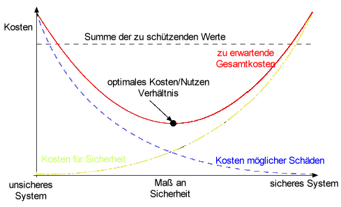
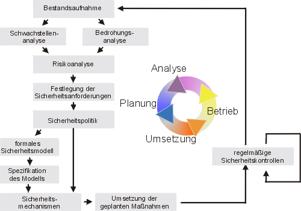
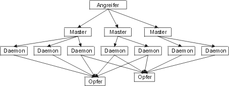
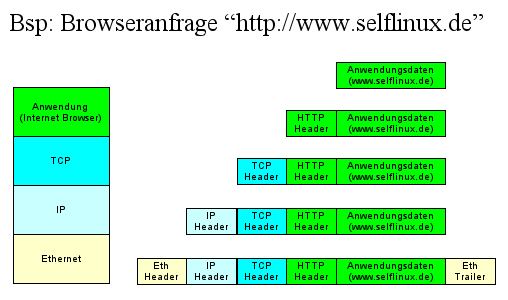
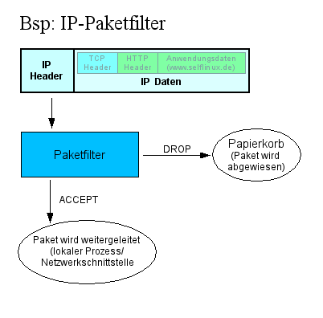
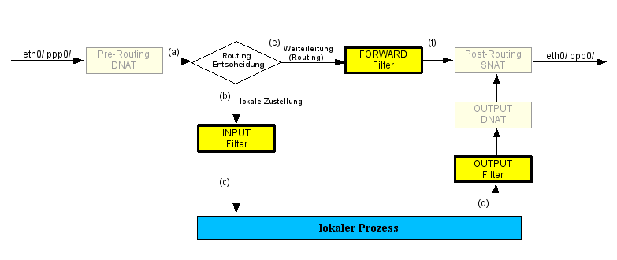
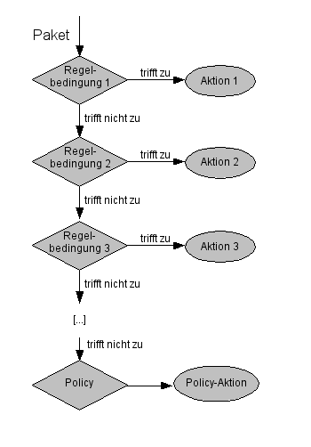
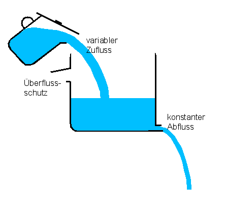
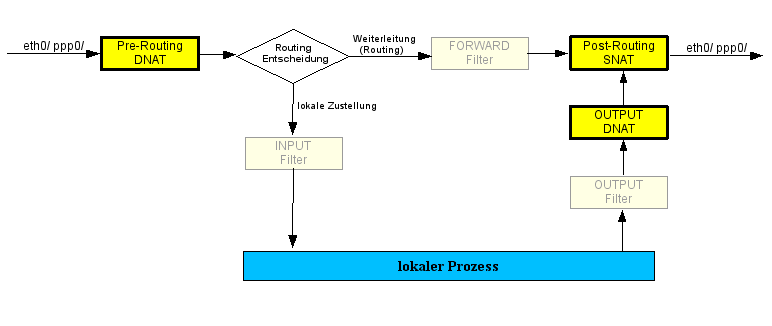

.. selflinux documentation master file, created by
   sphinx-quickstart on Wed Dec 23 13:39:08 2015.
   You can adapt this file completely to your liking, but it should at least
   contain the root `toctree` directive.

Sicherheit
==========

Über die Sicherheit von Passwörtern
-----------------------------------

Beschreibung

Die Sicherheit eines passwortgeschützten Systems hängt entscheidend von der richtigen Auswahl eines Passworts ab. Es können im grobem fünf Sicherheitsstufen unterschieden werden: Nachlässig, Niedrig, Mittel, Hoch und Sehr Hoch.

Über die Sicherheit von Passwörtern
^^^^^^^^^^^^^^^^^^^^^^^^^^^^^^^^^^^

Die Sicherheit eines passwortgeschützten Systems hängt entscheidend von der Wahl des richtigen Passwortes ab. Im allgemeinen unterscheidet man fünf Sicherheitsstufen: nachlässig, niedrig, mittel, hoch und sehr hoch.

Wahrscheinlichkeit bedeutet hier die in Prozent angegebene Wahrscheinlichkeit, mit der das Passwort in einer gegebenen Zeit durch Brute-Force-Methoden erraten werden kann. Bei Brute-Force Angriffen handelt es sich um das methodische Durchprobieren alle in Frage kommenden Schlüsselkombinationen.

Die Berechnung erfolgt nach der Formel des National Computer Security Center [NCSC1985a].
Formel NCSC1985a
Formel NCSC1985a

Dabei ist t_{life} die Lebenszeit des Passwortes in Sekunden, \frac{n_{tries}}{\text{sec}} [tfrac.png] die Anzahl der möglichen Tests pro Sekunde, n_{c} die Anzahl der möglichen Zeichen und l die Länge des Passwortes.

Der Wert von \frac{n_{tries}}{\text{sec}} [tfrac.png] liegt bei durchschnittlichen Rechnern und mit dem normalen Verfahren (crypt()) bei etwa 250.000 Versuchen pro Sekunde.

Nachlässig
^^^^^^^^^^

In die Sicherheitsstufe nachlässig werden diejenigen Passwörter eingeordnet, die aus regulären Worten bestehen, also aus Worten, die einer Wortliste entnommen werden können. Nicht nur im Internet stehen derartige Wortlisten in großer Zahl zur Verfügung, sondern zum Beispiel auch bei Rechtschreibhilfen. Zu den regulären Worten gehören auch alle Eigennamen, insbesondere die Namen von Familienangehörigen und Haustieren. Außerdem gehören in diese Kategorie alle Worte, die auf der Reihenfolge der Tasten auf der Tastatur beruhen ("wert", "asdf" u. s. w.), sowie alle Passwörter, die schlichtweg zu kurz sind.

Wahrscheinlichkeit:
Geht gegen 100%.

Niedrig
^^^^^^^

Als niedrig gilt die Sicherheit aller Passwörter, die nach den folgenden Regeln erstellt werden:

    Das Passwort muss mindestens ein alphanumerisches Zeichen enthalten.
    Es besteht aus maximal 14 Zeichen.
    Es enthält keine Leerzeichen.
    Es kann ein Sonderzeichen enthalten.
    Es unterscheidet Groß- und Kleinschreibung.
    Es hat eine Lebensdauer von maximal einem Jahr.

Beispiele (in Klammern eine Umschreibung der englischen Aussprache):

IcvawyowgIbCic (Ic-vaw-yowg-Ib-Cic)
tunebelk (tun-eb-elk)
itvigumI (it-vig-um-I)
uccywojEgty (uc-cy-woj-Eg-ty)
hiddUlicdift (hidd-Ul-ic-dift)
SudNom (Sud-Nom)

Wahrscheinlichkeit:

10454% bei einer Länge von 6 Zeichen und einem Bestand von 65 möglichen Zeichen [a-zA-Z0-9] sowie einigen Sonderzeichen.*
161% bei einer Länge von 7 Zeichen und demselben Zeichenbestand.*
2,5% bei einer Länge von 8 Zeichen und demselben Zeichenbestand.
0,0000000000003% bei einer Länge von 14 Zeichen und demselben Zeichenbestand.

*)
Die Werte über 100% kommen dadurch zustande, dass für die Versuche die gesamte Gültigkeitsdauer zur Verfügung steht. Bei der theoretischen Anzahl von 250.000 Versuchen pro Sekunde werden die einfachen Passwörter naturgemäß sehr schnell geknackt, bei sehr einfachen Passwörter sogar deutlich innerhalb der Gültigkeitsdauer. Solche Passwort-/Gültigkeitsdauer-Kombinationen sind demnach eindeutig ungeeignet.

Das Login-Programm benutzt unter anderem auch die Möglichkeit, die Sicherheit der Passwörter durch Herabsetzung der Anzahl der Versuche pro Sekunde zu erhöhen. In den mir bekannten Distributionen ist z. B. eine kleine Pause von einer Sekunde nach Eingabe eines fehlerhaften Passwortes eingestellt. Dadurch wird die Anzahl der Versuche auf einen Versuch pro Sekunde reduziert. Dieses Verfahren sollte aber unter keinen Umständen verwendet werden, da die verschlüsselten Passwörter in einer Datei gespeichert werden.
(Es ist sehr schwierig, eine Datei so zu schützen, dass sie nicht gelesen werden kann. Es können jederzeit Sicherheitslücken auftreten, die das Lesen der Datei trotz aller Sicherheitsmaßnahmen ermöglichen, zum Beispiel durch direkten Zugriff auf die Hardware.) Auf die Angaben in dieser Datei können dann normale Crack-Programme angesetzt werden, die dann wieder 250.000 und mehr Versuche pro Sekunde erzielen können. 

Mittel
^^^^^^

Als mittel wird die Sicherheit derjenigen Passwörter eingestuft, die nach den folgenden Regeln erstellt wurden:

    Das Passwort besteht aus mindestens 8 und höchstens 14 Zeichen.
    Es kann Sonderzeichen enthalten.
    Es muss mindestens ein alphabetisches Zeichen enthalten.
    Es darf den Benutzernamen nicht enthalten.
    Es enthält keine Leerzeichen.
    Es unterscheidet Groß- und Kleinschreibung.
    Es hat eine Lebensdauer von maximal einem halbem Jahr.

Beispiel 1:

!Tvv,+I*k?%
(Sea?{~Cp@
IROKobh`#>d
vobjiWuz> (vob-ji-Wuz-GREATER_THAN)
Wruhaukbot) (Wru-hauk-bot-RIGHT_PARENTHESIS)
ishcichejKev} (ish-cich-ej-Kev-RIGHT_BRACE)

Beispiel 2 (enthält keine Sonderzeichen, die in Shellscripten Probleme verursachen könnten):

;)XbNo#h%]
j~//pdZq<
CnjKdgM(M-n*(
ofNocip} (of-Noc-ip-RIGHT_BRACE)
vafAdyif; (vaf-Ad-yif-SEMICOLON)
pomcotyadoon& (pom-cot-yad-oon-AMPERSAND)

Wahrscheinlichkeit:
0,06% bei einer Länge von 8 Zeichen und einem Bestand von 95 möglichen Zeichen [:print:].
0,0006% bei einer Länge von 9 Zeichen und demselben Zeichenbestand.
0,0000066% bei einer Länge von 10 Zeichen und demselben Zeichenbestand.

Hoch
^^^^

Als hoch gilt die Sicherheit aller Passwörter, die nach den folgenden Regeln erstellt wurden:

    Es gelten dieselben Regeln wie für die Sicherheitsstufe mittel.
    Das Passwort muss mindestens ein numerisches Zeichen enthalten.
    Es muss mindestens ein Sonderzeichen enthalten.
    Die ersten drei Zeichen dürfen nicht gleich sein.
    Die ersten drei Zeichen dürfen nicht im Benutzernamen enthalten sein.
    Das Passwort hat eine Lebensdauer von maximal drei Monaten.

Beispiel 1:

_y@lK^T8(
`"%ld!QG2DGA
GTDeUZ#-7
IF=Qd6U*n{q
enalAjOj% (en-al-Aj-Oj-PERCENT_SIGN)
NeubOcaj< (Neub-Oc-aj-LESS_THAN)

Beispiel 2 (enthält keine Sonderzeichen, die in Shellscripten Probleme verursachen könnten):

]aj~-kn4vYc/wg
jfVN/QAfak
rVG1s<K*^5j
l=.y)Q*utZKd
udGifwis# (ud-Gif-wis-CROSSHATCH)
yewt^Shrak' (yewt-CIRCUMFLEX-Shrak-APOSTROPHE

Wahrscheinlichkeit:
Insgesamt etwas niedriger als bei der Sicherheitsstufe mittel. 

Sehr hoch
^^^^^^^^^

Als Sehr hoch gilt die Sicherheit derjenigen Passwörter, die nach den folgenden Regeln erstellt wurden:

    Das Passwort muss aus mindestens 14 Zeichen bestehen.
    Es muss mindestens ein alphabetisches Zeichen enthalten.
    Es muss mindestens ein numerisches Zeichen enthalten.
    Es muss mindestens ein Sonderzeichen enthalten.
    Es muss mindestens ein Leerzeichen enthalten
    Es dürfen keine drei Zeichen in Folge gleich sein.
    Es dürfen keine drei Zeichen in Folge aus dem Benutzernamen enthalten sein.
    Die Zeichenfolge darf nicht aussprechbar sein.
    Das Passwort hat eine Lebensdauer von maximal einem Monat.

Beispiel 1:

3'cIy`a$ d\mWK(0e¤'lp
Y6E6hE®5U.Z$aQ;>|/Ps$&]R
\-IOæbq}zE&EA2
N3$a jw%{TI¢E{/%
YZ# #þ0M uyAs!'Pb
shSz*GP)1 X¾$=A(H~RXc

Beispiel 2 (enthält keine Sonderzeichen, die in Shellscripten Probleme verursachen könnten):

TIQ-Ndx¡¬O 0~]i
@6Fi=,K¹-:µ^_SG@jg~n
x)/@£z-&- _.E%_MTK2gm}5;
KmZªfc(7ÐnZziUÞR(;FQAd[r
M0 & hr}!_p14>~©KKzqaU
(R,EP md]U(Pd,A1»ZBnzi

Wahrscheinlichkeit:
0,000000000000000000013% bei einer Länge von 14 Zeichen und einem Bestand von 256 möglichen Zeichen.
0,00000000000000000000000000000000000000000001% bei einer Länge von 24 Zeichen und demselben Zeichenbestand.

(Eigentlich ist die Wahrscheinlichkeit etwas höher, da einige Passwörter entfallen. Dieser Unterschied ist jedoch nur unwesentlich.)

Laufzeit
^^^^^^^^

Was nützt das beste Passwort, wenn es ewig haltbar ist? Je länger ein Passwort in Kraft ist, desto größer ist die Wahrscheinlichkeit, dass es doch noch geknackt, verraten oder gestohlen wird. Deshalb empfiehlt es sich, die Laufzeit von Passwörtern zu begrenzen. Je nach Sicherheitsanspruch kann eine Laufzeit von einigen Stunden bis zu einem Jahr gewählt werden. Zwischen der Lebensdauer eines Passwortes und dessen Sicherheit besteht eine direkt proportionale Beziehung. Auch ein Passwort mit der Sicherheitsstufe niedrig kann ausreichend Sicherheit bieten, sofern es stündlich gewechselt wird. Ebenso kann ein Passwort mit hoher Sicherheit durchaus Schwachstellen aufweisen, wenn es jahrelang nicht geändert wird.

Beispiel

Bei einer Laufzeit von einem Jahr besteht für ein Password der Kategorie niedrig mit einer Länge von 8 Zeichen eine Wahrscheinlichkeit von 2,5%, dass es innerhalb dieser Laufzeit geknackt wird. Wird die Laufzeit auf ein Monat verkürzt, so sinkt diese Wahrscheinlichkeit auf 0,2%.

Bei einer Laufzeit von einem Jahr besteht für ein Password der Kategorie hoch mit einer Länge von 14 Zeichen eine Wahrscheinlichkeit von 1,5e-23, dass es innerhalb dieser Laufzeit geknackt wird. Wird die Laufzeit auf ein Monat verkürzt, so sinkt diese Wahrscheinlichkeit auf 1,2e-24, also fast um das Zehnfache. 

Extrem
^^^^^^

Über die üblichen Sicherheitskategorien hinaus gibt es auch noch die Gruppe der extrem sicheren Passwörter. Dabei handelt es sich um sehr lange Passwörter, die im Normalfall niemand im Gedächtnis behalten oder von Hand eingegeben kann. Diese Passwörter werden als Schlüssel benutzt, z. B. auf elektronisch lesbaren Karten. Diese Schlüssel haben meist eine Länge von 1024 Bytes.

Hierzu ein Beispiel (der Lesbarkeit halber in ASCII-Code):

+iG8<3u9+%CY9_w5UZI6(Yt*f*DS3]&7 nHK8Z.kG^3R%jeSQB+rE ?U[,8{)boYiv!CNI"yo=5DgR/ oT%7K9u7k%o,gF>D-9cKp0[>_U='_G~l8=?E8ITdIK) iwKqB^.2u@wVKQ}7iF-0H?P"d FaqG=v4U lx3cu.zHoo`m'}dGFx VIY%]~3mcSKkA]8)j(o&cUezo@sf\VP _W9|0{&>b?N4Ix@s;99'{PRMd~? {r8$4Q&H9-@eKybMkZ.GW^| ^cKP{%RC`,)O^7.9>vlFa0r;:MG$V89eIssCo6*YA^U8.<<&`,YwmF@ r6z\(u%I"D^8`tY9E6YbyI$X$\Va<wto!0gR?N@W#3Bvz;3#s[6Umk<bf-p?M/_:g5Q3^txeW1SVmg^ KSq>Z1qNt8[SP5)zV,.nR5"F]$c`uBq!Y[wk@!5t^|&g>9p4)-yF(kosG[C%n-zI _kPAiK2&T_V{{m \M?biIpc[1CTQOay,b ;^txeW1SVmg^KSq>Z1qNt8[SP5)zV,.nR5"F]$c`uBq!Y[wk@!5t^|&g>9p 4)- (kosG[C%n-zI"_kPAiK2&T_V{{m\M?biIpc[1CTQOay, $d;@-mlpj&Kzj&XK\5@v@-mlpj&Kz j&XK\5@vW,{x1,c;/$;]7w><?yN!r#$.9Xf.*d<}K -KP83~FE[TbG+2l/U~e9pGf{2Zd{}2Yp3XA^! H0K.%/Tfr=TyQx7K0sXID}tzc;Q~E*}1a{AmQ/ITj>94Qs,RbZ/E2(zKH+(Teu<^>xXW'UEk@y,\0IA "S4pvgC|*&7plMP5Yf?C}@C0{bkX0N<q!_ uQ6$U3s,Bmk6\V)[RhGC?7w2c*lV$i'/CWY]iVuXWYIl E]Mz%Cq))tvU8F%<1/(<Ra!>UqKYNV)jBHW,?Tv!8&YyTPo0F}V/zV=\P>":b,i5ry~P%YW(%./;w2/ &qn;w->3,9e94qkI!Zgs9yeQbrn/SkX&WCK\K;Q,w|(G3 q{?a4cjbS$)\9eNZZ;F^7>#,mUWtQZ~Q3 :C[wiS`cDVVnWP9C(\Yhf?3IrjrX#GKfB!^;7:0/&;bq&PZHrFA8Ig!9tl;(bl#_KoufHpWM6kC"^(a ~VQ<Qh?bf@K<Md #/0Uep@`|T/KI(f^/c9 WA"G1NV(I}_

Der entscheidende Nachteil solcher Schlüssel besteht darin, dass man sie schriftlich festhalten muss. Es besteht zwar die Möglichkeit, diese Schlüssel mit einem normalen Passwort zu kombinieren. Dies bring allerdings keinerlei Vorteile mit sich, sondern erhöht die Gefahr eines allzu sorglosen Umganges mit dem Passwort.

Alle hier angeführten Beispiele wurden mit dem Automated Password Generator (apg) von Adel I. Mirzazhanov generiert, den Sie unter en http://www.adel.nursat.kz/apg/ finden. In der hier verwendeten Version 2.0.0 final PRNG: X9.17/CAST) generiert dieses Tool allerdings weder Leerzeichen noch Zeichen oberhalb von 128 dezimal. Sofern diese Zeichen in den Beispielen vorkommen, wurden sie per Hand eingefügt.

Fazit
^^^^^

Wie man anhand der in diesem Abschnitt aufgelisteten Wahrscheinlichkeiten sieht, reicht schon der regelmäßige Wechsel eines sorgfältig gewählten Passwortes mit einer Länge von 8 Zeichen aus, um eine relativ hohe Sicherheit zu erzielen. 

Autor

    Christoph Zurnieden czurnieden@users.sourceforge.net
	
Formatierung

    Matthias Hagedorn matthias.hagedorn@selflinux.org

Grundlagen Sicherheit
---------------------

Einleitung und Überblick
^^^^^^^^^^^^^^^^^^^^^^^^

Allgemeines
"""""""""""

Dieses Kapitel soll einen groben aber möglichst umfassenden Überblick zur Systemsicherheit des Linux-Rechners vermitteln. Das Themengebiet Sicherheit ist sehr komplex und besitzt zahlreiche Facetten. In der Regel reicht es nicht aus, irgendwelche Firewall-Konfigurationsskripte zu kopieren und auf einem Linux-Rechner zu starten, um diesen sicher zu machen.

Denn bevor man jedoch überstürzt loslegt, sollte man sich über verschiedene Dinge klar werden:

    Was verstehe ich unter Sicherheit?
    Was kann ich tun, um meine Sicherheit zu erreichen?
    Wie kann ich meinen Erfolg messen?
    Wie kann ich meine Sicherheit aufrechterhalten?

Was ist Sicherheit?
"""""""""""""""""""

Der Begriff Sicherheit beschreibt keinen konkreten Zustand eines Systems. Sicherheit steht dafür, dass nichts und niemand unerwünschte Aktionen durchführt oder gewünschte Aktionen untersagt. Sicherheit herrscht also dann, wenn alles so bleibt, wie es sein soll.

Man muss für seine eigene Sicherheit demnach nur noch definieren, was alles, so bleibt und sein soll bedeuten!

Gehen wir der Reihe nach vor: was bedeutet alles? Vermutlich gehört dazu der Linux-Rechner, um den es hier geht. Außerdem gehören die Daten auf dem Rechner dazu. Alle Benutzer des Rechners, aber auch das LAN, in dem sich der Rechner vielleicht befindet, gehören dazu.

Leider ist das Wörtchen alles damit noch nicht erschöpfend untersucht. Denn es gehört auch die Haustür, die nur diejenigen einlässt, die in die Nähe Ihres Rechners dürfen, dazu.
Dazu gehört auch der Stromlieferant, der Ihren Rechner zuverlässig mit Energie versorgen soll. Und ganz besonders gehören auch Sie selbst dazu, der oder die den Linux-Rechner vernünftig konfigurieren will oder soll!

Diese Überlegungen kann man noch beliebig fortsetzen, um festzustellen, was denn nun zu alles gehört.

Spätestens jetzt wird hoffentlich deutlich, dass noch ein anderer Faktor eine Rolle bei der Sicherheit spielt: der Aufwand. Oder besser gesagt: das Verhältnis zwischen dem Aufwand, der betrieben werden muss, und dem Nutzen, der damit erreicht werden soll.

Kosten und Nutzen

Bei der Beschäftigung mit dem Thema Sicherheit spielen also auch Kosten und Nutzen eine Rolle.

Der erste Schritt, um sein System sicher zu machen, ist also, den Zustand zu definieren, den das System einhalten soll. Womit wir beim nächsten Aspekt der Überlegungen wären. Die Definition, wie das System sein soll, könnte beispielsweise folgende Punkte enthalten:

    Es soll 24 Stunden am Tag, 7 Tage in der Woche arbeiten.
    Es können sich nur legitime Systembenutzer anmelden.
    Es werden keine externen Dateien vom Systembenutzer eingebracht.
    Systembenutzer haben starke Passwörter.
    Das System ist frei von Viren, Trojanern oder sonstigem Getier.
    Der Datenzugriff erfolgt entsprechend der Berechtigung des Systembenutzers.
    Es gibt keine Möglichkeit, sensible Daten zu stehlen.
    Netzwerkzugriffe außerhalb der Geschäftszeiten werden protokolliert.
    ...

Diese Auflistung sollte so umfangreich gehalten werden, dass sämtliche Aspekte des Systembetriebes durch solche Vorgaben beschrieben worden sind. Diese Vorgaben heißen auch Sicherheitsrichtlinien beziehungsweise security policy.

Aus diesen Sicherheitsrichtlinien ergeben sich die Konfigurationen und die Maßnahmen, um diesen Soll-Zustand zu verwirklichen. Zu den oben angeführten Punkten passen demnach folgende Aktionen:

    Rechner an einer unterbrechungsfreien Stromversorgung anschließen und ein Backup-System im Standby-Modus betreiben.
    korrekte Pflege der  Benutzerdatenbank durch den Administrator
    physische Sicherung z.B. der internen Laufwerke (Schloss oder Ausbau), Absicherung der Schnittstellen (z.B. USB), Sicherung der Netzwerkdosen, am besten alle Server eines Bereiches in einem eigenen Raum
    organisatorische Sicherung (Putzkräfte stehen unter Kontrolle und arbeiten in sensiblen Bereichen wie Serverräumen nur tagsüber, am besten unter Aufsicht)
    Schulung der Systembenutzer,  Überprüfen der Kennworte durch Passwort-Crackprogramm
    ständige Aktualisierung der Virenscanner
    Schutz vor Zugriff von Außen
    Anpassung der Topologie (Netzinfrastruktur)
    ...

Erst jetzt können Sie feststellen, ob Ihr System sicher im Sinne Ihrer Vorgaben ist. Erst jetzt, wo Sie wissen, wie es sein soll, können Sie eine konkrete Aussage treffen. Entweder "ja, das System befindet sich in dem Zustand, in dem es sein soll" oder "Nein, ein Parameter ist nicht so, wie er sein soll, es besteht Handlungsbedarf!"

Als abschließende Betrachtung fehlen nun nur noch die Maßnahmen, mit denen Sie dafür sorgen, dass alles auch so bleibt, wie Sie es eingerichtet haben. Dazu müssen Sicherungen und Protokollsysteme eingerichtet und aktiviert werden. Und merken Sie sich:

    Sicherheit ist kein Produkt, sondern ein Prozess! 

Kapitelübersicht
""""""""""""""""

Dieses Grundlagenkapitel soll einen Einblick in das Thema IT-Sicherheit geben. Nach einer kurzen Einleitung wird im Abschnitt  Sicherheitsprozess eine systematische Vorgehensweise zur Durchsetzung und Aufrechterhaltung eines gewünschten Sicherheitsniveaus vorgestellt.

Im darauf folgenden Unterkapitel soll ein Überblick über  Bedrohungen vermittelt werden. Sicherlich kennen Sie  Viren und haben auch schon einmal etwas über  Trojanische Pferde gehört, aber wissen Sie auch, was ein  Sniffer oder was  Spoofing ist und wie man sich davor schützen kann? Wir werden in diesem Kapitelabschnitt auch  Buffer Overflows (Pufferüberläufe),  Netzwerk-Scan-Techniken,  DOS- und  DDOS-Attacken ansprechen.

Im Unterkapitel  Allgemeine Schutzmaßnahmen werden die Grundvoraussetzungen für die Härtung des Linux-Systems gegenüber potentiellen Angriffen geschaffen. Dazu gehören beispielsweise die Deinstallation nicht benötigter Pakete, die Absicherung des Boot-Vorgangs und der Schutz der Systemlogfiles.

Fortgesetzt wird dieses Kapitel mit einem Abschnitt über  Authentisierung, Autorisierung und Zugriffssteuerung mit PAM. PAM ist eine englische Abkürzung für "Plugable Authentication Modules" heißt auf deutsch: steckbare Authentifikationsmodule.

Anschließend folgt ein Unterkapitel zum  Superserver xinetd, indem auch die ältere Variante xinetd + TCP_Wrapper tcpd besprochen wird. Superserver steuern und überwachen Netzwerkdienste wie z.B. FTP, Login oder Samba. Trifft eine Anfrage auf einem vom Superserver verwalteten Port ein, so wird der entsprechende Serverprozess (z.B. der FTP-Server ftpd) gestartet. Zuvor wird jedoch nach bestimmten Regeln entschieden, ob der Netzwerkzugriff erlaubt ist oder nicht. Diese Zugriffssteuerung ist das Thema dieses Abschnittes.

Ein weiteres Unterkapitel beschäftigt sich mit  Firewalls. Darin werden Paketfilter aber auch Kernelparameter und Proxies eine Rolle spielen.

Nachdem in den vorangegangenen Abschnitten Methoden zur Verbesserung der System-Sicherheit behandelt wurden, ist das Thema eines weiteren Unterkapitels das  Testen der Sicherheitsmaßnahmen.

Anschließend folgen zwei Unterkapitel, die sich mit dem Aufrechterhalten der Sicherheit beschäftigen. Wir beginnen mit dem  Logging und Accounting, also der Nachvollziehbarkeit dessen, was auf dem System passiert. Der für Systemmeldungen zuständige Syslog-Dienst wurde in einem  ausgegliederten Kapitel betrachtet, deshalb wollen wir uns hier auf die Verwaltung der Log-Dateien und deren Schutz vor Angriffen beschränken.

Ein weiterer Abschnitt widmet sich dem Thema  Einbruchserkennung (Intrusion Detection), einem sehr jungen Teilgebiet der IT-Sicherheit, welches Methoden zur frühzeitigen Erkennung von Angriffen bereitstellt. Man kann dies auch mit einer Alarmanlage vergleichen.

Sollte tatsächlich ein Einbruch festgestellt werden, hilft der Abschnitt  Notfallplan im Falle einer Systemkompromittierung weiter. Um welche Maßnahmen es sich dabei im Einzelnen handeln könnte, soll in diesem vorletzten Unterkapitel behandelt werden.

Am Ende steht ein kurzes  Fazit und eine Aufzählung der Themenbereiche, die zwar wichtig sind aber trotzdem (noch) keinen Eingang in dieses Kapitel gefunden haben. 

Sicherheitsprozess
^^^^^^^^^^^^^^^^^^

Um ein gewünschtes Sicherheitsniveau durchzusetzen und aufrechtzuerhalten, bedarf es einem geplanten und organisierten Vorgehen aller Beteiligten. Diese systematische Vorgehensweise wird in einem Prozessmodell beschrieben. Natürlich gibt es einige Sicherheitsprozesse, die jedoch meist an dem des de BSI (Bundesamt für Sicherheit in der Informationstechnik) angelehnt sind. Wir wollen den folgenden Prozess vorstellen:

Sicherheitsprozess

Begonnen wird mit einer Bestandsaufnahme gefolgt von der Schwachstellenanalyse. Daraus ergeben sich mögliche Gefahren für das System, welche in einer Bedrohungsanalyse adressiert werden. Wenn die Bedrohungen des Systems bekannt sind, wird für jede Bedrohung das Risiko bestimmt und nach der zu erwartenden Schadenshöhe priorisiert. Aus dieser Risikoanalyse leiten sich die notwendigen Sicherheitsanforderungen ab, welche auch formal in einem Sicherheitsmodell spezifiziert werden können. Die Anforderungen werden durch Sicherheitsmechanismen wie

    Zugriffssteuerung
    Kryptographische Mechanismen
    Authentisierungsverfahren

umgesetzt. Letztendlich muss dieses damit erreichte Sicherheitsniveau gehalten werden. Dies passiert durch regelmäßige (automatisierte) Sicherheitskontrollen und das zyklische Durchlaufen dieses Sicherheitsprozesses.

Da die genaue Beschreibung eines Sicherheitsprozesses dieses Kapitel sprengen würde, haben wir diese theoretischen Grundlagen in ein eigenständiges Kapitel ausgelagert, welches im nächsten Release erscheinen wird.

Bedrohungen und Schwachstellen
^^^^^^^^^^^^^^^^^^^^^^^^^^^^^^

Einführung Bedrohungen und Schwachstellen
"""""""""""""""""""""""""""""""""""""""""

Zu Beginn jedes Sicherheitsprozesses steht die Schwachstellen- und Bedrohungsanalyse. Dies erfordert allerdings genaues Wissen über potentielle Gefahren. Deshalb möchten wir in diesem Kapitel eine Übersicht vermitteln.

Systemanomalien
"""""""""""""""

Um den Begriff der Systemanomalie beschreiben zu können, muss man sich über zwei Verhaltensweisen klar werden:

    normales Systemverhalten:
    Alle Systemkomponenten (Hardware + Software) erfüllen die an sie gestellten Erwartungen unter bestimmten Rahmenbedingungen.
    anormales Systemverhalten:
    Die Abweichung vom normalen Systemverhalten bezeichnet man als anormales Systemverhalten

Schwierig gestaltet sich die Einordnung in eine dieser Kategorien, viele Nutzer können aufgrund ihrer geringen Kenntnisse zu Fehlentscheidungen gelangen. Anormales Systemverhalten ist das sichtbare Resultat von Anomalien. Anders ausgedrückt: Als Anomalien bezeichnet man Veränderungen an Hard- und/oder Software bzw. deren Konfiguration, die durchaus schwere Schäden nach sich ziehen können. Man unterscheidet Systemanomalien erster, zweiter und dritter Art:

Systemanomalien der ersten Art

    Anormales Verhalten kann durch eine Vielzahl an Faktoren hervorgerufen werden. Wenn dieses Verhalten weder beabsichtigt noch spezifiziert oder gar durch gewollte Systemveränderungen hervorgerufen wurde, handelt es sich um Systemanomalien erster Art. Dazu zählen insbesondere Umwelteinflüsse wie Überspannung durch Blitzschlag oder Übertragungsfehler. Zu den Anomalien der ersten Art gehören aber auch menschliche Fehler, die zum Beispiel bei der Programmierung auftreten und durch Angreifer ausgenutzt werden können (z.B. Pufferüberläufe). 

Systemanomalien der zweiten Art

    Bei diesen Anomalien wurden Komponenten (Betriebssystemmodule, Softwareklassen, Bibliotheken, Hardwarekomponenten, ...) absichtlich durch zusätzliche, schädliche Funktionen erweitert. Bekannte Vertreter sind  Trojanische Pferde, die das Systemverhalten nach den Wünschen des Angreifers manipulieren. 

Systemanomalien der dritten Art

    Aus Anomalien zweiter Art entstehen durch die Erweiterung um Funktionen zur Reproduktion Systemanomalien dritter Art. Dazu gehören Bakterien (Ausbreitung begrenzt auf lokales System), Viren und Computerwürmer. 

Viren
"""""

Ein Computervirus ist ein Stück Selbstreplizierende Software, die sich jedoch immer in ein ausführbares Wirtsprogramm oder eine Systemkomponente hineinmogelt und auf einem beschreibbaren Medium abgespeichert ist.

Viren stellen für Linux (noch) keine Bedrohung dar. Trotzdem gibt es bereits welche, und nicht nur das, man findet sogar eine Anleitung zum en Schreiben von Viren. Bekannteste Vertreter der Linux-Viren sind: Bliss, Staog, Telf, SIILOV.

Gegenmaßnahmen sind einerseits Virenscanner, z.B.

    fprot: de http://www.fprot.org/
    AvGate: de http://antivir.de
    AMaViS Mail Scanner: en http://www.amavis.org/
    InterScan VirusWall von Trendmicro: de http://de.trendmicro-europe.com/

und andererseits der Vergleich der Signaturen beim Installieren von Software, welche natürlich ausschließlich von vertrauenswürdigen Stellen stammen darf. Besonders vorsichtig sollte man als Superuser root agieren, aber das versteht sich ja von selbst.

Würmer
""""""

Würmer sind im Gegensatz zu Viren eigenständige Programme, die sich ebenfalls selbst replizieren können. Schon vor mehr als drei Jahrzehnten traten einzelne Exemplare auf Großrechnern auf. Diese wurden liebevoll "Kaninchen" genannt, weil sie sich so schnell vermehrten. Sie reproduzierten sich im Hauptspeicher und stahlen somit anderen Nutzern wertvolle Ressourcen. Sie wurden aber auch für nützliche Zwecke wie dem Einsammeln von Informationen eingesetzt, heute würde man solche Programme dann doch lieber als Vorfahren Mobiler Agenten ansehen.

Einer der bekanntesten Schädlinge war der Morris Wurm (1988), welcher zwischen 2000 und 6000 Internetrechner lahm legte. Das war ein sehr großer Teil des damaligen Internet. Anfällig waren neben BSD-Unix-Systemen auch alle DEC-Rechner und SUN3-Systeme. Computer mit "UNIX System V" als Betriebssystem waren "nur" anfällig, wenn mit Sendmail, fingerd und rexec eine Kompatibilität zu BSD bestand. Der Entwickler des Wurmes, Robert Tappan Morris Jr, wurde zu 10.000 Dollar, 3 Jahren Haft und 400 Stunden gemeinnütziger Arbeit verurteilt. Zusätzlich musste er die 150.000 Dollar Gerichtskosten tragen.

Man sieht, dass Computerwürmer ein wesentlich größeres Gefahrenpotential als Viren darstellen, gerade auch im Hinblick auf breitbandige Internetzugänge im privaten Bereich. Einen gezielten Schutz gegen Würmer gibt es nicht, man sollte versuchen, sein System so sicher wie möglich zu gestalten und kontinuierlich Sicherheitsupdates durchzuführen.

Trojanische Pferde
""""""""""""""""""

Der Begriff des trojanischen Pferdes stammt aus der griechischen Sagenwelt (Odyssee des Homer). Nach der vergeblichen Belagerung der Stadt Troja boten die Griechen ein riesiges hölzernes Pferd als Friedensgeschenk an. Nachdem dieses Holzpferd in die Stadt geschafft worden war, sprangen aus dem Inneren des Pferdes dutzende Soldaten und griffen die Stadt aus dem Hinterhalt an. Nur so gelang es den Griechen die Stadt zu erobern.

Genauso hinterhältig sind trojanische Pferde im Computerbereich. In durchaus nützliche Programme (wie z.B. lsmod) werden schädliche Funktionen eingebaut und durch den getäuschten Benutzer selbst aktiviert. Dabei muss der Schaden nicht gleich im Zerstören von Daten liegen, manchmal wird auch einfach nur die Ausgabe wichtiger Informationen unterdrückt. Einige Trojanische Pferde nisten sich direkt im Kernel ein (als Modul) und könnten mit lsmod sichtbar gemacht werden. Um dies zu verhindern, manipulieren trojanische Pferde das Programm lsmod derart, dass es den Eindringling nicht anzeigt.

Es gibt dutzende Varianten, die hier niemals alle behandelt werden können. Als Schutzmaßnahmen kommen vor allem Einbruchserkennungssysteme zum Einsatz, insbesondere Hostbasierte Intrusion Detection Systeme. Des weiteren sollte man ausschließlich vertrauenswürdige Software installieren und vorher die digitale Signatur (Fingerprint) vergleichen.

Sniffer
"""""""

Als Sniffer bezeichnet man ein Programm (oder ein Gerät), welches den Netzwerkverkehr abhört, protokolliert und in einer menschenlesbaren Form ausgibt. Gefährlich sind Sniffer vor allem beim Austausch von unverschlüsselten Nachrichten wie Passwörtern, Kreditkartennummern und vertraulichen Dateien.

Sniffer nutzen den Promiscuous Mode einer Netzwerkschnittstelle und empfangen so alle auf dem Netz übertragenen Daten, egal für wen diese bestimmt sind. Weder Sender noch Empfänger merken etwas von dieser Spionage.

Sicherheitsmaßnahmen: Vertrauliche Daten wie Kennwörter oder Kreditkartennummern sollten stets über verschlüsselte Verbindungen übertragen werden (https, ssh). Durch sichere Netzwerktopologien (z.B. durch Trennung der Netzwerksegmente mittels Router, Switch, Bridge) und den Einsatz von Paketfiltern zur logischen Trennung kann man das Blickfeld eines potentiellen Sniffers stark einschränken. Um einen Sniffer ausfindig zu machen, fragt man an allen Rechnern des Netzwerkes den Status der Netzwerkkarte mit ifconfig ab. Das ist die einfachste Lösung. Es gibt aber auch AntiSniffer Werkzeuge wie beispielsweise en SniffDet, oder kommerzielle Produkte wie AntiSniff.

Spoofing
""""""""

Unter Spoofing versteht man das Erschleichen von Vertrauen unter Vorgabe einer falschen Identität. Im Computerbereich unterscheidet man:

    IP-Spoofing (Vorgabe einer falschen IP-Adresse)
    Gegenmaßnahme: Paketfilter
    DNS-Spoofing (Einstreuen einer falschen IP-Namenszuordnung ins DNS-Kommunikationssystem - Cache pollution)
    Gegenmaßnahme: digitale Unterschriften beim Austausch von DNS-Einträgen
    ARP-Spoofing (Einstreuen einer falschen IP-MAC-Adressenzuordnung im Ethernet; Überschreiben durch Push-Technik)
    Gegenmaßnahme: Ersetzen des ARP-Cache durch eine in einer Datei gespeicherten Liste
    RIP-Spoofing (Umleiten der Datenströme durch Einstreuen falscher Routing-Informationen)
    Gegenmaßnahme: Setzen des entsprechenden Kernelparameters
    WWW-Spoofing (URL Rewriting, man in the middle attack)
    Gegenmaßnahme: Kontrolle der Zertifikate verschlüsselter Verbindungen

Der bekannteste Fall ist wohl die Kevin Mitnick Attacke, die 1994 auf das Netz des Sicherheitsexperten Tsutomu Shimumura stattfand. Mitnick begann seinen Angriff mit mehreren Verbindungsanfragen an den rlogin Port des Servers seines Opfers, diese Anfragen besaßen allerdings gefälschte interne IP-Adressen. Aufgrund dieser Last brach der Server zusammen. Nachdem Kevin Mitnick die TCP-Sequenznummerngenerierung analysiert hatte, konnte er unter Vorgabe der Identität des zusammengebrochenen Servers eine TCP-Verbindung aufbauen und den Zugang für zukünftige Angriffe weit öffnen.

Kevin Mitnick wurde verhaftet und bekam 1999 eine Haftstrafe von 48 Monaten (er saß aber schon zu diesem Zeitpunkt mehrere Jahre in Untersuchungshaft). Im Januar 2000 wurde er mit der Auflage entlassen, dass er drei Jahre lang (also bis Januar 2003) weder Computer noch Mobiltelefon oder ähnliche Gerätschaften benutzen durfte.

Spoofing ist ein wichtiger Bestandteil der meisten Einbruchsversuche. Durch die Angabe einer falschen Identität können fremde Verbindungen entführt (Hijacking) oder beendet werden, und das Nachvollziehen eines Einbruchs / Einbruchversuchs gestaltet sich äußerst schwierig. Deshalb wird dieses Thema zukünftig in einem gesonderten Kapitel behandelt werden.

Netzwerk-Scan-Techniken
"""""""""""""""""""""""

Netzwerk-Scan-Techniken Allgemeines

Als Scanning bezeichnent man den Versuch, möglich viele oder gar alle Rechner eines Netzwerkes zu verifizieren. Dies beinhaltet vor allem auch die Bestimmung der darauf laufenden Dienste. Folgende Informationen sind Ziel eines solchen Angriffs:

    IP-Adressen von Rechnern (die ans Internet angeschlossen sind)
    TCP/UDP Portnummern
    Systemarchitektur (x86, PowerPC, Sparc)
    Betriebssystem (Kernelversion, Windowsversion)

Dem geht meist die Erstellung eines System- oder Netzwerkprofiles voraus, in dem allgemeine Informationen wie geographischer Standort, Namen, Telefonnummern, IP-Adressen (Bereiche) und Dienste wie DNS-Server, Mail-Server oder Web-Server festgehalten werden.

Security Scanner bieten feinere Techniken zum Ausspionieren sicherheitsrelevanter Informationen eines Systems. Zu den damit gewonnenen Informationen zählen zum Beispiel:

    Benutzer- und Gruppennamen
    Schwachstellen, welche ausgenutzt werden können
    Routing-Tabellen
    SNMP-Informationen

Online-Check

Das Ziel dieses Angriffes besteht darin, herauszufinden, welche Rechner des Opfernetzwerkes (eines bestimmten IP-Bereiches) gerade aktiv sind. Dies ist möglich durch

    ICMP-Echo-Anfragen (Ping, Broadcast)
    UDP /TCP Sweeps

Beides kann durch Kernelparameter bzw. Paketfilter verhindert werden.

Port-Scanning

Wenn nach einem erfolgreichen Online-Check die aktiven Rechner bekannt sind, wird der Angreifer meist die angebotenen Dienste mittels Port-Scanning ermitteln. Dazu bedient er sich oftmals der TCP SYN Scan Methode, bei der eine TCP-Verbindung nur angefragt aber nicht aufgebaut wird. Deshalb sind solche Attacken nur schwer zu finden und werden sehr selten in Logfiles protokolliert. Eine "Weiterentwicklung" sind die so genannten Stealth Scans, die auch Paketfilter passieren und trotzdem im Netzwerkverkehr unentdeckt bleiben. Sie missachten einfach das Three Way Handshake Protokoll und interpretieren die Antworten der Opferrechner. Zu den Stealth Attacken gehören:

    XMAS Scan
    Null Scan
    Syn/Ack Scan
    Fin Scan

Port-Scans können durch Port-Scan-Detektoren erkannt werden, zu den wichtigsten zählen: en Scanlogd en PortSentry Natürlich gibt es auch wieder Möglichkeiten, diese Detektoren zu umgehen, darauf wollen wir an dieser Stelle nicht eingehen. Einen Hinweis zum Schluss: Theoretisch kann ein Angreifer einen Port-Scan-Detektor dazu benutzen, durch einen gefälschten Scan-Angriff (Vortäuschung eines Angriffs vom Gateway-Rechner --> Spoofing) den Opferrechner vom externen Netz zu trennen.

Nmap

Der Netzwerk-Scanner nmap unterstützt zahlreiche Angriffspraktiken zum Scannen von einzelnen Rechnern oder ganzen Netzwerken. Er bietet auch viele nützliche Funktionen für einen sinnvollen Einsatz. Denkbar wären beispielsweise die Überwachung der offenen Ports aller Netzwerkrechner oder das automatische Auslösen eines Alarms, wenn ein neuer Rechner ans Netz angeschlossen wird. Mit nmap und den zahlreichen Möglichkeiten wird sich ein eigenständiges Kapitel beschäftigen.

Betriebssystemerkennung

Systemschwachstellen sind meist an das verwendete Betriebssystem gebunden, deshalb sind Informationen darüber für den Angreifer äußerst wertvoll.

Viele Dienste wie z.B. telnet, ssh oder www geben auch nicht autorisierten Benutzern Betriebssysteminformationen. Sie können dies einfach nachvollziehen:
user@linux $ telnet ip-opfer 80
Trying 217.72.195.42...
Connected to ha-42.web.de.
Escape character is '^]'.
user@linux $ get
http/1.0 400 Bad Request
Date: Wed, 19 Jan 2000 15:33:21 GMT
Server: Apache/1.3.3 (Unix)   (Red Hat/Linux)
Connection: close
....

Aus der vorletzten Ausgabezeile ist ersichtlich, dass es sich um einen Linux Rechner mit Red Hat handelt. Es gibt mittlerweile einige Betriebssystemerkennungsprogramme wie queso oder nmap.

Firewalking

Darunter versteht man eine Technik, um Informationen von Netzwerken hinter einer Firewall zu erlangen. David Goldsmith und Michael Schiffmann haben diese Technik im Oktober 1998 veröffentlicht. Firewalking benutzt traceroute, das eigentlich entwickelt wurde, den Weg einer Verbindung aufzuzeigen. Duch die Angabe eines Ausgangs- bzw Zielport können auch Firewalls passiert werden.

Inverse Mapping

Mit Inverse Mapping Techniken können Informationen über solche Rechner und Netzwerke erhalten werden, die als unerreichbar gelten (z.B. Rechner eines internen Netzwerkes).

Beispiel ftp-Bounce-Attacke:

Der Angreifer benutzt einen normalen ftp-Client und verbindet sich mit dem ftp-Server des Opfers. Er benutzt den ftp-Port-Befehl um die IP-Adresse und die Portnummer des anzugreifenden Dienstes anzugeben. Der Angreifer sendet nun in Kommandos, die der angegriffene Dienst versteht, in Form von Dateien an den ftp-Server und dieser leitet die Kommandos einfach an den verbundenen Dienst. Wenn der ftp-Server hinter der Firewall steht, sind durch diese Methode auch Scans des internen Netzwerkes möglich.

Buffer Overflows
""""""""""""""""

Die wohl am häufigsten auftretende Schwachstelle sind Programme, die Pufferüberläufe (Buffer Overflows) ermöglichen. Diese Programme werden zu einer gefährlichen Bedrohung, wenn sie unter privilegierten Rechten ablaufen. Ein Angreifer kann durch das Ausnutzen dieser Schwachstelle beliebigen Programmcode zur Ausführung bringen, und zwar mit den selben Privilegien wie die des fehlerhaften Programms. Wenn also beispielsweise der Web-Server apache unter root Rechten ablaufen würde und eine solche Schwachstelle existiert, so kann ein Angreifer dem System den denkbar größtmöglichen Schaden zufügen.

Schutzmaßnahmen für Programmierer und Entwickler:

    Sichere Programmierung, Einsatz von "Source Code Security Analyzer" zur Feststellung möglicher Fehler
    Libsafe ersetzt unsichere C-Funktionen (z.B. sprintf, strcp, gets) durch Bibliotheksfunktionen
    Openwall-Patch: nichtausführbarer Stack Array-Grenzüberwachung

Denial of Service (DOS Attacken)
""""""""""""""""""""""""""""""""

Angriffe mit dem Ziel, ein System oder einen Dienst lahm zu legen, bezeichnet man als DOS-Attacken. Oftmals handelt es sich um Netzwerkdienste, die beim Trennen der Netzverbindung nicht mehr nutzbar sind. Es werden entweder Schwachstellen im System (Rechner, Übertragungsprotokolle, ...) ausgenutzt oder begrenzte Systemressourcen (z.B. Bandbreite) aufgebraucht, um eine Dienstverweigerung zu erreichen.

Manchmal geht es auch darum, sicherheitsrelevante Systeme (z.B. IDS, Loghosts) in einen instabilen Zustand zu versetzen und somit Einbruchsversuche zu ermöglichen. Prinzipiell werden DOS-Attacken in zwei Arten untergliedert: hostbasierte Denial of Service Attacken und netzwerkbasierte Denial of Service Attacken. Eine besonders gefährliche Weiterentwicklung der letztgenannten sind verteilte DOS-Attacken (Distributed Denial of Service). Das Opfer wird hierbei von mehreren (manchmal sogar tausenden) Rechnern angegriffen.

Hostbasiert
Wenn der Angreifer bereits Zugang zum System besitzt, kann er mit meist sehr einfachen Mitteln das System handlungsunfähig machen. Dazu gehören beispielsweise

    Plattenplatz aufbrauchen (Sicherheitsmaßnahme: quota)
    Arbeitsspeicher / CPU Reserven aufbrauchen (Sicherheitsmaßnahme: ulimit)
    Hardwarefehler ausnutzen (Sicherheitsmaßnahme: neuer Kernel)

Netzwerkbasiert
Die größere Gefahr geht im Allgemeinen von netzwerkbasierten DOS-Attacken aus. Diese sind schwerer nachvollziehbar, und ein Angreifer benötigt im Zweifelsfall nicht einmal einen direkten Zugang zum Opfernetzwerk. Zu diesen DOS-Attacken gehören:
Email-Bomben

    Die Speicherkapazität auf Mailservern ist sehr begrenzt, der Plattenplatz wird sehr schnell aufgebraucht. Außerdem können durch sehr große Mails die Netzwerkressourcen (Bandbreite) sehr schnell aufgebraucht werden. 

Broadcast-Angriff

    Ein Angreifer generiert pro Sekunde 100 Brodcast-Anfragen. Wenn angenommen 150 Rechner im Subnetz aktiv sind und deshalb antworten, müssen 15.000 Antwortpakete übertragen werden. Der Rechner, der diese Anfrage gestellt hat, ist mit den Antworten hoffnungslos überlastet und verliert im Extremfall seine Netzverbindung (meist in Kombination mit  Spoofing). Gegenmaßnahmen können beispielsweise durch die Limit Option im Paketfilter oder durch das Herausfiltern von ICMP Paketen realisiert werden. 

Kernel-Angriff

    Auch die Netzwerkmodule des Kernels sind nicht vor Angriffen gefeit. So kann beispielsweise durch eine SYN-Flood-Attacke der Netzwerkpuffer zum Überlaufen gebracht werden. Kernelparameter bieten einen guten, meist ausreichenden Schutz. 

DOS-Angriffe auf TCP/IP-Ebene

    Durch Massenanfragen werden Schwachstellen im IP-Stack ausgenutzt. Die Schwachstellen lassen sich nur bedingt beseitigen, sodass solche Angriffe meist als DDOS Attacken durchgeführt werden. Zu solchen Attacken zählen: 

    IP-Fragmentangriff (teardrop, newtear, bonk)
    IP-Bombing (meist als DDOS-Attacke)
    SYN-Flood Attacken (massenhafte Verbindungsanfragen)

Distributed Denial of Service (DDOS Attacken)
"""""""""""""""""""""""""""""""""""""""""""""

Während bei normalen netzwerkbasierten DOS-Attacken viele Anfragen von einem Angriffsrechner ausgehen, kommen bei verteilten DOS-Attacken (Distributed Denial of Service = DDOS) sehr viele Computer zum Einsatz, die simultan einen DOS-Angriff auf einen Opferrechner durchführen. Ein DDOS-Angriff wird zentral kontrolliert, es gibt also einen oder mehrere Server (so genannte Master), die viele Clients (auch einfach als Daemons bezeichnet) kontrollieren.

ddos.png

Diese Angriffe sind erst seit 1999 bekannt. Die dokumentierten Angriffe gingen meistens von vier Softwaretools aus:

    trinoo (englische Infos auf en CERTwww.cert.org/incident_notes/IN-99-07.html)
    TFN Tribe Flood Network (englische Infos auf en CERT)
    stacheldraht (basiert auf trinoo und TFN)
    shaft

Die zu ergreifenden Schutzmaßnahmen sind

    Einbruchserkennungssysteme (IDS)
    Paketfilter (ICMP-Filterung, Pakete > 9 Byte)
    Verhinderung eines Einbruchs durch Kombination von Sicherheitsmaßnahmen wie kontinuierliche Aktualisierung der Software, Einsatz von Proxies, Paketfiltern, Einbruchserkennung und Gegenmaßnahmen bei erfolgreichem Angriff.

Root Kits
"""""""""

Root Kits sind Softwarepakete, in denen meist skriptbasierte Werkzeuge enthalten sind. Diese haben zum Ziel,

    verschiedene Angriffsformen anzubieten,
    Angriffe zu verschleiern sowie
    Hintertüren einzubauen.

Ein solcher automatisierter Angriff dauert typischerweise drei bis fünf Sekunden und erfordert keinerlei Fachwissen.

Wie läuft ein Angriff mit einem Root Kit ab?
Nach dem Ausnutzen einer Schwachstelle, durch die ein beliebiger Maschinencode zur Ausführung gebracht werden kann, steht dem Angreifer eine Ausführungsumgebung mit root-Rechten (daher der Name) zur Verfügung. Diese Privilegien werden benutzt, um auf dem angegriffenen System eine Hintertür zu installieren, die dem Angreifer in Zukunft jederzeit Administratorrechte verschafft. Abschließend werden sämtliche Spuren des Angriffs aus den Log-Dateien entfernt. Präventive Maßnahmen sollten bevorzugt zum Einsatz kommen, da erfolgreiche Einbrüche äußerst schwer zu finden und zu beseitigen sind. Bekannte Root Kits können mit en chkrootkit gefunden werden.

Allgemeine Schutzmaßnahmen
^^^^^^^^^^^^^^^^^^^^^^^^^^

An dieser Stelle sollen nun ganz grundsätzliche Sicherungsmöglichkeiten aufgezeigt werden, die ohne komplexe Systemeingriffe nachvollzogen werden können. Sicherlich ist der Einsatzzweck des Rechners (Desktop-System, Mail-Server, Firewall, ...) relevant für die Auswahl geeigneter Methoden, deshalb können die hier vorgestellten Maßnahmen weder ausreichend noch vollständig sein!

Absicherung des Boot-Vorgangs (System-V-Init-Process)
"""""""""""""""""""""""""""""""""""""""""""""""""""""

Zuerst sollten die physischen Zugänge (Disketten, CD-ROM, USB/Netzwerk-Boot) gesichert werden. Das kann man ganz einfach im BIOS erledigen. (Passwortschutz für das BIOS ist ebenfalls zu aktivieren!) Einziges physisches Restrisiko bleibt der Ausbau der festplatte. Damit ist man allerdings noch längst nicht am Ende...

Linux Systeme lassen sich im Single User Modus starten, indem man z.B. beim LILO-Bootmanager die Option single angibt:

lilo: linux single

Im ungünstigsten Fall benötigt man nicht einmal ein Passwort und erlangt Superuser-Rechte. Diese Schwachstelle ist folgendermaßen zu beseitigen:

    Editieren der Datei /etc/inittab

/etc/inittab

....
id:3:initdefault:
~~:S:wait:/sbin/sulogin
....
     

    Editieren der Datei /etc/lilo.conf

/etc/lilo.conf

....
prompt
timeout=00
default=linux
restricted
passwort=GEHEIM

image=/boot/vmlinuz-2.4.20
    label=linux
....
     

    bei Auswahlmöglichkeit aus mehreren Betriebssystemen z.B. Windows, Linux den Parameter timeout auf 50 setzen
    Zugriffsrechte setzen (chmod 600 /etc/lilo.conf)
    Die neue Boot-Konfiguration aktivieren (lilo -v)
    Die /etc/lilo.conf vor Manipulation schützen (siehe Abschnitt " Erweiterte ext2-Dateiattribute")

Jetzt sollte ein Einbruch durch Ausnutzen der Schwachstellen im Boot-Prozess wesentlich schwieriger zu realisieren sein.

Nicht benötigte Pakete
""""""""""""""""""""""

Die großen Distributionen SuSE und RedHat installieren standardmäßig dutzende Pakete, die zum nicht unbedingt notwendig sind und nur zusätzliche Funktionen bieten. Da sichere Systeme immer nach dem Prinzip des Minimalismus zu entwerfen sind, sollten diese Pakte deinstalliert werden. Solche Pakete sind bei RedHat z.B.

apmd, anacron, at, bc, eject, getty_ps, gd, gpm, isapnptools, kernel-pcmcia-cs, kudzu, linuxconf, mailcap, mouseconfig, mt-st, pump, pciutils, raidtools, redhat-logos, redhat-release, setserial, XFree86-SVGA

Hinweis: Natürlich beinhaltet jedes dieser Pakete sinnvolle Programme, und möglicherweise benötigen Sie sogar eines von den oben angegebenen.

Nicht benötigte Benutzer und Gruppen
""""""""""""""""""""""""""""""""""""

Die meisten Distributionen legen nicht benötigte Nutzer und Gruppen an bzw. vergessen beim Deinstallieren von Softwarepaketen (z.B. apache-http-server) das Entfernen der Einträge in den Passwortdateien.

Solche Kennungen sind zum Beispiel: adm, lp, sync, mail (bei sendmail benötigt!), ftp (bei anonymous ftp benötigt),... Folgende Gruppen sind unter Umständen obsolet: adm, lp, news, pppusers, popusers.

Man sieht, dass solche Benutzer manchmal doch benötigt werden.

Differenzierter Superuser-Zugriff (root)
""""""""""""""""""""""""""""""""""""""""

Die Sicherheit des root-Kennworts ist unbedingt an den Regeln im Kapitel  sichere Passwörter auszurichten.

Viele Programme benötigen nicht unbedingt root-Rechte. Oftmals reicht es aus, eine privilegierte Gruppe anzulegen und mittels der Gruppenrechte den Zugriff zu ermöglichen.

Wenn zum Beispiel das Wechseln der Benutzerkennung nur für bestimmte Benutzer erlaubt werden soll, legt man eine neue Gruppe "security" an und ändert die Zugriffsrechte des Programms su.
root@linux # groupadd security
root@linux # chgrp security /bin/su
root@linux # chmod 4750 /bin/su

Feiner abgestimmte Restriktionen bieten Capability-Mechanismen des Kernels, die den root-Zugriff weiter einschränken.

Capability Mechanismus des Kernels
""""""""""""""""""""""""""""""""""

Der Entzug von Capabilities (Systemfähigkeiten) erlaubt bei Systemstart bestimmte Restriktionen durchzusetzen und ermöglicht damit unter anderem eine Beschränkung der Superuser-Rechte. Nach dem Boot-Vorgang sind standardmäßig alle Capabilities gesetzt.

Der Capability Mechanismus wurde in POSIX 1003.1e und IEEE 1003.2c beschrieben und festgelegt.

Folgende Übersicht beschreibt ganz kurz einige Capabilities (Systemfähigkeiten):
CAP_LINUX_IMMUTABLE 	Ändern von Dateiberechtigungen (siehe Abschnitt  Erweiterte ext2-Dateiattribute)
CAP_SYS_RAWIO 	direkten Zugriff auf Speichermedien (Festplatten)
CAP_SETGID 	setgid setzen
CAP_SETUID 	suid setzen
CAP_SYS_MODULE 	Kernelmodule laden
CAP_SYS_ADMIN 	mounten/unmounten und andere administrative Tätigkeiten
CAP_NET_ADMIN 	Netzwerkkarten konfigurieren, Firewall administrieren, Routing administrieren

Mittels des Programmes lcap können dem System einzelne Fähigkeiten entzogen werden:

lcap CAP_LINUX_IMMUTABLE
lcap CAP_SYS_RAWIO

Nun ist es auch für root nicht mehr möglich, durch +i oder +a geschütze Dateien im ext2 Dateisystem zu löschen. (siehe Abschnitt  Erweiterte ext2-Dateiattribute)

An dieser Stelle sei darauf hingeweisen, dass CAP_SYS_RAWIO unbedingt sehr frühzeitig entfernt werden sollte, da ansonsten mittels direktem Zugriff auf das /dev/kmem device der Capability Schutz umgangen werden kann.

Pfadvariable PATH
"""""""""""""""""

Die Shell-Variable PATH beinhaltet eine Liste an Verzeichnissen, die beim Aufruf eines Programmes durchsucht werden.
user@linux $ echo $PATH
/usr/local/bin:/usr/bin:/bin:/usr/bin/X11

Die Verzeichnisse werden mit einem Doppelpunkt getrennt. Aus Bequemlichkeit beinhaltet die Pfadvariable oftmals das aktuelle Verzeichnis. Es ist darauf zu achten, dass dieses immer am Ende steht (Bedrohung: Hackerprogramme in allgemein zugänglichen Verzeichnissen wie z.B. /tmp oder /usr/share/firmaXYZ tarnen sich als su oder passwd)
user@linux $ echo $PATH
/usr/local/bin:/usr/bin:/bin:/usr/bin/X11:.

Namensauflösung
"""""""""""""""

In der Datei /etc/hosts.conf wird festgelegt, WIE die Zuordnung der Namen zu IP-Adressen erfolgen soll. Das Beispiel zeigt eine relativ sichere Variante.
/etc/hosts.conf

# Reihenfolge der Domain Namens Auflösung
#     (vorausgesetzt DNS/BIND verfügbar)
order hosts, bind
# Multiple IP Adressen werden nur bei Routern benötigt
multi off
#Anti IP-Spoofing
nospoof on

Festlegung vertrauenswürdiger Rechner / Netzwerke
"""""""""""""""""""""""""""""""""""""""""""""""""

Aus Sicherheitsgründen ist von einer Benutzung der r-Dienste (z.B. rsh, rcp, rexec) unbedingt abzuraten. Demzufolge sollten auch keine .rhosts Dateien auf dem Rechner zu finden sein, dies kann man folgendermaßen überprüfen:
user@linux $ find /home -name .rhosts

Unbedingt sollte man sich mit allen Möglichkeiten von ssh vertraut machen, insbesondere mit dem Umgang von Schlüsselpaaren. Ein guter Einstieg in dieses Thema ist auf den Web Seiten des de Linux-Magazins zu finden.

Festlegung (nicht) benötigter Protokolle (/etc/services)
""""""""""""""""""""""""""""""""""""""""""""""""""""""""

In der Datei /etc/services werden alle Dienste ihren Ports zugewiesen. Eine Manipulation kann einem Angreifer Hintertürchen öffnen und sollte deshalb unbedingt unterbunden werden (siehe Abschnitt  Erweiterte ext2-Dateiattribute).

Verwaiste und rechtelose Dateien
""""""""""""""""""""""""""""""""

Dateien, die von jedermann beschrieben werden können, stellen ein sehr großes Sicherheitsrisiko dar. Deshalb sollten so wenig wie möglich solcher Dateien existieren (Gruppenrechte einsetzen!). Mit find lassen sich solche Dateien aufspüren und nach sorgfältiger Kontrolle kontrolliert löschen:
root@linux # find / -perm -o+w -a ! -type l -ls >/tmp/rechtlose-files

Verwaiste Dateien gehören keinem Nutzer oder keiner Benutzergruppe an. Dies deutet auf einen erfolgreichen Einbruch hin und sollte kontinuierlich untersucht werden:
root@linux # find / -nouser -o -nogroup >/tmp/verwaiste_files

shadow Passwörter
"""""""""""""""""

Bei Verwendung der Shadow Suite werden Passwörter verschlüsselt in der Datei /etc/shadow abgelegt. Diese kann nur vom Superuser root und von der Gruppe shadow gelesen werden. Kein realer Benutzer hat also Zugang und kann die Passwörter lesen und versuchen, diese mit Hilfe eines Crack-Programmes (z.B. John the Ripper) zu entschlüsseln. Empfehlenswert ist das Abspeichern der Passwörter als MD5-Hash, da dadurch ein potentieller Angriff schwerer durchzuführen ist und längere Passwörter verwendet werden können. Weiterführende Informationen sind im Abschnitt  Authentisierung, Autorisierung und Zugriffssteuerung mit PAM zu finden.

Schutz der Protokolldateien (Systemlog-Files)
"""""""""""""""""""""""""""""""""""""""""""""

Eine einfache Absicherung bieten die erweiterten Dateiattribute wie beispielsweise das append-only Attribut bei ext2-Filesystemen (siehe Abschnitt  Erweiterte ext2-Dateiattribute). Eine Alternative dazu besteht darin, die Logfiles auf einem dafür bestimmten Rechner zu sammeln. In diesem Zusammenhang sei auf den ssyslogd und den syslog-ng verwiesen, die zusätzlich Integrität und Verschlüsselung bieten.

Bastille Linux
""""""""""""""

Diese Sammlung von Perl-Skripten erhöht die Sicherheit durch eine automatische Änderung der Konfigurationseinstellungen. Vor jeder Modifikation wird man sehr ausführlich über die Konsequenzen informiert und kann nach dem Abschätzen des Für und Wider die Änderungen akzeptieren oder auch nicht. Das System ist kostenlos und kann unter en http://bastille-linux.org heruntergeladen werden. Das Ausführen sollte im Single-User Modus erfolgen:
root@linux # mv Bastille-XXX.tar.gz /root
root@linux # cd /root
root@linux # tar zxvpf Bastille-XXX.tar.gz
root@linux # init 1
root@linux # cd /root/run-Bastille
root@linux # ./Bastille1.pl

Zum Schluss noch ein Zitat, auf das mich Steffen Dettmer (  steffen@dett.de) hingewiesen hat:

    "The only secure computer system in the world is unplugged, locked in a vault at the bottom of the ocean and only one person knows the location and combination of that vault. And he is dead."
    --Bruce Schneier in "Applied Cryptography" 

Authentisierung, Autorisierung und Zugriffssteuerung mit PAM
^^^^^^^^^^^^^^^^^^^^^^^^^^^^^^^^^^^^^^^^^^^^^^^^^^^^^^^^^^^^

Die meisten Linux-Systeme sind von anderen Netzwerkrechnern über verschiedene Zugänge wie beispielsweise ssh, ftp oder pop3 erreichbar. Bevor ein solcher Zugang gewährt wird, muss die Identität des Benutzers zweifelsfrei festgestellt werden (Authentisierung). Jeder Zugangsdienst, also beispielsweise der FTP Server, muss nun diese Überprüfung selbst implementieren (i.d.R. Passwort).

Soll aber nun zum Beispiel ein Zugang nur in festgelegten Zeitfenstern möglich sein oder eine Chipkarte bzw. ein biometrisches Verfahren (Fingerabdruck, IRIS) das herkömmliche Passwortverfahren ersetzen, so müsste man alle Zugangsprogramme (login, ftp, ssh, ...) dementsprechend modifizieren. Ebenso schwierig gestaltet sich die Integration in Sicherheitsarchitekturen wie DCE oder Kerberos.

Bereits Anfang der 90er Jahre erkannte Sun Microsystems diese Nachteile und entwickelte und implementierte den so genannten PAM-Standard in ihrem Betriebssystem Solaris. Seit Oktober 1995 gibt es den RFC 86.0, der PAM allgemein beschreibt. Was ist nun PAM?

PAM steht für Pluggable Authentifikation Module was auf deutsch heißt: steckbare Authentisierungsmodule. Es handelt sich also um ein modulares System, welches die Anwendungen (login, ssh, ftp) von den Mechanismen zur Benutzerauthentisierung trennt. Einzelne Authentifizierungsschritte können nacheinander durchgeführt werden, ohne dass der Benutzer davon etwas merkt.

Für jede Anwendung (z.B. login) wird festgelegt, welche Sicherheitsmodule wie durchlaufen werden. Dazu existieren jeweils eigenständige Konfigurationsdateien im Verzeichnis /etc/pam.d/ :
user@linux $ ls /etc/pam.d
chfn  cron  kdm  passwd  ppp  su  chsh  cvs  login  other  ssh  wu-ftpd
/etc/pam.d/login

# Modul auth: root kann sich nur an bestimmten
# Konsolen anmelden (definiert in /etc/securetty)
auth       required   /lib/security/pam_securetty.so

# komplexe Passwörter erforderlich
#   (mind. 8 Zeichen, max 3 Login-Versuche)
password   required   /lib/security/pam_cracklib.so retry=3 minlen=8
[...]

# Zeitgesteuerte Zugangsberechtigungen
#   (definiert in /etc/security/time.conf)
account requisite pam_time.so
[...]
    

Modultypen und Kontroll-Flags
"""""""""""""""""""""""""""""

Jeder Eintrag einer solchen Konfigurationsdatei besteht aus mindestens drei Elementen. Es beginnt mit einem Modultyp gefolgt von einem Kontroll-Flag. An dritter Stelle steht der Name des Moduls und optional dahinter weitere Argumente. Das Zusammenspiel
Modultyp - Kontroll-Flag - Modul

wird am Ende des Abschnittes in einem komplexen Beispiel verdeutlicht werden.

Jedes Modul kann einen oder mehrere Modultypen implementieren:
Modultyp 	Beschreibung 	unterstützte Funktion 	Beschreibung
auth 	Authentisierungsmanagement 	pam_authenticate() pam_setcred() 	Benutzerauthentisierung Setzen, Erneuern oder Löschen von Berechtigungen
account 	Zugangsmanagement 	pam_acct_mgmt() 	Entscheidung, ob Zugang gestattet oder verweigert wird (z.B. zeitliches Zugangslimit)
session 	Sitzungsmanagement 	pam_open_session() pam_close_session() 	z.B. Dauer einer Sitzung kontrollieren /protokollieren
password 	Passwort-Management 	pam_chauthtok() 	Kontrolle der Passwortänderung

Wie und in welcher Weise die aufgeführten Funktionen eines Moduls relevant sind, kontrollieren die sogenannten Kontroll-Flags:
control-flag 	Beschreibung
required 	Modul muss zwingend durchlaufen werden.Auch bei nicht erfolgreichem Durchlaufen werden alle folgenden Module bearbeitet (damit ist nicht ersichtlich, welches Modul den Zugriff verweigert).
requisite 	Bei einem Fehler (nicht erfolgreiches Durchlaufen) wird sofort zum Anwendungsprogramm (z.B. login) zurückgekehrt, ohne die folgenden Module abzuarbeiten. Ansonsten wird in der Abarbeitung der Kette fortgefahren.
optional 	Bei Erfolg werden trotzdem alle nachfolgenden Module abgearbeitet.
sufficient 	Bei Erfolg des Moduls wird sofort zur Anwendung zurückgekehrt, die Abarbeitung der anderen Module ist nicht notwendig.

Erläuterung eines Konfigurationsbeispiels
"""""""""""""""""""""""""""""""""""""""""

Die folgende Konfiguration bezieht sich auf das Login und wird deshalb in der Datei /etc/pam.d/login gespeichert. (Die angegebenen Zeilennummern sind KEIN Bestandteil der Datei und dienen nur der besseren Orientierung.)
/etc/pam.d/login

 1 # root kann sich nur an Konsolen aus /etc/securetty anmelden
 2 auth     required   /lib/security/pam_securetty.so
 3
 4 # bei Existenz von /etc/nologin darf sich nur root anmelden
 5 auth     required   /lib/security/pam_nologin.so
 6
 7 # Anmelden über Verzeichnisdienst LDAP
 8 auth     sufficient /lib/security/pam_ldap.so
 9
10 # Anmeldung lokaler Benutzer
11 auth     required   /lib/security/pam_unix.so use_first_pass
12
13 # Zeitgesteuerte Zugangsberechtigungen (definiert in /etc/security/time.conf)
14 #account requisite pam_time.so
15
16 # Vergabe der Zugangsberechtigungen entsprechend der LDAP Einträge
17 account  sufficient /lib/security/pam_ldap.so
18
19 # Standard Zugangsberechtigungen
20 account  required   /lib/security/pam_unix.so
21
22 # Passworteinschränkungen bei Änderung
23 password required   /lib/security/pam_cracklib.so minlen=5 dcredit=2 ocredit=2
24
25 # Benutze Shadow Suite und md5 Passwörter
26 password required   /lib/security/pam_unix.so use_first_pass md5 shadow
27
28 # Weitergabe des Passwortes an LDAP
29 password sufficient /lib/security/pam_ldap.so use_authtok
30
31 # generiere Fehler bei nicht erfolgreicher Passwortänderung
32 password required   /lib/security/pam_deny.so
33
34 # Standard Sitzung
35 session  required   /lib/security/pam_unix.so
36
37 # Standard Sitzung
38 session  optional   /lib/security/pam_ldap.so
39
40 # Limits (definiert in /etc/security/limits.conf)
41 # session required pam_limits.so
     

Authentisierungsmanagement

In Zeile 2 überprüft das Modul pam_securetty, ob sich der Superuser root an der Konsole anmelden darf oder nicht. In der dazugehörenden Konfigurationsdatei /etc/securetty wird untereinander angegeben, wo dies möglich sein soll: 

    #tty1
    #tty2
    #tty3
    #tty4
    tty5
    #tty6

    Da im obigen Beispiel alle Einträge außer tty5 auskommentiert wurden, kann sich root nur an dieser einen Konsole anmelden. In Zeile 5 wird das Modul pam_nologin.so durchlaufen, welches auf dem System nach der Datei /etc/nologin sucht. Bei Vorhandensein wird lediglich dem Superuser root das Anmelden gestattet. Zeile 8 integriert das Anmelden über LDAP mittels des Moduls pam_ldap.so. LDAP ist ein Verzeichnisdienst, der in einem eigenständigen  Selflinux-Kapitel näher beschrieben wurde. Sind Benutzerkennung und Passwort korrekt, so wird zum login-Programm zurückgekehrt. In Zeile 11 wird das Authentisierungsmodul pam_unix.so mit dem Passwort des LDAP-Moduls durchlaufen (use_first_pass.so). Somit können sich auch lokale Benutzer, die nicht im LDAP-Baum gelistet sind, am System anmelden. 

Zugangsmanagement

Zeile 14: Zeitgesteuerte Berechtigungen werden mit dem Modul pam_time realisiert. Achtung! Um so näher das Ende eines Projektes naht, desto länger arbeiten auch die Mitarbeiter. In Zeile 17 und 20 werden die Zugangsberechtigungen vergeben. Dabei wertet das ldap.so Modul verschiedene Parameter aus dem Verzeichnisbaum aus (z.B. LDAP_ATTRNAME_EXPIRATIONDATE). Sollte das ldap Modul nicht erfolgreich durchlaufen werden, so ist für die Autorisierung das pam_unix Modul verantwortlich. 

Passwortmanagement

In Zeile 22-32 werden Passwortänderungen kontrolliert. Das erste Modul pam_cracklib untersucht die Passwörter auf ihre Einfachheit. Die Optionen geben an, dass ein Passwort aus mindestens 5 Zeichen bestehen muss, wobei mindestens zwei Ziffern und zwei Sonderzeichen dabei sind. Das nächste Modul (pam_unix) übernimmt das Passwort vom pam_cracklib Modul und verwendet einen md5 Hash und die Passwort-Shadow-Suite. Anschließend wird das Passwort an das ldap Modul weitergereicht, und falls dieses es nicht erfolgreich verarbeiten kann, wird das deny-Modul in Zeile 31 einen Fehler generieren. Wozu muss aber überhaupt der login-Prozess das Passwort ändern können? Wie im Abschnitt zuvor angesprochen, können Passwörter verfallen, und dann wird der Benutzer beim Anmelden (also beim login-Prozess) aufgefordert, sein Passwort zu ändern. 

Sitzungsmanagement

Im letzten Abschnitt befinden sich die Module für das Sitzungsmanagement. Pam_unix protokolliert in den Logfiles nicht nur den Beginn einer Sitzung sondern auch deren Ende und weitere sicherheitsrelevante Informationen. Das ldap Modul ist optional, das heißt ein erfolgreiches Durchlaufen ist nicht unbedingt erforderlich. Zum Schluss wird das Modul limits eingebunden, welches die Systemressourcen wie beispielsweise Hauptspeicherbedarf, CPU-Zeit, Prozesse und Dateien für einzelne Benutzer bzw. Benutzergruppen begrenzt. Die Einstellungen dazu werden in der Konfigurationsdatei /etc/security/limits.conf vorgenommen: 

/etc/security/limits.conf

#/etc/security/limits.conf
# Maximal 4 Nutzer der Benutzergruppe "user" dürfen sich anmelden
@users    -     maxlogins     4
# Prozesse des Benutzers "www" werden mit nice-Level 17 ausgeführt
www     -       priority       17
# Prozesse der Gruppe "users" werden mit nice-Level 17 ausgeführt,
# Priorität kann aber durch den Benutzer geändert werden
@users    soft       priority       17
# root darf nur einmal angemeldet sein
root       hard    maxlogins     1

weitere wichtige PAM-Module
"""""""""""""""""""""""""""

pam_access 	eingeschränkte Zugangsberechtigungen (Benutzer <--> Terminal) Konfigurationsdatei: /etc/security/access.conf
pam_group 	Zuweisung zu Benutzergruppen entsprechend bestimmter Kriterien (Benutzer, Zeit, Terminal). Konfigurationsdatei: /etc/security/group.conf
pam_rhosts_auth.so 	Unterbindung des Remote Zugriffs durch .rhosts Dateien
pam_console.so 	Räumt normalen Benutzern zusätzliche Rechte ein.(ACHTUNG: Dieses Modul sollte in abzusichernden Systemen NIE benutzt werden)
pam_tally.so 	Sperrung des Zugangs nach x fehlgeschlagenen Login-Versuchen
pam_wheel.so 	Begrenzung des su Kommandos auf eine kleine Benutzergruppe
xpam_time.so 	zeitgesteuerte Zugangskontrolle
pam_env.so 	nicht veränderliche Umgebungsvariablen
pam_pwdb.so 	Authentifikation
mod_auth_pam 	PAM Modul für apache Webserver
pam_ftp.so 	Anonymous Zugriff (testet Passwort auf "@"-Zeichen)
pam_php.so 	PAM Unterstützung für PHP
pam_krb5.so 	Kerberos Modul
pam_radius.so 	Radius=Remote Authentication Dial-In User Service

Ein kurzer Hinweis zum Schluss: Das Modul pam_console.so sollte in allen Konfigurationsdateien auskommentiert werden. Dies übernimmt das folgende Skript:

#!/bin/sh
cd /etc/pam.d
for i in *; do
  sed ´/[^#].*pam_console.so/s/^/#/´ < $i >foo && mv foo $i
done
rm -rf /etc/security/console.apps/*

Superserver xinetd
^^^^^^^^^^^^^^^^^^

Der Superserver inetd
"""""""""""""""""""""

Superserver sind für die Verwaltung vieler verschiedener Dienste (FTP, POP3, Telnet, Finger) zuständig. Erst wenn ein Dienst benötigt wird, startet der Superserver ein zugeordnetes Programm. Im Falle von FTP sieht das folgendermaßen aus: In der Konfigurationsdatei /etc/inetd.conf wird der FTP-Port dem FTP-Daemon zugewiesen. Wenn jemand versucht, eine Verbindung zu diesem Port aufzubauen, startet der Superserver den zugewiesenen FTP-Daemon. (Hinweis: Die Zuweisung der Port-Nummern erfolgt in /etc/services)

Zugriffssteuerung mit TCP_Wrapper
"""""""""""""""""""""""""""""""""

Die Nutzung von Serverdiensten sollte aus Sicherheitsgründen kontrolliert erfolgen. Bestimmte Dienste wie NFS oder Samba sollten nur im Intranet bzw. nur in bestimmten Netzwerkbereichen zur Verfügung stehen. Diese Kontrollfunktion kann der TCP_Wrapper tcpd übernehmen. Wie kann man sich das nun vorstellen? Normalerweise sieht ein Eintrag in der Konfigurationsdatei des Superservers /etc/inetd folgendermaßen aus:
/etc/inetd

sshd stream tcp nowait root /usr/sbin/sshd sshd -i
     

Eine Verbindungsanfrage zu dem ssh-Port soll angenommen werden und nach erfolgreichem Start des Programms /usr/sbin/sshd wird der TCP-Datenstrom an diesen Server weitergeleitet. Der Serverprozess läuft unter root-Rechten ab.

Wenn man kontrollieren möchte, wer den ssh-Dienst ausführen darf, muß man folgende Änderung vornehmen:
/etc/inetd

ssh stream tcp nowait root    /usr/sbin/tcpd sshd
     

Nun wird anstelle des ssh-Servers der TCP_Wrapper tcpd aufgerufen, und erst wenn dieser die Verbindungsanfrage positiv entscheidet, wird diese an den ssh-Dienst weitergegeben. In den Dateien /etc/hosts.allow und /etc/hosts.deny können Netzwerkbereiche für bestimmte Dienste freigeschaltet oder abgeschottet werden. Die folgenden Einträge zeigen einige Konfigurationsmöglichkeiten:
/etc/hosts.allow

#/etc/hosts.allow

#Erlaube alle Dienste für das lokale Netz
ALL:ALL:192.168.

# Erlaube SSH für alle außer 192.168.1.5 und alle Rechner von Micrsoft.com
sshd : ALL EXCEPT 192.168.1.5 .microsoft.com : ALLOW

#Erlaube SSH für das lokale Netz
sshd : 192.168.1.0/255.255.255.0 : ALLOW

#Alle bis hierin noch nicht behandelten Anfragen werden an root gemailt
ALL : ALL : (echo "Zugriff von %c auf %s" | mail -s "%d-Zugriff" root)
     

Ein Nachteil des TCP_Wrappers ist der fehlende Schutz vor IP-Spoofing Attacken, in denen eine falsche Identität anderer Rechner vorgetäuscht wird. Ein anderer Nachteil ist, dass Dienste mit dem TCP_Wrapper zusammenarbeiten müssen (Unterstützung der Bibliothek libwrap).

Die bessere Alternative xinetd
""""""""""""""""""""""""""""""

Der Superserver xinetd ist eine Weiterentwicklung des inetd-Konzeptes mit umfangreichen Sicherheitsoptionen. Es wurden zahlreiche Erweiterungen in folgenden Bereichen vorgenommen:

    Zugriffskontrolle
    Protokollierung
    Dienst-Weiterleitung
    Schutz vor DOS Attacken
    IPv6 Unterstützung

Zugriffskontrolle

    Netzwerkanfragen aus nicht vertrauenswürdigen Netzwerkbereichen können aufgrund ihrer Ursprungsadresse abgelehnt werden (ähnlich TCP_Wrapper). Die weitere Nutzung der Dateien /etc/hosts.allow und /etc/hosts.deny ist möglich. Außerdem unterstützt xinetd eine Zeitbegrenzung für Dienste (access-time). Es können sowohl die maximalen Netzwerkverbindungen für einen Client (per_source) als auch auch für einen Dienst (instances) limitiert werden. 

Log-Funktionen

    Die Protokollierung erfolgt entweder mittels syslogd oder in separaten Dateien. Im ersten Fall, sind verschiedene Log-Level für jeden einzelnen Netzwerkdienst möglich. Neben Benutzerkennung (userID) und Server-Prozessidentifikation (PID) kann auch die Client-IP (HOST) und die Dauer einer Verbindung protokolliert werden. Ausserdem beinhaltet der xinetd umfangreiche Funktionen zur Darstellung fehlgeschlagener Verbindungsanfragen. 

Dienst-Weiterleitung

    TCP-Datenströme können zu einem anderen Rechner weitergeleitet werden (redirect). Es können auch Dienste weitergeleitet werden, die normalerweise von Außen nicht erreichbar sind. Dies ist eine mögliche Schwachstelle, man sollte dieses Feature daher nur sehr überlegt einsetzen! 

Schutz vor DOS Attacken

    Durch eine Begrenzung der Verbindungsanzahl verlieren so genannte "PORT-Bomben" ihre Wirkung (per_source, instances). 

    Wenn die Protokollierung nicht über den syslogd sondern in separaten Dateien erfolgt, kann eine Überflutung dieser Dateien durch Begrenzungen verhindert werden (log_type FILE datei soft_limit hard_limit). 

IPv6 Unterstützung

    Seit Version 2.1.8.8.pre wird das IPv6 Protokoll unterstützt. 

Weitergehende Informationen und auch Beispiele findet man im Kapitel  xinetd von SelfLinux.     

Sicherheit im Dateisystem
^^^^^^^^^^^^^^^^^^^^^^^^^

Dateiattribute
""""""""""""""

Grundlage für die folgenden Unterabschnitte sind die Dateiattribute LESEN, SCHREIBEN, AUSFÜHREN und damit verbunden die Berechtigungsklasen USER, GROUP, OTHER. Diese wurden ausführlich im Abschnitt  4 und  5 des Kapitels  Benutzer- und Berechtigungskonzepte unter Linux erläutert.

t-Bit (sticky Bit), SGID, SUID
""""""""""""""""""""""""""""""

Das sticky-Bit hat historischen Ursprung und wird heute nur noch auf Verzeichnisse angewendet (Früher blieben mit dem t-Bit versehene Programme auch nach Beendigung im Hauptspeicher).

Ist das Sticky Bit auf einem Verzeichnis z.B. /tmp gesetzt, dann dürfen Dateien nur noch von dessen Besitzer und vom Verzeichnisbesitzer gelöscht werden.
root@linux # chmod 1777 public_tmp
root@linux # ls -la public_tmp
drwxrwxrwt    7 root     root         4096 2003-07-06 19:17 .

SUID und SGID sind nur für Programme sinnvoll. Diese werden mit der Benutzerkennung
(SUID - Set User ID) bzw mit der Gruppenkennung
(SGID - Set Group ID) der Programmdatei ausgeführt.

Anwendung findet dies beisielsweise beim Programm passwd, welches ja Schreibrechte auf die Datei /etc/shadow benötigt um das Passwort zu ändern. Das Programm wird also von einem realen Nutzer aufgerufen, läuft aber unter root-Rechten ab:
root@linux # ls -la /usr/bin/passwd
-rwsr-xr-x    1 root  root  24248 2003-04-26 21:50  /usr/bin/passwd

# User ID bei Ausführung des apache setzen
chmod 4755 /usr/bin/passwd

#Gruppen ID bei Ausführung von my_script setzen
chmod 2755 /usr/bin/my_script
Bit-Maske 	Bedeutung
4000 	User ID setzen (bei Programmen)
2000 	Gruppen ID setzen (bei Programmen)
1000 	Lösch- und Überschreibschutz aktivieren (Verzeichnisse)
400 	Eigentümer lesen
200 	Eigentümer schreiben / modifizieren
100 	Eigentümer ausführen /Verzeichnis wechseln
	
40 	Gruppe lesen
20 	Gruppe schreiben / modifizieren
10 	Gruppe ausführen /Verzeichnis wechseln
	
4 	alle lesen
2 	alle schreiben / modifizieren
1 	alle ausführen /Verzeichnis wechseln

Erweiterte ext2-Dateiattribute
""""""""""""""""""""""""""""""

Seit dem Linux-Kernel 2.2 ist es möglich, für Dateien und Verzeichnisse erweiterte (Sicherheits-)Funktionen durch die Vergabe von Flags (Attributen) zu aktivieren. Diese betreffen auch den Superuser root.

a (Append Only)

    Das System erlaubt das Öffnen dieser Datei nur zum Zwecke der Erweiterung und verbietet explizit allen Prozessen das Überschreiben bzw. Löschen bereits gespeicherter Daten (sinnvoll bei log-Dateien). Ebenfalls untersagt ist das Löschen, Umbenennen, Verschieben und "hartes" Linken der Datei. Wird das Flag auf einem Verzeichnis angewendet, dürfen darin keine Dateien angelegt oder gelöscht werden. 

i (Immutable)

    Das System verbietet jegliche Änderungen an der Datei. Im Falle eines Verzeichnisses können Dateien, die in diesem Verzeichnis bereits existieren, verändert werden. Weder das Löschen noch das Anlegen von Dateien ist möglich. 

d (No Dump)

    Das dump Programm soll diese Datei beim Backup ignorieren. 

c (Compress)

    Das System soll diese Datei "transparent" komprimieren. Beim Schreiben in die Datei wird deren Inhalt komprimiert und erst danach auf dem physischen Datenträger abgelegt, beim Lesen der Datei werden jedoch stets dekomprimierte Daten zurückgegeben. Diese Funktion ist derzeit noch nicht implementiert. 

s (Secure Delete)

    Wenn das System diese Datei löscht, werden alle Datenblöcke auf dem Datenträger zufällig überschrieben. 

u (Undelete)

    Wenn eine Anwendung das Löschen der Datei fordert, soll das System die Datenblöcke so "konservieren", dass das Löschen der Datei auch wieder rückgängig gemacht werden kann. Diese Funktion ist derzeit noch nicht impementiert. 

A (Atime)

    Das System soll die "atime" (access time) dieser Datei nicht aktualisieren. 

S (Sync)

    Wenn eine Anwendung gerade den Schreibprozess durchführt, soll das System alle Änderungen sofort und ungepuffert auf dem physischen Datenträger abspeichern. 

root@linux # chattr +a test.log
root@linux # chattr +i test.conf
root@linux # ls -al test*
-rw-rw-r--    1 gwe  users           0 Nov 22 22:22 test.conf
root@linux # lsattr -a test*
---i-------- test.conf
----a------- test.log
root@linux # chattr -i test.conf lsattr -a test.conf
------------ test.conf

In vielen Fällen ist der Schutz der folgenden Dateien/Verzeichnisse sinnvoll:
root@linux # chattr -R +i /etc /bin /sbin /boot /lib
root@linux # chattr -R +i /usr/bin /usr/sbin /usr/lib /usr/src /usr/include
root@linux # chattr +a /var/log/messages /var/log/secure
root@linux # (...)

Der Schutz folgender Verzeichnissen kann zu unerwünschten Nebeneffekten führen:
Verzeichnis 	Problemursache
/ 	syslog
/dev 	Syslog will beim Start den Socket /dev/log anlegen
/tmp 	versteht sich von selbst
/var 	logrotate, sendmail

Mithilfe der oben beschriebenen  Capabilities kann das Rücksetzen der Sicherheitsattribute unterbunden werden. Die damit realisierten Restriktionen gelten für alle Benutzer (inkl. root) und werden nur bei Systemsneustart aufgehoben.

Partitionen
"""""""""""

Das Einbinden von Partitionen kann sehr viel zur Sicherheit beitragen. Als Beispiel soll der folgende Eintrag in der /etc/fstab dienen:
/etc/fstab

/dev/hda9    /tmp    ext2    defaults,nosuid,noexec,nodev    0    2
     

Aufgrund der Mount-Optionen werden gesetzte SUID- und GUID-Attribute komplett ignoriert. Weiterhin verbietet noexec das Ausführen von Programmen auf dieser Partition und nodev verhindert character und block-Devices.

Die folgenden Einträge geben Überblick über eine mögliche Konfiguration:
/etc/fstab

/dev/sda5   /usr         ext3    defaults,ro,nodev                              0   2
/dev/sda7   /usr/share   ext3    defaults,ro,nodev,nosuid                       0   2
/dev/sda8   /var         ext3    defaults,nodev,usrquota,grpquota               0   2
/dev/sda9   /tmp         ext3    defaults,nodev,nosuid,noexec,usrquota,grpquota 0   2
/dev/sda10  /home        ext3    nosuid,nodev,auto,nouser,usrquota,grpquota     0   2
/dev/hda1   /mnt/hda1    vfat    rw,nosuid,nodev,umask=000,uid=1000,gid=1000    0   0
/dev/fd0    /mnt/fd0     ext2    defaults,users,nodev,nosuid,noexec             0   0
/dev/hdd    /mnt/cdrom   iso9660 ro,users,nodev,nosuid,noexec                   0   0
     

Die Optionen sind im Einzelnen in den man-Pages (man 8 mount) nachzulesen, deshalb gibt es hier nur eine kleine Auswahl:
defaults 	Entspricht den voreingestellten Optionen rw, suid, dev, exec, auto, nouser, und async.
rw 	Einhängen des Dateisystems zum Lesen und Schreiben.
ro 	Einhängen des Dateisystems ausschließlich zum Lesen, Schreiboperationen werden ignoriert.
user 	Ein Normaluser darf das Dateisystem einhängen. Ansonsten darf dies nur root.
nouser 	Nur root darf das Dateisystem einhängen.
dev / nodev 	Das Nutzen von Gerätedateien auf der Partition ist (nicht) erlaubt.
exec / noexec 	Auf der Partition gespeicherte Programme können (nicht) ausgeführt werden.
auto / noauto 	Partition wird beim Booten (nicht) automatisch eingehängt.
atime / noatime 	Sie Zugriffszeit (atime) wird bei jedem Zugriff (nicht) gesetzt.
suid / nosuid 	SUID und SGID Bits werden (nicht) interpretiert.
sync / async 	Ein- und Ausgabeoperationen werden (a)synchron durchgeführt

Jedes Dateisystem stellt selbst noch einige Optionen zur Verfügung (z. B. usrquota, gid, uid, umask). Die Dokumentation dieser speziellen Optionen kann ebenfalls in den Manpages von mount nachgelesen werden.

Festplattenkontingente mit Quota
""""""""""""""""""""""""""""""""

Jeder Computernutzer weiß, dass eine Festplatte, egal wie groß sie auch sein mag, immer zu klein ist. Auf Systemen, die von mehreren Personen genutzt werden, wird dies sehr oft zum Problem. Damit es gar nicht erst zu einem Streit kommt, kann der Administrator mit root-Rechten für jeden Nutzer bzw. für jede Nutzergruppe ein Kontingent (engl. Quota) an Speicherplatz zur Verfügung stellen. Dazu benötigt man Quota.

Die Kontingente werden nicht global für das ganze System, sondern für jede Partition separat vergeben. Wenn ein Nutzer Schreibrechte auf mehreren Partitionen besitzt, muss man auch mehrere Quota für diesen Benutzer setzen.

Man kann sowohl Quotas auf Benutzerebene als auch auf Gruppenebene festlegen. Bei der Kombination von Benutzerebene und Gruppenebene haben Quotas auf Benutzerebene eine höhere Priorität.

Mit den folgenden drei Parametern lassen sich Quotas einstellen:
Softlimit 	Der Benutzer darf diese Grenze nur kurz überschreiten und wird extra gewarnt.
Grace Period 	Dieser Parameter legt den Zeitraum fest, den ein Benutzer das Softlimit überschreiten darf.
Hardlimit 	Diese Grenze darf nicht überschritten werden.

Bevor man Quotas festlegen kann, muss der Kernel mit der Option Quota Support kompilert werden. Weiterhin ist es erforderlich, die Dateisysteme darauf vorzubereiten (mount Option). Dazu wird die Datei /etc/fstab angepasst:
/etc/fstab

...
/dev/sda7   /home  ext3    nosuid,nodev,auto,nouser,usrquota,grpquota  0   2
...
     

Nun müssen die Änderungen übernommen werden. Dazu ist nicht unbedingt ein reboot erforderlich es reicht durchaus, die Partition aus- und wieder einzuhängen.
root@linux # mount -a -o remount

Weiterhin müssen die Dateien aquota.user und aquota.group im Wurzelverzeichnis der jeweiligen Partition erstellt werden. Dies übernimmt auch der erstmalige Aufruf des Programmes quotacheck. Damit die Benutzer auch den aktuellen Stand ihres Kontingentes erfragen können, ist der Lesezugriff auf diese quota-Dateien notwendig.
root@linux # quotacheck -avugm
root@linux # chmod 644 /home/aquota.*
root@linux # chmod 644 /moutpoint/aquota.*

Das Starten und Beenden der Kontingentüberwachung übernehmen die Programme quotaon und quotaoff, die nach jedem Systemstart neu aufgerufen werden müssen. Wenn bei der Distribution ein entsprechendes SysV-Initskript fehlt, kann man folgendes benutzen:
/etc/init.d/quota

#! /bin/sh

case "$1" in
    start)
        echo "Starte Quotaüberwachung:"
        /sbin/quotaon -avug
        ;;
    stop)
        echo "Stoppe Quotaüberwachung:"
        /sbin/quotaoff -avug
        ;;
    *)
        echo "Aufruf: $0 {start|stop}"
        exit 1
esac
exit 0
     

root@linux # cd /etc/init.d
root@linux # chmod +x quota
root@linux # ln -s ../init.d/quota /etc/rc0.d/K85quota
root@linux # ln -s ../init.d/quota /etc/rc1.d/K85quota
root@linux # ln -s ../init.d/quota /etc/rc2.d/S20quota
root@linux # ln -s ../init.d/quota /etc/rc3.d/S20quota
root@linux # ln -s ../init.d/quota /etc/rc4.d/S20quota
root@linux # ln -s ../init.d/quota /etc/rc5.d/S20quota
root@linux # ln -s ../init.d/quota /etc/rc6.d/K85quota

Zur Festlegung und Verwaltung der Kontingente existiert das Programm edquota.
root@linux # /edquota -u user007

Dieser Aufruf öffnet den Standardeditor (i.d.R.  vi), mit Hilfe dessen man die Änderungen an den Parametern vornehmen kann.
/tmp/EdP.auS8yzc

Disk quotas for user user007 (uid 1000):
Filesystem    blocks     soft    hard   inodes   soft    hard
/dev/hda7      80579   100000  120000     3841  10000   12000
     

Detaillierte Informationen findet man in den man-Pages, deshalb seien hier nur in Kurzform die wichtigsten Kommandos aufgezählt:
# Ändern der Quota für Benutzergruppe users
root@linux # edquota -g users
# Ändern der Grace Period (Zeitraum/Frist für Softlimit)
root@linux # edquota -t
# Übernahme der Quotaeinstellungen von Benutzer user007
# für alle User mit UID > 1000
root@linux # edquota -p user007 `awk -F: '$3 > 1000 {print $1}' /etc/passwd`
# Erzeugen eines Reportes
root@linux # repquota -avug
Report for user quotas on device /dev/hda2
Block grace time: 7days; Inode grace time: 7days

                        Block limits                File limits
User            used    soft    hard  grace    used  soft  hard  grace
----------------------------------------------------------------------
root      --   69841       0       0           9226     0     0
postgres  --       1       0       0              1     0     0
ai114     --   80154   60000*  90000  6days    3841* 3840  7000   3days
user007   --   80579  100000  120000           3841 10000 12000
# Statusabfrage für einen Benutzer
root@linux # su user007
user@linux $ quota
Disk quotas for user user007 (uid 1000):
Filesystem  blocks   quota   limit   grace   files   quota   limit   grace
/dev/hda7   80579   100000  120000          3841    10000   12000

Es sei darauf hingewiesen, dass nicht bei allen Dateisystemen Quotas unterstützt werden. Auf den en FAQ-Seiten des ReiserFS findet man weitere Informationen.

Verschlüsselte Dateien
""""""""""""""""""""""

Im Kapitel "GnuPG Handbuch" wurde bereits detailliert auf das  Verschlüsseln von Dokumenten eingegangen. Deshalb soll an dieser Stelle nicht näher darauf eingegangen werden. Das folgende Kapitel beschäftigt sich deshalb mit der Einrichtung verschlüsselter Dateisysteme, die an jede beliebige Stelle im Verzeichnissbaum eingehängt werden können. Alle Dateien in einem solchen Verzeichnis werden automatisch ver- und entschlüsselt.

Verschlüsselte Dateisysteme
"""""""""""""""""""""""""""

Es gibt zwei Möglichkeiten, Dateisysteme zu verschlüsseln:

    Das Filesystem residiert in einer verschlüsselten Datei
    Das Filesystem residiert auf einer verschlüsselten Partition

Für beide Varianten sind Modifikationen am Kernel erforderlich, bei Kernel 2.6.XX werden alle passenden Module mitgliefert (Menü "Cryptographic Options"). Für den Fall a) ist zusätzlich der "Loopback Device Support / Cryptoloop Support" im Menü "Block Devices" zu aktivieren. Bei älteren Kerneln ist ein spezieller en Patch einzuspielen.

Weiterhin ist es (noch) notwendig, einige wichtige Programme wie mount und losetup linux-utils zu modifizieren. Keine Probleme gab es mit dem Patch von http://therapy.endorphin.org/patches/ .
root@linux # tar zxvpf util-linux-2.11y.tar.gz
root@linux # patch -p0 < util-linux-2.11y.losetup.diff
root@linux # cd util-linux-2.11y
root@linux # make && make install

Die Verschlüsselung wird durch ein virtuelles Laufwerk (Loop-Device) realsiert. Dieses wird, wie jedes andere Laufwerk auch, in den Verzeichnisbaum eingehängt, z.B. an /mnt/crypted. Alle nach /mnt/crypted kopierten Dateien werden nun automatisch verschlüsselt. Natürlich muss dieses virtuelle Laufwerk mit einer real existierenden Datei oder Partition verbunden sein, die verschlüsselten Daten sollen ja schließlich nicht verloren gehen.
# Fall a) Erzeugen einer Datei (Größe 8MB)
root@linux # dd if=/dev/zero of=/home/user/crypedFile.dat bs=4096 count=2048
# Erzeugen eines leeren Verzeichnisses, welches
# sensible Daten aufnehmen soll
root@linux # mkdir /mnt/crypted
# mit AES verschlüsseltes loop-Device mit dieser Datei verbinden
root@linux # losetup -e aes /dev/loop0 /home/user/crypedFile.dat

# oder Partition mit loop-Device verbinden
root@linux # losetup -e aes /dev/loop0 /dev/hda7
# auf dem virtuellen Laufwerk ein Dateisystem anlegen
root@linux # mkfs -t ext2 /dev/loop0
# virtuelles Laufwerk mounten
root@linux # mount /dev/loop0 /mnt/crypted
# nun kann normal gearbeitet werden:
root@linux # cp datei /mnt/crypted
# am Ende: unmount
root@linux # umount /dev/crypted
# virtuelles Laufwerk (loop-Device) trennen
root@linux # losetup -d /dev/loop0

Um das Einhängen der Laufwerke zu automatisieren, kann die Datei /etc/fstab angepasst werden (letzte Zeile).
/etc/fstab

# <Dateisystem>           <Mountpunkt>  <Typ>  <Optionen>                  <dump>  <pass>
/dev/hda2                 /             ext3    defaults,errors=remount-ro    0       1
proc                      /proc         proc    defaults                      0       0
/dev/fd0                  /floppy       auto    defaults,user,noauto          0       0
/dev/cdrom                /cdrom        iso9660 defaults,ro,user,noauto       0       0
/home/user/crypedFile.dat /mnt/crypted  ext2    defaults,loop,encryption=aes  0       0
     

Natürlich gibt es auch Alternativen zu der hier vorgestellten Vorgehensweise, beispielsweise findet man auf pro-linux eine de Anleitung zu en Loop-AES.

Für die Zukunft bleibt zu hoffen, dass die Einrichtung von verschlüsselten Dateisystemen sich um Größenordnungen vereinfacht. 

Die Firewall
^^^^^^^^^^^^

Was ist eine Firewall?
""""""""""""""""""""""

Lutz Donnerhacke schreibt in der FAQ zur Newsgroup de de.comp.security.firewall

    Als Firewall bezeichnet man ein organisatorisches und technisches Konzept zur Trennung von Netzbereichen, dessen korrekte Umsetzung und dauerhafte Pflege. Ein oft benutztes Instrument der Umsetzung ist ein Stück Hardware, das zwei physisch getrennte Netzbereiche genau so verbindet, wie es im Konzept zugelassen wird. Dieses Stück Hardware bezeichnet man als Firewall-Rechner/System oder verkürzt als Firewall. 

Paketfilter und Kernelparameter
"""""""""""""""""""""""""""""""

Der Paketfilter ist ein Teilaspekt der Firewall, der Sicherheitsrichtlinien bezüglich des zu transportierenden Netzwerkverkehrs durchzusetzen versucht und idealerweise die einzige Verbindung zu einem nicht vertrauenswürdigen Netz darstellt. Dies beinhaltet natürlich auch den Netzwerkverkehr vom und ins Internet. Anhand festgelegter Regeln werden Datenpakete (Datagramme) gefiltert, protokolliert (logging), markiert und geändert. Bei der Formulierung dieser Regeln für das Netzwerk gelten beispielsweise folgende Überlegungen:

    wer nutzt das Netzwerk?
    welche Daten dürfen welche Wege nehmen?
    welche Dienste werden von wem und für wen angeboten?
    wann werden die Dienste angeboten?
    ...

Bei der Beantwortung dieser Fragen werden auch die Maßnahmen klar, die zu treffen sind, um das Netzwerk korrekt zu konfigurieren. Es werden IP-Adressen vergeben, Routen gesetzt, Dienste in der Form konfiguriert, dass sie auch nur dort angeboten werden, wo sie genutzt werden sollen (Freigaben zum Beispiel nur im LAN und nicht im Internet). Erst wenn diese grundlegende Netzwerkkonfiguration getätigt ist, besteht die Möglichkeit, dass man die Hilfe des Paketfilters benötigt, um den Verkehr im Netzwerk zu steuern. Man sollte sich jedoch bewusst sein, dass Paketfilter auf Schicht 3 und 4 des ISO/OSI Modells arbeiten. Um Entscheidungen aufgrund von Informationen der Applikationsebene (Schicht 7) wie z.B. http oder irc treffen zu können, werden Proxies eingesetzt, die das Thema des nächsten Abschnittes sind.

Proxy
"""""

Paketfilter sind aber bei weitem nicht die einzige Maßnahme, die zur Regelung des Netzwerkverkehrs zur Verfügung steht. Weitere Möglichkeiten bietet der Proxy (Application Level Gateway), der sich zwischen Client und Server befindet. Er arbeitet auf Applikationsebene (Schichten 5-7 des ISO/OSI Referenzmodells) und kennt die Interna der jeweiligen Protokolle (z.B. http, irc). Was bedeutet das? Der Client kommuniziert nicht direkt mit dem Server, sondern er verbindet sich zu dem Proxy und weist diesen an, eine Verbindung mit dem Server aufzunehmen. Der Proxy sendet und empfängt Daten vom Server, filtert diese nach bestimmten Regeln und leitet sie dann an den Client weiter, oder auch nicht. Proxies realisieren eine logische Trennung der Kommunikationspartner, es existieren also zwei unabhängige Verbindungen: Client-Proxy und Proxy-Server. Dadurch werden

    Authentifizierung und Autorisierung (benutzerabhängige Nutzung von Diensten)
    Zwischenspeicherung (Cache) von Daten
    Filterung von Dateninhalten (Virenscanner, Kindersicherung)
    Löschen der Datenherkunft (Anlegen von personenbezogenen Profildaten unterbinden)

ermöglicht. Normalerweise muss der Proxy vom Client unterstützt werden, aufgrund des Design einiger Netzwerkprotokolle lassen sich diese nicht oder nur schwer über einen Proxy leiten. Es gibt aber auch generische Proxy-Protokolle, wie zum Beispiel SOCKS5. Eine interessante Lösung stellt ein transparenter Proxy dar: Die Client-Server Verbindung wird durch den Paketfilter über den Proxy umgeleitet, ohne dass der Client davon etwas merkt.

Als repräsentative Vertreter seien an dieser Stelle

    SOCKS (Dante) als generischer Proxy
    squid und wwwoffle als HTTP-Proxies,
    Exim und pop3gwd als Email-Proxies.
    bnc und tircproxy als IRC-Proxies

genannt.

Was können Firewalls und was können sie nicht?
""""""""""""""""""""""""""""""""""""""""""""""

Eine Firewall kann unter anderem...

    den Netzwerkverkehr zwischen Netzen kontrollieren und einschränken,
    Netzwerkzugriffe auf Rechner bzw. Dienste zulassen oder blockieren,
    den Netzwerkverkehr protokollieren,
    den Netzwerkverkehr manipulieren (z.B. Umleitung auf andere Rechner bzw. Proxies).

Ein Firewall kann nicht dazu beitragen,

    alle Sicherheitslücken im System / Netzwerk zu schließen,
    Konfigurations- oder Installationsfehler zu beseitigen,
    Systemanomalien (Viren, Trojaner, Würmer,...) oder Einbrüche festzustellen und
    Schwachstellen (z.B. einfache Passwörter) zu erkennen.

Keine Firewall zu haben ist in jedem Falle ehrlicher, als eine Firewall aufzustellen, und damit zu glauben, man sei sicher! 

Testen der Sicherheitsmaßnahmen
^^^^^^^^^^^^^^^^^^^^^^^^^^^^^^^

Für das Testen der Sicherheitsmaßnahmen können aufgrund des sehr differenzierten Sicherheitsbedürfnisses und der sehr unterschiedlichen Ausrichtung der Systeme nur bedingt allgemeingültige Richtlinien festgelegt werden. Deshalb werden hier nur einige wenige Maßnahmen aufgeführt, die weder für alle Systeme gelten noch für alle Systeme ausreichend sind. Sie sollen lediglich als Einstieg einer kontinuierlichen Prüfung angesehen werden.

Der Systemtest erfolgt durch "Experimentelle Prozessanalyse", also durch (simulierte) Angriffe gegen den eigenen Rechner oder das eigene Netzwerk, die natürlich außerhalb des eigentlichen Systembetriebes stattfinden sollten. Damit können Einbruchserkennungssysteme (IDS), Firewalls (Paketfilter) und die Systemstabilität getestet werden. Allerdings werden auf diesem Weg niemals alle Schwachstellen gefunden, weil diese entweder noch nicht bekannt sind (z.B.  Buffer Overflows, unbekannte  Viren) oder weil ein Angriff nicht zu verantworten ist (Elektrische Überspannung zerstört unter Umständen Hardware).

Bei Netzwerksystemen sollte der erste Angriff ein Portscan (z.B. mit dem Tool nmap) sein. Anschließend ist eine Analyse des Datenverkehrs ( Sniffer) denkbar, zumindest wenn vertrauliche Informationen über das Netzwerk übertragen werden. Eine Vielzahl an Angriffsszenarien bietet der Security Scanner Nessus. Die Schwachstellenanalyse erfolgt durch derzeit 1049 Plugins aus 23 Kategorien (Ende 2002), die natürlich auch andere Systeme wie Windows-Rechner oder Cisco Router untersuchen. Zu den interessantesten Plugins gehören:

Backdoors

    mstream, shaft, TFN, Trin00, trinityV3 (alles DDOS-Tools)
    alya.cgi (verwendet von vielen root-Kits)

Denial of Service

    Teardrop
    Bonk
    BlackIce DoS (ping flood)
    Generic flood

Firewalls

    icmp Angriffe
    Proxy Angriffe entfernter Shell-Zugriff
    Apache-SSL, Squid, SSH Buffer Overflows
    MySQL Schwachstellen entfernter Superuser-Zugriff
    Samba: Entfernte Erstellung beliebiger Dateien
    thttpd 2.04 buffer overflow
    HTTP header overflow

misc

    X Server
    Apache Serverstatus verfügbar
    RedHat 6.2 inetd

CGI Missbrauch

    Apache Tomcat /servlet ...
    Oracle 9iAS ...
    phpMyAdmin Zugriff ...

Die Angriffe sollten selbstverständlich abgewährt und gegebenenfalls protokolliert werden. Eine detailliertere Beschreibung dieses Security-Scanners wird zu einem späteren Zeitpunkt in einem eigenständigem Kapitel erfolgen. 

Systemüberwachung (Logging und Accounting)
^^^^^^^^^^^^^^^^^^^^^^^^^^^^^^^^^^^^^^^^^^

Einleitung Systemüberwachung
""""""""""""""""""""""""""""

Eine Grundforderung an vertrauenswürdige Systeme ist die Nachvollziehbarkeit des Systemverhalten. Bei Linux werden verhaltensrelevante Ereignisse in so genannten Logfiles gespeichert, die meist unter /var/log zu finden sind. Die wichtigsten Systemlogfiles sind:

    messages
    auth.log
    kern.log

In den Protokolleinträgen finden sich Hinweise, warum sich z.B. ein Dienst nicht starten läßt oder das mehrere Login-Versuche fehlgeschlagen sind. Meist erfolgt zu jedem Protokolleintrag eine Zeitangabe.

So wie der xinetd als Superserver für das Starten der Dienste zuständig ist, gibt es auch einen Protokolldienst, den syslogd. Dieser wurde äußerst detailliert in einem eigenständigen  Selflinux- Kapitel beschrieben und soll deshalb an dieser Stelle nicht nochmals betrachtet werden. Thema dieses Abschnittes sind Mechanismen zum Schutz der Logfiles. (Kernelmeldungen werden vom klogd entgegengenommen und verarbeitet, das Programm dmesg gibt diese Meldungen aus.)

Weitaus mehr Schutzmöglichkeiten bietet die neue Variante von syslog, der en syslog-ng. Dieser ist jedoch derart komplex, dass sich in Zukunft ein eigenständiges Kapitel damit beschäftigen wird.

Sehr interessant auch die Kombination von PHP, mySQL und syslog-ng, mit welcher sich das Open Source Projekt en php-syslog-ng beschäftigt.

Schutz vor "Überlaufen" der Logfiles
""""""""""""""""""""""""""""""""""""

Eine Angriffsmöglichkeit gegen Protokollierungsmechanismen besteht darin, wahnsinnig viele Log-Einträge zu generieren, so das

    der begrenzte Speicherplatz aufgebraucht und
    die Logfiles sehr unübersichtlich

werden. Abhilfe verspricht das Programm logrotate, welches Log-Dateien rotieren lässt. Was heißt das? Wenn ein Logfile eine bestimmte Größe oder ein bestimmtes Alter erreicht hat, wird es komprimiert, gesichert und umbenannt. Die nun zu protokollierenden Meldungen werden in einem neu angelegten (leeren) Logfile gesichert. Die Anzahl der Rotationsvorgänge, nach denen ein Logfile-Backup endgültig gelöscht wird, kann man einstellen. In Kombination mit dem Schutz vor DOS-Attacken des xinetd (instances, per_source) kann ein Überlaufen der Logfiles verhindert werden, und die sicherheitsrelevanten Einträge bleiben bei einem versuchten Einbruch erhalten.

Schutz vor Löschen und Manipulation der Einträge
""""""""""""""""""""""""""""""""""""""""""""""""

Drucker

    Falls ein alter Drucker zur Verfügung steht, kann man diesen für die Protokollierung besonders sensitiver Logfiles benutzen. Die Konfiguration erfolgt innerhalb der /etc/syslogd.conf beziehungsweise der /etc/syslog-ng.conf . 

Loghost

    Logfiles können auf einem dedizierten zentralen Server abgelegt werden. Einen solchen Rechner nennt man Loghost. Damit dieser Server auch Meldungen anderer Rechner entgegen nimmt, muss man den syslogd mit dem Parameter -r starten. Die Kommunikation zwischen Client und Loghost erfolgt auf Port 514/udp, und genau dies eröffnet einem Angreifer große Möglichkeiten (Beobachtung, Fälschen von Meldungen, DOS-Attacke). Deshalb sollte der Loghost niemals von außen erreichbar sein. Detaillierte Informationen zur Konfiguration und zu den damit verbundenen Gefahren finden Sie im  syslog Kapitel. 

Nun, welche Sicherheitsmaßnahmen sollten unbedingt erfolgen:

    Der Loghost sollte nur per Konsole zugänglich sein (nicht ssh, http, ftp oder Ähnliches). Somit kann ein Angreifer von Außen keine Log-Einträge löschen.
    Der Loghost ist der Loghost und nichts als der Loghost. (also keine weiteren Dienste wie Routing, Mail oder DNS)
    Der Loghost sollte zusätzlich durch einen für seine Anforderungen angepassten Paketfilter abgeschottet sein.
    Der Loghost sollte "nicht sichtbar sein" und somit nicht auf PING-Anfragen (ICMP Messages) antworten. (echo 1 > /proc/sys/net/ipv4/icmp_echo_ignore_all)

Folgende Maßnahmen erfordern relativ großen Aufwand:

    Erlangt ein Angreifer die Macht über einen Client, so findet er in dessen sylog.conf den Hinweis auf den Server. Um diese Schwachstelle zu beseitigen, könnte man den syslog Dienst auf jedem Client derart manipulieren, dass dieser eine andere Konfigurationsdatei lädt. Dazu muss man natürlich den syslog-Quellcode patchen und neu übersetzen.... Darauf wird in einem später folgenden Artikel detaillierter eingegangen.
    Die Kommunikation zwischen Loghost und angeschlossenen Clients sollte verschlüsselt werden (z.B. stunnel).

Eine englischsprachige Kurzanleitung unter en http://www.campin.net/newlogcheck.html beschreibt den Aufbau eines Loghosts mit syslog-ng, mysql, swatch und stunnel.

Überwachung der Verbindungen (Login / Connection Accounting)
""""""""""""""""""""""""""""""""""""""""""""""""""""""""""""

Die Verbindungszeiten der Systembenutzer, also WANN WER WO eingeloggt war, werden in der Datei /var/log/wtmp gespeichert. Da diese jedoch binär vorliegt, benötigt man das Programm last.
user@linux $ last
root   tty1     Sun Sep    3   11:45 -12:14 (00:29)
ai114  tty7     Sun Sep    3   13:45 -15:56 (02:11)

wtmp begins Tue Jan 15 13:54:09 2003

Mit lastlog wird die Datei /var/log/lastlog in menschenlesbarer Form ausgegeben.
user@linux $ lastlog
Benutzer    Port   Von              Letzter
root               tty1             Mon Jul 14 21:05:29 +0200 2003
daemon                              **Nie angemeldet **
bin                                 **Nie angemeldet **
ai114       :0                      Die Jul 15 12:58:19 +0200 2003
mysql                               **Nie angemeldet **

Überwachung der Prozesse (Process Accounting)
"""""""""""""""""""""""""""""""""""""""""""""

Im Gegensatz zur Verbindungsüberwachung lassen sich beim Process Accounting genaue Aussagen über genutzte Systemressourcen (CPU, Speicher, IO) treffen.

Die Programme aus dem Paket acct erlauben detaillierte Aufstellungen der verbrauchten Ressourcen sowie einer Zuordnung zu einem Systembenutzer und natürlich dem genauen Zeitpunkt (minutengenau).

Connection Accounting muss explizit im Kernel aktiviert werden (General Setup --> BSD Process Accounting). Die eigentlichen Aufzeichnungen übernimmt jedoch wieder ein Daemon, er wird durch den Aufruf
root@linux # accton /var/log/logfile

gestartet und kann durch den Aufruf ohne zusätzliche Optionen wieder deaktiviert werden. (Optional SysV-Initskript analog zu "quota")
# Start der Aufzeichnung
root@linux # accton /var/log/psacct
# Ende der Aufzeichnung
root@linux # accton

Für die Auswertung stehen drei Programme zur Verfügung:
lastcomm 	vollständige Aufzeichnung aller Prozesse (user, tty, CPU Zeit, Zeitpunkt)
sa 	statistische Zusammenfassung (verschiedene Sortieroptionen)
ac 	Statistik der Verbindungszeiten
#Ausgabe aller Prozesse für Benutzer user007
root@linux # lastcomm user007
Eterm                   user007    ??         2.05 secs Wed Jul 16 17:34
bash                    user007    ??         0.43 secs Wed Jul 16 17:34
bash               F    user007    ??         0.00 secs Wed Jul 16 17:56
tty                     user007    ??         0.03 secs Wed Jul 16 17:56
mozilla-bin        F    user007    ??         0.00 secs Wed Jul 16 17:52
mozilla-bin        F    user007    ??         0.00 secs Wed Jul 16 17:52
mozilla-bin        F    user007    ??         0.00 secs Wed Jul 16 17:52
mozilla-bin        F    user007    ??         0.02 secs Wed Jul 16 17:52
quota                   user007    ??         0.04 secs Wed Jul 16 17:43
rm                      user007    ??         0.15 secs Wed Jul 16 17:43
# Statistik nach Nutzern
root@linux # sa -m
ai114                 2644 14363398.28re    2248.20cp         0avio     10689k
root                 22701  6829449.23re     314.14cp         0avio       552k
mail                    54      984.15re       0.14cp         0avio      1006k
user007                 15        3.78re       0.02cp         0avio       505k
mysql                   20        0.35re       0.00cp         0avio     17392k
# Statistik nach IO-Operationen sortiert:
root@linux # sa -ad
25450 21211810.82re    2563.42cp         0avio      1621k
  3508    4565.43re       8.46cp         0avio       340k   grep
  2183   23553.40re       1.74cp         0avio       347k   mgetty
  1999     272.72re       0.76cp         0avio       331k   mv
  1973     320.78re       0.77cp         0avio       297k   basename
  1957  162216.27re       6.55cp         0avio       644k   sh
  1483 4579495.53re       6.76cp         0avio     18518k   mozilla-bin*
   923     255.08re       0.47cp         0avio       363k   rm
   793   19297.68re       0.57cp         0avio       373k   gcc
   ...
   ...
# Verbindungszeiten
root@linux # ac -d
Jul 15  total        9.29
Jul 16  total       14.55
Jul 16  total        1.20
Jul 16  total        0.91
Today   total        7.86
#Verbindungszeiten aller Benutzer:
root@linux # ac -p
root                             1.47
user007                         32.37
total       33.84

Weitere Informationen sind wie gewohnt in den man-Pages zu finden (ac(1), accton(8), lastcomm(1) und sa(8)).

Einbruchserkennung (Intrusion Detection)
^^^^^^^^^^^^^^^^^^^^^^^^^^^^^^^^^^^^^^^^

Einführung Einbruchserkennung
"""""""""""""""""""""""""""""

Nachdem die bisher behandelten Schutzmaßnahmen getroffen wurden, gilt es nun, deren Effizienz kontinuierlich zu verbessern und Schwachstellen, Angriffsversuche oder gar erfolgreiche Einbrüche frühzeitig zu erkennen. Dabei helfen Einbruchserkennungssysteme (IDS), die entweder einzelne Rechner (Hostbasierte IDS) oder den Netzverkehr (Netzwerkbasierte IDS) überwachen. Das Ziel von IDS-Systemen besteht also im Aufdecken von unerlaubten Aktionen gegen ein Netzwerk oder einen Rechner. Normalerweise sind dazu die folgenden drei Schritte notwendig:

    Datensammlung
    Datenanalyse
    Ergebnisdarstellung

Hostbasierte IDS (HIDS)
"""""""""""""""""""""""

HIDS überwachen Daten und Prozesse auf einem einzelnen Rechner. Sie beobachten Logfiles, offene Netzwerkschnittstellen und Netzwerkverbindungen des Computers.

Eine Möglichkeit der Einbruchserkennung stellen die sogenannten System Integrity Verifier (SIV) dar, welche Dateien und Verzeichnisse anhand von Hashwerten auf deren Echtheit und Originalität prüfen. Damit können Trojaner, Viren und Root-Kits gefunden werden. Eine ganz einfachen SIV kann man mit dem ls-Kommando folgendermaßen selbst entwickeln:

Das Ausführen von
root@linux # ls -ailR /etc >/root/etc.orginal

erzeugt eine Datei, welche neben Dateigröße und Dateirechten auch die Nummer der Inode enthält. Diese Datei wird auf einem Medium mit Schreibschutzmöglichkeit (Diskette, CD-ROM) abgelegt.

Über Veränderungen informiert das folgende Kommando:
root@linux # ls -ailR /etc | diff /root/etc.original

wobei hier natürlich der Ablageort der Datei angepasst werden muss. Wichtig sind neben dem /etc Verzeichnis auch die mit dem t-Bit (Sticky-Attribut) versehen Dateien, die mit
root@linux # find / -type f -perm -6000 -exec /bin/ls -ail{} \; >/root/original

gesichert werden. Die Auswertung der Log-Files gehört ebenfalls zu den Maßnahmen, die man ohne Weiteres realisieren kann. Zur Übertragung dieser Protokollinformationen sollte man den sichereren ssyslog in Betracht ziehen. Da ein Angreifer natürlich auch eine Datei modifizieren kann ohne die Dateigröße zu ändern, sollten bessere Mechanismen wie beispielsweise Hashwerte zum Einsatz kommen. Diesen Ansatz verfolgen beispielsweise die md5-tools und debsums sowie das mittlerweile auch in einer freien Version (GPL) verfügbare Tripwire. Letztgenanntes bietet sehr feingranulare Zugriffsmechanismen. So kann man mit mehr als 15 Dateiattributen detaillierte Richtlinien festlegen, z.B. schützt man mit
/sbin/iptables -> $(SEC_KRIT);
/tmp -> $(SEC_INVARIANT)
den Paketfilter iptables vor jeglicher Manipulation und das temporäre Verzeichnis /tmp vor Änderung des Besitzers und der Zugriffsrechte. Solche Regeln sind bereits vordefiniert und müssen nur noch angepasst werden. Eine sehr gute Dokumentation findet man auf den Internet-Seiten des de Linux Magazins.

Weiterhin sei an dieser Stelle auf LIDS (Linux Intrusion Detection System) verwiesen. LIDS versucht die Schwächen von Linux insbesondere die Allmacht des Superusers "root" zu beseitigen. Ein Kernel-Patch erweitert den Kernel um differenzierte Sicherheitseinstellungen, sodass Dateien, Prozesse und Teile der Systemverwaltung (Firewall-Regeln, Routing) besser geschützt werden können. Weitere Zugriffssteuerungsmodelle wurden in en SELinux (Security Enhanced Linux) umgesetzt.

Netzwerkbasierte IDS (NIDS)
"""""""""""""""""""""""""""

NIDS erkennen Angriffe im Netzwerk indem sie den Netzwerkverkehr analysieren. Damit sind diese nicht nur auf den Rechner beschränkt, auf dem sie installiert wurden.

Einen Überblick über das schützende Netzwerk erlangt man durch den Einsatz von Netzwerkmonitoren und Paketsniffern, zu denen en ntop und en ethereal gehören. Als Vertreter für ein netzwerkbasiertes Einbruchserkennungssystem soll im Folgenden das freie en snort kurz vorgestellt werden.

Snort sucht im Netzwerk nach bekannten Angriffsmerkmalen und -mustern. Diese Merkmale werden in Form von paketbeschreibenden Regellisten (Signaturen) angegeben und können von der snort Webseite heruntergeladen werden. Mit Modulen, den sogenannten Präprozessoren, kann man snort jederzeit erweitern. Eines dieser Module ist frag2, das Paketfragmente zusammensetzt und somit die Grundlage einer erfolgreichen Mustererkennung für zerstückelte Angriffsmuster bietet. Ein weiteres wichtiges Modul ist portscan, durch das Ausspähungsversuche sichtbar werden. Der Präprozessor spade (Statistical Packet Anomaly Detection Engine) ist ein selbstlernendes Modul, das nach einer Lernphase anormalen Netzwerkverkehr feststellen kann.

Ein entscheidendes Kriterium für den Erfolg eines NIDS ist die Platzierung des Sensors (z.B. des snort Systems). Dazu sollte man sich erst einmal ein Bild von der Topologie des Netzes machen. (Stern, Bus, Ring, ...) und die Stellen im Netz markieren, die überwacht werden sollen. Bei dem Einsatz eines Switch (Stern) ergeben sich unweigerlich Probleme bei der Überwachung, da der Verkehr nicht zwangsläufig über den Sensor geleitet wird. Abhilfe schaffen hier Monitor-Ports, die allerdings nur an teuren Geräten zu finden sind. Eine billigere Variante wäre ein HUB, an dem die zu überwachenden Rechner und das NIDS-System (snort-Rechner) angeschlossen werden.

identd
""""""

Der identd Server beobachtet TCP-Verbindungen und ermittelt die Benutzerkennung des Prozesses, der die Verbindung benutzt. (Nähere Informationen en RFC 1.1)

Mit diesen Informationen lassen sich Angriffe besser nachvollziehen und ausgenutzte Sicherheitslöcher besser lokalisieren. Allerdings dienen solche Informationen auch einem Angreifer, der damit z.B. die UID des Webservers abfragt. Läuft dieser Server mit root-Rechten, so ist er ein "lohnendes Ziel". Der Einsatz des identd sollte also immer genauestens abgewogen werden. 

Notfallplan im Falle einer Systemkompromittierung
^^^^^^^^^^^^^^^^^^^^^^^^^^^^^^^^^^^^^^^^^^^^^^^^^

Grundsätzliches
"""""""""""""""

Wenn man einen erfolgreichen Einbruch entdeckt, ist es äußerst wichtig, die Spuren zu sichern, damit man den Tathergang nachvollziehen kann. Dies ist die Voraussetzung, um wirksame Gegenmaßnahmen bestimmen und durchführen zu können. Mit dieser Thematik beschäftigt sich die "Digitale Forensik", die an dieser Stelle nicht detailliert vorgestellt werden kann. Wir versuchen in dieser kurzen Einleitung lediglich, einige wichtige Grundaussagen mit praktischen Tipps zu verbinden.

Nach der Entdeckung eines Einbruchs ist es besonders wichtig, Ruhe zu bewahren und möglichst keinerlei hastige Eingriffe zu tätigen, da bereits beim Eingeben von Kommandos wichtige Informationen zur Rekonstruktion des Angriffes verloren gehen können.

Protokollierung des Einbruches und der Gegenmaßnahmen
"""""""""""""""""""""""""""""""""""""""""""""""""""""

Es sollten einige grundsätzliche Informationen unbedingt schriftlich festgehalten werden, damit man später auch vor Gericht Beweise vorlegen kann:

    Wann wurde der Einbruch festgestellt (Datum, Uhrzeit)?
    Welche Systeme sind / waren betroffen?
    Wer bemerkte den Einbruch?
    Welche Maßnahmen wurden durch wen eingeleitet?
    ......

Die Protokollierung sollte für jeden einzelnen Schritt der Angriffsrekonstruktion mit genauer Angabe von Datum und Uhrzeit beibehalten werden.

Isolation des Rechners / Subnetzes
""""""""""""""""""""""""""""""""""

Bei besonders sensiblen Daten ist es unter Umständen das Wichtigste, das kompromittierte System vom Netz zu trennen, indem man einfach das Netzwerkkabel entfernt. Auf das Herunterfahren des Rechners sollte unbedingt verzichtet werden, da ansonsten vom Angreifer manuell gestartete Prozesse (oder eingebundene Kernelmodule) nach einem Neustart nicht mehr aktiv sind.

Backup und Rekonstruktion
"""""""""""""""""""""""""

Die Sicherung eines kompromittierten Systems ist die Grundlage für das Nachvollziehen eines Angriffes. Äußerst wichtig ist es, dass alle Textein- und Ausgaben aufgezeichnet werden. Graphische Ausgaben sollten per Screenshots gesichert werden (z.B. mit xwd oder gimp).

Man sollte einen aktuellen Schnappschuss (Snapshot) des Systems auf einem Backup-Medium erzeugen. Die Sicherung der Daten sollte in Reihenfolge ihrer Vergänglichkeit erfolgen:

    Cache, Hauptspeicher
    Netzwerkverbindungen
    Prozesse
    Festplattendaten
    Daten auf Disketten, CD-RW, Streamer, ...
    Daten auf CD-R, Notizen, Post-It-Notes, ...

Die "Spurensicherung" und Analyse wird durch verschiedene Softwaresammlungen unterstützt. Zu diesen gehören unter anderem en TCT, en TCTUtils, und en cryptcat. Auf keinen Fall sollten die möglicherweise kompromittierten Programme des Opferrechners zum Einsatz kommen, viele Root-Kits tauschen Systemprogramme wie ps und lsmod einfach aus. Die sichere Alternative besteht darin, eine "saubere" Rettungsdistribution von Diskette oder CD-Rom zu mounten und deren Systemprogramme zu verwenden. (Nicht Booten sondern nur Mounten!!!) Zu empfehlen sind hier neben de Knoppix auch sogenannte "Business Cards", also Rettungs-CDs in Scheckkartengröße. Zwei Vertreter können als ISO-Image unter en http://www.lnx-bbc.org/ bzw. en http://www.inside-security.de/INSERT.html heruntergeladen werden.

Folgende Maßnahmen sind bei den meisten Einbrüchen sinnvoll:

Aufzeichnung aller Sicherungsaktionen auf einen anderen Rechner
mkfifo named_pipe
script -f named_pipe
cat named_pipe | nc LogHost LogPort

Datensammlung auf anderen Rechner mittels nc (netcat)

    kompromittierter Rechner:
    [Daten] | nc -w 2 [LogHost-IP] 6666
    LogHost:
    nc -l -p 6666 | gzip >> datei.gz

Bei nicht vertrauenswürdigen Netzen sollte die Kommunikation verschlüsselt werden:

    kompromittierter Rechner:
    [Daten] | des -e -c -k [Schlüssel] | nc -w 2 [LogHost-IP] 6666
    LogHost:
    nc -l -p 6666 | des -d -c -k [Schlüssel] >> Datei

z.B. Hauptspeicher:

    kompromittierter Rechner:
    dd if=/dev/mem | nc -w 2 192.168.1.5 6666
    LogHost:
    nc -l -p 6666 > mem.img
    Prozesse:
    ps enf -Aelf --cols 1000 ls -lR /proc/[0-9]*

Konfiguration der Netzwerkkarten
ifconfig -a
netstat -iea
ip addr show (iproute2-Utilities)

Routingtabellen
netstat -rn
iproute2-Utilities

    ip route show table main
    ip rule show (iproute2-Utilities)

Paketfilterregeln
iptables -L -vn --line-numbers

geöffnete Dateien
lsof
aktuelle Netzwerkverbindungen
lsof -i
Sockets
lsof -U
Gelöschte aber noch offene Dateien
lsof +L1

Einbrecher können ein Programm auch nach dessen Start löschen. Man kann bei installiertem proc- Filesystem gerade ablaufende Programme wieder in eine Datei sichern:
cat /proc/[PID]/exe > programm.bin

weiterhin:

    last (letzter eingeloggter Benutzer)
    who (aktuelle Benutzer)
    w (welcher Benutzer führt was aus?)
    arp
    fdisk
    ......

Partition übers Netz sichern:

    kompromittierter Rechner: dd if=/dev/hda1 | nc -w 2 [LogHost-IP] 6666
    LogHost: nc -l -p 6666 | gzip >> hda1.img.gz

Analyse des Angriffs
""""""""""""""""""""

Nun hat man alle wichtigen Informationen gesichert und kann selbst versuchen, den Einbruch nachzuvollziehen. Dadurch schafft man die Grundlage, um einem erneuten Eindringen vorzubeugen. Alternativ dazu kann man mit speziellen Überwachungsfunktionen einen wiederholten Einbruch automatisch und damit sehr schnell aufdecken. (honeypot / Honigtopf).

Folgende Informationen müssen nun ausgewertet werden:

    veränderte Konfigurationsdateien
    veränderte Systemprogramme
    eingeschleuste Programme (meistens in versteckten Ordnern)
    Sniffer
    Logfiles
    Speicherinhalt / offene Netzwerkverbindungen

In die Auswertung müssen natürlich alle vom Opfersystem erreichbaren Rechner einbezogen werden. Dies beinhaltet sowohl Netzwerkrechner als auch Systeme mit einem Remote-Zugang (z.B. Laptops).

Zu den konkreten Maßnahmen, die durchzuführen sind, gehören unter anderem:

    Auflisten aller Dateien / Verzeichnisse mit s-Bit (Finden von root-Shells)
    find / -type f \(perm -04000 -o -perm -02000\) \exec ls -lg {}\;
    Herausfinden von Dateien / Verzeichnissen mit ungewöhnlichen Namen
    find / -name ".." -print find / -name "..." -print find / -name ".mail" -print
    Herausfinden von Remote-Zugriffen des Superusers
    grep "uid=0" /var/log/*
    Herausfinden aller ssh-Verbindungen von unbekannten Rechnern (Prinzipiell sollte der Remote Zugriff nur von bekannten Rechnern ausgehen)
    grep "Connection" /var/log/*
    Herausfinden einer gezielten Manipulation der Logfiles (abruptes Enden von Logfiles deutet auf Manipulation)
    head /var/log/messages head /var/log/secure
    Kontrolle von passwd, hosts.allow, hosts.deny, inetd.conf, xinetd.conf auf mögliche Veränderungen (Systembenutzer wie z.B. www-run, news, sync dürfen keine Login-Shell besitzen)
    Feststellen eines Sniffers (Netzwerkschnittstelle im Promiscuous Modus) ifconfig
    eth0 Linkverkapselung: Ethernet Hwaddr 08:FF:TF:i6:88:51:B9
    inet addr 192.168.1.112 Bcast:192.168.1.255 Mask 255.255.255.0
    UP BROADCAST RUNNING PROMISC
    Multicast MTU:1500 Metric:1
    Empfangene ...
    Überprüfung von cron und at Jobs
    Verdächtige Binaries mit "strings" ansehen
    Manche Angreifer sind ziemlich "blöd"
    cat .bash_history

Beim Überprüfen dieser und anderer Einbruchsspuren hilft auch das en TCT (The Coroner's Toolkit), welches skriptbasiert sämtliche Aufzeichnungen sammelt. Die gesammelten Informationen muss man allerdings noch manuell auswerten. Eine weitere interessante englischsprachige Quelle ist: en http://www.securityfocus.com/infocus/1503

Meldung des Angriffs
""""""""""""""""""""

Wen sollte man informieren?

    den Systemadministrator, von dessen Rechner der Angriff ausging (Email an root@ip-Adresse oder root@systemdomain.de)
    alle möglicherweise betroffenen Systemadministratoren
    möglicherweise den ISP (z.B. AOL / T-Online)
    möglicherweise den de CERT

Was soll wie gemeldet werden?

Auf den Internetseiten des CERT findet man einen en englischsprachigen Vordruck, deshalb sollen hier nur die wichtigsten Angaben aufgeführt werden:

    eigene Email-Adresse
    Firmenanschrift, Tel. und Fax
    eigene IP-Adresse, Hostname und Domain
    Liste aller am Angriff beteiligten Rechner (IP-Adressen)
    genauer Zeitpunkt der Attacke
    detaillierte Beschreibung des Angriffs
    Angaben über Angriffserkennung
    wichtige Logfile-Einträge
    Auflistung der Forderungen (z.B. Bitte, die Angriffe zu unterlassen oder Erklärung, wie es dazu kommen konnte)

Fazit
^^^^^

Der Umfang dieses Kapitels zeigt die Komplexität des Themas sehr deutlich. Das Ziel des Kapitels bestand darin, einen groben aber möglichst umfassenden Überblick zur Sicherheit von Linux-Systemen zu vermitteln. Allerdings konnten einige sicherheitsrelevante Bereiche (noch)nicht behandelt werden. Dazu zählen:

    IPSEC und IPv6 - Sicherheit auf IP-Ebene
    Tunneling-Protokolle PPTP sowie L2TP
    ssh
    chroot Umgebung
    BIOS-Sicherheit
    Kerberos
     NIS-Sicherheit
     NFS-Sicherheit
    VPN - Virtuelle Private Netze
    LIDS - Linux Intrusion Detection System
    RAS-Sicherheit (RADIUS/TACACS)
    Wireless Security (IEEE 802.11x)

Diese Liste unterstreicht die Notwendigkeit, dieses Kapitel in Zukunft zu erweitern und zu pflegen, angedacht sind meinerseits halbjährliche Aktualisierungen. 

Autoren

    Gabriel Welsche gabriel.welsche@web.de
    Karsten Schulz kaschu@t800.ping.de
	
Formatierung

    Matthias Hagedorn matthias.hagedorn@selflinux.org

IP-Tables
---------

Einleitung
^^^^^^^^^^

Dieses Kapitel beschäftigt sich vorrangig mit Paketfiltern. Obwohl ein knapper Einstieg gegeben wird, ist es sinnvoll, wenn detaillierte Kenntnisse zum Thema Netzwerke (Topologien, Routing, QoS,  Nat, Ports) als auch Grundlagen des  Kernels vorhanden sind.

Grundlegende Begriffe
^^^^^^^^^^^^^^^^^^^^^

Um Doppelungen zu vermeiden, soll an dieser Stelle auf zwei wesentliche Selflinux Kapitel hingewiesen werden, welche die grundlegenden Begriffe erläutern:

 OSI-Referenzmodell

 TCP/IP (TCP/IP-Schichtenmodell, Adressierung, Protokolle TCP/UDP/ICMP/IP/ARP, Ports )

Grundlegendes zu Paketfiltern
^^^^^^^^^^^^^^^^^^^^^^^^^^^^^

Die Aufgaben und der Zweck eines Paketfilters wurden bereits im Kapitel  Überblick zur Sicherheit von Linux-Systemen gründlich vorgestellt. Ebenso wurde eindringlich davor gewarnt, einen Paketfilter als einzige Maßnahme zur Sicherung des heimischen Computers bzw. des kleinen Firmennetzwerks einzusetzen.

Was ist nun ein Paketfilter und wie arbeitet dieser?

Bei paketorientierten Netzwerkprotokollen (z.B. ip, tcp, udp) werden die Daten in Pakete verpackt und ein Header (Paketkopf) vorangestellt.

Paketfilter werten den Paketkopf (Header) aus und entscheiden anhand dessen über das weitere Schicksal des ganzen Paketes. Entweder wird das Paket verworfen (Drop), das bedeutet, es wird einfach gelöscht, oder es wird akzeptiert (ACCEPT), das heißt es passiert den Filter, oder es wird etwas Komplizierteres gemacht, auf das ich später eingehen werde.

Bei Linux ist ein Paketfilter im Kernel integriert (einkompiliert oder als eingebundenes Modul). Mit Hilfe eines Programms (z.B. ipchains für Kernel 2.2 oder iptables für Kernel 2.4/2.6) kann man mit dem Filter kommunizieren. Dies beinhaltet unter anderem das Aufstellen von Regeln, mit denen man definieren kann, welche Pakete den Filter unter welcher Voraussetzung passieren dürfen. 

Was leistet ein Paketfilter?
^^^^^^^^^^^^^^^^^^^^^^^^^^^^

Kontrolle und Sicherheit
""""""""""""""""""""""""

Ein Paketfilter kann anhand des Pakettyps, anhand des Herkunftsortes und anhand weiterer Eigenschaften des Paketes bestimmte Kommunikationsarten erlauben oder verbieten. Die Entscheidung basiert nicht auf dem Inhalt des Paketes!

Ein Beispiel:
Die meisten Internetbenutzer wollen keine eigenen Dienste vom heimischen PC aus anbieten. Es sollte also niemandem aus dem Internet heraus erlaubt sein, eine Verbindung zu dem privaten PC aufzubauen.

Zweites Beispiel:
Ein mittelständiges Unternehmen unterhält eine eigene kleine Entwicklungsabteilung, deren Erkenntnisse einer gewissen Geheimhaltungsstufe unterliegen:
Die Dokumente sollen nicht in die Hände der Konkurrenz fallen. Das schwierige an der Sache ist, dass die Mitarbeiter für ihre Arbeit einen WWW-Zugang benötigen. Ein Paketfilter hat die Aufgabe den Datenaustausch von geheimen Dokumenten zu erschweren. Wie - dies wird später erläutert.

Paketfilter können auch sehr differenziert entscheiden, wer etwas darf und wer nicht.

Beobachtung des Netzverkehres
"""""""""""""""""""""""""""""

Paketfilter können auch den Datenverkehr überwachen und bei Unregelmäßigkeiten eine Meldung erzeugen.

Ein Beispiel:
Nachts drei Uhr wird eine Internetverbindung aufgebaut. Da um diese Zeit keiner in der Firma sein dürfte, liegt die Vermutung nahe, es könnte ein Virus oder ein Trojanisches Pferd ungewollte Dinge verrichten.

Paketumleitung und Paketmanipulation
""""""""""""""""""""""""""""""""""""

Paketfilter können den Datenverkehr auf einen Proxy umleiten, der auf Applikationsebene Entscheidungen fällt. Damit lassen sich beispielsweise transparente Virenscanner oder Kindersicherungen einrichten, und zwar ohne dass die Netzwerkteilnehmer (also z.B. Schüler) etwas davon merken.

Ein weiteres Einsatzgebiet stellt  NAT bzw. IP-Masquerading dar. Damit lassen sich beispielsweise viele Rechner über eine einzige  ISDN- oder  DSL-Verbindung mit dem Internet verbinden.

Attackenbekämpfung
""""""""""""""""""

Prinzipiell werden zwei Angriffstypen unterschieden:

Zum einen sind dies Attacken mit dem Ziel, in ein System einzudringen, um dann Daten zu stehlen oder es als Ausgangspunkt für weitere Angriffe zu nutzen. Dazu nutzen die Angreifer Schwachstellen im Betriebssystem oder in Anwendungsprogrammen (Client- und Serversoftware).

Zum anderen besteht das Angriffsziel darin, einen Rechner lahm zu legen oder diesen vom Netzwerk zu trennen. Solche Attacken bezeichnet man auch als DOS- bzw. ihre Weiterentwicklung als DDOS-Attacken (Distributed Denial of Service Attack).

Paketfilter können einige Angriffsvarianten vereiteln, so zum Beispiel TCP-SYN-Flooding-Attacken oder Large Packet Attacks (Ping of Death). Man kann auch das Scannen des Netzwerkes verhindern. Mit dieser Technik versuchen Angreifer, so viel wie möglich Informationen über das System zu erhalten. Ebenfalls erschweren kann man IP-Spoofing Attacken durch das Aufstellen genereller Filterregeln (z.B. Pakete mit interner Absenderadresse dürfen nicht von Außen nach Innen gelangen.) 

Prinzipielle Funktionsweise unter Linux
^^^^^^^^^^^^^^^^^^^^^^^^^^^^^^^^^^^^^^^

Folgende Erklärungen beziehen sich auf 2.4er/2.6er Kernel, bei früheren Versionen gab es andere Konzepte (ipchains, ipfw).

Zuerst benötigt man einen Kernel mit der Netfilter-Infrastruktur, das bedeutet, man braucht das iptables Kernelmodul und ein CONFIG_NETFILTER=Y in der Kernelkonfiguration.

Das Programm iptables kommuniziert mit dem  Linux-Kernel und weist diesen an, Pakete nach bestimmten Regeln zu filtern. iptables übernimmt also unter anderem das Einfügen, Löschen und Manipulieren von Regeln in die Filtertabellen des Kernels sowie das Setzen der Filterpolitik. Bei einem Neustart des Computers gehen alle angelegten Regeln verloren, deshalb ist ein automatisches Setzen von Regeln sinnvoll. Mit den Tools iptables-save und iptables-restore können die Regeln gesichert und wiederhergestellt werden. Beim Bootvorgang übernimmt dies ein Init-Script.

Im 2.4er/2.6er Linuxkernel werden Listen von Regeln (Firewall-Ketten) in einer Filtertabelle verwaltet. Standardmäßig sind INPUT, OUTPUT und FORWARD-Ketten vorhanden. Der genaue Weg der Pakete wird später beschrieben, das folgende Diagramm gibt schon mal einen ersten Überblick:

Jede Kette (INPUT, OUTPUT, FORWARD) entscheidet anhand von Regeln, ob ein Paket gelöscht oder akzeptiert wird. Wird es akzeptiert, dann reist es weiter durch das Diagramm bis es letztendlich den Rechner über den Ausgang verlassen kann.

Jede Kette beinhaltet eine Checkliste von Regeln, die ungefähr so aussehen:

WENN (Filteroption) DANN Aktion (Löschen, Akzeptieren, ... des Paketes)

Die Regeln werden nacheinander solange durchlaufen, bis eine Regel auf das eingegangene Paket zutrifft.

Ist das Ende der Regelkette erreicht (keine Regel traf zu) entscheidet die *Policy* der Kette (zu deutsch: Politik, Taktik, Vorgehensweise) darüber, was mit dem Paket zu tun ist. In einem sicherheitsbewussten System werden alle Pakete verworfen, für die keine Regel zutrifft. (prohibitive Sicherheitspolitik)

Nun soll noch einmal der Weg der Pakete durch den Paketfilter ganz genau betrachtet werden:

Nach Eingang eines Paketes an einer Netzwerkschnittstelle (a) wird dessen Zieladresse ausgewertet (Routing). Ein Paket mit Zieladresse dieses Rechners (b) wird anschließend durch die INPUT-Kette geprüft. Diese kann das Paket entweder verwerfen oder für die weitere Verarbeitung durchlassen. Letztendlich kann eine Anwendung die empfangenen Daten dem Nutzer zur Verfügung stellen (anzeigen, abspeichern, ...).

Ein lokaler Prozess (z.B. Mozilla) könnte ein neues Paket (Anforderung einer Webseite) erzeugen und dieses ins Netzwerk versenden (d). Die OUTPUT-Kette leitet nach einer erfolgreichen Prüfung das Paket weiter zur gewünschten Netzwerkschnittstelle (z.B. eth0 / ippp0).

Kommunikationsserver oder Router verbinden meist ein inneres (privates) Netzwerk mit einem äußeren (öffentlichen) Netz, zum Beispiel dem Internet. Dafür wird die Paketweiterleitung von einer Netzwerkschnittstelle (Eingang) zu einer anderen (Ausgang) benötigt. Die FORWARD-Kette prüft in diesem Fall nun die Pakete, die vom inneren ins äußere Netz oder umgekehrt (f), (g) übertragen werden sollen.

Es sei an dieser Stelle darauf hingewiesen, dass es neben der Filtertabelle (INPUT-, OUTPUT-, FORWARD-Kette) auch noch eine NAT-Tabelle (PREROUTING-, POSTROUTING-, OUTPUT-Kette) für die sogenannte Network Address Translation existiert, welches  später beschrieben ist. Ebenso gibt es auch noch eine MANGLE Tabelle mit PREROUTING- und OUTPUT-Kette zur  Paketmanipulation 

Praktischer Einstieg in iptables
^^^^^^^^^^^^^^^^^^^^^^^^^^^^^^^^

Grundlegendes zu iptables
^^^^^^^^^^^^^^^^^^^^^^^^^

Wie bereits erwähnt sind nach dem Booten keine Regeln in einer der eingebauten Ketten (INPUT, OUTPUT, FORWARD) vorhanden, und die Policy (Sicherheitspolitik) steht standardmäßig auf ACCEPT.

(Achtung: manche Distributionen haben iptables-Befehle in den Init-Skripten)

Die Standard-Policy kann geändert werden, wenn das iptables_filter Kernelmodul mit einer entsprechende Option gestartet wurde (z.B. für FORWARD-Kette: forward=0).

Das Programm iptables bietet folgende Optionen zur Verwaltung von Filterregelketten:

    Eine neue Kette erstellen (-N).
    Eine leere Kette löschen (-X). (geht nicht mit INPUT, OUTPUT und FORWARD)
    Die Policy für eine eingebaute Kette ändern (-P).
    Die Regeln einer Kette auflisten (-L).
    Die Regeln aus einer Kette entfernen (flush) (-F).
    Paket und Bytezähler aller Regeln einer Kette auf Null stellen (-Z).

Verwaltung der Regeln in einer Kette:

    Eine neue Regel an eine Kette anhängen (-A).
    Eine neue Regel an eine bestimmte Position in der Kette einfügen (-I).
    Eine Regel an bestimmter Position in der Kette ersetzen (-R).
    Eine Regel an einer bestimmten Position in der Kette löschen (-D).
    Die erste passende Regel in einer Kette löschen (-D).

Operationen auf einer einzelnen Regel (Regeln manipulieren)
^^^^^^^^^^^^^^^^^^^^^^^^^^^^^^^^^^^^^^^^^^^^^^^^^^^^^^^^^^^

Mit den Befehlen zum Anhängen (-A) oder Löschen (-D) einer Regel stehen die grundlegenden Kommandos zur Verfügung. Weitere Befehle zum Einfügen (-I) und zum Ersetzen (-R) sind einfache Erweiterungen, die das Leben manchmal erleichtern und die dennoch kaum gebraucht werden.

Jede Regel definiert eine Menge von Bedingungen, die ein eintreffendes Paket erfüllen muss, und ein Ziel (target), welches das weitere Schicksal des Paketes bestimmt.

Zum Beispiel:

Es sollen alle ICMP-Pakete (z.B. von ping generiert) verworfen werden, die vom lokalen Rechner 127.0.0.1 stammen:

Bedingungen: Protokoll ICMP und Quelladresse 127.0.0.1
Ziel: ist Verwerfen (DROP).

Ping sendet einen echo request (ICMP Typ 8) und alle kooperierenden Hosts antworten darauf verbindlich mit einem echo reply (ICMP Typ 0).

ohne Filter
root@linux # ping -c 1 127.0.0.1
PING 127.0.0.1 (127.0.0.1): 56 data bytes
64 bytes from 127.0.0.1: icmp_seq=0 ttl=64 time=0.2 ms

--- 127.0.0.1 ping statistics ---
1 packets transmitted, 1 packets received, 0% packet loss
round-trip min/avg/max = 0.2/0.2/0.2 ms

Jetzt wird die INPUT-Kette um eine Regel erweitert (-A), so dass Pakete, die von 127.0.0.1 (-s 127.0.0.1) kommen und das Protokoll ICMP (-p icmp) verwenden, zu verwerfen sind (-j DROP):
root@linux # iptables -A INPUT -s 127.0.0.1 -p icmp -j DROP

Test
root@linux # ping -c 1 127.0.0.1
PING 127.0.0.1 (127.0.0.1): 56 data bytes

--- 127.0.0.1 ping statistics ---
1 packets transmitted, 0 packets received, 100% packet loss

Die Regel scheint zu funktionieren. Doch wie löscht man nun diese Regel wieder? Wenn die Position der Regel in der Kette bekannt ist (in diesem Fall gibt es nur die eine Regel, deshalb Position 1), kann man diese Position als Parameter verwenden:
root@linux # iptables -D INPUT 1

Sollte die Position jedoch nicht bekannt sein, so muss man die Regel nochmals vollständig angeben, also genau wie beim Anhängen der Regel, nur das anstelle des Befehls -A der Befehl -D steht:
root@linux # iptables -D INPUT -s 127.0.0.1 -p icmp -j DROP

Wenn die Regel mehrfach in Regelkette aufgenommen wurde, so wird nur die erste gelöscht. Man sollte also IMMER nach dem Entfernen nochmals alles kontrollieren! (In diesem Falle also mit ping)

Schnelle Lösung ohne viele Worte
^^^^^^^^^^^^^^^^^^^^^^^^^^^^^^^^

Viele Leser nutzen nur Modem/ISDN oder DSL-Verbindung zum Internet und die einzige Sorge ist, dass niemand vom Internet in ihren Computer oder privates Netzwerk kommen kann. Die folgende Anleitung funktioniert mit einem 2.4er/2.6er Kernel.

1) Kernelmodule einfügen, wenn diese noch nicht einkompiliert wurden (notwendig wegen Verbindungsverfolgung)
root@linux # modprobe ip_conntrack
root@linux # modprobe ip_conntrack_ftp

2) Befehle ausführen (am besten ein SysV-Initskript erstellen, welches beim Hochfahren des Rechners automatisch gestartet wird)
SysV-Initskript

# alle Verbindung blocken, es sei denn, sie kommen von innen

iptables -N block
iptables -A block -m state --state ESTABLISHED,RELATED -j ACCEPT
iptables -A block -m state --state NEW -i ! ppp0 -j ACCEPT
iptables -A block -j DROP

# Von INPUT und FORWARD Ketten zu dieser Kette springen

iptables -A INPUT -j block
iptables -A FORWARD -j block
     
Filterbestimmungen (Filteroptionen)
^^^^^^^^^^^^^^^^^^^^^^^^^^^^^^^^^^^

Grundlegende Filteroptionen
"""""""""""""""""""""""""""

Wie bereits erwähnt, beinhaltet jede Kette (INPUT, OUTPUT, FORWARD) eine Checkliste von Regeln, die folgendermaßen aussehen:

WENN (Filteroption) DANN Aktion (Löschen, Akzeptieren, ... des Paketes)

Im letzten Abschnitt wurden bereits zwei Filteroptionen (-s und -p) für die INPUT-Kette angewendet:

Verwerfe alle ankommenden ICMP Pakete von localhost
root@linux # iptables -A INPUT -s 127.0.0.1 -p icmp -j DROP

Mit -p wurde das Protokoll ICMP bestimmt, die -s Option legte die Quelladresse der Pakete fest.

Die folgenden Filteroptionen können angegeben werden:

    Quell- und Zieladresse festlegen:
    -s, --source oder -src - Quelladresse
    -d, --destination oder --dst - Zieladresse

    Quell- und Zieladressen können folgendermaßen angegeben werden:
        Namen (z.B. "localhost" oder "www.mydomain.com")
        IP-Adresse (Bsp. "127.0.0.1")
        Subnetz ("192.168.1.0/24" oder "192.168.1.0/255.255.255.0" sind alle IP-Adressen von 192.168.1.0 bis 192.168.1.255)
        Bsp:

        iptables -A INPUT -s 192.168.1.0/24 -j DROP
    Protokoll
    -p oder --protocol. Die Angabe des Protokolls erfolgt durch
        Protokollnamen z.B. "TCP", "UDP" oder "ICMP" (Gross- und Kleinschreibung ist egal, es funktioniert beides) oder
        die IP-Protokollnummer
        Bsp:

        iptables -A INPUT -s 192.168.1.0/24 -p ! icmp -j DROP
    Netzwerkschnittstelle
    -i oder --in-interface Eingangsschnittstelle
    -o oder --out-interface Ausgangsschnittstelle

    Mit dem ifconfig Kommando können alle aktiven Schnittstellen angezeigt werden.

    Die INPUT-Kette stellt keine Output-Schnittstelle zur Verfügung (siehe Bild oben), in dieser Kette ist die -o Option also zwecklos. Analog dazu hat die OUTPUT-Kette keine INPUT-Schnittstelle, also werden Regeln mit -i Option niemals zutreffen und sind deshalb ebenso obsolet. Nur Pakete, welche die FORWARD-Kette durchwandern, können über INPUT- und OUTPUT-Schnittstelle gefiltert werden.

    Es können auch Schnittstellen zuordnet werden, die beim Anlegen der Regel noch gar nicht existieren (Dialup-PPP Schnittstellen) Kein Paket kann bis zur Aktivierung der Schnittstelle die Regel erfüllen, sie stört somit also keinesfalls.

    Schnittstellennamen, die mit einem + enden, bezeichnen alle Schnittstellen, die mit dieser Zeichenkette beginnen, egal ob diese in dem Moment existieren oder nicht.
    Beispiel: Eine Regel mit der folgenden Option trifft auf alle PPP-Schnittstellen zu: -i ppp+

    Inversion (Verneinung) Jede Option ist invertierbar durch Angabe eines ! hinter der jeweiligen Option:
    Bsp:

    iptables -A INPUT -s ! 127.0.0.1 -p icmp -j DROP

    Die Regel gilt für alle ICMP-Pakete, die NICHT vom lokalen Rechner kommen.

Fragmente filtern
"""""""""""""""""

Zu große Pakete werden in Fragmente aufgeteilt und in mehreren Paketen weiterverschickt. Die Gegenstelle setzt diese Fragmente wieder zusammen, um das gesamte Paket zu rekonstruieren.

Bei connection tracking oder NAT werden alle Fragmente wieder miteinander verschmolzen, bevor sie den Paketfilter erreichen, alles ist also wie gehabt.

Ansonsten hat unseren Paketfilter nun folgendes Problem: das erste Fragment enthält die kompletten Header-Felder (IP + TCP, UDP und ICMP), die nachfolgenden Fragmente besitzen nur Teilstücke der Header (IP ohne die zusätzlichen Protokoll-Felder) Daher ist es nicht möglich, in nachfolgenden Fragmenten nach Protokoll-Headern zu suchen (wie es zum Beispiel bei TCP, UDP und ICMP Erweiterungen getan wird).

Anders formuliert: Das erste Fragment kann wie jedes andere Paket gefiltert werden, bei dem zweiten und alle weiteren Fragmenten greifen die bisher bekannten Regeln nicht. So wird beispielsweise -p TCP --sport www (die einen Quellport von www filtert) ausschließlich auf das erste Fragment zutreffen.

Die Lösung des Problems besteht im Hinzufügen einer Regel für Fragmente mittels -f (--fragment) Option.

Normalerweise gilt es als sicher, wenn man zweite und weitere Fragmente akzeptiert und nur das erste Fragment herausgefiltert wird. Trotzdem: Werden Fragmente akzeptiert, dann können durch das Ausnutzen von Software-Bugs Rechner zum Absturz gebracht werden. (DOS Attacke)

Anmerkung:
Missgeformte Pakete (die z.B. zu klein sind, um Ports oder ICMP Code oder Type zu lesen) werden verworfen. TCP-Fragmente starten also bei Position 8.

Die folgende Regel verwirft jegliche Fragmente, die an 192.168.1.1 gehen:
root@linux # iptables -A OUTPUT -f -d 192.168.1.1 -j DROP

iptables MATCH-Erweiterungen
""""""""""""""""""""""""""""

Grundlegendes zu Erweiterungen

Sowohl der iptables Kernel-Code als auch das iptables Tool können erweitert werden. Viele dieser Erweiterungen sind für eine sichere Firewall unumgänglich. Jeder kann Erweiterungen entwickeln und diese anbieten.

Kernelerweiterungen residieren normalerweise im Unterverzeichnis für Kernelmodule, z.B. /lib/modules/2.4.24/net und werden bei Bedarf geladen. Wenn im Kernel die Option CONFIG_KMOD gesetzt ist, dann erfolgt das Laden vollautomatisch.

Erweiterungen für das Tool iptables sind Shared Libraries, die gewöhnlich unter /usr/local/lib/iptables , unter /lib/iptables oder bei manchen Distributionen auch unter /usr/lib/iptables zu finden sind.

Wir betrachten hier erst einmal MATCH-Erweiterungen, es geht also um eine Erweiterung der Filterbedingungen. Implizite Erweiterungen (tcp, udp, icmp) werden mit der Option -p geladen, explizite Erweiterungen mit der Option -m.

Die Hilfe für eine Erweiterung erhält man, wenn nach der Option zum Laden der Erweiterung (-p oder -m) ein -h oder --help angegeben wird.

Zum Beispiel:
root@linux # iptables -p udp --help

TCP Erweiterungen

Manchmal sollen bestimmte Dienste innerhalb des Netzes von außen (bzw. anderen Netzbereichen) nicht erreichbar sein. Viele Dienste benutzen das verbindungsorientierte TCP-Protokoll. Der Aufbau dieser TCP-Verbindungen erfolgt nach dem Three-Way-Handshake Protokoll, hier ist nochmals eine Kurzzusammenfassung:

Der Server wurde mit S bezeichnet, der Client mit C.

    (C) --> [SYN] --> (S)
    Der Client sendet ein Synchronisationspaket (Synchronize) und erklärt damit, dass er eine Verbindung aufbauen möchte.
    (C) <-- [SYN/ACK] <--(S)
    Der Server akzeptiert den Verbindungswunsch und sendet ein SYN/ACK Paket (Synchronize/Acknowledgement) zurück.
    (C) --> [ACK] --> (S)
    Der Client wiederum bestätigt, dass die Verbindung nun aufgebaut ist/wird mit einem ACK-Paket (Empfangsbestätigung)

[Ein SYN-Paket ist ein TCP-Paket, bei dem ausschließlich das SYN-Flag gesetzt ist.]

Alle weiteren TCP-Pakete dieser Verbindung haben übrigens auch ein gesetztes ACK-Flag.

Wenn man nur die [SYN] Pakete eines Rechners blockt, können Verbindungsversuche von diesem unterbunden werden. Die Filterung dieser Pakete erfolgt durch die TCP Erweiterungen, die mit -p tcp geladen werden. Inversionen (Verneinungen) sind durch ein ! hinter der Option möglich.

Es gibt folgende Optionen:

--tcp-flags

    gefolgt von zwei Zeichenketten. Die erste Zeichenkette enthält eine Liste von Flags, die untersucht werden. Die zweite Zeichenkette sind die Flags, die gesetzt sein sollen. Mögliche Flags sind:
    SYN, ACK, FIN, RST, URG, PSH bzw. ALL für alle und NONE für keine Flags. 

--syn

    entspricht --tcp-flags SYN,RST,ACK SYN. 

--source-port oder --sport

    Gefolgt von einem bzw. mehreren TCP-Ports. Ports können durch Namen (/etc/services) oder Portnummer angegeben werden. Auch ganze Bereiche sind möglich. (z.B. 10000-11000) 

--destination-port oder --dport

    bedeutet Zielport 

--tcp-option

    Gefolgt von einer Nummer, welche die TCP-Option angibt. TCP-Pakete ohne kompletten Header werden bei dem Versuch, die TCP-Option zu bestimmen, automatisch verworfen. 

Beispiel:
root@linux # iptables -A INPUT -p TCP -s 192.168.1.0/24 --tcp-flags SYN,RST,ACK SYN -j DROP

UDP Erweiterungen

Diese Erweiterungen werden mit -p udp automatisch geladen. Sie bieten die Optionen --source-port (--sport) und --destination-port (--dport), wie sie bereits oben für TCP detailliert beschrieben wurden.

ICMP Erweiterungen

Diese Erweiterungen werden mit -p icmp geladen und bieten nur eine neue Option:

--icmp-type

    Gefolgt vom ICMP-Typnamen (zum Beispiel 'host-unreachable'), oder einer entsprechenden Nummer.

    Eine Liste verfügbarer ICMP Typnamen erhält man mit der Option "-p icmp --help". 

Explizite Erweiterungen

Die expliziten Erweiterungen im netfilter-Paket sind keine Standarderweiterungen. Man muss dazu spezielle Kernelmodule (z.B. ipt_mac, ipt_limit, ipt_owner) laden, eine Auflistung der Module befindet sich im  Anhang.

Die Erweiterung ruft man mit der Option -m auf.

mac (-m mac oder "--match-mac")

    Dieses Modul wird verwendet, um die MAC-Adressen einkommender Pakete zu filtern. Hinter der Option --mac-source wird eine Netzwerkadresse in durch Doppelpunkte getrennter Hex-Notation angegeben. (z.B. -m mac --mac-source 00:60:08:91:CC:B7). 

limit (-m limit oder --match-limit )

    Limit schränkt die Paketanzahl auf eine vorgegebene Rate ein. Vorstellen kann man sich das System wie ein Rückhaltebecken mit konstantem Abfluss. Damit das Speicherbecken nicht überläuft, wird im Falle eines zu großem Stromes ein anderer Weg eingeschlagen. 

Unser Strom besteht nicht aus Wasser sondern aus Datenpaketen, der normale Weg ins Rückhaltebecken bedeutet das Erfüllen der Regelbedingung und mit dem alternativen Weg (Überlaufschutz) ist das Nichterfüllen der Regel gemeint.

Das System kann mit zwei Parametern beschrieben werden:

    Das Speichervolumen (Parameter "--limit-burst") beschreibt die Anzahl der Maximaltreffer.
    Die Abflussgeschwindigkeit ("--limit") legt die Anzahl der maximalen Treffer pro Zeiteinheit fest. Werden diese beiden optionalen Parameter nicht angegeben, dann gelten die die Standardwerte (3 Treffer/Stunde und Maximalgrenze von 5 Treffern).

Limit kann verwendet werden, um Pakete zu loggen:
root@linux # iptables -A FORWARD -m limit -j LOG

Limit bietet Schutz vor "Syn-Flood-Attacken":
root@linux # iptables -A FORWARD -p tcp --syn -m limit 1/s -j ACCEPT

Schutz vor "Ping of Death":
root@linux # iptables -A FORWARD -p icmp --icmp-type echo-request -m limit --limit 1/s -j ACCEPT

Portscanner ausschalten:
root@linux # iptables -A FORWARD -p tcp --tcp-flags ALL NONE -m limit --limit 1/h -j ACCEPT
root@linux # iptables -A FORWARD -p tcp --tcp-flags ALL ALL -m limit --limit 1/h -j ACCEPT

owner (-m owner)

    Diese Erweiterung filtert Charakteristika von Paketen und bestimmt damit deren Herkunft (lokaler Prozess). Man darf es nur in der Output-Kette benutzen: 

--uid-owner userid

    Das Paket wurde von einem Prozess mit der angegebenen effektiven User ID generiert. 

--uid-owner groupid

    Das Paket wurde von einem Prozess mit der angegebenen effektiven Gruppen ID generiert. 

--pid-owner processid

    Das Paket wurde von einem Prozess mit der angegebenen effektiven Prozess ID generiert. 

--sid-owner processid

    Das Paket wurde von einem Prozess in der angegebenen session group generiert. 

state (-m state oder --state)

    Mit dieser Erweiterung können durch die Option --state Verbindungszustände von Paketen gefiltert werden. Zustände sind: 

    NEW 

    Ein Paket, das eine neue Verbindung aufbaut, erfüllt diese Regelbedingung. 

    ESTABLISHED 

    Trifft für Pakete zu, die zu einer bereits aufgebauten Verbindung gehören 

    RELATED 

    Trifft für verwandte Pakete zu. Verwandt sind z.B. ICMP Fehler einer Verbindung, oder (mit dem eingefügten FTP-Modul) ein Paket, das eine FTP Datenverbindung aufbaut. 

    INVALID 

    Ein Paket, das nicht identifiziert werden konnte. (Pakete sollten verworfen werden!) 

    Die Möglichkeiten, die diese Option bietet, werden noch sehr detailliert im Kapitel  Verbindungsverfolgung (Connection Tracking) bespochen werden. 

Beispiel:
root@linux # iptables -A INPUT -m state --state ESTABLISHED,RELATED -j ACCEPT

tos (-m )

Die TOS-Bits (Table-Of-Service) sind Flags im IP-Header, die eine Dienstgüte beschreiben. Im Einzelnen sind dies:
Dienstgüte 	Parameterwert 	numerischer Wert
Normal 	Normal-Service 	0x00
Minimale Kosten 	Minimize-Cost 	0x02
Maximale Zuverlässigkeit 	Maximize-Reliability 	0x04
Maximaler Durchsatz 	Maximize-Throughput 	0x08
Minimale Verzögerung 	Minimize-Delay 	0x10

    Minimale Verzögerung (minimum delay)
    Die Übertragungsdauer ist das wichtigste Gütekriterium. Verbindungen über Glasfaser sind in diesem Falle einer Übertragung per Satellit vorzuziehen.
    Beispiel: ftp, telnet, ssh
    Maximaler Durchsatz (maximum throughput)
    Der Umfang der zu übertragenden Daten ist wichtig,Verzögerungen werden in Kauf genommen.
    Beispiel: ftp-data, www
    Maximale Zuverlässigkeit (maximum reliability)
    Das Paket sollte möglichst zuverlässig übertragen werden, so dass keine Wiederholungen der Übertagung erforderlich sind.
    Beispiel: snmp, dns
    Minimale Kosten (minimum cost)
    Das Paket ist äußerst unwichtig und sollte demnach den billigsten Weg einschlagen.
    Beispiel: nntp, smtp

Diese Bits können gesetzt und ausgelesen werden, indem der numerische Wert oder der Name angegeben wird. Kombinationen sind nicht sinnvoll.

Bsp:
root@linux # iptables -A FORWARD -m tos --tos 0x10 -j ACCEPT
root@linux # iptables -A FORWARD -m tos --tos Minimize-Delay -j ACCEPT

mark (-m mark)

    Im IP-Header ist etwas Platz zum Markieren von Paketen. Diese Markierungen können mit der Option --mark ausgelesen werden. Zum Setzen der Markierung kann die PREROUTING Kette in der mangle-Tabelle dienen 

Bsp:
root@linux # iptables -t filter -A FORWARD -m mark --mark 5 -j Drop

unclean

    Dieses Modul ist bislang zu wenig getestet und sollte nicht verwendet werden. 

    multiport, nat, ... 

    werden an dieser Stelle nicht betrachtet. 

Ziele der Regeln bestimmen
^^^^^^^^^^^^^^^^^^^^^^^^^^

Grundlegendes zu Zielen (Targets)
"""""""""""""""""""""""""""""""""

Wie bereits erwähnt, beinhaltet jede Kette (INPUT, OUTPUT, FORWARD) eine Checkliste von Regeln, die folgendermaßen aussehen:

WENN (Filteroption) DANN Aktion (Löschen, Akzeptieren, ... des Paketes)
root@linux # iptables -A INPUT -s 127.0.0.1 -p icmp -j DROP

Neben den einfachen, eingebauten Zielen DROP (Paket Verwerfen) und ACCEPT (Paket annehmen) gibt es spezielle Ziele (RETURN, QUEUE) und Erweiterungen, die entsprechende Kernelmodule erfordern. Weiterhin hat man die Möglichkeit, zu benutzerdefinierten Ketten zu verzweigen.

Benutzerdefinierte Ketten
"""""""""""""""""""""""""

Ein relativ sicherer Paketfilter kann nur durch ein sehr komplexes Regelwerk realisiert werden. Um dieses Regelwerk zu strukturieren, gibt es die Möglichkeit, neben den  eingebauten Ketten (INPUT, OUTPUT und FORWARD) zusätzliche benutzerdefinierte Ketten zu erstellen.

Diese Ketten sollten mit Kleinbuchstaben benannt werden, um sie besser von den eingebauten unterscheiden zu können.

Wenn ein Paket auf eine Regel (beispielsweise der INPUT Kette) mit dem Ziel einer benutzerdefinierten Kette zutrifft, wird das Filtern des Paketes in dieser Kette fortgeführt. Sollte tatsächlich keine Regel in dieser benutzerdefinierten Kette zutreffen, wird die Suche in der vorherigen Kette fortgesetzt. Benutzerdefinierte Ketten können zu anderen benutzerdefinierten Ketten verzweigen. Wenn die Pakete in einer Schleife gefangen sind, werden sie einfach verworfen (gelöscht).

Ein Beispiel befindet sich im Abschnitt  Schnelle Lösung ohne viele Worte

Erweiterungen der Ziele
"""""""""""""""""""""""

Eine Zielerweiterung besteht aus einem Kernelmodul und einer optionalen Erweiterung der Kommandozeilenoptionen von iptables.

LOG (ipt_LOG)

Dieses Ziel bietet Kernel-Logging. Damit die LOG-Files nicht überflutet werden, sollte es mit einem limit Parameter eingesetzt werden. Folgende Optionen sind möglich:

--log-level

    Gefolgt von einer Level-Nummer (Priorität) oder einem Namen (debug, info, notice, warning, err, crit, alert und emerg). Im Kapitel über  syslog werden diese Level erklärt. 

--log-prefix

    Gefolgt von einer Zeichenkette (max. 30 Zeichen), die zu Beginn der Logmeldung ausgeschrieben wird. 

--log-tcp-sequence

    Zeichnet die TCP-Sequenznummer auf. Achtung: Mögliches Sicherheitsrisiko, wenn Benutzer Zugriff auf Log-Files hat! 

--log-tcp-options

    Loggt die Optionen des TCP-Headers 

--log-ip-options

    Loggt die Optionen des IP-Headers 

Beispiel:
root@linux # iptables -A INPUT -p icmp -m limit --limit 10/s -j LOG --log-level debug --log-prefix "icmp-logging started"

REJECT

    Dieses Ziel verwirft das Paket und schickt dem Sender eine ICMP 'port unreachable' Fehlermeldung. Einschränkungen und weitere Informationen siehe RFC 1122. 

MIRROR

    befindet sich noch in einer experimentellen Phase. 

    Die erweiterten Ziele SNAT, DNAT, MASQUERADE und REDIRECT werden für Network Address Translation verwendet und sind deshalb nur in der NAT-Tabelle gültig: 

SNAT

    Dieses Ziel manipuliert die Quelladresse eines Paketes (siehe  Kombinieren von NAT und Paketfilter). Es ist nur in der POSTROUTING-Kette gültig. 

DNAT

    Dieses Ziel manipuliert die Zieladresse eines Paketes. (siehe  Kombinieren von NAT und Paketfilter). 

MASQUERADE

    Dieses Ziel wird für die Maskierung von Verbindungen mit dynamisch zugewiesenen IPs benutzt (für Verbindungen mit statischen IPs sollte SNAT verwendet werden). Es ist nur in der POSTROUTING-Kette gültig. 

REDIRECT

    Dieses Ziel ändert die Adresse eines Paketes, so dass es an die lokale Maschine gesendet wird. Es ist nur in den PREROUTING- und OUTPUT-Ketten gültig und wird vorzugsweise für  transparente Proxies eingesetzt. 

Beispiel: transparenter Proxy (squid)
root@linux # iptables -t nat -A PREROUTING -i eth0 -p tcp --dport 80 -j REDIRECT --to-port 3128

Die folgenden beiden Ziele dienen der Paketmanipulation und sind nur in der MANGLE-Tabelle gültig:

TOS

    Mit der Option --set-tos kann das Type-of-Service-Feld geändert werden. Weitere Informationen zu diesem TOS-Feld gibt es  hier. 

MARK

    Mit der Option --set-mark kann der Netfilter-Markierungswert gesetzt werden. Weitere Informationen gibt es  hier. 

Beispiel:
root@linux # iptables -t mangle -A PREROUTING -p tcp -m multiport --dport 22,25,119,110,143 -j MARK --set-mark 1

Spezielle eingebaute Ziele (RETURN und QUEUE)
"""""""""""""""""""""""""""""""""""""""""""""

RETURN

    Bei benutzerdefinierten Ketten bedeutet ein RETURN die direkte Rückkehr zur aufrufenden Kette. Die Filterung durch die benutzerdefinerte Kette wird abgebrochen. 

    Bei eingebauten Ketten (INPUT, FORWARD, OUTPUT) wird die Abarbeitung beendet und es greift die Standard-Policy. 

QUEUE

    Hier können Regelentscheidungen durch Anwendungsprogramme (Benutzerprozesse) getroffen werden. Dazu wird ein queue handler benötigt (für IPv4 gibt es das ip_queue Modul), der das Paket an ein Anwendungsprogramm überreicht. Wenn Sie tatsächlich ein Programm entwickeln möchten, sollten Sie die libipq API verwenden, die mit iptables mitgeliefert wird. Beispielcode (z.B. redirect.c) finden Sie in der Testsuite Tools auf dem CVS Server http://cvs.netfilter.org/netfilter/. 

Beispiel:
root@linux # iptables -A OUTPUT -p icmp -j QUEUE
root@linux # ping 141.24.12.2 

Kombinieren von NAT und Paketfilter
^^^^^^^^^^^^^^^^^^^^^^^^^^^^^^^^^^^

Mittels NAT (Network Address Translation) können durch eine Maskierung der internen IP-Adressen private Netze (z.B. 192.168.1.0/24) mit öffentlichen gekoppelt werden.

Es gibt zwei Arten von NAT:

Source-NAT (SNAT):

    Hier wird die Quell-Adresse eines Paketes manipuliert. SNAT findet nach dem Routing statt. Masquerading ist ein spezieller Fall von SNAT. 

Destination-NAT (DNAT):

    Hier wird die Zieladresse eines Paketes manipuliert. Es findet vor dem Routing statt. Ein Beispiel fuer DNAT ist Port-Forwarding. 

NAT wird nicht in der Filtertabelle sondern in einer eigenen Tabelle verwaltet. In dieser NAT-Tabelle sind standardmäßig die Ketten POSTROUTING, PREROUTING und OUTPUT aufgeführt.

Der Zugriff auf die NAT-Tabelle erfolgt mit der Option -t nat, die Auswahl der Filtertabelle wie gewoht mit -A. Eine Auflistung der iptables-Optionen wurde bereits an  dieser Stelle gegeben.

Beispiel:
ankommende Verbindungen an der ppp0-Schnittstelle verwerfen:

Maskiere ppp0
root@linux # iptables -t nat -A POSTROUTING -o ppp0 -j MASQUERADE

Verbiete Verbindungen von außen
root@linux # iptables -A INPUT -i ppp0 -m state --state NEW,INVALID -j DROP
root@linux # iptables -A FORWARD -i ppp0 0 -m state --state NEW,INVALID -j DROP

IP-Forwarding aktivieren
root@linux # echo 1 > /proc/sys/net/ipv4/ip_forward

Verbindungsverfolgung (Connection Tracking)
^^^^^^^^^^^^^^^^^^^^^^^^^^^^^^^^^^^^^^^^^^^

Grundlegendes zur Verbindungsverfolgung
"""""""""""""""""""""""""""""""""""""""

Unter Verbindungsverfolgung oder auch connection tracking versteht man das Speichern von Statusinformationen einer Verbindung (z.B. Quell- und Zieladresse, Portnummern, Protokolltyp, Timeouts,...). Bei iptables ist dafür die state-Option zuständig (siehe  Explizite Erweiterungen).

Die Verbindungsverfolgung erfolgt entweder in der PREROUTING- oder in der OUTPUT- Kette. Die Pakete werden automatisch defragmentiert, Fragmente (siehe  Fragmente filtern) brauchen also nicht behandelt werden.

Die Statustabellen für UDP- und TCP Verbindungen werden in /proc/net/ip_conntrack gehalten. Wie die Einträge in dieser Tabelle aussehen, wird später gezeigt. Die maximale Anzahl der Verbindungen, die diese Tabelle aufnehmen kann, wird in /proc/sys/net/ipv4/ip_conntrack_max gespeichert und je nach verfügbaren Hauptspeicher mit einem Standardwert belegt (z.B. 512 MB, ip_conntrack_max = 32760).

Die nächsten drei Unterkapiteln erläutern die Verbindungsverfolgung für die Protokolle udp, tcp und icmp, im letzten Kapitel wird das FTP-Protokoll behandelt.

UDP
"""

UDP wird auch als verbindungsloses (zustandsloses) Protokoll bezeichnet, da im Header keine Sequenznummern oder Ähnliches zu finden sind. Das bedeutet aber nicht, dass man UDP-Verbindungen nicht aufspüren und verfolgen kann. Es gibt immer noch andere nützliche Informationen, welche das genau sind, zeigt der folgende Eintrag in der Statustabelle:
udp  17 21 src=192.168.1.3 dst=192.168.1.88 sport=1032 dport=53 [UNREPLIED] src=192.168.1.88 dst=192.168.1.3 sport=53 dport=1032 use=1

Aus diesem Eintrag kann Folgendes herausgefunden werden:

    Protocol = udp (IP Protokollnummer ist 17)
    Der Eintrag läuft nach 21 Sekunden ab, und ist danach nicht mehr gültig.
    Quell und Zieladressen mit entsprechenden Ports der Anfrage
    Quell und Zieladressen mit entsprechenden Ports der erwarteten Antwort
    Die Verbindung ist als UNREPLIED markiert, es wurde also noch nichts empfangen

Die folgenden Regel erlaubt UDP-Verbindungen vom eigenen Rechner (bei einer restriktiven Politik)
root@linux # iptables -A INPUT -p udp -m state --state ESTABLISHED -j ACCEPT
root@linux # iptables -A OUTPUT -p udp -m state --state NEW,ESTABLISHED -j ACCEPT

Udp Timeouts (Zeitlimits) werden vor dem Kompilieren in /usr/src/linux/net/ipv4/netfilter/ip_conntrack_proto_udp.c gesetzt, und zwar genau an dieser Stelle:
ip_conntrack_proto_udp.c

*** Datei /usr/src/linux/net/ipv4/netfilter/ip_conntrack_proto_udp.c
#define UDP_TIMEOUT (30*HZ)
#define UDP_STREAM_TIMEOUT (180*HZ)
****** Ende Datei
     

Eine einzelne TCP-Anforderung wird normalerweise 30 Sekunden in der Tabelle vorgehalten, im Falle unseres Eintrages (Beispiel oben) sind es nur noch 21 Sekunden. Das bedeutet, dass die Verbindungsanfrage bereits seit 9 Sekunden bestand ohne dass ein Antwortpaket empfangen wurde. Wenn nun ein Antwortpaket eintrifft, wird das Zeitlimit auf 30 Sekunden zurückgesetzt und die UNREPLIED Markierung gelöscht. Der Tabelleneintrag hätte nun folgendes Aussehen:
udp 17 28 src=192.168.1.3 dst=192.168.1.88 sport=1032 dport=53 src=192.168.1.88 dst=192.168.1.3 sport=53 dport=1032 use=1

Sollten mehrere Verbindungsanfragen (multiple requests) und Verbindungsantworten zwischen gleichen Socket-Paaren auftreten, so wird ein Stream festgestellt und das Zeitlimit auf 180 Sekunden erhöht. Der Tabelleneintrag hätte nun folgendes Aussehen:
udp  17 177 src=192.168.1.2 dst=192.168.1.50 sport=1032 dport=53 src=192.168.1.50 dst=192.168.1.2 sport=53 dport=1032 [ASSURED] use=1

Man erkennt die Markierung ASSURED, das bedeutet, dass die Verbindung am längsten aufrechterhalten wird. Wir erinnern uns an den Parameter ip_conntrack_max, der die maximale Verbindungsanzahl festlegte. Bei Erreichen dieses Limits werden die mit UNREPLIED markierten Verbindungen zuerst gelöscht und die mit ASSURED Markierten zuletzt.

Anmerkung: Es gibt weder für UDP noch für TCP Verbindungen ein absolutes Zeitlimit.

TCP
"""

Jede TCP-Verbindung wird mittels eines Drei-Wege-Händeschüttelns (three-way handshake) aufgebaut. Kurz zur Erinnerung:
Es beginnt mit einer Synchronisationsanforderung (SYN) des Client, der Server bestätigt diese Synchronisationsanforderung (SYN+ACK) und letztendlich bestätigt der Client die aufgebaute Verbindung (ACK). Alle weiteren TCP-Pakete dieser Verbindung werden ebenfalls mit einem ACK-Flag gekennzeichnet.

Neben SYN und ACK-Flags beinhaltet der TCP-Header eine 32 bit Sequenz (Sequence Number) eine ACK-Nummer (Acknowledgment Number), sodass ein TCP-Paket eindeutig einer Verbindung zugewiesen werden kann.

Zur Verfolgung von TCP-Verbindungen dienen beispielsweise folgende Regeln:
root@linux # iptables -A INPUT -p tcp -m state --state ESTABLISHED -j ACCEPT
root@linux # iptables -A OUTPUT -p tcp -m state --state NEW,ESTABLISHED -j ACCEPT

Tabelleneinträge während des Verbindungsaufbaus

An dieser Stelle sollen die Tabelleneinträge während des Verbindungsaufbau analysiert werden:

1) Eine Verbindungsanforderung (SYN-Paket) wandert in die OUTPUT-Kette und wird dort akzeptiert.
tcp  6 119 SYN_SENT src=140.208.5.62 dst=207.46.230.218 sport=1 dport=80 [UNREPLIED] src=207.46.230.218 dst=140.208.5.62 sport=80 dport=1 use=1

Der Verbindungsstatus ist SYN_SENT und die Verbindung wurde als UNREPLIED markiert.

2) Nach Empfang eines SYN+ACK Paketes wird der Verbindungsstatus auf SYN_RECV gesetzt und die UNREPLIED Markierung verschwindet.
tcp  6 57 SYN_RECV src=140.208.5.62 dst=207.46.230.218 sport=1 dport=80 src=207.46.230.218 dst=140.208.5.62 sport=80 dport=1 use=1

3) Nun sollte eine Bestätigung, also ein ACK-Paket, folgen. Dieses müsste dieselbe Sequenznummer wie das ACK Paket des Servers aufweisen. Bei Übereinstimmung erhält die Verbindung eine ESTABLISHED Markierung und der Tabelleneintrag wird als ASSURED markiert. (Hinweis: Bei Erreichen des ip_conntrack_max Limits werden die mit UNREPLIED markierten Verbindungen zuerst gelöscht und die mit ASSURED Markierten zuletzt.)
tcp  6 431985 ESTABLISHED src=140.208.5.62 dst=207.46.230.218 sport=1 dport=80 src=207.46.230.218 dst=140.208.5.62 sport=80 dport=1 [ASSURED] use=1

Die Statustabelle aus Sicht der Verbindungsverfolgung

Bei der Verbindungsverfolgung gibt es lediglich den Status NEW, ESTABLISHED, RELATED und INVALID ( Explizite Erweiterungen).

Achtung! Dieser Status ist nicht äquivalent zum TCP Status. Wenn beispielsweise ein ACK-Paket zu einem nicht-existierenden Rechner hinter der Firewall versendet wird, wird ein Verbindungseintrag in der Statustabelle erzeugt, weil es als erstes Paket einer noch nicht bestehenden Verbindung (und damit als NEW) gilt. Unter dem Gesichtspunkt, dass solche ACK Pakete die Statustabelle überfluten können, ist die folgende Regel sehr sinnvoll:
root@linux # iptables -A INPUT -p tcp ! --syn -m state --state NEW -j DROP

Diese Regel stellt sicher, dass der Aufbau von TCP-Verbindungen ausschlißlich durch SYN-Pakete initiiert werden kann. Sie hat jedoch einen kleinen Nachteil:
Manchmal treten bei TCP-Verbindungen äußerst lange Wartezeiten auf, und die korrespondierenden Einträge verschwinden dann aus der Statustabelle. Wenn aber nun die Verbindung mit ACK-Paketen (Daten) von außen fortgesetzt wird, dann verhindert die Regel den Transport nach innen. Anders ausgedrückt: Die Firewall dachte, die Verbindung wurde abgebrochen und entfernte deshalb den Eintrag in der Statustabelle. Das ankommende Datenpaket (ACK) kann keiner Verbindung zugeordnet werden und gilt deshalb als "NEW". Die obenstehende Regel blockiert aber TCP-Pakete ohne SYN-Flag, die zu keiner Verbindung zugeordnet werden können. [besser Workaround  tcp-window-tracking]

Zeitbeschränkungen (Timeouts)

Die Zeitbeschränkungen ähneln sehr denen von UDP. Wenn eine Verbindung ein Paket erhält, wird der Timeout zurückgesetzt. Die Zeitbeschränkungen sind fest eincompiliert und in der Datei ersichtlich:
/usr/src/linux/net/ipv4/netfilter/ip_conntrack_proto_tcp.c
Wichtig sind die folgenden Zeilen:
ip_conntrack_proto_tcp.c

[static unsigned long tcp_timeouts]
= { 30 MINS,    /*      TCP_CONNTRACK_NONE,           */
    5 DAYS,     /*      TCP_CONNTRACK_ESTABLISHED,    */
    2 MINS,     /*      TCP_CONNTRACK_SYN_SENT,       */
    60 SECS,    /*      TCP_CONNTRACK_SYN_RECV,       */
    2 MINS,     /*      TCP_CONNTRACK_FIN_WAIT,       */
    2 MINS,     /*      TCP_CONNTRACK_TIME_WAIT,      */
    10 SECS,    /*      TCP_CONNTRACK_CLOSE,          */
    60 SECS,    /*      TCP_CONNTRACK_CLOSE_WAIT,     */
    30 SECS,    /*      TCP_CONNTRACK_LAST_ACK,       */
    2 MINS,     /*      TCP_CONNTRACK_LISTEN,         */
};
      

Terminierung der Verbindung

Der Verbindungsabbau kann auf zwei unterschiedliche Arten erfolgen. Der natürliche Weg (FIN+ACK) wurde kurz skizziert:

      Verbindungspartner 1     Verbindungspartner 2
                        .........
                        .........
         FIN+ACK   --->
                        <---    ACK
      

Sollte die Statustabelle den Verbindungswert auf TIME_WAIT setzen, dann wird der Eintrag nach zwei Minuten automatisch gelöscht.

Der andere Weg des Verbindungsabbaus ist, wenn ein Verbindungspartner ein Reset-Paket sendet (RST-Flag gesetzt). Reset Pakete werden nicht bestätigt (kein resultierendes ACK-Paket). Der Verbindungsstatus in der Tabelle wird auf CLOSE geändert und läuft nach 10 Sekunden ab. Das passiert häufig bei (ausgelasteten) HTTP-Servern.

ICMP
""""

Es gibt nur vier ICMP-Typen, deren Pakete als NEW oder ESTABLISHED markiert werden können.

    Echo request (ping, 8) und echo reply (pong, 0).
    Timestamp request (13) und reply (14).
    Information request (15) und reply (16).
    Address mask request (17) und reply (18).

Die Anforderung (request) wird in jedem fall mit NEW markiert und die Antwort (reply) mit ESTABLISHED.

Pakete anderer ICMP-Typen können nur eine verwandtschaftliche Beziehung zu einer Verbindung haben und werden deshalb mit RELATED markiert.

Hier ein paar Beispiele:
root@linux # iptables -A OUTPUT -p icmp -m state --state NEW,ESTABLISHED, RELATED -j ACCEPT
root@linux # iptables -A INPUT -p icmp -m state --state ESTABLISHED, RELATED -j ACCEPT

    Ein icmp echo request ist NEW somit in der OUTPUT Kette erlaubt.
    Ein icmp echo reply als Antwort auf einen echo request ist ESTABLISHED und somit in der INPUT Kette erlaubt. Ein echo reply würde immer in der OUTPUT Kette herausgefiltert werden, da keine korrespondierende Echo-Anforderung (echo request) die INPUT-Kette passieren kann.
    Ein icmp redirect gilt als RELATED und passiert somit sowohl INPUT- als auch OUTPUT-Kette, vorausgesetzt es existiert eine korrespondierende TCP- oder UDP-Verbindung in der Statustabelle.

Verbindungsverfolgung und ftp
"""""""""""""""""""""""""""""

FTP-Freigabe

Man benötigt das ip_conntrack_ftp Kernelmodul.

Für den Hausgebrauch (einzelner PC am Internet) eignen sich die folgenden zwei Regeln, um FTP-Verbindungen zu akzeptieren:
root@linux # iptables -A INPUT -p tcp --sport 21 -m state --state ESTABLISHED -j ACCEPT
root@linux # iptables -A OUTPUT -p tcp --dport 21 -m state --state NEW,ESTABLISHED -j ACCEPT

(Voraussetzung: icmp RELATED wird erlaubt,  siehe vorangehendes Unterkapitel)

Leider ist es damit noch nicht getan, eine FTP-Verbindung benötigt einen eigenständigen Datenkanal, welcher durch zwei unterschiedliche Arten aufgebaut werden kann. Die folgenden zwei Unterkapitel beschreiben die Vorgehensweise.

Aktives ftp

Der FTP-Client sendet eine Port-Nummer über den FTP-Kanal zum FTP-Server. Dieser verbindet sich von Port 20 zu diesem Port und sendet über diese neue Verbindung (ftp-data) die Daten, z.B. das Resultat eines ls oder eines get-Kommandos. Die FTP-Datenverbindung (ftp-data) wird also vom Server aufgebaut, und nicht wie die FTP-Verbindung vom Client.

Um aktives FTP zu erlauben (Der Zielport ist nicht bekannt), müsste eine generelle Regel für alle einkommenden Verbindungen von Port 20 (FTP-Server) auf hohe Port-Nummern (>1023) des Clients anlegt werden. Dies stellt jedoch eine sehr unsichere Lösung dar.

Eine besseren Ansatz besteht in der Verbindungsverfolgung. Dazu muß das Modul ip_conntrack_ftp eingebunden werden. Es durchsucht das PORT Kommando nach der Port-Nummer, mit der sich der Server verbinden wird. Damit kann eine Beziehung zwischen ftp und ftp-data hergestellt werden (RELATED). Die folgenden Regeln sind also vollkommen ausreichend:
root@linux # iptables -A INPUT -p tcp --sport 20 -m state --state ESTABLISHED,RELATED -j ACCEPT
root@linux # iptables -A OUTPUT -p tcp --dport 20 -m state --state ESTABLISHED -j ACCEPT

Passives ftp

Im Gegensatz zu aktivem ftp wird die gewünschte PORT-Nummer der Datenverbindung nicht vom Client sondern vom Server festgelegt (via PORT-Kommando). Der Client verbindet sich dann zu diesem Port auf dem Server und der Datenverkehr kann beginnen. Obwohl diese Vorgehensweise als sicherer gilt, sollte man bedenken, dass fast gar nichts mehr über die Portnummern der Verbindung bekannt ist.

Analog zu aktiven FTP kann man die Filterregeln aufstellen, allerdings wird anstelle von NEW für die OUTPUT Kette der Parameter RELATED angewendet:
root@linux # iptables -A INPUT -p tcp --sport 1024: --dport 1024: -m state --state ESTABLISHED -j ACCEPT
root@linux # iptables -A OUTPUT -p tcp --sport 1024: --dport 1024: -m state --state ESTABLISHED,RELATED -j ACCEPT

Patches
"""""""

Zur erweiterten Verbindungsverfolgung (andere Protokolle) eignen sich auch folgende Patches, die unter de http://www.netfilter.org/documentation/HOWTO/de/netfilter-extensions-HOWTO.html dokumentiert sind und von dort auch heruntergeladen werden können.

    amanda-conntrack-nat
    eggdrop-conntrack
    h323-conntrack-nat
    ip_conntrack-timeouts
    mms-conntrack-nat
    pptp-conntrack-nat
    quake3-conntrack
    rpc
    rsh
    talk-conntrack-nat
    tcp-window-tracking
    tftp-conntrack-nat

Testen der Firewall
^^^^^^^^^^^^^^^^^^^

Ein erster Test sollte mit dem Netzwerkscanner nmap erfolgen. Mit ihm kann man sowohl einzelne Rechner als auch ganze Netzwerke nach Schwachstellen untersuchen. Ein weiterer Netzwerkscanner ist en Nessus, der unter der GPL steht und sehr umfangreiche Tests ermöglicht.

Man sollte auch unbedingt stets die Log-Files auswerten, Hilfe dabei bietet das Tool en logwatch.

Je nach Sicherheitsbedarf ist die Firewall regelmäßig mit den jeweils aktuellen Versionen der Netzwerkscanner zu testen, denn Sicherheit ist kein Produkt, sondern ein Prozess, der niemals als abgeschlossen betrachtet werden soll!

Tipps
^^^^^

Deaktivieren Sie alle Dienste, die Sie nicht unbedingt benötigen!

Deinstallieren Sie alles, was zum Arbeiten auf der Maschine nicht ständig gebraucht wird!

Deinstallieren Sie alle Programme mit bekannten Sicherheitslücken, selbst wenn diese gebraucht werden!

Seien Sie stets über Sicherheitslücken informiert!

Spielen Sie Updates sofort nach Erscheinen ein!

Aktualisieren Sie ständig Ihr System, auch wenn keine Lücke bekannt gegeben wurde. Hersteller gehen oftmals von aktuellen Systemen aus.

Lesen Sie Artikel zu folgenden Themen:

     syslog
    tcp-wrapper
    Proxies (z.B. Squid, SOCKS)
    Einbruchserkennungssystemen (Intrusion Detection Systems) beispielsweise Tripwire und Snort
    SSL, IPsec und IPv6
     (un)sichere Passwörter
    Verschlüsselung

und kombinieren Sie diese Maßnahmen.

Ein Firewall-Rechner ist ein Firewall-Rechner und nichts als ein Firewall-Rechner!

Eine Firewall kann nur so sicher sein, wie die Sicherheitspolitik, die sie realisiert. Investieren Sie also sehr viel Zeit in die Aufstellung einer für Sie sicheren Politik!

Halten Sie sich an das Konzept:

Alles, was nicht ausdrücklich erlaubt wird, ist verboten.

und setzen Sie eine prohibitive Sicherheitspolitik ein. (Policy = DROP für alle Ketten)!

Sicherheit bedeutet Minimalismus, denn

    jeder Schnipsel Code kann einen Fehler enthalten,
    jedes Programm und jede Funktion kann auch für etwas verwendet werden, für das sie eigentlich nicht gedacht war,
    bei zuviel Komplexität schleichen sich Fehler ein, die man nur sehr schwer findet,
    die umfangreiche Funktionalität muss ständig aktualisiert werden und
    Probleme potenzieren sich anstatt einander aufzuheben. (nach Murphy's Gesetz).

Aktivieren Sie Route Verification. Das bedeutet, dass Pakete, die von einer unerwarteten Schnittstelle kommen, verworfen werden oder anders formuliert: Wenn ein Paket mit einer Quelladresse des internen Netzwerkes an einer externen Schnittstelle ankommt, wird es verworfen.

Für die Schnittstelle ppp0 können Sie es folgendermaßen aktivieren:
root@linux # echo 1 > /proc/sys/net/ipv4/conf/ppp0/rp_filter

Oder für alle Netzwerkschnittstellen:

# for f in /proc/sys/net/ipv4/conf/*/rp_filter; do
#     echo 1 > $f
# done
    

Verwenden Sie Logging nur mit Limit-Option, ansonsten besteht die Gefahr, dass die Log-Files schnell sehr groß werden und überlaufen.

Wenn Sie Sicherheit der Performance vorziehen, sollten Sie Regeln zur Verbindungsverfolgung (connection tracking) aufstellen. Es ist eingewisser Overhead nicht vermeidbar, da meist alle Verbindungen verfolgt werden, aber ein besser kontrollierter Zugang lässt Sie vielleicht etwas besser schlafen.

Beispiel:
root@linux # iptables -N no-conns-from-ppp0
root@linux # iptables -A no-conns-from-ppp0 -m state --state ESTABLISHED,RELATED -j ACCEPT
root@linux # iptables -A no-conns-from-ppp0 -m state --state NEW -i ! ppp0 -j ACCEPT
root@linux # iptables -A no-conns-from-ppp0 -i ppp0 -m limit -j LOG --log-prefix "Bad packet from ppp0:"
root@linux # iptables -A no-conns-from-ppp0 -i ! ppp0 -m limit -j LOG --log-prefix "Bad packet not from ppp0:"
root@linux # iptables -A no-conns-from-ppp0 -j DROP
root@linux # iptables -A INPUT -j no-conns-from-ppp0
root@linux # iptables -A FORWARD -j no-conns-from-ppp0

Nochmals: Agieren Sie sehr minimalistisch, umso weniger Sie erlauben, desto weniger Fehler können sich einschleichen und desto weniger müssen Sie auch aktualisieren. 

Ausblick
^^^^^^^^

So wie man Sicherheit ständig aktualisieren und pflegen muss, so hat auch dieses Kapitel regelmäßige Updates und Erweiterungen nötig. Geplant sind unter anderem Fallbeispiele mit Skripten zu

    Internetanbindung einer einzelne Workstation
    Internetanbindung eines LAN mit Masquerading
    Filterregeln für ssh und apache
    Logging.

Weiterhin wollen wir einen Ausblick auf IPv6 geben, und das Thema mit Kapiteln zur

    Einbruchserkennung
    Spoofing
    Netzwerkscanner,
    Verschlüsselung
    Proxies (Squid und SOCKS) und
    Zusammenspiel des TCP_WRAPPER mit dem Superserver xinetd erweitern. Und seien sie immer auf der Hut, denn

Es gibt keine absolute Sicherheit! 

Anhang
^^^^^^

Links/ Verweise
"""""""""""""""

Allgemein:

BSI Grundschutzhandbuch

    de http://www.bsi.bund.de/gshb/deutsch/menue.htm 

DFN-Cert: Firewalls - Klassifikation und Bewertung

    de http://www.cert.dfn.de/team/ue/fw/workshop/workshop.html 

(Computer-)Sicherheit allgemein

    de http://www.ping.at/guides/sicher/ 

Linksammlung Hardening HowTos,

    en http://www.linux-sec.net/Harden/howto.gwif.html 

DFN- Vortragsfolien

    de http://www.cert.dfn.de/events/ws/
    (Bericht 2002)
    de http://www.cert.dfn.de/dfn/berichte/db093/ 

Linux-Security Quick-Start

    en http://www.linuxsecurity.com/docs/LDP/Security-Quickstart-HOWTO/ 

Linux Security HOWTO

    en http://www.linuxsecurity.com/docs/LDP/Security-HOWTO/ 

Sicherheitspflege

CERT /CC Vulnerability Notes Database

    en http://www.kb.cert.org/vuls 

DFN-CERT

    de http://www.cert.dfn.de/infoserv/ 

Bugtraq-Mailingliste

    en http://online.securityfocus.com/archive 

Sicherheit v. Distribution

SuSE-Linux Security-Updates

    de http://www.suse.com/de/security/index.html 

RedHat-Linux Security-Updates

    en http://www.redhat.com/apps/support/errata/index.html
    Securing and Optimizing Red Hat Linux
    en http://www.linuxsecurity.com/docs/Securing-Optimizing-v1.3/ 

Debian-Linux Security-Updates

    de http://www.debian.org/security/
    Securing Debian HOWTO
    en http://www.linuxsecurity.com/docs/harden-doc/html/securing-debian-howto 

weiterführende Artikel

kleine Sammlung von Online-Artikeln

    en http://www.linuxsecurity.com/docs/ 

Snort und Nmap, Linux-Magazin

    de http://www.linux-magazin.de/ausgabe/2000/12/SnortNmap/SnortNmap.html 

Tripwire-Artikel, Linux-Magazin

    de http://www.linux-magazin.de/ausgabe/2001/01/tripwire/tripwire.html
    de http://www.linux-magazin.de/ausgabe/2001/02/tripwire/tripwire.html
    de http://www.linux-magazin.de/ausgabe/2001/03/Tripwire/tripwire.html 

Firewall Handbuch für LINUX 2.0 und 2.2

    de http://www.little-idiot.de/firewall/zusammen.html 

Dokumentationen außerhalb Selflinux

TCP-Wrapper

    de http://www.cert.dfn.de/infoserv/dib/dib-2002-03-tcpwrapper/ 

SSH

    de http://www.cert.dfn.de/infoserv/dib/dib-2002-01-ssh/ 

Distributed Denial of Service Angriffe

    de http://www.cert.dfn.de/infoserv/dib/dib-2000-01.html 

Übersicht über die Standard-Module von IP-Tables
""""""""""""""""""""""""""""""""""""""""""""""""

Modul 	Beschreibung
ip_conntrack 	Verbindungsverfolgung (connection tracking)
ip_conntrack_ftp 	Verbindungsverfolgung für FTP
ip_conntrack_irc 	Verbindungsverfolgung für IRC
ip_nat_ftp 	NAT-Support für FTP
ip_queue 	packet queueing (Weiterreichen an Userspace)
ipchains 	ipchains Kompatibilität
ipfwadm 	ipfwadm Kompatibilität
ipt_limit 	Begrenzungsfilter
ipt_mac 	Filter für MAC-Adressen
ipt_multiport 	Filter für mehrere Ports
ipt_owner 	Filter auf Paketherkunft (UID,GID,PID des lokalen Prozesses)
ipt_state 	Filter für Verbindungsstatus
ipt_unclean 	Filter für "komische" Pakete
ipt_tos 	Filter für Type Of Service Flags
ipt_mark 	Filter für MARK-Symbole (markierte Pakete)
ipt_LOG 	Ziel zum Logging
ipt_MARK 	Ziel für Markierung von Paketen
ipt_MASQUERADE 	Ziel für Masquerading
ipt_MIRROR 	Ziel zur Spiegelung, noch experimentell
ipt_REDIRECT 	Ziel zum Umleiten von Paketen
ipt_REJECT 	Ziel zum Zurückweisen von Paketen
ipt_TOS 	Ziel für Type Of Service Flags
iptable_filter 	Tabelle filter
iptable_mangle 	Tabelle mangle
iptable_nat 	Tabelle nat

Regeln zum Verhindern eines NMAP-Scan
"""""""""""""""""""""""""""""""""""""

root@linux # IPTABLES -t mangle -A PREROUTING -p tcp --tcp-flags ALL FIN,URG,PSH -j LOG --log-prefix "NMAP-XMAS SCAN:" --log-tcp-options --log-ip-options
root@linux # IPTABLES -t mangle -A PREROUTING -p tcp --tcp-flags ALL NONE -j LOG --log-prefix "NMAP-NULL SCAN:" --log-tcp-options --log-ip-options
root@linux # IPTABLES -t mangle -A PREROUTING -p tcp --tcp-flags SYN,RST SYN,RST -j LOG --log-prefix "SYN/RST SCAN:" --log-tcp-options --log-ip-options
root@linux # IPTABLES -t mangle -A PREROUTING -p tcp --tcp-flags SYN,FIN SYN,FIN -j LOG --log-prefix "SYN/FIN SCAN:" --log-tcp-options --log-ip-options
root@linux # IPTABLES -t mangle -A PREROUTING -p tcp --tcp-flags ALL FIN,URG,PSH -j DROP
root@linux # IPTABLES -t mangle -A PREROUTING -p tcp --tcp-flags ALL NONE -j DROP
root@linux # IPTABLES -t mangle -A PREROUTING -p tcp --tcp-flags SYN,RST SYN,RST -j DROP
root@linux # IPTABLES -t mangle -A PREROUTING -p tcp --tcp-flags SYN,FIN SYN,FIN -j DROP 

Autor

    Gabriel Welsche gabriel.welsche@web.de
	
Formatierung

    Matthias Hagedorn matthias.hagedorn@selflinux.org

nmap - der Netzwerksicherheits-Scanner
--------------------------------------

Beschreibung

Das kleine Port Scanning Tool namens nmap wird hier mit dem Ziel vorgestellt, die schier erschreckend scheinenden Funktionen in vollem Umfang nutzen zu können. Die verschiedenen Techniken werden ebenfalls knapp erläutert, sodass dieser Artikel nicht nur ausschließlich für Nutzer von nmap interessant sein dürfte.

nmap bietet im Gegensatz zu Konkurrenzprodukten erweiterte TCP- und UDP - Funktionalitäten, die mit einer Portion Wissen das Leben eines Netzwerk-Administrators extrem erleichtern können.

Einführung
^^^^^^^^^^

nmap - der Network Mapper - wurde entwickelt, um Systemadministratoren und anderen kuriosen Individuen die Möglichkeit zu geben, Netzwerke zu analysieren, festzustellen welche Hosts aktiv sind und welche Dienste durch sie bereitgestellt werden. nmap ist ein so genannter Portscanner (scannen = abtasten), d. h. er prüft IP - Netzwerkkomponenten auf geöffnete bzw. geschlossene TCP/UDP - Ports. Dabei werden eine Vielzahl verschiedener Abtastverfahren unterstützt, zum Beispiel

    UDP- und TCP Connects
    TCP SYN-Scans
    FTP-Proxy (Bounce-Attacks)
    Reverse-Ident
    ICMP-Scans (Ping-Schleife)
    FIN - Scans
    ACK Schleifen (Antwortpakete)
    X-MAS
    SYN-Schleifen
    Null - Scan

Ebenso bietet nmap eine Vielzahl von zusätzlichen Möglichkeiten, wie

    Betriebssystemerkennung mit TCP/IP Fingerabdruck,
    Stealth - Scans,
    dynamische Verzögerung und Übertragungsberechnungen,
    Parallel - Scans,
    Abfragen von inaktiven Hosts über parallele Pings,
    Portfilter - Identifikation,
    RPC - Scans,
    Scans auf fragmentierte Pakete sowie
    Ziel- und Port- Scans.

Das Resultat eines nmap - Durchlaufs ist normalerweise eine Liste sämtlicher interessanter Ports der gescannten Geräte. Sofern eine Zuweisung stattfinden kann, benennt nmap die bekannten Ports direkt mit ihrem Service-Namen, Portnummer, Status (offen, gefiltert, ungefiltert) und Protokoll. Der Status offen (engl. open) bedeutet, dass das Zielsystem in der Lage ist, auf diesem Port Verbindungen anzunehmen. Gefiltert (engl. filtered) weist darauf hin, dass ein dediziertes Firewall - System, TCP/IP-Filter oder Netzwerk-Element die Arbeit von nmap behindert und somit keine verlässlichen Rückschlüsse gezogen werden können. Ungefiltert (engl unfiltered) heißt, dass nmap den Port kennt, jedoch beim Zugriff keinerlei Filtermechanismen ausgemacht werden konnten. Der ungefilterte Status wird in den meisten aller Fälle auftreten. Deshalb wird ein solcher nur immer dann explizit ausgewiesen, wenn die meisten der gescannten Ports gefiltert sind.

(Leider) benötigen viele Techniken (z. B. die kernelnahen raw sockets)  root-Privilegien. Aus diesem Grund ist es oftmals erforderlich, nmap als  root auszuführen.

Anwendung
"""""""""

Wie bei den meisten zeilenorientierten Programmen in einer Linux-Umgebung wird mit dem Parameter -h bzw. dem parameterlosen Aufruf von nmap die Hilfefunktion auf dem Bildschirm ausgegeben. Die Syntax für das kleine Wunderding ist wie folgt festgelegt (ins Deutsche übersetzt):
user@linux $ nmap [Scan-Typ(en)] [Optionen] <Host oder Netz #1 ... [#N]> Scan-Typen

Folgend nun die original Ausgabe von nmap ohne Parameter-Eingabe:
user@linux $ nmap
      
nmap V. 2.3BETA6 usage: nmap [Scan Type(s)] [Options] <host or net #1 ...[#N]>;
Scan types
  -sT tcp connect() port scan
  -sS tcp SYN stealth port scan (must be root)
  -sF,-sX,-sN Stealth FIN, Xmas, or Null scan (only works against UNIX).
  -sP ping "scan". Find which hosts on specified network(s) are up but don't
port scan them
  -s UDP port scan, must be r00t
  -sR RPC scan (use in addition to other TCP and/or UDP scan type(s)
  -b <ftp_relay_host> ftp "bounce attack" port scan
Options (none are required, most can be combined):
  -f use tiny fragmented packets for SYN, FIN, Xmas, or NULL scan.
  -P0 Don't ping hosts (needed to scan www.microsoft.com and others)
  -PT Use only "TCP Ping" to see what hosts are up (for normal & ping scans).
  -PI Use only ICMP ping to determines hosts that are up (default is ICMP&TCP)
  -PS Use TCP SYN sweep rather than the default ACK sweep used in "TCP ping"
   -O Use TCP/IP fingerprinting to guess what OS the remote host is running
  -p <range> ports: ex: '-p 23' will only try port 23 of the host(s)
             '-p 20-30,63000-' scans 20-30 and 63000-65535.
             default: 1-1024 + /etc/services
  -Ddecoy_host1,decoy2,decoy3[,...] Launch scans from decoy host(s) along
             with the real one.
  -T <Paranoid|Sneaky|Polite|Normal|Aggressive|Insane>
      Use specified timing policy.
  -F fast scan. Only scans ports in /etc/services, a la strobe(1).
  -I Get identd (rfc 1413) info on listening TCP processes.
  -n Don't DNS resolve anything unless we have to (makes ping scans faster)
  -R Try to resolve all hosts, even down ones (can take a lot of time)
  -o <logfile> Output scan logs to <logfile> in human readable.
  -m <logfile> Output scan logs to <logfile> in machine parseable format.
  -i <inputfile> Grab IP numbers or hostnames from file. Use '-' for stdin
  -g <portnumber> Sets the source port used for scans. 20 and 53
      are good choices.
  -S <your_IP> If you want to specify the source address of SYN or FYN scan.
  -v Verbose. Its use is recommended. Use twice for greater effect.
  -h help, print this junk. Also see http://www.insecure.org/nmap/
  -V Print version number and exit.
  -e <devicename>. Send packets on interface <devicename> (eth0,ppp0,etc.).
Hostnames specified as internet hostname or IP address. Optional '/mask'
specifies subnet. For example: cert.org/24 or 192.88.209.5/24 or
192.88.209.0-255 or '128.88.209.*' all scan CERT's Class C.
SEE THE MAN PAGE FOR MORE THOROUGH EXPLANATIONS AND EXAMPLES.
       
Mögliche Scan - Techniken (nmap Optionen)
^^^^^^^^^^^^^^^^^^^^^^^^^^^^^^^^^^^^^^^^^

Je nach dem welche Optionen verwendet wurden, ist nmap in der Lage, Auskunft über die folgenden Charakteristiken des Zielsystems zu geben:

    Genutztes Betriebssystem
    TCP- Sequenznummern
    Benutzername, unter der die an die Ports gebundene Software abläuft
    DNS-Name
    ob es sich um ein Smurf - System handelt und viele mehr.

Die Kombination verschiedener Optionen ist immer dann möglich, wenn ein Zusammenspiel auch Sinn macht. Einige Parameter können nur in Verbindung mit spezifischen Scan-Methoden genutzt werden.

Ping - Suchlauf
"""""""""""""""

Mit dem Parameter -sP kann nmap die aktiven Hosts in einem Netzwerk zu ermitteln. Dabei wird traditionell ein ICMP-ECHO-(Typ 8)-Paket an ein Ziel geschickt, wobei bei dessen Erreichbarkeit mit einem ICMP-ECHO-REPLY-(Typ 0)-Paket als Antwort signalisiert wird.

Viele gewissenhafte Firewall- und Systemadministratoren filtern unnötigen ICMP - Verkehr. nmap greift in diesem Falle auf eine andere Technik zurück - es wird ein TCP - Datagramm mit gesetztem ACK - Flag an einen potentiell offenen Port des Zielsystems geschickt. Der Empfang eines RST-Paketes bedeutet, dass das Zielsystem vorhanden und ansprechbar ist.

Führt auch diese Technik nicht zum Erfolg, so versucht nmap eine weitere Methode, die auf ein SYN - Datagramm zurückgreift, das auf ein RST oder SYN/ACK wartet.

Wichtig ist zu wissen, dass der Ping - Zugriff standardmäßig erfolgt. Wird dies nicht gewünscht, so ist mit dem Parameter  -P0 dieses Verhalten zu deaktivieren.

Für Mass-Pings sind andere Tools nutzbar, deren Herangehensweise oftmals zu besseren Resultaten führt (Zum Beispiel fping, gping und hping).
user@linux $ nmap -sP 192.168.0.0/24
Starting nmap V. 2.3BETA6 by Fyodor (fyodor@dhp.com, www.insecure.org/nmap/)
Host gateway.matrix.net (192.168.0.1) appears to be up.
Host prometheus.matrix.net (192.168.0.2) appears to be up.
Host rieekan.matrix.net (192.168.0.3) appears to be up.
Host margrit.matrix.net (192.168.0.4) appears to be up.
Host roadrunner.matrix.net (192.168.0.5) appears to be up.
Nmap run completed -- 256 IP addresses (5 hosts up) scanned in 1 second

TCP - Port Scan mit Verbindungsaufbau
"""""""""""""""""""""""""""""""""""""

Der Parameter -sT führt einen normalen TCP - Port Scan durch, bei dem eine Verbindung zum Ziel - Port aufgebaut wird. Der Client beginnt mit der Übertragung eines SYN-Paketes an den Server. Jener quittiert den Empfang mit einem SYN-/ACK-Paket und wartet dann auf den Erhalt einer weiteren Bestätigung durch ein ACK-Paket von Seiten des Clients (3-Way-Handshake).

Diese Scanning - Technik ist sehr leicht zu entdecken und wird mit größter Wahrscheinlichkeit in den Protokoll-Dateien des Zielsystems auftauchen. Dies ist die einzige Scan - Technik für unprivilegierte Anwender.

BeOS 4.5
user@linux $ nmap -sT 192.168.0.2
Starting nmap V. 2.3BETA6 by Fyodor (fyodor@dhp.com, www.insecure.org/nmap/)
Interesting ports on prometheus.matrix.net (192.168.0.2):
Port State Protocol Service
23 open tcp telnet

Nmap run completed -- 1 IP address (1 host up) scanned in 2 seconds

Microsoft Windows 98
user@linux $ nmap -sT 192.168.0.3
Starting nmap V. 2.3BETA6 by Fyodor (fyodor@dhp.com, www.insecure.org/nmap/)
Interesting ports on rieekan.matrix.net (192.168.0.3):
Port State Protocol Service
139 open tcp netbios-ssn

Nmap run completed -- 1 IP address (1 host up) scanned in 8 seconds

SuSE Linux 6.3
user@linux $ nmap -sT 192.168.0.1
Starting nmap V. 2.3BETA6 by Fyodor (fyodor@dhp.com, www.insecure.org/nmap/)
Interesting ports on gateway.matrix.net (192.168.0.1):
Port State Protocol Service
21 open tcp ftp
23 open tcp telnet
139 open tcp netbios-ssn
8080 open tcp http-proxy

Nmap run completed -- 1 IP address (1 host up) scanned in 0 seconds

Stealth - Port Scan
"""""""""""""""""""

Mit Stealth - Scans (Tarnkappen) kann die Netzwerkanalyse verdeckt erfolgen. Viele  Firewall- und  IDS - Systeme sind gegen solche Scans machtlos. Wie funktioniert das? Das 3-Way Handshake Protokoll wird missachtet oder anders gesagt: ein Stealth - Scan führt keinen kompletten Verbindungsaufbau durch. Die Interpretation der Antworten der Opferrechner führt zu den gewünschten Erkenntnissen. Weil keine vollständige TCP - Verbindung zustande kommt, spricht man auch vom halboffenen Scan.

TCP - SYN - Stealth Portscan

Der Parameter -sS erlaubt es, einen halboffenen Scan durchzuführen. Es wird einfach ein SYN-Paket zum Ziel-Port übertragen. Antwortet der Ziel-Port mit SYN/ACK, kann davon ausgegangen werden, dass der Port den Listening - Status besitzt. Wird RST/ACK zurückgegeben, kann mit ziemlicher Wahrscheinlichkeit ein inaktiver Port zugeordnet werden. (Das Client-System überträgt nach dem Empfang des Paketes des Hosts ein RST/ACK-Paket, sodass keine vollständige Verbindung hergestellt wird.)

Diese Scanning - Technik funktioniert normalerweise nur bei UNIX-basierenden TCP - Stacks. Es zeigt sich wieder einmal die inkorrekte Implementierung der Windows - Stacks.

BeOS 4.5
root@linux # nmap -sS 192.168.0.2
Starting nmap V. 2.3BETA6 by Fyodor (fyodor@dhp.com, www.insecure.org/nmap/)
Interesting ports on prometheus.matrix.net (192.168.0.2):
Port State Protocol Service  23 open tcp telnet

Nmap run completed -- 1 IP address (1 host up) scanned in 3 seconds

Microsoft Windows 98
root@linux # nmap -sS 192.168.0.3
Starting nmap V. 2.3BETA6 by Fyodor (fyodor@dhp.com, www.insecure.org/nmap/)
Interesting ports on rieekan.matrix.net (192.168.0.3):
Port State Protocol Service
41 open tcp graphics
134 open tcp ingres-net
139 open tcp netbios-ssn
168 open tcp rsvd
174 open tcp mailq
[...]
2430 open tcp venus
2604 open tcp ospfd
4500 open tcp sae-urn
6110 open tcp softcm
7006 open tcp afs3-errors

Nmap run completed -- 1 IP address (1 host up) scanned in 20 seconds

SuSE Linux 6.3
root@linux # nmap -sS 192.168.0.1
Starting nmap V. 2.3BETA6 by Fyodor (fyodor@dhp.com, www.insecure.org/nmap/)
Interesting ports on gateway.matrix.net (192.168.0.1):
Port State Protocol Service
21 open tcp ftp
23 open tcp telnet
139 open tcp netbios-ssn
8080 open tcp http-proxy

Nmap run completed -- 1 IP address (1 host up) scanned in 0 seconds

Stealth FIN-, Xmas-Tree- oder Null-Scan-Modis

Die zugrundeliegende Idee besteht darin, dass laut RFC 793, S.64 geschlossene Ports auf derartige Zugriffe mit einem RST - Datagramm antworten während ansprechbare Ports die Anfragen ignorieren. Der FIN-Scan nutzt ein TCP - Datagramm mit gesetztem FIN - Flag, während der Xmas - Tree - Scan die TCP - Flags FIN, URG und PSH aktiviert. Der Null - Scan schaltet alle optionalen Flags ab.

Einige Firewall - Systeme (z. B. Paket-Filter) sind in der Lage, verdächtige SYN-Aktivitäten zu erkennen. Ebenso können Programme wie Synlogger oder Courtney diese SYN - Portscans als solche ausweisen.

Stealth - FIN Portscan

Der Parameter -sF veranlasst nmap, einen Stealth - FIN Scan durchzuführen. Dabei wird einfach ein FIN-Paket zum Ziel-Port übertragen. Nach der Empfehlung von en RFC 793 müsste der Host danach RST für alle geschlossenen Ports zurückgeben. Beispiele:

bei BeOS 4.5
root@linux # nmap -sF 192.168.0.2
Starting nmap V. 2.3BETA6 by Fyodor (fyodor@dhp.com, www.insecure.org/nmap/)
Interesting ports on prometheus.matrix.net (192.168.0.2):
Port State Protocol Service
23 open tcp telnet

Nmap run completed -- 1 IP address (1 host up) scanned in 4 seconds

bei Microsoft Windows 98
root@linux # nmap -sF 192.168.0.3
Starting nmap V. 2.3BETA6 by Fyodor (fyodor@dhp.com, www.insecure.org/nmap/)
No ports open for host rieekan.matrix.net (192.168.0.3)
Nmap run completed -- 1 IP address (1 host up) scanned in 21 seconds

bei SuSE Linux 6.3
root@linux # nmap -sF 192.168.0.1
Starting nmap V. 2.3BETA6 by Fyodor (fyodor@dhp.com, www.insecure.org/nmap/)
Interesting ports on gateway.matrix.net (192.168.0.1):
Port State Protocol Service
21 open tcp ftp
23 open tcp telnet
139 open tcp netbios-ssn
8080 open tcp http-proxy

Nmap run completed -- 1 IP address (1 host up) scanned in 0 seconds

TCP - Xmas - Tree Portscan

Der Parameter -sX ermöglicht das Senden eines FIN-, URG- und PUSH - Paketes zum gewünschten Ziel-Port. Nach den Empfehlungen von en RFC 792 müsste der Host RST für alle geschlossenen Ports zurückgeben.

Es sind  root - Rechte für das Durchführen eines solchen Scans von Nöten. Meistens funktioniert dieser Scan nur bei Systemen mit UNIX-Protokollstapeln. Beispiele

bei BeOS 4.5
root@linux # nmap -sX 192.168.0.2
Interesting ports on prometheus.matrix.net (192.168.0.2):
Port State Protocol Service
23 open tcp telnet

Nmap run completed -- 1 IP address (1 host up) scanned in 3 seconds

bei Microsoft Windows 98
root@linux # nmap -sX 192.168.0.3
Starting nmap V. 2.3BETA6 by Fyodor (fyodor@dhp.com, www.insecure.org/nmap/)
No ports open for host rieekan.matrix.net (192.168.0.3)
Nmap run completed -- 1 IP address (1 host up) scanned in 19 seconds

bei SuSE Linux 6.3
root@linux # nmap -sX 192.168.0.1
Starting nmap V. 2.3BETA6 by Fyodor (fyodor@dhp.com, www.insecure.org/nmap/)
Interesting ports on gateway.matrix.net (192.168.0.1):
Port State Protocol Service
21 open tcp ftp
23 open tcp telnet
139 open tcp netbios-ssn
8080 open tcp http-proxy

Nmap run completed -- 1 IP address (1 host up) scanned in 1 second

TCP - Null Portscan

Mit dem Parameter -sN führt nmap einen sogenannten TCP-Null-Scan durch, bei dem alle Markierungen (Flags) ausgeschaltet werden. Nach den Empfehlungen aus en RFC 793 müsste das Ziel-System RST für alle geschlossenen Ports retournieren.

Für den TCP-Null-Scan sind wieder Root-Rechte notwendig. Dieser Scan funktioniert meist nur bei Systemen mit UNIX-IP-Stacks. Beispiele:

bei BeOS 4.5
root@linux # nmap -sX 192.168.0.2
Starting nmap V. 2.3BETA6 by Fyodor (fyodor@dhp.com, www.insecure.org/nmap/)
Interesting ports on prometheus.matrix.net (192.168.0.2):
Port State Protocol Service
23 open tcp telnet

Nmap run completed -- 1 IP address (1 host up) scanned in 4 seconds

bei Microsoft Windows 98
root@linux # nmap -sX 192.168.0.3
Starting nmap V. 2.3BETA6 by Fyodor (fyodor@dhp.com, www.insecure.org/nmap/)
No ports open for host rieekan.matrix.net (192.168.0.3)
Nmap run completed -- 1 IP address (1 host up) scanned in 19 seconds

bei SuSE Linux 6.3
root@linux # nmap -sN 192.168.0.1
Starting nmap V. 2.3BETA6 by Fyodor (fyodor@dhp.com, www.insecure.org/nmap/)
Interesting ports on gateway.matrix.net (192.168.0.1):
Port State Protocol Service
21 open tcp ftp
23 open tcp telnet
139 open tcp netbios-ssn
8080 open tcp http-proxy

Nmap run completed -- 1 IP address (1 host up) scanned in 1 second

TCP/ACK-Scan
""""""""""""

Mit der Option -sA wird diese erweiterte Scan - Technik angewendet, um ein Paketfilter- Regelwerk zu identifizieren. Zusätzlich kann diese Methode eine Stateful Inspection ( iptables) aufzeigen.

Dieser Scan - Typ schickt ein ACK - Paket an den spezifizierten Zielport. Kommt ein RST zurück, wird der besagte Port als unfiltered (dt. ungefiltert) eingestuft. Wird keine Rückantwort empfangen (oder kommt ein ICMP unreachable zurück), so weist nmap den Port als filtered (dt. gefiltert) aus. Wichtig ist, dass nmap normalerweise keine unfiltered-Meldung ausgibt. So sind keine Ports in der Ausgabe ein Indiz dafür, dass alle Zugriffe durchgekommen sind (und ein RST verursacht haben). Dieser Scan wird die Ports nie in einem open (dt. offenen) Status zeigen.

Window - Scan
"""""""""""""

Diese erweiterte Scan - Technik, die mit Parameter -sW ausgewählt wird, ist dem ACK - Scan sehr ähnlich, außer, dass hiermit manchmal auch offene, ungefilterte und gefilterte Ports durch eine Anomalie in der durch die Betriebssysteme gewählten TCP - Window - Size entdeckt werden können.

UDP - Portscan
""""""""""""""

Mit dem Parameter sU führt nmap einen UDP - Portscan durch, bei dem lediglich ein UDP-Paket (siehe RFC 768) zum Ziel-Port übertragen wird. Wenn der Ziel-Port mit der Nachricht ICMP Port unreachable den Erhalt quittiert, ist der Port inaktiv und somit geschlossen.

Entgegen der weitläufigen Meinung, UDP-Scanning sei sinnlos, soll in diesem Zusammenhang auf die Lücke in Solaris' rpcbind hingewiesen werden. rpcbind kann am undokumentierten UDP - Port 32770 gefunden werden. Es ist also vollkommen irrelevant, ob Port 111 durch eine Firewall blockiert wird oder nicht. Als zweites Beispiel für die Sicherheitsrelevanz von UDP sei die populäre, von cDc entwickelte Backdoor namens Back - Orifice genannt, durch die Windows-Maschinen über einen frei wählbaren UDP - Port gesteuert werden können. Und drittens sollten die vielen potentiell verwundbaren UDP - basierten Dienste nicht vergessen werden: SNMP, TFTP, NFS, etc.

Ein UDP - Scan kann sich extrem in die Länge ziehen, wenn im großen Umfang Paketfilter eingesetzt werden. nmap ist in der Lage, Limitierungen hinsichtlich der maximalen Anzahl ausgehender ICMP-Fehlernachrichten (RFC 1812 Abs. 4.3.2.8) zu erkennen und mit einer dynamischen Geschwindigkeitsreduzierung zu reagieren. Dies verhindert das Verstopfen des Netzwerks mit unnötigen Paketen, die sowieso vom Zielsystem ignoriert werden würden.

Einmal mehr typisch, ignoriert Microsoft die Empfehlungen des RFCs, weshalb eine Einschränkung ausgehender ICMP - Fehlermeldungen gänzlich bei der TCP/IP - Implementierung auf Windows 9x und NT fehlt. Das Scannen sämtlicher UDP-Ports auf einer Windows - Maschine ist somit kein größeres Problem. Beispiele:

bei BeOS 4.5
root@linux # nmap -sU 192.168.0.2
Starting nmap V. 2.3BETA6 by Fyodor (fyodor@dhp.com, www.insecure.org/nmap/)
Interesting ports on prometheus.matrix.net (192.168.0.2):
Port State Protocol Service
1 open udp tcpmux
2 open udp compressnet
3 open udp compressnet
4 open udp unknown
5 open udp rje
[...]
10080 open udp amanda
17007 open udp isode-dua
18000 open udp biimenu
31337 open udp BackOrifice
47557 open udp dbbrowse

Nmap run completed -- 1 IP address (1 host up) scanned in 23 seconds

bei Microsoft Windows 98
root@linux # nmap -sU 192.168.0.3
Starting nmap V. 2.3BETA6 by Fyodor (fyodor@dhp.com, www.insecure.org/nmap/)
Interesting ports on rieekan.matrix.net (192.168.0.3):
Port State Protocol Service
137 open udp netbios-ns
138 open udp netbios-dgm
1025 open udp blackjack

Nmap run completed -- 1 IP address (1 host up) scanned in 15 seconds

IP protocol-Scans
"""""""""""""""""

Diese Methode kommt dann zum Tragen, wenn herausgefunden werden soll, welche IP - Protokolle das Zielsystem unterstützt. Bei dieser Technik wird für jedes IP - Protokoll ein RAW - IP - Paket mit fehlendem Protokoll - Header (ohne Daten) an das Zielsystem geschickt wird. Wird darauf mit einer ICMP protocol unreachable - Fehlermeldung reagiert, so ist davon auszugehen, dass das Zielsystem das Protokoll nicht beherscht. Nun kann nmap eine Liste der unterstützten Protokolle erstellen.

Einige Betriebssysteme (z.B. AIX, HP-UX und Digital UNIX) und Firewall-Lösungen verzichten gänzlich auf das Versenden der ICMP protocol unreachable - Fehlermeldungen. Als Resultat eines solchen Verhaltens behauptet nmap, dass sämtliche Protokolle offen sind.

Verbergen der Identität - Idle-Scan
"""""""""""""""""""""""""""""""""""

Diese erweiterte Scan - Technik, die mit Parameter -sI gewählt wird, ermöglicht ein verstecktes Scannen der TCP-Ports eines Zielssystems (dies bedeutet, dass keinerlei Pakete mit der richtigen IP - Absenderadresse verschickt werden).

Neben der absoluten Gewissheit, nicht direkt erkannt zu werden, können durch einen derartigen Scan IP - basierte Vertrauensbeziehungen aufgedeckt werden. Das Port - Listing zeigt die offenen Ports aus der Sicht eines beliebigen Zombie-Systems, welches durch den Parameter (-sI <Zombie-Host[:Zielport]>) explizit angegeben werden kann.

RPC - Scan
""""""""""

Diese Methode arbeitet in Kombination mit den meisten möglichen Scan - Typen von nmap zusammen. Jeder als offen identifizierte TCP- bzw. UDP - Port wird mit einer Vielzahl von SunRPC - Nullkommandos überflutet, um eine Identifizierung des am RPC - Port lauschenden Dienstes vorzunehmen.

Kann ein solcher Dienst ermittelt werden, wird dessen Programmname und die Version ausgelesen. Beim Einsatz eines Portmappers sei hier das Verwenden von rpcinfo -p erwähnt.

FTP - "Bounce - Attack" Portscan
""""""""""""""""""""""""""""""""

Diese Scanning - Technik spielt heutzutage fast keine Rolle mehr, denn es basiert auf einem Feature des FTP-Protokolls, welches bei den meisten Servern mittlerweile deaktiviert wurde. Es wird mit Parameter -b <ftp_relay_host> aktiviert und ermöglicht das erfolgreiche und graziöse Vertuschen der Scan - Herkunft.

Die Technik wurde von Hobbit bei en Bugtraq 1995 veröffentlicht: Es wird versucht, Verbindungen zu einem FTP-Server durch den Missbrauch des Ports für FTP - Proxy - Verbindungen zu vertuschen. Wie Hobbit relativ detailliert im o. g. Bericht beschreibt, können solche Angriffe für die Übermittlung von fast nicht zurückverfolgbaren Mails und News, für Attacken auf beliebige Systeme durch das Füllen von Festplatten oder das Durchbrechen von Firewalls genutzt werden.

Zugleich sind hohe Anforderungen für das Gelingen dieser Attacke nötig: Der FTP-Server muss ein beschreibbares Verzeichnis haben sowie falsche Port-Informationen mit dem PORT - Befehl von nmap erlauben. Es sei erwähnt, dass diesen Anforderungen an das Zielsystem ein solcher Scan sehr zeitintensiv sein kann.

Parameter für zusätzliche Optionen
^^^^^^^^^^^^^^^^^^^^^^^^^^^^^^^^^^

Keine der folgenden Optionen ist zwingend erforderlich. Einige von ihnen sind jedoch äußerst sinnvoll.

Bestimmte Ports / Portbereiche auswählen
""""""""""""""""""""""""""""""""""""""""

Der Parameter -p legt fest, welche Ports gescannt werden sollen. Wird bei der Wahl der Zielports auf diese Option verzichtet, werden sämtliche well-known Ports zwischen 1 und 1024 sowie alle in der services - Datei von nmap gelisteten Dienste gescannt. Für einen IP - Protokoll - Scan (-sO) legt der Parameter -p die zu scannende Protokoll-Nummer (0-255) fest.

Beispiele: -p 23 wird lediglich einen Zugriff auf den Port 23 (Telnet) der Zielsysteme durchführen. -p 20-30,139,60000- scannt die Ports zwischen 20 und 30, Port 139 und alle Ports größer als 60000.

Bei gleichzeitigem TCP- und UDP - Portscan wird das jeweilige Protokoll durch ein vorangestelltes T: oder U: angewählt. Für die übergebenen Ports gilt so lange das spezifizierte Übertragungsprotokoll, bis ein anderes angegeben wird (Beispiel -p U:53,111,137,T:21-25,80 = UDP-Ports 53, 111 und 137 sowie die TCP - Ports 21 bis 25 und 80). Bei einem gleichzeitigen TCP- und UDP - Scan muss mindestens eine TCP - Scan - Variante (-sS, -sF oder -sT) angegeben werden.

Wiederaufnahme eines abgebrochenen Scan
"""""""""""""""""""""""""""""""""""""""

Die Option --resume <Protokoll-Dateiname> reaktiviert einen Netzwerk-Scan, der durch das Drücken von Control-C unterbrochen wurde.

Performance-Optimierung
"""""""""""""""""""""""

Schneller Scannen

Mit der Funktion F wird ähnlich wie beim en Strobe (einfacher und schneller TCP-Portscanner) ein ziemlich schneller Scan durchgeführt, da nur die Ports angesprochen werden, die in /etc/services angeführt wurden. Normalerweise reicht ein Scan auf diese Standard-Ports aus, da damit die gängigsten Dienste in Erfahrung gebracht werden können.

DNS-Auflösung deaktivieren

Um einen Ping-Scan zu beschleunigen, kann mit der Option -n die DNS-Auflösung ausgeschaltet werden.

Begrenzung der Sockets (Vermeidung eines Zusammenbruchs des Zielsystems)

Mit -M <Maximale Sockets> wird die maximale Anzahl der Sockets bei einem parallel durchgeführten TCP connect()-Scan festgelegt. Dies ist zum Beispiel in Situationen nützlich, wenn der Scanvorgang künstlich verlangsamt werden soll, damit das Zielsystem nicht unter der Last der Zugriffe zusammenbricht. Eine andere Herangehensweise ist die Verwendung von  -sS.

Scannen ohne vorheriges An-ping-en des Hosts
""""""""""""""""""""""""""""""""""""""""""""

Der Parameter -P0 verhindert das Pingen eines Hosts, bevor dieser gescannt wird. So können ganze Netzwerke gescannt werden, die aufgrund einer restriktiv konfigurierten Firewall keine ICMP echo requests/responses) zulassen. Microsoft.com ist ein Beispiel für ein solch gut geschütztes Netzwerk, in dem nur die Verwendung dieser Option zum gewünschten Resultat führt.

Klein fragmentierte Pakete für "Stealth-Scans"
""""""""""""""""""""""""""""""""""""""""""""""

Durch die zusätzlich Option -f werden sehr kleine fragmentierte Pakete für SYN-, FIN-, Xmas- oder NULL- Scans verwendet. Das bedeutet, dass die TCP - Header auf mehrere Pakete verteilt werden. Ziel ist es, den Scan vor  Firewall- und  IDS - Systemen zu verstecken. Gerade bei älteren Geräten werden die Pakete oftmals nicht zuerst defragmentiert. Heutzutage reihen Paketfilter in den meisten Fällen die einzelnen Pakete in eine Warteschlange ein, bevor sie mit der Auswertung / Filterung beginnen. Damit rückt das Ziel dieser Option in weite Ferne.

Bei verschiedenen Testläufen ist wurde festgestellt, dass ein SYN - Scan mit einer großen Anzahl klein fragmentierter Pakete in einer kleinen Anzahl Versuche nmap verfälschte Daten ausgab. Der Test lief von einem SuSE Linux 6.3-Client mit 10 MBit/Sek. (Koaxial-Kabel) gegen ein SuSE Linux 6.3-Gateway. Nmap behauptete in einigen Fällen, dass zwischen dem zweitletzten wirklich offenen Port 139 (netbios-ssn) und dem allerletzten Port 8080 (http-proxy) ein gefilterter TCP - Port offen sei.

Timing-Einstellungen
""""""""""""""""""""

Mit Nmap können Scans weitestgehend unentdeckt bleiben. In einigen Fällen kann mit zusätzlichen Optionen das Timing noch feiner abgestimmt werden.

Mit den -T Optionen Paranoid, Sneaky, Polite, Normal, Aggressive und Insane lässt sich das Timing der Scans auf das Zielsystem einstellen:

    Der Paranoid - Modus scannt sehr langsam, in der Hoffnung, nicht von Intrusion Detection-Systemen entdeckt zu werden. Er serialisiert alle Scand und wartet im Normalfall einfach fünf Minuten bis zur Sendung des Folgepaketes.
    Der Sneaky - Modus (dt. schleichend) ist mit dem Paranoid-Modus vergleichbar, allerdings sendet dieser die Pakete im Abstand von 15 Sekunden.
    Der Polite - Modus (dt. höflich) verringert die Netzlast und verkleinert die Gefahr des Zusammenbrechens der Zielmaschine. Er serialisiert ebenfalls die zu sendenden Pakte und wartet dazwischen mindestens 0.4 Sekunden.
    Der Normal-Modus scannt so schnell wie möglich, ohne das Netz dabei zu überlasten.
    Im Aggressive-Modus (dt. aggressiv) wird eine Wartezeit von 5 Minuten zwischen den einzelnen Hosts hinzugefügt, jedoch wird nie länger als 1.25 Sekunden auf Antworten gewartet.
    Der Insane - Modus (dt. geisteskrank) ist lediglich in sehr schnellen Netzwerken verwendbar, oder überall dort zu empfehlen, wo einzelne Resultatsinformationen verloren gehen dürfen. Zwischen den einzelnen Systemen werden 75 Sekunden und zwischen den Zugriffen 300 ms gewartet.

Weiterhin sind verschiedene sehr feingranulare Einstellungen mit verschiedenen Parametern wie z. B. --host_timeout, --max_rtt_timeout, --initial_rtt_timeout, --max_parallelism, --scan_delay, etc. möglich.

Fingerprints zur Ermittlung des Betriebssystems
"""""""""""""""""""""""""""""""""""""""""""""""

Mit -O wird ein so genannter Fingerabdruck des gescannten Systems angefertigt. Es wird eine Anzahl spezifischer Tests mit dem Ziel ausgeführt, das typische Verhalten der jeweiligen TCP/IP - Implementierungen zu erkennen. Die erhaltenen Informationen stellen quasi einen Fingerabdruck des Systems dar, der mit bekannten Betriebssystem-Fingerabdrücken verglichen wird. Diese sind in der nmap-os-fingerprints Datei zu finden.

Es kommt nahezu nie vor, dass ein falsches Betriebssystem prognostiziert wird, solange die Protokollstapel beim Host nicht manipuliert wurden. Es kann höchstens vorkommen, dass nmap dem Fingerabdruck des Computers kein Betriebssystem zuordnen kann. Sollte es einem Endanwender von nmap möglich sein das Betriebssystem zu identifizieren, kann er per CGI-Script auf en http://www.insecure.org/cgi-bin/nmap-submit.cgi aktiv zur Perfektionierung von nmap beitragen.

Die Option -O aktiviert weiterhin einige zusätzliche Tests wie z. B. das Messen der Uptime (wann wurde das Zielsystem das letzte Mal neu gestartet) oder die Klassifizierung der Berechenbarkeit der TCP-Sequenznummer (wie schwer es ist, eine bestehende Verbindung zu entführen).

Mit Eingriffen in die Handhabung des Betriebssystems bei Verbindungs-Anforderungen und direkt beim Protokollstapel könnte ein anderes Betriebssystem vorgetäuscht werden. Diese Aktion ist jedoch mit dem bitteren Beigeschmack eines möglichen Performance- und Stabilitäts-Verlusts des Betriebssystems verbunden. Beispiele:

bei Microsoft Windows 98
root@linux # nmap 192.168.0.3 -O
Starting nmap V. 2.3BETA6 by Fyodor (fyodor@dhp.com, www.insecure.org/nmap/)
Interesting ports on rieekan.matrix.net (192.168.0.3):
Port State Protocol Service
139 open tcp netbios-ssn

TCP Sequence Prediction: Class=trivial time dependency
Difficulty=0 (Trivial joke)
Remote operating system guess: Windows NT4 / Win95 / Win98

Nmap run completed -- 1 IP address (1 host up) scanned in 7 seconds

bei SuSE Linux 6.3
root@linux # nmap 192.168.0.3 -O
Starting nmap V. 2.3BETA6 by Fyodor (fyodor@dhp.com, www.insecure.org/nmap/)
Interesting ports on gateway.matrix.net (192.168.0.1):
Port State Protocol Service
21 open tcp ftp
23 open tcp telnet
139 open tcp netbios-ssn
8080 open tcp http-proxy

TCP Sequence Prediction: Class=random positive increments
Difficulty=2150475 (Good luck!)
Remote operating system guess: Linux 2.1.122 - 2.2.12

Nmap run completed -- 1 IP address (1 host up) scanned in 1 second

bei unbekanntem Betriebssystem
root@linux # nmap 192.168.0.6 -O
Starting nmap V. 2.3BETA6 by Fyodor (fyodor@dhp.com, www.insecure.org/nmap/)
Interesting ports on hidden.matrix.net (192.168.0.6):
Port State Protocol Service
7 open tcp echo
9 open tcp discard
13 open tcp daytime
17 open tcp qotd
19 open tcp chargen
[...]
465 open tcp smtps
1030 open tcp iad1
1433 open tcp ms-sql-s
6667 open tcp irc
6668 open tcp irc

TCP Sequence Prediction: Class=trivial time dependency
Difficulty=11 (Easy)
No OS matches for host (If you know what OS is running on it,
see http://www.insecure.org/cgi-bin/nmap-submit.cgi).
TCP/IP fingerprint:
TSeq(Class=RI%gcd=1%SI=F4F9)
TSeq(Class=TD%gcd=1%SI=A)
TSeq(Class=TD%gcd=1%SI=B)
T1(Resp=Y%DF=Y%W=4470%ACK=S++%Flags=AS%Ops=M)
T2(Resp=Y%DF=N%W=0%ACK=S%Flags=AR%Ops=)
T3(Resp=Y%DF=Y%W=4470%ACK=S++%Flags=AS%Ops=M)
T4(Resp=Y%DF=N%W=0%ACK=O%Flags=R%Ops=)
T5(Resp=Y%DF=N%W=0%ACK=S++%Flags=AR%Ops=)
T6(Resp=Y%DF=N%W=0%ACK=O%Flags=R%Ops=)
T7(Resp=Y%DF=N%W=0%ACK=S++%Flags=AR%Ops=)
T7(Resp=N)
PU(Resp=Y%DF=N%TOS=0%IPLEN=38%RIPTL=148%RID=E%RIPCK=E%UCK=F%ULEN=134%DAT=E)

Nmap run completed -- 1 IP address (1 host up) scanned in 19 seconds

Besitzer eines Prozesses ermitteln
""""""""""""""""""""""""""""""""""

Mit dem Parameter -I wird die identd - Information laut en RFC 1413 über die laufenden Prozesse auf dem Ziel-System eingeholt. Beispiele:

bei Microsoft Windows 98
root@linux # nmap 192.168.0.3 -I
Starting nmap V. 2.3BETA6 by Fyodor (fyodor@dhp.com, www.insecure.org/nmap/)
Interesting ports on rieekan.matrix.net (192.168.0.3):
Port State Protocol Service Owner
139 open tcp netbios-ssn

Nmap run completed -- 1 IP address (1 host up) scanned in 6 seconds

bei SuSE Linux 6.3
root@linux # nmap 192.168.0.1 -I
Starting nmap V. 2.3BETA6 by Fyodor (fyodor@dhp.com, www.insecure.org/nmap/)
Interesting ports on gateway.matrix.net (192.168.0.1):
Port State Protocol Service Owner
21 open tcp ftp mruef
23 open tcp telnet
139 open tcp netbios-ssn rieekan
8080 open tcp http-proxy lanman

Nmap run completed -- 1 IP address (1 host up) scanned in 1 second

zusätzliche TCP- und ICMP- Optionen
"""""""""""""""""""""""""""""""""""

TCP - Pings

Diese Funktion ist immer dann anzuwenden, wenn die Erreichbarkeit von Systemen oder Netzwerken identifiziert werden soll und eine Überprüfung mittels ICMP vom Zielsystem nicht zugelassen wird.

Der Parameter -PT <Port> verwendet einen TCP-Ping-Scan um zu verifizieren, welche Hosts im Netzwerk erreichbar sind. Diese Option kann auch ohne die Definierung eines Ports verwendet werden (standardmäßig wird HTTP-Port TCP/80 verwendet).

Ansprechbare Systeme sollten auf das gesendete TCP-Datagramm (ACK-Flag gesetzt) mit einem RST antworten.

TCP-SYN-Suchlauf bei TCP-Ping-Scan

Hierbei kann mit der Option -PS ein SYN-Suchlauf anstelle des standardmäßigen ACK-Suchlaufs bei TCP - Ping - Scans verwendet werden. Das Setzen des Zielports erfolgt auf die selbe Art und Weise wie bei den zuvor erläuterten TCP - Pings.

TCP reverse ident-Scanning

Mit Option -I wird das TCP reverse ident - Scanning aktiviert. Wie Dave Goldsmith in einem Bugtraq-Posting aus dem Jahre 1996 publiziert hat, ermöglicht das ident - Protokoll (RFC 1413) das Identifizieren des Besitzers eines TCP - Dienstes.

ICMP - Ping

Die Option -PI nutzt einen klassischen Ping (ICMP echo request), um die Erreichbarkeit von Systemen und Broadcast - Adressen von Subnetzen zu identifizieren. Letztere sind extern erreichbare IP - Adressen, die eine Umwandlung zu einem internen Broadcast des Subnetzes durchführen. Sie stellen die Voraussetzung für eine Reihe von Denial of Service-Attacken (Smurf ist die bekannteste Variante) dar und sollten deshalb verhindert werden.

ICMP timestamp - Anfrage

Die Option -PP benutzt eine ICMP timestamp - Anfrage (Typ 13, Code 0), um ansprechbare Hosts zu finden.

Parallele Ausführung von TCP- und ICMP - Ping

Der Parameter -PB <Port> ist der standardmäßig gewählte Ping - Typus. Es werden beide o. g. Techniken (-PT und -PI) parallel durchgeführt. Auf diese Weise können Firewall - Elemente ausgetrickst werden, die nur eine der beiden Protokolle herausfiltern. Der Zielport wird analog der zuvor erklärten Optionen angegeben.

ICMP address mask request

Es wird ein ICMP address mask request (Typ 17, Code 0) verwendet.

Ausgabeoptionen
"""""""""""""""

Komplette DNS-Auflösung erzwingen

Die Option -R versucht, während eines Scan-Vorgangs alle Host-Namen aufzulösen, und zwar nicht nur die Aktiven. Durch die explizite Anweisung auch inaktive Rechner-Namen in Erfahrung zu bringen, kann diese Funktion unter Umständen einen Durchlauf extrem in die Länge ziehen.

Verbose Option

Im Verbose-Modus, der mit -v aktiviert wird und sehr zu empfehlen ist, werden Informationen in ausführlicher Form ausgegeben. Die doppelte Verwendung -vv erhöht den Umfang der Ausgabe nochmals. Ebenso kann -d einige Male aktiviert werden, falls Sie wirklich vor einem vollem Bildschirm verrückt werden wollen!

Ausgabe in Protokoll-Datei

Mit Parameter -oN <Protokoll-Dateiname> werden die Resultate des Scans in einem normalen, für Menschen lesbaren Format abgespeichert. Der Paraemter -oX hingeggen protokolliert die Resultate in einer XML-Datei. Sollen die Informationen mit grep gefiltert werden, bietet sich der Parameter -oG an. Sind alle drei Formate von Belang, so kann man mit Option -oA <Basisdateiname> alle Formate bekommen.

Weiterhin existiert die Möglichkeit, mit Parameter -oS ein für s|<ripT kiDd|3 lesbares Format auszuwählen.

Protokolldatei erweitern

Mit --append_output werden die Scan - Resultate an die spezifizierte Protokoll-Datei angehängt, anstatt diese zu überschreiben.

Verschleierungsparameter
""""""""""""""""""""""""

Ganz offensichtlich kann ein  Intrusion Detection System (IDS) nmap - Scans oftmals erkennen. Neben der Deaktivierung der ICMP - Pings sind weitere Manipulationen möglich, die in den folgenden Abschnitten beschrieben werden.

Verbergen der Identität / IP - Source manipulieren

Unter bestimmten Umständen ist nmap nicht in der Lage, Ihre Quell - IP - Adresse zu identifizieren (nmap wird Ihnen dies mitteilen). In einer solchen Situation kann mit der Hilfe der Option -S die IP-Adresse (der gewünschten Schnittstelle) festgelegt werden.

Eine andere Möglichkeit dieser Option ist, die Quelle des Scans zu  spoofen, so dass das Zielsystem glaubt, dass jemand anderes den Scan durchführt.

Diese wirklich exzellent ausgedachte und umgesetzte Funktion kann unter Umständen auch für Denial of Service-Attacken genutzt werden (angegebener Host nicht ansprechbar).

Lockvogel

Mit der Option -D <Decoy1 [,Decoy2][,ME],...> wird ein so genannter Decoy-Scan (dt. Lockvolgel) veranlasst. Für einen unabhängigen Betrachter sieht es so aus, als würde eine Reihe zusätzlicher Hosts die Zielumgebung scannen. Durch die Option -D host.fake1.com,ME,test.fake2.com verfälscht nmap die Scan-Pakete mit den Absendeadressen von host.fake1.com und test.fake2.com.

sonstige Verschleierungsversuche

Die Option --data_length <Anzahl> legt die Länge der zu versendenden Pakete fest. Normalerweise verschickt nmap möglichst kleine Pakete, die lediglich aus dem Header bestehen. So weisen TCP - Datagramme im Normalfall eine Länge von 40 und ICMP echo request-Anfragen 28 Bytes auf. Diese Option weist nmap an, die verschickten Pakete um Null-Bytes zu verlängern. Pakete zur Erkennung des Betriebssystens (-O) sind im Gegensatz zu Ping-Zugriffen und Portscan-Paketen nicht betroffen. Natürlich verlangsamt sich dadurch das Scannen - aber ebenso erhöht es die Unauffälligkeit des Scans.

Spielt Zeit eine untergeordnete Rolle, können durch Verwendung der Option -q ein unauffälliges Verhalten eingestellt werden. (Siehe auch Bugtraq, FTP, ICMP, IP, Linux, Networking, nmap, Ping, Port, RFC 792, RFC 793, RFC 1413, Scanning, Security, Strobe, TCP, UDP, Unix, Windows)

Sonstige Optionen
"""""""""""""""""

Ursprungsort der Ports festlegen

Mit -g <Portadresse> wird der Ursprungsport eines Scans definiert. Die Ports 20 und 53 sind erfahrungsgemäss eine gute Wahl.

Auswahl des Device

Mit -e <Gerätename> wird bestimmt, an welcher Schnittstelle (Device) die Datenpakete auf die Reise geschickt werden sollen. Je nach dem muss für den Gerätename eth0, eth1 oder ppp0 definiert werden.

IPv6-Unterstützung

IPv6 wir mit der Option -6 erreicht. Momentan werden nur TCP connect()- und Ping - Scans von nmap unterstützt. Sollen UDP- oder andere Scan - Typen genutzt werden, lohnt sich ein Blick auf en http://nmap6.sourceforge.net/. 

ZIEL-SPEZIFIKATION
^^^^^^^^^^^^^^^^^^

Alle Angaben, die nmap nicht als Option oder als Argument einer Option interpretiert, wird als Ziel - Spezifikation angesehen. Die einfachste Form ist das Auflisten von einzelnen Hostnamen oder IP-Adressen in der Kommandozeile. Falls Sie ein Subnetz scannen wollen, geben Sie dieses in gebräuchlicher Syntax an (z. B. 192.168.1.0/24 für ein lokales Klasse C-Netzwerk)

nmap verwendet zudem eine sehr mächtige und komfortable Notation zur Spezifikation von IP-Adressbereichen. So kann das Klasse B-Netzwerk 192.168.*.* mit der Angabe von 192.168.*.*, 192.168.0-255.0-255, 192.168.1-50,51-255.1,2,3,4,5-255 gescannt werden. Falls Sie das Asteriks - Zeichen (dt. Stern, *) benutzen wollen, denken Sie daran, dass einige Shells einen vorangestellten \ oder ein Auskommentieren mittels Gänsefüßchen verlangen.

Eine weitere Möglichkeit erschließt sich durch die entgegensetze Herangehensweise. Anstatt ein ganzes Klasse B-Netzwerk zu scannen, kann mit der Angabe von *.*.5.6-7 jede IP - Adresse gescannt werden, die auf .5.6 oder .5.7 endet.

Nutzen einer Eingabedatei.
Mit -i <Eingabedatei> wird aus einer dafür vorgesehenen Datei eine Liste mit IP-Adressen oder Host-Namen eingelesen. Der Parameter -iL <Eingabe-Dateiname> weist nmap an, die Ziel-Spezifizierung ZUERST von der angegebenen Datei einzulesen und erst danach von der Kommandozeile.

Beispiele
^^^^^^^^^

root@linux # nmap -v ziel.beispiel.com

Diese Option scannt alle reservierten TCP-Ports am Ziel­system mit dem Namen ziel.beispiel.com. Das -v aktiviert den Verbose - Modus.
root@linux # nmap -sS -O ziel.beispiel.com/24

Hier wird ein stealth SYN-Scan gegen jede der potentiell vorhandenen 255 Maschinen des Klasse C-Netzwerks von ziel.beispiel.com gestartet. Ebenso wird versucht, das Betriebssystem der aktiven Systeme zu ermitteln. Dieser Vorgang erfordert  root-Privilegien.
root@linux # nmap -v --randomize_hosts -p 80 '*.*.2.3-5'

Manchmal ist es nicht erforderlich, einen IP-Adressbereich zu scannen. So kann es durchaus sein, dass in einer Situation das Absuchen spezieller Geräte nötig wird. Dieses Kommando findet sämtliche Webserver, die eine IP - Adresse aufweisen, die auf .2.3 .2.4 oder .2.5 endet. Es könnten noch mehr interessante Systeme gefunden werden, wenn bei 127 gestartet wird (IMHO). In diesem Fall können die durch die Sterne gegebenen Platzhalter durch 127-222 ersetzt werden.
root@linux # host -l firma.com | cut '-d ' -f 4 | ./nmap -v -iL -

Führt einen DNS-Zonetransfer durch, um sämtliche Hosts von firma.com zu finden. Die Ausgabe der IP - Adressen wird sodann für die weitere Verarbeitung zu nmap umgeleitet.

Mit den folgenden beiden Befehlen sollen diejenigen Maschinen identifiziert werden, bei denen named als  root läuft:
root@linux # nohup nmap -r -iR -I -sT -p53 > /tmp/named-scan.out & tail -f /tmp/named-scan.out

Die Option -r scannt die Ports der Zielmaschine in einer zufälligen Reihenfolge, -iR wählt zufällige IP's als Ziel der Scans aus, -I aktiviert den  reverse ident scan, der nur mit einem TCP-connect()-Scan (-sT) funktioniert. -p53 definiert schließlich Port 53 als Scanziel.

In einem weiteren Beispiel soll target.host gescannt werden, allerdings so, dass wir dabei unentdeckt bleiben. Dazu werden einige Lockvögel (Decoy Hosts) benutzt:
root@linux # nohup nmap -r -P0 -sS -Ddecoy1,decoy2,decoy3,decoy4,decoy5 target.host

Die Hosts decoy1 bis decoy5 sollten erreichbar sein. Die Option  -P0 deaktivert das an-ping-en von target.host vor dem Scan.  -sS aktiviert den SYN-Scan und  -Ddecoy1,decoy2,decoy3,decoy4,decoy5 benutzt die Hosts decoy1 bis decoy5 um ein wenig Verwirrung zu stiften.

Letzter Kommentar
^^^^^^^^^^^^^^^^^

Ein empfehlenswertes Print - Medium zu Scanning und nmap ist Das Anti-Hacker-Buch (ISBN 3-8266-4072-1), erschienen im de mitp-Verlag. Dank für freundliche Hilfe und kooperative Zusammenarbeit mit mir an diesem Dokument ernten in erster Linie Snakebyte, Anthraxx und DukeCS von Kryptocrew. 

Autoren

    Gabriel Welsche gabriel.welsche@web.de
    Marc Ruef
	
Formatierung

    Florian Frank florian.frank@pingos.org

Intrusion Detection Systeme - IDS
---------------------------------

Beschreibung

Intrusion Detection (ID) oder zu deutsch Einbruchserkennung ist noch ein sehr junges Gebiet der Netzwerksicherheit. Dieser Artikel soll die theoretischen Grundlagen und praktischen Möglichkeiten der Einbruchserkennung beleuchten. Obwohl Intrusion Detection Systeme (IDS) oftmals noch für unreif gehalten werden, so ist ihre Rolle als Komponente in einer Sicherheitsarchitektur sehr bedeutsam.

Einführung in das Gebiet der "Intrusion Detection"
^^^^^^^^^^^^^^^^^^^^^^^^^^^^^^^^^^^^^^^^^^^^^^^^^^

Mit der wachsenden Verbreitung des Internets wächst auch der Bedarf an Sicherheit - sowohl im privaten als auch im geschäftlichen Bereich. Vornehmlich Firmennetzwerke sind oftmals Angriffsversuchen ausgesetzt. Um den Schaden abzuwenden bzw. zu begrenzen, müssen diese Angriffe erkannt und entsprechende Gegenmaßnahmen eingeleitet werden.

Das Gebiet der Intrusion Detection (ID - zu dt. Einbruchserkennung) befasst sich mit der Entwicklung von Methoden zur frühzeitigen Angriffserkennung. Ein IDS kann demnach als Alarmanlage angesehen werden. Durchbricht beispielsweise ein Angreifer die Sicherheitsvorkehrungen (Firewall), so soll das IDS Alarm auslösen. Dies kann eine Mitteilung an den Administrator (E-Mail, SMS, Pager, etc.) oder aber aktive Gegenmaßnahmen, wie das Schließen von Ports, das Beenden angegriffener Dienste, etc. beinhalten. Des Weiteren sollte der Administrator genaue Informationen über den Angriff selbst erhalten, damit eventuelle geeignete und effektive Gegenmaßnahmen möglichst schnell eingeleitet werden können.

Doch woraus besteht ein Intrusion Detection System? Welche Möglichkeiten stellen die verschiedenen Systeme zur Verfügung? Wie setzt man es erfolgreich ein und welche Instrumente stehen unter Linux zur Verfügung?

Begriffsklärung und Einordnung der verschiedenen Systeme
""""""""""""""""""""""""""""""""""""""""""""""""""""""""

Um ein Intrusion Detection System konkretisieren zu können, ist zunächst die Frage zu klären, durch was Eindringen (Intrusion) überhaupt gekennzeichnet ist. Heberlein, Levitt und Mukherjee von der University of California, und Davis haben sie 1991 wie folgt definiert:

    "eine Menge von Handlungen, deren Ziel es ist, die Integrität, die Verfügbarkeit oder die Vertraulichkeit eines Betriebsmittels zu kompromittieren." 

Daraus ergibt sich folgende Deutung für Intrusion Detection:

    "Intrusion Detection ist die Gesamtheit aller Methoden, um gegen ein System oder Netzwerk gerichtete Aktionen herauszufinden" 

Im Laufe der Zeit bildeten sich vier Arten an ID-Systemen heraus:

    Logfile-Analysatoren,
    Host basierte IDS (HIDS),
    Netzwerk basierte IDS (NIDS),
    Deception-Systeme (auch bekannt als Honeypots).

Logfile-Analysatoren untersuchten die System-Protokolldateien auf ungewöhnliche Ereignisse (Mustererkennung). Durch die fehlende Echtzeitfähigkeit sind sie nicht in der Lage, heute übliche Angriffe z. B. durch  Rootkits zu erkennen - geschweige denn - ihnen entgegenzuwirken.

Bei Host basierten Intrusion Detection Systemen (HIDS) läuft ein Teil der Überwachungssoftware (nämlich die  Ereigniskomponente auf dem zu überwachenden Rechner (Host), d. h. dass die zu analysierenden Daten von diesem Host stammen. Angriffsanalyse, Protokollierung und eventuelle Gegenmaßnahmen sind nicht zwangsweise auf einen Rechner beschränkt. Zur Gruppe der HIDS zählen die so genannten System-Integritäts-Verifikatoren (SIV), zu denen z. B. auch tripwire und  samhain gehören.

Netzwerkbasierte IDS überwachen den Netzwerkverkehr (Netzwerkpakete), als Vertreter ist snort zu nennen. Die meisten Netzwerk-IDS arbeiten im promiscious-Modus.

Honeypots (Honigtöpfe) geben fälschlicherweise vor, wichtige Daten vorzuhalten und lenken damit von den tatsächlich sicherheitskritischen Systemen ab. Bei einem Angriff protokollieren sie alle Aktivitäten des Angreifers mit dem Ziel, diesen möglichst frühzeitig überführen zu können und zwar ohne sensitive Daten preiszugeben.

Gründe für Intrusion Detection Systeme
""""""""""""""""""""""""""""""""""""""

Die Motivation, ein Netzwerk oder auch nur einen Einzelrechner mit einem Intrusion Detection System abzusichern, liegt heutzutage auf der Hand. Kaum ein Tag vergeht, an dem man nicht von neuen Crackversuchen oder Einbrüchen in Firmennetzwerken hört. So manche Kreditkartennummer hat durch Einbruchsversuche schon den Weg in die Finger böswilliger krimineller Individuen gefunden.

Informationen des en CERT zufolge stiegen in den letzten Jahren die Anzahl der Angriffe und die damit verbundenen Kosten exponentiell an. Dieser Tendenz konnte bisher noch nichts entgegengesetzt werden, auch so genannte Intrusion Prevention Systeme (zu dt. Einbruchsverhinderungssysteme) verfehlten oftmals ihren Zweck.

Bedrohungen können sehr vielfältig Art und Weise auftreten. Der Angreifer kann zum Beispiel über Fehler in der Implementierung des  TCP/IP-Stacks Zugriff auf das System oder dessen Ressourcen erhalten. Ein Profi findet anhand einer Untersuchung des TCP/IP-Fingerprints ( nmap heraus, um welches System es sich handelt, kann durch diese Information ganz gezielt Schwachstellen suchen und nutzt diese letztendlich für einen Angriff aus.

Schwachstellen lassen sich aber auch oftmals in der auf dem System vorhandenen Software finden - meist in Form von Pufferüberläufen (Buffer Overflows), durch die ein normaler Benutzer u. U. sogar  root-Rechte erlangen kann. Besonders negativ aufgefallen sind der DNS-Daemon  BIND, welcher schon seit Jahrzehnten unter Unix und seinen Derivaten markführend ist, der FTP-Server WuFTP und natürlich der Klassiker, der Microsoft Internet Information Server. Durch die ersten beiden Programme gelangten die ersten Würmer in die Unix-Welt. Mittlerweile gibt es sogar einen Wurm, der eine Kombination aus Sicherheitslöchern im Microsoft IIS und  BIND ausnutzt.

Fälschlicherweise wird oft angenommen, dass Einbruchsversuche grundsätzlich nur in Firmen-Netzwerken oder in großen Organisationen geschehen. Tatsächlich ist jeder private Internetnutzer den Gefahren eines Angriffs ausgesetzt. Aber eine  IP-Adresse, von der man weiß, dass die dahinter steckenden Rechnersysteme häufig wechseln, ist nicht halb so interessant wie ein System, welches dauerhaften Kontakt zum Internet hat oder gar mehrere Systeme in einem Netzwerk, die für einen der gefürchteten  Distributed Denial of Service-Attacken genutzt werden könnten. Ein Rechner, dessen Internet-Anbindung mittels Flatrate-DSL zustande kommt, ist weitaus mehr gefährdet als einer, der  ISDN oder ältere Modems nur sporadisch nutzt.

Letzten Endes ist eine Kette immer nur so stark wie ihr schwächstes Glied - der Benutzer des Systems. Oftmals sind Einbruchsversuche auf falsch gewählte  Passwörter zurückzuführen. Hat ein Einbrecher erst einmal einen Zugang zum System, ist es ein Leichtes, zu noch höheren oder gar den absoluten, den  root-Rechten, auf einem Rechner zu gelangen. Neben so genannten Brute-Force-Angriffen kann der Angreifer natürlich auch mittels Social Engineering versuchen, an das Passwort des Benutzers zu gelangen. Man hört immer wieder von Fällen, in denen dreiste Personen unter einem Vorwand oder Vorgabe einer falschen Identität versucht haben, einen Benutzer zur Herausgabe seines Passwortes zu bewegen. Ein IDS kann natürlich einen solchen (Passwort)-Angriff nicht verhindern. Es lassen sich höchstens ungewöhnliche und von diesem Login ausgehende Aktivitäten erkennen, aber dann ist es leider oft zu spät.

Ohne Intrusion Detection System besteht keine Möglichkeit herauszufinden, wie lange ein Eindringling unbemerkt blieb, wie er seinen Angriff ausführte und welcher Schaden dabei entstand. Zusammenfassend lassen sich die Ziele von ID-Systemen in folgenden Punkten ausdrücken:

    im Falle eines Angriffs Benachrichtigung der Verantwortlichen (Administrator, Sicherheitsbeauftragter) oder aktive Gegenmaßnahmen,
    juristische Verwertbarkeit der gesammelten Erkenntnisse,
    Erkennung von Datenverlusten,
    Schutz vor zukünftigen Angriffen durch Auswertung der gesammelten Erkenntnisse bei einem (simulierten) Einbruch.

Anzeichen für ein "Eindringen"
""""""""""""""""""""""""""""""

Ein Intrusion Detection System deutet Unregelmäßigkeiten im System als Anzeichen eines Einbruchs. Man unterscheidet:

Systembezogene Anzeichen:

    ungewöhnliche Login - Aktivitäten (z. B. nächtliches Anmelden, Login auf lange unbenutzte Benutzerkonten, neue ungewöhnliche Benutzerkonten, etc.),
    ungewöhnliche Systemprozesse oder  Kernel-Module,
    abnormal hohe CPU-/Speicherauslastung, ungewöhnliches Systemverhalten (z. B. Systemabstürze, Neustarts),
    Zeitlücken bzw. auffallende Zeitangeben in der Protokollierung (Logfiles).

Anzeichen im Dateisystem:

    veränderte Benutzer/Gruppenzugehörigkeit bzw. veränderte Zugriffsrechte insbesondere der Protokoll-Dateien (Logfiles),
    veränderte Dateigrößen, Dateiinhalte (Systemsoftware, Konfigurationsdateien, Logfiles, ...),
    neue, ungewöhnliche Dateien/Programme,
    neue SUID-, SGID-Dateien,
    nicht mehr vorhandene (gelöschte) Dateien.

Netzwerkspezifische Anzeichen:

    Verbindungen von ungewöhnlichen Standorten ( IP-Adressen) zu ungewöhnlichen Zeiten (z. B. nachts),
    erhöhter Netzwerkverkehr (im Extremfall DoS),
    Anfragen auf unbenutzten/geschlossenen Ports,
    Anfragen, die auf einen Port-Scan hindeuten.

Die in den ersten beiden Gruppen aufgeführten Anhaltspunkte werden von HIDS insbesondere den System-Integritätsverifikatoren behandelt, die letzte Gruppe hingegen wird von Netzwerk-IDS identifiziert.

Aufbau und Funktionalität eines IDS
^^^^^^^^^^^^^^^^^^^^^^^^^^^^^^^^^^^

Im Allgemeinen erledigt ein MD-IDS seine Arbeit in drei Schritten. In den folgenden drei Abschnitten werden die diese Schritte erläutert. Daran anschließend wird der prinzipielle Aufbau eines IDS besprochen.

Datensammlung
"""""""""""""

Im ersten Schritt werden Daten gesammelt. Im Falle eines Netzwerk-IDS handelt es sich hierbei um Pakete, die das Netzwerk passieren. Bei integritätsüberprüfenden Systemen (SIVs) hingegen besteht die Datensammlung aus charakteristischen Systemmerkmalen (Datei-Hash-Werten, Dateigrößen, Zugriffsrechte, etc.), die in Form von Signaturen abgelegt werden. Weitere wichtige Daten werden von solchen Komponenten geliefert, die die Vergabe von Betriebsmitteln durch das Betriebssystem überwachen (CPU, Speicher-Auslastung, aktive Netzwerkverbindungen, etc.). Protokolldaten (Logfiles) sind ebenfalls essenzielle Datenquellen.

Besonders wichtig ist die Vertrauenswürdigkeit gegenüber der Datenbezugsquelle. Informationen, die mitgehört oder gar manipuliert werden können, sind nicht nur nutzlos sondern äußerst gefährlich! (z. B. Logfiles, in denen gelöscht werden kann, ...)

Datenanalyse - Anomalieerkennung vs. signaturbasierter Missbrauchserkennung
"""""""""""""""""""""""""""""""""""""""""""""""""""""""""""""""""""""""""""

Zwei grundlegende Techniken zur Datenanalyse wurden in den letzten Jahren entwickelt:

    Anomalieerkennung (Anomaly Detection -AD-IDS),
    Missbrauchserkennung (Missuse Detection -MD-IDS).

Bei der Missbrauchserkennung wird anhand vordefinierter Muster versucht, Einbrüche zu erkennen. Die Anomalieerkennung stellt Abweichungen zum Normalbetrieb fest. Auch wenn AD-IDS kaum in der Praxis zu finden sind, so besitzen sie einen sehr wichtigen Vorteil gegenüber MD-IDS, welcher darin besteht unbekannte Angriffsmuster zu erkennen.

Zur Anomalieerkennung werden zwei Techniken eingesetzt, die Erste basiert auf Methoden der künstlichen Intelligenz. Dem AD-IDS wird in einer Trainingsphase der Normalzustand des Systems angelernt. Das Ergebnis des Trainings ist ein Systemprofil, welches als Vergleichsmuster zur Erkennung von Abweichungen dient. Die Fähigkeit, auch unbekannte Angriffsszenarien zu entdecken, setzt jedoch sehr gute Statistikkenntnisse und umfangreiches Training voraus, um ein solches System auch entsprechend nutzen zu können. Eine zweite Herangehensweise der Anomalieerkennung verfolgt einen logischen Ansatz. Entscheidend ist die zeitliche und logische Abfolge von Ereignissen. Beobachtet das System den Anfang einer Ereignisfolge, erwartet es, dass auch der Rest dieser Ereignisfolge abläuft. Passiert dies nicht, schlägt das System Alarm.

Missbrauchserkennungssysteme (MD-IDS) lassen sich am Besten mit einem Virenscanner vergleichen. Bereits bekannte Angriffsmuster liegen in Form von Signaturen vor, die - analog zum Virenscanner - möglichst immer auf einem aktuellen Stand sein sollten. Im Internet sind Unmengen an Angriffssignaturen zu finden. Die Voraussetzung für die Missbrauchserkennung ist eine für den zu identifizierenden Angriff passende Signatur und - selbstverständlich - dass das MD-IDS diese Signatur berücksichtigt.

Der letzte Abschnitt führte den Begriff der Signatur (als Fingerabdruck eines Angriffs) ein. Zum Beispiel erzeugt ein Angriff über ein Netzwerk bestimmte Pakete, die sich entweder durch einen String auf Applikationsebene, wie z. B. /cgi-bin/phf für ein CGI-Probe, durch eine bestimmte Konstellation gesetzter TCP-Flags, wie z. B. alle Flags bei XMas-Tree-Scan (siehe  nmap) oder ähnliche Merkmale auszeichnen. So kommt die Signatur zustande, die ein Angriffsmuster repräsentiert.

Datenvisualisierung und eventuelle Einleitung von Gegenmaßnahmen
""""""""""""""""""""""""""""""""""""""""""""""""""""""""""""""""

Die Darstellung des Ergebnisses der Analyse geschieht in Abhängigkeit der verwendeten Erkennungstechnik. Die zu visualisierenden Informationen lassen sich in folgende Gruppen einteilen:

    Art des potentiellen Angriffs/Unregelmäßigkeit,
    Daten zur Identität des Angreifers (IP, ...),
    Zeitangaben (vermutete Dauer des Angriffs, ...),
    Daten zu angegriffenen Diensten,
    Schadensanalyse (veränderte, gelöschte Daten),
    usw.

Mittels statistischer Graphiken lassen sich Informationen, die über einen längeren Zeitraum gesammelt wurden, benutzerfreundlich aufbereiten. Einige ID-Monitore bieten außerdem Erklärungen zum Grund der Angriffsmeldung und zeigen u. U. sogar potentielle Schwachstellen, die vom Angreifer ausgenutzt wurden.

Die Ausgabe der Ergebnisse beschränkt sich natürlich nicht auf die Aufbereitung der Daten und einer entsprechenden passiven Anzeige (z. B. Web-Interface wie ACID). Notwendig sind auch aktive Benachrichtigungsmethoden wie z. B. E-Mail- oder SMS-Versand.

Unter Umständen sind ID-Systeme in der Lage, anhand der analysierten Daten entsprechende Gegenmaßnahmen einzuleiten. Man teilt IDS anhand ihrer Reaktionsschnelligkeit in folgende zwei Gruppen ein:

    reaktionär
    unmittelbar wirkend
        automatische Aktionen
        (halb)automatisch - Interaktion mit Administrator
        manuell - dem Administrator werden Vorschläge unterbreitet.

Reaktionäre Systeme werden heute kaum weiterentwickelt, der Fokus liegt eindeutig auf unmittelbar wirkenden IDS. Trotz des Vorteils einer sehr schnellen Angriffserkennung sei auf einige Nachteile dieser Live-Systeme hingewiesen:

    extensiver Ressourcenverbrauch und dadurch hohe Kosten,
    manipulierbar und angreifbar (durch gezielte Attacken), im worst case Nicht-Verfügbarkeit des IDS,
    untersucht meist nur Paketkopf (nicht Paketinhalt),
    viele falsch-positive Alarme (siehe BURGAR-Alarms als möglichen Ausweg, Idee dieser Technik ist das Wissen über die Netzwerk-Struktur, die sich ein Angreifer erst mühevoll erarbeiten muss).

Die Art der Gegenmaßnahmen lassen sich in Aktive und Passive einteilen. Bei den zuerst Genannten wird versucht, einen direkten Kontakt zum Angreifer aufzubauen und zwar mit dem Ziel, einen Gegenangriff durchzuführen. Das Opfer wird so zum Angreifer, die damit verbundenen rechtlichen Probleme werden im Abschnitt  rechtliche Aspekte behandelt. Normalerweise werden nur passive Aktionen ausgeführt, am Besten nur solche, die vom Angreifer unbemerkt bleiben. (Vorteil: der Angreifer setzt den Angriff fort und gibt damit möglicherweise neue wichtige Informationen z. B. über seine Identität preis.) Zu diesen Aktionen gehören beispielsweise:

    Anpassen der Firewall-Regeln ( Paketfilter),
    Ändern der Prozessprioritäten (DOS-Gegenmaßnahme),
    Erhöhung der aufzuzeichnenden Daten,
    Dienste beenden, Ports sperren oder vom Netzwerk trennen (nur im Extremfall und wohlüberlegt).

Ein Neustart des Systems sollte wohlüberlegt erfolgen, da unter Umständen wichtige Informationen verloren gehen. Lesen Sie dazu unbedingt das Kapitel  Grundlagen Sicherheit.

Aufbau eines IDS
""""""""""""""""

Um die oben beschriebene Funktionalität zu implementieren, verwendet ein IDS in der Regel vier Komponenten, die je nach System in unterschiedlicher Ausprägung zu finden sind:

    Ereigniskomponente:
    Über Sensoren werden Daten aus der Umgebung aufgenommen, entsprechende Ereignisse generiert und nach einer Vorverarbeitung (preprocessing) an die Analysekomponente weitergeleitet. Die Sensoren können aus unterschiedlichen Quellen lesen (Logfiles, Betriebssystem-Ereignisse, Netzwerk-Verkehr, ...) Entscheidend ist die  Platzierung der Sensoren.
    Sicherungs- bzw. Aufzeichnungskomponente:
    Die Sicherungskomponente eines IDS ist für die Protokollierung der gewonnenen Erkenntnisse zuständig. Sie bildet damit die Grundlage für eine spätere Auswertung und die juristische Verwertbarkeit der Informationen.
    Analysekomponente:
    Die von der Ereigniskomponente gesammelten Daten werden analysiert. Beim Feststellen eines Angriffs wird Alarm ausgelöst, d. h. sowohl die Aufzeichnungskomponente als auch die Komponente für (halb-) automatische Gegenmaßnahmen werden in Kenntnis gesetzt. Für die Datenanalyse haben sich in den letzten Jahren die bereits oben erläuterten zwei Methoden  "Missbrauchserkennung" und "Anomalieerkennung" herausgebildet.
    Monitor und Aktionskomponente:
    Die Ergebnisse der Analyse werden derart aufbereitet, dass der Administrator damit auch etwas anfangen kann. Unter Umständen werden Gegenmaßnahmen eingeleitet, automatisch, halbautomatisch oder manuell. Näheres dazu in  "Gegenmaßnahmen und rechtliche Aspekte" und  "Datenvisualisierung und eventuelle Einleitung von Gegenmaßnahmen".

Praktischer Einsatz und Effizienz von ID Systemen
^^^^^^^^^^^^^^^^^^^^^^^^^^^^^^^^^^^^^^^^^^^^^^^^^

In diesem Abschnitt werden praktische Aspekte behandelt. Dazu zählen prinzipielle Probleme, die den Einsatz von IDS behindern und nur teilweise oder gar nicht in den Griff zu bekommen sind. Nach einigen Betrachtungen zu Effektivität von ID-Systemen wird deren Eingliederung in ein Netzwerk diskutiert. Im Anschluss daran werden Angriffsmöglichkeiten auf IDS erörtert, Gegenmaßnahmen für Angriffe und deren rechtliche Konsequenzen vorgestellt und weiterführende Hinweise gegeben.

Prinzipielle Probleme
"""""""""""""""""""""

Ein grundsätzlich unlösbares Problem stellt der Einsatz von Verschlüsselungstechnologien dar. Verschlüsselung soll unberechtigten Personen den Zugang zu Informationen verwehren. Berechtigt sind alle diejenigen, die ein Geheimnis kennen und dies auch beweisen können (Besitz eines Schlüssels). Ist das ID-System nicht berechtigt, die Daten zu lesen, kann es auch keine Angriffe mehr erkennen, der Zweck des IDS ist damit infrage gestellt. Bespiel: Bei verschlüsselten Dateisystemen sind dem IDS keinerlei Informationen über Dateigrößen, Dateirechte oder gar Dateiinhalte zugänglich. Es wird lediglich erkannt, ob Änderungen stattfanden, die betroffenen Dateien lassen sich jedoch nicht identifizieren. Nun könnte ein Ausweg darin bestehen, dem IDS den Schlüssel zur Verfügung zu stellen. Dies stellt jedoch eine massive Bedrohung für die zu schützenden Daten dar, da ein Angreifer nun das IDS als Zugangspunkt missbrauchen könnte.

Ein weiteres Hauptproblem für NIDS liegt in der Skalierbarkeit, oder anders ausgedrückt im exponentiellen Wachstum der Durchsatzrate von Netzwerken. Eine Analyse in Echtzeit ist in Gigabit-Netzwerken mit entsprechend großem Verkehrsaufkommen nicht bzw. nur eingeschränkt möglich und zudem äußerst teuer. Eine eingeschränkte Analyse hat den entscheidenden Nachteil, dass u. U. nicht alle Angriffe als solche identifiziert werden und damit Sicherheit lediglich suggeriert wird.

Effektivität
""""""""""""

Heutzutage werden oftmals missbrauchserkennende Systeme eingesetzt, weil diese einfacher zu realisieren sind. Der Hauptnachteil dieser Systeme besteht darin, dass sie lediglich bekannte Angriffe aufgrund einer Mustererkennung identifizieren können. Die Effektivität ist also stark abhängig von der Vollständigkeit der Signaturdatenbank sowie deren Aktualisierungsintervallen. Um so länger die Verbreitung neuer Angriffsmuster dauert, desto weniger Schutz kann ein missbrauchbasiertes IDS bieten.

Anomaliebasierte Systeme sind in realen Umgebungen aufgrund ihrer sehr hohen falsch positiven Fehlerrate kaum einsetzbar. Eine manuelle Bewertung, ob ein Angriff tatsächlich stattfand, ist oftmals undenkbar. Die Rate liegt derzeit selbst bei größter Anstrengung nur knapp unter 1%.

Die Effektivität ist weiterhin von der Qualität und Aussagekraft der gesammelten Auditdaten abhängig. Meist ist die Menge der auszuwertenden Daten jedoch so groß, dass es kaum möglich ist, eine intensive Analyse in Echtzeit durchzuführen. Ansätze zur Verteilung dieser Lasten auf mehrere Knoten sind Bestandteil heutiger Forschungsarbeiten der Technischen Universität Cottbus, die mit der HEIDI-Architektur sogar schon einen Prototypen aufzuweisen hat.

Die Integration host- und netzwerkbasierter IDS ist ein weiteres aktuelles Ziel, welchem sich Systeme wie prelude widmen.

Im Abschnitt  "Charakteristika eines guten IDS" wird jedoch deutlich, dass die Anforderungen an Intrusion Detection Systeme nur schwer in Einklang zu bringen sind. Deshalb genügen real existierende Systeme keinem universellen Anspruch. Aussagen über die Effektivität sind sehr kritisch zu bewerten.

Eingliederung in die lokale Netzwerkstruktur
""""""""""""""""""""""""""""""""""""""""""""

Intrusion Detection Systeme werden oftmals mit einer Firewall in Verbindung gebracht, manchmal sogar mit dieser verwechselt. Ein IDS kann jedoch eine Firewall nicht ersetzen, sondern stellt lediglich eine sinnvolle Ergänzung zu ihr dar.

Nun stellt sich jedoch die Frage, an welchen Stellen Firewall und IDS günstigerweise im Netzwerk platziert werden. Wird es vor der Firewall positioniert, kann es den hereinkommenden Netzwerkverkehr auf Angriffe prüfen. Jedoch stellt nicht nur der Verkehr, der von Außen in ein Netzwerk dringt, eine Gefahr dar, sondern auch der Verkehr vom Inneren eines Netzwerkes. Angriffe gehen laut CERT Studie zu mehr als 50 Prozent vom Netzwerkinneren aus, oftmals von eigenen Mitarbeitern oder von externen Dienstleistern mit innerbetrieblichem Netzzugang. Dabei kann ein Angriff auch ungewollt durch Viren und Würmer durchgeführt werden. Deshalb ist eine Sicherheitspolitik unumgänglich. In der dort beschriebenen Sicherheitsarchitektur besitzt ein Firewallsystem beispielsweise die Aufgabe, den Verkehr zwischen Netzwerksegmenten zu steuern. Es wird also festgelegt, welcher Verkehr aus einem externen Netz, sei es das Internet oder ein Netzwerk mit anderem Sicherheitsbedarf, in den zu schützenden Netzwerkbereich gelangen darf. Ein IDS hingegen ist keine Steuerungskomponente, sie hat vielmehr eine Kontrollfunktion. Es soll Angriffe auf das System feststellen und somit die Durchsetzung der Sicherheitspolitik gewährleisten.

Die Platzierung eines IDS im zu schützenden Netzwerksegment erscheint genauso sinnvoll wie vor dem Netzwerkbereich - eine Entscheidung hängt sehr stark vom Sicherheitsbedarf, von den durch die Sicherheitspolitik festgelegten Restriktionen und von der Sicherheitsarchitektur insgesamt ab. Besonders schützenswerte Bereiche wie Forschung und Entwicklung sollten mit zwei ID-Systemen überwacht werden.

Für die Sensoren eines Netzwerk-IDS gibt es ein prinzipielles Problem. Heutzutage werden fast ausschließlich Switches eingesetzt - das heißt, die Kommunikation zwischen den Netzwerkpartnern wird geschaltet und erfolgt über Punkt-zu-Punkt Verbindungen (wie beim Telefon). Ist das IDS an einem normalen Port des Switches angeschlossen, kann es somit nicht den gesamten Netzwerkverkehr abhören, sondern es erhält lediglich die Pakete, die an ihn adressiert sind. Viele Switches (vor allem im höheren Preissegment ab 500 Euro) bieten allerdings Monitoring-Ports, auf die der gesamte Netzwerkverkehr, der den Switch passiert, geleitet wird. Es versteht sich von selbst, dass ein NIDS-Host an einem solchen Port betrieben werden muss. Die damit verbundenen Durchsatz-/Performance Probleme sind im praktischen Einsatz jedoch zu beachten (siehe  Prinzipielle Probleme).

Das IDS als Angriffspunkt
"""""""""""""""""""""""""

Sicherheitskomponenten wie Firewall-Systeme oder IDS sind besonders sicherheitskritisch. Meist versucht ein Angreifer diese zu manipulieren oder unbrauchbar zu machen. Deshalb müssen solche Systeme geschützt werden bzw. selbst resistent gegenüber etwaigen Angriffen sein.

Besonders zu schützen sind die Aufzeichnungsdaten. Um Manipulationen bereits bestehender Einträge zu unterbinden, ist sicherzustellen, dass die Datei nur wachsen kann (s.  "Erweiterte ext2-Dateiattribute",  samhain, bzw. tripwire). Des Weiteren ist es denkbar, dass ein Angreifer bewusst massenhaft Aktionen ausführt, deren Protokollierung tausende wenn nicht millionenfache Einträge nach sich ziehen. Das Herausfinden eines Angriffes gleicht dann dem Suchen einer Nadel in einem Heuhaufen. Im Extremfall laufen die Logfiles über und der Aufzeichnungsdienst steht nicht mehr zur Verfügung (DOS-Angriff).

Bei signaturbasierten NIDS sind vor Allem Angriffe festzustellen, welche Techniken wie Insertion und Evasion verwenden. Ein Angreifer fügt in den vom IDS überwachten Datenstrom Pakete ein, und versucht durch diese Verwirrungstaktik den Angriff zu verschleiern.

Insertion - Einfügen ungültiger Daten

Insertion basiert darauf, dass ein IDS Pakete akzeptiert, die das normale Endsystem normalerweise nicht annehmen würde. Das Intrusion Detection System geht also fälschlicherweise davon aus, dass ein Paket vom entsprechenden Host akzeptiert wird. Beim Insertion-Angriff wird diese Tatsache ausgenutzt und gezielt solche Pakete versendet, die ausschließlich vom IDS akzeptiert werden. Dadurch lassen sich beispielsweise signaturbasierte Systeme folgendermaßen austricksen: Angenommen, das IDS reagiert auf die Sequenz ATTACK. Der Angreifer versendet nun die Sequenz AXTTAXXCXXK, jedoch sind die X Pakete derart manipuliert, dass sie nur vom IDS akzeptiert werden. Die Einbruchserkennung stellt keinen Angriff fest, weil ja das Muster ATTACK nicht passt. Das Zielsystem jedoch verwirft die X-Pakete, ein Angriff findet dort tatsächlich statt.

Evasion - Ablehnen gültiger Daten

Die zweite Möglichkeit - Evasion - arbeitet komplementär zur soeben vorgestellten Insertion-Technik. Hier lehnt das IDS Pakete ab, die das Endsystem durchaus akzeptiert. Die Systemschwachstelle ist also bei Insertion und Evasion identisch: Das IDS sieht einen anderen Datenstrom als das Zielsystem. Sind also bspw. bei der Sequenz ATTACK die T-Zeichen manipuliert, so würde das IDS lediglich AACK erkennen und dementsprechend kein passendes Angriffsmuster zuordnen können.

Gegenmaßnahmen und rechtliche Aspekte
"""""""""""""""""""""""""""""""""""""

Wie bereits im Abschnitt  "Datenvisualisierung und eventuelle Einleitung von Gegenmaßnahmen". erwähnt, lassen sich die Gegenmaßnahmen in Aktive und Passive unterteilen.

Nutzt man die Daten, um aktiv einen Gegenangriff einzuleiten, stellt sich die Frage, was man letzten Endes damit bewirkt und ob dies wirklich den Sinn eines Intrusion Detection Systems entspricht. Durch aktive Maßnahmen erfährt der Eindringling, dass er entdeckt wurde und wird sich in der Regel zurückziehen, um dann zu einem späteren Zeitpunkt mit ausgefeilteren Mitteln erneut anzugreifen. Das Sammeln weiterer Daten über den Angriff bzw. die Identität des Angreifers wird damit also verhindert und der Angreifer wird gleichzeitig gewarnt. Deshalb sollte der Einsatz aktiver Maßnahmen nur in Ausnahmefällen erfolgen. Im Idealfall zeigt das IDS also überhaupt keine Reaktion nach Außen, sondern geht seiner eigentlichen Aufgabe nach, nämlich der Sammlung von Informationen über Angriff und Angreifer sowie Benachrichtigung des Administrators (siehe Abschnitt  "Datenvisualisierung und eventuelle Einleitung von Gegenmaßnahmen").

Bei Gegenmaßnahmen ist stets darauf zu achten, dass der Angreifer die Auditdaten bewusst manipulieren und seine Identität fälschen kann (Maskerade). Er verwendet dazu beispielsweise  Spoofing-Techniken zum Fälschen der IP-Adresse. Dies festzustellen, ist äußerst schwer. Weiß der Angreifer von den Gegenmaßnahmen, so kann er anderen Personen dadurch schaden, dass er unter deren Identität einen Angriff durchführt.

Die gesammelten Auditdaten stellen nach §416 der Zivilprozessordnung kein rechtsverbindliches Beweismittel dar, wie z. B. ein notariell beglaubigtes Schriftstück. Die Daten unterliegen der freien Beweisführung, womit sie den gleichen gerichtlichen Status wie eine Zeugenaussage haben und ihre Beurteilung im Ermessen des Gerichtes liegt. Der Grund für die Einordnung als nicht rechtsverbindliches Beweismittels gründet sich auf die Tatsache, dass die Auditdaten nachträglich modifiziert werden können und somit als nicht manipulationssicher gelten. Um den Beweiswert zu erhöhen, sollten die Auditdaten vertrauenswürdig sein, es bedarf also der Sicherstellung der Integrität (z. B. durch eine digitalen Signierung der gesammelten Daten durch das IDS). Die dazu verwendeten Maßnahmen sollten aber ebenfalls vor Gericht nachgewiesen werden können (z. B. die Geheimhaltung des privaten Schlüssels, Vertrauenswürdigkeit).

Es soll noch erwähnt werden, dass personenbezogene Daten nach den Datenschutzgesetzen nur in annonymisierter Form gespeichert werden dürfen.

Sonstige Hinweise
"""""""""""""""""

Wie bereits erwähnt, ist das Gebiet der Anomalieerkennung noch sehr jung, es stehen kaum praktische Erfahrungen zur Verfügung. Besonders problematisch ist die Erstellung des normalen Systemprofils, bei NIDS und heterogenen Netzwerken ist dies aufgrund der großen Protokollvielfalt äußerst schwierig - meistens sogar unmöglich. Bei sich selbst anpassenden Systemen kann der Angreifer die Überwachung derart beeinflussen, dass potentielle Angriffe in das Systemprofil übernommen werden. Außerdem interpretieren restriktiv eingestellte Systeme normalen Netzwerkverkehr fälschlicherweise als Angriff, sodass die Gefahr besteht, dass der Administrator Angriffsmeldungen einfach ignoriert. Es werden deshalb große Anstrengungen in der Forschung unternommen, um diese falsch-positiven Ergebnisse zu vermeiden. Zusammenfassend kann man sagen, dass das Lernen des Normalzustandes die Qualität der Ergebnisse maßgeblich bestimmt.

Missbrauchserkennungssysteme wie snort und  samhain sind entgegen ihren anomaliebasierten Pendants schon häufig und erfolgreich im Einsatz. Bei diesen Systemen ist die Aktualität der Signaturen von wichtiger Bedeutung. Man muss sich bewusst sein, dass nur bereits bekannte Angriffe erkannt werden.

Ein IDS darf natürlich so wenig wie möglich Angriffsfläche bieten (s. Abschnitt  "Das IDS als Angriffspunkt"). Oft stellen Sicherheitskomponenten wie Firewall oder IDS das erste Ziel eines Angriffs dar. Sind diese erst einmal ausgeschaltet, kann ein Cracker ungestört (da meist lange unbemerkt) Schaden anrichten. Darum heißt es bei einem IDS wie bei allen Sicherheitskomponenten: So viele Dienste wie nötig, aber so wenige wie möglich! Je weniger Ports offen sind, je weniger Dienste angeboten werden und je weniger Benutzerkonten (s.  "Über die Sicherheit von Passwörtern") existieren, desto resistenter ist ein Host gegenüber Angriffen.

Es ist wichtig, dass die Integrität der Konfigurationsdaten gesichert ist. Da einige Dateien sicherheitsrelevante Informationen enthalten, sollten diese vertraulich behandelt werden (auch kein Lesezugang für Benutzergruppe). Signaturdateien sind auch vor Veränderung zu schützen und sollten am Besten vertraulich behandelt werden

Besondere Vorsicht ist auch beim Protokollieren geboten, da ein Überlaufen der Protokolldateien von einem Angreifer gezielt ausgenutzt werden könnte (lässt erst die Protokolldateien überlaufen und führt erst dann den eigentlichen Angriff aus).

Charakteristika eines guten IDS
^^^^^^^^^^^^^^^^^^^^^^^^^^^^^^^

Folgende Aspekte stellen eine qualitative Bewertungsgrundlage für ID-Systeme dar:

    Erkennung von Abweichungen bezüglich des normalen Systemverhaltens: Dabei sollten möglichst keine falsch positiv/negativen Ergebnisse geliefert werden. Das setzt voraus, dass das IDS resistent gegenüber Täuschungsversuchen ist.
    Kontinuität und Resistenz: Das System läuft verlässlich ohne Eingriffe des Administrators. Das bedeutet auch, dass das IDS selbst resistent gegenüber Angriffen ist.
    Fehlertoleranz und Flexibilität: Da Einsatzweck und/oder Umgebungsparameter durchaus variabel sind, soll sich das IDS an die Systemumgebung anpassen können. Beispielsweise darf die Installation neuer Software zu keinen ungewünschten Effekten führen. Das IDS sollte auch mit irrelevanten Fehlersituationen umgehen können.
    Ressourcenverbrauch und Skalierbarkeit: Das IDS sollte zukunftssicher sein und sich an steigende Anforderungen bei laufendem Betrieb anpassen können.

Weitere Anforderungen wurden in der BSI-Studie "Intrusion Detection Systeme" aufgezeigt. Die Realisierung dieser Anforderungen ist nahezu undenkbar, real existierende IDS erfüllen nur wenige dieser Forderungen. 

Autoren

    Florian Frank florian.frank@pingos.org
    Gabriel Welsche gabriel.welsche@web.de
    Alexis Hildebrandt
    Mathias Meyer
	
Formatierung

    Florian Frank florian.frank@pingos.org

Samhain
-------

Beschreibung

Samhain ist ein Werkzeug zur Überprüfung der Integrität eines Rechners bzw. des Betriebssystems des Rechners und/oder der darauf gespeicherten Daten. 

Einleitung
^^^^^^^^^^

Ist ein Computer an das Internet angeschlossen, so besteht zwangsläufig die Gefahr, dass Fremde versuchen, über bekannte Schwachstellen in den Rechner einzubrechen, um ihn für eigene, meist illegale Zwecke zu missbrauchen. In der Regel wird ein solcher Einbrecher versuchen, ein so genanntes Rootkit zu installieren, um die dauerhafte Kontrolle der Computers zu sichern und seine Anwesenheit zu verbergen. Andererseits sind die Veränderungen, die ein Einbrecher verursacht, eine hervorragende Möglichkeit, ihn schnellstmöglichst zu entdecken.

Samhain ist ein Werkzeug zur Überprüfung der Integrität eines Rechners bzw. des Betriebssystems des Rechners und/oder der darauf gespeicherten Daten. Die Grundfunktion von Samhain besteht darin, eine Datenbank mit Prüfsummen und anderen Eigenschaften aller zu überwachenden Dateien zu erstellen, um anschließend regelmäßig zu überprüfen, ob eine dieser Dateien manipuliert wurde.

Zusätzlich besteht die Möglichkeit, die Integrität des Kernels zu überwachen, d. h. zu testen, ob der Kernel zur Laufzeit manipuliert wurde, Login/Logout-Vorgänge zu melden, und/oder das gesamte Dateisystem regelmäßig nach SUID-Programmen zu durchsuchen.

Unterschied zu anderen Einbruchserkennungssystemen (IDS)
""""""""""""""""""""""""""""""""""""""""""""""""""""""""

Bei Systemen zur Entdeckung von Einbrechern oder Einbruchsversuchen ( Intrusion Detection Systems) unterscheidet man generell Netzwerk-basierte IDS (NIDS), die an einer zentralen Stelle den Netzwerkverkehr überwachen, und Host-basierte  IDS, die den lokalen Computer überwachen.

Der Vorteil eines NIDS besteht offensichtlich darin, dass man nur ein Überwachungssystem an einer zentralen Stelle installieren muss. Andererseits kann ein solches System nur Angriffsversuche erkennen, deren Muster bereits bekannt sind; und nach der Entdeckung eines Angriffsversuchesist nicht unbedingt klar, ob er nun erfolgreich war oder nicht. Ein praktisches Problem besteht auch darin, Fehlalarme zu reduzieren, ohne dabei echte Angriffsversuche zu übersehen.

Eine Host-basierte Anwendung zur Verifikation der Systemintegrität wie Samhain ist natürlich aufwendiger zu installieren, wenn man mehrere Computer überwachen möchte. Andererseits kann ein solches System auch Angriffe mit neuartigen, bisher unbekannten Methoden erkennen. Die Problematik von Fehlalarmen ist deutlich reduziert, da das System nur Alarm schlägt, wenn tatsächlich Veränderungen an einem Computer stattgefunden haben.

Besonders in großen Firmennetzen besteht ein großes Problem auch in Angriffen von innerhalb; z. B. von mitgebrachten Laptops aus, oder mit Hilfe von Passworten, die sich ein Angreifer z. B. durch geschickt geführte Telefongespräche verschafft hat. Auch bei solchen Angriffen kann ein Host-basiertes System wie z. B. Samhain eine Manipulation des Systems erkennen. 

Installation, Konfiguration und Initialisierung
^^^^^^^^^^^^^^^^^^^^^^^^^^^^^^^^^^^^^^^^^^^^^^^

Samhain wird als Quellcode unter der GNU Public License frei angeboten, und die jeweils aktuellste Version ist erhältlich unter der URL de http://www.la-samhna.de/samhain/samhain-current.tar.gz

Zum Übersetzen der Quellen ist ein ANSI C Compiler wie z. B. GNU gcc erforderlich. Einige optionale Funktionen erfordern weitere Software (siehe Abschnitte  Unterstützte Log-Möglichkeiten und  Weitere Eigenschaften von Samhain). Insbesondere setzt die Verwendung von signierten Konfigurations- und Datenbank-Dateien die Installation von GnuPG ( GNU Privacy Guard) voraus (siehe Abschnitt  Signierte Datenbank- und Konfigurationsdateien).

Installation
""""""""""""

Nach dem Herunterladen kann man das tar-Paket auspacken, worauf man zwei Dateien erhält: zum einen ein weiteres tar-Paket mit dem eigentlichen Quellcode, und zum anderen dessen PGP-Signatur.
user@linux ~$ tar xzvf samhain-current.tar.gz
samhain-X.Y.Z.tar.gz
samhain-X.Y.Z.tar.gz.asc

Nun kann man (optional) die Signatur überprüfen - alle Versionen von Samhain sind mit dem Schlüssel 0x0F571F6C (Rainer Wichmann) signiert:
user@linux ~$ gpg --verify samhain-X.Y.Z.tar.gz.asc samhain-X.Y.Z.tar.gz
      
gpg: WARNING: using insecure memory!
gpg: please see http://www.gnupg.org/faq.html for more information
gpg: Signature made Mon Nov  8 07:38:21 2004 CET using DSA key ID 0F571F6C
gpg: Good signature from "Rainer Wichmann <rwichmann@la-samhna.de>"
gpg:                 aka "Rainer Wichmann <rwichmann@hs.uni-hamburg.de>"

Die Übersetzung der Quellen erfolgt dann nach dem Standardverfahren:
user@linux ~$ tar xzvf samhain-X.Y.Z.tar.gz
user@linux ~$ cd samhain-X.Y.Z/
user@linux ~/samhain-X.Y.Z$ ./configure && make

... ebenso wie die Installation:
user@linux ~/samhain-X.Y.Z$ su
Password: geheimes_root_passwort
root@linux /home/user/samhain-X.Y.Z# make install
root@linux /home/user/samhain-X.Y.Z# make install-boot

Vertrauenswürdige Benutzer
""""""""""""""""""""""""""

Bei der Installation von Samhain ist zu berücksichtigen, dass Samhain voraussetzt, dass nur vertrauenswürdige Benutzer Schreibrechte auf den Pfaden zu Konfigurations-, Log-, und Datenbank-Dateien haben. Dies gilt auch für Mitglieder von Gruppen, soweit Gruppen-Schreibrechte bestehen.

Standardmäßig sind nur  root und der Benutzer von Samhain vertrauenswürdig. Zusätzliche vertrauenswürdige Benutzer lassen sich beim Übersetzen von Samhain definieren über die Option --with-trusted=0,uid1,uid2,...

Konfiguration
"""""""""""""

Die Konfigurationsdatei heißt standardmäßig /etc/samhainrc. Wer sie lieber unter /usr/local/etc/ haben möchte, kann dies bei der Übersetzung der Quellen mit ./configure --prefix=/usr/local erzwingen.

Bei der Installation wird eine Standard-Konfigurationsdatei installiert, die man in der Regel zunächst an die eigenen Bedürfnisse anpassen möchte.

Die Syntax der Konfigurationsdatei lehnt sich an an INI-Dateien: es gibt einzelne Sektionen, die jeweils mit einer Überschrift in eckigen Klammern beginnen, und die "Parameter=Wert"-Zeilen enthalten. Leere Zeilen sowie Zeilen, die mit "#" beginnen, werden ignoriert; in "Parameter=Wert"-Zuweisungen werden Leerzeichen vor "Parameter", vor und nach dem Gleichheitszeichen, sowie am Zeilenende ignoriert.

Die wesentlichen Eigenschaften, die konfiguriert werden sollten, sind:

    das Logging (siehe Abschnitt  Konfiguration der Logging-Eigenschaften), d. h. wie ausführlich soll Samhain seine Aktivität protokollieren, und welche Methoden soll es benutzen ?, und
    die Integritätseigenschaften innerhalb des Dateisystems (siehe Abschnitt  Konfiguration der Integritätseigenschaften innerhalb des Dateisystems), d. h. welche Dateien sollen überwacht werden, und welche Eigenschaften dieser Dateien sollen überprüft werden?

Initialisierung
"""""""""""""""

Nach der Überprüfung und Anpassung der Konfiguration kann nun durch den Benutzer  root die Datenbank initialisiert werden:
root@linux ~# samhain -t init

Je nach Umfang der zu überwachenden Dateien kann die Initialisierung mehrere Minuten dauern. Die erzeugte Datenbank wird standardmäßig nach /var/lib/samhain/samhain_file geschrieben.

Zu beachten ist dabei, dass grundsätzlich an das Dateiende angehängt wird, falls die Datei bereits vorhanden ist. Dieser Befehl ist also nicht dazu geeignet, eine bereits vorhandene Datenbank zu aktualisieren. Für letzteres sollte entweder der Befehl samhain -t update verwendet werden, oder die Datenbank zuvor verschoben werden.

Allgemeines zur Benutzung
^^^^^^^^^^^^^^^^^^^^^^^^^

Die Datenbank
"""""""""""""

Standardmäßig wird die Datenbank nach /var/lib/samhain/samhain_file geschrieben. Nach der Initialisierung der Datenbank ist in dieser der aktuelle Zustand der überwachten Dateien gespeichert: Prüfsummen des Dateiinhaltes, Dateigröße, Zugriffsrechte, Eigentümer und Gruppe, Zeiten, Anzahl von Hardlinks, die Nummer der Inode, und (bei Geräten) die Gerätenummer.

Samhain benutzt standardmäßig den TIGER192-Prüfsummenalgorithmus. Optional kann auch SHA-1 oder MD5 benutzt werden (MD5 wird wegen möglicher Schwächen nicht mehr empfohlen).

Diese Datenbank sollte natürlich vor unabsichtlichem oder böswilligem Überschreiben gesichert werden. Dazu bieten sich mehrere Möglichkeiten an:

    die Datenbank kann auf einem nicht beschreibbaren Gerät gespeichert werden, z. B. ein USB-Stick, der auf nicht beschreibbar' geschaltet ist,
    die Datenbank kann mit  GnuPG signiert werden, wie  weiter unten. beschrieben wird - dies schützt zwar nicht davor, dass sie überschrieben wird, ermöglicht aber, eine solche Manipulation zu erkennen -, oder
    die Datenbank kann auf einem anderen Rechner gespeichert werden, und Samhain kann so konfiguriert werden, dass die Datenbank beim Start von diesem Rechner heruntergeladen wird (siehe Abschnitt  Logging zu einem Log-Server (Yule)).

Verifikation der System-Integrität
""""""""""""""""""""""""""""""""""

Die Verifikation der System-Integrität erfolgt durch Vergleich der überwachten Dateien mit den Angaben, die in der Datenbank gespeichert sind. Manuell (oder per cron) kann dies erfolgen mit dem Kommando:
root@linux ~# samhain -t check

Eine wesentliche Eigenschaft von Samhain besteht jedoch darin, dass es zum Einsatz als Dämon entwickelt wurde. D. h. Samhain startet automatisch beim Booten des Rechners, überwacht das Dateisystem, und meldet Veränderungen entsprechen den eingestellten Logging-Eigenschaften (siehe Abschnitt   Konfiguration der Logging-Eigenschaften). Bei der Installation wird mit dem Kommando:
root@linux ~# make install-boot

dafür gesorgt, dass Samhain beim nächsten Booten gestartet wird. Will man nach der Initialisierung der Datenbank den Samhain-Daemon gleich starten, so kann man dies mit folgendem Befehl tun:
root@linux ~# samhain start

Pflege der Datenbank
""""""""""""""""""""

Natürlich gibt es in einem Dateisystem durchaus auch gewollte Veränderungen, z. B. infolge von mehr oder weniger regelmäßigen Sicherheits-Aktualisierungen. Nach solchen Veränderungen muss die Datenbank von Samhain jeweils auf aktuellen Stand gebracht werden. Dies erfolgt mit dem Kommando:
root@linux ~# samhain -t update [--interactive] [-l none] [-e none]

Die in Klammern gesetzten Optionen sind nicht notwendig, aber gegebenfalls hilfreich:

    Mit --interactive fragt Samhain bei jeder entdeckten Veränderung, ob der entsprechende Eintrag in der Datenbank geändert werden soll.
    Falls das Update der Datenbank stattfindet, während der Samhain-Daemon läuft, sollte man darauf achten, Konflikte beim Logging zu vermeiden, indem man bestimmte Log-Optionen nicht benutzt. Dies gilt insbesondere für die lokale Log-Datei (ausschalten mit -l none) sowie für Logging zu einem Log-Server (siehe Abschnitt  Logging zu einem Log-Server (Yule); ausschalten mit -e none).

Inhalt der Datenbank ansehen
""""""""""""""""""""""""""""

Wenn man den Inhalt der Datenbank ansehen möchte, kann man folgenden Befehl benutzen:
root@linux ~# samhain [-a] -d /pfad/zur/datenbank

Dies liefert eine Ausgabe, die ähnlich ist wie ls -l. Mit der Option -a werden weitere Details angezeigt, die man bei ls -l nicht erhält (z. B. die Prüfsumme einer Datei).

Verifikation der Email-Nachrichten von Samhain
""""""""""""""""""""""""""""""""""""""""""""""

Wird Email als Log-Option benutzt, so ist es möglich, zu überprüfen, ob die erhaltenen Emails tatsächlich von Samhain stammen. Hierzu gibt es den das Kommando:
root@linux ~# samhain -M /pfad/zur/mailbox

Dabei gibt es folgende Einschränkungen:

    alle Email sollten in einer Datei sein (z.B eine Mailbox im mbox-Format),
    die jeweils erste Email nach dem Start von Samhain kann nicht verifiziert werden, und
    das zur Verifikation benutzte Samhain-Programm muss den selben Schlüssel enthalten wie das sendende Samhain-Programm (siehe Abschnitt  Verifikation des Samhain-Programmes).

Verifikation der lokalen Log-Datei
""""""""""""""""""""""""""""""""""

Wird die lokale Log-Datei benutzt, so ist es möglich, zu überprüfen, ob die Einträge tatsächlich von Samhain stammen, und nicht verändert wurden. Hierzu gibt es den das Kommando:
root@linux ~# samhain -M /pfad/zur/logdatei

Dabei gibt es folgende Einschränkungen:

    es ist ein Schlüssel notwendig, der nach Eröffnung der Log-Datei per Email geschickt wird, falls (und nur falls) auch Email als Log-Option benutzt wird, und
    das zur Verifikation benutzte Samhain-Programm muss den selben Schlüssel enthalten wie das sendende Samhain-Programm (siehe Abschnitt  Verifikation des Samhain-Programmes).

Verifikation des Samhain-Programmes
"""""""""""""""""""""""""""""""""""

Beim Übersetzen der Quellen wird standardmäßig ein zufällig erzeugter Schlüssel eingebettet. Der Wert dieses Schlüssels wird von ./configure am Ende angezeigt (die Zahlen sind nur Beispiele):
Base key: 1076404394,1083932597

Ein Samhain-Programm mit identischem Schlüssel lässt sich erzeugen, indem man als Option für ./configure angibt: --enable-base=1076404394,1083932597.

Da sich Emails (siehe Abschnitt  Verifikation der Email-Nachrichten von Samhain - und lokale Log-Dateien (siehe Abschnitt  Verifikation der lokalen Log-Datei) - nur verifizieren lassen, wenn verifizierendes und erzeugendes Programm den selben eingebetteten Schlüssel haben, ist es somit prinzipiell möglich, die Integrität eines Samhain-Programmes zu überprüfen, dass auf einem entfernten Rechner läuft, und per Email Log-Berichte schickt. 

Konfiguration der Logging-Eigenschaften
^^^^^^^^^^^^^^^^^^^^^^^^^^^^^^^^^^^^^^^

Samhain verfügt über viele verschiedene Log-Möglichkeiten, die teilweise erst durch entsprechende Optionen beim Übersetzten der Quellen verfügbar werden.

Jede unterstützte Log-Option lässt sich über die Konfigurationsdatei gesondert konfigurieren und ein- oder ausschalten.

Unterstützte Log-Möglichkeiten
""""""""""""""""""""""""""""""

Samhain unterstützt standardmäßig Email,  Syslog, eine Logdatei (/var/log/samhain_log), und die Konsole (bzw. stderr, wenn Samhain nicht als Daemon läuft). Weiterhin ist es möglich, Log-Nachrichten an ein externes Skript oder ein Programm zu übergeben, und auf diese Weise beliebige weitere Log-Möglichkeiten zu realisieren.

Weitere Möglichkeiten sind:

    Logging zu einem Log-Server. Dies wird weiter unten in einem  eigenen Abschnitt näher beschrieben.
    Logging zu einem Prelude IDS-System. Hierzu muss die libprelude-Bibliothek installiert sein, und die Option --with-prelude muss bei ./configure angegeben werden, wenn die Quellen übersetzt werden. Der Sensor-Name, der beim Ausführen des Prelude-Programmes sensor-adduser (zum Anmelden eines Sensors) angegeben werden muss, lautet Samhain.
    Logging zu einer relationalen Datenbank (MySQL, PostgreSQL, Oracle). Hierzu muss die entsprechende Client-Bibliothek der Datenbank installiert sein, und die Option --with-database=mysql (oder postgresql, oracle) muss bei ./configure angegeben werden, wenn die Quellen übersetzt werden.

Filtern von Log-Berichten
"""""""""""""""""""""""""

Jede der unterstützten Log-Möglichkeiten lässt sich individuell einstellen. Einerseits ist es möglich, eine Untergrenze anzugeben für die Dringlichkeitsstufe / den Level der Nachrichten, die man erhalten möchte. Je niedriger man diese Untergrenze angibt, desto ausführlicher ist das Logging. Andererseits ist es möglich, das Logging auf bestimmte Klassen von Ereignissen zu beschränken.

Levels (Dringlichkeitsstufen)

Die Reihenfolge der Levels ist:
debug 	nur zur Fehlersuche
info 	detaillierte Informationen
notice 	Informationen
warn 	Warnungen
mark 	Zeitmarken
err 	Fehler
crit 	kritische Probleme
alert 	Start/Stopp des Programmes; Fehler, die zum Programmabbruch führen

Der gewünschte Level wird eingestellt in der [Log]-Sektion der Konfigurationsdatei mit den Optionen der Form xxxSeverity = level:
/etc/samhainrc

[Log]
# E-Mail
MailSeverity = crit
# Konsole
PrintSeverity = info
# Syslog
SyslogSeverity = err
# Logdatei
LogSeverity = err
#
# Log Server (optional)
# ExportSeverity = err
#
# Datenbank
# DatabaseSeverity = err
#
# Prelude
# PreludeSeverity = crit
      

Konfigurierbare Levels (Dringlichkeitsstufen)

Der Level einer Nachricht ist im Allgemeinen festgelegt. Die folgenden Nachrichten haben konfigurierbare Levels: Änderungen bei überwachten Dateien, Zugriffsfehler bei Dateien und Directories, Dateien mit ungültigen UIDs/GIDs oder seltsamen Dateinamen (nicht-druckbare Zeichen). Diese Levels werden konfiguriert in der [EventSeverity]-Sektion der Konfigurationsdatei:
/etc/samhainrc

[EventSeverity]
#
# Überwachte Dateien (für die Bedeutung von 'ReadOnly',
# 'LogFiles', usw. siehe Abschnitt Konfiguration der Integritätseigenschaften
# innerhalb des Dateisystems).
#
SeverityReadOnly=crit
SeverityLogFiles=crit
SeverityGrowingLogs=warn
SeverityIgnoreNone=crit
SeverityIgnoreAll=info
#
# Zugriffsfehler für Dateien (Files) und Directories (Dirs)
#
SeverityFiles=err
SeverityDirs=err
#
# Dateinamen, ungültige UIDS/GIDs
#
SeverityNames=info
      

Ereignisklassen

Die folgenden Ereignisklassen sind definiert:
EVENT 	Überwachte Ereignisse (z.B. Änderungen einer Datei)
START 	Start/Stopp-Meldungen
STAMP 	Zeitmarken
LOGKEY 	Der Schlüssel zur Verifikation der Log-Datei (siehe Abschnitt  Verifikation der lokalen Log-Datei)
ERROR 	Fehlermeldungen
OTHER 	Alles andere (z.B. detaillierte Informationen)
AUD 	System-Aufrufe (für Fehlersuche)

Standardmäßig sind alle Ereignisklassen für alle Log-Möglichkeiten zugelassen. Will man dies ändern, so geschieht dies in der [Log]-Sektion der Konfigurationsdatei mit Optionen der Form xxxClass = Liste der zugelassen Ereignisklassen, wobei in der Liste Leerzeichen zur Separation benutzt werden sollten, z. B.:
/etc/samhainrc

[Log]
# E-Mail
MailClass = EVENTS ERROR LOGKEY
# Konsole
PrintClass = EVENTS ERROR STAMP
# Syslog
SyslogClass = START
# Logdatei
LogClass = EVENTS START STAMP ERROR OTHER
      

Ausschalten von Log-Möglichkeiten
"""""""""""""""""""""""""""""""""

Möchte man eine unterstützte Log-Möglichkeit nicht benutzen, so kann man sie ausschalten, indem man den Level auf den speziellen Wert none (nichts) setzt, z. B. MailSeverity = none.

Spezielle Optionen
""""""""""""""""""

Einige Log-Möglichkeiten erfordern spezielle Optionen, die im Folgenden beschrieben werden.

Email

Spezielle Optionen für Email werden in der [Misc]-Sektion der Konfigurationsdatei gesetzt:
/etc/samhainrc

[Misc]
#
# Für Email ist die Angabe der Empfängeradresse notwendig mit:
SetMailAddress = xyz@example.com 
#
# Ferner kann es notwendig sein, ein Relay anzugeben:
SetMailRelay = relay.example.com
#
# Nachrichten werden i.A. zunächst in eine Warteschlange gestellt, und
# dann in einer Email versendet. Die maximale Anzahl von Nachrichten
# in der Warteschlage ist konfigurierbar (Obergrenze: 128):
SetMailNum = 10
#
# Auch die maximale Zeitspanne (in Sekunden) bis zum Versenden der
# Nachrichten in der Warteschlange ist konfigurierbar:
SetMailTime = 86400
#
# Schließlich ist es möglich, die Subjekt-Zeile der Email zu bestimmen:
MailSubject = xyz
      

Datenbank

Für den Zugriff auf eine Datenbank ist es notwendig, die relevanten Informationen anzugeben. Dies geschieht in der [Database]-Sektion der Konfigurationsdatei:
/etc/samhainrc

[Database]
#
# Zunächst wird der Name der Datenbank benötigt (standardmäßig 'samhain')
SetDBName = samhain
#
# Außerdem ist der Name der Log-Tabelle anzugeben:
SetDBTable = log
#
# Auf welchem Rechner läuft der Datenbank-Server ?
SetDBHost = localhost
#
# Für den Zugriff auf die Datenbank sind Benutzername und Passwort notwendig:
#
# Benutzername
SetDBUser = samhain
#
# Passwort (kein voreingestellter Standardwert)
SetDBPassword = ...
#
# Soll der Log-Server eigene Zeitstempel für erhaltene Nachrichten loggen ?
SetDBServerTstamp = True
#
# Soll eine ständige Verbindung zur Datenbank aufrecht erhalten werden ?
UsePersistent = True

Konfiguration der Integritätseigenschaften innerhalb des Dateisystems
^^^^^^^^^^^^^^^^^^^^^^^^^^^^^^^^^^^^^^^^^^^^^^^^^^^^^^^^^^^^^^^^^^^^^

In Abschnitt 4 wurde besprochen, wie Samhain berichten soll. Natürlich muss man auch festlegen, worüber Samhain berichten soll. D. h., es muss angegeben werden, über welche Dateien-Änderungen man informiert werden möchte.

Samhain speichert die Prüfsumme des Dateiinhaltes (bei regulären Dateien), die Dateigröße, Zugriffsrechte, Besitzer und Gruppe, Zeiten, Anzahl von Hardlinks, die Nummer der Inode, und (bei Geräten) die Gerätenummer.

Nicht immer ist es sinnvoll, alle diese Eigenschaften zu prüfen. Z.B. ändern sich Größe, Prüfsumme und Zeitstempel von Logdateien fortwährend. Auch Größe und Zeitstempel einer Verzeichnis-Inode ändern sich, wenn Dateien in diesem Verzeichnis erzeugt und/oder gelöscht werden. Man beachte dabei den Unterschied zwischen den Dateien in einem Verzeichnis, und der Verzeichnis-Inode selbst, d. h. der speziellen Datei, die eine Liste der ersteren Dateien enthält. In der Regel ist es sinnvoll, manche Dateien nach anderen Policys (Grundsätzen) zu behandeln als andere.

Samhain bietet mehrere vordefinierte Policys, sowie die Möglichkeit, diese Policys nach eigenem Ermessen zu ändern. Eine Policy ist dabei ein Grundsatz, der besagt, welche Dateieigenschaften sich ändern dürfen, und welche nicht.

Vordefinierte Policys
"""""""""""""""""""""

Die folgenden Policys sind vordefiniert:
ReadOnly 	Nur die Zeit des letzten Zugriffs (access time) darf sich ändern.
Prelink 	Wie ReadOnly, aber für Programme und Bibliotheken, die mit Hilfe von prelink verändert wurden, um einen schnelleren Programmstart zu ermöglichen.
LogFiles 	Alle Zeitstempel, sowie Prüfsumme und Dateigröße dürfen sich ändern.
GrowingLogFiles 	Sowohl Zeitstempel als auch Prüfsumme dürfen sich ändern. Die Dateigröße darf sich nicht verringern, aber erhöhen.
Attributes 	Nur Veränderungen von Eigentümer/Gruppe oder Zugriffsrechten werden berichtet.
IgnoreAll 	Alle Veränderungen werden ignoriert, aber die Existenz einer Datei wird geprüft.
IgnoreNone 	Alle Veränderungen einschließlich der Zugriffszeit werden berichtet. Praktisch bedeutet dies allerdings, dass nun die Zeit der letzten Inode-Änderung anstelle der Zeit des letzten Zugriffs ignoriert wird.
User0, User1 	Diese Policys sind standardmäßig auf nichts darf sich ändern gesetzt und für benutzerdefinierte Policys gedacht.

Wahl einer Policy
"""""""""""""""""

Jede Policy entspricht einer Sektion in der Konfigurationsdatei, deren Titel der Name der Policy ist. Ein Verzeichnis oder eine einzelne Datei wird unter diese Policy gestellt, indem man in der entsprechenden Sektion einen Eintrag der Form dir=/directory bzw. file=/file macht. Dabei sind immer absolute Pfade anzugeben;  Jokerzeichen im Shell-Stil werden unterstützt:
/etc/samhainrc

[ReadOnly]
#
dir=/bin
dir=/usr/bin
dir=/sbin
dir=/usr/sbin
#
file=/etc/passwd*
file=/etc/shadow*
     

Rekursionstiefe
"""""""""""""""

Standardmäßig werden Verzeichnisse nicht rekursiv geprüft. Dies kann global geändert werden mit dem Eintrag SetRecursionLevel = zahl in der [Misc]-Sektion, wobei zahl die Anzahl der Rekursionsebenen angibt (maximal 99).

Weiterhin ist es möglich, die Rekursionstiefe für ein Verzeichnis individuell zu konfigurieren, indem man die gewünschte Anzahl Rekursionsebenen dem Verzeichnis voranstellt:
/etc/samhainrc

[ReadOnly]
#
dir=5/var
     

Unterverzeichnisse ignorieren
"""""""""""""""""""""""""""""

Will man einen Verzeichnisbaum rekursiv prüfen, aber bestimmte Unterverzeichnisse (Teilbäume) komplett auslassen, so müssen diese Unterverzeichnisse mit einer Rekursionstiefe von -1 unter die Policy [IgnoreAll] gestellt werden:
/etc/samhainrc

[IgnoreAll]
#
dir=-1/var/nicht/zuhause
     

Keine Benachrichtigung über neue/gelöschte Dateien
""""""""""""""""""""""""""""""""""""""""""""""""""

Gelegentlich möchte man es vermeiden, über bestimmte Dateien informiert zu werden, die ständig neu erzeugt und/oder gelöscht werden. Hierzu dienen die Optionen IgnoreAdded = regexp (neu erzeugt ignorieren) und/oder IgnoreMissing = regexp (gelöscht ignorieren) in der [Misc]-Sektion der Konfigurationsdatei. Das Argument ist jeweils ein  regulärer Ausdruck für den absoluten Pfad.

Hardlink Test
"""""""""""""

Unter UNIX oder Linux hat eine Directory üblicherweise ebensoviele Hardlinks wie sie Unterverzeichnisse hat (einschließlich . und ..). Samhain testet dies - die Idee dabei ist, dass ein Rootkit ein Unterverzeichnis verbergen kann, aber in der Regel nicht die Zahl der Hardlinks des darüberliegenden Verzeichnisses korrigiert. Dieser Test lässt sich ausschalten mit der Option UseHardlinkCheck = no in der [Misc]-Sektion.

Das Wurzelverzeichnis einer ReiserFS-Partition hat zwei zusätzliche Hardlinks. Für solche Fälle ist es möglich, mit der Option HardlinkOffset = N:/directory in der [Misc]-Sektion eine Korrektur anzugeben. Dabei ist N gleich (tatsächliche - erwartete) Hardlinks.

Test auf seltsame Dateinamen
""""""""""""""""""""""""""""

Samhain prüft Dateinamen auf unübliche Zeichen, z. B. Zeilenvorschub, Tabulator o. ä. Mit der Option AddOKChars = N1, N2, .. in der [Misc]-Sektion lässt sich die Menge der guten Zeichen erweitern; dabei ist N1 ... der vorzeichenlose Byte-Wert des Zeichen in hexadezimaler (0xNN), oktaler (0NNN) oder dezimaler Notation.

Mit AddOKChars = all lässt sich dieser Test komplett ausschalten.

Änderung einer Policy
"""""""""""""""""""""

Möchte man eine Policy ändern, so geschieht dies in der [Misc]-Sektion mit Anweisungen der Form: RedefPOLICYNAME = +XXX -YYY ..., wobei die Liste der +/-XXX die Tests sind, die man hinzufügen oder streichen möchte. Mögliche Tests sind: CHK (Prüfsumme), LNK (Name eines Links), HLN (Anzahl Hardlinks), INO (Inode-Nummer), USR (Besitzer), GRP (Gruppe), MTM (Zeit der letzten Änderung), ATM (Zeit des letzten Zugriffs), CTM (Zeit der letzten Inode-Änderung), SIZ (Dateigröße), RDEV (Gerätenummer) und/oder MOD (Zugriffsrechte und Dateityp).

Dabei ist zu beachten, dass eine Policy in der Konfigurationsdatei geändert werden muss, bevor sie benutzt wird, d.h. im nachfolgenden Beispiel wäre es falsch, die [Misc]-Sektion hinten anzustellen:
/etc/samhainrc

[Misc]
#
# ReadOnly Policy ändern: Inode-Nummer, Besitzer und Gruppe nicht prüfen
#
RedefReadOnly = -INO -USR -GRP
#
# ... und geänderte Policy benutzen:
#
[ReadOnly]
#
# nicht ganz sinnvoll, aber ist ja nur ein Beispiel
#
dir = /usr/bin

Zeiten der Integritätsprüfung
"""""""""""""""""""""""""""""

Wenn Samhain als Dämon läuft, so gibt es zwei verschiedene Möglichkeiten, in der [Misc]-Sektion die Zeiten der Integritätsprüfung festzulegen:

    erste Möglichkeit: mit SetFilecheckTime = Sekunden ein Intervall festlegen
    zweite Möglichkeit: mit FileCheckScheduleOne = Zeitplan einen Zeitplan im  crontab-Stil festlegen. Dabei sind folgende Abweichungen zu crontab zu beachten: (a) Listen sind nicht erlaubt, und (b) Bereiche mit Namen (z. B. Mon-Fri) sind erlaubt. Es ist möglich, die Option FileCheckScheduleOne = Zeitplan mehrmals zu verwenden, um dadurch eine Liste zu konstruieren.

Wenn die zweite Möglichkeit genutzt wird, so gibt es zusätzlich die Möglichkeit, mit FileCheckScheduleTwo = Zeitplan einen weiteren Zeitplan zu definieren für Verzeichnisse (keine einzelnen Dateien), die seltener geprüft werden sollen. Die entsprechenden Verzeichnisse müssen mit %SCHEDULE_TWO ... !%SCHEDULE_TWO geklammert werden:
/etc/samhainrc

[Misc]
#
# Alle 5 Minuten
#
FileCheckScheduleOne = */5 * * * *
#
# Einmal täglich
#
FileCheckScheduleTwo = 37 0 * * *
#
[ReadOnly]
#
dir = /Pfad/oft/prüfen
#
%SCHEDULE_TWO
dir = /Pfad/seltener/prüfen
!%SCHEDULE_TWO
#
 
Logging zu einem Log-Server (Yule)
^^^^^^^^^^^^^^^^^^^^^^^^^^^^^^^^^^

Die meisten Programme zur Überwachung der Systemintegrität sind nur für einen einzelnen Rechner gedacht, und bieten von sich aus keine Unterstützung für die zentralisierte Überwachung mehrerer Rechner.

Samhain hingegen unterstützt (optional) sowohl zentralisiertes Logging als auch die zentrale Verwaltung. Konkret bedeutet dies:

    Samhain kann so konfiguriert werden, dass Log-Nachrichten an einen Log-Server geschickt werden. Der Log-Server wird Yule genannt. Dabei werden Log-Nachrichten in verschlüsselter und signierter Form über  TCP übertragen. Alle Log-Möglichkeiten von Samhain (mit Ausnahme des Weiterschickens an einen weiteren Log-Server) stehen auch für den Log-Server zur Verfügung.
    Die Konfigurationsdatei von Samhain kann auf dem Log-Rechner liegen, und Samhain kann diese beim Start herunterladen.
    Die Datenbank mit den gespeicherten Eigenschaften von Dateien kann auf dem Log-Rechner liegen, und Samhain kann diese beim Start herunterladen.

Da die Log-Nachrichten von Samhain alle nötigen Informationen enthalten, um die Samhain-Datenbank zu aktualisieren, ist es möglich, die Pflege der Datenbank auf dem Server durchzuführen. Hierzu gibt es eine separate Anwendung namens Beltane.

Übersetzen des Log-Servers (Yule)
"""""""""""""""""""""""""""""""""

Yule wird aus den gleichen Quellen übersetzt wie Samhain. Das configure-Skript muss hierbei jedoch mit der Option --enable-network=server aufgerufen werden; ansonsten erfolgt das Übersetzen und Installieren analog zu Samhain. Als Name des installierten Programmes wird standardmäßig Yule gesetzt.

Um Missverständnissen vorzubeugen: auch wenn Yule aus den gleichen Quellen übersetzt wird, ist es dennoch ein von Samhain verschiedenes Programm. Genausowenig wie Samhain als Log-Server dienen kann, kann Yule die Integrität des Systems überprüfen.

Alle Konfigurations-Optionen, die die Überprüfung des Systems betreffen, sind also irrelevant für Yule; Konfigurations-Optionen bezüglich des Loggings sind dagegen auch für Yule gültig (siehe aber auch den Abschnitt  Besonderheiten beim Logging).

Übersetzen von Samhain
""""""""""""""""""""""

Samhain kann nur Log-Nachrichten an Yule schicken, wenn es mit der hierfür nötigen Unterstützung übersetzt wurde. Dazu ist es notwendig, das configure-Skript mit der Option --enable-network=client aufzurufen.

Möchte man außerdem auch die Konfigurationsdatei und die Samhain-Datenbank vom Log-Server herunterladen, so sind die folgenden weiteren Optionen für configure notwendig:

    --with-logserver=a.b.c.d (wobei a.b.c.d die Adresse oder der Name des Log-Rechners ist),
    --with-config-file=REQ_FROM_SERVER/etc/samhainrc (das REQ_FROM_SERVER sagt Samhain, dass die Datei vom Server geholt werden soll), und
    --with-data-file=REQ_FROM_SERVER/var/lib/samhain/samhain_file.

Dabei ist folgendes zu beachten:

    Wird ein Pfad nach REQ_FROM_SERVER angegeben, so spielt dieser nur lokal eine Rolle. Samhain kann Yule nicht sagen, unter welchem Pfad die betreffende Datei auf dem Log-Server liegt.
    Bei --with-config-file ist der lokale Pfad optional. Er wird nur beim Initialisieren der Samhain-Datenbank genutzt, und auch dann nur, wenn das Herunterladen vom Server fehlschlägt (d. h. man kann die Datenbank initialisieren, auch wenn Yule noch nicht bereit ist).
    Bei --with-data-file ist der lokale Pfad zwingend notwendig, da beim Initialisieren der Datenbank diese in eine lokale Datei geschrieben wird. Es obliegt dem Benutzer, sie dann auf den Log-Rechner zu kopieren.

Authentifizierung gegenüber Yule
""""""""""""""""""""""""""""""""

Yule nimmt keine beliebigen Anfragen zum Herunterladen von Konfigurationsdateien oder Datenbanken entgegen. Ebenso nimmt Yule keine beliebigen Log-Nachrichten entgegen. Samhain muss sich zunächst authentifizieren, woraufhin Yule und Samhain einen Schlüssel vereinbaren, der für die weitere Kommunikation benutzt wird. Die Authentifizierung erfolgt über das en Secure Remote Password (SRP) Protokoll.

Hierzu sind zwei Zutaten notwendig: Samhain muss ein gültiges Passwort kennen, und Yule muss das Passwort (das für jeden Rechner verschieden sein kann) verifizieren können.

Ein zufälliges Passwort lässt sich erzeugen mit:
root@linux # yule -G
5B5CDF18CE8D66A3

Dieses Passwort kann man nun in Samhain einbetten mit:
root@linux # ./samhain_setpwd samhain new 5B5CDF18CE8D66A3
INFO   old password found
INFO   replaced:  f7c312aaaa12c3f7  by:  5b5cdf18ce8d66a3
INFO   finished

Das Hilfsprogramm samhain_setpwd wird erzeugt, wenn man Yule übersetzt. Es liest ein ausführbares Samhain-Programm (erstes Argument, also samhain), und schreibt eine Kopie mit dem gewünschten Suffix (zweites Argument, also new), in die das Passwort (drittes Argument) eingebettet ist.

Um das Passwort verifizieren zu können, braucht Yule in seiner Konfigurationsdatei (standardmäßig /etc/yulerc) einen entsprechenden Eintrag in der [Clients]-Sektion. Falls diese Sektion die letzte in der Konfigurationsdatei ist, kann dies einfach folgendermaßen geschehen:
root@linux # yule -P 5B5CDF18CE8D66A3 | sed s%HOSTNAME%client.example.com% >> /etc/yulerc tail -2 /etc/yulerc
[Clients]
Client=client.example.com@8A542F99C3514499@744C3A3EE8323470D9DAD42E2485BD0
B138F6B4116E964A9991A0B0D221E1AADE5800968804B99B494C39E7B9DD5710D18F1E6703
D1DB6D6393295E05DF6A6AA8D10BB4A21D7D9DC4901D444500D4EA358C1B44A3E3D44ACEC6
45F938F790A11AB0D03586143977E2BCE3A2D689445AC89134B409E68F34B0DE8BD8242ADD
7C0

Der Befehl yule -P passwort erzeugt eine einzige, sehr lange Zeile mit der notwendigen Verifikations-Information. Diese Zeile enthält die Zeichenkette HOSTNAME, die ersetzt werden muss durch den Namen des Rechners, auf dem Samhain läuft (dies geschieht hier mit dem sed-Befehl). Schließlich muss diese Zeile in die [Clients]-Sektion der Konfigurationsdatei von Yule eingetragen werden.

Für jeden Rechner, auf dem Samhain laufen soll, muss eine solcher Eintrag gemacht werden. Das jeweilige Passwort kann, muss aber nicht verschieden sein.

Ist Yule bereits gestartet, so muss mit  kill das Signal SIGHUP an Yule geschickt werden, damit Änderungen der Konfigurationsdatei wirksam werden.

Datenbank- und Konfigurationsdatei auf dem Log-Server
"""""""""""""""""""""""""""""""""""""""""""""""""""""

Wenn Samhain beim Start eine Anfrage an Yule macht, um die Datenbank- oder Konfigurationsdatei herunterzuladen, so sucht Yule die entsprechende Datei in seinem Datenverzeichnis (standardmäßig /var/lib/yule/). Wenn client.example.com der Name des Rechners ist, auf dem Samhain läuft, so muss

    die Konfigurationsdatei rc.client.example.com heißen, und
    die Datenbank file.client.example.com.

Besonderheiten beim Logging
"""""""""""""""""""""""""""

Standardmäßig loggt Yule alle Nachrichten von Samhain nur zu Log-Möglichkeiten, die für große Mengen von Daten geeignet sind (Konsole, Logdatei, aber nicht Email oder Syslog), wobei die gewählten  Filter-Einstellungen ignoriert werden (d. h. wenn Samhain konfiguriert ist, eine bestimmte Nachricht an Yule zu schicken, wird Yule diese Nachricht auch tatsächlich loggen).

Um Nachrichten von Samhain durch Yule (nochmals) zu filtern und/oder Log-Möglichkeiten zu benutzen, die für große Datenmengen eher wenig geeignet sind, muss Yule so eingestellt werden, dass auch Nachrichten von Samhain den Filter-Einstellungen von Yule unterliegen.

Hierzu muss man in der [Misc]-Sektion die Optionen UseClientSeverity = yes und UseClientClass = yes setzen. 
          
Weitere Eigenschaften von Samhain
^^^^^^^^^^^^^^^^^^^^^^^^^^^^^^^^^

Signierte Datenbank- und Konfigurationsdateien
""""""""""""""""""""""""""""""""""""""""""""""

Samhain unterstützt  GnuPG-signierte Datenbank- und Konfigurationsdateien. Dabei ist folgendes zu beachten:

    Separate Signaturen werden nicht unterstützt.
    Die Signatur muss so erfolgen, dass die Datei nicht verändert wird. Das Ende der Konfigurationsdatei sollte mit [EOF] markiert werden, damit Samhain nicht versucht, die Signatur als Option zu interpretieren. Die empfohlenen GnuPG-Optionen zum Signieren sind: gpg -a --clearsign --not-dash-escaped DATEI
    Der öffentliche Schlüssel des Schlüsselpaares muss im Schlüsselring (HOME/.gnupg/pubkey.gpg) des Benutzers sein, mit dessen Rechten Samhain läuft - in der Regel also  root.
    Zur Überprüfung kann man als Benutzer  root mit dem Befehl /pfad/zu/gpg --status-fd 1 --verify DATEI die Signatur überprüfen. Wenn das nicht klappt, wird Samhain auch keinen Erfolg haben ...

Zur Verifikation der Signatur muss Samhain mit der entsprechenden Option übersetzt sein: ./configure --with-gpg=/PFAD_ZU_GPG.

Es empfiehlt sich, den Fingerabdruck des verwendeten GnuPG-Schlüssels mit anzugeben, damit Samhain auch überprüfen kann, ob der korrekte Schlüssel zum Signieren verwendet wurde.

Weiterhin ist es möglich, die TIGER192-Prüfsumme des GnuPG-Programmes mit anzugeben. Dies schließt die Lücke, dass ein Einbrecher die Samhain-Datenbank modifizieren könnte, und außerdem das GnuPG-Programmes austauschen könnte, um zu verbergen, dass die Signatur nicht mehr gültig ist. Der Nachteil dabei ist, dass Samhain neu übersetzt werden muss, wenn GnuPG aktualisiert wird. Die TIGER192-Prüfsumme lässt sich berechnen mit gpg --load-extension tiger --print-md TIGER192 /usr/bin/gpg oder mit samhain -H /usr/bin/gpg; die komplette Ausgabe sollte angegeben werden:
root@linux # ./configure --with-gpg=/usr/bin/gpg \ --with-checksum="/usr/bin/gpg: 1C739B6A F768C949 FABEF313 5F0B37F5 22ED4A27 60D59664" \ --with-fp="EF6C EF54 701A 0AFD B86A F4C3 1AAD 26C8 0F57 1F6C"

Stealth (versteckter Modus)
"""""""""""""""""""""""""""

Samhain unterstützt die Möglichkeit, auf versteckte Weise zu arbeiten. Dabei gibt es beim Übersetzen der Quellen die folgenden Optionen:

    Mit --enable-install-name=NAME wird nicht nur der Name des Programmes geändert; auch alle Verzeichnisse und Dateien, die diesen Namen enthalten (/var/lib/samhain/, /etc/samhainrc, ...) werden bei der Installation unter geändertem Namen angelegt.
    Mit --enable-nocl[=XYZ] wird die Interpretation von Optionen auf der Kommandozeile verhindert. Das optionale Argument XYZ ist ein magisches Wort, das es ermöglicht, Kommandozeilen-Argumente von stdin zu lesen, z. B.: echo -- --help | samhain XYZ
    Mit --enable-micro-stealth=ZAHL (ZAHL muss ganzzahlig und im Bereich 127 bis 255 sein) werden alle Zeichenketten in den Quellen so verändert, dass sie nicht mehr mit dem Befehl strings sichtbar werden. Dies soll verhindern, dass ein Einbrecher nach Samhain suchen kann mit z. B. dem Befehl: strings /usr/local/sbin/* | grep samhain.
    Mit --enable-stealth=ZAHL (ZAHL muss ganzzahlig und im Bereich 127 bis 255 sein) anstelle von --enable-micro-stealth=ZAHL werden auch Zeichenketten in der Logdatei und in der Samhain-Datenbank entsprechend verändert. Weiterhin erwartet Samhain nun, dass die Konfigurationsdatei steganographisch in einem Bild versteckt ist. Das Bild muss in unkomprimiertem Postskript-Format vorliegen; dieses Format kann z. B. mit convert +compress bild.jpg bild.ps erzeugt werden. Ein Hilfsprogramm samhain_stealth steht zur Verfügung, um die Konfigurationsdatei zu verstecken: samhain_stealth -s bild.ps konfigurationsdatei zum Verstecken, samhain_stealth -g bild.ps, um die versteckte Datei wieder zu sehen.
    Mit --enable-khide=/boot/System.map-$(uname -r) (das Argument ist also die System.map-Datei, die zum Kernel gehört) wird ein Kernel-Modul erzeugt, das beim Laden alle Prozesse und Dateien versteckt, die die Zeichenkette samhain enthalten, bzw. die Zeichenkette NAME, wenn die Option --enable-install-name=NAME benutzt wurde, um Samhain unter einem anderen Namen zu installieren.

Offensichtlich ist es nicht möglich, die Logdatei einfach mit more oder less anzusehen, wenn die Option --enable-stealth=ZAHL benutzt wird. Stattdessen kann man die Datei mit samhain -jL /pfad/zur/logdatei | less ansehen.

Überwachung des Kernels
"""""""""""""""""""""""

Samhain kann die Integrität des Kernels überwachen, also prüfen, ob der Kernel zur Laufzeit z. B. durch Laden eines Rootkit-Moduls verändert wurde. Hierzu ist es notwendig, beim Übersetzen der Quellen die Option --with-kcheck=/boot/System.map-$(uname -r) anzugeben (d. h. das Argument ist die zum Kernel passende System.map-Datei).

Mit dem Standard-Kernel neuerer Fedora Core-Systeme ist diese Option nicht verfügbar, da durch einen Kernel-Patch die Datei /dev/kmem nicht mehr lesbar (oder beschreibbar) ist.

Überwachung von Login/Logout-Vorgängen
""""""""""""""""""""""""""""""""""""""

Wird Samhain mit der Option --enable-login-watch übersetzt, so ist es möglich, Login/Logout-Vorgänge zu überwachen. D. h. es wird eine Nachricht geschickt, wenn ein solcher Vorgang stattfindet.

Diese Funktion beruht auf der Überwachung der  wtmp-Datei in regelmäßigen Abständen (standardmäßig 300 Sekunden).

Suche nach SUID/SGID-Dateien
""""""""""""""""""""""""""""

Wenn Samhain mit der Option --enable-suidcheck übersetzt ist, so ist es möglich, das gesamte Dateisystem regelmäßig nach Dateien zu durchsuchen, bei denen das SUID- oder SGID-Bit gesetzt ist, und neu entdeckte Dateien dieser Art zu melden. 

Optionen in der Konfigurationsdatei
^^^^^^^^^^^^^^^^^^^^^^^^^^^^^^^^^^^

Standardmäßig heißt die Konfigurationsdatei /etc/samhainrc (Samhain) bzw. /etc/yulerc (Yule).

Die Konfigurationsdatei besteht aus einzelnen Sektionen, die jeweils mit einer Überschrift in der Form [Sektionsname] eingeleitet werden. Zeilen, die mit # beginnen, sind Kommentare und werden ignoriert.

Optionen haben die Form Optionsname = Wert; dabei sind Leerzeichen vor und nach dem Gleichheitszeichen optional.

Alles, was vor der ersten Sektion und nach einem [EOF] steht, wird ignoriert. Es ist nicht generell notwendig, die Datei mit [EOF] abzuschließen, aber empfehlenswert, wenn am Ende der Datei Dinge stehen, die nicht als Optionen interpretiert werden sollen (z. B. eine GnuPG-Signatur, siehe Abschnitt  Signierte Datenbank- und Konfigurationsdateien).

Manche Optionen sind nur relevant, wenn Samhain bzw. Yule mit Unterstützung für entsprechende Möglichkeiten übersetzt wurde. Falls eine solche Option dennoch benutzt wird, erfolgt eine Warnung beim Lesen der Konfigurationsdatei.

Bedingte Anweisungen
""""""""""""""""""""

Bedingte Anweisungen ermöglichen es, in die Konfigurationsdatei Optionen zu schreiben, die nur auf bestimmten Rechnern interpretiert (und sonst ignoriert) werden.

Die Bedingung kann entweder der Name des Rechners sein, oder das Tripel Betriebssystem:Version:Hardware, das man mit uname -srm erhält. Durch Voranstellen eines Ausrufezeichens kann die Bedingung invertiert werden.
/etc/samhainrc

@abc.example.com                                   
# Wird nur gelesen wenn 'abc.example.com' der Name dieses Rechners ist
@end                                              

!@abc.example.com
# Wird nicht gelesen wenn 'abc.example.com' der Name dieses Rechners ist
@end                                              
 
$Linux:2.4.26:i686                                   
# Wird nur auf Rechnern gelesen, auf denen 
# 'uname -srm' "Linux 2.4.26 i686" ausgibt
$end 

!$Linux:2.4.26:i686
# Wird nicht auf Rechnern gelesen, auf denen
# 'uname -srm' "Linux 2.4.26 i686" ausgibt
$end
     

Überwachte Dateien
""""""""""""""""""

Die möglichen Sektionsnamen sind hier: [Attributes], [LogFiles], [GrowingLogFiles], [IgnoreAll], [IgnoreNone], [ReadOnly], [User0], [User1], und [Prelink].

Jede dieser Sektionen entspricht einer gleichnamigen  Policy zur Überwachung der Dateien in der betreffenden Sektion.

Jede dieser Sektionen kann beliebig viele Einträge der Form file = /absoluter/pfad/zur/datei und dir = optionale_rekursionstiefe/absoluter/pfad/zum/verzeichnis haben; dabei ist optionale_rekursionstiefe die  Rekursionstiefe für das betreffende Verzeichnis (maximal 99).
/etc/samhainrc

[ReadOnly]
dir = /bin
dir = /sbin
dir = /usr/bin
dir = /usr/sbin
dir = 2/boot

file = /etc/motd

[GrowingLogFiles]
file = /var/log/messages
file = /var/log/mail
     

Dringlichkeitsstufe von Ereignissen
"""""""""""""""""""""""""""""""""""

In einer Sektion, die mit [EventSeverity] eingeleitet wird, ist es möglich, die Dringlichkeitsstufe mancher Ereignisse anzupassen. Mögliche Dringlichkeitsstufen sind: none (nichts loggen), debug (niedrigste Stufe), info, notice, warn, mark, err, crit, alert (höchste Stufe).

Mögliche Ereignisse sind hier:

    Veränderungen von überwachten Dateien unter den verschiedenen Policys (Optionen SeverityReadOnly, SeverityLogFiles, SeverityGrowingLogs, SeverityIgnoreNone, SeverityIgnoreAll, SeverityUser0, SeverityUser1, SeverityPrelink)
    Zugriffsfehler bei Dateien (Option SeverityFiles)
    Zugriffsfehler bei Verzeichnissen (Option SeverityDirs)
    Seltsame Dateinamen, verwaiste Dateien (Option SeverityNames)

/etc/samhainrc>

[EventSeverity]
# 
# Überwachte Dateien (für die Bedeutung von 'ReadOnly',
# 'LogFiles', usw. siehe Abschnitt Konfiguration der Integritätseigenschaften innerhalb des Dateisystems).
#
SeverityReadOnly=crit
SeverityLogFiles=crit
SeverityGrowingLogs=warn
SeverityIgnoreNone=crit
SeverityIgnoreAll=info
#
# Zugriffsfehler für Dateien (Files) und Directories (Dirs)
#
SeverityFiles=err
SeverityDirs=err
#
# Dateinamen, ungültige UIDS/GIDs
#
SeverityNames=info
     

Filter für Log-Möglichkeiten
""""""""""""""""""""""""""""

In einer Sektion, die mit [Log] eingeleitet wird, wird definiert, was zu welcher Log-Möglichkeiten geloggt werden soll. D. h., es werden die gewünschten  Dringlichkeitsstufen und eventuell  Ereignisklassen eingestellt.

Mögliche Optionen für Dringlichkeitsstufen sind: MailSeverity (Email), PrintSeverity (Konsole), LogSeverity (Logdatei), SyslogSeverity (Syslog), PreludeSeverity (Prelude), ExportSeverity (logging zu Yule), ExternalSeverity (externe Skripte), DatabaseSeverity (logging zu relationaler Datenbank).

Die zuweisbaren Dringlichkeitsstufen sind: none (kein Logging), debug (niedrigste Stufe), info, notice, warn, mark, err, crit, alert (höchste Stufe).

Mögliche Optionen für Ereignisklassen (Standard ist alle) sind: MailClass (Email), PrintClass (Konsole), LogClass (Logdatei), SyslogClass (Syslog), PreludeClass (Prelude), ExportClass (logging zu Yule), ExternalClass (externe Skripte), DatabaseClass (logging zu relationaler Datenbank).

Das Argument ist eine Liste (mit Komma oder Leerzeichen getrennt) von zugelassenen Ereignisklassen:
EVENT 	Überwachte Ereignisse (z.B. Änderungen einer Datei)
START 	Start/Stopp-Meldungen
STAMP 	Zeitmarken
LOGKEY 	Der Schlüssel zur Verifikation der Log-Datei (siehe Abschnitt  Verifikation der lokalen Log-Datei)
ERROR 	Fehlermeldungen
OTHER 	Alles andere (z.B. detaillierte Informationen)
AUD 	System-Aufrufe (für Fehlersuche)
/etc/samhainrc

[Log]

MailSeverity = alert
PrintSeverity = mark
LogSeverity = notice
LogClass = EVENT, START, STAMP, ERROR
SyslogSeverity = err
     

Überwachung von Login/Logout-Ereignissen
""""""""""""""""""""""""""""""""""""""""

In der Sektion [Utmp] werden Optionen für die Überwachung von Login/Logout-Ereignissen gesetzt.
LoginCheckActive = yes|no 	yes zum Einschalten, no zum Ausschalten
LoginCheckInterval = Sekunden 	Intervall zwischen Überprüfungen
SeverityLogin = Level 	Level/Dringlichkeitsstufe für Login-Ereignis
SeverityLoginMulti = Level 	Level/Dringlichkeitsstufe für mehrfaches Login
SeverityLogout = Level 	Level/Dringlichkeitsstufe für Logout-Ereignis
/etc/samhainrc

[Utmp]
#
LoginCheckActive = yes
LoginCheckInterval = 10
SeverityLogin = crit
SeverityLoginMulti = crit
SeverityLogout = notice
     

Überprüfung des Kernels
"""""""""""""""""""""""

In der Sektion [Kernel] werden Optionen zur Überprüfung des Kernels gesetzt. Die folgenden Optionen stehen zur Verfügung:
KernelCheckActive = yes|no 	yes zum Einschalten, no zum Ausschalten
KernelCheckInterval = Sekunden 	Intervall zwischen Überprüfungen
KernelCheckIDT = yes|no 	Auch Kernel Interrupt Descriptor Table prüfen ? Standard ist ja (yes).
SeverityKernel = Level 	Level/Dringlichkeitsstufe für Ereignis

Die folgenden Optionen sind nur notwendig, wenn der Kernel neu übersetzt wurde (auch wenn die Version gleich geblieben ist !). Das Argument Adresse ist eine hexadezimale Zahl, mit der die Zeile beginnt, die der jeweils angegebene grep-Befehl ausgibt. Die Zahl sollte mit dem Präfix 0x versehen werden.
KernelSystemCall = Adresse 	Adresse der system_call Funktion (grep system_call System.map)
KernelSyscallTable = Adresse 	Adresse der sys_call_table Tabelle (grep sys_call_table System.map)
KernelProcRoot = Adresse 	Adresse der proc_root Funktion (grep proc_root$ System.map)
KernelProcRootIops = Adresse 	Adresse der proc_root_inode_operations Funktion (grep proc_root_inode_operations System.map)
KernelProcRootLookup = Adresse 	Adresse der proc_root_lookup Funktion (grep proc_root_lookup System.map)
/etc/samhainrc

[Kernel]
KernelCheckActive=yes
KernelCheckInterval=20
KernelCheckIDT=yes
SeverityKernel=crit
#
KernelSystemCall = 0xc0106cf8
KernelSyscallTable = 0xc01efb98
KernelProcRoot = 0xc01efb98
KernelProcRootIops = 0xc01efb98
KernelProcRootLookup = 0xc01efb98
     

Suchen nach SUID/SGID-Dateien
"""""""""""""""""""""""""""""

Die Suche nach SUID/SGID-Dateien wird konfiguriert in einer Sektion, die mit [SuidCheck] eingeleitet wird. Die Optionen sind:
SuidCheckActive = yes|no 	yes zum Einschalten, no zum Ausschalten
SeveritySuidCheck= Level 	Level/Dringlichkeitsstufe für Ereignis
SuidCheckInterval = Sekunden 	Intervall zwischen Überprüfungen
SuidCheckSchedule = Zeitplan 	Zeitplan im  crontab-Stil
SuidCheckExclude = /path 	Optional ein Verzeichnis, das ausgelassen werden soll
SuidCheckFps = Anzahl 	Optional die maximale Anzahl Dateien/Sekunde, die überprüft werden sollen

Es kann entweder SuidCheckInterval oder SuidCheckSchedule angegeben werden, aber beides gleichzeitig ist sinnlos.
/etc/samhainrc

[SuidCheck]
SuidCheckActive = yes
SuidCheckSchedule=0 * * * *
SeveritySuidCheck=crit
     

Logging zu einer relationalen Datenbank
"""""""""""""""""""""""""""""""""""""""

Sofern man zu einer Datenbank loggen möchte, z.B. zu einer MySQL- oder  PostgreSQL- - Datenbank, muss der Zugriff auf die Datenbank konfiguriert werden. Dies erfolgt in der [Database]-Sektion. Die Optionen sind:
SetDBHost = Rechner-Name 	Name des Datenbank-Servers. Für PostgreSQL muss dies die numerische IP-Adresse sein.
SetDBName = Datenbank 	Name der Datenbank (Standard: samhain)
SetDBTable = Tabelle 	Name der Tabelle (Standard: log)
SetDBUser = Benutzer 	Als Benutzer anmelden (Standard: samhain)
SetDBPassword = Passwort 	Beim Anmelden Passwort benutzen
UsePersistent = yes|no 	yes für dauerhafte Verbindung zur Datenbank
SetDBServerTstamp = yes|no 	(nur Yule) Diese Option sagt dem Server, ob er eigene Zeitstempel für Nachrichten von Samhain loggen soll (yes) oder nicht (no)
/etc/samhainrc

[Database]
SetDBHost = mysql.example.com
SetDBName = samhain
SetDBTable = log
SetDBUser = samhain
SetDBPassword = jsabfkej
UsePersistent = no
     

Verschiedenes
"""""""""""""

In der Sektion [Misc] finden sich verschiedene weitere Optionen:
Daemon = yes|no 	Als Dämon laufen (yes = ja)
ChecksumTest = none|init|update|check 	Die Standard-Handlung, wenn nicht auf der Kommandozeile angegeben (keine|Datenbank initialisieren|Datenbank aktualisieren|mit Datenbank vergleichen). Standard ist none
VersionString = Zeichenkette 	In der Datenbank Zeichenkette zum Markieren der Version einsetzen (zusammen mit Rechner-Name und Zeitstempel)
SetNiceLevel = -19..19 	Priorität des Prozesses für Dateiprüfung setzen (-19 = höchste, 19 = niedrigste)
SetIOLimit = kbps 	Datenrate (Kilobytes pro Sekunde) begrenzen.
SetLoopTime = Sekunden 	Intervall zwischen geloggten Zeitstempeln
SetFilecheckTime = Sekunden 	Intervall zwischen Dateiprüfungen (Standard: 600)
FileCheckScheduleOne = Plan 	Zeitplan im crontab-Stil für Dateiprüfungen (alternativ zu SetFilecheckTime)
UseHardlinkCheck = yes|no 	Anzahl Hardlinks für Verzeichnisse prüfen (yes = ja, no = nein)
HardlinkOffset=N:/Pfad 	Ausnahme für Hardlink-Prüfung. N ist der Unterschied (tatsächliche - erwartet) für /Pfad.
AddOKChars = N1, N2, .. 	Liste der akzeptablen Zeichen (Byte-Werte) für den Test auf seltsame Dateinamen. Nn muß entweder hexadezimal (führendes 0x: 0xNN), oktal (führende Null: 0NNN), oder dezimal sein. Mit all als Argument wird der Test ausgeschaltet.
IgnoreAdded = /regex 	Ignorieren, wenn die Datei /regex neu erzeugt wird. /regex kann ein regulärer Ausdruck sein, und muss einen absoluten Pfad bezeichnen.
IgnoreMissing = /regex 	Ignorieren, wenn die Datei /regex gelöscht wird. /regex kann ein regulärer Ausdruck sein, und muss einen absoluten Pfad bezeichnen.
ReportOnlyOnce = yes|no 	Jede Dateiveränderung nur einmal berichten (Standard: yes = ja)
ReportFullDetail = yes|no 	Alle Details zu einer veränderten Datei berichten (Standard: no = nein)
UseLocalTime = yes|no 	Zeitstempel für Dateien in lokaler Zeit statt GMT berichten. Diese Option sollte nicht benutzt werden, wenn Beltane eingesetzt wird.
SetConsole = Gerät 	Das Konsolen-Gerät bestimmen (Standard: /dev/console).
MessageQueueActive = yes|no 	Die System V IPC message queue benutzen (Standard: no = nein).
SetMailTime = Sekunden 	Maximale Zeitspanne zwischen Email-Nachrichten (Standard: 86400).
SetMailNum = 0..127 	Maximale Anzahl wartender Emails in interner Warteschlange.
SetMailAddress = Empfänger 	Einen Email-Empfänger hinzufügen (maximal 8).
SetMailRelay = IP-Adresse 	Einen Relay-Rechner für Email festlegen.
MailSubject = Zeichenkette 	Eigenes Format für die Betreff-Zeile definieren.
SamhainPath = /Pfad 	Pfad des Programmes. Falls diese Option benutzt wird, wird die Prüfsumme beim Programmende mit derjenigen zum Programmstart verglichen.
SetBindAddress = IP-Adresse 	IP-Adresse (Netzwerk-Karte) für ausgehende Verbindungen (auf Maschinen mit mehreren IP-Adressen).
SetTimeServer = IP-Adresse 	Optionaler Zeitdienst. Es wird das einfache time-Protokoll (37/tcp) benutzt.
MessageHeader="\%S \%T \%F \%L \%C" 	Benutzerdefiniertes Format für den Mail-Header
SyslogFacility = LOG_xxx 	Welche syslog-Facility soll benutzt werden (Standard: LOG_AUTHPRIV)
HideSetup = yes|no 	Beim Start keine Namen von Datenbank und Konfigurations-Dateien loggen
TrustedUser = user1, ... 	Liste zusätzlicher vertrauenswürdiger Benutzer
SetDatabasePath = AUTO|/Pfad 	Pfad zur Datenbank (AUTO um Rechner-Namen an Standard-Pfad anzuhängen)
SetLogfilePath = AUTO|/Pfad 	Pfad zur Log-Datei (AUTO um Rechner-Namen an Standard-Pfad anzuhängen)
SetLockfilePath = AUTO|/Pfad 	Pfad zur Lock-Datei, die den Zugriff zur Log-Datei blockiert (AUTO um Rechner-Namen an Standard-Pfad anzuhängen)
DigestAlgo = SHA1|MD5 	SHA1 oder MD5 anstelle von TIGER192 als Prüfsummenalgorithmus benutzen (Standard: TIGER192)
RedefReadOnly = +XXX|-XXX 	Den Test XXX zur Policy ReadOnly hinzufügen bzw. von dieser wegnehmen (Liste möglich).
RedefAttributes= +XXX|-XXX 	Den Test XXX zur Policy Attributes hinzufügen bzw. von dieser wegnehmen (Liste möglich).
RedefLogFiles= +XXX|-XXX 	Den Test XXX zur Policy LogFiles hinzufügen bzw. von dieser wegnehmen (Liste möglich).
RedefGrowingLogFiles = +XXX|-XXX 	Den Test XXX zur Policy GrowingLogFiles hinzufügen bzw. von dieser wegnehmen (Liste möglich).
RedefIgnoreAll = +XXX|-XXX 	Den Test XXX zur Policy IgnoreAll hinzufügen bzw. von dieser wegnehmen (Liste möglich).
RedefIgnoreNone= +XXX|-XXX 	Den Test XXX zur Policy IgnoreNone hinzufügen bzw. von dieser wegnehmen (Liste möglich).
RedefUser0 = +XXX|-XXX 	Den Test XXX zur Policy User0 hinzufügen bzw. von dieser wegnehmen (Liste möglich).
RedefUser1 = +XXX|-XXX 	Den Test XXX zur Policy User1 hinzufügen bzw. von dieser wegnehmen (Liste möglich).
SetLogServer = IP-Adresse 	Adresse des Log-Servers
MACType=HASH-TIGER|HMAC-TIGER 	Die Art der Authentifizierungs-Codes wählen. Falls diese Option benutzt wird, muss für Yule und Samhain derselbe Wert gesetzt sein. Standard ist HMAC-TIGER.
SetReverseLookup = yes|no 	Wenn nein (no), dann keinen reverse DNS-Lookup durchführen, wenn Verbindung zu einem Rechner hergestellt wird, der mit Namen statt IP-Adresse angegeben ist.

Die folgenden Optionen sind nur relevant für den Log-Server (Yule).
SetClientFromAccept = yes|no 	Wenn ja (yes), dann die Adresse des Clients benutzen, wie sie dem Kernel bekannt ist (kann falsch sein, wenn z. B. NAT-Router en route). Sonst (Standard) den Namen benutzen, den der Client bekanntgibt, gegen die IP-Adresse prüfen, und immer akzeptieren (mit einer Warnung, wenn die Prüfung fehlschlägt).
SeverityLookup = Level 	Level/Dringlichkeitsstufe für Meldung, wenn die oen erwähnte Prüfung fehlschlägt.
UseClientSeverity = yes|no 	Wenn ja (yes), Nachrichten von Samhain nicht mit spezieller Dringlichkeitsstufe loggen.
UseClientClass = yes|no 	Wenn ja (yes), Nachrichten von Samhain nicht mit spezieller Ereignisklasse loggen.
UseSeparateLogs = yes|no 	Wenn ja (yes), Nachrichten von unterschiedlichen Clients nach unterschiedlichen Log-Dateien loggen (Name des Clients wird an Standard-Pfad angehängt).
SetClientTimeLimit = Sekunden 	Maximale Zeit bis zur nächsten Meldung eines Clients (bei Überschreitung Alarm).
SetUseSocket = yes|no 	Wenn ja (yes), ein Unix Domain Socket öffnen, um Yule Kommandos zu übergeben, die an Clients weitergeleitet werden sollen (wenn diese Kontakt zu Yule aufnehmen).
SetSocketAllowUid = UID 	Der Benutzer, der Kommandos über o. g. Socket absetzen kann (Standard: 0 = root)
SetChrootDir = /Pfad 	Falls diese Option gesetzt ist, macht der Server nach dem Start ein chroot /Pfad
SetStripDomain = yes|no 	Wenn ja (yes), wird der Name des Clients ohne die Domäne geloggt (Standard: ja)
SetUDPActive = yes|no 	Auch auf 514/udp (syslog port) auf Nachrichten von syslog-Dämonen warten

Externe Skripte
"""""""""""""""

In der Sektion [External] ist es möglich, externe Skripte oder Programme zu definieren, die zum Loggen benutzt werden können. Das Skript/Programm erhält jeweils eine Zeile mit Informationen, gefolgt von einer weiteren Zeile mit [EOF]. Die Optionen sind:
OpenCommand=/Pfad/zum/Skript 	Beginnt einen Definitions-Block
SetType = log|srv 	Mit log wird das Programm als Log-Möglichkeit definiert; mit srv (nur Yule) wird es aufgerufen, wenn sich der Status eines Clients ändert.
SetCommandline = Liste 	Die Kommandozeile (also Argumente für das Skript)
SetEnviron = Variable=Wert 	Umgebungsvariable (kann mehrfach benutzt werden)
SetChecksum = TIGER Prüfsumme 	Tiger/192-Prüfsumme des Skripts (optional)
SetCredentials = Benutzer 	Der Benutzer, als der das Skript ausgeführt werden soll.
SetFilterNot = Liste 	Worte, die in der geloggten Nachricht nicht vorkommen sollen
SetFilterAnd = Liste 	Worte, die alle in der geloggten Nachricht vorkommen müssen
SetFilterOr = Liste 	Worte, von denen mindestens eines in der geloggten Nachricht vorkommen muss
SetDeadtime = Sekunden 	Minimale Zeit zwischen zwei Aufrufen des Skripts
SetDefault = yes|no 	Standard-Umgebung setzen (yes = ja) Die Standard-Umgebung ist: HOME aus /etc/passwd, SHELL=/bin/sh, PATH=/sbin:/usr/sbin:/bin:/usr/bin

Clients
"""""""

In der [Clients]-Sektion, die nur für den Server (Yule) relevant ist, hat jeder Samhain-Client einen Eintrag der Form:

Client = Rechnername@abc@xyz
     

Rechnername ist dabei der volle Name (üblicherweise keine IP-Adresse), unter dem Yule den Client kennt. Falls Rechnername falsch ist, wird Yule folgende Fehlermeldung ausgeben: Invalid connection attempt: Not in client list, und wird in dieser Fehlermeldung auch sagen, welchen Namen es für den Client ermittelt hat: client="client.example.com". 

Autor

    Rainer Wichman rwichmann@hs.uni-hamburg.de
	
Formatierung

    Florian Frank florian.frank@pingos.org
    Alexander Fischer alexander.fischer@selflinux.org

