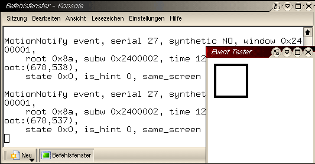

.. selflinux documentation master file, created by
   sphinx-quickstart on Wed Dec 23 13:39:08 2015.
   You can adapt this file completely to your liking, but it should at least
   contain the root `toctree` directive.

X-Window-System
===============

Wheelmouse-Konfiguration
------------------------

Problem
^^^^^^^

Wer unter Linux eine Intellimouse/Wheelmouse benutzen möchte, steht schnell vor dem Problem, dass die Maus sich als 3-Tasten-Maus einstellen lässt, das Rad aber nicht zum Scrollen benutzt werden kann.

XFree86 erkennt standardmäßig eine 3-Tasten-Maus.

Das Ziel der Konfiguration ist es, neben den zwei normalen Tasten, das Rad als 3. Taste, die beiden möglichen Rollbewegungen (auf und ab) des Rades und die zwei an der MS Intellimouse Explorer vorhandenen zusätzlichen Tasten zur Browsersteuerung zu aktivieren. 

XFree Konfiguration
^^^^^^^^^^^^^^^^^^^

Ausgangspunkt ist eine fertige XFree86-Konfiguration, in der nur noch der Maus-Teil angepasst werden soll. Sollte die Maus nicht erkannt worden sein, kann man sie als 3-Tasten-PS/2-Maus deklarieren.

Die MS Intellimouse Explorer lässt sich auch als USB-Maus benutzen. Eine XFree86-Beispielkonfiguration ist weiter unten im Text angegeben.

Die Konfiguration für en XFree86 in /etc/X11/XF86Config-4 ist in Sektionen aufgeteilt. Wir bearbeiten als Root im Editor die Sektion "InputDevice" für unsere Maus. Achtung, es können mehrere "InputDevice"-Einträge vorhanden sein. Es ist sinnvoll, schon bei der X-Konfiguration einen Namen (Identifier) mit Wiedererkennungscharakter zu verwenden. "Generic Mouse" und "Configured Mouse" sind sicher auch leicht zu unterscheiden, doch wir verwenden "Mouse[1]".

Achtung: Die nicht benötigten Sektionen müssen nicht gelöscht werden. Es reicht, sie mit einem # vor der Zeile auszukommentieren, damit sie unwirksam werden. Einer der hier vorgestellten Einträge kann dann zusätzlich eingefügt werden. Damit er wirklich aktiv ist, muss in der Sektion "ServerLayout" eine Zeile mit dem Eintrag
XF86Config

InputDevice     "Mouse[1]"
    

vorhanden sein. Der Identifier ist also nicht nur für den eigenen Überblick wichtig. Die Sektion "InputDevice" für die MS Intellimouse Explorer als PS/2-Maus:
XF86Config

        Section "InputDevice"
          Identifier "Mouse[1]"
          Driver "mouse"
          Option "Protocol" "ExplorerPS/2"
          Option "Device" "/dev/psaux"
          Option "ZAxisMapping" "6 7"
          Option "Buttons" "7"
        EndSection
    

Die Sektion "InputDevice" für die MS Intellimouse Explorer als USB-Maus:
XF86Config (USB-Port)

        Section "InputDevice"
          Identifier "Mouse[1]"
          Driver "mouse"
          Option "Protocol" "IMPS/2"
          Option "Device" "/dev/input/mice"
          Option "ZAxisMapping" "6 7"
          Option "Buttons" "7"
        EndSection
    

Beachtenswert ist hierbei die Option "Device". Klappt /dev/input/mice nicht, kann /dev/mouse oder /dev/usbmouse eventuell weiterhelfen.

Die Sektion "InputDevice" für eine einfache MS IntelliMouse als PS/2-Maus:
XF86Config (MS Intelli Mouse)

        Section "InputDevice"
        Identifier "Mouse[1]"
        Driver "mouse"
        Option "Protocol" "IMPS/2"
        Option "Device" "/dev/psaux"
        Option "ZAxisMapping" "4 5"
        Option "Buttons" "5"
      EndSection
    

Änderungen an der XF86Config-4 benötigen keinen Neustart des Rechners. Damit sie wirksam werden, reicht es, den X-Server neu zu starten. Die Tastenkombination CRTL+ALT+BACKSPACE bei laufendem XFree86 reicht für gewöhnlich, um X zu beenden. X startet anschließend selbst neu, wenn ein Login-Manager wie xdm, kdm oder gdm aktiv ist. Anderenfalls hilft startx weiter. Für IntelliMouse-Modelle von Logitech, etc. ist diese Konfiguration noch nicht getestet. Bestätigungen oder Angaben zu veränderten Einstellungen nehmen wir gern entgegen. 

Testen der Einstellungen
^^^^^^^^^^^^^^^^^^^^^^^^

Zum Testen der Konfiguration wird in einer Konsole (xterm), das Programm xev genutzt.In dem erscheinenden Fenster mit dem Namen "Event Tester" sollte jede Mausbewegungund jeder Tastendruck zu einer Event-Ausgabe in der Konsole führen. Erst wenn jede Taste und das Rollen des Rades in beide Richtungen zu einer Ausgabe führen, kann man sicher sein, dass die Konfiguration erfolgreich war.

xev

Mouse einstellen
^^^^^^^^^^^^^^^^

Damit das Scrollen mit dem Mouserad in allen Applikationen, die diese Funktion unterstützen (Browser, Editoren, etc.) genutzt werden kann, muss in der .xinitrc-Datei im Home-Verzeichnis folgende Zeile eingefügt werden:
.xinitrc

/usr/X11R6/bin/xmodmap -e "pointer = 1 2 3 6 7 4 5"
    

Bei der einfachen MS IntelliMouse mit 5 Tasten, muss der Eintrag so aussehen:
.xinitrc (MS Intelli Mouse mit 5 Tasten)

/usr/X11R6/bin/xmodmap -e "pointer = 1 2 3 4 5"
    

Jetzt wird dieser Befehl bei jedem Start von X aufgerufen und das Scrollen mit dem Mouserad sollte möglich sein.

Einrichten der Vor- und Zurück-Buttons
^^^^^^^^^^^^^^^^^^^^^^^^^^^^^^^^^^^^^^

Wenn alle Tasten laut xev erkannt werden, ist der nächste Schritt, den Zusatztasten der Explorer-Maus ihre Funktion zuzuordnen. Hierfür benutzt man das Programm imwheel, dass die vom X-Server erkannten Signale in Befehle konvertiert.

In /etc/imwheel oder /etc/X11 muss die Datei imwheelrc editiert werden. Das Heimatverzeichnis von imwheel hängt von der benutzten Distribution ab.

Man fügt folgendes ein:
imwheelrc

        ".*"
        None, Up, Alt_L|Left
        None, Down, Alt_L|Right
    

Damit X die Tasten auch diesen Kombinationen zuordnet, fügt man in seine .xinitrc im Heimatverzeichnis die Zeile:
.xinitrc

exec imwheel -k -b "67"
    

ein. Damit sollten diese Tasten auch ihre Funktion erfüllen. 

Schlusswort
^^^^^^^^^^^

Ich weise hiermit darauf hin, dass jeder für eventuelle Schäden an seinem System selbst verantwortlich ist und empfehle dringendst, von den entsprechenden Dateien immer Backups zu machen oder die alten Einträge mit einem #-Zeichen auszukommentieren.
Viel Erfolg! 

Autor

    Nico Golde nion@gmx.net
	
Formatierung

    Matthias Hagedorn matthias.hagedorn@selflinux.org

